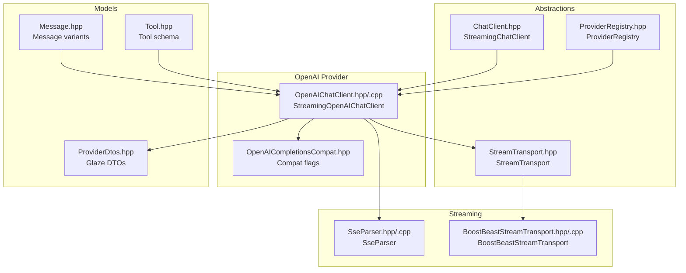
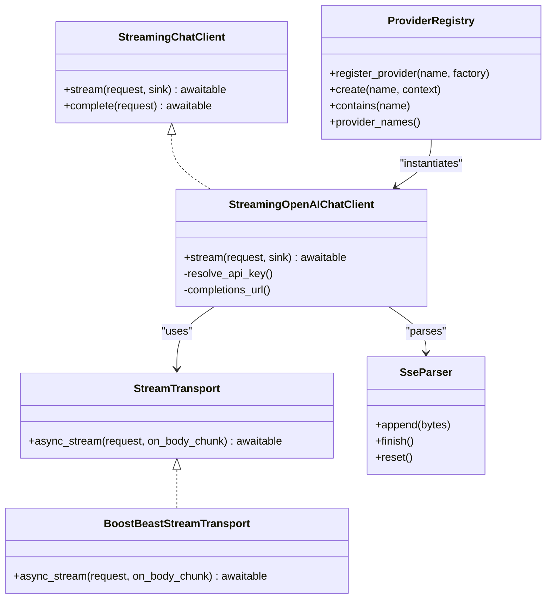
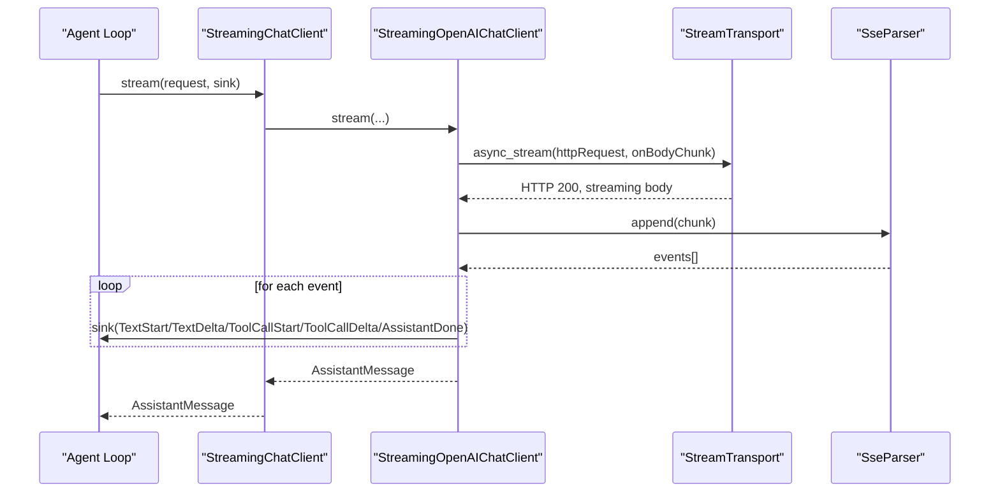
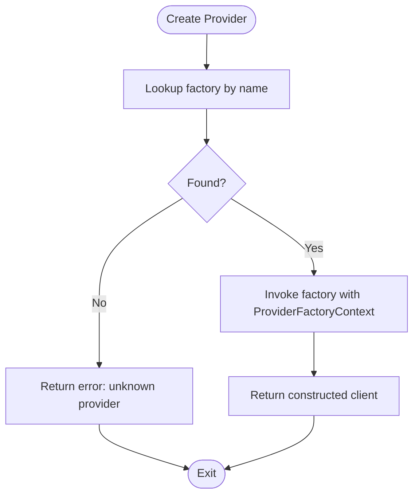
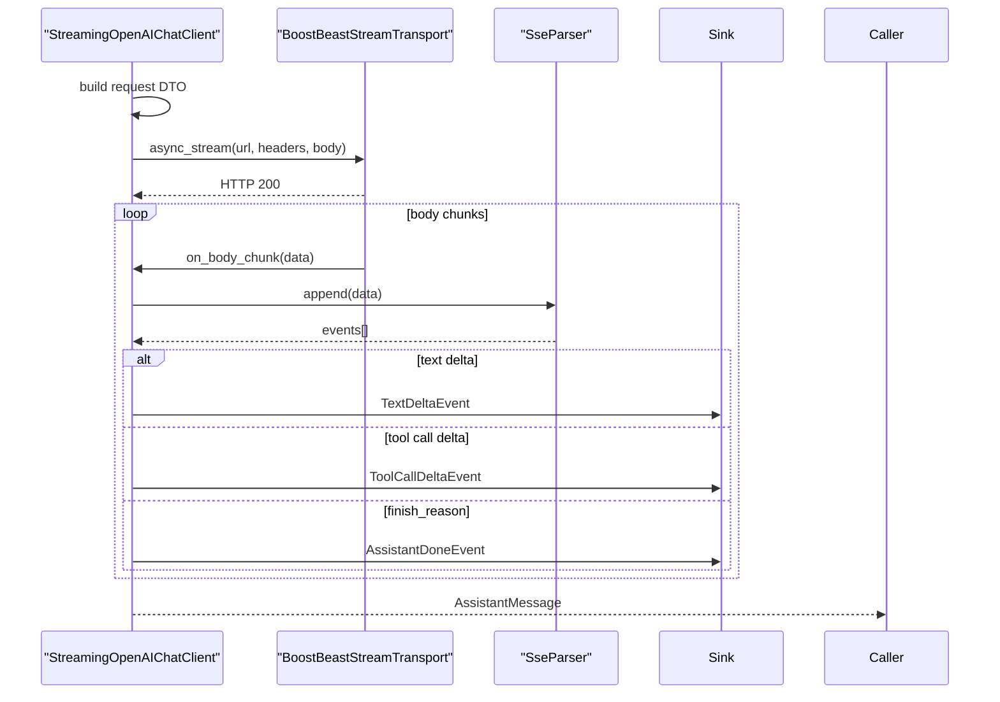
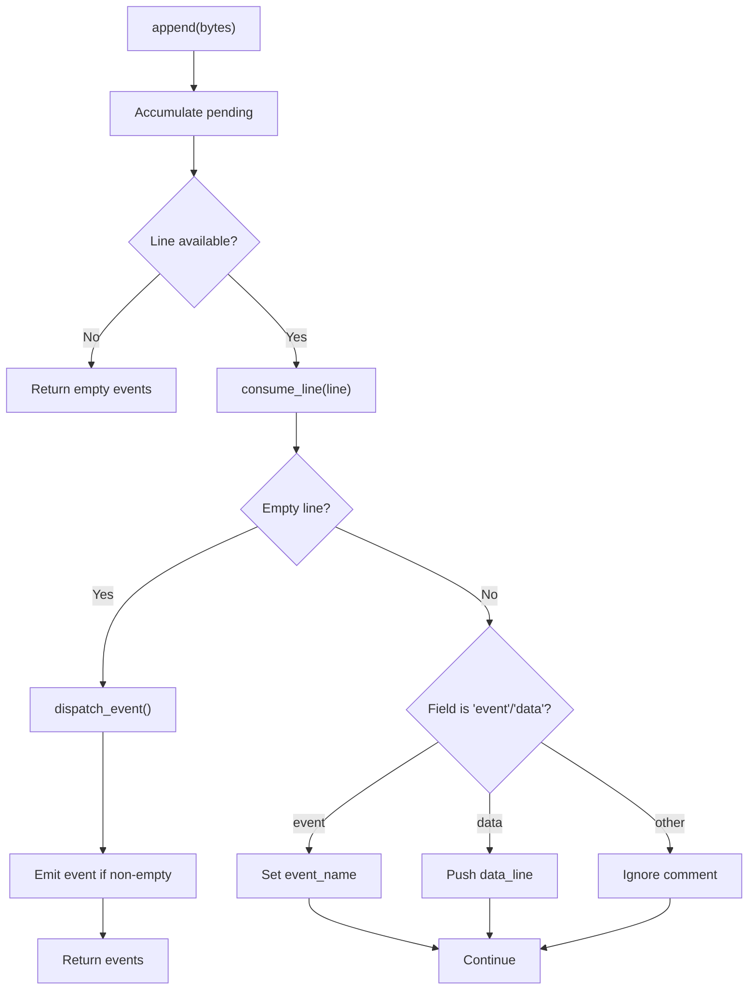
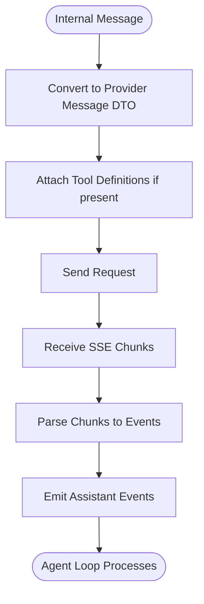
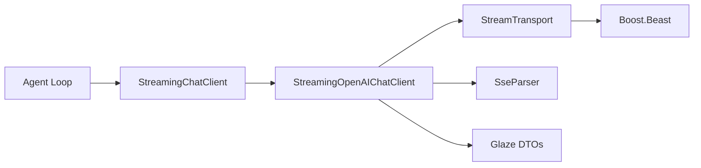

# AI Integration

<cite>
**Referenced Files in This Document**
- [ChatClient.hpp](file://include/cch/ai/ChatClient.hpp)
- [ProviderRegistry.hpp](file://include/cch/ai/ProviderRegistry.hpp)
- [OpenAIChatClient.hpp](file://include/cch/ai/providers/OpenAIChatClient.hpp)
- [OpenAIChatClient.cpp](file://src/ai/providers/OpenAIChatClient.cpp)
- [StreamTransport.hpp](file://include/cch/ai/providers/StreamTransport.hpp)
- [BoostBeastStreamTransport.hpp](file://src/ai/providers/BoostBeastStreamTransport.hpp)
- [BoostBeastStreamTransport.cpp](file://src/ai/providers/BoostBeastStreamTransport.cpp)
- [SseParser.hpp](file://src/ai/providers/SseParser.hpp)
- [SseParser.cpp](file://src/ai/providers/SseParser.cpp)
- [ProviderRegistry.cpp](file://src/ai/ProviderRegistry.cpp)
- [Message.hpp](file://include/cch/ai/Message.hpp)
- [Tool.hpp](file://include/cch/ai/Tool.hpp)
- [ProviderDtos.hpp](file://src/ai/glaze/ProviderDtos.hpp)
</cite>

## Table of Contents
1. [Introduction](#introduction)
2. [Project Structure](#project-structure)
3. [Core Components](#core-components)
4. [Architecture Overview](#architecture-overview)
5. [Detailed Component Analysis](#detailed-component-analysis)
6. [Dependency Analysis](#dependency-analysis)
7. [Performance Considerations](#performance-considerations)
8. [Troubleshooting Guide](#troubleshooting-guide)
9. [Conclusion](#conclusion)
10. [Appendices](#appendices)

## Introduction
This document explains the AI integration subsystem that powers provider-agnostic chat interactions. It focuses on the ChatClient abstraction enabling seamless switching between providers, the OpenAI-compatible provider implementation with streaming, the SSE parser for real-time responses, and the provider registry for configuration and instantiation. It also covers the message processing pipeline, tool schema generation, tool execution triggers via AI responses, authentication and configuration, and error handling strategies.

## Project Structure
The AI integration is organized around a small set of core headers and their implementations:
- Abstractions: ChatClient, ProviderRegistry, StreamTransport
- Providers: OpenAI-compatible client and transport
- Streaming: SSE parsing and HTTP transport
- Messages and tools: Data models and schemas
- Glaze DTOs: Serialization contracts for provider requests and responses

**Diagram sources**
- [ChatClient.hpp:23-34](file://include/cch/ai/ChatClient.hpp#L23-L34)
- [ProviderRegistry.hpp:40-51](file://include/cch/ai/ProviderRegistry.hpp#L40-L51)
- [StreamTransport.hpp:35-42](file://include/cch/ai/providers/StreamTransport.hpp#L35-L42)
- [OpenAIChatClient.hpp:26-40](file://include/cch/ai/providers/OpenAIChatClient.hpp#L26-L40)
- [SseParser.hpp:18-31](file://src/ai/providers/SseParser.hpp#L18-L31)
- [BoostBeastStreamTransport.hpp:7-12](file://src/ai/providers/BoostBeastStreamTransport.hpp#L7-L12)
- [Message.hpp:97-105](file://include/cch/ai/Message.hpp#L97-L105)
- [Tool.hpp:97-101](file://include/cch/ai/Tool.hpp#L97-L101)
- [ProviderDtos.hpp:44-94](file://src/ai/glaze/ProviderDtos.hpp#L44-L94)

**Section sources**
- [ChatClient.hpp:14-36](file://include/cch/ai/ChatClient.hpp#L14-L36)
- [ProviderRegistry.hpp:16-55](file://include/cch/ai/ProviderRegistry.hpp#L16-L55)
- [StreamTransport.hpp:13-44](file://include/cch/ai/providers/StreamTransport.hpp#L13-L44)
- [OpenAIChatClient.hpp:11-42](file://include/cch/ai/providers/OpenAIChatClient.hpp#L11-L42)
- [SseParser.hpp:10-33](file://src/ai/providers/SseParser.hpp#L10-L33)
- [BoostBeastStreamTransport.hpp:1-15](file://src/ai/providers/BoostBeastStreamTransport.hpp#L1-L15)
- [Message.hpp:13-207](file://include/cch/ai/Message.hpp#L13-L207)
- [Tool.hpp:10-103](file://include/cch/ai/Tool.hpp#L10-L103)
- [ProviderDtos.hpp:10-96](file://src/ai/glaze/ProviderDtos.hpp#L10-L96)

## Core Components
- StreamingChatClient: The provider-agnostic interface for streaming chat completions. It exposes a coroutine-based stream method and a convenience complete method.
- ProviderRegistry: Central factory registry for constructing provider clients from a unified configuration context.
- StreamingOpenAIChatClient: An OpenAI-compatible provider implementation that converts internal message/tool schemas to provider DTOs, streams SSE chunks, and emits structured assistant events.
- SseParser: Parses Server-Sent Events from the wire into discrete events, recognizing termination markers.
- StreamTransport and BoostBeastStreamTransport: Transport abstraction and HTTPS/TLS implementation for streaming HTTP bodies.
- Message and Tool models: Strongly typed message variants and tool schema definitions used across the pipeline.
- Glaze DTOs: Structured request/response contracts for provider communication.

Key responsibilities:
- Provider switching: Agent logic depends on StreamingChatClient, not on provider internals.
- Streaming: SSE chunks are parsed and translated into assistant events (text deltas, tool call deltas, completion signals).
- Tool invocation: Tool call payloads are accumulated and validated; agent loop can execute tools upon completion.
- Authentication: API keys resolved from config or environment variables.
- Compatibility: Provider-specific flags control behavior like thinking content handling and usage streaming.

**Section sources**
- [ChatClient.hpp:23-34](file://include/cch/ai/ChatClient.hpp#L23-L34)
- [ProviderRegistry.hpp:40-53](file://include/cch/ai/ProviderRegistry.hpp#L40-L53)
- [OpenAIChatClient.hpp:26-40](file://include/cch/ai/providers/OpenAIChatClient.hpp#L26-L40)
- [SseParser.hpp:18-31](file://src/ai/providers/SseParser.hpp#L18-L31)
- [StreamTransport.hpp:35-42](file://include/cch/ai/providers/StreamTransport.hpp#L35-L42)
- [Message.hpp:97-105](file://include/cch/ai/Message.hpp#L97-L105)
- [Tool.hpp:97-101](file://include/cch/ai/Tool.hpp#L97-L101)
- [ProviderDtos.hpp:44-94](file://src/ai/glaze/ProviderDtos.hpp#L44-L94)

## Architecture Overview
The system separates concerns into a provider-agnostic client interface, a registry-driven factory, a transport layer, and a streaming parser. The OpenAI-compatible provider composes these pieces to deliver a consistent streaming experience.

**Diagram sources**
- [ChatClient.hpp:23-34](file://include/cch/ai/ChatClient.hpp#L23-L34)
- [ProviderRegistry.hpp:40-51](file://include/cch/ai/ProviderRegistry.hpp#L40-L51)
- [OpenAIChatClient.hpp:26-40](file://include/cch/ai/providers/OpenAIChatClient.hpp#L26-L40)
- [StreamTransport.hpp:35-42](file://include/cch/ai/providers/StreamTransport.hpp#L35-L42)
- [BoostBeastStreamTransport.hpp:7-12](file://src/ai/providers/BoostBeastStreamTransport.hpp#L7-L12)
- [SseParser.hpp:18-31](file://src/ai/providers/SseParser.hpp#L18-L31)

## Detailed Component Analysis

### ChatClient Abstraction
- Purpose: Provide a single interface for streaming chat completions regardless of provider.
- Key elements:
  - StreamChatRequest: carries context and model selection.
  - AssistantEventSink: callback invoked for each assistant event (text start/delta/end, tool call start/delta/end, completion).
  - StreamingChatClient: pure virtual streaming interface; complete() delegates to stream with a no-op sink.

**Diagram sources**
- [ChatClient.hpp:23-34](file://include/cch/ai/ChatClient.hpp#L23-L34)
- [OpenAIChatClient.cpp:263-497](file://src/ai/providers/OpenAIChatClient.cpp#L263-L497)
- [StreamTransport.hpp:39-41](file://include/cch/ai/providers/StreamTransport.hpp#L39-L41)
- [SseParser.cpp:18-65](file://src/ai/providers/SseParser.cpp#L18-L65)

**Section sources**
- [ChatClient.hpp:16-34](file://include/cch/ai/ChatClient.hpp#L16-L34)

### Provider Registry and Factory Pattern
- ProviderFactoryContext: central configuration capturing provider identity, API identity, model, base URL, API key, environment variable, timeout, and compatibility flags.
- ProviderRegistry: stores named factories and constructs clients given a context.
- Default registry registers:
  - "openai-compatible": builds StreamingOpenAIChatClient with BoostBeastStreamTransport and OpenAICompletionsCompat.
  - "fake": scripted fake client for testing.

**Diagram sources**
- [ProviderRegistry.hpp:40-51](file://include/cch/ai/ProviderRegistry.hpp#L40-L51)
- [ProviderRegistry.cpp:26-32](file://src/ai/ProviderRegistry.cpp#L26-L32)
- [ProviderRegistry.cpp:47-82](file://src/ai/ProviderRegistry.cpp#L47-L82)

**Section sources**
- [ProviderRegistry.hpp:18-51](file://include/cch/ai/ProviderRegistry.hpp#L18-L51)
- [ProviderRegistry.cpp:12-82](file://src/ai/ProviderRegistry.cpp#L12-L82)

### OpenAI-Compatible Provider Implementation
- StreamingOpenAIChatClient:
  - Converts internal messages and tools to provider DTOs.
  - Builds HTTP request with Authorization, Content-Type, Accept (text/event-stream), optional org/project headers.
  - Streams body via transport, parses SSE chunks, accumulates text and tool calls, emits assistant events, validates tool arguments, and finalizes message.
  - Handles provider compatibility flags (thinking format, usage streaming, tool result naming, etc.).

**Diagram sources**
- [OpenAIChatClient.cpp:263-497](file://src/ai/providers/OpenAIChatClient.cpp#L263-L497)
- [BoostBeastStreamTransport.cpp:91-218](file://src/ai/providers/BoostBeastStreamTransport.cpp#L91-L218)
- [SseParser.cpp:18-65](file://src/ai/providers/SseParser.cpp#L18-L65)

**Section sources**
- [OpenAIChatClient.hpp:26-40](file://include/cch/ai/providers/OpenAIChatClient.hpp#L26-L40)
- [OpenAIChatClient.cpp:260-526](file://src/ai/providers/OpenAIChatClient.cpp#L260-L526)

### SSE Parser for Streaming Responses
- SseParser:
  - Accumulates bytes until newlines, splits into lines, handles field:value semantics, collects data lines, and emits events.
  - Recognizes [DONE] sentinel to mark stream completion.
  - Enforces a maximum pending buffer size to prevent memory exhaustion.

**Diagram sources**
- [SseParser.cpp:18-116](file://src/ai/providers/SseParser.cpp#L18-L116)

**Section sources**
- [SseParser.hpp:18-31](file://src/ai/providers/SseParser.hpp#L18-L31)
- [SseParser.cpp:18-116](file://src/ai/providers/SseParser.cpp#L18-L116)

### Message Processing Pipeline and Tool Schema Generation
- Message conversion:
  - Internal message variants are converted to provider messages, preserving roles and content, and optionally adding tool calls or tool results.
- Tool schema:
  - Tools are represented with names, descriptions, and JSON schema parameters.
  - Provider tool DTOs are generated from Tool definitions for inclusion in requests.
- Assistant content:
  - Assistant messages carry text content, tool calls, stop reasons, usage, and timestamps.

**Diagram sources**
- [Message.hpp:107-135](file://include/cch/ai/Message.hpp#L107-L135)
- [Tool.hpp:97-101](file://include/cch/ai/Tool.hpp#L97-L101)
- [ProviderDtos.hpp:12-30](file://src/ai/glaze/ProviderDtos.hpp#L12-L30)
- [OpenAIChatClient.cpp:106-162](file://src/ai/providers/OpenAIChatClient.cpp#L106-L162)

**Section sources**
- [Message.hpp:31-62](file://include/cch/ai/Message.hpp#L31-L62)
- [Tool.hpp:17-95](file://include/cch/ai/Tool.hpp#L17-L95)
- [ProviderDtos.hpp:12-57](file://src/ai/glaze/ProviderDtos.hpp#L12-L57)
- [OpenAIChatClient.cpp:106-213](file://src/ai/providers/OpenAIChatClient.cpp#L106-L213)

### Authentication and Provider Configuration
- API key resolution:
  - StreamingOpenAIChatClient resolves API key from explicit config or environment variable.
- Base URL and endpoint:
  - Computed to ensure proper trailing slashes and append "/v1/chat/completions".
- Headers:
  - Authorization, Content-Type, Accept (SSE), plus optional organization/project headers.
- ProviderFactoryContext:
  - Captures provider identity, API identity, model, base URL, API key, environment variable, timeout, and compatibility flags.

**Section sources**
- [OpenAIChatClient.cpp:499-526](file://src/ai/providers/OpenAIChatClient.cpp#L499-L526)
- [OpenAIChatClient.cpp:276-289](file://src/ai/providers/OpenAIChatClient.cpp#L276-L289)
- [ProviderRegistry.hpp:21-34](file://include/cch/ai/ProviderRegistry.hpp#L21-L34)

### Practical Examples

- Configure an OpenAI-compatible provider:
  - Use ProviderRegistry::create with a ProviderFactoryContext specifying provider name, model, base URL, API key, and compatibility flags.
  - The default registry registers "openai-compatible" and "fake".

- Handle streaming responses:
  - Call StreamingChatClient::stream with a request and an AssistantEventSink to receive incremental text and tool call updates.

- Implement a custom provider:
  - Implement StreamingChatClient and StreamTransport.
  - Register a factory under a unique name in ProviderRegistry.

- Tool execution:
  - Upon receiving ToolCallEndEvent, agent loop parses arguments and invokes tool handlers.

**Section sources**
- [ProviderRegistry.cpp:47-82](file://src/ai/ProviderRegistry.cpp#L47-L82)
- [ChatClient.hpp:27-33](file://include/cch/ai/ChatClient.hpp#L27-L33)
- [OpenAIChatClient.cpp:465-496](file://src/ai/providers/OpenAIChatClient.cpp#L465-L496)

## Dependency Analysis
- Cohesion:
  - StreamingOpenAIChatClient encapsulates provider-specific logic while adhering to the StreamingChatClient contract.
  - SseParser and StreamTransport are cohesive units for streaming I/O.
- Coupling:
  - OpenAI provider depends on Glaze DTOs and SSE parser; transport is injected via StreamTransport.
  - Agent loop depends only on StreamingChatClient, minimizing coupling to provider internals.
- External dependencies:
  - Boost.Beast for TLS/HTTP streaming.
  - Glaze for JSON serialization/deserialization.

**Diagram sources**
- [OpenAIChatClient.cpp:263-497](file://src/ai/providers/OpenAIChatClient.cpp#L263-L497)
- [BoostBeastStreamTransport.cpp:91-218](file://src/ai/providers/BoostBeastStreamTransport.cpp#L91-L218)
- [SseParser.cpp:18-65](file://src/ai/providers/SseParser.cpp#L18-L65)
- [ProviderDtos.hpp:44-94](file://src/ai/glaze/ProviderDtos.hpp#L44-L94)

**Section sources**
- [OpenAIChatClient.cpp:260-526](file://src/ai/providers/OpenAIChatClient.cpp#L260-L526)
- [BoostBeastStreamTransport.cpp:91-218](file://src/ai/providers/BoostBeastStreamTransport.cpp#L91-L218)
- [SseParser.cpp:18-116](file://src/ai/providers/SseParser.cpp#L18-L116)
- [ProviderDtos.hpp:44-94](file://src/ai/glaze/ProviderDtos.hpp#L44-L94)

## Performance Considerations
- Streaming efficiency:
  - SSE parsing buffers are bounded to avoid excessive memory usage.
  - Transport reads body in fixed-size chunks and streams to the callback immediately.
- JSON parsing:
  - Glaze is used for fast, schema-tolerant deserialization of streaming chunks.
- Concurrency:
  - Coroutines enable cooperative scheduling; avoid blocking operations in sinks to maintain responsiveness.

[No sources needed since this section provides general guidance]

## Troubleshooting Guide
Common issues and resolutions:
- Missing API key:
  - Ensure ProviderFactoryContext.api_key is set or the configured environment variable is exported.
- Non-success HTTP status:
  - Verify base URL, model, and headers; check provider quotas and permissions.
- SSE stream errors:
  - Exceeding buffer limits or malformed lines cause errors; inspect provider logs and adjust parsing thresholds.
- Tool call parsing failures:
  - Malformed arguments lead to invalid tool calls; validate tool schemas and provider compatibility flags.
- Network timeouts:
  - Increase timeout in ProviderFactoryContext or reduce payload sizes.

**Section sources**
- [OpenAIChatClient.cpp:499-512](file://src/ai/providers/OpenAIChatClient.cpp#L499-L512)
- [BoostBeastStreamTransport.cpp:162-167](file://src/ai/providers/BoostBeastStreamTransport.cpp#L162-L167)
- [SseParser.cpp:18-24](file://src/ai/providers/SseParser.cpp#L18-L24)
- [OpenAIChatClient.cpp:475-487](file://src/ai/providers/OpenAIChatClient.cpp#L475-L487)

## Conclusion
The AI integration provides a clean, provider-agnostic interface for streaming chat completions. By composing a registry, transport, and SSE parser, it supports pluggable providers while keeping agent logic unchanged. The OpenAI-compatible implementation demonstrates robust streaming, tool schema generation, and structured event emission suitable for triggering tool execution.

[No sources needed since this section summarizes without analyzing specific files]

## Appendices

### Configuration Reference
- ProviderFactoryContext fields:
  - provider_registry_name: registry key for adapter construction.
  - provider: provider identity written into assistant messages.
  - api: API identity for assistant messages.
  - model: default model to use.
  - base_url: provider base URL; defaults to a public endpoint.
  - api_key: explicit API key.
  - api_key_env: environment variable name for API key.
  - timeout: request timeout.
  - openai_compat: compatibility flags controlling behavior.

**Section sources**
- [ProviderRegistry.hpp:21-34](file://include/cch/ai/ProviderRegistry.hpp#L21-L34)