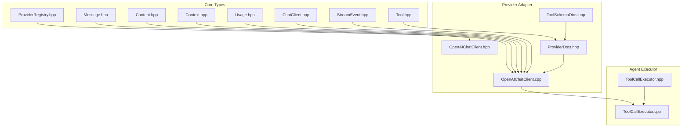
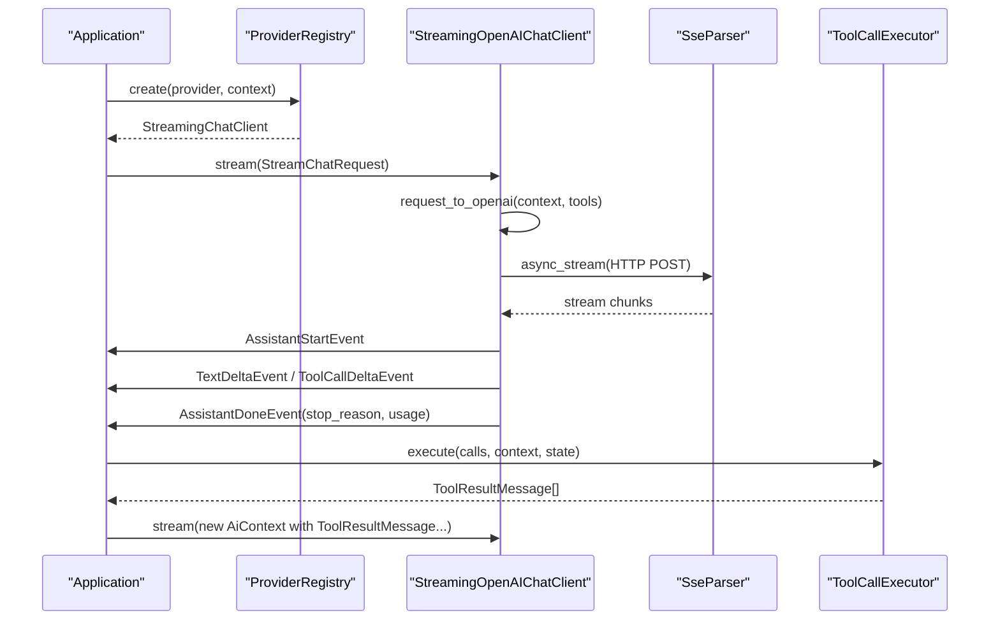
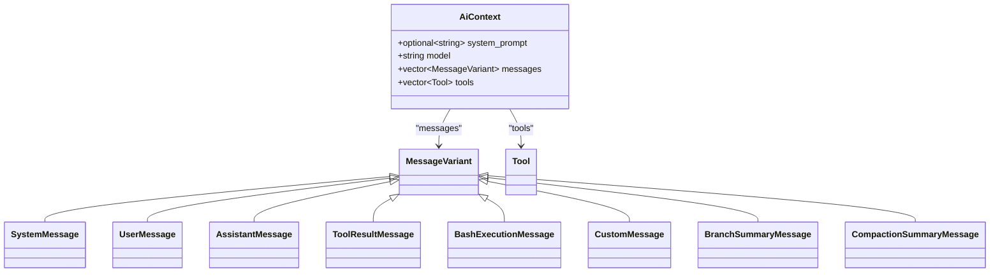
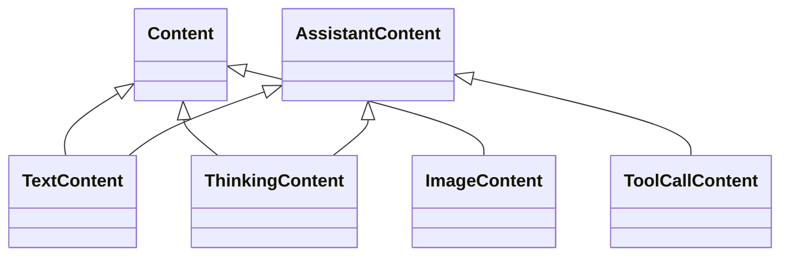
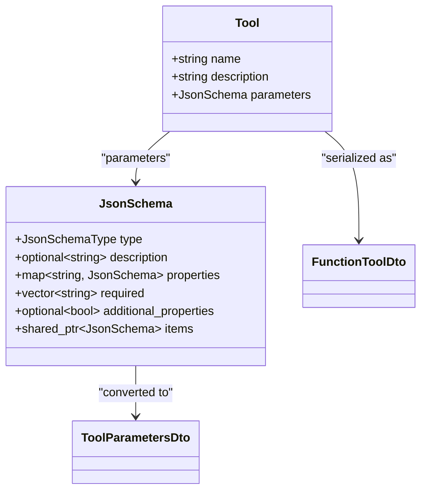
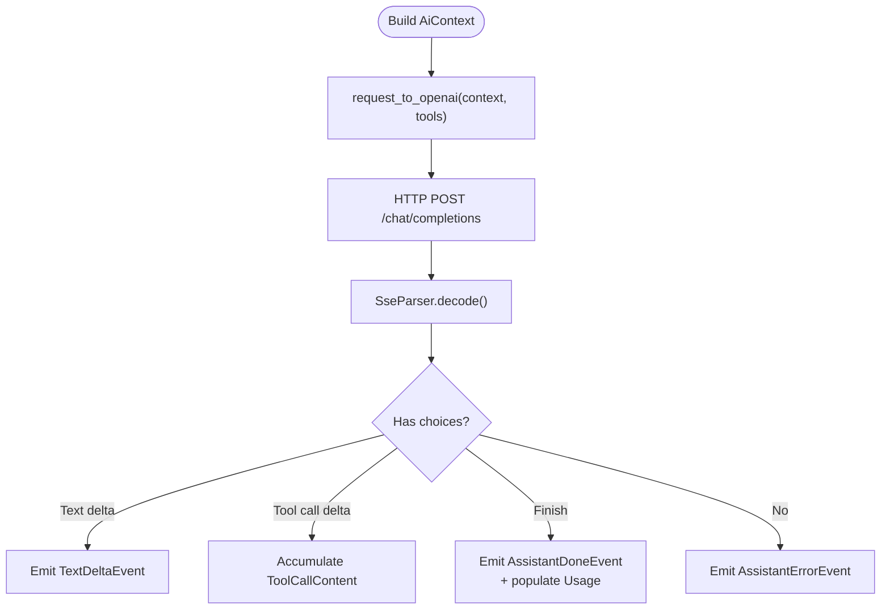
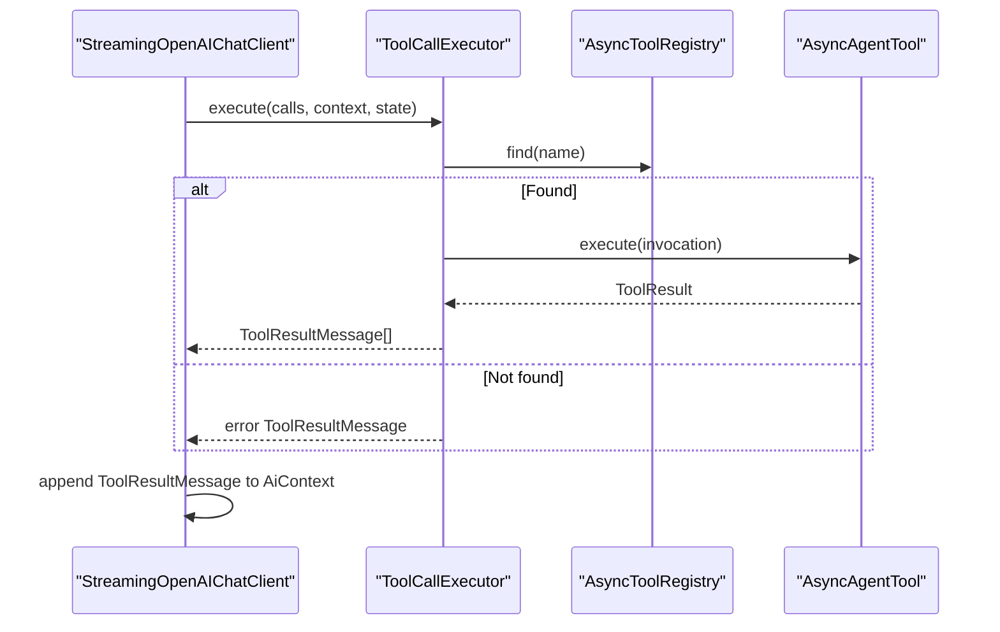
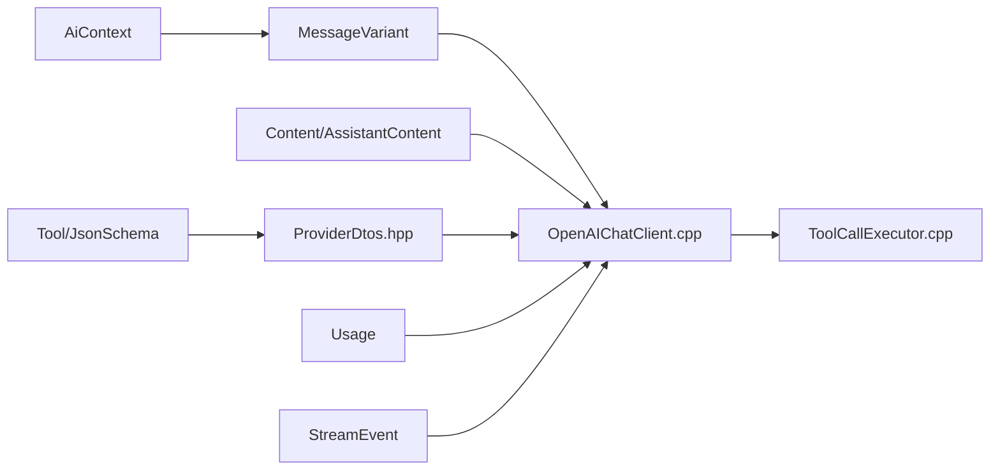

# Message Processing Pipeline

<cite>
**Referenced Files in This Document**
- [Message.hpp](file://include/cch/ai/Message.hpp)
- [Content.hpp](file://include/cch/ai/Content.hpp)
- [Context.hpp](file://include/cch/ai/Context.hpp)
- [Usage.hpp](file://include/cch/ai/Usage.hpp)
- [Tool.hpp](file://include/cch/ai/Tool.hpp)
- [ChatClient.hpp](file://include/cch/ai/ChatClient.hpp)
- [StreamEvent.hpp](file://include/cch/ai/StreamEvent.hpp)
- [ProviderRegistry.hpp](file://include/cch/ai/ProviderRegistry.hpp)
- [OpenAIChatClient.hpp](file://include/cch/ai/providers/OpenAIChatClient.hpp)
- [OpenAIChatClient.cpp](file://src/ai/providers/OpenAIChatClient.cpp)
- [ProviderDtos.hpp](file://src/ai/glaze/ProviderDtos.hpp)
- [ToolSchemaDtos.hpp](file://src/ai/glaze/ToolSchemaDtos.hpp)
- [ToolCallExecutor.hpp](file://include/cch/agent/ToolCallExecutor.hpp)
- [ToolCallExecutor.cpp](file://src/agent/ToolCallExecutor.cpp)
</cite>

## Table of Contents
1. [Introduction](#introduction)
2. [Project Structure](#project-structure)
3. [Core Components](#core-components)
4. [Architecture Overview](#architecture-overview)
5. [Detailed Component Analysis](#detailed-component-analysis)
6. [Dependency Analysis](#dependency-analysis)
7. [Performance Considerations](#performance-considerations)
8. [Troubleshooting Guide](#troubleshooting-guide)
9. [Conclusion](#conclusion)
10. [Appendices](#appendices)

## Introduction
This document explains the AI message processing pipeline used to build, transform, and consume conversational exchanges with AI providers. It covers:
- Message and Context structures representing conversation history and system state
- The Content union type and how it supports multiple content formats
- The transformation pipeline converting internal representations to provider-specific formats
- Tool schema generation and how AI models receive structured tool descriptions
- Token usage tracking and stop reasons
- Validation, sanitization, and error handling across the pipeline
- Practical examples for building messages, handling tool call responses, and maintaining context across turns

## Project Structure
The message processing pipeline spans header-only representation types and provider-specific adapters:
- Core data types define messages, content variants, usage, and tool schemas
- Provider adapters convert internal structures to provider DTOs and stream events
- Executors translate tool calls into tool results and update context accordingly

**Diagram sources**
- [Message.hpp:1-208](file://include/cch/ai/Message.hpp#L1-L208)
- [Content.hpp:1-91](file://include/cch/ai/Content.hpp#L1-L91)
- [Context.hpp:1-20](file://include/cch/ai/Context.hpp#L1-L20)
- [Tool.hpp:1-104](file://include/cch/ai/Tool.hpp#L1-L104)
- [Usage.hpp:1-55](file://include/cch/ai/Usage.hpp#L1-L55)
- [ChatClient.hpp:1-37](file://include/cch/ai/ChatClient.hpp#L1-L37)
- [StreamEvent.hpp:1-93](file://include/cch/ai/StreamEvent.hpp#L1-L93)
- [ProviderRegistry.hpp:1-56](file://include/cch/ai/ProviderRegistry.hpp#L1-L56)
- [OpenAIChatClient.hpp:1-43](file://include/cch/ai/providers/OpenAIChatClient.hpp#L1-L43)
- [OpenAIChatClient.cpp:1-529](file://src/ai/providers/OpenAIChatClient.cpp#L1-L529)
- [ProviderDtos.hpp:1-97](file://src/ai/glaze/ProviderDtos.hpp#L1-L97)
- [ToolSchemaDtos.hpp:1-146](file://src/ai/glaze/ToolSchemaDtos.hpp#L1-L146)
- [ToolCallExecutor.hpp](file://include/cch/agent/ToolCallExecutor.hpp)
- [ToolCallExecutor.cpp:1-517](file://src/agent/ToolCallExecutor.cpp#L1-L517)

**Section sources**
- [Message.hpp:1-208](file://include/cch/ai/Message.hpp#L1-L208)
- [Content.hpp:1-91](file://include/cch/ai/Content.hpp#L1-L91)
- [Context.hpp:1-20](file://include/cch/ai/Context.hpp#L1-L20)
- [Tool.hpp:1-104](file://include/cch/ai/Tool.hpp#L1-L104)
- [Usage.hpp:1-55](file://include/cch/ai/Usage.hpp#L1-L55)
- [ChatClient.hpp:1-37](file://include/cch/ai/ChatClient.hpp#L1-L37)
- [StreamEvent.hpp:1-93](file://include/cch/ai/StreamEvent.hpp#L1-L93)
- [ProviderRegistry.hpp:1-56](file://include/cch/ai/ProviderRegistry.hpp#L1-L56)
- [OpenAIChatClient.hpp:1-43](file://include/cch/ai/providers/OpenAIChatClient.hpp#L1-L43)
- [OpenAIChatClient.cpp:1-529](file://src/ai/providers/OpenAIChatClient.cpp#L1-L529)
- [ProviderDtos.hpp:1-97](file://src/ai/glaze/ProviderDtos.hpp#L1-L97)
- [ToolSchemaDtos.hpp:1-146](file://src/ai/glaze/ToolSchemaDtos.hpp#L1-L146)
- [ToolCallExecutor.hpp](file://include/cch/agent/ToolCallExecutor.hpp)
- [ToolCallExecutor.cpp:1-517](file://src/agent/ToolCallExecutor.cpp#L1-L517)

## Core Components
- Message and Context
  - AiContext carries a system prompt, target model, message list, and tool list
  - MessageVariant unions all message types: System, User, Assistant, ToolResult, and extended runtime messages
  - Extended runtime messages (e.g., BashExecution, Custom, BranchSummary, CompactionSummary) are converted to UserMessage for provider transport
- Content union
  - Content supports text, thinking, and image payloads for user messages
  - AssistantContent adds ToolCallContent for assistant responses
  - Helper constructors and extractors simplify building and reading content
- Tool schema
  - Tool describes function name, description, and a JSON Schema for parameters
  - JsonSchema supports nested objects, arrays, primitives, and optional metadata
  - Tool schema DTOs serialize to provider-friendly function tool descriptors
- Usage and stop reasons
  - Usage tracks input/output tokens, cache metrics, and total tokens
  - AssistantStopReason enumerates stop conditions surfaced by providers

**Section sources**
- [Context.hpp:12-17](file://include/cch/ai/Context.hpp#L12-L17)
- [Message.hpp:31-105](file://include/cch/ai/Message.hpp#L31-L105)
- [Content.hpp:11-39](file://include/cch/ai/Content.hpp#L11-L39)
- [Tool.hpp:97-101](file://include/cch/ai/Tool.hpp#L97-L101)
- [Usage.hpp:17-34](file://include/cch/ai/Usage.hpp#L17-L34)
- [Message.hpp:107-205](file://include/cch/ai/Message.hpp#L107-L205)

## Architecture Overview
The pipeline transforms internal AiContext into provider requests, streams assistant responses as structured events, parses tool calls, executes tools, and re-enters the loop with tool results.

**Diagram sources**
- [ProviderRegistry.hpp:40-51](file://include/cch/ai/ProviderRegistry.hpp#L40-L51)
- [OpenAIChatClient.cpp:260-497](file://src/ai/providers/OpenAIChatClient.cpp#L260-L497)
- [OpenAIChatClient.cpp:164-213](file://src/ai/providers/OpenAIChatClient.cpp#L164-L213)
- [StreamEvent.hpp:78-91](file://include/cch/ai/StreamEvent.hpp#L78-L91)
- [ToolCallExecutor.cpp:123-143](file://src/agent/ToolCallExecutor.cpp#L123-L143)

## Detailed Component Analysis

### Message and Context Structures
- AiContext
  - Holds system_prompt, model, messages (MessageVariant), and tools
  - Used as the primary input to chat clients
- MessageVariant and message types
  - SystemMessage: role "system" with content string
  - UserMessage: role "user" with vector of Content
  - AssistantMessage: role "assistant" with vector of AssistantContent, plus provider/model metadata, usage, stop_reason, diagnostics
  - ToolResultMessage: role "tool" with tool_call_id and tool_name, plus content and is_error flag
  - Extended runtime messages are converted to UserMessage for provider transport
- Helpers
  - Constructors for quick creation of text-based messages
  - Conversion helpers transform extended runtime messages into user-facing text

**Diagram sources**
- [Context.hpp:12-17](file://include/cch/ai/Context.hpp#L12-L17)
- [Message.hpp:97-105](file://include/cch/ai/Message.hpp#L97-L105)
- [Message.hpp:31-62](file://include/cch/ai/Message.hpp#L31-L62)

**Section sources**
- [Context.hpp:12-17](file://include/cch/ai/Context.hpp#L12-L17)
- [Message.hpp:31-105](file://include/cch/ai/Message.hpp#L31-L105)
- [Message.hpp:107-205](file://include/cch/ai/Message.hpp#L107-L205)

### Content Union Type
- Content supports:
  - TextContent: text payload and optional signature
  - ThinkingContent: thinking content with optional signature and redacted flag
  - ImageContent: base64-like data and MIME type
- AssistantContent extends Content with ToolCallContent:
  - ToolCallContent: id, name, raw_arguments, parsed arguments, validity, and optional argument_error
- Helpers:
  - Constructors for each content type
  - Extractors to assemble a single text string from content vectors

**Diagram sources**
- [Content.hpp:11-39](file://include/cch/ai/Content.hpp#L11-L39)

**Section sources**
- [Content.hpp:11-39](file://include/cch/ai/Content.hpp#L11-L39)
- [Content.hpp:41-67](file://include/cch/ai/Content.hpp#L41-L67)
- [Content.hpp:69-88](file://include/cch/ai/Content.hpp#L69-L88)

### Tool Schema Generation
- Tool describes a function with name, description, and parameters schema
- JsonSchema supports object, string, integer, number, boolean, array, and null types
- Tool schema DTOs convert between Tool and provider-friendly function descriptors
- Provider adapters serialize tools into provider requests

**Diagram sources**
- [Tool.hpp:97-101](file://include/cch/ai/Tool.hpp#L97-L101)
- [Tool.hpp:27-95](file://include/cch/ai/Tool.hpp#L27-L95)
- [ToolSchemaDtos.hpp:26-30](file://src/ai/glaze/ToolSchemaDtos.hpp#L26-L30)
- [ToolSchemaDtos.hpp:77-96](file://src/ai/glaze/ToolSchemaDtos.hpp#L77-L96)

**Section sources**
- [Tool.hpp:97-101](file://include/cch/ai/Tool.hpp#L97-L101)
- [ToolSchemaDtos.hpp:77-96](file://src/ai/glaze/ToolSchemaDtos.hpp#L77-L96)
- [ToolSchemaDtos.hpp:133-143](file://src/ai/glaze/ToolSchemaDtos.hpp#L133-L143)

### Message Transformation Pipeline
- Internal to provider conversion
  - message_to_openai converts MessageVariant to OpenAIChatMessageDto
  - request_to_openai builds OpenAIChatRequestDto from AiContext, applying provider compatibility flags
  - Extended runtime messages are transformed to user-facing text via helper functions
- Streaming consumption
  - SseParser decodes server-sent events
  - Assistant stream events are emitted for text deltas, tool call deltas, and completion
  - Usage is populated from streaming usage payloads

**Diagram sources**
- [OpenAIChatClient.cpp:164-213](file://src/ai/providers/OpenAIChatClient.cpp#L164-L213)
- [OpenAIChatClient.cpp:106-162](file://src/ai/providers/OpenAIChatClient.cpp#L106-L162)
- [OpenAIChatClient.cpp:299-497](file://src/ai/providers/OpenAIChatClient.cpp#L299-L497)
- [ProviderDtos.hpp:44-57](file://src/ai/glaze/ProviderDtos.hpp#L44-L57)
- [ProviderDtos.hpp:89-94](file://src/ai/glaze/ProviderDtos.hpp#L89-L94)

**Section sources**
- [OpenAIChatClient.cpp:106-162](file://src/ai/providers/OpenAIChatClient.cpp#L106-L162)
- [OpenAIChatClient.cpp:164-213](file://src/ai/providers/OpenAIChatClient.cpp#L164-L213)
- [OpenAIChatClient.cpp:299-497](file://src/ai/providers/OpenAIChatClient.cpp#L299-L497)
- [ProviderDtos.hpp:32-57](file://src/ai/glaze/ProviderDtos.hpp#L32-L57)
- [ProviderDtos.hpp:89-94](file://src/ai/glaze/ProviderDtos.hpp#L89-L94)

### Tool Call Handling and Execution
- Parsing tool calls
  - Streamed tool call deltas are accumulated by index
  - Raw arguments are concatenated and parsed into structured JSON
  - On invalid arguments, arguments_valid is set false with argument_error populated
- Execution modes
  - Sequential vs parallel execution determined by tool mode or configuration
  - Before/after hooks can block or modify tool execution outcomes
- Producing tool results
  - ToolResultMessage includes tool_call_id, tool_name, content, details, and is_error
  - Results are appended to context and streamed back to the provider

**Diagram sources**
- [OpenAIChatClient.cpp:373-414](file://src/ai/providers/OpenAIChatClient.cpp#L373-L414)
- [ToolCallExecutor.cpp:123-143](file://src/agent/ToolCallExecutor.cpp#L123-L143)
- [ToolCallExecutor.cpp:155-249](file://src/agent/ToolCallExecutor.cpp#L155-L249)
- [ToolCallExecutor.cpp:252-514](file://src/agent/ToolCallExecutor.cpp#L252-L514)

**Section sources**
- [OpenAIChatClient.cpp:373-414](file://src/ai/providers/OpenAIChatClient.cpp#L373-L414)
- [ToolCallExecutor.cpp:123-143](file://src/agent/ToolCallExecutor.cpp#L123-L143)
- [ToolCallExecutor.cpp:155-249](file://src/agent/ToolCallExecutor.cpp#L155-L249)
- [ToolCallExecutor.cpp:252-514](file://src/agent/ToolCallExecutor.cpp#L252-L514)

### Usage Tracking and Context Window Management
- Usage
  - AssistantMessage accumulates Usage from provider streaming payloads
  - Usage includes input/output tokens, cache metrics, and total tokens
- Context window management
  - Extended runtime messages may include flags to exclude entries from context
  - Provider adapters skip excluded entries when building requests
  - Summaries (branch and compaction) are injected as user messages to preserve context while reducing token count

**Section sources**
- [Usage.hpp:17-25](file://include/cch/ai/Usage.hpp#L17-L25)
- [OpenAIChatClient.cpp:175-194](file://src/ai/providers/OpenAIChatClient.cpp#L175-L194)
- [Message.hpp:139-189](file://include/cch/ai/Message.hpp#L139-L189)

### Validation, Sanitization, and Error Handling
- Input validation
  - ToolCallExecutor validates arguments and marks invalid calls with argument_error
  - Provider adapters enforce presence of essential fields (id/name) for tool calls
- Error propagation
  - AssistantErrorEvent is emitted when provider streams end prematurely or payloads are empty
  - Tool execution errors are captured and returned as ToolResultMessage with is_error=true
- Diagnostics
  - AssistantMessage can carry diagnostics and error_message for deeper inspection

**Section sources**
- [OpenAIChatClient.cpp:443-458](file://src/ai/providers/OpenAIChatClient.cpp#L443-L458)
- [OpenAIChatClient.cpp:467-487](file://src/ai/providers/OpenAIChatClient.cpp#L467-L487)
- [ToolCallExecutor.cpp:41-55](file://src/agent/ToolCallExecutor.cpp#L41-L55)
- [Message.hpp:48-52](file://include/cch/ai/Message.hpp#L48-L52)

### Examples

- Constructing a basic user text message
  - Use the helper to create a UserMessage containing a single text block
  - Reference: [Message.hpp:107-112](file://include/cch/ai/Message.hpp#L107-L112)

- Building an assistant text response
  - Create an AssistantMessage with a text block and set stop_reason appropriately
  - Reference: [Message.hpp:114-120](file://include/cch/ai/Message.hpp#L114-L120)

- Creating a tool result message
  - Build a ToolResultMessage with tool_call_id, tool_name, and content; mark is_error when appropriate
  - Reference: [Message.hpp:122-135](file://include/cch/ai/Message.hpp#L122-L135)

- Handling tool call responses
  - Accumulate tool call deltas, parse arguments, and produce ToolResultMessage
  - Reference: [OpenAIChatClient.cpp:373-414](file://src/ai/providers/OpenAIChatClient.cpp#L373-L414), [ToolCallExecutor.cpp:155-249](file://src/agent/ToolCallExecutor.cpp#L155-L249)

- Managing conversation context across turns
  - Append ToolResultMessage to AiContext and stream again
  - Reference: [OpenAIChatClient.cpp:175-194](file://src/ai/providers/OpenAIChatClient.cpp#L175-L194), [ToolCallExecutor.cpp:241-249](file://src/agent/ToolCallExecutor.cpp#L241-L249)

## Dependency Analysis
The pipeline exhibits clean separation of concerns:
- Core types (Message, Content, Context, Tool, Usage) are provider-agnostic
- Provider adapters depend on core types and DTOs to serialize requests and parse responses
- Executors depend on tool registries and core types to materialize tool results

**Diagram sources**
- [Context.hpp:12-17](file://include/cch/ai/Context.hpp#L12-L17)
- [Message.hpp:97-105](file://include/cch/ai/Message.hpp#L97-L105)
- [Content.hpp:37-39](file://include/cch/ai/Content.hpp#L37-L39)
- [Tool.hpp:97-101](file://include/cch/ai/Tool.hpp#L97-L101)
- [ProviderDtos.hpp:12-30](file://src/ai/glaze/ProviderDtos.hpp#L12-L30)
- [Usage.hpp:17-25](file://include/cch/ai/Usage.hpp#L17-L25)
- [StreamEvent.hpp:78-91](file://include/cch/ai/StreamEvent.hpp#L78-L91)
- [OpenAIChatClient.cpp:106-162](file://src/ai/providers/OpenAIChatClient.cpp#L106-L162)
- [ToolCallExecutor.cpp:123-143](file://src/agent/ToolCallExecutor.cpp#L123-L143)

**Section sources**
- [OpenAIChatClient.cpp:106-162](file://src/ai/providers/OpenAIChatClient.cpp#L106-L162)
- [ProviderDtos.hpp:12-30](file://src/ai/glaze/ProviderDtos.hpp#L12-L30)
- [ToolCallExecutor.cpp:123-143](file://src/agent/ToolCallExecutor.cpp#L123-L143)

## Performance Considerations
- Streaming parsing
  - SSE decoding and incremental text/tool call accumulation minimize latency and memory overhead
- Argument parsing
  - Concatenating raw arguments and parsing once reduces repeated JSON work
- Parallel tool execution
  - Batch execution with concurrency limits improves throughput when tools are independent
- Context pruning
  - Using summaries and excluding non-essential entries helps manage context window growth

## Troubleshooting Guide
- Provider stream ends without content or finish_reason
  - The client emits an AssistantErrorEvent; check network connectivity and provider quotas
  - Reference: [OpenAIChatClient.cpp:443-458](file://src/ai/providers/OpenAIChatClient.cpp#L443-L458)
- Malformed tool call arguments
  - arguments_valid=false with argument_error indicates JSON parse failure; validate tool call payloads
  - Reference: [OpenAIChatClient.cpp:475-487](file://src/ai/providers/OpenAIChatClient.cpp#L475-L487)
- Unknown tool during execution
  - ToolResultMessage is produced with is_error=true; ensure tool registration matches assistant calls
  - Reference: [ToolCallExecutor.cpp:163-165](file://src/agent/ToolCallExecutor.cpp#L163-L165)
- Missing API key
  - Resolve API key from config or environment variable; otherwise streaming fails early
  - Reference: [OpenAIChatClient.cpp:499-512](file://src/ai/providers/OpenAIChatClient.cpp#L499-L512)

**Section sources**
- [OpenAIChatClient.cpp:443-458](file://src/ai/providers/OpenAIChatClient.cpp#L443-L458)
- [OpenAIChatClient.cpp:475-487](file://src/ai/providers/OpenAIChatClient.cpp#L475-L487)
- [ToolCallExecutor.cpp:163-165](file://src/agent/ToolCallExecutor.cpp#L163-L165)
- [OpenAIChatClient.cpp:499-512](file://src/ai/providers/OpenAIChatClient.cpp#L499-L512)

## Conclusion
The message processing pipeline cleanly separates internal representations from provider-specific serialization and streaming. It supports multimodal content, structured tool schemas, robust error handling, and efficient tool execution. By leveraging usage tracking, diagnostic metadata, and context-aware transformations, it scales reliably across multi-turn conversations and diverse provider ecosystems.

## Appendices

### API and Data Model Summary
- AiContext
  - Fields: system_prompt, model, messages, tools
  - References: [Context.hpp:12-17](file://include/cch/ai/Context.hpp#L12-L17)
- MessageVariant
  - Variants: SystemMessage, UserMessage, AssistantMessage, ToolResultMessage, BashExecutionMessage, CustomMessage, BranchSummaryMessage, CompactionSummaryMessage
  - References: [Message.hpp:97-105](file://include/cch/ai/Message.hpp#L97-L105)
- Content and AssistantContent
  - Content: TextContent, ThinkingContent, ImageContent
  - AssistantContent: TextContent, ThinkingContent, ToolCallContent
  - References: [Content.hpp:11-39](file://include/cch/ai/Content.hpp#L11-L39)
- Tool and JsonSchema
  - Tool: name, description, parameters (JsonSchema)
  - JsonSchema: type, description, properties, required, additional_properties, items
  - References: [Tool.hpp:97-101](file://include/cch/ai/Tool.hpp#L97-L101), [Tool.hpp:27-95](file://include/cch/ai/Tool.hpp#L27-L95)
- Usage and Stop Reason
  - Usage: input, output, cache_read, cache_write, total_tokens, cost
  - AssistantStopReason: Stop, ToolUse, Length, Error, Aborted, Unknown
  - References: [Usage.hpp:17-34](file://include/cch/ai/Usage.hpp#L17-L34), [Usage.hpp:9-25](file://include/cch/ai/Usage.hpp#L9-L25)