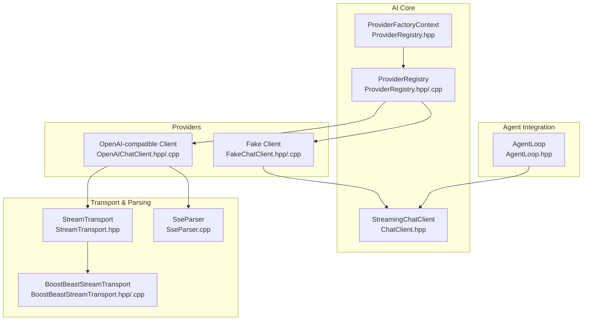
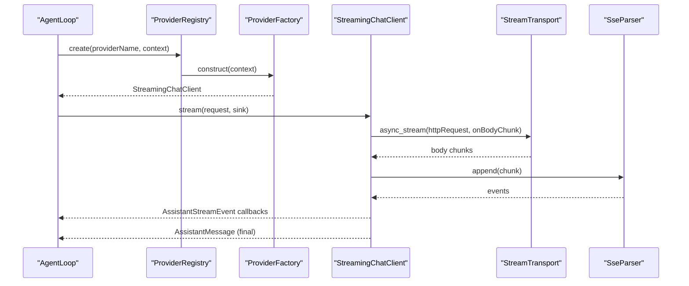
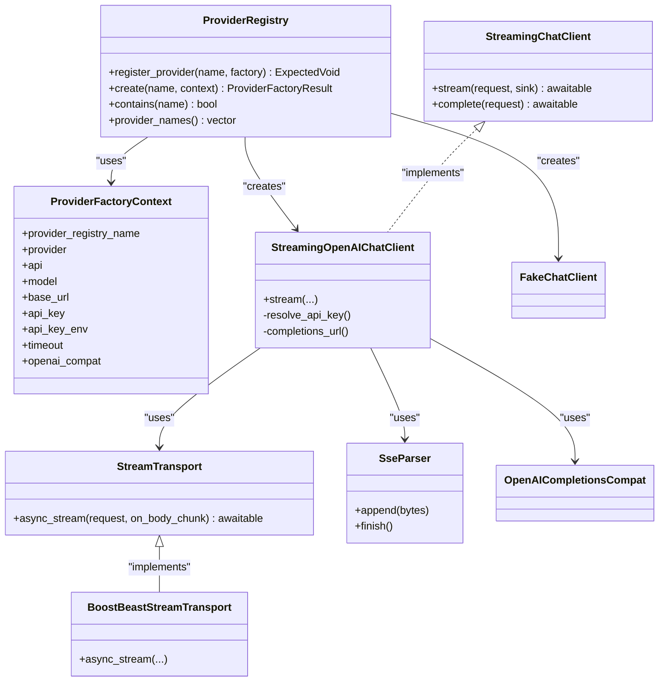

# Provider Architecture

<cite>
**Referenced Files in This Document**
- [ChatClient.hpp](file://include/cch/ai/ChatClient.hpp)
- [ProviderRegistry.hpp](file://include/cch/ai/ProviderRegistry.hpp)
- [ProviderRegistry.cpp](file://src/ai/ProviderRegistry.cpp)
- [OpenAIChatClient.hpp](file://include/cch/ai/providers/OpenAIChatClient.hpp)
- [OpenAIChatClient.cpp](file://src/ai/providers/OpenAIChatClient.cpp)
- [StreamTransport.hpp](file://include/cch/ai/providers/StreamTransport.hpp)
- [BoostBeastStreamTransport.hpp](file://src/ai/providers/BoostBeastStreamTransport.hpp)
- [BoostBeastStreamTransport.cpp](file://src/ai/providers/BoostBeastStreamTransport.cpp)
- [SseParser.cpp](file://src/ai/providers/SseParser.cpp)
- [OpenAICompletionsCompat.hpp](file://include/cch/ai/providers/OpenAICompletionsCompat.hpp)
- [FakeChatClient.hpp](file://src/ai/providers/FakeChatClient.hpp)
- [FakeChatClient.cpp](file://src/ai/providers/FakeChatClient.cpp)
- [ProviderConfigResolution.cpp](file://src/coding_agent/ProviderConfigResolution.cpp)
- [AgentLoop.hpp](file://include/cch/agent/AgentLoop.hpp)
</cite>

## Table of Contents
1. [Introduction](#introduction)
2. [Project Structure](#project-structure)
3. [Core Components](#core-components)
4. [Architecture Overview](#architecture-overview)
5. [Detailed Component Analysis](#detailed-component-analysis)
6. [Dependency Analysis](#dependency-analysis)
7. [Performance Considerations](#performance-considerations)
8. [Troubleshooting Guide](#troubleshooting-guide)
9. [Conclusion](#conclusion)
10. [Appendices](#appendices)

## Introduction
This document explains the AI provider architecture that powers the agent system. It focuses on the StreamingChatClient interface, the provider registry, the factory pattern, and how providers integrate with the agent loop. It also covers provider-specific configuration, authentication, error handling, and practical steps to implement and register custom providers.

## Project Structure
The provider architecture spans several header and implementation files under include/cch/ai and src/ai. The key areas are:
- StreamingChatClient interface and request/response contracts
- Provider registry and factory registration
- Concrete provider implementations (OpenAI-compatible and a scripted fake)
- Transport abstraction for streaming HTTP requests
- SSE parsing for incremental streaming events
- Compatibility flags for provider differences
- Agent integration via the agent loop

**Diagram sources**
- [ChatClient.hpp:23-34](file://include/cch/ai/ChatClient.hpp#L23-L34)
- [ProviderRegistry.hpp:40-51](file://include/cch/ai/ProviderRegistry.hpp#L40-L51)
- [ProviderRegistry.cpp:47-83](file://src/ai/ProviderRegistry.cpp#L47-L83)
- [OpenAIChatClient.hpp:26-40](file://include/cch/ai/providers/OpenAIChatClient.hpp#L26-L40)
- [OpenAIChatClient.cpp:260-497](file://src/ai/providers/OpenAIChatClient.cpp#L260-L497)
- [StreamTransport.hpp:35-42](file://include/cch/ai/providers/StreamTransport.hpp#L35-L42)
- [BoostBeastStreamTransport.hpp:7-12](file://src/ai/providers/BoostBeastStreamTransport.hpp#L7-L12)
- [SseParser.cpp:18-65](file://src/ai/providers/SseParser.cpp#L18-L65)
- [AgentLoop.hpp:16-36](file://include/cch/agent/AgentLoop.hpp#L16-L36)

**Section sources**
- [ChatClient.hpp:14-36](file://include/cch/ai/ChatClient.hpp#L14-L36)
- [ProviderRegistry.hpp:18-51](file://include/cch/ai/ProviderRegistry.hpp#L18-L51)
- [ProviderRegistry.cpp:10-85](file://src/ai/ProviderRegistry.cpp#L10-L85)
- [OpenAIChatClient.hpp:11-42](file://include/cch/ai/providers/OpenAIChatClient.hpp#L11-L42)
- [OpenAIChatClient.cpp:17-528](file://src/ai/providers/OpenAIChatClient.cpp#L17-L528)
- [StreamTransport.hpp:13-44](file://include/cch/ai/providers/StreamTransport.hpp#L13-L44)
- [BoostBeastStreamTransport.cpp:22-220](file://src/ai/providers/BoostBeastStreamTransport.cpp#L22-L220)
- [SseParser.cpp:5-118](file://src/ai/providers/SseParser.cpp#L5-L118)
- [OpenAICompletionsCompat.hpp:25-40](file://include/cch/ai/providers/OpenAICompletionsCompat.hpp#L25-L40)
- [FakeChatClient.cpp:24-118](file://src/ai/providers/FakeChatClient.cpp#L24-L118)
- [AgentLoop.hpp:14-36](file://include/cch/agent/AgentLoop.hpp#L14-L36)

## Core Components
- StreamingChatClient: Defines the streaming chat contract with a coroutine-based stream method and a convenience complete method. It emits AssistantStreamEvent callbacks to the caller.
- ProviderRegistry: Manages provider factories keyed by name, enabling registration and creation of provider instances from a shared ProviderFactoryContext.
- ProviderFactoryContext: Captures static provider configuration such as provider identity, API type, model, base URL, API key, environment variable, timeout, and compatibility flags.
- OpenAI-compatible provider: Implements StreamingChatClient using a StreamTransport to send HTTP requests and parse SSE chunks into AssistantStreamEvent notifications.
- Transport abstraction: StreamTransport defines a uniform async_stream interface; BoostBeastStreamTransport implements HTTPS streaming with TLS verification and body chunk handling.
- SSE parsing: SseParser converts raw SSE frames into structured events for incremental processing.
- Compatibility flags: OpenAICompletionsCompat encapsulates provider-specific behaviors to normalize request/response handling across providers.
- Fake provider: A scripted client for testing and demos that generates deterministic assistant messages and tool calls.

**Section sources**
- [ChatClient.hpp:23-34](file://include/cch/ai/ChatClient.hpp#L23-L34)
- [ProviderRegistry.hpp:40-51](file://include/cch/ai/ProviderRegistry.hpp#L40-L51)
- [ProviderRegistry.hpp:18-34](file://include/cch/ai/ProviderRegistry.hpp#L18-L34)
- [OpenAIChatClient.hpp:26-40](file://include/cch/ai/providers/OpenAIChatClient.hpp#L26-L40)
- [StreamTransport.hpp:35-42](file://include/cch/ai/providers/StreamTransport.hpp#L35-L42)
- [BoostBeastStreamTransport.hpp:7-12](file://src/ai/providers/BoostBeastStreamTransport.hpp#L7-L12)
- [SseParser.cpp:18-65](file://src/ai/providers/SseParser.cpp#L18-L65)
- [OpenAICompletionsCompat.hpp:25-40](file://include/cch/ai/providers/OpenAICompletionsCompat.hpp#L25-L40)
- [FakeChatClient.cpp:24-118](file://src/ai/providers/FakeChatClient.cpp#L24-L118)

## Architecture Overview
The provider architecture follows a layered design:
- The agent loop depends on StreamingChatClient to obtain assistant responses.
- ProviderRegistry resolves a named provider and constructs it using ProviderFactoryContext.
- Concrete providers implement StreamingChatClient and rely on StreamTransport for HTTP streaming.
- SSE parsing transforms server-sent events into AssistantStreamEvent callbacks.
- Compatibility flags adapt behavior across providers.

**Diagram sources**
- [AgentLoop.hpp:20-27](file://include/cch/agent/AgentLoop.hpp#L20-L27)
- [ProviderRegistry.cpp:26-31](file://src/ai/ProviderRegistry.cpp#L26-L31)
- [OpenAIChatClient.cpp:263-497](file://src/ai/providers/OpenAIChatClient.cpp#L263-L497)
- [StreamTransport.hpp:39-41](file://include/cch/ai/providers/StreamTransport.hpp#L39-L41)
- [SseParser.cpp:18-65](file://src/ai/providers/SseParser.cpp#L18-L65)

## Detailed Component Analysis

### StreamingChatClient Interface
StreamingChatClient defines:
- A coroutine-based stream method that accepts a StreamChatRequest and an AssistantEventSink callback.
- A convenience complete method that invokes stream with an empty sink.
- The interface ensures providers can emit incremental assistant events and return a final AssistantMessage.

Key behaviors:
- Sink-driven streaming allows the caller to process text deltas and tool call arguments incrementally.
- The interface is provider-agnostic and decouples the agent loop from provider specifics.

**Section sources**
- [ChatClient.hpp:23-34](file://include/cch/ai/ChatClient.hpp#L23-L34)

### Provider Registry and Factory Pattern
ProviderRegistry centralizes provider instantiation:
- register_provider(name, factory): Registers a provider factory under a unique name.
- create(name, context): Retrieves and invokes the factory to produce a StreamingChatClient instance.
- contains(name) and provider_names(): Utility queries for availability and discovery.

Default registry includes:
- An “openai-compatible” provider constructed with a StreamTransport and OpenAI-compatible configuration.
- A “fake” provider for testing.

Factory pattern benefits:
- Encourages adding new providers without changing agent code.
- Supports dynamic provider selection at runtime via registry lookups.

**Section sources**
- [ProviderRegistry.hpp:40-51](file://include/cch/ai/ProviderRegistry.hpp#L40-L51)
- [ProviderRegistry.cpp:12-32](file://src/ai/ProviderRegistry.cpp#L12-L32)
- [ProviderRegistry.cpp:47-83](file://src/ai/ProviderRegistry.cpp#L47-L83)

### OpenAI-Compatible Provider Implementation
StreamingOpenAIChatClient implements StreamingChatClient:
- Uses a StreamTransport to send HTTP requests to the provider’s completions endpoint.
- Parses SSE chunks via SseParser and emits AssistantStreamEvent notifications.
- Applies OpenAICompletionsCompat flags to normalize behavior across providers.
- Resolves API keys from configuration or environment variables.

Configuration highlights:
- Base URL, model, organization, project, timeout, and compatibility flags.
- Authentication via Authorization header with bearer token.

Error handling:
- Emits AssistantErrorEvent when underlying transport or parsing fails.
- Validates terminal conditions (SSE [DONE] or finish_reason) and assistant payload presence.

**Section sources**
- [OpenAIChatClient.hpp:26-40](file://include/cch/ai/providers/OpenAIChatClient.hpp#L26-L40)
- [OpenAIChatClient.cpp:263-497](file://src/ai/providers/OpenAIChatClient.cpp#L263-L497)
- [OpenAIChatClient.cpp:499-526](file://src/ai/providers/OpenAIChatClient.cpp#L499-L526)
- [OpenAICompletionsCompat.hpp:25-40](file://include/cch/ai/providers/OpenAICompletionsCompat.hpp#L25-L40)

### Transport Abstraction and HTTP Streaming
StreamTransport defines:
- async_stream(request, on_body_chunk) returning a coroutine with StreamResponse.
- StreamRequest/StreamResponse structures for headers, body, and timeouts.

BoostBeastStreamTransport implements:
- HTTPS URL parsing and TLS handshake with hostname verification.
- Streaming HTTP body handling and chunk delivery to the provided handler.
- Robust error mapping for timeouts, network errors, and non-success HTTP statuses.

**Section sources**
- [StreamTransport.hpp:35-42](file://include/cch/ai/providers/StreamTransport.hpp#L35-L42)
- [BoostBeastStreamTransport.cpp:91-218](file://src/ai/providers/BoostBeastStreamTransport.cpp#L91-L218)

### SSE Parsing for Incremental Events
SseParser:
- Accumulates incoming bytes and splits into lines.
- Emits structured events when encountering blank lines or [DONE].
- Enforces a maximum pending buffer size to prevent memory exhaustion.

**Section sources**
- [SseParser.cpp:18-65](file://src/ai/providers/SseParser.cpp#L18-L65)

### Compatibility Flags
OpenAICompletionsCompat:
- Enables optional behaviors such as developer role support, usage reporting in streaming, tool result naming, and reasoning/thinking content handling.
- Allows adapting request DTO generation and assistant content extraction to provider quirks.

**Section sources**
- [OpenAICompletionsCompat.hpp:25-40](file://include/cch/ai/providers/OpenAICompletionsCompat.hpp#L25-L40)

### Fake Provider for Testing
Scripted fake provider:
- Generates deterministic assistant messages and tool calls based on prompts.
- Useful for demos and unit tests without external provider calls.

**Section sources**
- [FakeChatClient.cpp:24-118](file://src/ai/providers/FakeChatClient.cpp#L24-L118)

### Agent Integration
AgentLoop:
- Accepts a StreamingChatClient reference and delegates chat interactions to it.
- Integrates with tool registries and lifecycle hooks to orchestrate multi-turn conversations.

**Section sources**
- [AgentLoop.hpp:16-36](file://include/cch/agent/AgentLoop.hpp#L16-L36)

## Dependency Analysis
The provider architecture exhibits low coupling and high cohesion:
- AgentLoop depends only on StreamingChatClient, enabling runtime provider switching.
- ProviderRegistry isolates provider construction concerns.
- OpenAI-compatible provider composes StreamTransport and SseParser internally.
- Compatibility flags minimize branching in provider logic.

**Diagram sources**
- [ChatClient.hpp:23-34](file://include/cch/ai/ChatClient.hpp#L23-L34)
- [ProviderRegistry.hpp:40-51](file://include/cch/ai/ProviderRegistry.hpp#L40-L51)
- [ProviderRegistry.hpp:18-34](file://include/cch/ai/ProviderRegistry.hpp#L18-L34)
- [OpenAIChatClient.hpp:26-40](file://include/cch/ai/providers/OpenAIChatClient.hpp#L26-L40)
- [StreamTransport.hpp:35-42](file://include/cch/ai/providers/StreamTransport.hpp#L35-L42)
- [BoostBeastStreamTransport.hpp:7-12](file://src/ai/providers/BoostBeastStreamTransport.hpp#L7-L12)
- [SseParser.cpp:18-65](file://src/ai/providers/SseParser.cpp#L18-L65)
- [OpenAICompletionsCompat.hpp:25-40](file://include/cch/ai/providers/OpenAICompletionsCompat.hpp#L25-L40)
- [FakeChatClient.cpp:24-118](file://src/ai/providers/FakeChatClient.cpp#L24-L118)

**Section sources**
- [ProviderRegistry.cpp:47-83](file://src/ai/ProviderRegistry.cpp#L47-L83)
- [OpenAIChatClient.cpp:260-497](file://src/ai/providers/OpenAIChatClient.cpp#L260-L497)
- [BoostBeastStreamTransport.cpp:91-218](file://src/ai/providers/BoostBeastStreamTransport.cpp#L91-L218)

## Performance Considerations
- Streaming: The architecture streams responses incrementally, reducing latency and memory overhead compared to buffering entire responses.
- Transport timeouts: Configure ProviderFactoryContext.timeout to balance responsiveness and long-running requests.
- Buffer limits: SseParser enforces a maximum pending buffer size to avoid excessive memory usage during long streams.
- TLS overhead: BoostBeastStreamTransport performs TLS handshake and verification; keep connections warm where feasible and reuse transports when appropriate.
- Backpressure: The sink-based design allows callers to process events asynchronously, preventing blocking.

[No sources needed since this section provides general guidance]

## Troubleshooting Guide
Common issues and resolutions:
- Unknown provider: Ensure the provider name exists in the registry and was registered via register_provider.
- Missing API key: The OpenAI-compatible provider resolves API keys from configuration or environment variables; verify the configured environment variable is set.
- Non-success HTTP status: The transport maps non-2xx responses to provider errors; check base URL, credentials, and provider quotas.
- SSE stream termination: The provider validates terminal conditions; if absent, it emits an error indicating premature termination.
- Tool call parsing: Malformed tool call arguments lead to validation errors; confirm provider compatibility flags and payload correctness.

Operational tips:
- Use the fake provider for local development and testing.
- Adjust ProviderFactoryContext.base_url and model to match your provider’s capabilities.
- Enable usage reporting in streaming if supported by the provider.

**Section sources**
- [ProviderRegistry.cpp:26-31](file://src/ai/ProviderRegistry.cpp#L26-L31)
- [OpenAIChatClient.cpp:499-512](file://src/ai/providers/OpenAIChatClient.cpp#L499-L512)
- [BoostBeastStreamTransport.cpp:162-167](file://src/ai/providers/BoostBeastStreamTransport.cpp#L162-L167)
- [OpenAIChatClient.cpp:443-458](file://src/ai/providers/OpenAIChatClient.cpp#L443-L458)
- [SseParser.cpp:18-25](file://src/ai/providers/SseParser.cpp#L18-L25)

## Conclusion
The provider architecture cleanly separates concerns between the agent loop, provider registry, and concrete provider implementations. The StreamingChatClient interface and ProviderRegistry enable dynamic provider selection and straightforward extensibility. The transport and SSE layers provide robust, incremental streaming with strong error handling. Compatibility flags further improve cross-provider parity, while the fake provider simplifies development and testing.

[No sources needed since this section summarizes without analyzing specific files]

## Appendices

### Practical Examples

- Implementing a custom provider:
  - Derive from StreamingChatClient and implement stream(request, sink).
  - Use StreamTransport to perform HTTP streaming and SseParser to parse incremental events.
  - Emit AssistantStreamEvent notifications and return an AssistantMessage on completion.
  - Reference implementations:
    - [OpenAIChatClient.hpp:26-40](file://include/cch/ai/providers/OpenAIChatClient.hpp#L26-L40)
    - [OpenAIChatClient.cpp:263-497](file://src/ai/providers/OpenAIChatClient.cpp#L263-L497)
    - [StreamTransport.hpp:35-42](file://include/cch/ai/providers/StreamTransport.hpp#L35-L42)
    - [SseParser.cpp:18-65](file://src/ai/providers/SseParser.cpp#L18-L65)

- Registering a provider with the registry:
  - Call ProviderRegistry::register_provider with a unique name and a factory lambda that constructs your provider using ProviderFactoryContext.
  - Reference:
    - [ProviderRegistry.cpp:47-83](file://src/ai/ProviderRegistry.cpp#L47-L83)

- Switching providers at runtime:
  - Resolve provider settings using configuration resolution utilities and pass the desired provider name to the registry’s create method.
  - Reference:
    - [ProviderConfigResolution.cpp:35-95](file://src/coding_agent/ProviderConfigResolution.cpp#L35-L95)

- Provider-specific configuration and authentication:
  - ProviderFactoryContext supports provider identity, API type, model, base URL, API key, environment variable, timeout, and compatibility flags.
  - OpenAI-compatible provider supports organization/project headers and bearer token authentication.
  - Reference:
    - [ProviderRegistry.hpp:18-34](file://include/cch/ai/ProviderRegistry.hpp#L18-L34)
    - [OpenAIChatClient.cpp:276-289](file://src/ai/providers/OpenAIChatClient.cpp#L276-L289)
    - [OpenAICompletionsCompat.hpp:25-40](file://include/cch/ai/providers/OpenAICompletionsCompat.hpp#L25-L40)