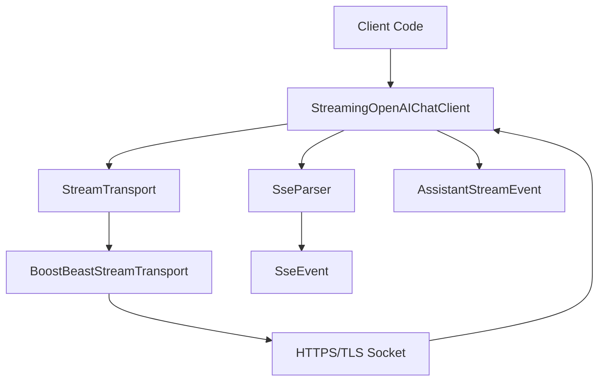
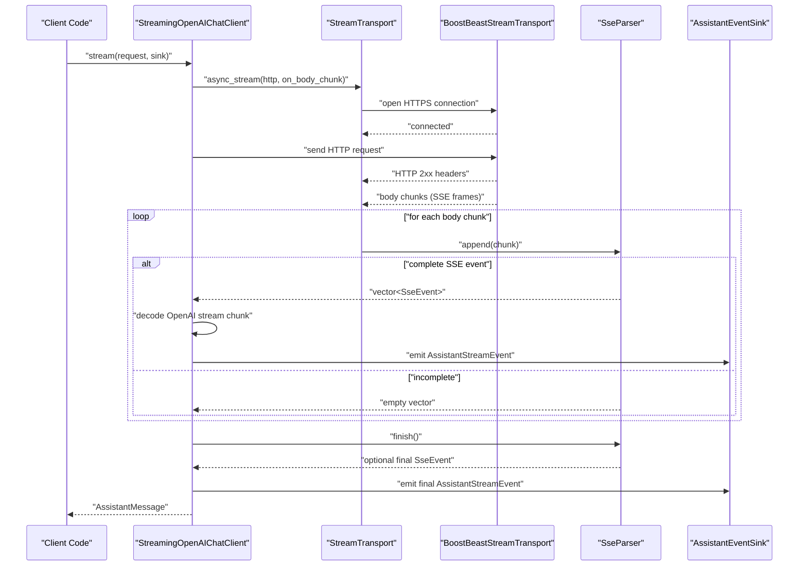
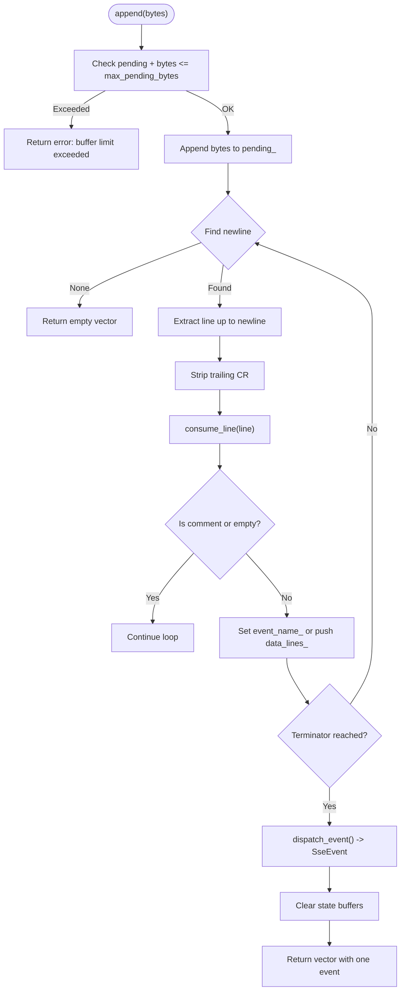
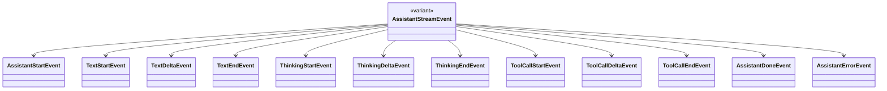
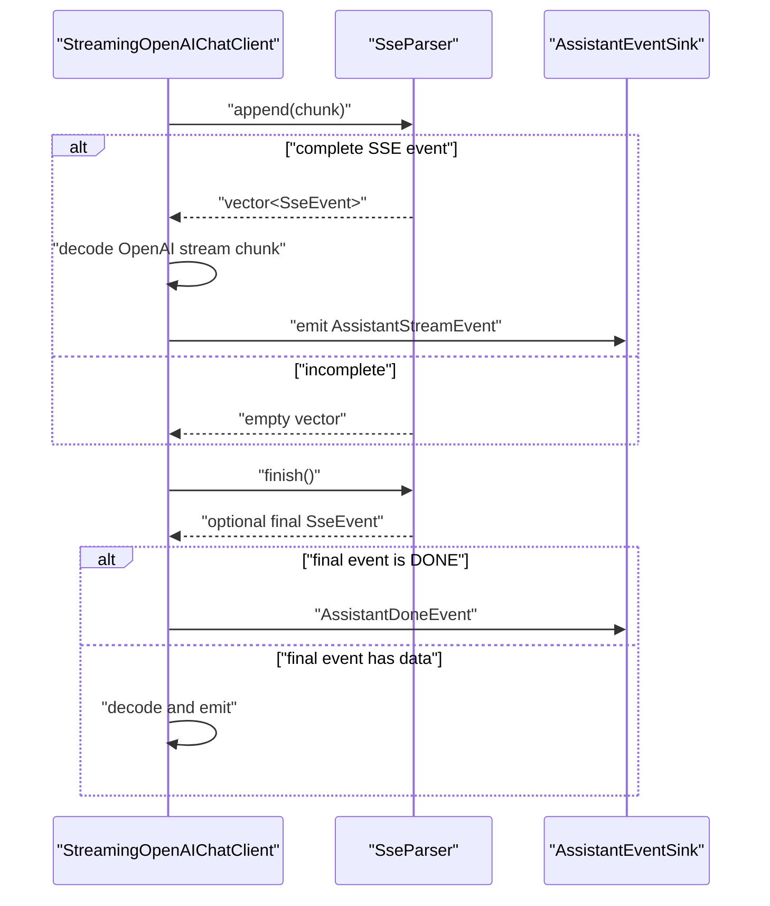
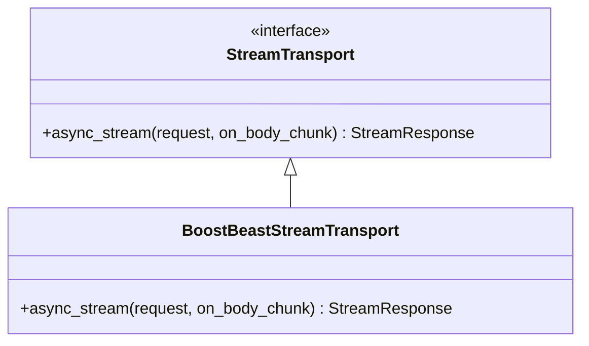
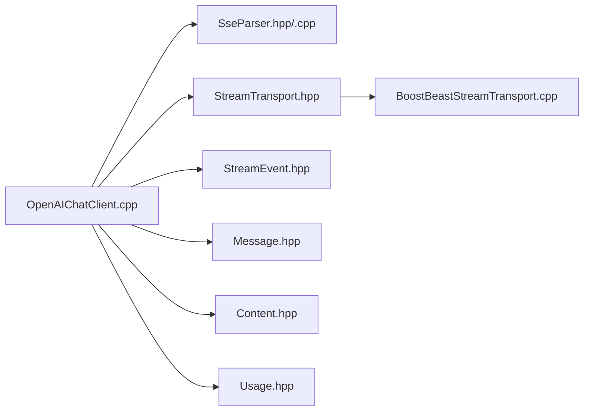

# SSE Parser and Streaming

<cite>
**Referenced Files in This Document**
- [SseParser.hpp](file://include/cch/ai/providers/SseParser.hpp)
- [SseParser.cpp](file://src/ai/providers/SseParser.cpp)
- [SseParserTest.cpp](file://tests/ai/providers/SseParserTest.cpp)
- [OpenAIChatClient.cpp](file://src/ai/providers/OpenAIChatClient.cpp)
- [StreamTransport.hpp](file://include/cch/ai/providers/StreamTransport.hpp)
- [BoostBeastStreamTransport.cpp](file://src/ai/providers/BoostBeastStreamTransport.cpp)
- [StreamEvent.hpp](file://include/cch/ai/StreamEvent.hpp)
- [Message.hpp](file://include/cch/ai/Message.hpp)
- [Content.hpp](file://include/cch/ai/Content.hpp)
- [Usage.hpp](file://include/cch/ai/Usage.hpp)
</cite>

## Table of Contents
1. [Introduction](#introduction)
2. [Project Structure](#project-structure)
3. [Core Components](#core-components)
4. [Architecture Overview](#architecture-overview)
5. [Detailed Component Analysis](#detailed-component-analysis)
6. [Dependency Analysis](#dependency-analysis)
7. [Performance Considerations](#performance-considerations)
8. [Troubleshooting Guide](#troubleshooting-guide)
9. [Conclusion](#conclusion)

## Introduction
This document explains the Server-Sent Events (SSE) parser and streaming implementation used to process AI model responses delivered via SSE. It focuses on how raw SSE frames are transformed into structured AssistantStreamEvent objects, covering event parsing logic, buffering and memory management, error handling, and integration with the broader AI integration architecture. The goal is to help developers understand how incremental parsing works for long-running streams, how to handle malformed or partial data, and how the SSE pipeline fits into the overall request/response lifecycle.

## Project Structure
The SSE streaming pipeline spans several modules:
- SSE parsing: SseParser converts raw byte chunks into structured SSE events.
- Transport: StreamTransport abstracts HTTP streaming; BoostBeastStreamTransport implements it over HTTPS/TLS.
- AI client: StreamingOpenAIChatClient orchestrates the HTTP request, streams body chunks, parses SSE, and emits AssistantStreamEvent events.
- Event model: AssistantStreamEvent defines the variant of streaming events (text deltas, tool calls, finish reasons).

**Diagram sources**
- [OpenAIChatClient.cpp:260-497](file://src/ai/providers/OpenAIChatClient.cpp#L260-L497)
- [StreamTransport.hpp:35-42](file://include/cch/ai/providers/StreamTransport.hpp#L35-L42)
- [BoostBeastStreamTransport.cpp:91-218](file://src/ai/providers/BoostBeastStreamTransport.cpp#L91-L218)
- [SseParser.hpp:18-31](file://include/cch/ai/providers/SseParser.hpp#L18-L31)
- [StreamEvent.hpp:78-90](file://include/cch/ai/StreamEvent.hpp#L78-L90)

**Section sources**
- [OpenAIChatClient.cpp:260-497](file://src/ai/providers/OpenAIChatClient.cpp#L260-L497)
- [StreamTransport.hpp:35-42](file://include/cch/ai/providers/StreamTransport.hpp#L35-L42)
- [BoostBeastStreamTransport.cpp:91-218](file://src/ai/providers/BoostBeastStreamTransport.cpp#L91-L218)
- [SseParser.hpp:18-31](file://include/cch/ai/providers/SseParser.hpp#L18-L31)
- [StreamEvent.hpp:78-90](file://include/cch/ai/StreamEvent.hpp#L78-L90)

## Core Components
- SseParser: Incrementally parses raw SSE frames, handles fragmentation, comments, and emits either zero or one complete event per append operation, plus a final optional event on finish().
- StreamingOpenAIChatClient: Orchestrates the HTTP request, streams body chunks via StreamTransport, feeds them to SseParser, decodes OpenAI stream chunks, and emits AssistantStreamEvent events.
- StreamTransport and BoostBeastStreamTransport: Provide asynchronous streaming over HTTPS/TLS, invoking a callback for each received body chunk.
- AssistantStreamEvent: The unified variant representing all streaming events (start/delta/end for text and thinking, start/delta/end for tool calls, done/error, and stop reasons).

Key responsibilities:
- Buffering and limits: SseParser enforces a maximum pending buffer size to prevent unbounded growth.
- Fragmentation safety: SseParser accumulates partial lines and only emits complete events when a terminator is encountered.
- SSE semantics: Comments (lines starting with ":") are ignored; multiple "data:" lines are joined with newlines; "[DONE]" indicates completion.
- Integration: StreamingOpenAIChatClient translates SSE payloads into AssistantStreamEvent variants and ensures proper terminal conditions.

**Section sources**
- [SseParser.hpp:12-16](file://include/cch/ai/providers/SseParser.hpp#L12-L16)
- [SseParser.cpp:18-48](file://src/ai/providers/SseParser.cpp#L18-L48)
- [SseParser.cpp:50-65](file://src/ai/providers/SseParser.cpp#L50-L65)
- [SseParser.cpp:73-96](file://src/ai/providers/SseParser.cpp#L73-L96)
- [SseParser.cpp:98-116](file://src/ai/providers/SseParser.cpp#L98-L116)
- [OpenAIChatClient.cpp:299-497](file://src/ai/providers/OpenAIChatClient.cpp#L299-L497)
- [StreamTransport.hpp:39-41](file://include/cch/ai/providers/StreamTransport.hpp#L39-L41)
- [BoostBeastStreamTransport.cpp:169-194](file://src/ai/providers/BoostBeastStreamTransport.cpp#L169-L194)
- [StreamEvent.hpp:78-90](file://include/cch/ai/StreamEvent.hpp#L78-L90)

## Architecture Overview
The SSE streaming flow from request initiation to event emission:

**Diagram sources**
- [OpenAIChatClient.cpp:263-497](file://src/ai/providers/OpenAIChatClient.cpp#L263-L497)
- [StreamTransport.hpp:39-41](file://include/cch/ai/providers/StreamTransport.hpp#L39-L41)
- [BoostBeastStreamTransport.cpp:169-194](file://src/ai/providers/BoostBeastStreamTransport.cpp#L169-L194)
- [SseParser.cpp:18-48](file://src/ai/providers/SseParser.cpp#L18-L48)
- [SseParser.cpp:50-65](file://src/ai/providers/SseParser.cpp#L50-L65)

## Detailed Component Analysis

### SseParser: Incremental SSE Parsing
SseParser transforms raw byte chunks into structured SSE events. It maintains internal state for:
- pending_: Accumulated bytes across appends.
- event_name_: Current event name (defaults to "message").
- data_lines_: Buffered data lines accumulated until a terminator.

Parsing logic highlights:
- Buffering and limits: Enforced via a maximum pending size; exceeding it yields an error.
- Line scanning: Iteratively finds newline terminators to extract complete lines.
- Comment handling: Lines starting with ":" are ignored.
- Field parsing: Splits "field: value" into field and value, trimming leading spaces.
- Event dispatch: Emits a single SseEvent when a terminator is reached; otherwise returns none. The event’s done flag is set when data equals the OpenAI sentinel "[DONE]".

**Diagram sources**
- [SseParser.cpp:18-48](file://src/ai/providers/SseParser.cpp#L18-L48)
- [SseParser.cpp:73-96](file://src/ai/providers/SseParser.cpp#L73-L96)
- [SseParser.cpp:98-116](file://src/ai/providers/SseParser.cpp#L98-L116)

Implementation notes:
- Memory management: pending_ grows incrementally; the max_pending_bytes guard prevents runaway memory usage.
- Fragmentation: consume_line updates internal state; dispatch_event composes a single event from buffered data lines.
- Finalization: finish() attempts to emit a final event from any remaining data and also dispatches a terminal event if none was emitted.

**Section sources**
- [SseParser.hpp:12-16](file://include/cch/ai/providers/SseParser.hpp#L12-L16)
- [SseParser.cpp:8](file://src/ai/providers/SseParser.cpp#L8)
- [SseParser.cpp:18-48](file://src/ai/providers/SseParser.cpp#L18-L48)
- [SseParser.cpp:50-65](file://src/ai/providers/SseParser.cpp#L50-L65)
- [SseParser.cpp:73-96](file://src/ai/providers/SseParser.cpp#L73-L96)
- [SseParser.cpp:98-116](file://src/ai/providers/SseParser.cpp#L98-L116)

### AssistantStreamEvent: Streaming Event Model
AssistantStreamEvent is a variant that encapsulates all streaming events:
- Lifecycle: AssistantStartEvent, TextStartEvent, TextDeltaEvent, TextEndEvent, ThinkingStartEvent, ThinkingDeltaEvent, ThinkingEndEvent, ToolCallStartEvent, ToolCallDeltaEvent, ToolCallEndEvent, AssistantDoneEvent, AssistantErrorEvent.
- Content types: TextContent, ThinkingContent, and ToolCallContent are used to represent textual, reasoning, and tool-call payloads respectively.

These events are emitted by StreamingOpenAIChatClient after decoding SSE payloads and assembling AssistantMessage state.

**Diagram sources**
- [StreamEvent.hpp:78-90](file://include/cch/ai/StreamEvent.hpp#L78-L90)

**Section sources**
- [StreamEvent.hpp:13-90](file://include/cch/ai/StreamEvent.hpp#L13-L90)
- [Content.hpp:11-35](file://include/cch/ai/Content.hpp#L11-L35)
- [Message.hpp:41-52](file://include/cch/ai/Message.hpp#L41-L52)

### StreamingOpenAIChatClient: SSE Integration and Event Emission
StreamingOpenAIChatClient coordinates the entire streaming pipeline:
- Prepares the HTTP request and sets Accept: text/event-stream.
- Initializes SseParser and AssistantMessage state.
- Streams body chunks via StreamTransport; each chunk is fed to SseParser.append().
- Decodes each SSE data payload as an OpenAI stream chunk and updates AssistantMessage content.
- Emits AssistantStreamEvent events for lifecycle transitions and payloads.
- On stream end, calls parser.finish() to flush any remaining data and ensure terminal conditions are met.

Terminal condition checks:
- Requires either [DONE] sentinel or a finish_reason in the stream to consider the stream complete.
- Ensures at least one assistant payload (text or tool calls) was observed.
- Emits AssistantErrorEvent on errors and returns an AssistantMessage with stop_reason set accordingly.

**Diagram sources**
- [OpenAIChatClient.cpp:299-497](file://src/ai/providers/OpenAIChatClient.cpp#L299-L497)
- [SseParser.cpp:18-48](file://src/ai/providers/SseParser.cpp#L18-L48)
- [SseParser.cpp:50-65](file://src/ai/providers/SseParser.cpp#L50-L65)

**Section sources**
- [OpenAIChatClient.cpp:263-497](file://src/ai/providers/OpenAIChatClient.cpp#L263-L497)

### Transport Layer: StreamTransport and BoostBeastStreamTransport
StreamTransport defines the interface for asynchronous streaming with a body chunk handler. BoostBeastStreamTransport implements HTTPS/TLS streaming:
- Parses the URL and resolves the host/port.
- Establishes TLS handshake with hostname verification.
- Sends the HTTP request and reads headers.
- Streams body chunks to the provided handler; each chunk is passed to the SSE parser.
- Handles non-2xx status codes and various network errors.

**Diagram sources**
- [StreamTransport.hpp:35-42](file://include/cch/ai/providers/StreamTransport.hpp#L35-L42)
- [BoostBeastStreamTransport.cpp:91-218](file://src/ai/providers/BoostBeastStreamTransport.cpp#L91-L218)

**Section sources**
- [StreamTransport.hpp:15-42](file://include/cch/ai/providers/StreamTransport.hpp#L15-L42)
- [BoostBeastStreamTransport.cpp:91-218](file://src/ai/providers/BoostBeastStreamTransport.cpp#L91-L218)

## Dependency Analysis
The SSE streaming pipeline exhibits clear separation of concerns:
- OpenAIChatClient depends on SseParser for incremental SSE parsing and on StreamTransport for network streaming.
- StreamTransport is an abstraction; BoostBeastStreamTransport is the concrete implementation.
- AssistantStreamEvent is consumed by client code via an event sink.

**Diagram sources**
- [OpenAIChatClient.cpp:260-497](file://src/ai/providers/OpenAIChatClient.cpp#L260-L497)
- [SseParser.hpp:18-31](file://include/cch/ai/providers/SseParser.hpp#L18-L31)
- [StreamTransport.hpp:35-42](file://include/cch/ai/providers/StreamTransport.hpp#L35-L42)
- [BoostBeastStreamTransport.cpp:91-218](file://src/ai/providers/BoostBeastStreamTransport.cpp#L91-L218)
- [StreamEvent.hpp:78-90](file://include/cch/ai/StreamEvent.hpp#L78-L90)
- [Message.hpp:41-52](file://include/cch/ai/Message.hpp#L41-L52)
- [Content.hpp:11-35](file://include/cch/ai/Content.hpp#L11-L35)
- [Usage.hpp:27-34](file://include/cch/ai/Usage.hpp#L27-L34)

**Section sources**
- [OpenAIChatClient.cpp:260-497](file://src/ai/providers/OpenAIChatClient.cpp#L260-L497)
- [SseParser.hpp:18-31](file://include/cch/ai/providers/SseParser.hpp#L18-L31)
- [StreamTransport.hpp:35-42](file://include/cch/ai/providers/StreamTransport.hpp#L35-L42)
- [BoostBeastStreamTransport.cpp:91-218](file://src/ai/providers/BoostBeastStreamTransport.cpp#L91-L218)
- [StreamEvent.hpp:78-90](file://include/cch/ai/StreamEvent.hpp#L78-L90)
- [Message.hpp:41-52](file://include/cch/ai/Message.hpp#L41-L52)
- [Content.hpp:11-35](file://include/cch/ai/Content.hpp#L11-L35)
- [Usage.hpp:27-34](file://include/cch/ai/Usage.hpp#L27-L34)

## Performance Considerations
- Buffering limits: SseParser enforces a maximum pending buffer size to avoid unbounded memory growth during long streams.
- Chunk handling: Transport streams body chunks incrementally; the SSE parser processes them in small segments, minimizing latency and memory footprint.
- Event batching: Each append may produce zero or one complete event; this keeps downstream processing predictable.
- JSON decoding overhead: StreamingOpenAIChatClient decodes each SSE data payload as an OpenAI stream chunk; batching or deferring JSON parsing is not used, prioritizing correctness and real-time delivery.
- Network timeouts: Transport applies timeouts; failures propagate as errors to the event sink.

[No sources needed since this section provides general guidance]

## Troubleshooting Guide
Common issues and resolutions:
- Buffer limit exceeded: Occurs when the pending buffer exceeds the configured maximum. Reduce upstream chunk sizes or increase limits cautiously.
- Missing terminal event: If neither [DONE] nor finish_reason appears, the client reports an error and emits AssistantErrorEvent. Verify provider compliance with SSE termination semantics.
- Malformed tool call arguments: If streamed tool call arguments fail to parse as JSON, the client marks arguments_valid=false and populates argument_error; ensure tool call payloads conform to expected JSON.
- No assistant payload: If the stream ends without emitting content or tool calls, the client emits an error. Confirm provider configuration and request messages.
- Network errors: Transport errors (timeouts, TLS failures, non-2xx status) are surfaced as Provider or Network errors; inspect status codes and TLS logs.

**Section sources**
- [SseParser.cpp:19-24](file://src/ai/providers/SseParser.cpp#L19-L24)
- [OpenAIChatClient.cpp:443-458](file://src/ai/providers/OpenAIChatClient.cpp#L443-L458)
- [OpenAIChatClient.cpp:467-487](file://src/ai/providers/OpenAIChatClient.cpp#L467-L487)
- [BoostBeastStreamTransport.cpp:162-167](file://src/ai/providers/BoostBeastStreamTransport.cpp#L162-L167)

## Conclusion
The SSE parser and streaming implementation provide a robust foundation for processing AI model responses delivered via Server-Sent Events. SseParser handles fragmentation, comments, and SSE semantics safely, while StreamingOpenAIChatClient integrates parsing with transport and event emission, ensuring correct lifecycle handling and terminal conditions. Together, these components enable efficient, incremental processing of long-running streams with strong error reporting and memory management guarantees.