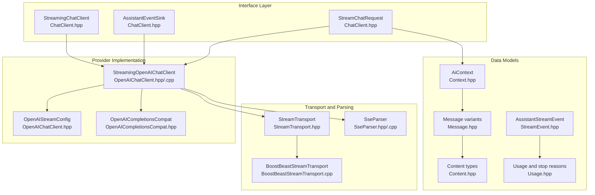
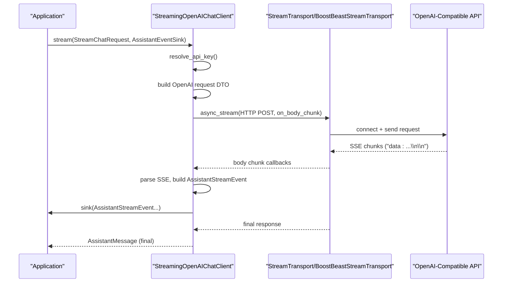
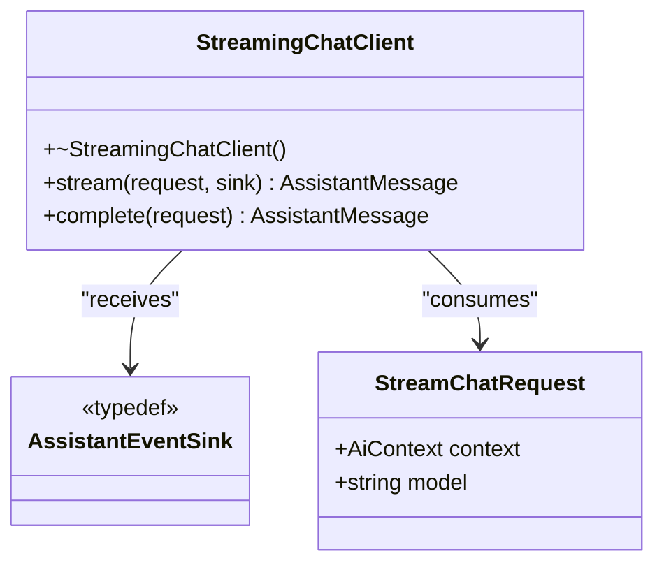
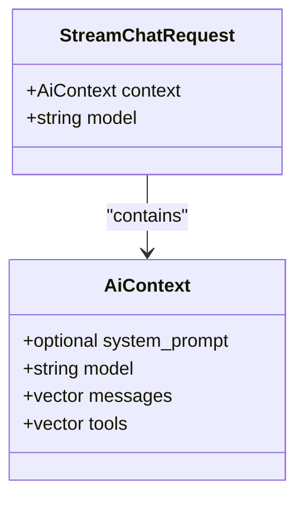
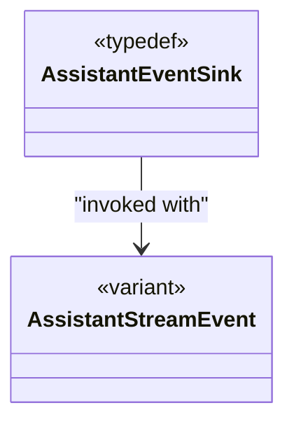
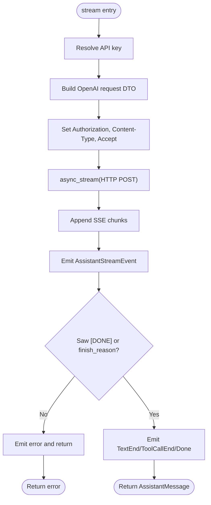
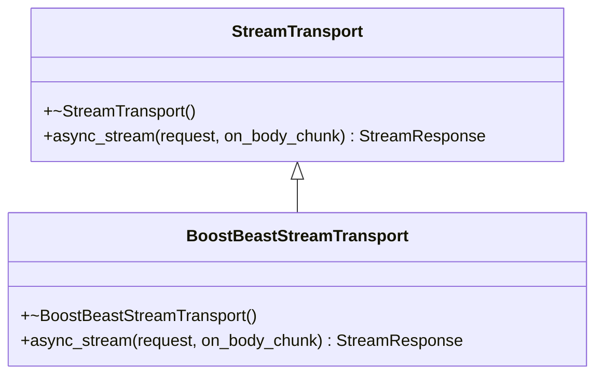
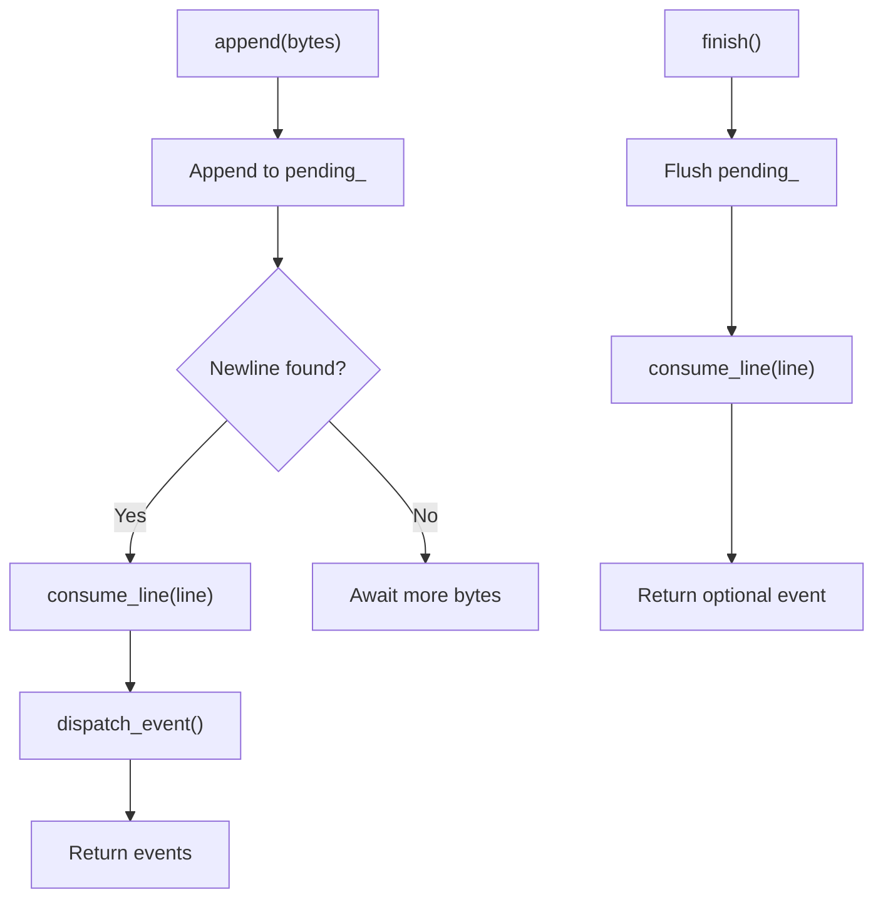
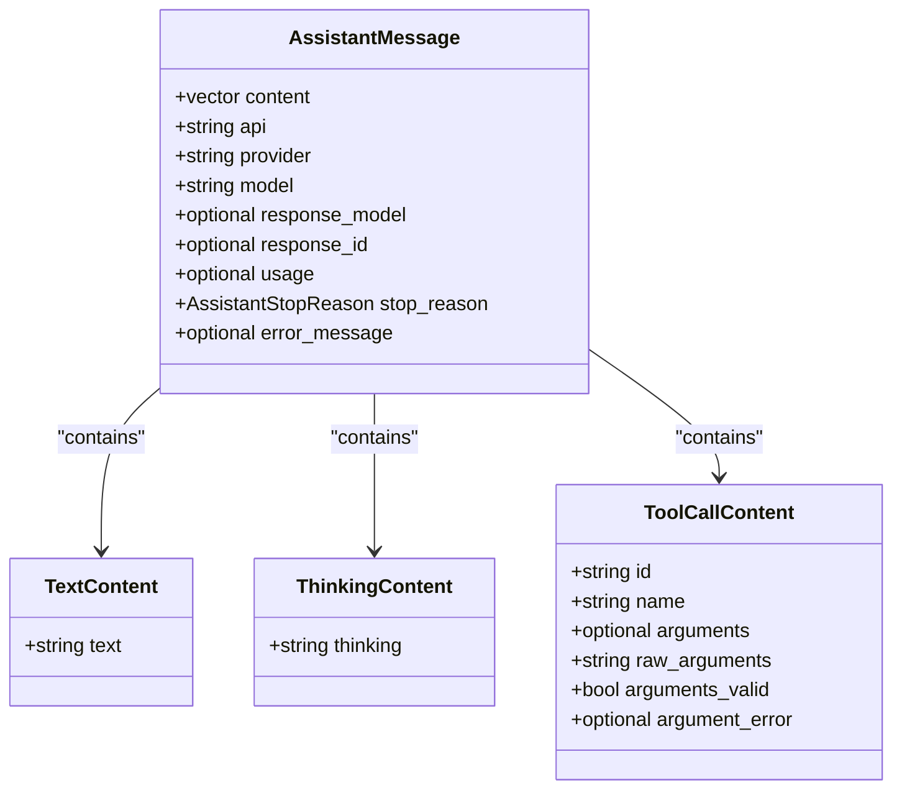
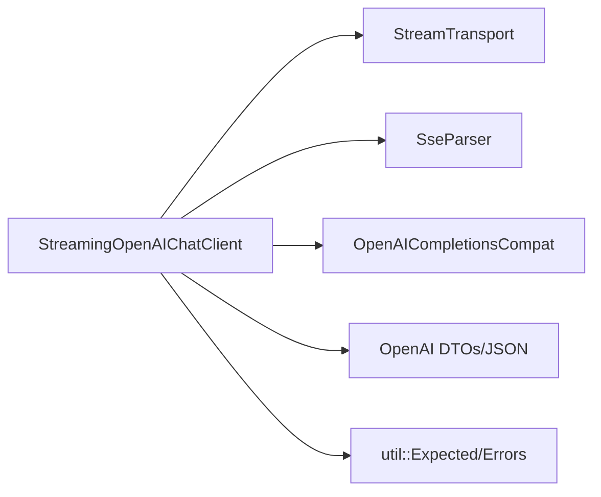

# Streaming Chat Client

<cite>
**Referenced Files in This Document**
- [ChatClient.hpp](file://include/cch/ai/ChatClient.hpp)
- [OpenAIChatClient.hpp](file://include/cch/ai/providers/OpenAIChatClient.hpp)
- [OpenAIChatClient.cpp](file://src/ai/providers/OpenAIChatClient.cpp)
- [StreamTransport.hpp](file://include/cch/ai/providers/StreamTransport.hpp)
- [BoostBeastStreamTransport.cpp](file://src/ai/providers/BoostBeastStreamTransport.cpp)
- [SseParser.hpp](file://src/ai/providers/SseParser.hpp)
- [SseParser.cpp](file://src/ai/providers/SseParser.cpp)
- [StreamEvent.hpp](file://include/cch/ai/StreamEvent.hpp)
- [Context.hpp](file://include/cch/ai/Context.hpp)
- [Message.hpp](file://include/cch/ai/Message.hpp)
- [Content.hpp](file://include/cch/ai/Content.hpp)
- [Usage.hpp](file://include/cch/ai/Usage.hpp)
- [OpenAICompletionsCompat.hpp](file://include/cch/ai/providers/OpenAICompletionsCompat.hpp)
- [OpenAIChatClientTest.cpp](file://tests/ai/providers/OpenAIChatClientTest.cpp)
</cite>

## Table of Contents
1. [Introduction](#introduction)
2. [Project Structure](#project-structure)
3. [Core Components](#core-components)
4. [Architecture Overview](#architecture-overview)
5. [Detailed Component Analysis](#detailed-component-analysis)
6. [Dependency Analysis](#dependency-analysis)
7. [Performance Considerations](#performance-considerations)
8. [Troubleshooting Guide](#troubleshooting-guide)
9. [Conclusion](#conclusion)
10. [Appendices](#appendices)

## Introduction
This document explains the streaming chat client implementation with an emphasis on the awaitable-based design for asynchronous operations. It covers the StreamingChatClient interface, the StreamChatRequest structure, the AssistantEventSink callback mechanism for incremental streaming responses, the complete() convenience wrapper for non-streaming scenarios, and the OpenAI-compatible implementation including HTTP request construction, SSE response parsing, and robust error handling. Authentication via API keys, configuration of base URLs and timeouts, and considerations for rate limiting are included, along with practical examples of establishing connections, sending requests, and processing streaming responses in real time.

## Project Structure
The streaming chat client is implemented as a provider-agnostic interface backed by an OpenAI-compatible provider. Supporting components include a transport abstraction for HTTP streaming, an SSE parser, and a set of data models for context, messages, content, and streaming events.

**Diagram sources**
- [ChatClient.hpp:23-34](file://include/cch/ai/ChatClient.hpp#L23-L34)
- [OpenAIChatClient.hpp:26-40](file://include/cch/ai/providers/OpenAIChatClient.hpp#L26-L40)
- [OpenAIChatClient.cpp:260-497](file://src/ai/providers/OpenAIChatClient.cpp#L260-L497)
- [StreamTransport.hpp:35-42](file://include/cch/ai/providers/StreamTransport.hpp#L35-L42)
- [BoostBeastStreamTransport.cpp:91-218](file://src/ai/providers/BoostBeastStreamTransport.cpp#L91-L218)
- [SseParser.hpp:18-31](file://src/ai/providers/SseParser.hpp#L18-L31)
- [Context.hpp:12-17](file://include/cch/ai/Context.hpp#L12-L17)
- [Message.hpp:41-53](file://include/cch/ai/Message.hpp#L41-L53)
- [Content.hpp:37-39](file://include/cch/ai/Content.hpp#L37-L39)
- [StreamEvent.hpp:78-90](file://include/cch/ai/StreamEvent.hpp#L78-L90)
- [Usage.hpp:27-34](file://include/cch/ai/Usage.hpp#L27-L34)

**Section sources**
- [ChatClient.hpp:16-34](file://include/cch/ai/ChatClient.hpp#L16-L34)
- [OpenAIChatClient.hpp:13-40](file://include/cch/ai/providers/OpenAIChatClient.hpp#L13-L40)
- [StreamTransport.hpp:15-42](file://include/cch/ai/providers/StreamTransport.hpp#L15-L42)
- [SseParser.hpp:12-31](file://src/ai/providers/SseParser.hpp#L12-L31)
- [Context.hpp:12-17](file://include/cch/ai/Context.hpp#L12-L17)
- [Message.hpp:41-53](file://include/cch/ai/Message.hpp#L41-L53)
- [Content.hpp:37-39](file://include/cch/ai/Content.hpp#L37-L39)
- [StreamEvent.hpp:78-90](file://include/cch/ai/StreamEvent.hpp#L78-L90)
- [Usage.hpp:27-34](file://include/cch/ai/Usage.hpp#L27-L34)

## Core Components
- StreamingChatClient: An interface defining an awaitable stream(...) operation that takes a StreamChatRequest and an AssistantEventSink, returning an AssistantMessage upon completion. It also provides a convenience complete(...) method that streams to a no-op sink.
- StreamChatRequest: Encapsulates AiContext and model selection for a single chat invocation.
- AssistantEventSink: A move-only callback invoked incrementally with AssistantStreamEvent instances during streaming.
- StreamingOpenAIChatClient: An OpenAI-compatible implementation that constructs OpenAI-style requests, performs HTTP streaming via StreamTransport, parses SSE chunks with SseParser, and emits structured AssistantStreamEvent callbacks.
- StreamTransport and BoostBeastStreamTransport: Transport abstraction and TLS-enabled HTTP streaming implementation supporting SSE.
- SSE Parser: Parses server-sent events into structured events, recognizing [DONE] terminators.
- Data Models: AiContext, Message variants, Content types, AssistantStreamEvent, and Usage/stop reasons.

**Section sources**
- [ChatClient.hpp:23-34](file://include/cch/ai/ChatClient.hpp#L23-L34)
- [ChatClient.hpp:16-19](file://include/cch/ai/ChatClient.hpp#L16-L19)
- [OpenAIChatClient.hpp:26-40](file://include/cch/ai/providers/OpenAIChatClient.hpp#L26-L40)
- [StreamTransport.hpp:35-42](file://include/cch/ai/providers/StreamTransport.hpp#L35-L42)
- [SseParser.hpp:18-31](file://src/ai/providers/SseParser.hpp#L18-L31)
- [Context.hpp:12-17](file://include/cch/ai/Context.hpp#L12-L17)
- [Message.hpp:41-53](file://include/cch/ai/Message.hpp#L41-L53)
- [Content.hpp:37-39](file://include/cch/ai/Content.hpp#L37-L39)
- [StreamEvent.hpp:78-90](file://include/cch/ai/StreamEvent.hpp#L78-L90)
- [Usage.hpp:27-34](file://include/cch/ai/Usage.hpp#L27-L34)

## Architecture Overview
The streaming pipeline is driven by an awaitable coroutine. The client converts the request into an OpenAI-compatible JSON payload, sends an HTTP POST with Accept: text/event-stream, and streams the response body through a parser that emits structured events to the sink. The transport handles TLS, connection lifecycle, and body chunk delivery.

**Diagram sources**
- [OpenAIChatClient.cpp:263-497](file://src/ai/providers/OpenAIChatClient.cpp#L263-L497)
- [StreamTransport.hpp:39-41](file://include/cch/ai/providers/StreamTransport.hpp#L39-L41)
- [BoostBeastStreamTransport.cpp:91-218](file://src/ai/providers/BoostBeastStreamTransport.cpp#L91-L218)
- [SseParser.cpp:18-116](file://src/ai/providers/SseParser.cpp#L18-L116)

## Detailed Component Analysis

### StreamingChatClient Interface and Awaitable Design
- The interface defines an awaitable stream(...) method returning an AssistantMessage and emitting incremental AssistantStreamEvent updates via AssistantEventSink.
- The complete(...) convenience method wraps stream(...) with a no-op sink, enabling non-streaming usage patterns.

**Diagram sources**
- [ChatClient.hpp:23-34](file://include/cch/ai/ChatClient.hpp#L23-L34)
- [ChatClient.hpp:16-19](file://include/cch/ai/ChatClient.hpp#L16-L19)
- [ChatClient.hpp:21](file://include/cch/ai/ChatClient.hpp#L21)

**Section sources**
- [ChatClient.hpp:23-34](file://include/cch/ai/ChatClient.hpp#L23-L34)

### StreamChatRequest and AiContext
- StreamChatRequest carries AiContext (system prompt, model, messages, tools) and overrides model if provided.
- AiContext centralizes conversational context and tool definitions.

**Diagram sources**
- [ChatClient.hpp:16-19](file://include/cch/ai/ChatClient.hpp#L16-L19)
- [Context.hpp:12-17](file://include/cch/ai/Context.hpp#L12-L17)

**Section sources**
- [ChatClient.hpp:16-19](file://include/cch/ai/ChatClient.hpp#L16-L19)
- [Context.hpp:12-17](file://include/cch/ai/Context.hpp#L12-L17)

### AssistantEventSink and AssistantStreamEvent
- AssistantEventSink is a move-only callback type that receives AssistantStreamEvent variants.
- AssistantStreamEvent enumerates start, delta, and end events for text and tool calls, plus completion and error events.

**Diagram sources**
- [ChatClient.hpp:21](file://include/cch/ai/ChatClient.hpp#L21)
- [StreamEvent.hpp:78-90](file://include/cch/ai/StreamEvent.hpp#L78-L90)

**Section sources**
- [ChatClient.hpp:21](file://include/cch/ai/ChatClient.hpp#L21)
- [StreamEvent.hpp:78-90](file://include/cch/ai/StreamEvent.hpp#L78-L90)

### StreamingOpenAIChatClient: OpenAI-Compatible Implementation
- Construction: Takes a shared StreamTransport and OpenAIStreamConfig.
- stream(...): Resolves API key, builds OpenAI request DTO from StreamChatRequest, sets Authorization and Accept headers, streams via transport, parses SSE, and emits AssistantStreamEvent callbacks.
- complete(...): Convenience wrapper that streams to a no-op sink.

Key behaviors:
- Request building: Converts AiContext to OpenAI messages, applies compat flags, sets stream=true, and optionally includes tools and stream_options.
- Authentication: Supports api_key or api_key_env resolution.
- Base URL normalization: Ensures proper /v1/chat/completions endpoint.
- SSE handling: Tracks text deltas, tool call accumulation, usage emission, and stop reasons.
- Finalization: Emits TextEnd, ToolCallEnd, and AssistantDone; validates terminal conditions.

**Diagram sources**
- [OpenAIChatClient.cpp:263-497](file://src/ai/providers/OpenAIChatClient.cpp#L263-L497)

**Section sources**
- [OpenAIChatClient.hpp:26-40](file://include/cch/ai/providers/OpenAIChatClient.hpp#L26-L40)
- [OpenAIChatClient.cpp:263-497](file://src/ai/providers/OpenAIChatClient.cpp#L263-L497)

### StreamTransport and BoostBeastStreamTransport
- StreamTransport defines async_stream(request, on_body_chunk) returning StreamResponse or error.
- BoostBeastStreamTransport implements HTTPS/TLS streaming, URL parsing, header forwarding, body chunking, and error mapping.

**Diagram sources**
- [StreamTransport.hpp:35-42](file://include/cch/ai/providers/StreamTransport.hpp#L35-L42)
- [BoostBeastStreamTransport.cpp:91-218](file://src/ai/providers/BoostBeastStreamTransport.cpp#L91-L218)

**Section sources**
- [StreamTransport.hpp:35-42](file://include/cch/ai/providers/StreamTransport.hpp#L35-L42)
- [BoostBeastStreamTransport.cpp:91-218](file://src/ai/providers/BoostBeastStreamTransport.cpp#L91-L218)

### SSE Parsing and Event Emission
- SseParser accumulates lines, splits fields, buffers data lines, and emits events when blank lines are encountered or on finish().
- Recognizes [DONE] as a terminator and produces AssistantErrorEvent on malformed JSON or transport errors.

**Diagram sources**
- [SseParser.cpp:18-116](file://src/ai/providers/SseParser.cpp#L18-L116)
- [SseParser.hpp:18-31](file://src/ai/providers/SseParser.hpp#L18-L31)

**Section sources**
- [SseParser.cpp:18-116](file://src/ai/providers/SseParser.cpp#L18-L116)
- [SseParser.hpp:12-31](file://src/ai/providers/SseParser.hpp#L12-L31)

### Data Models: Messages, Content, Usage, and Stop Reasons
- AssistantMessage aggregates content blocks, identifiers, usage, stop reason, and diagnostics.
- Content types include TextContent, ThinkingContent, ImageContent, and ToolCallContent.
- AssistantStreamEvent variants cover start/delta/end for text/thinking/tool calls and completion/error.

**Diagram sources**
- [Message.hpp:41-53](file://include/cch/ai/Message.hpp#L41-L53)
- [Content.hpp:11-35](file://include/cch/ai/Content.hpp#L11-L35)

**Section sources**
- [Message.hpp:41-53](file://include/cch/ai/Message.hpp#L41-L53)
- [Content.hpp:11-35](file://include/cch/ai/Content.hpp#L11-L35)
- [Usage.hpp:27-34](file://include/cch/ai/Usage.hpp#L27-L34)
- [StreamEvent.hpp:78-90](file://include/cch/ai/StreamEvent.hpp#L78-L90)

### OpenAI Compat Flags and Model Behavior
- OpenAICompletionsCompat configures provider-specific behaviors such as developer/system role, tool result naming, assistant insertion after tool results, and thinking-as-text serialization.
- These flags influence request serialization and message normalization.

**Section sources**
- [OpenAICompletionsCompat.hpp:25-40](file://include/cch/ai/providers/OpenAICompletionsCompat.hpp#L25-L40)
- [OpenAIChatClient.cpp:164-213](file://src/ai/providers/OpenAIChatClient.cpp#L164-L213)

## Dependency Analysis
The OpenAI client depends on:
- StreamTransport for HTTP streaming
- SseParser for SSE event extraction
- Glaze DTOs and JSON utilities for serialization/deserialization
- OpenAICompletionsCompat for provider-specific normalization
- Utility types for errors and expected wrappers

**Diagram sources**
- [OpenAIChatClient.cpp:1-16](file://src/ai/providers/OpenAIChatClient.cpp#L1-L16)
- [OpenAIChatClient.hpp:26-40](file://include/cch/ai/providers/OpenAIChatClient.hpp#L26-L40)

**Section sources**
- [OpenAIChatClient.cpp:1-16](file://src/ai/providers/OpenAIChatClient.cpp#L1-L16)
- [OpenAIChatClient.hpp:26-40](file://include/cch/ai/providers/OpenAIChatClient.hpp#L26-L40)

## Performance Considerations
- Streaming minimizes latency by emitting incremental events; avoid buffering entire responses when possible.
- SSE parsing enforces a maximum pending byte limit to prevent memory exhaustion.
- Transport uses TLS verification and limits body size; timeouts are configurable via OpenAIStreamConfig.
- Tool call argument parsing occurs incrementally; malformed JSON marks arguments as invalid with an error message.
- Consider batching or throttling high-frequency delta events at the application level if needed.

[No sources needed since this section provides general guidance]

## Troubleshooting Guide
Common issues and resolutions:
- Missing API key: Ensure api_key or api_key_env is set in OpenAIStreamConfig.
- Non-success HTTP status: Verify base_url, credentials, and provider quotas.
- Malformed SSE or JSON: Expect AssistantErrorEvent with detailed error info; check provider output format.
- No assistant payload: The client validates that at least content, tool calls, or finish_reason appears before termination.
- TLS/hostname verification failures: Confirm CA store and host name setup in the transport.

**Section sources**
- [OpenAIChatClient.cpp:499-512](file://src/ai/providers/OpenAIChatClient.cpp#L499-L512)
- [BoostBeastStreamTransport.cpp:116-134](file://src/ai/providers/BoostBeastStreamTransport.cpp#L116-L134)
- [SseParser.cpp:18-47](file://src/ai/providers/SseParser.cpp#L18-L47)
- [OpenAIChatClient.cpp:443-458](file://src/ai/providers/OpenAIChatClient.cpp#L443-L458)

## Conclusion
The streaming chat client provides a robust, awaitable interface for OpenAI-compatible chat completions with incremental event delivery. Its design cleanly separates concerns across the interface, provider, transport, and parsing layers, enabling extensibility and maintainability. Proper configuration of authentication, base URLs, and compat flags ensures reliable interoperability with diverse providers.

[No sources needed since this section summarizes without analyzing specific files]

## Appendices

### Practical Examples

- Establishing a client and sending a request
  - Configure OpenAIStreamConfig with base_url, api_key, and model.
  - Construct StreamChatRequest with AiContext and optional model override.
  - Call stream(...) with an AssistantEventSink to receive incremental events.
  - Optionally call complete(...) for non-streaming behavior.

- Processing streaming responses
  - In the sink, handle AssistantStreamEvent variants to render text deltas and tool call updates.
  - On AssistantDoneEvent, finalize the AssistantMessage and inspect stop_reason and usage.

- Authentication and API key management
  - Provide api_key directly or set api_key_env to an environment variable.
  - Organization and project headers can be set via config fields.

- Rate limiting considerations
  - Tune timeout via OpenAIStreamConfig.
  - Respect provider rate limits; consider backoff and retry strategies at the application layer.
  - Monitor stop_reason and error_message for throttling indicators.

**Section sources**
- [OpenAIChatClient.hpp:13-24](file://include/cch/ai/providers/OpenAIChatClient.hpp#L13-L24)
- [OpenAIChatClient.cpp:263-497](file://src/ai/providers/OpenAIChatClient.cpp#L263-L497)
- [OpenAIChatClientTest.cpp:111-173](file://tests/ai/providers/OpenAIChatClientTest.cpp#L111-L173)
- [OpenAIChatClientTest.cpp:200-235](file://tests/ai/providers/OpenAIChatClientTest.cpp#L200-L235)
- [OpenAIChatClientTest.cpp:283-325](file://tests/ai/providers/OpenAIChatClientTest.cpp#L283-L325)
- [OpenAIChatClientTest.cpp:599-615](file://tests/ai/providers/OpenAIChatClientTest.cpp#L599-L615)