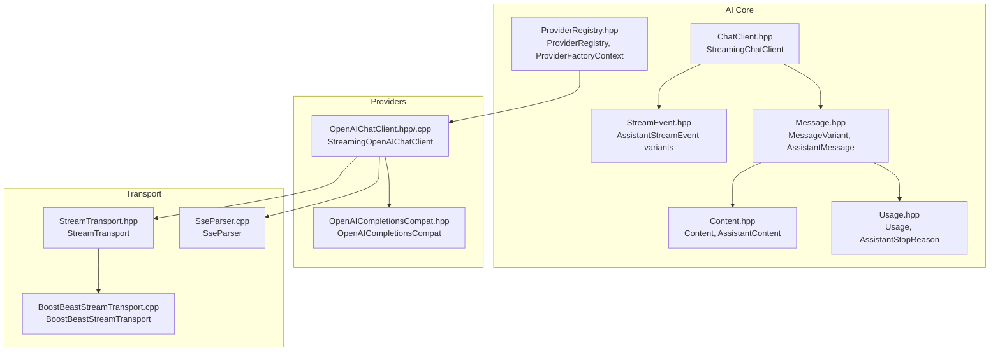
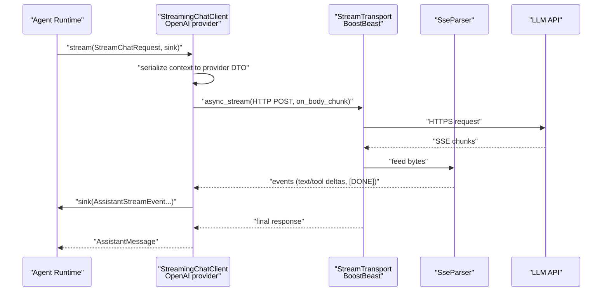
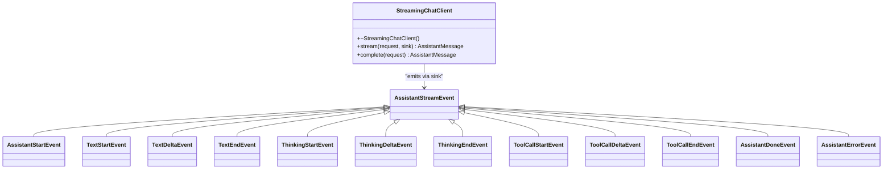
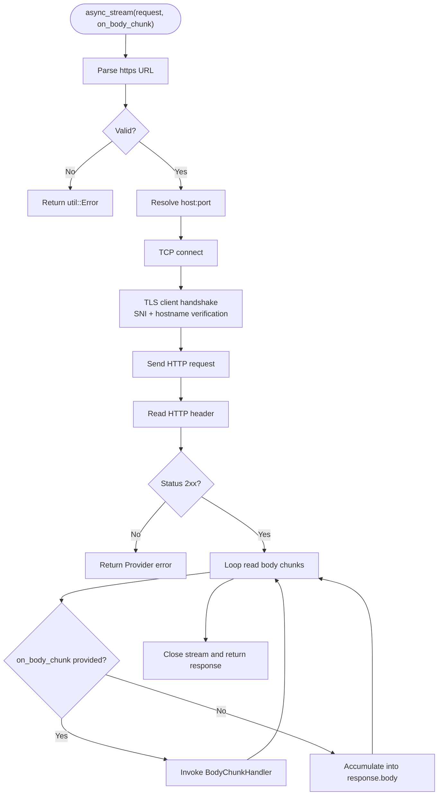
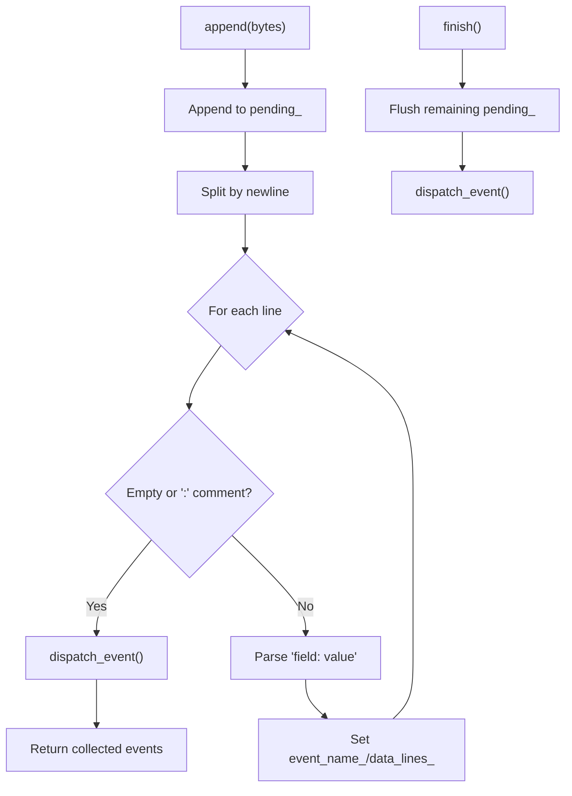
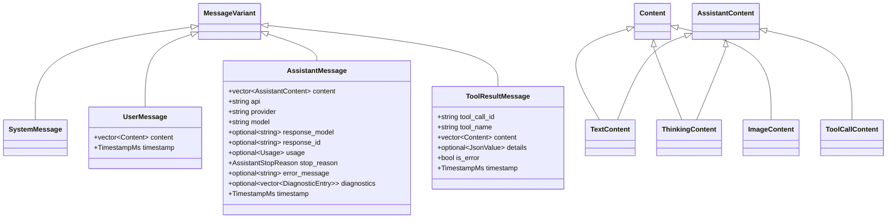
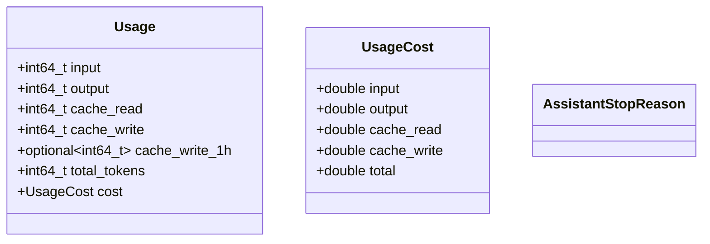
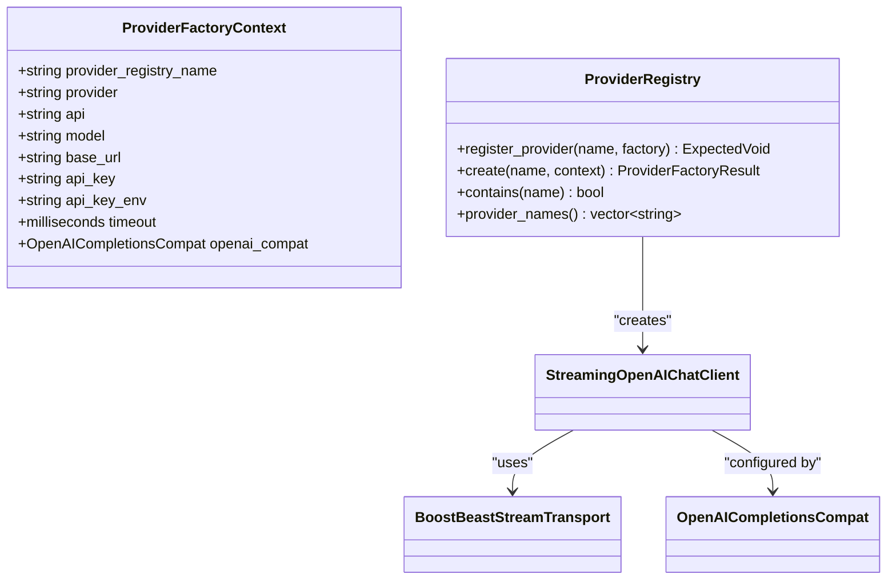
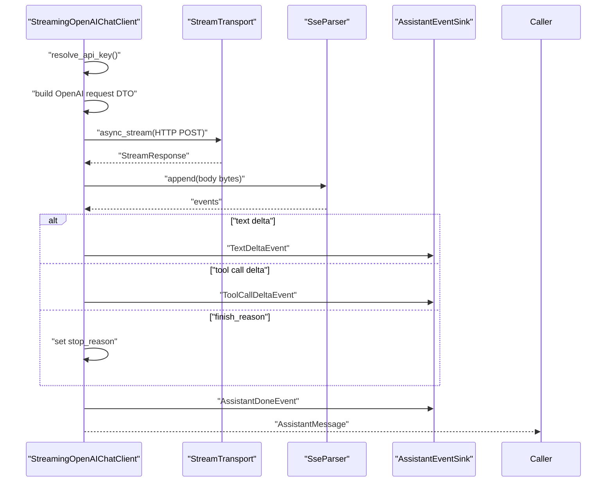
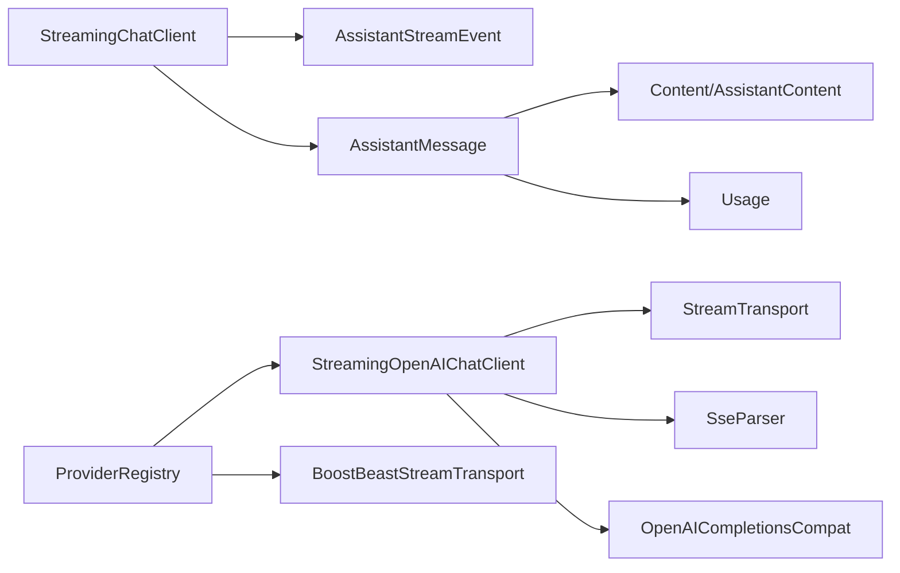

# AI Provider Interfaces

<cite>
**Referenced Files in This Document**
- [ChatClient.hpp](file://include/cch/ai/ChatClient.hpp)
- [StreamEvent.hpp](file://include/cch/ai/StreamEvent.hpp)
- [Message.hpp](file://include/cch/ai/Message.hpp)
- [Content.hpp](file://include/cch/ai/Content.hpp)
- [Usage.hpp](file://include/cch/ai/Usage.hpp)
- [ProviderRegistry.hpp](file://include/cch/ai/ProviderRegistry.hpp)
- [OpenAIChatClient.hpp](file://include/cch/ai/providers/OpenAIChatClient.hpp)
- [OpenAIChatClient.cpp](file://src/ai/providers/OpenAIChatClient.cpp)
- [StreamTransport.hpp](file://include/cch/ai/providers/StreamTransport.hpp)
- [BoostBeastStreamTransport.cpp](file://src/ai/providers/BoostBeastStreamTransport.cpp)
- [SseParser.cpp](file://src/ai/providers/SseParser.cpp)
- [OpenAICompletionsCompat.hpp](file://include/cch/ai/providers/OpenAICompletionsCompat.hpp)
- [ProviderRegistry.cpp](file://src/ai/ProviderRegistry.cpp)
</cite>

## Table of Contents
1. [Introduction](#introduction)
2. [Project Structure](#project-structure)
3. [Core Components](#core-components)
4. [Architecture Overview](#architecture-overview)
5. [Detailed Component Analysis](#detailed-component-analysis)
6. [Dependency Analysis](#dependency-analysis)
7. [Performance Considerations](#performance-considerations)
8. [Troubleshooting Guide](#troubleshooting-guide)
9. [Conclusion](#conclusion)
10. [Appendices](#appendices)

## Introduction
This document explains the AI provider interfaces and streaming transport mechanisms used to integrate external language model providers (such as OpenAI-compatible APIs) into the agent system. It covers:
- The StreamingChatClient interface and its asynchronous streaming contract
- The StreamTransport abstraction for network I/O and SSE parsing
- Conversation message and content models, plus usage tracking
- Provider configuration, authentication, and registration patterns
- How providers fit into the broader agent architecture and runtime

## Project Structure
The AI subsystem is organized around a small set of core interfaces and a pluggable provider registry. Providers implement the StreamingChatClient interface and rely on StreamTransport for HTTP/TLS streaming. OpenAI-compatible providers are implemented as a concrete example.

**Diagram sources**
- [ChatClient.hpp:23-34](file://include/cch/ai/ChatClient.hpp#L23-L34)
- [StreamEvent.hpp:13-91](file://include/cch/ai/StreamEvent.hpp#L13-L91)
- [Message.hpp:41-53](file://include/cch/ai/Message.hpp#L41-L53)
- [Content.hpp:37-39](file://include/cch/ai/Content.hpp#L37-L39)
- [Usage.hpp:17-34](file://include/cch/ai/Usage.hpp#L17-L34)
- [ProviderRegistry.hpp:40-51](file://include/cch/ai/ProviderRegistry.hpp#L40-L51)
- [OpenAIChatClient.hpp:26-40](file://include/cch/ai/providers/OpenAIChatClient.hpp#L26-L40)
- [OpenAICompletionsCompat.hpp:25-40](file://include/cch/ai/providers/OpenAICompletionsCompat.hpp#L25-L40)
- [StreamTransport.hpp:35-42](file://include/cch/ai/providers/StreamTransport.hpp#L35-L42)
- [BoostBeastStreamTransport.cpp:91-218](file://src/ai/providers/BoostBeastStreamTransport.cpp#L91-L218)
- [SseParser.cpp:18-116](file://src/ai/providers/SseParser.cpp#L18-L116)

**Section sources**
- [ChatClient.hpp:14-37](file://include/cch/ai/ChatClient.hpp#L14-L37)
- [StreamEvent.hpp:11-93](file://include/cch/ai/StreamEvent.hpp#L11-L93)
- [Message.hpp:13-208](file://include/cch/ai/Message.hpp#L13-L208)
- [Content.hpp:9-91](file://include/cch/ai/Content.hpp#L9-L91)
- [Usage.hpp:7-55](file://include/cch/ai/Usage.hpp#L7-L55)
- [ProviderRegistry.hpp:16-56](file://include/cch/ai/ProviderRegistry.hpp#L16-L56)

## Core Components
- StreamingChatClient: Defines the async streaming chat contract with a single stream method and a convenience complete method. It emits structured AssistantStreamEvent notifications via a callback sink.
- StreamTransport: Provides an async_stream method that performs HTTPS/TLS I/O and invokes a body-chunk handler as data arrives.
- SSE parsing: SseParser converts raw bytes into structured SSE events, recognizing [DONE] terminators and accumulating multi-line data.
- Message and Content: Strongly typed models for conversation history and tool results, including text, thinking, images, and tool calls.
- Usage: Tracks token counts and optional cost fields for billing and analytics.
- ProviderRegistry: Central factory for constructing provider clients with a ProviderFactoryContext that supplies provider identity, base URL, credentials, and compatibility flags.

**Section sources**
- [ChatClient.hpp:23-34](file://include/cch/ai/ChatClient.hpp#L23-L34)
- [StreamTransport.hpp:35-42](file://include/cch/ai/providers/StreamTransport.hpp#L35-L42)
- [SseParser.cpp:18-116](file://src/ai/providers/SseParser.cpp#L18-L116)
- [Message.hpp:41-53](file://include/cch/ai/Message.hpp#L41-L53)
- [Content.hpp:37-39](file://include/cch/ai/Content.hpp#L37-L39)
- [Usage.hpp:17-34](file://include/cch/ai/Usage.hpp#L17-L34)
- [ProviderRegistry.hpp:40-51](file://include/cch/ai/ProviderRegistry.hpp#L40-L51)

## Architecture Overview
The streaming pipeline connects the agent runtime to a provider through a standardized interface. The provider implementation serializes the conversation context into a provider-specific request, sends it over HTTPS via StreamTransport, parses SSE chunks with SseParser, and emits structured AssistantStreamEvent notifications to the caller.

**Diagram sources**
- [OpenAIChatClient.cpp:263-497](file://src/ai/providers/OpenAIChatClient.cpp#L263-L497)
- [BoostBeastStreamTransport.cpp:91-218](file://src/ai/providers/BoostBeastStreamTransport.cpp#L91-L218)
- [SseParser.cpp:18-116](file://src/ai/providers/SseParser.cpp#L18-L116)
- [ChatClient.hpp:27-33](file://include/cch/ai/ChatClient.hpp#L27-L33)

## Detailed Component Analysis

### StreamingChatClient and AssistantStreamEvent
- Contract: stream takes a StreamChatRequest and an AssistantEventSink. The sink receives AssistantStreamEvent variants covering start, text deltas, thinking deltas, tool call deltas, and completion/error events.
- Completion mode: complete delegates to stream with an empty sink, returning only the final AssistantMessage.
- Error propagation: errors are propagated through util::Expected and util::Error, surfaced both to the sink (as AssistantErrorEvent) and to the caller’s coroutine.

**Diagram sources**
- [ChatClient.hpp:23-34](file://include/cch/ai/ChatClient.hpp#L23-L34)
- [StreamEvent.hpp:13-91](file://include/cch/ai/StreamEvent.hpp#L13-L91)

**Section sources**
- [ChatClient.hpp:23-34](file://include/cch/ai/ChatClient.hpp#L23-L34)
- [StreamEvent.hpp:13-91](file://include/cch/ai/StreamEvent.hpp#L13-L91)

### StreamTransport and Network I/O
- StreamTransport defines async_stream with a StreamRequest carrying method, URL, headers, body, and timeout, and a BodyChunkHandler invoked for each received body chunk.
- BoostBeastStreamTransport implements HTTPS/TLS streaming:
  - Parses https URLs and validates scheme/host/port
  - Resolves DNS, connects, performs TLS handshake with SNI and hostname verification
  - Sends HTTP request, reads headers, then streams body chunks to the handler
  - Enforces timeouts and translates errors to util::Error with appropriate codes (Network, Timeout, Cancelled)

**Diagram sources**
- [StreamTransport.hpp:35-42](file://include/cch/ai/providers/StreamTransport.hpp#L35-L42)
- [BoostBeastStreamTransport.cpp:91-218](file://src/ai/providers/BoostBeastStreamTransport.cpp#L91-L218)

**Section sources**
- [StreamTransport.hpp:15-42](file://include/cch/ai/providers/StreamTransport.hpp#L15-L42)
- [BoostBeastStreamTransport.cpp:91-218](file://src/ai/providers/BoostBeastStreamTransport.cpp#L91-L218)

### SSE Parsing and Streaming Responses
- SseParser accumulates incoming bytes and splits them into lines, handling comments (starting with ':'), event fields, and data lines.
- It recognizes [DONE] as a terminator and emits structured SSE events containing concatenated data.
- The OpenAI provider consumes these events to update AssistantMessage content incrementally and emit AssistantStreamEvent notifications.

**Diagram sources**
- [SseParser.cpp:18-116](file://src/ai/providers/SseParser.cpp#L18-L116)

**Section sources**
- [SseParser.cpp:18-116](file://src/ai/providers/SseParser.cpp#L18-L116)

### Message and Content Data Structures
- MessageVariant unions represent different roles/messages: System, User, Assistant, ToolResult, and extended runtime messages.
- AssistantMessage includes provider identity, model info, stop reason, optional usage, diagnostics, and timestamp.
- Content and AssistantContent variants support text, thinking, images, and tool calls. ToolCallContent tracks id, name, raw arguments, and parsed arguments.
- Helpers convert extended runtime messages into UserMessage forms for provider compatibility.

**Diagram sources**
- [Message.hpp:41-105](file://include/cch/ai/Message.hpp#L41-L105)
- [Content.hpp:11-39](file://include/cch/ai/Content.hpp#L11-L39)

**Section sources**
- [Message.hpp:41-105](file://include/cch/ai/Message.hpp#L41-L105)
- [Content.hpp:11-39](file://include/cch/ai/Content.hpp#L11-L39)

### Usage Tracking and Cost Estimation
- Usage records input/output tokens, cache reads/writes, and total tokens. An optional cost structure holds input, output, cache read/write costs and a total.
- AssistantStopReason enumerates stop reasons such as stop, toolUse, length, error, aborted, unknown.
- Providers may populate usage during streaming; the OpenAI provider sets usage from streaming chunks.

**Diagram sources**
- [Usage.hpp:17-34](file://include/cch/ai/Usage.hpp#L17-L34)

**Section sources**
- [Usage.hpp:17-34](file://include/cch/ai/Usage.hpp#L17-L34)

### Provider Configuration, Authentication, and Registration
- ProviderFactoryContext supplies provider identity, base URL, API key, environment variable name, model, timeout, and OpenAICompletionsCompat flags.
- ProviderRegistry registers factories keyed by provider name and constructs clients given a context.
- The default registry registers an “openai-compatible” provider that wires BoostBeastStreamTransport and StreamingOpenAIChatClient, and a “fake” provider for testing.

**Diagram sources**
- [ProviderRegistry.hpp:18-51](file://include/cch/ai/ProviderRegistry.hpp#L18-L51)
- [ProviderRegistry.cpp:47-83](file://src/ai/ProviderRegistry.cpp#L47-L83)
- [OpenAIChatClient.hpp:26-40](file://include/cch/ai/providers/OpenAIChatClient.hpp#L26-L40)
- [OpenAICompletionsCompat.hpp:25-40](file://include/cch/ai/providers/OpenAICompletionsCompat.hpp#L25-L40)

**Section sources**
- [ProviderRegistry.hpp:18-51](file://include/cch/ai/ProviderRegistry.hpp#L18-L51)
- [ProviderRegistry.cpp:47-83](file://src/ai/ProviderRegistry.cpp#L47-L83)
- [OpenAIChatClient.hpp:26-40](file://include/cch/ai/providers/OpenAIChatClient.hpp#L26-L40)
- [OpenAICompletionsCompat.hpp:25-40](file://include/cch/ai/providers/OpenAICompletionsCompat.hpp#L25-L40)

### OpenAI-Compatible Provider Implementation
- StreamingOpenAIChatClient implements the StreamingChatClient contract:
  - Serializes conversation context into a provider DTO, sets streaming flags, and optionally adds tool schemas.
  - Authenticates via API key resolved from config or environment variable.
  - Sends HTTP requests with Accept: text/event-stream and parses SSE chunks.
  - Emits AssistantStreamEvent notifications for text and tool-call deltas, and final AssistantMessage upon completion.
  - Handles error conditions (missing transport, malformed JSON, missing terminal events) and propagates them via AssistantErrorEvent and coroutine error.

**Diagram sources**
- [OpenAIChatClient.cpp:263-497](file://src/ai/providers/OpenAIChatClient.cpp#L263-L497)
- [SseParser.cpp:18-116](file://src/ai/providers/SseParser.cpp#L18-L116)

**Section sources**
- [OpenAIChatClient.hpp:26-40](file://include/cch/ai/providers/OpenAIChatClient.hpp#L26-L40)
- [OpenAIChatClient.cpp:263-497](file://src/ai/providers/OpenAIChatClient.cpp#L263-L497)

### Implementing a Custom Provider
To add a new provider:
- Implement a class derived from StreamingChatClient with a stream method and an optional complete method.
- Choose or implement a StreamTransport subclass if you need a different transport mechanism.
- Serialize your request DTO and send it via async_stream, parsing the response into AssistantStreamEvent notifications.
- Register your provider in ProviderRegistry with a ProviderFactory that constructs your client with a StreamTransport and ProviderFactoryContext-derived configuration.

Key steps:
- Define configuration struct similar to OpenAIStreamConfig.
- Implement stream(request, sink) to:
  - Resolve credentials and build request DTO
  - Call transport->async_stream
  - Parse response and emit AssistantStreamEvent notifications
  - Return AssistantMessage on completion
- Register provider under a unique name in make_default_provider_registry.

**Section sources**
- [ChatClient.hpp:23-34](file://include/cch/ai/ChatClient.hpp#L23-L34)
- [StreamTransport.hpp:35-42](file://include/cch/ai/providers/StreamTransport.hpp#L35-L42)
- [ProviderRegistry.cpp:47-83](file://src/ai/ProviderRegistry.cpp#L47-L83)

## Dependency Analysis
- StreamingChatClient depends on StreamEvent, Message, Content, and Usage for modeling conversation and responses.
- OpenAI provider depends on:
  - StreamTransport for networking
  - SseParser for SSE decoding
  - OpenAICompletionsCompat for provider-specific behavior flags
  - Glaze JSON serialization for request DTOs
- ProviderRegistry centralizes provider instantiation and wiring.

**Diagram sources**
- [ChatClient.hpp:23-34](file://include/cch/ai/ChatClient.hpp#L23-L34)
- [Message.hpp:41-53](file://include/cch/ai/Message.hpp#L41-L53)
- [Content.hpp:37-39](file://include/cch/ai/Content.hpp#L37-L39)
- [Usage.hpp:17-34](file://include/cch/ai/Usage.hpp#L17-L34)
- [OpenAIChatClient.hpp:26-40](file://include/cch/ai/providers/OpenAIChatClient.hpp#L26-L40)
- [OpenAIChatClient.cpp:263-497](file://src/ai/providers/OpenAIChatClient.cpp#L263-L497)
- [StreamTransport.hpp:35-42](file://include/cch/ai/providers/StreamTransport.hpp#L35-L42)
- [SseParser.cpp:18-116](file://src/ai/providers/SseParser.cpp#L18-L116)
- [ProviderRegistry.hpp:40-51](file://include/cch/ai/ProviderRegistry.hpp#L40-L51)

**Section sources**
- [OpenAIChatClient.cpp:263-497](file://src/ai/providers/OpenAIChatClient.cpp#L263-L497)
- [ProviderRegistry.cpp:47-83](file://src/ai/ProviderRegistry.cpp#L47-L83)

## Performance Considerations
- Streaming-first design minimizes latency by emitting incremental AssistantStreamEvent notifications.
- SSE parsing buffers are bounded to prevent memory exhaustion.
- Transport enforces per-call timeouts and limits body sizes to avoid resource exhaustion.
- Provider-specific compatibility flags enable efficient request shaping for different providers.
- Consider connection reuse and keep-alive at the transport level if extending to custom transports.

[No sources needed since this section provides general guidance]

## Troubleshooting Guide
Common issues and resolutions:
- Missing API key: Ensure ProviderFactoryContext.api_key or the configured api_key_env is set; otherwise, authentication fails early.
- Non-success HTTP status: Transport returns a Provider error when status is outside 2xx; inspect response headers and provider logs.
- Malformed SSE or JSON: Parser and provider JSON deserialization return Provider errors; check provider output format and compatibility flags.
- Missing terminal events: If the stream ends without [DONE] or finish_reason, the provider reports an error and emits AssistantErrorEvent.
- Network errors: Transport maps OS/network errors to Network or Timeout codes; verify connectivity, DNS, and TLS configuration.
- TLS SNI/host verification failures: Ensure the base_url host matches the certificate and is resolvable.

**Section sources**
- [OpenAIChatClient.cpp:443-458](file://src/ai/providers/OpenAIChatClient.cpp#L443-L458)
- [OpenAIChatClient.cpp:499-512](file://src/ai/providers/OpenAIChatClient.cpp#L499-L512)
- [BoostBeastStreamTransport.cpp:162-167](file://src/ai/providers/BoostBeastStreamTransport.cpp#L162-L167)
- [SseParser.cpp:18-48](file://src/ai/providers/SseParser.cpp#L18-L48)

## Conclusion
The AI provider interfaces define a clean, streaming-first contract for integrating external LLM providers. StreamTransport encapsulates robust network I/O, while SSE parsing and structured AssistantStreamEvent notifications deliver incremental updates. The ProviderRegistry enables easy registration of providers with flexible configuration and compatibility flags. Together, these abstractions support extensibility, reliability, and performance across diverse provider ecosystems.

[No sources needed since this section summarizes without analyzing specific files]

## Appendices

### Example: Using the Default Provider
- Construct ProviderFactoryContext with provider identity, base URL, API key, and model.
- Obtain a ProviderRegistry via make_default_provider_registry and create a client by name.
- Call stream with a StreamChatRequest and an AssistantEventSink to receive real-time updates.

**Section sources**
- [ProviderRegistry.cpp:47-83](file://src/ai/ProviderRegistry.cpp#L47-L83)
- [ChatClient.hpp:27-33](file://include/cch/ai/ChatClient.hpp#L27-L33)