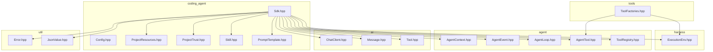
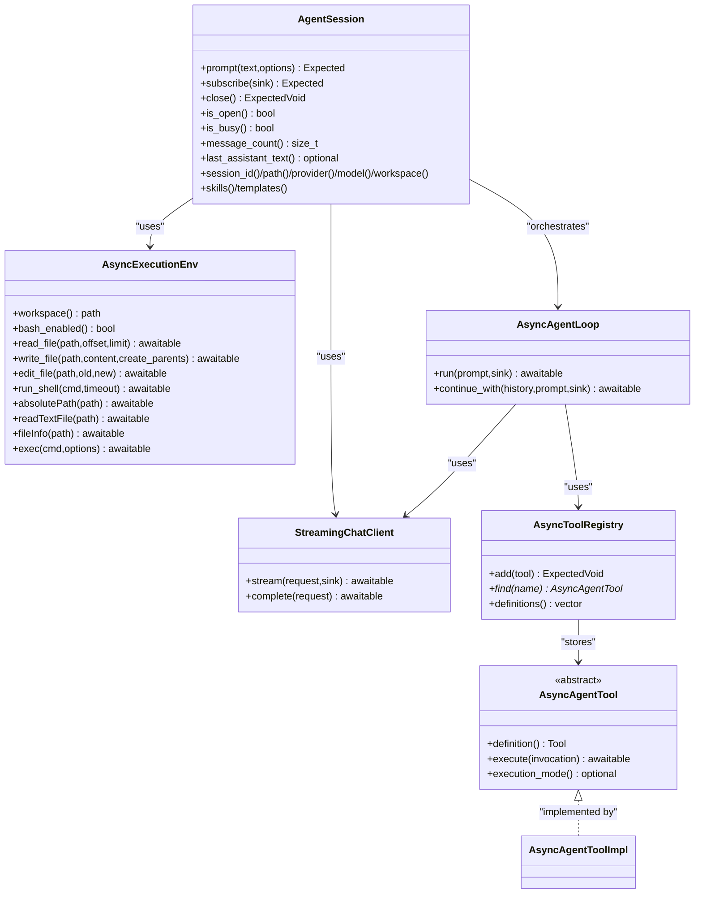
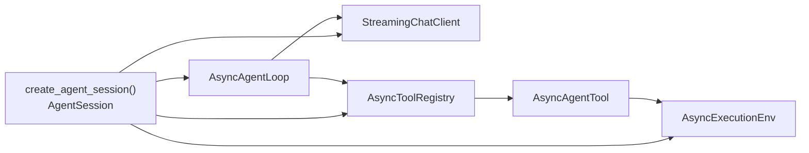

# API Reference

<cite>
**Referenced Files in This Document**
- [Sdk.hpp](file://include/cch/coding_agent/Sdk.hpp)
- [AgentContext.hpp](file://include/cch/agent/AgentContext.hpp)
- [AgentEvent.hpp](file://include/cch/agent/AgentEvent.hpp)
- [AgentLoop.hpp](file://include/cch/agent/AgentLoop.hpp)
- [AgentTool.hpp](file://include/cch/agent/AgentTool.hpp)
- [ToolRegistry.hpp](file://include/cch/agent/ToolRegistry.hpp)
- [ChatClient.hpp](file://include/cch/ai/ChatClient.hpp)
- [Message.hpp](file://include/cch/ai/Message.hpp)
- [Tool.hpp](file://include/cch/ai/Tool.hpp)
- [Error.hpp](file://include/cch/util/Error.hpp)
- [JsonValue.hpp](file://include/cch/util/JsonValue.hpp)
- [Config.hpp](file://include/cch/coding_agent/Config.hpp)
- [ProjectResources.hpp](file://include/cch/coding_agent/ProjectResources.hpp)
- [ProjectTrust.hpp](file://include/cch/coding_agent/ProjectTrust.hpp)
- [Skill.hpp](file://include/cch/coding_agent/Skill.hpp)
- [PromptTemplate.hpp](file://include/cch/coding_agent/PromptTemplate.hpp)
- [ExecutionEnv.hpp](file://include/cch/harness/ExecutionEnv.hpp)
- [ToolFactories.hpp](file://include/cch/tools/ToolFactories.hpp)
</cite>

## Table of Contents
1. [Introduction](#introduction)
2. [Project Structure](#project-structure)
3. [Core Components](#core-components)
4. [Architecture Overview](#architecture-overview)
5. [Detailed Component Analysis](#detailed-component-analysis)
6. [Dependency Analysis](#dependency-analysis)
7. [Performance Considerations](#performance-considerations)
8. [Troubleshooting Guide](#troubleshooting-guide)
9. [Conclusion](#conclusion)
10. [Appendices](#appendices)

## Introduction
This document provides a comprehensive API reference for the C++ Coding Harness embeddable SDK surface. It covers public interfaces for creating and controlling agent sessions, agent loop orchestration, tool contracts, AI message and tool schemas, execution environments, and utility types. It also documents error handling using std::expected, thread-safety considerations, and performance characteristics of key components.

## Project Structure
The SDK public headers are organized by functional area under include/cch/:
- coding_agent: Embeddable SDK surface, configuration, project resources/trust, skills, prompt templates
- agent: Agent loop, tool contracts, hooks, and event types
- ai: AI client interface, message variants, tool schemas, and usage
- harness: Execution environment abstraction and capability contracts
- tools: Factories for built-in async tools
- util: Error propagation types and JSON value wrapper

**Diagram sources**
- [Sdk.hpp:1-347](file://include/cch/coding_agent/Sdk.hpp#L1-L347)
- [AgentContext.hpp:1-90](file://include/cch/agent/AgentContext.hpp#L1-L90)
- [AgentEvent.hpp:1-111](file://include/cch/agent/AgentEvent.hpp#L1-L111)
- [AgentLoop.hpp:1-39](file://include/cch/agent/AgentLoop.hpp#L1-L39)
- [AgentTool.hpp:1-79](file://include/cch/agent/AgentTool.hpp#L1-L79)
- [ToolRegistry.hpp:1-51](file://include/cch/agent/ToolRegistry.hpp#L1-L51)
- [ChatClient.hpp:1-37](file://include/cch/ai/ChatClient.hpp#L1-L37)
- [Message.hpp:1-208](file://include/cch/ai/Message.hpp#L1-L208)
- [Tool.hpp:1-104](file://include/cch/ai/Tool.hpp#L1-L104)
- [ExecutionEnv.hpp:1-337](file://include/cch/harness/ExecutionEnv.hpp#L1-L337)
- [ToolFactories.hpp:1-16](file://include/cch/tools/ToolFactories.hpp#L1-L16)
- [Error.hpp:1-76](file://include/cch/util/Error.hpp#L1-L76)
- [JsonValue.hpp:1-105](file://include/cch/util/JsonValue.hpp#L1-L105)
- [Config.hpp:1-78](file://include/cch/coding_agent/Config.hpp#L1-L78)
- [ProjectResources.hpp:1-112](file://include/cch/coding_agent/ProjectResources.hpp#L1-L112)
- [ProjectTrust.hpp:1-93](file://include/cch/coding_agent/ProjectTrust.hpp#L1-L93)
- [Skill.hpp:1-60](file://include/cch/coding_agent/Skill.hpp#L1-L60)
- [PromptTemplate.hpp:1-18](file://include/cch/coding_agent/PromptTemplate.hpp#L1-L18)

**Section sources**
- [Sdk.hpp:1-347](file://include/cch/coding_agent/Sdk.hpp#L1-L347)
- [AgentContext.hpp:1-90](file://include/cch/agent/AgentContext.hpp#L1-L90)
- [AgentEvent.hpp:1-111](file://include/cch/agent/AgentEvent.hpp#L1-L111)
- [AgentLoop.hpp:1-39](file://include/cch/agent/AgentLoop.hpp#L1-L39)
- [AgentTool.hpp:1-79](file://include/cch/agent/AgentTool.hpp#L1-L79)
- [ToolRegistry.hpp:1-51](file://include/cch/agent/ToolRegistry.hpp#L1-L51)
- [ChatClient.hpp:1-37](file://include/cch/ai/ChatClient.hpp#L1-L37)
- [Message.hpp:1-208](file://include/cch/ai/Message.hpp#L1-L208)
- [Tool.hpp:1-104](file://include/cch/ai/Tool.hpp#L1-L104)
- [ExecutionEnv.hpp:1-337](file://include/cch/harness/ExecutionEnv.hpp#L1-L337)
- [ToolFactories.hpp:1-16](file://include/cch/tools/ToolFactories.hpp#L1-L16)
- [Error.hpp:1-76](file://include/cch/util/Error.hpp#L1-L76)
- [JsonValue.hpp:1-105](file://include/cch/util/JsonValue.hpp#L1-L105)
- [Config.hpp:1-78](file://include/cch/coding_agent/Config.hpp#L1-L78)
- [ProjectResources.hpp:1-112](file://include/cch/coding_agent/ProjectResources.hpp#L1-L112)
- [ProjectTrust.hpp:1-93](file://include/cch/coding_agent/ProjectTrust.hpp#L1-L93)
- [Skill.hpp:1-60](file://include/cch/coding_agent/Skill.hpp#L1-L60)
- [PromptTemplate.hpp:1-18](file://include/cch/coding_agent/PromptTemplate.hpp#L1-L18)

## Core Components
This section summarizes the primary public APIs grouped by namespace and responsibility.

- Embeddable SDK Surface (coding_agent):
  - Session creation and lifecycle: create_agent_session(), AgentSession
  - Prompt execution: AgentSession::prompt()
  - Event subscription: AgentSession::subscribe(), EventSubscription
  - Diagnostics and metadata: SdkDiagnostic, CreateAgentSessionResult, PromptResult
  - Provider configuration: SdkProviderConfig
  - Built-in tool selection: SdkBuiltinTools
  - Commands: SdkCommand
  - Options and results: CreateAgentSessionOptions, PromptOptions, CreateAgentSessionResult, PromptResult

- Agent Orchestration (agent):
  - Loop and context: AsyncAgentLoop, AsyncAgentOptions, AgentState, AsyncAgentRunResult
  - Hooks and transformations: TransformContextHook, ConvertToLlmHook, PrepareNextTurnHook, ValidateTurnUpdateHook
  - Events: AgentLifecycleEvent, AgentEventSink, event variants

- Tools (agent, tools):
  - Tool contract: AsyncAgentTool, ToolInvocation, AsyncToolExecutionResult, BeforeToolCallHook, AfterToolCallHook
  - Registry: AsyncToolRegistry
  - Factories: make_async_read_file_tool(), make_async_write_file_tool(), make_async_edit_file_tool(), make_async_bash_tool()

- AI Contracts (ai):
  - Streaming client: StreamingChatClient, StreamChatRequest, AssistantEventSink
  - Messages: MessageVariant, UserMessage, AssistantMessage, ToolResultMessage, and extended runtime messages
  - Tool schema: Tool, JsonSchema, ToolExecutionMode

- Execution Environment (harness):
  - Capability seam: AsyncExecutionEnv with file and shell operations, plus pi-shaped compatibility

- Utilities (util):
  - Error propagation: util::Expected<T, Error>, util::ExpectedVoid, Error, ErrorCode
  - JSON value wrapper: util::JsonValue

- Project Resources and Trust (coding_agent):
  - Project resource detection, enablement, and diagnostics
  - Project trust resolution and store

- Configuration (coding_agent):
  - ConfigData, ConfigLoader, provider settings resolution

**Section sources**
- [Sdk.hpp:34-347](file://include/cch/coding_agent/Sdk.hpp#L34-L347)
- [AgentContext.hpp:13-90](file://include/cch/agent/AgentContext.hpp#L13-L90)
- [AgentEvent.hpp:10-111](file://include/cch/agent/AgentEvent.hpp#L10-L111)
- [AgentTool.hpp:17-79](file://include/cch/agent/AgentTool.hpp#L17-L79)
- [ToolRegistry.hpp:13-51](file://include/cch/agent/ToolRegistry.hpp#L13-L51)
- [ChatClient.hpp:14-37](file://include/cch/ai/ChatClient.hpp#L14-L37)
- [Message.hpp:13-208](file://include/cch/ai/Message.hpp#L13-L208)
- [Tool.hpp:10-104](file://include/cch/ai/Tool.hpp#L10-L104)
- [ExecutionEnv.hpp:198-337](file://include/cch/harness/ExecutionEnv.hpp#L198-L337)
- [ToolFactories.hpp:8-16](file://include/cch/tools/ToolFactories.hpp#L8-L16)
- [Error.hpp:8-76](file://include/cch/util/Error.hpp#L8-L76)
- [JsonValue.hpp:10-105](file://include/cch/util/JsonValue.hpp#L10-L105)
- [ProjectResources.hpp:13-112](file://include/cch/coding_agent/ProjectResources.hpp#L13-L112)
- [ProjectTrust.hpp:10-93](file://include/cch/coding_agent/ProjectTrust.hpp#L10-L93)
- [Config.hpp:11-78](file://include/cch/coding_agent/Config.hpp#L11-L78)
- [Skill.hpp:6-60](file://include/cch/coding_agent/Skill.hpp#L6-L60)
- [PromptTemplate.hpp:6-18](file://include/cch/coding_agent/PromptTemplate.hpp#L6-L18)

## Architecture Overview
The SDK exposes a layered surface:
- At the top level, create_agent_session() composes a session with a provider client, execution environment, tools, and resources.
- AgentSession encapsulates a single session lifecycle, supporting prompt execution and event subscriptions.
- The agent loop (AsyncAgentLoop) orchestrates turns, invoking tools and emitting lifecycle events.
- Tools implement AsyncAgentTool and are registered via AsyncToolRegistry.
- The AI client (StreamingChatClient) streams assistant responses; messages are represented by MessageVariant.
- The execution environment (AsyncExecutionEnv) provides file and shell capabilities.

**Diagram sources**
- [ExecutionEnv.hpp:198-337](file://include/cch/harness/ExecutionEnv.hpp#L198-L337)
- [ChatClient.hpp:23-34](file://include/cch/ai/ChatClient.hpp#L23-L34)
- [AgentTool.hpp:64-79](file://include/cch/agent/AgentTool.hpp#L64-L79)
- [ToolRegistry.hpp:13-48](file://include/cch/agent/ToolRegistry.hpp#L13-L48)
- [AgentLoop.hpp:16-36](file://include/cch/agent/AgentLoop.hpp#L16-L36)
- [Sdk.hpp:241-332](file://include/cch/coding_agent/Sdk.hpp#L241-L332)

## Detailed Component Analysis

### Embeddable SDK Surface (coding_agent)
- Purpose: Provide an embeddable, source-level API surface for creating and controlling agent sessions.
- Stability: The SDK is experimental and not ABI-stable.
- Key types:
  - SdkDiagnostic: Diagnostic entries with severity, code, message, and optional path.
  - SdkProviderConfig: Provider identity and API key environment chain.
  - SdkBuiltinTools: Built-in tool enablement flags.
  - SdkCommand: Host-registered slash-command with handler.
  - CreateAgentSessionOptions: Session target (new vs resume), workspace, provider/client, execution environment, tools, resources, and project resource loading controls.
  - CreateAgentSessionResult: Session handle, diagnostics, and resolved metadata.
  - PromptOptions: Per-prompt event sink.
  - PromptResult: Outcome of a prompt with code/message, last assistant text, message count, and diagnostics.
  - EventSubscription: RAII handle for event subscriptions.
  - AgentSession: Move-only session handle with lifecycle, prompt execution, subscription, state accessors, and resource introspection.
  - create_agent_session(): Factory function returning a session and diagnostics.

- Function signatures and behavior:
  - create_agent_session(CreateAgentSessionOptions): Validates options, constructs provider client and execution environment, registers tools and resources, and returns a session with diagnostics. Failure modes include validation errors, provider/client resolution failures, and resource loading issues.
  - AgentSession::prompt(string text, PromptOptions options): Blocking prompt execution; returns an error if session is closed, busy, or invalid. Emits lifecycle events to persistent and per-prompt sinks.
  - AgentSession::subscribe(AgentEventSink sink): Subscribes to agent lifecycle events; returns an error if session is closed.
  - AgentSession::close(): Idempotent; clears subscribers and releases owned resources; host-provided execution environments are not cleaned up unless requested.
  - AgentSession state accessors: Reflect only committed history; uncommitted assistant text from a failed prompt is not exposed.

- Exception behavior:
  - All public APIs return util::Expected<T, Error> or util::ExpectedVoid. Errors carry a stable ErrorCode and human-readable message/detail/context.

- Thread safety:
  - AgentSession::prompt() is blocking and serial; re-entrancy returns an error.
  - AgentSession::subscribe() and EventSubscription lifetime are not synchronized across threads; avoid concurrent modifications to the subscription handle.
  - AgentSession::close() is idempotent and clears subscriptions; subsequent prompt calls return an error.

- Performance characteristics:
  - Prompt execution is synchronous and bounded by max_turns; tool execution can be sequential or parallel depending on options.
  - Event emission occurs synchronously within the agent loop; heavy sinks can slow prompt completion.

**Section sources**
- [Sdk.hpp:34-347](file://include/cch/coding_agent/Sdk.hpp#L34-L347)
- [Error.hpp:8-76](file://include/cch/util/Error.hpp#L8-L76)

### Agent Orchestration (agent)
- AsyncAgentLoop:
  - Constructor: AsyncAgentLoop(StreamingChatClient&, AsyncToolRegistry, AsyncAgentOptions)
  - run(user_prompt, sink): Starts a new loop; returns AsyncAgentRunResult with context, stop reason, turns, and state.
  - continue_with(history, user_prompt, sink): Continues an existing history; returns AsyncAgentRunResult.
  - Internal helpers: emit() for event emission, tool_calls() for extracting tool calls from assistant messages.

- AsyncAgentOptions:
  - Controls max_turns, model, tool execution mode, parallelism, and optional hooks for context transformation, steering/follow-up messages, and turn updates.

- AgentState and AsyncAgentRunResult:
  - Capture current messages, streaming message, active/pending tool call identifiers, model, and thinking level.

- Hooks and transformations:
  - TransformContextHook: Transforms context prior to LLM consumption.
  - ConvertToLlmHook: Converts context to LLM-friendly form.
  - GetSteeringMessagesHook / GetFollowUpMessagesHook: Provide steering and follow-up messages.
  - PrepareNextTurnHook: Suggests updates (append messages, model change, thinking level).
  - ValidateTurnUpdateHook: Validates high-privilege turn updates.

- Event system:
  - AgentLifecycleEvent variant enumerates lifecycle events.
  - AgentEventSink: move-only sink receiving events.

- Thread safety:
  - run()/continue_with() are coroutine-based; avoid concurrent invocations on the same loop instance.

**Section sources**
- [AgentLoop.hpp:16-36](file://include/cch/agent/AgentLoop.hpp#L16-L36)
- [AgentContext.hpp:13-90](file://include/cch/agent/AgentContext.hpp#L13-L90)
- [AgentEvent.hpp:10-111](file://include/cch/agent/AgentEvent.hpp#L10-L111)

### Tool Contracts (agent, tools)
- AsyncAgentTool:
  - Pure virtual contract: definition() returns Tool, execute(ToolInvocation) returns AsyncToolExecutionResult.
  - Optional execution_mode() hint; defaults defer to run-level option.
  - ToolInvocation: call_id, name, arguments (util::JsonValue), raw_arguments.
  - AsyncToolExecutionResult: content, details, is_error, terminate flags.

- BeforeToolCallHook / AfterToolCallHook:
  - BeforeToolCallContext: assistant message, tool call, args, context.
  - BeforeToolCallResult: block flag and optional reason.
  - AfterToolCallContext: assistant message, tool call, args, result, is_error, context.
  - AfterToolCallResult: optional overrides for content, details, is_error, terminate.

- AsyncToolRegistry:
  - add(tool): Returns error for null tool; stores by tool name.
  - find(name): Returns tool pointer or null.
  - definitions(): Returns sorted list of tool definitions.

- Built-in tool factories:
  - make_async_read_file_tool(env)
  - make_async_write_file_tool(env)
  - make_async_edit_file_tool(env)
  - make_async_bash_tool(env)

- Thread safety:
  - Registry operations are not synchronized; populate before starting loops.
  - Tool execution is asynchronous; ensure thread-safe access to shared resources.

**Section sources**
- [AgentTool.hpp:17-79](file://include/cch/agent/AgentTool.hpp#L17-L79)
- [ToolRegistry.hpp:13-48](file://include/cch/agent/ToolRegistry.hpp#L13-L48)
- [ToolFactories.hpp:8-16](file://include/cch/tools/ToolFactories.hpp#L8-L16)

### AI Contracts (ai)
- StreamingChatClient:
  - stream(request, sink): Initiates streaming assistant response; sink receives AssistantStreamEvent updates.
  - complete(request): Convenience returning a single AssistantMessage without streaming.

- StreamChatRequest:
  - Holds AiContext and model for streaming requests.

- Message variants and helpers:
  - MessageVariant: variant over system, user, assistant, tool result, and extended runtime messages.
  - Helpers: user_text_message(), assistant_text_message(), tool_result_message(), and conversion helpers for extended messages to user messages.

- Tool schema:
  - Tool: name, description, parameters (JsonSchema).
  - JsonSchema: builder helpers for object, string, integer, boolean, number, array, null; supports nested schemas and required properties.

- Thread safety:
  - Streaming is coroutine-based; avoid concurrent stream calls on the same client instance.

**Section sources**
- [ChatClient.hpp:14-37](file://include/cch/ai/ChatClient.hpp#L14-L37)
- [Message.hpp:13-208](file://include/cch/ai/Message.hpp#L13-L208)
- [Tool.hpp:10-104](file://include/cch/ai/Tool.hpp#L10-L104)

### Execution Environment (harness)
- AsyncExecutionEnv:
  - Core tool-shaped methods: read_file, write_file, edit_file, run_shell.
  - Pi-shaped filesystem methods: absolutePath, joinPath, readTextFile, readTextLines, readBinaryFile, writeFile, appendFile, fileInfo, listDir, canonicalPath, exists, createDir, remove, createTempDir, createTempFile, cleanup.
  - Pi-shaped shell method: exec with ExecOptions and ShellExecResult.
  - Error conversion helpers: to_util_error(FileError), to_util_error(ExecutionError).

- Thread safety:
  - Methods are coroutine-based; avoid concurrent operations on the same environment instance.
  - Cleanup() is best-effort and must not throw.

**Section sources**
- [ExecutionEnv.hpp:198-337](file://include/cch/harness/ExecutionEnv.hpp#L198-L337)

### Utilities (util)
- Error propagation:
  - util::Expected<T, Error>: std::expected alias for return types.
  - util::ExpectedVoid: std::expected<void, Error>.
  - Error: code, message, detail, context.
  - ErrorCode: enumeration of stable error categories.

- JsonValue:
  - Wrapper around std::variant for JSON-like values with getters and helpers.

**Section sources**
- [Error.hpp:8-76](file://include/cch/util/Error.hpp#L8-L76)
- [JsonValue.hpp:10-105](file://include/cch/util/JsonValue.hpp#L10-L105)

### Project Resources and Trust (coding_agent)
- ProjectResourceKind, ResourceEnablement, ResourceDiagnosticSeverity, ResourceSkipReason, ResourceDiagnostic, DetectedProjectResource, ProjectResourceDetectionResult, ResourceLoadDecision, ProjectResourcePolicy, ProjectResourceLoadPlan, and related helpers.
- ProjectTrustDecision, DefaultProjectTrust, ProjectTrustSource, ProjectTrustDiagnostic, ProjectTrustStoreEntry, ProjectTrustUpdate, ProjectTrustResolution, ProjectTrustStore, and resolution helpers.
- Functions: detect_project_resources(), build_project_resource_load_plan(), resolve_project_trust(), and string conversions.

**Section sources**
- [ProjectResources.hpp:13-112](file://include/cch/coding_agent/ProjectResources.hpp#L13-L112)
- [ProjectTrust.hpp:10-93](file://include/cch/coding_agent/ProjectTrust.hpp#L10-L93)

### Configuration (coding_agent)
- ConfigData: provider, model, base_url, api_key_env chain, default project trust, project skills enablement.
- ConfigLoader: load(config_path), resolve_api_key(env_chain), default_config_path().
- Provider settings resolution: ResolvedProviderSettings, resolve_provider_settings(), resolved_api_key_env_chain().
- CliProviderOverrides: model, base_url, api_key_env overrides.

**Section sources**
- [Config.hpp:11-78](file://include/cch/coding_agent/Config.hpp#L11-L78)

### Skills and Prompt Templates (coding_agent)
- Skill: name, description, content, filePath, disableModelInvocation, diagnostics and load result types.
- PromptTemplate: name, description, content, optional argument_hint.

**Section sources**
- [Skill.hpp:6-60](file://include/cch/coding_agent/Skill.hpp#L6-L60)
- [PromptTemplate.hpp:6-18](file://include/cch/coding_agent/PromptTemplate.hpp#L6-L18)

## Dependency Analysis
Public SDK dependencies and relationships:
- AgentSession depends on AsyncAgentLoop, StreamingChatClient, AsyncExecutionEnv, and AsyncToolRegistry.
- AsyncAgentLoop depends on StreamingChatClient and AsyncToolRegistry.
- Tools depend on AsyncExecutionEnv and AsyncAgentTool contract.
- SDK options compose provider configuration, execution environment, and resources; diagnostics propagate through the system.

**Diagram sources**
- [Sdk.hpp:336-347](file://include/cch/coding_agent/Sdk.hpp#L336-L347)
- [AgentLoop.hpp:16-36](file://include/cch/agent/AgentLoop.hpp#L16-L36)
- [AgentTool.hpp:64-79](file://include/cch/agent/AgentTool.hpp#L64-L79)
- [ExecutionEnv.hpp:198-337](file://include/cch/harness/ExecutionEnv.hpp#L198-L337)
- [ToolRegistry.hpp:13-48](file://include/cch/agent/ToolRegistry.hpp#L13-L48)
- [ChatClient.hpp:23-34](file://include/cch/ai/ChatClient.hpp#L23-L34)

**Section sources**
- [Sdk.hpp:336-347](file://include/cch/coding_agent/Sdk.hpp#L336-L347)
- [AgentLoop.hpp:16-36](file://include/cch/agent/AgentLoop.hpp#L16-L36)
- [AgentTool.hpp:64-79](file://include/cch/agent/AgentTool.hpp#L64-L79)
- [ExecutionEnv.hpp:198-337](file://include/cch/harness/ExecutionEnv.hpp#L198-L337)
- [ToolRegistry.hpp:13-48](file://include/cch/agent/ToolRegistry.hpp#L13-L48)
- [ChatClient.hpp:23-34](file://include/cch/ai/ChatClient.hpp#L23-L34)

## Performance Considerations
- Prompt throughput is controlled by max_turns and tool execution mode; parallel tool execution can improve latency for independent tasks.
- Event sinks can impact prompt duration; keep sinks efficient and non-blocking.
- File I/O and shell operations are asynchronous; avoid excessive concurrent operations to prevent contention.
- Provider streaming overhead depends on network and server-side rate limits; batch prompts when possible.

## Troubleshooting Guide
- Error propagation:
  - All public APIs return util::Expected<T, Error>; check ErrorCode for classification (e.g., Validation, Provider, Tool, Session, Workspace, Process).
  - Use Error.detail and Error.context for additional diagnostics.
- Common issues:
  - Validation errors: incorrect options (e.g., both session_path and resume_path set) or missing required fields.
  - Provider errors: misconfigured provider settings or API key resolution failures.
  - Tool errors: invalid tool invocation arguments or tool-specific failures.
  - Session errors: attempting to prompt on a closed session or re-entrant calls.
  - Workspace errors: file system permission or path resolution issues.
- Diagnostics:
  - SDK diagnostics and prompt diagnostics provide actionable insights; inspect SdkDiagnostic and PromptResult.diagnostics.

**Section sources**
- [Error.hpp:8-76](file://include/cch/util/Error.hpp#L8-L76)
- [Sdk.hpp:36-208](file://include/cch/coding_agent/Sdk.hpp#L36-L208)

## Conclusion
The C++ Coding Harness SDK provides a cohesive, embeddable surface for building AI-driven coding agents. It emphasizes composability (provider client, execution environment, tools), robust error handling via std::expected, and a clear separation between public contracts and internal implementation details. By adhering to the documented interfaces and considering thread-safety and performance guidelines, integrators can build reliable, maintainable agent applications.

## Appendices

### Versioning and Compatibility
- The SDK is experimental and not ABI-stable. Expect breaking changes across minor versions.
- Public headers are designed as source-level contracts; avoid relying on internal implementation details.

### Usage Examples (by reference)
- Creating a session:
  - See [Sdk.hpp:336-347](file://include/cch/coding_agent/Sdk.hpp#L336-L347) for factory signature and [Sdk.hpp:97-149](file://include/cch/coding_agent/Sdk.hpp#L97-L149) for options.
- Running a prompt:
  - See [Sdk.hpp:267-269](file://include/cch/coding_agent/Sdk.hpp#L267-L269) for AgentSession::prompt signature and [Sdk.hpp:175-180](file://include/cch/coding_agent/Sdk.hpp#L175-L180) for PromptOptions.
- Subscribing to events:
  - See [Sdk.hpp:277-278](file://include/cch/coding_agent/Sdk.hpp#L277-L278) for AgentSession::subscribe and [AgentEvent.hpp:108](file://include/cch/agent/AgentEvent.hpp#L108) for AgentEventSink.
- Defining a tool:
  - See [AgentTool.hpp:64-79](file://include/cch/agent/AgentTool.hpp#L64-L79) for AsyncAgentTool contract and [ToolRegistry.hpp:21-27](file://include/cch/agent/ToolRegistry.hpp#L21-L27) for adding tools.
- Using the execution environment:
  - See [ExecutionEnv.hpp:207-221](file://include/cch/harness/ExecutionEnv.hpp#L207-L221) for core file operations and [ExecutionEnv.hpp:329-333](file://include/cch/harness/ExecutionEnv.hpp#L329-L333) for exec.
- Provider configuration:
  - See [Sdk.hpp:54-61](file://include/cch/coding_agent/Sdk.hpp#L54-L61) for SdkProviderConfig and [Config.hpp:64-70](file://include/cch/coding_agent/Config.hpp#L64-L70) for provider settings resolution.