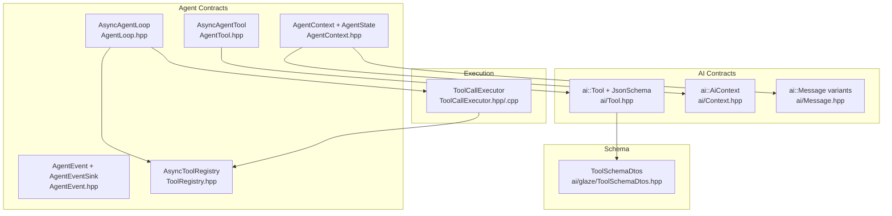
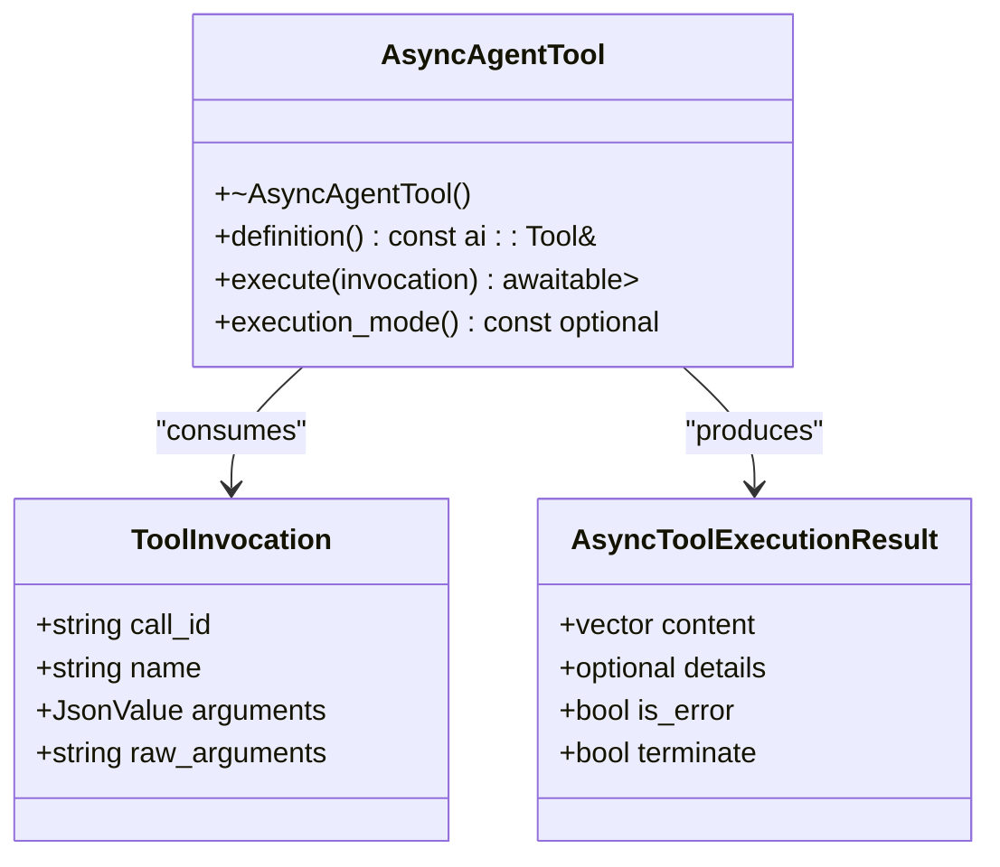
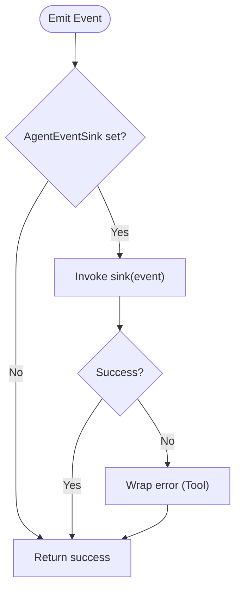
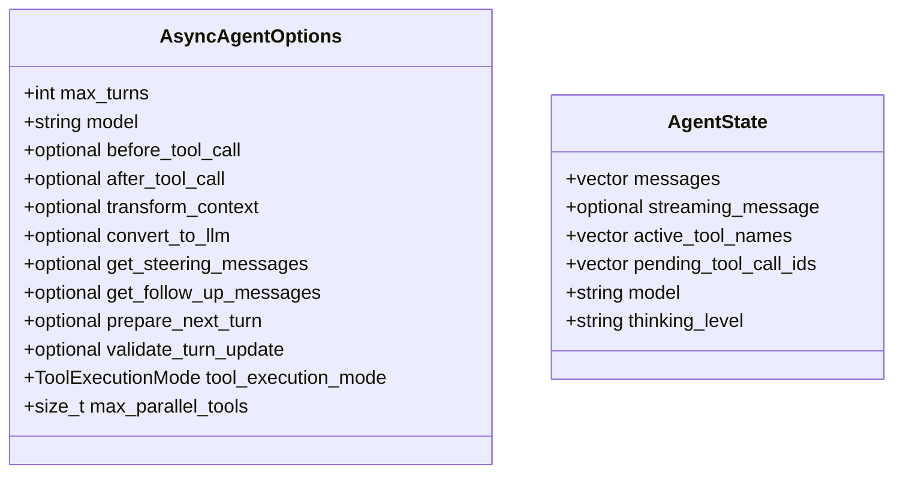
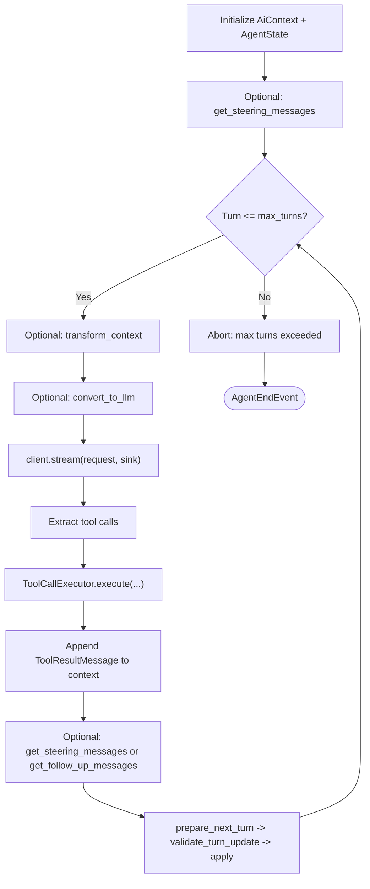
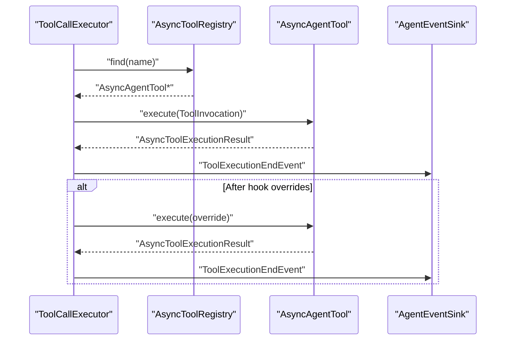
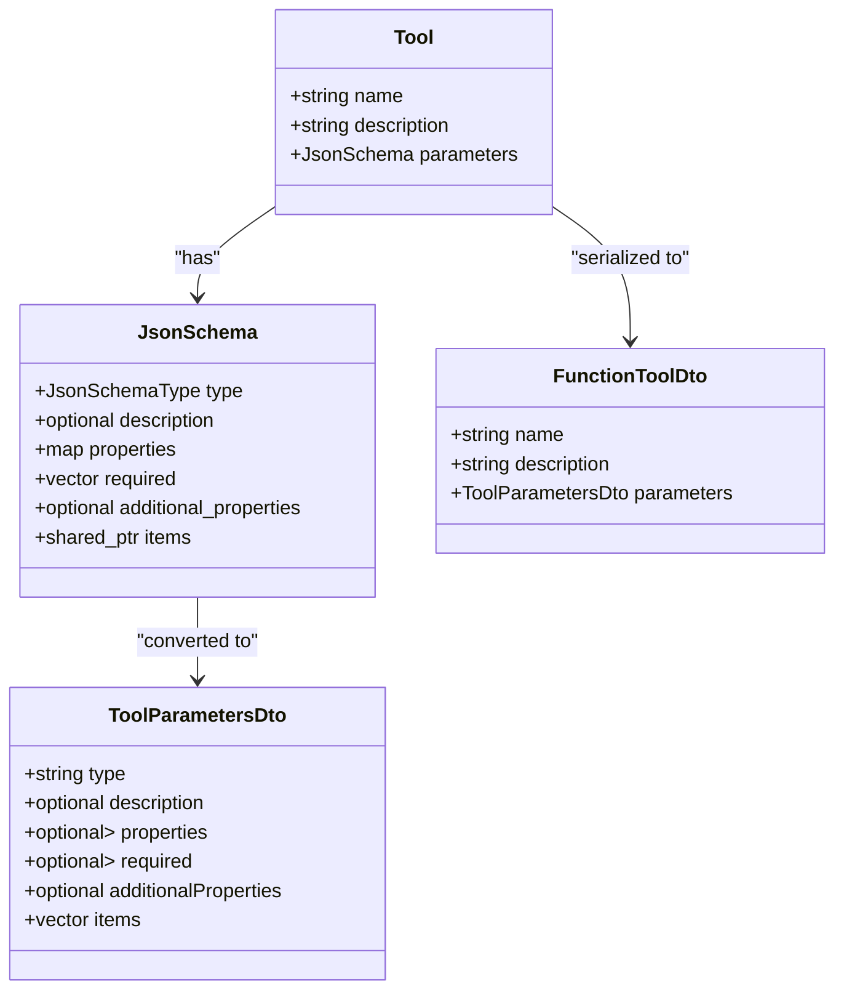
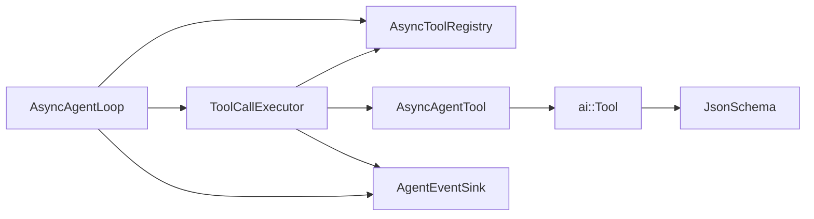

# Agent Contracts

<cite>
**Referenced Files in This Document**
- [AgentTool.hpp](file://include/cch/agent/AgentTool.hpp)
- [AgentEvent.hpp](file://include/cch/agent/AgentEvent.hpp)
- [AgentContext.hpp](file://include/cch/agent/AgentContext.hpp)
- [ToolRegistry.hpp](file://include/cch/agent/ToolRegistry.hpp)
- [AgentLoop.hpp](file://include/cch/agent/AgentLoop.hpp)
- [AgentLoop.cpp](file://src/agent/AgentLoop.cpp)
- [ToolCallExecutor.hpp](file://src/agent/ToolCallExecutor.hpp)
- [ToolCallExecutor.cpp](file://src/agent/ToolCallExecutor.cpp)
- [Tool.hpp](file://include/cch/ai/Tool.hpp)
- [Context.hpp](file://include/cch/ai/Context.hpp)
- [Message.hpp](file://include/cch/ai/Message.hpp)
- [ToolSchemaDtos.hpp](file://src/ai/glaze/ToolSchemaDtos.hpp)
- [ToolContractTest.cpp](file://tests/ai/ToolContractTest.cpp)
- [AsyncAgentLoopTest.cpp](file://tests/agent/AsyncAgentLoopTest.cpp)
- [ToolCallExecutorTest.cpp](file://tests/agent/ToolCallExecutorTest.cpp)
</cite>

## Table of Contents
1. [Introduction](#introduction)
2. [Project Structure](#project-structure)
3. [Core Components](#core-components)
4. [Architecture Overview](#architecture-overview)
5. [Detailed Component Analysis](#detailed-component-analysis)
6. [Dependency Analysis](#dependency-analysis)
7. [Performance Considerations](#performance-considerations)
8. [Troubleshooting Guide](#troubleshooting-guide)
9. [Conclusion](#conclusion)
10. [Appendices](#appendices)

## Introduction
This document describes the agent contract interfaces and data structures that enable asynchronous tool execution within an agent loop. It covers the AsyncAgentTool abstract base class, the AgentEvent lifecycle and AgentEventSink callback mechanism, the AgentContext and AgentState structures, the ToolRegistry interface for tool discovery and registration, and the AgentLoop orchestration of turns and tool execution. It also explains tool schema generation for AI providers and provides practical guidance for implementing custom tools, registering them, validating inputs, handling errors, and considering security.

## Project Structure
The agent contracts live primarily under include/cch/agent and include/cch/ai, with orchestration and execution logic under src/agent. Tests under tests/agent and tests/ai validate behavior and demonstrate usage patterns.



**Diagram sources**
- [AgentTool.hpp:64-76](file://include/cch/agent/AgentTool.hpp#L64-L76)
- [AgentEvent.hpp:91-108](file://include/cch/agent/AgentEvent.hpp#L91-L108)
- [AgentContext.hpp:49-87](file://include/cch/agent/AgentContext.hpp#L49-L87)
- [ToolRegistry.hpp:13-48](file://include/cch/agent/ToolRegistry.hpp#L13-L48)
- [AgentLoop.hpp:16-36](file://include/cch/agent/AgentLoop.hpp#L16-L36)
- [Tool.hpp:97-101](file://include/cch/ai/Tool.hpp#L97-L101)
- [Context.hpp:12-17](file://include/cch/ai/Context.hpp#L12-L17)
- [Message.hpp:97-105](file://include/cch/ai/Message.hpp#L97-L105)
- [ToolCallExecutor.hpp:31-62](file://src/agent/ToolCallExecutor.hpp#L31-L62)
- [ToolSchemaDtos.hpp:14-30](file://src/ai/glaze/ToolSchemaDtos.hpp#L14-L30)

**Section sources**
- [AgentTool.hpp:1-79](file://include/cch/agent/AgentTool.hpp#L1-L79)
- [AgentEvent.hpp:1-111](file://include/cch/agent/AgentEvent.hpp#L1-L111)
- [AgentContext.hpp:1-90](file://include/cch/agent/AgentContext.hpp#L1-L90)
- [ToolRegistry.hpp:1-51](file://include/cch/agent/ToolRegistry.hpp#L1-L51)
- [AgentLoop.hpp:1-39](file://include/cch/agent/AgentLoop.hpp#L1-L39)
- [Tool.hpp:1-104](file://include/cch/ai/Tool.hpp#L1-L104)
- [Context.hpp:1-20](file://include/cch/ai/Context.hpp#L1-L20)
- [Message.hpp:1-208](file://include/cch/ai/Message.hpp#L1-L208)
- [ToolCallExecutor.hpp:1-65](file://src/agent/ToolCallExecutor.hpp#L1-L65)
- [ToolCallExecutor.cpp:1-517](file://src/agent/ToolCallExecutor.cpp#L1-L517)
- [ToolSchemaDtos.hpp:1-145](file://src/ai/glaze/ToolSchemaDtos.hpp#L1-L145)

## Core Components
- AsyncAgentTool: Abstract base class defining a tool’s contract, including definition(), execute(), and optional execution_mode().
- AgentEvent and AgentEventSink: Strongly typed lifecycle events and a callback sink for event-driven communication.
- AgentContext and AgentState: Options, hooks, and runtime state for the agent loop.
- AsyncToolRegistry: Tool discovery and registration interface.
- AsyncAgentLoop: Orchestrates turns, streams assistant responses, parses tool calls, and coordinates ToolCallExecutor.
- ToolCallExecutor: Executes tool calls sequentially or in parallel, honoring per-tool and global execution modes, and invoking before/after hooks.
- ai::Tool and JsonSchema: Tool metadata and parameter schema contracts, plus Glaze DTOs for serialization to provider-compatible formats.

**Section sources**
- [AgentTool.hpp:64-76](file://include/cch/agent/AgentTool.hpp#L64-L76)
- [AgentEvent.hpp:91-108](file://include/cch/agent/AgentEvent.hpp#L91-L108)
- [AgentContext.hpp:49-87](file://include/cch/agent/AgentContext.hpp#L49-L87)
- [ToolRegistry.hpp:13-48](file://include/cch/agent/ToolRegistry.hpp#L13-L48)
- [AgentLoop.hpp:16-36](file://include/cch/agent/AgentLoop.hpp#L16-L36)
- [ToolCallExecutor.hpp:31-62](file://src/agent/ToolCallExecutor.hpp#L31-L62)
- [Tool.hpp:97-101](file://include/cch/ai/Tool.hpp#L97-L101)

## Architecture Overview
The agent loop streams assistant responses, extracts tool calls, and delegates execution to ToolCallExecutor. Tools are discovered via AsyncToolRegistry and invoked with structured contexts. Events are emitted through AgentEventSink to drive UI, logging, and observability.

```mermaid
sequenceDiagram
participant Client as "StreamingChatClient"
participant Loop as "AsyncAgentLoop"
participant Exec as "ToolCallExecutor"
participant Reg as "AsyncToolRegistry"
participant Tool as "AsyncAgentTool"
Loop->>Client : "stream(request, sink)"
Client-->>Loop : "AssistantStart/TextDelta/ThinkingDelta/ToolCall*"
Loop->>Loop : "parse tool calls"
Loop->>Exec : "execute(turn, assistant, calls, context, state, sink)"
Exec->>Reg : "find(tool_name)"
Reg-->>Exec : "AsyncAgentTool*"
Exec->>Tool : "execute(ToolInvocation)"
Tool-->>Exec : "AsyncToolExecutionResult"
Exec-->>Loop : "ToolCallBatchResult(results, terminate)"
Loop->>Loop : "append ToolResultMessage to context"
Loop-->>Client : "continue_with(history, prompt, sink)"
```

**Diagram sources**
- [AgentLoop.cpp:249-531](file://src/agent/AgentLoop.cpp#L249-L531)
- [ToolCallExecutor.cpp:123-143](file://src/agent/ToolCallExecutor.cpp#L123-L143)
- [ToolCallExecutor.cpp:145-250](file://src/agent/ToolCallExecutor.cpp#L145-L250)
- [ToolCallExecutor.cpp:252-514](file://src/agent/ToolCallExecutor.cpp#L252-L514)
- [ToolRegistry.hpp:29-32](file://include/cch/agent/ToolRegistry.hpp#L29-L32)
- [AgentTool.hpp:69-70](file://include/cch/agent/AgentTool.hpp#L69-L70)

## Detailed Component Analysis

### AsyncAgentTool: Tool Contract and Lifecycle
- Definition: Each tool exposes a constant ai::Tool describing its name, description, and JSON schema parameters.
- Execution: execute() receives a ToolInvocation with call_id, name, parsed arguments, and raw arguments; returns AsyncToolExecutionResult containing content, optional details, error flag, and termination hint.
- Execution mode: Optional execution_mode() allows a tool to request sequential execution even when the global mode is parallel.



**Diagram sources**
- [AgentTool.hpp:19-31](file://include/cch/agent/AgentTool.hpp#L19-L31)
- [AgentTool.hpp:64-76](file://include/cch/agent/AgentTool.hpp#L64-L76)

**Section sources**
- [AgentTool.hpp:19-31](file://include/cch/agent/AgentTool.hpp#L19-L31)
- [AgentTool.hpp:64-76](file://include/cch/agent/AgentTool.hpp#L64-L76)

### AgentEvent and AgentEventSink: Event-Driven Communication
- AgentLifecycleEvent: A variant covering lifecycle stages such as AgentStartEvent, TurnStartEvent, MessageStartEvent, ThinkingUpdateEvent, ToolCallStream* events, ToolExecutionStartEvent, ToolExecutionEndEvent, TurnEndEvent, and AgentEndEvent.
- AgentEventSink: A move-only callback receiving AgentLifecycleEvent and returning util::ExpectedVoid. The agent loop wraps sink invocations with robust exception handling.



**Diagram sources**
- [AgentLoop.cpp:533-550](file://src/agent/AgentLoop.cpp#L533-L550)
- [AgentEvent.hpp:91-108](file://include/cch/agent/AgentEvent.hpp#L91-L108)

**Section sources**
- [AgentEvent.hpp:91-108](file://include/cch/agent/AgentEvent.hpp#L91-L108)
- [AgentLoop.cpp:533-550](file://src/agent/AgentLoop.cpp#L533-L550)

### AgentContext and AgentState: Options, Hooks, and Runtime State
- AsyncAgentOptions: Controls max turns, model, tool execution mode, max parallel tools, and optional hooks:
  - TransformContextHook: Adjust context messages before LLM request.
  - ConvertToLlmHook: Filter/convert messages to LLM-friendly form.
  - GetSteeringMessagesHook: Inject queued messages at turn start/end.
  - GetFollowUpMessagesHook: Inject queued messages when no tool calls are produced.
  - PrepareNextTurnHook: Propose AgentLoopTurnUpdate (append_messages, model, thinking_level).
  - ValidateTurnUpdateHook: Validate proposed turn updates (e.g., model changes).
  - BeforeToolCallHook and AfterToolCallHook: Pre/post tool execution hooks.
- AgentState: Tracks messages, streaming message, active tool names, pending tool call ids, model, and thinking level.



**Diagram sources**
- [AgentContext.hpp:49-87](file://include/cch/agent/AgentContext.hpp#L49-L87)

**Section sources**
- [AgentContext.hpp:49-87](file://include/cch/agent/AgentContext.hpp#L49-L87)

### ToolRegistry: Tool Discovery and Registration
- add(): Registers a tool by its definition.name; rejects null pointers.
- find(): Retrieves a tool by name.
- definitions(): Returns sorted vector of ai::Tool definitions for provider registration.

```mermaid
classDiagram
class AsyncToolRegistry {
+add(unique_ptr<AsyncAgentTool>) ExpectedVoid
+find(name) AsyncAgentTool*
+definitions() vector<ai : : Tool>
}
AsyncToolRegistry --> AsyncAgentTool : "stores"
AsyncAgentTool --> ai : : Tool : "exposes definition()"
```

**Diagram sources**
- [ToolRegistry.hpp:13-48](file://include/cch/agent/ToolRegistry.hpp#L13-L48)
- [AgentTool.hpp:68](file://include/cch/agent/AgentTool.hpp#L68)

**Section sources**
- [ToolRegistry.hpp:13-48](file://include/cch/agent/ToolRegistry.hpp#L13-L48)

### AgentLoop: Orchestration and Turn Management
- run()/continue_with(): Initialize context, optionally inject steering messages, iterate turns up to max_turns.
- Streams assistant responses and emits lifecycle events.
- Extracts tool calls from assistant messages and invokes ToolCallExecutor.
- Applies steering/follow-up messages and prepares next turn updates via hooks.
- Emits AgentEndEvent on completion or failure.



**Diagram sources**
- [AgentLoop.cpp:249-531](file://src/agent/AgentLoop.cpp#L249-L531)
- [AgentLoop.hpp:20-27](file://include/cch/agent/AgentLoop.hpp#L20-L27)

**Section sources**
- [AgentLoop.hpp:16-36](file://include/cch/agent/AgentLoop.hpp#L16-L36)
- [AgentLoop.cpp:249-531](file://src/agent/AgentLoop.cpp#L249-L531)

### ToolCallExecutor: Execution Modes and Hook Integration
- Mode selection: Uses global mode unless any tool requests sequential or call count exceeds max_parallel_tools.
- Sequential execution: Processes calls one-by-one, emitting ToolExecutionStartEvent/ToolExecutionEndEvent, invoking before/after hooks, and building ToolResultMessage.
- Parallel execution: Spawns coroutines per call, captures results, and ensures thread-safe event emission and error propagation.
- Argument parsing: Converts raw_arguments to JsonValue; malformed arguments produce error results.
- Termination: After hooks can signal batch termination; a batch terminates only if all calls agree to terminate and none errored.



**Diagram sources**
- [ToolCallExecutor.cpp:123-143](file://src/agent/ToolCallExecutor.cpp#L123-L143)
- [ToolCallExecutor.cpp:145-250](file://src/agent/ToolCallExecutor.cpp#L145-L250)
- [ToolCallExecutor.cpp:252-514](file://src/agent/ToolCallExecutor.cpp#L252-L514)
- [ToolRegistry.hpp:29-32](file://include/cch/agent/ToolRegistry.hpp#L29-L32)

**Section sources**
- [ToolCallExecutor.hpp:31-62](file://src/agent/ToolCallExecutor.hpp#L31-L62)
- [ToolCallExecutor.cpp:123-143](file://src/agent/ToolCallExecutor.cpp#L123-L143)
- [ToolCallExecutor.cpp:145-250](file://src/agent/ToolCallExecutor.cpp#L145-L250)
- [ToolCallExecutor.cpp:252-514](file://src/agent/ToolCallExecutor.cpp#L252-L514)

### Tool Schema Generation and Provider Compatibility
- ai::Tool and ai::JsonSchema define the tool’s metadata and parameter schema.
- ai::glaze::ToolSchemaDtos and related functions serialize schemas to provider-compatible JSON for function calling.
- Tests verify round-tripping and additionalProperties semantics.



**Diagram sources**
- [Tool.hpp:97-101](file://include/cch/ai/Tool.hpp#L97-L101)
- [Tool.hpp:27-95](file://include/cch/ai/Tool.hpp#L27-L95)
- [ToolSchemaDtos.hpp:14-30](file://src/ai/glaze/ToolSchemaDtos.hpp#L14-L30)
- [ToolSchemaDtos.hpp:133-143](file://src/ai/glaze/ToolSchemaDtos.hpp#L133-L143)

**Section sources**
- [Tool.hpp:27-95](file://include/cch/ai/Tool.hpp#L27-L95)
- [ToolSchemaDtos.hpp:14-30](file://src/ai/glaze/ToolSchemaDtos.hpp#L14-L30)
- [ToolSchemaDtos.hpp:133-143](file://src/ai/glaze/ToolSchemaDtos.hpp#L133-L143)
- [ToolContractTest.cpp:13-87](file://tests/ai/ToolContractTest.cpp#L13-L87)

## Dependency Analysis
- AsyncAgentLoop depends on StreamingChatClient, AsyncToolRegistry, and AsyncAgentOptions.
- ToolCallExecutor depends on AsyncToolRegistry and ToolCallExecutorOptions.
- AsyncAgentTool defines the interface implemented by all tools; tools depend on ai::Tool and JsonSchema.
- AgentEventSink is consumed by AsyncAgentLoop and ToolCallExecutor to emit lifecycle events.



**Diagram sources**
- [AgentLoop.hpp:16-36](file://include/cch/agent/AgentLoop.hpp#L16-L36)
- [ToolCallExecutor.hpp:31-62](file://src/agent/ToolCallExecutor.hpp#L31-L62)
- [AgentTool.hpp:64-76](file://include/cch/agent/AgentTool.hpp#L64-L76)
- [Tool.hpp:97-101](file://include/cch/ai/Tool.hpp#L97-L101)

**Section sources**
- [AgentLoop.hpp:16-36](file://include/cch/agent/AgentLoop.hpp#L16-L36)
- [ToolCallExecutor.hpp:31-62](file://src/agent/ToolCallExecutor.hpp#L31-L62)
- [AgentTool.hpp:64-76](file://include/cch/agent/AgentTool.hpp#L64-L76)
- [Tool.hpp:97-101](file://include/cch/ai/Tool.hpp#L97-L101)

## Performance Considerations
- Parallelism: ToolCallExecutor switches to sequential when any tool requests sequential or when the number of calls exceeds max_parallel_tools.
- Concurrency: Parallel execution uses concurrent channels and guarded sinks to avoid race conditions; monitor active tool counts and max concurrency probes in tests.
- Memory: Approximate message sizes are computed to enforce queued message limits; steer clear of excessive queued messages and bytes.
- Hooks: Transform/convert/get_* hooks can filter or prune messages; keep transformations efficient to avoid delaying turns.

[No sources needed since this section provides general guidance]

## Troubleshooting Guide
Common issues and resolutions:
- Unknown tool: ToolCallExecutor produces an error result; ensure tool is registered under the correct name.
- Malformed arguments: Arguments parsing fails; check raw_arguments validity and schema compliance.
- beforeToolCall hook failures: Abort the run with a Tool error; validate inputs and policies early.
- afterToolCall hook exceptions: Converted to Tool errors; ensure post-processing is resilient.
- Excessive queued messages: Validation fails; reduce message count or size.
- Model updates require validation: If proposing model changes, supply ValidateTurnUpdateHook; otherwise, the run aborts with a validation error.

**Section sources**
- [ToolCallExecutor.cpp:41-55](file://src/agent/ToolCallExecutor.cpp#L41-L55)
- [ToolCallExecutor.cpp:64-90](file://src/agent/ToolCallExecutor.cpp#L64-L90)
- [AgentLoop.cpp:82-105](file://src/agent/AgentLoop.cpp#L82-L105)
- [AgentLoop.cpp:495-514](file://src/agent/AgentLoop.cpp#L495-L514)

## Conclusion
The agent contracts provide a robust, extensible framework for asynchronous tool execution. Tools declare capabilities via ai::Tool and JsonSchema, register themselves with AsyncToolRegistry, and are orchestrated by AsyncAgentLoop with ToolCallExecutor. Event-driven communication via AgentEventSink enables rich observability. Proper validation, error handling, and careful use of hooks ensure reliable and secure execution.

[No sources needed since this section summarizes without analyzing specific files]

## Appendices

### Implementing a Custom Tool
Steps:
1. Derive from AsyncAgentTool and implement definition() returning a populated ai::Tool with a unique name and a JsonSchema describing parameters.
2. Implement execute() to process ToolInvocation and return AsyncToolExecutionResult with content, optional details, error flag, and termination hint.
3. Optionally override execution_mode() to force sequential execution for stateful or resource-limited tools.
4. Register the tool with AsyncToolRegistry via add().

References:
- [AgentTool.hpp:64-76](file://include/cch/agent/AgentTool.hpp#L64-L76)
- [ToolRegistry.hpp:21-27](file://include/cch/agent/ToolRegistry.hpp#L21-L27)
- [Tool.hpp:97-101](file://include/cch/ai/Tool.hpp#L97-L101)

**Section sources**
- [AgentTool.hpp:64-76](file://include/cch/agent/AgentTool.hpp#L64-L76)
- [ToolRegistry.hpp:21-27](file://include/cch/agent/ToolRegistry.hpp#L21-L27)
- [Tool.hpp:97-101](file://include/cch/ai/Tool.hpp#L97-L101)

### Registering Tools and Handling Results
- Registration: Use AsyncToolRegistry::add() with a unique_ptr<AsyncAgentTool>.
- Discovery: Use AsyncToolRegistry::find() to resolve tools by name.
- Results: ToolCallExecutor appends ToolResultMessage to context; inspect results in subsequent turns or follow-ups.

References:
- [ToolRegistry.hpp:21-32](file://include/cch/agent/ToolRegistry.hpp#L21-L32)
- [ToolCallExecutor.cpp:162-164](file://src/agent/ToolCallExecutor.cpp#L162-L164)
- [Message.hpp:55-62](file://include/cch/ai/Message.hpp#L55-L62)

**Section sources**
- [ToolRegistry.hpp:21-32](file://include/cch/agent/ToolRegistry.hpp#L21-L32)
- [ToolCallExecutor.cpp:162-164](file://src/agent/ToolCallExecutor.cpp#L162-L164)
- [Message.hpp:55-62](file://include/cch/ai/Message.hpp#L55-L62)

### Tool Validation, Error Handling, and Security
- Validation:
  - Registry rejects null tools.
  - Arguments parsing validates raw_arguments; invalid JSON yields error results.
  - Queued messages are validated for count and size.
  - Model updates require validation via ValidateTurnUpdateHook.
- Error handling:
  - before/after hooks are wrapped; exceptions become Tool errors.
  - Tool execution errors propagate as error results.
  - Event sink failures are captured as Tool errors.
- Security:
  - Limit queued messages and bytes.
  - Use ConvertToLlmHook to filter out non-LLM messages.
  - Apply BeforeToolCallHook to enforce policy gating.

References:
- [ToolRegistry.hpp:21-27](file://include/cch/agent/ToolRegistry.hpp#L21-L27)
- [ToolCallExecutor.cpp:41-55](file://src/agent/ToolCallExecutor.cpp#L41-L55)
- [AgentLoop.cpp:82-105](file://src/agent/AgentLoop.cpp#L82-L105)
- [AgentLoop.cpp:495-514](file://src/agent/AgentLoop.cpp#L495-L514)

**Section sources**
- [ToolRegistry.hpp:21-27](file://include/cch/agent/ToolRegistry.hpp#L21-L27)
- [ToolCallExecutor.cpp:41-55](file://src/agent/ToolCallExecutor.cpp#L41-L55)
- [AgentLoop.cpp:82-105](file://src/agent/AgentLoop.cpp#L82-L105)
- [AgentLoop.cpp:495-514](file://src/agent/AgentLoop.cpp#L495-L514)