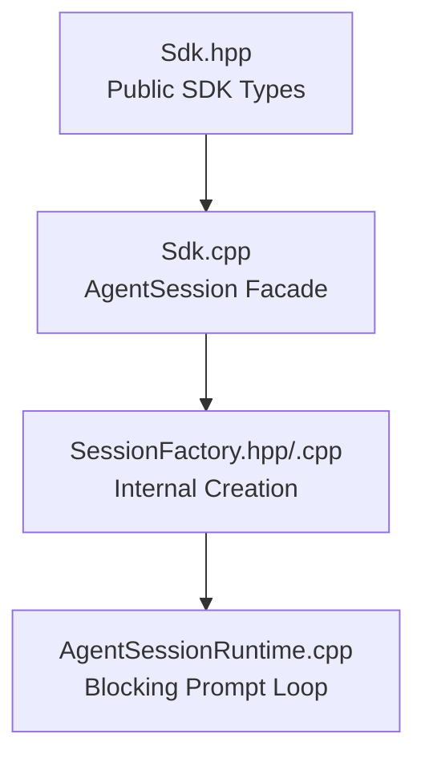
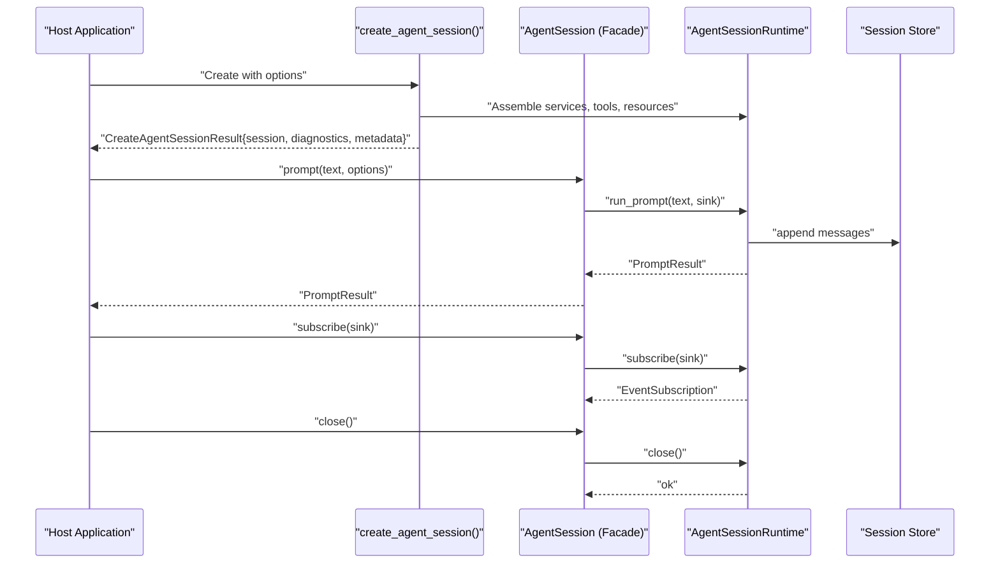
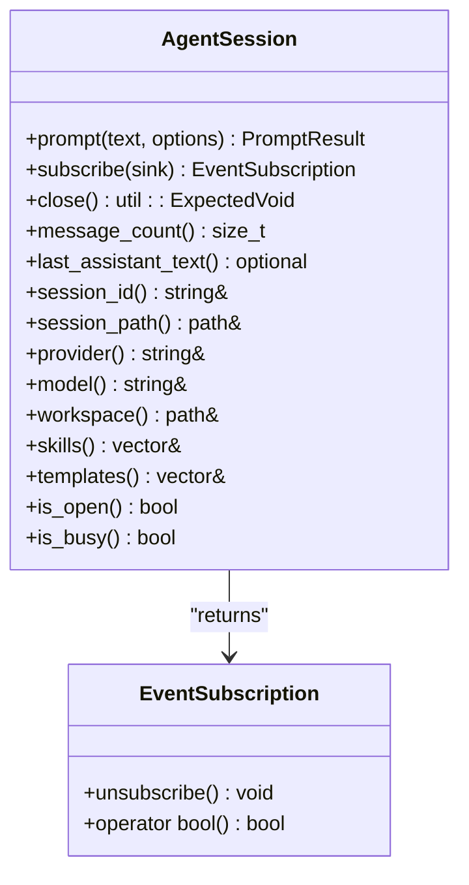
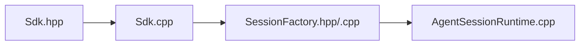
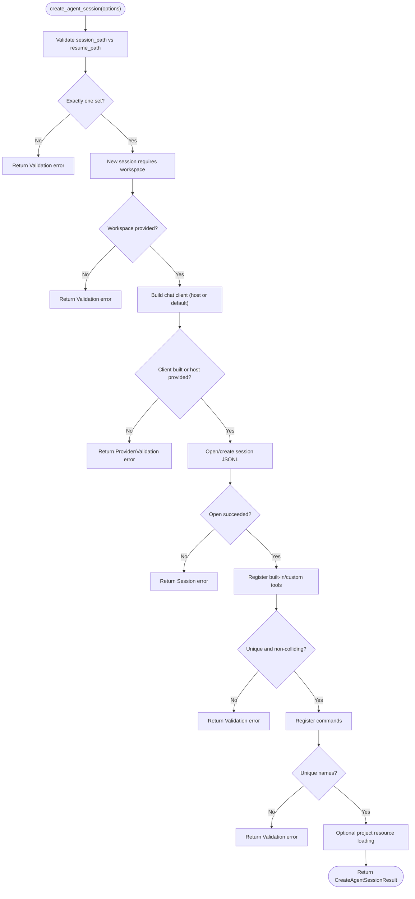

# SDK API

<cite>
**Referenced Files in This Document**
- [Sdk.hpp](file://include/cch/coding_agent/Sdk.hpp)
- [Sdk.cpp](file://src/coding_agent/Sdk.cpp)
- [SessionFactory.hpp](file://src/coding_agent/runtime/SessionFactory.hpp)
- [SessionFactory.cpp](file://src/coding_agent/runtime/SessionFactory.cpp)
- [AgentSessionRuntime.cpp](file://src/coding_agent/runtime/AgentSessionRuntime.cpp)
- [Error.hpp](file://include/cch/util/Error.hpp)
- [SdkSessionTest.cpp](file://tests/coding_agent/SdkSessionTest.cpp)
- [README.md](file://README.md)
</cite>

## Table of Contents
1. [Introduction](#introduction)
2. [Project Structure](#project-structure)
3. [Core Components](#core-components)
4. [Architecture Overview](#architecture-overview)
5. [Detailed Component Analysis](#detailed-component-analysis)
6. [Dependency Analysis](#dependency-analysis)
7. [Performance Considerations](#performance-considerations)
8. [Troubleshooting Guide](#troubleshooting-guide)
9. [Conclusion](#conclusion)
10. [Appendices](#appendices)

## Introduction
This document describes the embeddable C++ agent SDK surface. It covers the main entry point, session lifecycle, configuration, diagnostics, and usage patterns. The SDK is experimental and source-level only; it is not ABI-stable. The primary entry point is a factory function that constructs or resumes a session given a set of options. The session handle exposes prompt execution, event subscriptions, and read-only state accessors. The SDK emphasizes move-only semantics, RAII, and explicit validation.

## Project Structure
The SDK public API is defined in a single header and implemented in a small runtime façade that delegates to internal runtime services. Tests exercise the public API contracts and illustrate typical usage.

**Diagram sources**
- [Sdk.hpp:336-344](file://include/cch/coding_agent/Sdk.hpp#L336-L344)
- [Sdk.cpp:224-232](file://src/coding_agent/Sdk.cpp#L224-L232)
- [SessionFactory.hpp:55-63](file://src/coding_agent/runtime/SessionFactory.hpp#L55-L63)
- [SessionFactory.cpp:425-427](file://src/coding_agent/runtime/SessionFactory.cpp#L425-L427)
- [AgentSessionRuntime.cpp:164-198](file://src/coding_agent/runtime/AgentSessionRuntime.cpp#L164-L198)

**Section sources**
- [README.md:174-241](file://README.md#L174-L241)
- [Sdk.hpp:21-347](file://include/cch/coding_agent/Sdk.hpp#L21-L347)

## Core Components
- create_agent_session(): Factory that validates options, opens/creates a session, builds provider and execution environment, registers tools and resources, and returns a session handle with diagnostics and resolved metadata.
- AgentSession: Move-only handle representing a session with lifecycle methods (prompt, subscribe, close), state accessors, and thread-safety characteristics.
- CreateAgentSessionOptions: Configuration for session creation/resume, provider setup, workspace management, tool registration, and resource loading.
- CreateAgentSessionResult: Result of successful creation, including the session handle, diagnostics, and resolved metadata.
- SdkDiagnostic: Structured feedback for creation and prompt processing.
- SdkProviderConfig, SdkBuiltinTools, SdkCommand, PromptOptions, PromptResult, EventSubscription: Supporting types for provider setup, tool selection, command registration, prompt execution, and event subscription.

**Section sources**
- [Sdk.hpp:336-344](file://include/cch/coding_agent/Sdk.hpp#L336-L344)
- [Sdk.hpp:241-332](file://include/cch/coding_agent/Sdk.hpp#L241-L332)
- [Sdk.hpp:85-149](file://include/cch/coding_agent/Sdk.hpp#L85-L149)
- [Sdk.hpp:155-171](file://include/cch/coding_agent/Sdk.hpp#L155-L171)
- [Sdk.hpp:36-48](file://include/cch/coding_agent/Sdk.hpp#L36-L48)
- [Sdk.hpp:52-61](file://include/cch/coding_agent/Sdk.hpp#L52-L61)
- [Sdk.hpp:65-72](file://include/cch/coding_agent/Sdk.hpp#L65-L72)
- [Sdk.hpp:76-81](file://include/cch/coding_agent/Sdk.hpp#L76-L81)
- [Sdk.hpp:175-180](file://include/cch/coding_agent/Sdk.hpp#L175-L180)
- [Sdk.hpp:182-208](file://include/cch/coding_agent/Sdk.hpp#L182-L208)
- [Sdk.hpp:210-237](file://include/cch/coding_agent/Sdk.hpp#L210-L237)

## Architecture Overview
The SDK exposes a façade over an internal runtime. The façade enforces validation and state transitions, while the runtime performs blocking prompt execution and event fan-out.

**Diagram sources**
- [Sdk.hpp:336-344](file://include/cch/coding_agent/Sdk.hpp#L336-L344)
- [Sdk.cpp:78-103](file://src/coding_agent/Sdk.cpp#L78-L103)
- [AgentSessionRuntime.cpp:164-198](file://src/coding_agent/runtime/AgentSessionRuntime.cpp#L164-L198)

## Detailed Component Analysis

### create_agent_session()
- Purpose: Construct or resume a session based on CreateAgentSessionOptions.
- Validation rules:
  - Exactly one of session_path or resume_path must be set; both or neither is invalid.
  - For new sessions, workspace must be provided.
  - Provider setup: Either a host-provided StreamingChatClient or SdkProviderConfig must be supplied; otherwise creation fails.
  - Tool registration: Custom tool names must be unique and not collide with built-in tool names.
  - Command registration: Command names must be unique.
  - Project resource loading: When enabled, project skills/templates are discovered and merged with host-provided ones; host items take precedence.
- Behavior:
  - Builds a chat client (host-provided or default OpenAI-compatible via provider registry).
  - Opens/creates the session JSONL store.
  - Registers built-in and custom tools, and assembles skills/templates/commands.
  - Creates runtime services and returns a session handle with diagnostics and resolved metadata.
- Exceptions and errors:
  - Returns util::Expected<CreateAgentSessionResult>. On failure, returns an error with a code and message/description.
  - Uses util::ErrorCode values such as Validation, Provider, Session, Workspace, Tool, etc.

Key references:
- Factory declaration: [Sdk.hpp:336-344](file://include/cch/coding_agent/Sdk.hpp#L336-L344)
- Implementation wrapping runtime result: [Sdk.cpp:224-232](file://src/coding_agent/Sdk.cpp#L224-L232)
- Internal creation validation and assembly: [SessionFactory.cpp:425-800](file://src/coding_agent/runtime/SessionFactory.cpp#L425-L800)
- Error contract: [Error.hpp:10-23](file://include/cch/util/Error.hpp#L10-L23)

**Section sources**
- [Sdk.hpp:336-344](file://include/cch/coding_agent/Sdk.hpp#L336-L344)
- [Sdk.cpp:224-232](file://src/coding_agent/Sdk.cpp#L224-L232)
- [SessionFactory.cpp:425-800](file://src/coding_agent/runtime/SessionFactory.cpp#L425-L800)
- [Error.hpp:10-23](file://include/cch/util/Error.hpp#L10-L23)

### AgentSession
- Lifecycle: Open → (prompt)* → Closed. Prompt execution is blocking and serial; reentrancy returns an error. Close is idempotent.
- Thread-safety: The façade enforces single-threaded prompt execution and prevents reentrancy. Event subscriptions are weak connections; destroying the subscription handle stops event delivery.
- Methods and semantics:
  - prompt(text, options): Executes a blocking prompt; returns PromptResult or error.
  - subscribe(sink): Registers a move-only event sink; returns EventSubscription or error.
  - close(): Idempotent; clears subscribers and releases resources.
  - Accessors: message_count(), last_assistant_text(), session_id(), session_path(), provider(), model(), workspace(), skills(), templates().
  - Status: is_open(), is_busy().
- Move-only and RAII:
  - Move-only type; copy is deleted.
  - Destructor ensures close() is called.

Key references:
- Class declaration and lifecycle: [Sdk.hpp:241-332](file://include/cch/coding_agent/Sdk.hpp#L241-L332)
- Implementation of prompt/subscribe/close/accessors: [Sdk.cpp:78-188](file://src/coding_agent/Sdk.cpp#L78-L188)

**Diagram sources**
- [Sdk.hpp:241-332](file://include/cch/coding_agent/Sdk.hpp#L241-L332)
- [Sdk.hpp:210-237](file://include/cch/coding_agent/Sdk.hpp#L210-L237)

**Section sources**
- [Sdk.hpp:241-332](file://include/cch/coding_agent/Sdk.hpp#L241-L332)
- [Sdk.cpp:78-188](file://src/coding_agent/Sdk.cpp#L78-L188)

### CreateAgentSessionOptions
- Session target: session_path (create new) or resume_path (resume existing). Exactly one must be set.
- Workspace: required for new sessions; for resumes, if provided, must match stored workspace.
- Provider: either chat_client (host-provided) or provider_config (default client). If neither is provided, creation fails.
- Host-provided capabilities: execution_env (defaults to local environment if not provided).
- Built-in tool selection: read, write, edit_file, bash (default bash=false).
- Custom tools: vector of unique_ptr<AsyncAgentTool>; duplicates or collisions with built-ins fail creation.
- Host resources: skills, prompt_templates, commands; host items take precedence over project-discovered duplicates.
- Project resource loading: load_project_resources flag, default_project_trust, project_skills_enablement.
- Reserved: max_turns passed through to runtime.

Key references:
- Structure definition: [Sdk.hpp:85-149](file://include/cch/coding_agent/Sdk.hpp#L85-L149)

**Section sources**
- [Sdk.hpp:85-149](file://include/cch/coding_agent/Sdk.hpp#L85-L149)
- [SessionFactory.cpp:425-800](file://src/coding_agent/runtime/SessionFactory.cpp#L425-L800)

### CreateAgentSessionResult
- Fields:
  - session: unique_ptr<AgentSession> (move-only).
  - diagnostics: vector<SdkDiagnostic>.
  - session_id, provider, model, session_path, workspace, metadata.

Key references:
- Structure definition: [Sdk.hpp:155-171](file://include/cch/coding_agent/Sdk.hpp#L155-L171)

**Section sources**
- [Sdk.hpp:155-171](file://include/cch/coding_agent/Sdk.hpp#L155-L171)

### SdkDiagnostic
- Fields: severity (Info, Warning, Error), code, message, path.
- Used for creation feedback and prompt diagnostics.

Key references:
- Definition: [Sdk.hpp:36-48](file://include/cch/coding_agent/Sdk.hpp#L36-L48)

**Section sources**
- [Sdk.hpp:36-48](file://include/cch/coding_agent/Sdk.hpp#L36-L48)

### SdkProviderConfig
- Fields: provider, model, base_url, api_key_env (environment variable chain).
- Used to construct a default OpenAI-compatible client when no host client is provided.

Key references:
- Definition: [Sdk.hpp:52-61](file://include/cch/coding_agent/Sdk.hpp#L52-L61)

**Section sources**
- [Sdk.hpp:52-61](file://include/cch/coding_agent/Sdk.hpp#L52-L61)

### SdkBuiltinTools
- Fields: read, write, edit_file, bash (default bash=false).

Key references:
- Definition: [Sdk.hpp:65-72](file://include/cch/coding_agent/Sdk.hpp#L65-L72)

**Section sources**
- [Sdk.hpp:65-72](file://include/cch/coding_agent/Sdk.hpp#L65-L72)

### SdkCommand
- Fields: name, handler (CommandHandler).
- Used to register slash-commands.

Key references:
- Definition: [Sdk.hpp:76-81](file://include/cch/coding_agent/Sdk.hpp#L76-L81)

**Section sources**
- [Sdk.hpp:76-81](file://include/cch/coding_agent/Sdk.hpp#L76-L81)

### PromptOptions and PromptResult
- PromptOptions: event_sink (per-prompt sink).
- PromptResult: success, code, message, last_assistant_text, message_count, diagnostics.

Key references:
- Definitions: [Sdk.hpp:175-180](file://include/cch/coding_agent/Sdk.hpp#L175-L180), [Sdk.hpp:182-208](file://include/cch/coding_agent/Sdk.hpp#L182-L208)

**Section sources**
- [Sdk.hpp:175-180](file://include/cch/coding_agent/Sdk.hpp#L175-L180)
- [Sdk.hpp:182-208](file://include/cch/coding_agent/Sdk.hpp#L182-L208)

### EventSubscription
- Move-only RAII handle for event subscriptions.
- unsubscribe() stops event delivery; destructor calls unsubscribe().
- operator bool() indicates active subscription.

Key references:
- Definition: [Sdk.hpp:210-237](file://include/cch/coding_agent/Sdk.hpp#L210-L237)

**Section sources**
- [Sdk.hpp:210-237](file://include/cch/coding_agent/Sdk.hpp#L210-L237)
- [Sdk.cpp:33-62](file://src/coding_agent/Sdk.cpp#L33-L62)

## Dependency Analysis
The SDK façade depends on internal runtime services for prompt execution and session persistence. The façade enforces validation and state transitions; the runtime handles blocking loops and event fan-out.

**Diagram sources**
- [Sdk.hpp:336-344](file://include/cch/coding_agent/Sdk.hpp#L336-L344)
- [Sdk.cpp:224-232](file://src/coding_agent/Sdk.cpp#L224-L232)
- [SessionFactory.hpp:55-63](file://src/coding_agent/runtime/SessionFactory.hpp#L55-L63)
- [AgentSessionRuntime.cpp:164-198](file://src/coding_agent/runtime/AgentSessionRuntime.cpp#L164-L198)

**Section sources**
- [Sdk.hpp:336-344](file://include/cch/coding_agent/Sdk.hpp#L336-L344)
- [Sdk.cpp:224-232](file://src/coding_agent/Sdk.cpp#L224-L232)
- [SessionFactory.hpp:55-63](file://src/coding_agent/runtime/SessionFactory.hpp#L55-L63)
- [AgentSessionRuntime.cpp:164-198](file://src/coding_agent/runtime/AgentSessionRuntime.cpp#L164-L198)

## Performance Considerations
- Prompt execution is blocking and single-threaded per session; avoid long-running synchronous operations in event sinks.
- Event fan-out is per-subscription; keep sinks lightweight and fast.
- Memory management follows RAII; ensure session lifetime matches host needs and avoid holding onto unused handles.

[No sources needed since this section provides general guidance]

## Troubleshooting Guide
Common validation and runtime errors:
- Validation errors:
  - Both session_path and resume_path set, or neither set.
  - New session without workspace.
  - No chat_client or provider_config supplied.
  - Duplicate custom tool names or collisions with built-in tools.
  - Duplicate command names.
- Provider errors:
  - Provider client creation failures.
  - API key environment variable chain issues.
- Session errors:
  - Unsupported session topology for resume (non-linear sessions).
  - Resume without stored provider/model metadata and no provider_config/host client.
- Tool errors:
  - Tool registration failures.
- Workspace errors:
  - Workspace filesystem unavailable for project resource discovery.
- Diagnostics:
  - Creation feedback and prompt diagnostics are returned as SdkDiagnostic entries.

Key references:
- Validation and diagnostics in creation: [SessionFactory.cpp:425-800](file://src/coding_agent/runtime/SessionFactory.cpp#L425-L800)
- Error codes: [Error.hpp:10-23](file://include/cch/util/Error.hpp#L10-L23)
- Tests demonstrating validation and diagnostics: [SdkSessionTest.cpp:127-228](file://tests/coding_agent/SdkSessionTest.cpp#L127-L228), [SdkSessionTest.cpp:692-715](file://tests/coding_agent/SdkSessionTest.cpp#L692-L715)

**Section sources**
- [SessionFactory.cpp:425-800](file://src/coding_agent/runtime/SessionFactory.cpp#L425-L800)
- [Error.hpp:10-23](file://include/cch/util/Error.hpp#L10-L23)
- [SdkSessionTest.cpp:127-228](file://tests/coding_agent/SdkSessionTest.cpp#L127-L228)
- [SdkSessionTest.cpp:692-715](file://tests/coding_agent/SdkSessionTest.cpp#L692-L715)

## Conclusion
The SDK provides a focused, validated, and RAII-backed interface for embedding an agent loop in host applications. It supports explicit provider configuration, workspace management, tool registration, and resource loading, with diagnostics surfaced as values. The façade ensures single-threaded, serial prompt execution and move-only semantics for handles.

[No sources needed since this section summarizes without analyzing specific files]

## Appendices

### Practical Examples

- Initialization and session creation:
  - Configure CreateAgentSessionOptions with session_path, workspace, and provider_config or chat_client.
  - Call create_agent_session() and handle the util::Expected result.
  - Reference: [Sdk.hpp:336-344](file://include/cch/coding_agent/Sdk.hpp#L336-L344), [README.md:178-216](file://README.md#L178-L216)

- Prompt execution:
  - Obtain a session from the result and call prompt() with text and optional PromptOptions.
  - Check PromptResult.success and diagnostics.
  - Reference: [Sdk.hpp:267-269](file://include/cch/coding_agent/Sdk.hpp#L267-L269), [SdkSessionTest.cpp:274-309](file://tests/coding_agent/SdkSessionTest.cpp#L274-L309)

- Event subscription:
  - Subscribe to lifecycle events via subscribe() and unsubscribe() when done.
  - Reference: [Sdk.hpp:277-278](file://include/cch/coding_agent/Sdk.hpp#L277-L278), [SdkSessionTest.cpp:311-341](file://tests/coding_agent/SdkSessionTest.cpp#L311-L341)

- Proper cleanup:
  - Call close() on the session; it is idempotent.
  - Reference: [Sdk.hpp:310-310](file://include/cch/coding_agent/Sdk.hpp#L310-L310), [SdkSessionTest.cpp:297-303](file://tests/coding_agent/SdkSessionTest.cpp#L297-L303)

- Memory management and move-only semantics:
  - AgentSession and EventSubscription are move-only; copy is deleted.
  - RAII ensures cleanup on destruction.
  - Reference: [Sdk.hpp:256-261](file://include/cch/coding_agent/Sdk.hpp#L256-L261), [Sdk.hpp:215-222](file://include/cch/coding_agent/Sdk.hpp#L215-L222)

### Function Signatures and Semantics

- create_agent_session(CreateAgentSessionOptions):
  - Returns: util::Expected<CreateAgentSessionResult>
  - Validation: session_path/resume_path XOR, workspace for new sessions, provider setup, tool/command uniqueness, project resource policies.
  - Side effects: Opens/creates session JSONL, constructs provider, registers tools/resources, returns diagnostics and metadata.
  - References: [Sdk.hpp:336-344](file://include/cch/coding_agent/Sdk.hpp#L336-L344), [Sdk.cpp:224-232](file://src/coding_agent/Sdk.cpp#L224-L232), [SessionFactory.cpp:425-800](file://src/coding_agent/runtime/SessionFactory.cpp#L425-L800)

- AgentSession::prompt(text, options):
  - Returns: util::Expected<PromptResult>
  - Behavior: Blocking, serial; returns error if session closed or busy.
  - References: [Sdk.hpp:267-269](file://include/cch/coding_agent/Sdk.hpp#L267-L269), [Sdk.cpp:78-103](file://src/coding_agent/Sdk.cpp#L78-L103), [AgentSessionRuntime.cpp:164-198](file://src/coding_agent/runtime/AgentSessionRuntime.cpp#L164-L198)

- AgentSession::subscribe(sink):
  - Returns: util::Expected<EventSubscription>
  - Behavior: Registers sink; unsubscribe() or destruction stops delivery.
  - References: [Sdk.hpp:277-278](file://include/cch/coding_agent/Sdk.hpp#L277-L278), [Sdk.cpp:105-128](file://src/coding_agent/Sdk.cpp#L105-L128)

- AgentSession::close():
  - Returns: util::ExpectedVoid
  - Behavior: Idempotent; clears subscribers and releases resources.
  - References: [Sdk.hpp:310-310](file://include/cch/coding_agent/Sdk.hpp#L310-L310), [Sdk.cpp:163-170](file://src/coding_agent/Sdk.cpp#L163-L170), [AgentSessionRuntime.cpp:256-275](file://src/coding_agent/runtime/AgentSessionRuntime.cpp#L256-L275)

- State accessors:
  - message_count(), last_assistant_text(), session_id(), session_path(), provider(), model(), workspace(), skills(), templates(), is_open(), is_busy().
  - References: [Sdk.hpp:282-324](file://include/cch/coding_agent/Sdk.hpp#L282-L324), [Sdk.cpp:130-188](file://src/coding_agent/Sdk.cpp#L130-L188)

### Validation Flow for Session Creation

**Diagram sources**
- [SessionFactory.cpp:425-800](file://src/coding_agent/runtime/SessionFactory.cpp#L425-L800)