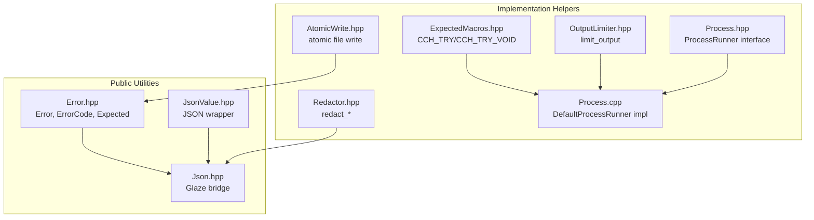
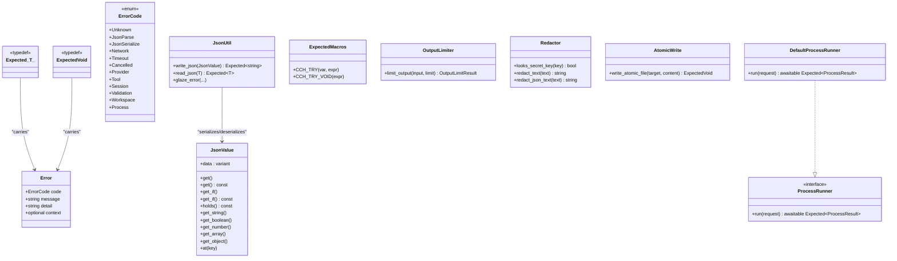
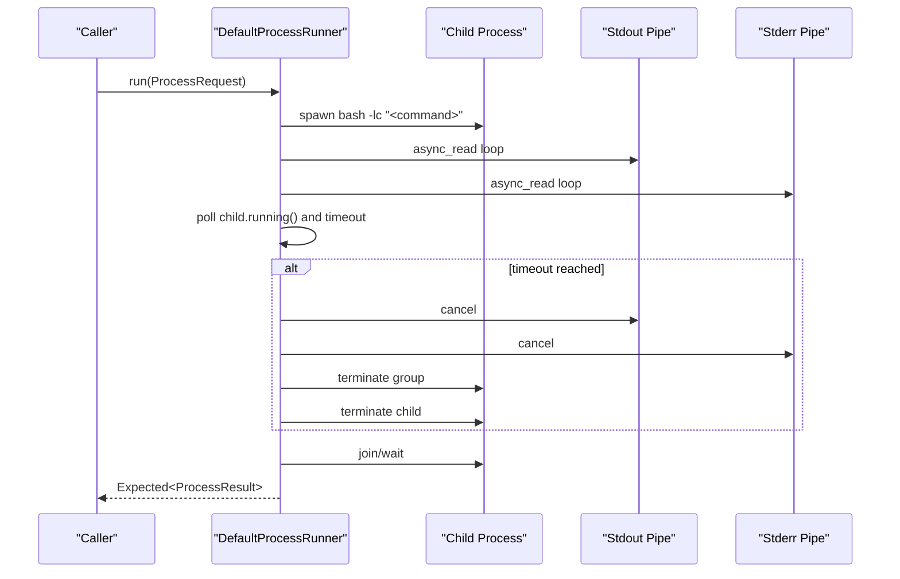
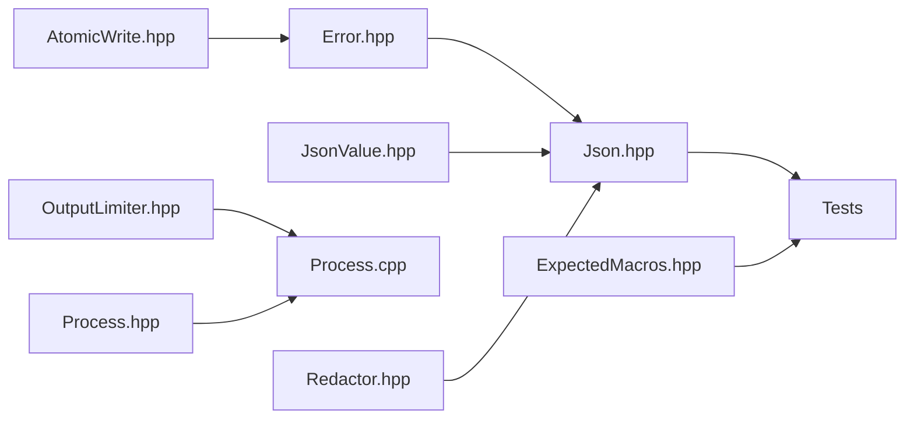

# Utility APIs

<cite>
**Referenced Files in This Document**
- [Error.hpp](file://include/cch/util/Error.hpp)
- [JsonValue.hpp](file://include/cch/util/JsonValue.hpp)
- [Json.hpp](file://src/util/Json.hpp)
- [ExpectedMacros.hpp](file://src/util/ExpectedMacros.hpp)
- [OutputLimiter.hpp](file://src/util/OutputLimiter.hpp)
- [Redactor.hpp](file://src/util/Redactor.hpp)
- [AtomicWrite.hpp](file://src/harness/AtomicWrite.hpp)
- [Process.hpp](file://src/util/Process.hpp)
- [Process.cpp](file://src/util/Process.cpp)
- [ExpectedErrorTest.cpp](file://tests/util/ExpectedErrorTest.cpp)
- [ExpectedMacrosTest.cpp](file://tests/util/ExpectedMacrosTest.cpp)
- [EntrySerializer.cpp](file://src/harness/session/EntrySerializer.cpp)
</cite>

## Table of Contents
1. [Introduction](#introduction)
2. [Project Structure](#project-structure)
3. [Core Components](#core-components)
4. [Architecture Overview](#architecture-overview)
5. [Detailed Component Analysis](#detailed-component-analysis)
6. [Dependency Analysis](#dependency-analysis)
7. [Performance Considerations](#performance-considerations)
8. [Troubleshooting Guide](#troubleshooting-guide)
9. [Conclusion](#conclusion)

## Introduction
This document describes the utility APIs and helper classes used throughout the system with a focus on robust error handling using std::expected, JSON manipulation via a type-safe wrapper, coroutine-friendly error propagation macros, output limiting, sensitive data redaction, atomic file writes, and process execution utilities. It also provides examples of usage patterns, performance tips, and thread-safety considerations.

## Project Structure
The utility layer spans public headers under include/cch/util and implementation helpers under src/util and src/harness. The primary building blocks are:
- Error and Expected types for typed error handling
- JsonValue wrapper for JSON manipulation and type-safe access
- ExpectedMacros for concise coroutine error propagation
- OutputLimiter for preventing oversized outputs
- Redactor for sanitizing sensitive data
- AtomicWrite for safe file operations
- Process utilities for command execution with streaming and limits

**Diagram sources**
- [Error.hpp:1-76](file://include/cch/util/Error.hpp#L1-L76)
- [JsonValue.hpp:1-105](file://include/cch/util/JsonValue.hpp#L1-L105)
- [Json.hpp:1-146](file://src/util/Json.hpp#L1-L146)
- [ExpectedMacros.hpp:1-28](file://src/util/ExpectedMacros.hpp#L1-L28)
- [OutputLimiter.hpp:1-51](file://src/util/OutputLimiter.hpp#L1-L51)
- [Redactor.hpp:1-43](file://src/util/Redactor.hpp#L1-L43)
- [AtomicWrite.hpp:1-137](file://src/harness/AtomicWrite.hpp#L1-L137)
- [Process.hpp:1-57](file://src/util/Process.hpp#L1-L57)
- [Process.cpp:1-264](file://src/util/Process.cpp#L1-L264)

**Section sources**
- [Error.hpp:1-76](file://include/cch/util/Error.hpp#L1-L76)
- [JsonValue.hpp:1-105](file://include/cch/util/JsonValue.hpp#L1-L105)
- [Json.hpp:1-146](file://src/util/Json.hpp#L1-L146)
- [ExpectedMacros.hpp:1-28](file://src/util/ExpectedMacros.hpp#L1-L28)
- [OutputLimiter.hpp:1-51](file://src/util/OutputLimiter.hpp#L1-L51)
- [Redactor.hpp:1-43](file://src/util/Redactor.hpp#L1-L43)
- [AtomicWrite.hpp:1-137](file://src/harness/AtomicWrite.hpp#L1-L137)
- [Process.hpp:1-57](file://src/util/Process.hpp#L1-L57)
- [Process.cpp:1-264](file://src/util/Process.cpp#L1-L264)

## Core Components
- Error and Expected types define a unified error model with typed error codes and a convenient alias for std::expected carrying Error.
- JsonValue provides a type-safe JSON container with getters, const getters, and accessors for arrays and objects.
- Json.hpp bridges JsonValue and Glaze for serialization/deserialization with rich error reporting.
- ExpectedMacros offers CCH_TRY and CCH_TRY_VOID to simplify coroutine error propagation.
- OutputLimiter enforces byte and line limits on text to prevent oversized outputs.
- Redactor detects and redacts secrets and sensitive assignments in text and JSON.
- AtomicWrite ensures atomic file replacement with platform-specific optimizations.
- Process utilities encapsulate asynchronous process execution with streaming stdout/stderr, timeouts, and per-stream truncation.

**Section sources**
- [Error.hpp:10-76](file://include/cch/util/Error.hpp#L10-L76)
- [JsonValue.hpp:12-102](file://include/cch/util/JsonValue.hpp#L12-L102)
- [Json.hpp:15-145](file://src/util/Json.hpp#L15-L145)
- [ExpectedMacros.hpp:10-27](file://src/util/ExpectedMacros.hpp#L10-L27)
- [OutputLimiter.hpp:9-48](file://src/util/OutputLimiter.hpp#L9-L48)
- [Redactor.hpp:10-40](file://src/util/Redactor.hpp#L10-L40)
- [AtomicWrite.hpp:21-134](file://src/harness/AtomicWrite.hpp#L21-L134)
- [Process.hpp:16-56](file://src/util/Process.hpp#L16-L56)

## Architecture Overview
The utilities form a cohesive error-and-data-handling layer:
- Error and Expected unify failure reporting across modules.
- JsonValue and Json.hpp provide a compact, type-safe JSON representation with Glaze-backed serialization.
- ExpectedMacros reduces boilerplate in coroutine code.
- OutputLimiter and Redactor protect logs and outputs from excessive or sensitive content.
- AtomicWrite and Process utilities provide safe, observable operations for file writes and external commands.

**Diagram sources**
- [Error.hpp:10-76](file://include/cch/util/Error.hpp#L10-L76)
- [JsonValue.hpp:12-102](file://include/cch/util/JsonValue.hpp#L12-L102)
- [Json.hpp:15-145](file://src/util/Json.hpp#L15-L145)
- [ExpectedMacros.hpp:10-27](file://src/util/ExpectedMacros.hpp#L10-L27)
- [OutputLimiter.hpp:19-48](file://src/util/OutputLimiter.hpp#L19-L48)
- [Redactor.hpp:10-40](file://src/util/Redactor.hpp#L10-L40)
- [AtomicWrite.hpp:29-134](file://src/harness/AtomicWrite.hpp#L29-L134)
- [Process.hpp:45-56](file://src/util/Process.hpp#L45-L56)
- [Process.cpp:132-261](file://src/util/Process.cpp#L132-L261)

## Detailed Component Analysis

### Error and Expected Types
- Purpose: Provide a single, typed error model and a convenient std::expected alias for uniform error handling across the system.
- Key elements:
  - ErrorCode enumeration covering domains like JSON parsing/serialization, network, timeout, cancellation, provider/tool/session/validation/workspace/process.
  - Error struct with fields for code, message, detail, and optional context.
  - Expected<T> and ExpectedVoid aliases for std::expected carrying Error.
  - Helper to_string for ErrorCode and make_error for constructing errors.

Usage patterns:
- Construct errors with make_error and propagate via std::unexpected.
- Inspect error.code and error.detail to inform diagnostics and recovery.

Thread-safety:
- Error is a value type; copying is cheap and safe.
- Expected<T> is not inherently thread-safe for concurrent mutation; however, passing around Expected instances is safe.

Best practices:
- Always populate detail and context for actionable diagnostics.
- Prefer to_string for logging and UI presentation.

**Section sources**
- [Error.hpp:10-76](file://include/cch/util/Error.hpp#L10-L76)
- [ExpectedErrorTest.cpp:18-56](file://tests/util/ExpectedErrorTest.cpp#L18-L56)

### JsonValue Wrapper
- Purpose: Provide a compact, type-safe JSON container with getters and accessors for strings, booleans, numbers, arrays, and objects.
- Key elements:
  - value_t variant holding null, double, string, bool, array_t, object_t.
  - Constructors for each variant type.
  - get<T>(), get_if<T>(), holds<T>() for safe access.
  - Convenience getters for primitive types and at() for object indexing.

Usage patterns:
- Convert between JsonValue and Glaze types via Json.hpp.
- Use get_if<T>() to probe types safely; use get<T>() for checked access.
- Access nested structures via at() chaining.

Thread-safety:
- JsonValue is a value type; copying is cheap and safe.
- Mutations are not synchronized; avoid concurrent modifications.

Performance:
- Prefer get_if<T>() to avoid exceptions on mismatch.
- Reserve capacity when building arrays/objects to reduce reallocations.

**Section sources**
- [JsonValue.hpp:12-102](file://include/cch/util/JsonValue.hpp#L12-L102)
- [Json.hpp:27-145](file://src/util/Json.hpp#L27-L145)

### Json Serialization/Deserialization Bridge
- Purpose: Bridge JsonValue and Glaze for efficient serialization/deserialization with rich error reporting.
- Key elements:
  - json_from_glaze/json_to_glaze conversions for generic values.
  - write_json(JsonValue) and read_json<T>() with error bridging via glaze_error.

Usage patterns:
- Serialize JsonValue to string with write_json.
- Parse arbitrary JSON into JsonValue or strongly-typed structs with read_json.
- Error messages include formatted Glaze errors and raw JSON context.

Thread-safety:
- Glaze operations are stateless; the bridge is safe to call concurrently.

Performance:
- Minimize copies by moving strings and vectors where possible.
- Use read_json<T>() for strongly-typed parsing to avoid intermediate conversions.

**Section sources**
- [Json.hpp:15-145](file://src/util/Json.hpp#L15-L145)

### ExpectedMacros Utility Macros
- Purpose: Provide concise coroutine error propagation macros to flatten guard checks in async code.
- Key elements:
  - CCH_TRY(var, expr): unwraps Expected<T> or returns std::unexpected on failure.
  - CCH_TRY_VOID(expr): unwraps ExpectedVoid or returns std::unexpected on failure.
  - Uses token-pasting with line counters to avoid variable collisions.

Usage patterns:
- Replace repetitive if (!x) return std::unexpected(x.error()) with CCH_TRY/CCH_TRY_VOID.
- Use in coroutine bodies where co_await is involved.

Thread-safety:
- Macros expand to coroutine-local code; no shared state is introduced.

Performance:
- Minimal overhead compared to manual checks; avoids exception throwing.

**Section sources**
- [ExpectedMacros.hpp:10-27](file://src/util/ExpectedMacros.hpp#L10-L27)
- [ExpectedMacrosTest.cpp:30-60](file://tests/util/ExpectedMacrosTest.cpp#L30-L60)

### OutputLimiter
- Purpose: Limit output by bytes and lines, truncating when limits are exceeded and appending a truncation marker.
- Key elements:
  - OutputLimit with max_bytes and max_lines defaults suitable for logs and UI.
  - limit_output(input, limit) returns OutputLimitResult with text and truncated flag.

Usage patterns:
- Apply to stdout/stderr streams before logging or returning results.
- Combine with Process utilities’ per-stream limits.

Thread-safety:
- Pure function with no shared mutable state; safe to call concurrently.

Performance:
- Single-pass streaming with early termination on limits.

**Section sources**
- [OutputLimiter.hpp:9-48](file://src/util/OutputLimiter.hpp#L9-L48)

### Redactor
- Purpose: Sanitize sensitive data in logs and outputs by detecting and redacting tokens and assignments.
- Key elements:
  - looks_secret_key(key): heuristic detection of secret-related keys.
  - redact_text(text): redacts API keys, tokens, secrets, passwords, and quoted/inline assignments.
  - redact_json_text(text): convenience wrapper for JSON text.

Usage patterns:
- Redact before logging or persisting content.
- Use redact_json_value to recursively redact JSON values.

Thread-safety:
- Pure function; safe to call concurrently.

Performance:
- Regex-based; keep patterns minimal and reuse compiled expressions if extending.

**Section sources**
- [Redactor.hpp:10-40](file://src/util/Redactor.hpp#L10-L40)
- [EntrySerializer.cpp:272-296](file://src/harness/session/EntrySerializer.cpp#L272-L296)

### AtomicWrite Pattern
- Purpose: Atomically write files by creating a temporary file and renaming it into place, preserving permissions and avoiding partial reads.
- Key elements:
  - write_atomic_file(target, content) returns ExpectedVoid.
  - Platform-specific optimizations on Unix (openat/fsync/renameat) and fallback for Windows.
  - Temporary path generation and collision avoidance.

Usage patterns:
- Use for configuration updates, cache writes, and log roll-overs.
- Combine with error handling via ExpectedVoid.

Thread-safety:
- Atomic rename prevents torn writes; avoid concurrent writers to the same target.

Performance:
- Unix path uses low-level syscalls for speed and durability.
- Windows path uses filesystem::rename with error propagation.

**Section sources**
- [AtomicWrite.hpp:21-134](file://src/harness/AtomicWrite.hpp#L21-L134)

### Process Utilities
- Purpose: Execute shell commands asynchronously with streaming output, timeouts, and per-stream truncation.
- Key elements:
  - ProcessRequest: command, working_directory, timeout, environment, explicit environment flag, max_output_bytes/lines, stdout/stderr callbacks.
  - ProcessResult: exit_code, combined output, separate stdout/stderr, truncation flags, and timeout indicator.
  - ProcessRunner interface and DefaultProcessRunner implementation using Boost.Process and Boost.Asio.

Usage patterns:
- Configure ProcessRequest with desired limits and callbacks.
- Use DefaultProcessRunner::run to execute commands and handle results.
- Respect truncation flags to detect oversized outputs.

Thread-safety:
- DefaultProcessRunner is a stateless service; safe to call concurrently from different coroutines.
- Callbacks must be exception-safe; thrown exceptions propagate as process execution errors.

Performance:
- Streaming pipes with buffered reads minimize memory usage.
- Timers and polling intervals balance responsiveness and CPU usage.

**Diagram sources**
- [Process.hpp:45-56](file://src/util/Process.hpp#L45-L56)
- [Process.cpp:132-261](file://src/util/Process.cpp#L132-L261)

**Section sources**
- [Process.hpp:16-56](file://src/util/Process.hpp#L16-L56)
- [Process.cpp:27-94](file://src/util/Process.cpp#L27-L94)
- [Process.cpp:132-261](file://src/util/Process.cpp#L132-L261)

## Dependency Analysis
- Error.hpp is foundational; used by Json.hpp, AtomicWrite.hpp, Process.cpp, and tests.
- Json.hpp depends on JsonValue.hpp and Glaze; it is used by higher-level components and tests.
- ExpectedMacros.hpp is used by coroutine-heavy code paths and tests.
- OutputLimiter.hpp is used by Process.cpp and other output-producing components.
- Redactor.hpp is used by serialization/log components.
- AtomicWrite.hpp depends on Error.hpp and filesystem operations.
- Process.hpp defines the interface; Process.cpp implements it and depends on Boost.Asio/Boost.Process.

**Diagram sources**
- [Error.hpp:1-76](file://include/cch/util/Error.hpp#L1-L76)
- [JsonValue.hpp:1-105](file://include/cch/util/JsonValue.hpp#L1-L105)
- [Json.hpp:1-146](file://src/util/Json.hpp#L1-L146)
- [ExpectedMacros.hpp:1-28](file://src/util/ExpectedMacros.hpp#L1-L28)
- [OutputLimiter.hpp:1-51](file://src/util/OutputLimiter.hpp#L1-L51)
- [Redactor.hpp:1-43](file://src/util/Redactor.hpp#L1-L43)
- [AtomicWrite.hpp:1-137](file://src/harness/AtomicWrite.hpp#L1-L137)
- [Process.hpp:1-57](file://src/util/Process.hpp#L1-L57)
- [Process.cpp:1-264](file://src/util/Process.cpp#L1-L264)

**Section sources**
- [Error.hpp:1-76](file://include/cch/util/Error.hpp#L1-L76)
- [Json.hpp:1-146](file://src/util/Json.hpp#L1-L146)
- [Process.cpp:1-264](file://src/util/Process.cpp#L1-L264)

## Performance Considerations
- Prefer std::expected monadic operations for synchronous chains and CCH_TRY/CCH_TRY_VOID for coroutine guards to reduce branching overhead.
- Use get_if<T>() and holds<T>() to avoid exceptions on type mismatches in hot paths.
- Minimize allocations by reserving capacity for arrays/objects and moving strings.
- Streaming I/O in Process utilities reduces memory footprint; tune buffers and limits appropriately.
- OutputLimiter and Redactor operate in linear time with input size; keep regex patterns minimal.
- AtomicWrite uses fsync and close on Unix for durability; batching writes can amortize costs.

## Troubleshooting Guide
Common issues and resolutions:
- JSON parse/serialize failures: Inspect error.code and error.detail; use read_json<T>() to pinpoint type mismatches.
  - Example reference: [ExpectedErrorTest.cpp:48-56](file://tests/util/ExpectedErrorTest.cpp#L48-L56)
- Process execution errors: Check ProcessResult.timed_out, exit_code, and truncation flags; verify environment and working directory.
  - Example reference: [Process.cpp:242-244](file://src/util/Process.cpp#L242-L244)
- Oversized outputs: Apply OutputLimiter before logging; monitor truncated flags.
  - Example reference: [OutputLimiter.hpp:19-48](file://src/util/OutputLimiter.hpp#L19-L48)
- Sensitive data exposure: Run redact_text/redact_json_text on logs and persisted content.
  - Example reference: [Redactor.hpp:23-40](file://src/util/Redactor.hpp#L23-L40)
- Atomic write failures: Verify permissions and parent directory accessibility; inspect returned error details.
  - Example reference: [AtomicWrite.hpp:25-57](file://src/harness/AtomicWrite.hpp#L25-L57)

**Section sources**
- [ExpectedErrorTest.cpp:18-56](file://tests/util/ExpectedErrorTest.cpp#L18-L56)
- [Process.cpp:242-244](file://src/util/Process.cpp#L242-L244)
- [OutputLimiter.hpp:19-48](file://src/util/OutputLimiter.hpp#L19-L48)
- [Redactor.hpp:23-40](file://src/util/Redactor.hpp#L23-L40)
- [AtomicWrite.hpp:25-57](file://src/harness/AtomicWrite.hpp#L25-L57)

## Conclusion
These utilities establish a consistent, type-safe, and efficient foundation for error handling, JSON manipulation, coroutine error propagation, output control, data sanitization, atomic file operations, and process execution. By following the recommended patterns—using std::expected, JsonValue, ExpectedMacros, OutputLimiter, Redactor, AtomicWrite, and Process utilities—you can write robust, maintainable, and performant code that scales across the system.