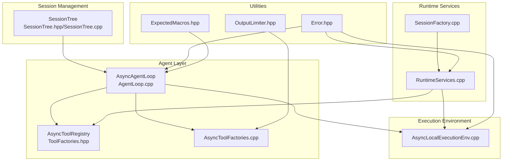
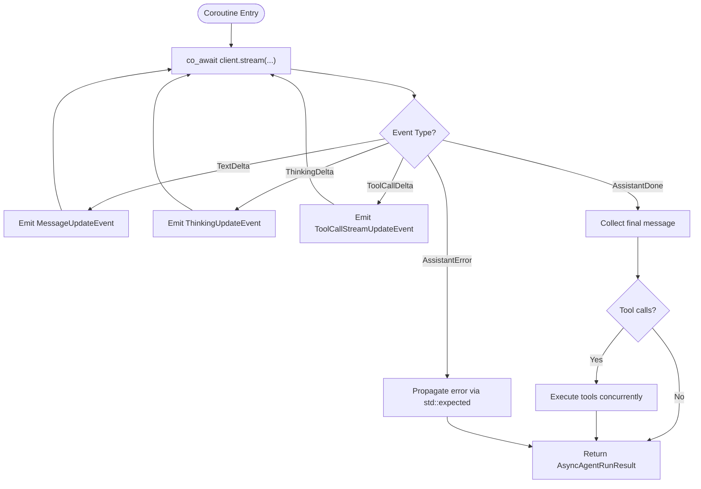
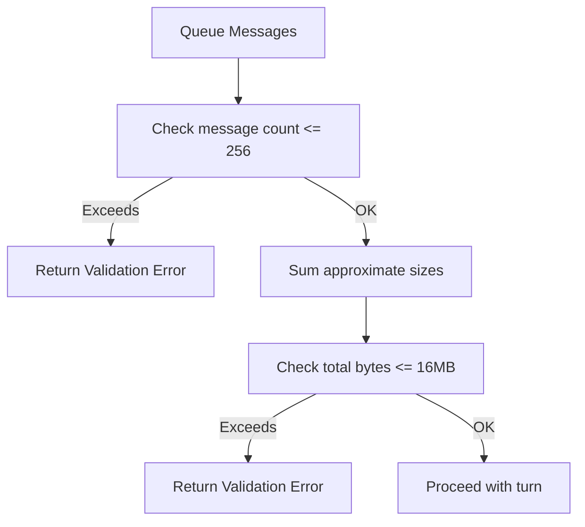
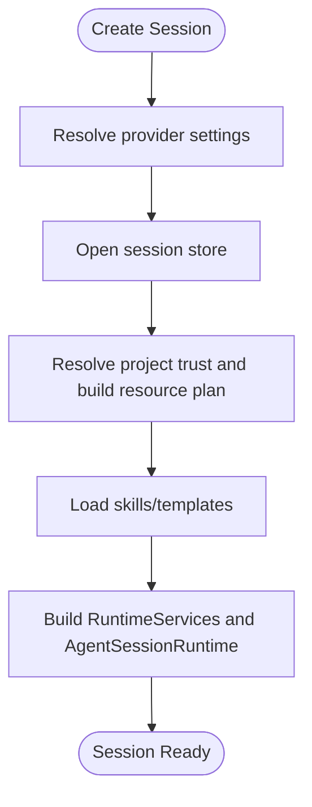
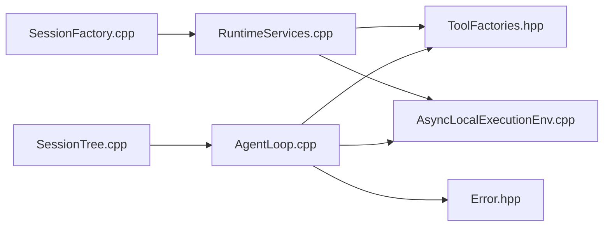

# Advanced Topics

<cite>
**Referenced Files in This Document**
- [Error.hpp](file://include/cch/util/Error.hpp)
- [ExpectedMacros.hpp](file://src/util/ExpectedMacros.hpp)
- [AgentLoop.hpp](file://include/cch/agent/AgentLoop.hpp)
- [AgentLoop.cpp](file://src/agent/AgentLoop.cpp)
- [RuntimeServices.cpp](file://src/coding_agent/runtime/RuntimeServices.cpp)
- [AsyncLocalExecutionEnv.cpp](file://src/harness/AsyncLocalExecutionEnv.cpp)
- [OutputLimiter.hpp](file://src/util/OutputLimiter.hpp)
- [ToolFactories.hpp](file://include/cch/tools/ToolFactories.hpp)
- [AsyncToolFactories.cpp](file://src/tools/AsyncToolFactories.cpp)
- [SessionFactory.cpp](file://src/coding_agent/runtime/SessionFactory.cpp)
- [SessionTree.hpp](file://include/cch/harness/session/SessionTree.hpp)
- [SessionTree.cpp](file://src/harness/session/SessionTree.cpp)
</cite>

## Table of Contents
1. [Introduction](#introduction)
2. [Project Structure](#project-structure)
3. [Core Components](#core-components)
4. [Architecture Overview](#architecture-overview)
5. [Detailed Component Analysis](#detailed-component-analysis)
6. [Dependency Analysis](#dependency-analysis)
7. [Performance Considerations](#performance-considerations)
8. [Troubleshooting Guide](#troubleshooting-guide)
9. [Conclusion](#conclusion)
10. [Appendices](#appendices)

## Introduction
This document covers advanced topics in the codebase, focusing on performance optimization, memory management, concurrency patterns, error recovery, advanced configuration, internal utilities, security considerations, and debugging techniques. It also highlights experimental aspects and advanced usage patterns for power users.

## Project Structure
The advanced features span several subsystems:
- Agent loop with streaming AI responses and tool orchestration
- Asynchronous execution environment for file and shell operations
- Runtime services for provider/client/tool composition
- Session tree for structured session navigation and context reconstruction
- Utilities for error modeling, coroutine-safe error propagation, and output limiting



**Diagram sources**
- [AgentLoop.cpp:1-563](file://src/agent/AgentLoop.cpp#L1-L563)
- [ToolFactories.hpp:1-16](file://include/cch/tools/ToolFactories.hpp#L1-L16)
- [AsyncToolFactories.cpp:1-421](file://src/tools/AsyncToolFactories.cpp#L1-L421)
- [RuntimeServices.cpp:1-127](file://src/coding_agent/runtime/RuntimeServices.cpp#L1-L127)
- [SessionFactory.cpp:1-809](file://src/coding_agent/runtime/SessionFactory.cpp#L1-L809)
- [AsyncLocalExecutionEnv.cpp:1-180](file://src/harness/AsyncLocalExecutionEnv.cpp#L1-L180)
- [SessionTree.hpp:1-148](file://include/cch/harness/session/SessionTree.hpp#L1-L148)
- [SessionTree.cpp:1-375](file://src/harness/session/SessionTree.cpp#L1-L375)
- [Error.hpp:1-76](file://include/cch/util/Error.hpp#L1-L76)
- [ExpectedMacros.hpp:1-28](file://src/util/ExpectedMacros.hpp#L1-L28)
- [OutputLimiter.hpp:1-51](file://src/util/OutputLimiter.hpp#L1-L51)

**Section sources**
- [AgentLoop.hpp:1-39](file://include/cch/agent/AgentLoop.hpp#L1-L39)
- [AgentLoop.cpp:1-563](file://src/agent/AgentLoop.cpp#L1-L563)
- [RuntimeServices.cpp:1-127](file://src/coding_agent/runtime/RuntimeServices.cpp#L1-L127)
- [AsyncLocalExecutionEnv.cpp:1-180](file://src/harness/AsyncLocalExecutionEnv.cpp#L1-L180)
- [SessionFactory.cpp:1-809](file://src/coding_agent/runtime/SessionFactory.cpp#L1-L809)
- [SessionTree.hpp:1-148](file://include/cch/harness/session/SessionTree.hpp#L1-L148)
- [SessionTree.cpp:1-375](file://src/harness/session/SessionTree.cpp#L1-L375)
- [Error.hpp:1-76](file://include/cch/util/Error.hpp#L1-L76)
- [ExpectedMacros.hpp:1-28](file://src/util/ExpectedMacros.hpp#L1-L28)
- [OutputLimiter.hpp:1-51](file://src/util/OutputLimiter.hpp#L1-L51)

## Core Components
- Error modeling and propagation: centralized error codes and expected types enable robust error handling across async boundaries.
- Coroutine error propagation macros: safe co_return patterns for std::expected-based coroutines.
- Agent loop: streaming chat orchestration with hooks, tool execution, and turn lifecycle.
- Async execution environment: unified async interface for file and shell operations.
- Runtime services: provider client creation, tool registration, and resource loading.
- Session tree: in-memory indexing and context reconstruction for structured sessions.

**Section sources**
- [Error.hpp:1-76](file://include/cch/util/Error.hpp#L1-L76)
- [ExpectedMacros.hpp:1-28](file://src/util/ExpectedMacros.hpp#L1-L28)
- [AgentLoop.hpp:1-39](file://include/cch/agent/AgentLoop.hpp#L1-L39)
- [AgentLoop.cpp:1-563](file://src/agent/AgentLoop.cpp#L1-L563)
- [AsyncLocalExecutionEnv.cpp:1-180](file://src/harness/AsyncLocalExecutionEnv.cpp#L1-L180)
- [RuntimeServices.cpp:1-127](file://src/coding_agent/runtime/RuntimeServices.cpp#L1-L127)
- [SessionTree.hpp:1-148](file://include/cch/harness/session/SessionTree.hpp#L1-L148)
- [SessionTree.cpp:1-375](file://src/harness/session/SessionTree.cpp#L1-L375)

## Architecture Overview
The system composes asynchronous components around a streaming agent loop. Tools are executed via an async execution environment, with runtime services wiring providers, tools, and resources. Sessions are navigable and reconstructable for LLM context.

```mermaid
sequenceDiagram
participant Client as "Caller"
participant Loop as "AsyncAgentLoop"
participant Provider as "StreamingChatClient"
participant Exec as "AsyncExecutionEnv"
participant Tools as "AsyncToolRegistry/Tools"
Client->>Loop : run(user_prompt, sink)
Loop->>Provider : stream(request, event_handler)
Provider-->>Loop : AssistantStreamEvent*
Loop->>Loop : emit(MessageUpdate/Thinking/ToolCall events)
alt Tool calls present
Loop->>Tools : execute(turn, calls, context, state, sink)
Tools->>Exec : read/write/edit/shell
Exec-->>Tools : results
Tools-->>Loop : tool results
Loop->>Provider : continue stream with tool results
end
Provider-->>Loop : AssistantDone/AssistantError
Loop-->>Client : AsyncAgentRunResult
```

**Diagram sources**
- [AgentLoop.cpp:243-531](file://src/agent/AgentLoop.cpp#L243-L531)
- [AsyncLocalExecutionEnv.cpp:30-177](file://src/harness/AsyncLocalExecutionEnv.cpp#L30-L177)
- [AsyncToolFactories.cpp:94-421](file://src/tools/AsyncToolFactories.cpp#L94-L421)

## Detailed Component Analysis

### Concurrency Patterns and Coroutines
- Coroutines and awaitables: agent loop and tools use boost::asio::awaitable for cooperative concurrency.
- Error propagation macros: CCH_TRY/CCH_TRY_VOID simplify propagating std::expected errors in coroutines.
- Channel-like concurrency: concurrent channel usage in agent loop enables event-driven orchestration.



**Diagram sources**
- [AgentLoop.cpp:329-384](file://src/agent/AgentLoop.cpp#L329-L384)
- [ExpectedMacros.hpp:10-27](file://src/util/ExpectedMacros.hpp#L10-L27)

**Section sources**
- [AgentLoop.hpp:16-36](file://include/cch/agent/AgentLoop.hpp#L16-L36)
- [AgentLoop.cpp:12-17](file://src/agent/AgentLoop.cpp#L12-L17)
- [ExpectedMacros.hpp:1-28](file://src/util/ExpectedMacros.hpp#L1-L28)

### Memory Management Strategies
- Size-aware message queuing: validate queued messages by count and total byte size to prevent unbounded growth.
- Approximate sizing helpers: compute sizes for text, images, and thinking blocks to estimate memory footprint.
- Output limiting: truncate long outputs with configurable limits and optional persistence of full logs.



**Diagram sources**
- [AgentLoop.cpp:82-105](file://src/agent/AgentLoop.cpp#L82-L105)
- [AgentLoop.cpp:36-80](file://src/agent/AgentLoop.cpp#L36-L80)
- [OutputLimiter.hpp:19-48](file://src/util/OutputLimiter.hpp#L19-L48)

**Section sources**
- [AgentLoop.cpp:82-105](file://src/agent/AgentLoop.cpp#L82-L105)
- [AgentLoop.cpp:36-80](file://src/agent/AgentLoop.cpp#L36-L80)
- [OutputLimiter.hpp:1-51](file://src/util/OutputLimiter.hpp#L1-L51)

### Error Recovery and Failure Modes
- Centralized error codes and details: structured errors unify diagnostics across components.
- Hook failures: transform/convert/prepare hooks are wrapped with expected-returning wrappers and surfaced as tool errors.
- Event sink failures: agent event emission traps exceptions and reports them as tool errors.
- Execution environment errors: shell/exec commands map to specific execution error codes (timeout, spawn, callback).

```mermaid
sequenceDiagram
participant Loop as "AsyncAgentLoop"
participant Sink as "AgentEventSink"
participant Hook as "Transform/Convert Hook"
participant Prov as "StreamingChatClient"
Loop->>Sink : emit(...)
Sink-->>Loop : throws/std : : exception
Loop-->>Loop : wrap as Tool error
Loop->>Hook : invoke(...)
Hook-->>Loop : throws/std : : exception
Loop-->>Loop : wrap as Tool error
Loop->>Prov : stream(...)
Prov-->>Loop : AssistantErrorEvent
Loop-->>Loop : propagate Provider error
```

**Diagram sources**
- [AgentLoop.cpp:533-550](file://src/agent/AgentLoop.cpp#L533-L550)
- [AgentLoop.cpp:156-236](file://src/agent/AgentLoop.cpp#L156-L236)
- [AgentLoop.cpp:379-383](file://src/agent/AgentLoop.cpp#L379-L383)

**Section sources**
- [Error.hpp:10-75](file://include/cch/util/Error.hpp#L10-L75)
- [AgentLoop.cpp:156-236](file://src/agent/AgentLoop.cpp#L156-L236)
- [AgentLoop.cpp:533-550](file://src/agent/AgentLoop.cpp#L533-L550)

### Advanced Configuration Options and Customization
- Provider resolution and client construction: dynamic provider selection with environment-based API key resolution.
- Tool registries and custom tools: unique tool names, collisions avoided, and custom tool injection.
- Project resources and trust: project skills/templates loading with trust and resource policies.
- Session creation: session creation vs. resume, provider overrides, and workspace policies.



**Diagram sources**
- [SessionFactory.cpp:274-423](file://src/coding_agent/runtime/SessionFactory.cpp#L274-L423)
- [RuntimeServices.cpp:15-124](file://src/coding_agent/runtime/RuntimeServices.cpp#L15-L124)

**Section sources**
- [SessionFactory.cpp:425-809](file://src/coding_agent/runtime/SessionFactory.cpp#L425-L809)
- [RuntimeServices.cpp:15-124](file://src/coding_agent/runtime/RuntimeServices.cpp#L15-L124)

### Internal Utilities and Helper Functions
- Error utilities: error code enumeration, error construction, and stringification.
- Expected macros: private macros for concise coroutine error propagation.
- Output limiter: configurable truncation with line and byte caps and optional persistence of full output.

**Section sources**
- [Error.hpp:8-76](file://include/cch/util/Error.hpp#L8-L76)
- [ExpectedMacros.hpp:3-28](file://src/util/ExpectedMacros.hpp#L3-L28)
- [OutputLimiter.hpp:9-51](file://src/util/OutputLimiter.hpp#L9-L51)

### Security Considerations and Mitigations
- Execution environment isolation: workspace-scoped operations and optional shell enablement.
- Shell safety: ANSI stripping, output truncation, and optional persistence of full output for auditability.
- Secret redaction: environment variable names for secrets are captured during environment construction.
- Trust and resource controls: project trust store and resource loading policies govern external resource access.

**Section sources**
- [AsyncLocalExecutionEnv.cpp:10-18](file://src/harness/AsyncLocalExecutionEnv.cpp#L10-L18)
- [AsyncToolFactories.cpp:328-400](file://src/tools/AsyncToolFactories.cpp#L328-L400)
- [SessionFactory.cpp:582-592](file://src/coding_agent/runtime/SessionFactory.cpp#L582-L592)
- [RuntimeServices.cpp:35-41](file://src/coding_agent/runtime/RuntimeServices.cpp#L35-L41)

### Debugging Techniques and Diagnostics
- Event sinks: granular agent lifecycle events for tracing turns, messages, thinking, and tool streams.
- Diagnostic collections: runtime diagnostics for skills/templates, plus SDK diagnostics for trust/resource decisions.
- Session tree diagnostics: branch summaries, compaction handling, and context reconstruction for inspection.

**Section sources**
- [AgentLoop.cpp:261-451](file://src/agent/AgentLoop.cpp#L261-L451)
- [SessionFactory.cpp:253-270](file://src/coding_agent/runtime/SessionFactory.cpp#L253-L270)
- [SessionTree.cpp:176-273](file://src/harness/session/SessionTree.cpp#L176-L273)

## Dependency Analysis
The agent loop depends on streaming clients, tool registries, and execution environments. Runtime services centralize provider/tool composition. Session tree provides navigation and context reconstruction.



**Diagram sources**
- [AgentLoop.cpp:1-563](file://src/agent/AgentLoop.cpp#L1-L563)
- [ToolFactories.hpp:1-16](file://include/cch/tools/ToolFactories.hpp#L1-L16)
- [AsyncLocalExecutionEnv.cpp:1-180](file://src/harness/AsyncLocalExecutionEnv.cpp#L1-L180)
- [Error.hpp:1-76](file://include/cch/util/Error.hpp#L1-L76)
- [RuntimeServices.cpp:1-127](file://src/coding_agent/runtime/RuntimeServices.cpp#L1-L127)
- [SessionFactory.cpp:1-809](file://src/coding_agent/runtime/SessionFactory.cpp#L1-L809)
- [SessionTree.cpp:1-375](file://src/harness/session/SessionTree.cpp#L1-L375)

**Section sources**
- [AgentLoop.cpp:1-563](file://src/agent/AgentLoop.cpp#L1-L563)
- [RuntimeServices.cpp:1-127](file://src/coding_agent/runtime/RuntimeServices.cpp#L1-L127)
- [SessionFactory.cpp:1-809](file://src/coding_agent/runtime/SessionFactory.cpp#L1-L809)
- [SessionTree.cpp:1-375](file://src/harness/session/SessionTree.cpp#L1-L375)

## Performance Considerations
- Streaming-first design: incremental event emission reduces latency and memory pressure.
- Concurrency controls: tool execution mode and max parallel tools tune throughput vs. resource contention.
- Output limits: configurable truncation prevents excessive memory usage for long outputs.
- Message size checks: early validation avoids expensive operations on oversized contexts.
- Asynchronous I/O: file and shell operations offload blocking work to async execution environment.

[No sources needed since this section provides general guidance]

## Troubleshooting Guide
- Inspect agent events: subscribe to message updates, thinking deltas, and tool call streams for precise failure localization.
- Review diagnostics: SDK diagnostics capture trust/resource decisions and load warnings.
- Validate tool arguments: ensure tool invocations conform to JSON schemas and avoid invalid combinations.
- Check execution errors: map timeouts, spawn failures, and callback errors to actionable remediation.

**Section sources**
- [AgentLoop.cpp:261-451](file://src/agent/AgentLoop.cpp#L261-L451)
- [AsyncToolFactories.cpp:94-421](file://src/tools/AsyncToolFactories.cpp#L94-L421)
- [SessionFactory.cpp:253-270](file://src/coding_agent/runtime/SessionFactory.cpp#L253-L270)

## Conclusion
The codebase emphasizes robust asynchronous orchestration, strict error modeling, and practical safeguards for memory and output size. Power users can customize providers, tools, and session behavior while leveraging diagnostics and session navigation for advanced workflows.

[No sources needed since this section summarizes without analyzing specific files]

## Appendices

### Practical Advanced Usage Patterns
- Tune tool concurrency: adjust max parallel tools and execution mode to balance throughput and stability.
- Harden shell operations: enforce timeouts, rely on output truncation, and persist full logs for later inspection.
- Optimize context size: monitor queued message counts and sizes; consider steering/follow-up hooks to prune context.
- Secure environment: restrict shell enablement and pass only necessary secret environment variables.

[No sources needed since this section provides general guidance]

### Relationship to Experimental Nature
- Experimental features appear in planning documents and refactors targeting future parity and adoption of cutting-edge standards. Users should anticipate evolving APIs and behaviors as the project advances toward parity and standardized execution models.

[No sources needed since this section provides general guidance]