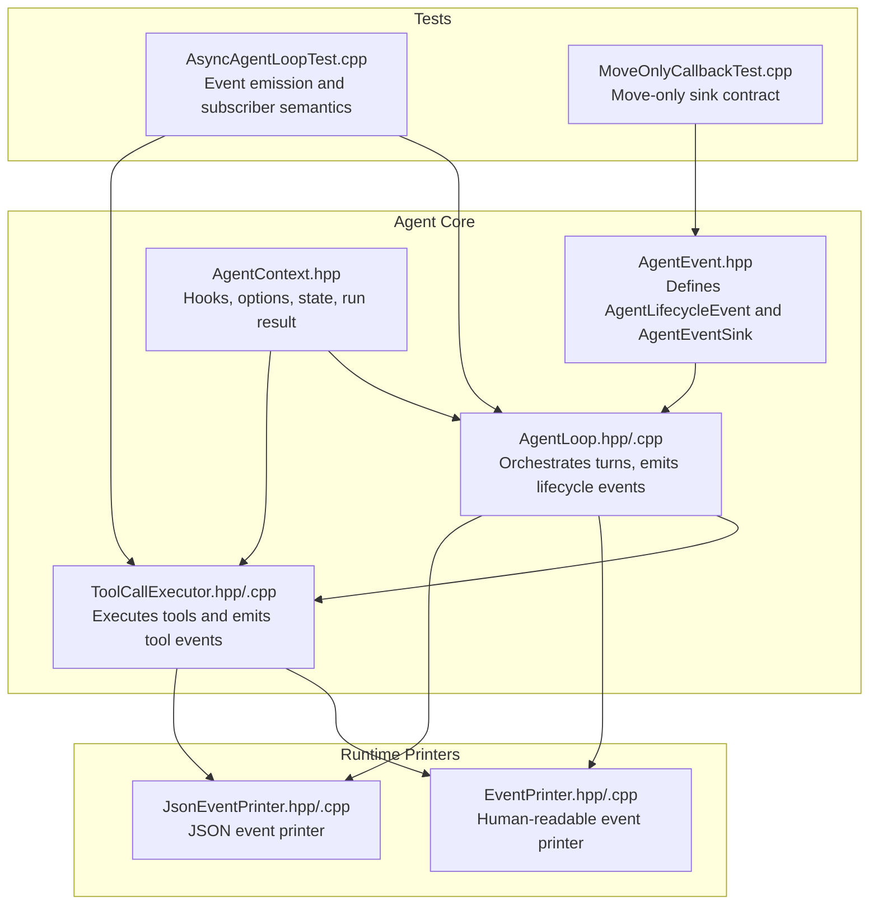
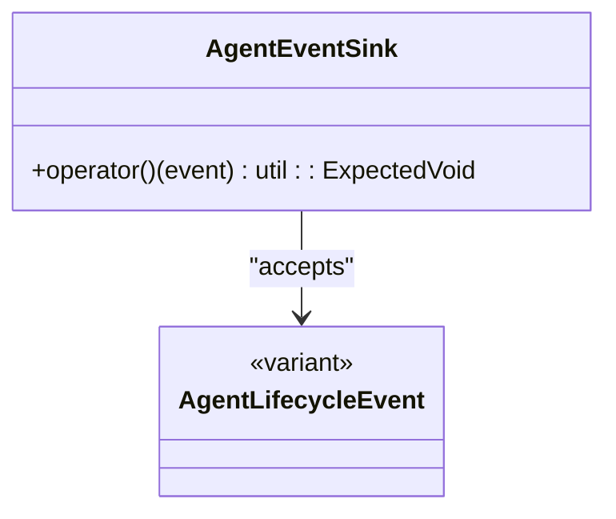
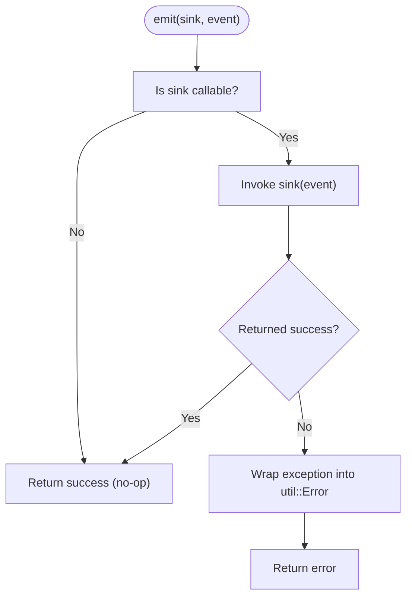
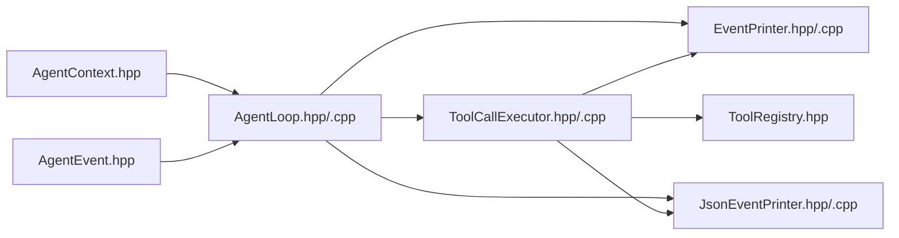

# Agent Events and Lifecycle

<cite>
**Referenced Files in This Document**
- [AgentEvent.hpp](file://include/cch/agent/AgentEvent.hpp)
- [AgentLoop.hpp](file://include/cch/agent/AgentLoop.hpp)
- [AgentLoop.cpp](file://src/agent/AgentLoop.cpp)
- [AgentContext.hpp](file://include/cch/agent/AgentContext.hpp)
- [ToolCallExecutor.hpp](file://src/agent/ToolCallExecutor.hpp)
- [ToolCallExecutor.cpp](file://src/agent/ToolCallExecutor.cpp)
- [EventPrinter.hpp](file://src/coding_agent/runtime/EventPrinter.hpp)
- [EventPrinter.cpp](file://src/coding_agent/runtime/EventPrinter.cpp)
- [JsonEventPrinter.hpp](file://src/coding_agent/runtime/JsonEventPrinter.hpp)
- [JsonEventPrinter.cpp](file://src/coding_agent/runtime/JsonEventPrinter.cpp)
- [AsyncAgentLoopTest.cpp](file://tests/agent/AsyncAgentLoopTest.cpp)
- [MoveOnlyCallbackTest.cpp](file://tests/architecture/MoveOnlyCallbackTest.cpp)
- [ToolRegistry.hpp](file://include/cch/agent/ToolRegistry.hpp)
</cite>

## Table of Contents
1. [Introduction](#introduction)
2. [Project Structure](#project-structure)
3. [Core Components](#core-components)
4. [Architecture Overview](#architecture-overview)
5. [Detailed Component Analysis](#detailed-component-analysis)
6. [Dependency Analysis](#dependency-analysis)
7. [Performance Considerations](#performance-considerations)
8. [Troubleshooting Guide](#troubleshooting-guide)
9. [Conclusion](#conclusion)

## Introduction
This document explains the agent event system and lifecycle management in the codebase. It covers the AgentEvent enum and AgentLifecycleEvent variants that define the agent’s operational states, the event emission mechanism via the emit() method, and how AgentEventSink enables event-driven communication. It also documents move-only callback semantics, subscriber ownership of unique state, lifecycle event types, event ordering guarantees, and practical integration patterns with external systems. Filtering, transformation, and aggregation techniques are included to help you tailor event streams for monitoring, logging, and analytics.

## Project Structure
The agent event system spans several header and implementation files under include/cch/agent and src/agent, plus runtime printers for event serialization. The key areas are:
- Event definitions and sinks
- Agent loop orchestration and event emission
- Tool call execution and tool-related events
- Hooks and options controlling lifecycle behavior
- Printers for human-readable and JSON event formats
- Tests demonstrating event emission and subscriber semantics



**Diagram sources**
- [AgentEvent.hpp:108](file://include/cch/agent/AgentEvent.hpp#L108)
- [AgentLoop.hpp:16-36](file://include/cch/agent/AgentLoop.hpp#L16-L36)
- [AgentLoop.cpp:240-531](file://src/agent/AgentLoop.cpp#L240-L531)
- [AgentContext.hpp:49-87](file://include/cch/agent/AgentContext.hpp#L49-L87)
- [ToolCallExecutor.hpp:31-62](file://src/agent/ToolCallExecutor.hpp#L31-L62)
- [ToolCallExecutor.cpp:123-250](file://src/agent/ToolCallExecutor.cpp#L123-L250)
- [EventPrinter.hpp:9](file://src/coding_agent/runtime/EventPrinter.hpp#L9)
- [EventPrinter.cpp:8-29](file://src/coding_agent/runtime/EventPrinter.cpp#L8-L29)
- [JsonEventPrinter.hpp:12-26](file://src/coding_agent/runtime/JsonEventPrinter.hpp#L12-L26)
- [JsonEventPrinter.cpp:80-139](file://src/coding_agent/runtime/JsonEventPrinter.cpp#L80-L139)
- [AsyncAgentLoopTest.cpp:87-108](file://tests/agent/AsyncAgentLoopTest.cpp#L87-L108)
- [MoveOnlyCallbackTest.cpp:13-55](file://tests/architecture/MoveOnlyCallbackTest.cpp#L13-L55)

**Section sources**
- [AgentEvent.hpp:108](file://include/cch/agent/AgentEvent.hpp#L108)
- [AgentLoop.hpp:16-36](file://include/cch/agent/AgentLoop.hpp#L16-L36)
- [AgentLoop.cpp:240-531](file://src/agent/AgentLoop.cpp#L240-L531)
- [AgentContext.hpp:49-87](file://include/cch/agent/AgentContext.hpp#L49-L87)
- [ToolCallExecutor.hpp:31-62](file://src/agent/ToolCallExecutor.hpp#L31-L62)
- [ToolCallExecutor.cpp:123-250](file://src/agent/ToolCallExecutor.cpp#L123-L250)
- [EventPrinter.hpp:9](file://src/coding_agent/runtime/EventPrinter.hpp#L9)
- [EventPrinter.cpp:8-29](file://src/coding_agent/runtime/EventPrinter.cpp#L8-L29)
- [JsonEventPrinter.hpp:12-26](file://src/coding_agent/runtime/JsonEventPrinter.hpp#L12-L26)
- [JsonEventPrinter.cpp:80-139](file://src/coding_agent/runtime/JsonEventPrinter.cpp#L80-L139)
- [AsyncAgentLoopTest.cpp:87-108](file://tests/agent/AsyncAgentLoopTest.cpp#L87-L108)
- [MoveOnlyCallbackTest.cpp:13-55](file://tests/architecture/MoveOnlyCallbackTest.cpp#L13-L55)

## Core Components
- AgentLifecycleEvent: A variant covering all lifecycle events from agent start to end, including per-turn phases, message streaming, thinking updates, tool call streaming, and tool execution phases.
- AgentEventSink: A move-only function wrapper around util::ExpectedVoid that receives AgentLifecycleEvent instances. It is move-only to enforce ownership semantics and prevent accidental copying of capturing lambdas.
- AsyncAgentLoop: Orchestrates the agent loop, emitting lifecycle events at each phase and invoking hooks for context transformation and turn preparation.
- ToolCallExecutor: Executes tool calls in either sequential or parallel mode, emitting tool execution start/end events and honoring before/after hooks.
- Printers: EventPrinter prints human-readable events; JsonEventPrinter serializes structured JSON records for external systems.

Key responsibilities:
- Emit lifecycle events deterministically during agent execution.
- Propagate tool call lifecycle events during tool execution.
- Enforce move-only semantics for callbacks and options to avoid unintended copies.
- Provide hooks for transforming context, preparing next turns, and validating updates.

**Section sources**
- [AgentEvent.hpp:91-108](file://include/cch/agent/AgentEvent.hpp#L91-L108)
- [AgentEvent.hpp:108](file://include/cch/agent/AgentEvent.hpp#L108)
- [AgentLoop.hpp:16-36](file://include/cch/agent/AgentLoop.hpp#L16-L36)
- [AgentLoop.cpp:533-550](file://src/agent/AgentLoop.cpp#L533-L550)
- [ToolCallExecutor.hpp:31-62](file://src/agent/ToolCallExecutor.hpp#L31-L62)
- [ToolCallExecutor.cpp:92-109](file://src/agent/ToolCallExecutor.cpp#L92-L109)
- [EventPrinter.cpp:8-29](file://src/coding_agent/runtime/EventPrinter.cpp#L8-L29)
- [JsonEventPrinter.cpp:80-139](file://src/coding_agent/runtime/JsonEventPrinter.cpp#L80-L139)

## Architecture Overview
The agent lifecycle is a coroutine-driven loop that emits a well-defined sequence of events. The loop integrates AI streaming, tool execution, and optional hooks for context transformation and turn preparation. Tool execution can be sequential or parallel, emitting tool-specific events along the way.

```mermaid
sequenceDiagram
participant Client as "Caller"
participant Loop as "AsyncAgentLoop"
participant AI as "StreamingChatClient"
participant Exec as "ToolCallExecutor"
participant Sink as "AgentEventSink"
Client->>Loop : run(prompt, sink)
Loop->>Sink : emit(AgentStartEvent)
Loop->>AI : stream(request, event_handler)
AI-->>Loop : AssistantStart/TextStart/ThinkingStart
AI-->>Loop : TextDelta/ThinkingDelta
Loop->>Sink : emit(MessageUpdateEvent/ThinkingUpdateEvent)
AI-->>Loop : ToolCallStart/Delta/End
Loop->>Sink : emit(ToolCallStreamStart/Update/End)
AI-->>Loop : AssistantDone/Error
Loop->>Sink : emit(MessageEndEvent)
alt Tool calls present
Loop->>Exec : execute(turn, assistant, calls, context, state, sink)
Exec->>Sink : emit(ToolExecutionStartEvent)
Exec-->>Loop : ToolResultMessage[]
Loop->>Sink : emit(ToolExecutionEndEvent)
end
Loop->>Sink : emit(TurnEndEvent)
Loop->>Sink : emit(AgentEndEvent)
Loop-->>Client : AsyncAgentRunResult
```

**Diagram sources**
- [AgentLoop.cpp:249-531](file://src/agent/AgentLoop.cpp#L249-L531)
- [ToolCallExecutor.cpp:123-250](file://src/agent/ToolCallExecutor.cpp#L123-L250)
- [AgentEvent.hpp:91-108](file://include/cch/agent/AgentEvent.hpp#L91-L108)

## Detailed Component Analysis

### AgentLifecycleEvent and AgentEventSink
AgentLifecycleEvent is a variant that unifies all lifecycle events. AgentEventSink is a move-only function type that accepts an AgentLifecycleEvent and returns util::ExpectedVoid. The move-only nature ensures subscribers can capture and own unique state without risk of accidental copies.



**Diagram sources**
- [AgentEvent.hpp:91-108](file://include/cch/agent/AgentEvent.hpp#L91-L108)
- [AgentEvent.hpp:108](file://include/cch/agent/AgentEvent.hpp#L108)

Practical implications:
- Subscribers can capture resources by value or unique_ptr in their lambda captures.
- Move-only sinks prevent accidental copying of capturing lambdas.
- Tests demonstrate that sinks can own unique state and remain callable after move.

**Section sources**
- [AgentEvent.hpp:91-108](file://include/cch/agent/AgentEvent.hpp#L91-L108)
- [MoveOnlyCallbackTest.cpp:43-55](file://tests/architecture/MoveOnlyCallbackTest.cpp#L43-L55)

### Event Emission Mechanism
The emit() method encapsulates event delivery and error handling. It checks whether the sink is callable, invokes it, and converts exceptions into util::Error with a standardized error code and message.



**Diagram sources**
- [AgentLoop.cpp:533-550](file://src/agent/AgentLoop.cpp#L533-L550)
- [ToolCallExecutor.cpp:92-109](file://src/agent/ToolCallExecutor.cpp#L92-L109)

**Section sources**
- [AgentLoop.cpp:533-550](file://src/agent/AgentLoop.cpp#L533-L550)
- [ToolCallExecutor.cpp:92-109](file://src/agent/ToolCallExecutor.cpp#L92-L109)

### Lifecycle Event Types
Below are the primary lifecycle events and their roles during agent execution:

- AgentStartEvent: Emitted at the beginning of run() or continue_with().
- TurnStartEvent: Emitted at the start of each turn.
- MessageStartEvent: Emitted before streaming assistant content begins.
- MessageUpdateEvent: Emitted for text deltas during assistant text streaming.
- ThinkingUpdateEvent: Emitted for thinking deltas during reasoning streaming.
- ToolCallStreamStartEvent/ToolCallStreamUpdateEvent/ToolCallStreamEndEvent: Emitted for tool call streaming phases.
- MessageEndEvent: Emitted when assistant message completes.
- ToolExecutionStartEvent/ToolExecutionEndEvent: Emitted for each tool execution start/end.
- TurnEndEvent: Emitted at the end of each turn.
- AgentEndEvent: Emitted at the end of the run with success and reason.

These events are emitted in a deterministic order within each turn and across turns, enabling reliable sequencing for monitoring and analytics.

**Section sources**
- [AgentEvent.hpp:12-89](file://include/cch/agent/AgentEvent.hpp#L12-L89)
- [AgentLoop.cpp:261-522](file://src/agent/AgentLoop.cpp#L261-L522)
- [ToolCallExecutor.cpp:157-239](file://src/agent/ToolCallExecutor.cpp#L157-L239)

### Event Ordering Guarantees
Within a single turn:
- AgentStartEvent precedes TurnStartEvent.
- TurnStartEvent precedes MessageStartEvent.
- MessageStartEvent precedes MessageUpdateEvent series.
- MessageUpdateEvent precedes MessageEndEvent.
- MessageEndEvent precedes tool call phases (ToolCallStream*) if applicable.
- Tool call phases precede ToolExecutionStartEvent series.
- ToolExecutionStartEvent precedes ToolExecutionEndEvent series.
- ToolExecutionEndEvent precedes TurnEndEvent.
- TurnEndEvent precedes AgentEndEvent.

Across turns, the loop repeats the above pattern up to max_turns or until termination conditions are met.

**Section sources**
- [AgentLoop.cpp:280-522](file://src/agent/AgentLoop.cpp#L280-L522)

### Move-only Callback Semantics and Subscriber Ownership
Move-only semantics are enforced for:
- AgentEventSink
- AsyncAgentOptions
- Hook types (TransformContextHook, ConvertToLlmHook, GetSteeringMessagesHook, GetFollowUpMessagesHook, PrepareNextTurnHook, ValidateTurnUpdateHook)
- AI streaming event sink types

Subscribers can own unique state by capturing it in their lambdas. Tests confirm that move-only sinks remain callable after move and can mutate captured state.

**Section sources**
- [AgentEvent.hpp:108](file://include/cch/agent/AgentEvent.hpp#L108)
- [AgentContext.hpp:15-47](file://include/cch/agent/AgentContext.hpp#L15-L47)
- [MoveOnlyCallbackTest.cpp:13-55](file://tests/architecture/MoveOnlyCallbackTest.cpp#L13-L55)

### Tool Call Execution and Tool Events
Tool execution is performed by ToolCallExecutor, which:
- Chooses sequential vs. parallel mode based on tool definitions and options.
- Emits ToolExecutionStartEvent before each tool call.
- Executes the tool and emits ToolExecutionEndEvent with result content and error flag.
- Honors before_tool_call and after_tool_call hooks, propagating errors and termination hints.

```mermaid
sequenceDiagram
participant Loop as "AsyncAgentLoop"
participant Exec as "ToolCallExecutor"
participant Sink as "AgentEventSink"
participant Tool as "AsyncAgentTool"
Loop->>Exec : execute(turn, assistant, calls, context, state, sink)
loop for each tool call
Exec->>Sink : emit(ToolExecutionStartEvent)
Exec->>Tool : execute(invocation)
Tool-->>Exec : result or error
Exec->>Sink : emit(ToolExecutionEndEvent)
end
Exec-->>Loop : results, terminate_batch
```

**Diagram sources**
- [ToolCallExecutor.cpp:123-250](file://src/agent/ToolCallExecutor.cpp#L123-L250)
- [ToolCallExecutor.hpp:35-58](file://src/agent/ToolCallExecutor.hpp#L35-L58)

**Section sources**
- [ToolCallExecutor.cpp:123-250](file://src/agent/ToolCallExecutor.cpp#L123-L250)
- [ToolCallExecutor.hpp:35-58](file://src/agent/ToolCallExecutor.hpp#L35-L58)

### Practical Examples: Subscription, Handling Patterns, and Integration
- Basic subscription: Pass a lambda to run() or continue_with() that appends events to a vector for later inspection.
- Human-readable printing: Use EventPrinter to log concise textual summaries of key events.
- Structured JSON export: Use JsonEventPrinter to serialize events into JSON lines for external systems.

Examples in tests demonstrate:
- Capturing events in a vector and asserting counts for each event type.
- Using move-only sinks to own unique state and mutate it upon receiving events.
- Integrating printers to produce readable logs and JSON records.

**Section sources**
- [AsyncAgentLoopTest.cpp:87-108](file://tests/agent/AsyncAgentLoopTest.cpp#L87-L108)
- [EventPrinter.cpp:8-29](file://src/coding_agent/runtime/EventPrinter.cpp#L8-L29)
- [JsonEventPrinter.cpp:80-139](file://src/coding_agent/runtime/JsonEventPrinter.cpp#L80-L139)

### Event Filtering, Transformation, and Aggregation
Filtering:
- EventPrinter excludes certain internal events (e.g., ThinkingUpdateEvent, ToolCallStream*).
- JsonEventPrinter filters out specific event types and omits content for compatibility.

Transformation:
- Convert assistant text deltas to normalized records with truncation and omission metadata.
- Map stop reasons to canonical string representations.

Aggregation:
- Count occurrences of specific event types to validate lifecycle completeness.
- Aggregate tool execution outcomes to compute pass/fail rates and termination signals.

**Section sources**
- [EventPrinter.cpp:8-29](file://src/coding_agent/runtime/EventPrinter.cpp#L8-L29)
- [JsonEventPrinter.cpp:80-139](file://src/coding_agent/runtime/JsonEventPrinter.cpp#L80-L139)
- [AsyncAgentLoopTest.cpp:110-119](file://tests/agent/AsyncAgentLoopTest.cpp#L110-L119)

## Dependency Analysis
The agent event system depends on:
- AI streaming client for assistant content and tool call streaming.
- Tool registry for resolving tools by name.
- Hooks and options for context transformation and turn preparation.
- Printers for downstream consumption.



**Diagram sources**
- [AgentEvent.hpp:91-108](file://include/cch/agent/AgentEvent.hpp#L91-L108)
- [AgentLoop.hpp:16-36](file://include/cch/agent/AgentLoop.hpp#L16-L36)
- [AgentLoop.cpp:240-531](file://src/agent/AgentLoop.cpp#L240-L531)
- [ToolCallExecutor.hpp:31-62](file://src/agent/ToolCallExecutor.hpp#L31-L62)
- [ToolCallExecutor.cpp:123-250](file://src/agent/ToolCallExecutor.cpp#L123-L250)
- [EventPrinter.hpp:9](file://src/coding_agent/runtime/EventPrinter.hpp#L9)
- [EventPrinter.cpp:8-29](file://src/coding_agent/runtime/EventPrinter.cpp#L8-L29)
- [JsonEventPrinter.hpp:12-26](file://src/coding_agent/runtime/JsonEventPrinter.hpp#L12-L26)
- [JsonEventPrinter.cpp:80-139](file://src/coding_agent/runtime/JsonEventPrinter.cpp#L80-L139)
- [ToolRegistry.hpp:13-48](file://include/cch/agent/ToolRegistry.hpp#L13-L48)

**Section sources**
- [AgentEvent.hpp:91-108](file://include/cch/agent/AgentEvent.hpp#L91-L108)
- [AgentLoop.hpp:16-36](file://include/cch/agent/AgentLoop.hpp#L16-L36)
- [AgentLoop.cpp:240-531](file://src/agent/AgentLoop.cpp#L240-L531)
- [ToolCallExecutor.hpp:31-62](file://src/agent/ToolCallExecutor.hpp#L31-L62)
- [ToolCallExecutor.cpp:123-250](file://src/agent/ToolCallExecutor.cpp#L123-L250)
- [EventPrinter.hpp:9](file://src/coding_agent/runtime/EventPrinter.hpp#L9)
- [EventPrinter.cpp:8-29](file://src/coding_agent/runtime/EventPrinter.cpp#L8-L29)
- [JsonEventPrinter.hpp:12-26](file://src/coding_agent/runtime/JsonEventPrinter.hpp#L12-L26)
- [JsonEventPrinter.cpp:80-139](file://src/coding_agent/runtime/JsonEventPrinter.cpp#L80-L139)
- [ToolRegistry.hpp:13-48](file://include/cch/agent/ToolRegistry.hpp#L13-L48)

## Performance Considerations
- Event emission occurs synchronously inside coroutines; keep sinks lightweight to avoid blocking the agent loop.
- Tool execution can be parallelized; ensure sinks are thread-safe if used concurrently (see parallel emit guard in ToolCallExecutor).
- Prefer JSON printers for machine-to-machine pipelines; they minimize parsing overhead compared to text logs.
- Limit event volume by filtering or aggregating in sinks to reduce downstream processing costs.

## Troubleshooting Guide
Common issues and resolutions:
- Sink exceptions: The emit() method catches exceptions and returns a standardized error. Inspect the error code and detail to diagnose failures in subscriber logic.
- Max turns exceeded: The loop emits an AgentEndEvent with a specific reason when max_turns is reached without a terminal assistant response.
- Validation errors: Hooks like transform_context, convert_to_llm, and prepare_next_turn can return validation errors; ensure inputs meet constraints.
- Tool execution errors: before_tool_call and after_tool_call hooks can fail; check hook implementations and tool argument parsing.

**Section sources**
- [AgentLoop.cpp:533-550](file://src/agent/AgentLoop.cpp#L533-L550)
- [ToolCallExecutor.cpp:92-109](file://src/agent/ToolCallExecutor.cpp#L92-L109)
- [AsyncAgentLoopTest.cpp:267-279](file://tests/agent/AsyncAgentLoopTest.cpp#L267-L279)

## Conclusion
The agent event system provides a robust, deterministic, and extensible foundation for observing and integrating agent behavior. By leveraging move-only sinks, structured event variants, and comprehensive hooks, developers can monitor execution, filter and transform event streams, and integrate with external systems efficiently. The provided printers and tests offer practical patterns for building observability and analytics pipelines around agent lifecycles.