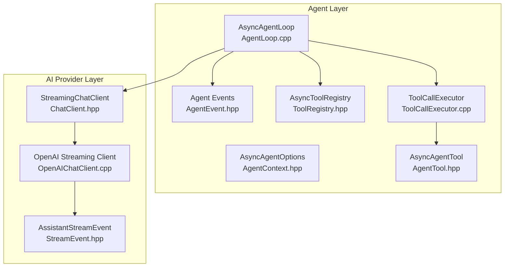
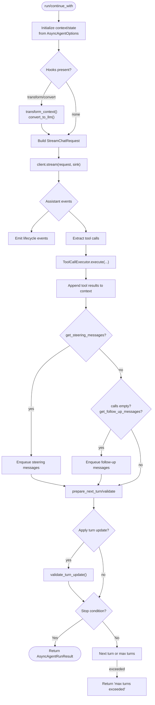
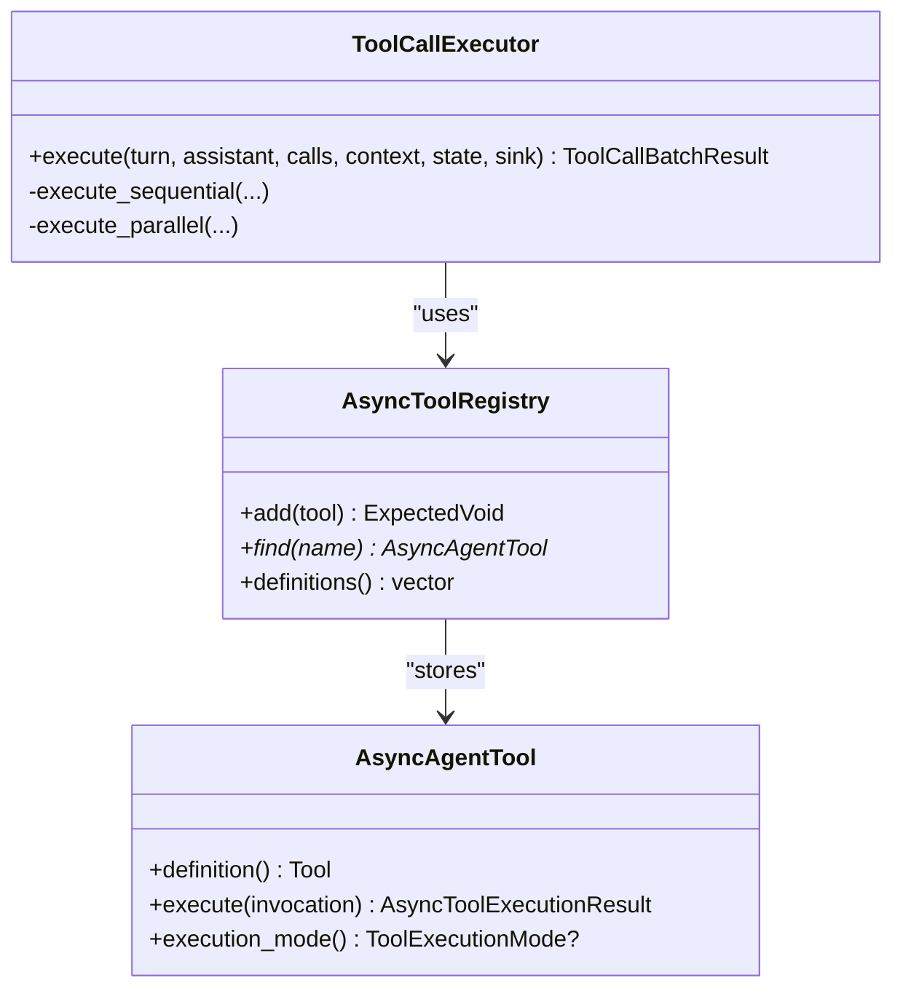
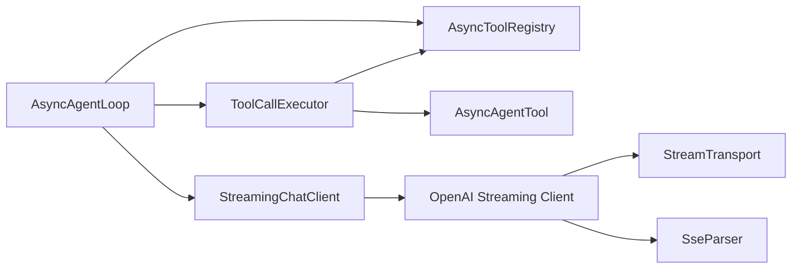

# Agent Loop Architecture

<cite>
**Referenced Files in This Document**
- [AgentLoop.hpp](file://include/cch/agent/AgentLoop.hpp)
- [AgentLoop.cpp](file://src/agent/AgentLoop.cpp)
- [AgentContext.hpp](file://include/cch/agent/AgentContext.hpp)
- [AgentEvent.hpp](file://include/cch/agent/AgentEvent.hpp)
- [ChatClient.hpp](file://include/cch/ai/ChatClient.hpp)
- [StreamEvent.hpp](file://include/cch/ai/StreamEvent.hpp)
- [ToolCallExecutor.hpp](file://src/agent/ToolCallExecutor.hpp)
- [ToolCallExecutor.cpp](file://src/agent/ToolCallExecutor.cpp)
- [ToolRegistry.hpp](file://include/cch/agent/ToolRegistry.hpp)
- [AgentTool.hpp](file://include/cch/agent/AgentTool.hpp)
- [OpenAIChatClient.hpp](file://include/cch/ai/providers/OpenAIChatClient.hpp)
- [OpenAIChatClient.cpp](file://src/ai/providers/OpenAIChatClient.cpp)
- [AsyncAgentLoopTest.cpp](file://tests/agent/AsyncAgentLoopTest.cpp)
</cite>

## Table of Contents
1. [Introduction](#introduction)
2. [Project Structure](#project-structure)
3. [Core Components](#core-components)
4. [Architecture Overview](#architecture-overview)
5. [Detailed Component Analysis](#detailed-component-analysis)
6. [Dependency Analysis](#dependency-analysis)
7. [Performance Considerations](#performance-considerations)
8. [Troubleshooting Guide](#troubleshooting-guide)
9. [Conclusion](#conclusion)

## Introduction
This document explains the agent loop architecture centered around the coroutine-based AsyncAgentLoop class. It describes how the agent orchestrates AI interactions via a streaming chat client, manages tool execution, and emits lifecycle events. It also documents AsyncAgentOptions, the agent lifecycle, error handling, and integration patterns with AI providers such as OpenAI-compatible clients.

## Project Structure
The agent loop lives in the agent subsystem and integrates with the AI provider layer and tooling infrastructure:
- Agent orchestration: AsyncAgentLoop and related types
- AI provider interface: StreamingChatClient and stream events
- Tool execution: ToolCallExecutor and AsyncAgentTool
- Tool registry: AsyncToolRegistry
- Tests demonstrate usage and error handling patterns



**Diagram sources**
- [AgentLoop.cpp:240-531](file://src/agent/AgentLoop.cpp#L240-L531)
- [AgentContext.hpp:49-87](file://include/cch/agent/AgentContext.hpp#L49-L87)
- [AgentEvent.hpp:12-108](file://include/cch/agent/AgentEvent.hpp#L12-L108)
- [ToolRegistry.hpp:13-48](file://include/cch/agent/ToolRegistry.hpp#L13-L48)
- [ToolCallExecutor.cpp:120-143](file://src/agent/ToolCallExecutor.cpp#L120-L143)
- [AgentTool.hpp:64-76](file://include/cch/agent/AgentTool.hpp#L64-L76)
- [ChatClient.hpp:23-34](file://include/cch/ai/ChatClient.hpp#L23-L34)
- [StreamEvent.hpp:13-90](file://include/cch/ai/StreamEvent.hpp#L13-L90)
- [OpenAIChatClient.cpp:263-497](file://src/ai/providers/OpenAIChatClient.cpp#L263-L497)

**Section sources**
- [AgentLoop.hpp:16-36](file://include/cch/agent/AgentLoop.hpp#L16-L36)
- [AgentLoop.cpp:240-531](file://src/agent/AgentLoop.cpp#L240-L531)
- [ChatClient.hpp:23-34](file://include/cch/ai/ChatClient.hpp#L23-L34)

## Core Components
- AsyncAgentLoop: Orchestrates a single agent session, emitting lifecycle events and coordinating LLM calls and tool execution.
- AsyncAgentOptions: Controls session behavior including max turns, model, tool execution mode, and optional hooks for context transformation and turn updates.
- AgentState and AsyncAgentRunResult: Track runtime state and capture the final outcome.
- StreamingChatClient: Provider-agnostic interface for streaming assistant responses.
- ToolCallExecutor: Executes tool calls sequentially or in parallel, honoring per-tool and global execution modes.
- AsyncToolRegistry: Stores and retrieves async tools by name.
- AsyncAgentTool: Base interface for async tools.

**Section sources**
- [AgentLoop.hpp:16-36](file://include/cch/agent/AgentLoop.hpp#L16-L36)
- [AgentContext.hpp:49-87](file://include/cch/agent/AgentContext.hpp#L49-L87)
- [AgentEvent.hpp:12-108](file://include/cch/agent/AgentEvent.hpp#L12-L108)
- [ToolCallExecutor.hpp:31-62](file://src/agent/ToolCallExecutor.hpp#L31-L62)
- [ToolRegistry.hpp:13-48](file://include/cch/agent/ToolRegistry.hpp#L13-L48)
- [AgentTool.hpp:64-76](file://include/cch/agent/AgentTool.hpp#L64-L76)

## Architecture Overview
The AsyncAgentLoop coordinates a turn-based conversation:
- Initialize context and state from AsyncAgentOptions
- Optionally transform context and filter messages for the LLM
- Stream assistant responses via StreamingChatClient
- Parse assistant deltas and emit lifecycle events
- Extract tool calls and execute them via ToolCallExecutor
- Optionally enqueue steering or follow-up messages
- Apply optional turn updates and validate them
- Terminate on stop reason, tool-use termination, or max turns

```mermaid
sequenceDiagram
participant Caller as "Caller"
participant Loop as "AsyncAgentLoop"
participant Client as "StreamingChatClient"
participant Exec as "ToolCallExecutor"
participant Tools as "AsyncAgentTool Registry"
Caller->>Loop : run(user_prompt, sink)
Loop->>Loop : initialize context/state
alt transform/convert hooks present
Loop->>Loop : transform_context()/convert_to_llm()
end
Loop->>Client : stream(request, sink)
Client-->>Loop : AssistantStart/Text/Thinking/ToolCall deltas
Loop->>Loop : emit lifecycle events
Client-->>Loop : AssistantDone/ToolCallEnd
Loop->>Exec : execute(turn, assistant, calls, context, state, sink)
Exec->>Tools : execute(tool_invocation)
Tools-->>Exec : tool result
Exec-->>Loop : batch results
Loop->>Loop : append tool results to context
opt steering/follow-up/get_follow_up
Loop->>Loop : enqueue messages
end
opt prepare_next_turn/validate
Loop->>Loop : apply turn update
end
Loop-->>Caller : AsyncAgentRunResult
```

**Diagram sources**
- [AgentLoop.cpp:243-531](file://src/agent/AgentLoop.cpp#L243-L531)
- [ToolCallExecutor.cpp:123-143](file://src/agent/ToolCallExecutor.cpp#L123-L143)
- [ChatClient.hpp:27-29](file://include/cch/ai/ChatClient.hpp#L27-L29)

## Detailed Component Analysis

### AsyncAgentLoop: Orchestration and Lifecycle
- Initialization and entry points:
  - run(): starts a fresh session with an empty history
  - continue_with(): resumes with provided history and user prompt
- Core loop:
  - Builds StreamChatRequest from context and optional transformations
  - Streams assistant events and emits AgentLifecycleEvent updates
  - Collects tool calls and delegates execution to ToolCallExecutor
  - Manages pending steering/follow-up messages and applies turn updates
  - Emits AgentEndEvent on success or failure
- Validation and safety:
  - Validates queued messages size/count
  - Enforces thinking level constraints
  - Guards against empty convert_to_llm outputs
  - Limits max turns and emits a deterministic error on overflow



**Diagram sources**
- [AgentLoop.cpp:243-531](file://src/agent/AgentLoop.cpp#L243-L531)
- [AgentContext.hpp:49-87](file://include/cch/agent/AgentContext.hpp#L49-L87)

**Section sources**
- [AgentLoop.hpp:18-27](file://include/cch/agent/AgentLoop.hpp#L18-L27)
- [AgentLoop.cpp:243-531](file://src/agent/AgentLoop.cpp#L243-L531)
- [AgentEvent.hpp:12-108](file://include/cch/agent/AgentEvent.hpp#L12-L108)

### AsyncAgentOptions: Behavior Configuration
Key fields and effects:
- max_turns: Caps the number of turns before termination
- model: Default model for requests
- before_tool_call/after_tool_call: Hook to intercept tool execution
- transform_context/convert_to_llm: Preprocess messages for LLM
- get_steering_messages/get_follow_up_messages: Inject queued messages between turns
- prepare_next_turn/validate_turn_update: Dynamically adjust model/thinking level/messages
- tool_execution_mode/max_parallel_tools: Control sequential vs parallel tool execution

These options are consumed in the loop to build requests, validate updates, and configure tool execution.

**Section sources**
- [AgentContext.hpp:49-87](file://include/cch/agent/AgentContext.hpp#L49-L87)
- [AgentLoop.cpp:295-327](file://src/agent/AgentLoop.cpp#L295-L327)
- [AgentLoop.cpp:482-515](file://src/agent/AgentLoop.cpp#L482-L515)

### Tool Execution: ToolCallExecutor
- Determines execution mode:
  - Sequential if any tool requires sequential or parallel threshold exceeded
- Sequential mode:
  - Executes calls one-by-one, honoring before/after hooks and termination hints
- Parallel mode:
  - Spawns coroutines per tool call, synchronizing emissions and errors
  - Aggregates results and enforces termination semantics
- Error handling:
  - Malformed tool arguments produce error ToolResultMessage
  - Hook exceptions and tool errors are propagated as errors
  - Aggregate parallel errors surfaced deterministically



**Diagram sources**
- [ToolCallExecutor.hpp:31-62](file://src/agent/ToolCallExecutor.hpp#L31-L62)
- [ToolCallExecutor.cpp:120-143](file://src/agent/ToolCallExecutor.cpp#L120-L143)
- [ToolRegistry.hpp:13-48](file://include/cch/agent/ToolRegistry.hpp#L13-L48)
- [AgentTool.hpp:64-76](file://include/cch/agent/AgentTool.hpp#L64-L76)

**Section sources**
- [ToolCallExecutor.cpp:123-514](file://src/agent/ToolCallExecutor.cpp#L123-L514)
- [ToolRegistry.hpp:13-48](file://include/cch/agent/ToolRegistry.hpp#L13-L48)
- [AgentTool.hpp:64-76](file://include/cch/agent/AgentTool.hpp#L64-L76)

### AI Provider Integration: StreamingChatClient and OpenAI
- StreamingChatClient defines the provider-agnostic contract:
  - stream(request, sink) yields AssistantStreamEvent updates
  - complete(request) convenience wrapper
- OpenAI-compatible implementation:
  - Converts AiContext/messages to provider DTOs
  - Parses SSE chunks and emits AssistantStreamEvent variants
  - Handles tool-call argument parsing and stop reasons
  - Emits AssistantErrorEvent on transport or protocol errors

```mermaid
sequenceDiagram
participant Loop as "AsyncAgentLoop"
participant Client as "StreamingChatClient"
participant Transport as "StreamTransport"
participant Parser as "SseParser"
Loop->>Client : stream(StreamChatRequest, sink)
Client->>Transport : POST SSE request
Transport-->>Client : stream bytes
Client->>Parser : append(bytes)
Parser-->>Client : AssistantStreamEvent[]
Client-->>Loop : emit events (Text/Thinking/ToolCall/Done/Error)
Client-->>Loop : AssistantMessage on completion
```

**Diagram sources**
- [ChatClient.hpp:23-34](file://include/cch/ai/ChatClient.hpp#L23-L34)
- [OpenAIChatClient.cpp:263-497](file://src/ai/providers/OpenAIChatClient.cpp#L263-L497)
- [StreamEvent.hpp:13-90](file://include/cch/ai/StreamEvent.hpp#L13-L90)

**Section sources**
- [ChatClient.hpp:23-34](file://include/cch/ai/ChatClient.hpp#L23-L34)
- [OpenAIChatClient.cpp:263-497](file://src/ai/providers/OpenAIChatClient.cpp#L263-L497)
- [StreamEvent.hpp:13-90](file://include/cch/ai/StreamEvent.hpp#L13-L90)

### Practical Examples and Integration Patterns
- Instantiation and session management:
  - Construct AsyncAgentLoop with a StreamingChatClient, AsyncToolRegistry, and AsyncAgentOptions
  - Call run() for a new session or continue_with() to resume with prior history
  - Subscribe to AgentLifecycleEvent via AgentEventSink to observe progress
- Integration patterns:
  - Use transform_context to prune or augment context for the LLM
  - Use convert_to_llm to filter out non-LLM messages
  - Use get_steering_messages/get_follow_up_messages to inject curated prompts
  - Use prepare_next_turn/validate_turn_update to dynamically change model or thinking level
- Tool execution:
  - Register tools via AsyncToolRegistry
  - Configure tool_execution_mode and max_parallel_tools in AsyncAgentOptions
  - Use before_tool_call/after_tool_call to gate or post-process tool results

**Section sources**
- [AgentLoop.cpp:243-531](file://src/agent/AgentLoop.cpp#L243-L531)
- [AgentContext.hpp:49-87](file://include/cch/agent/AgentContext.hpp#L49-L87)
- [AsyncAgentLoopTest.cpp:87-108](file://tests/agent/AsyncAgentLoopTest.cpp#L87-L108)

## Dependency Analysis
- AsyncAgentLoop depends on:
  - StreamingChatClient for LLM interactions
  - AsyncToolRegistry and ToolCallExecutor for tool execution
  - AgentEventSink for lifecycle notifications
- ToolCallExecutor depends on:
  - AsyncToolRegistry for tool lookup
  - AsyncAgentTool for execution
- OpenAI client depends on:
  - StreamTransport for HTTP streaming
  - SseParser for event parsing



**Diagram sources**
- [AgentLoop.cpp:240-531](file://src/agent/AgentLoop.cpp#L240-L531)
- [ToolCallExecutor.cpp:120-143](file://src/agent/ToolCallExecutor.cpp#L120-L143)
- [OpenAIChatClient.cpp:260-261](file://src/ai/providers/OpenAIChatClient.cpp#L260-L261)

**Section sources**
- [AgentLoop.cpp:240-531](file://src/agent/AgentLoop.cpp#L240-L531)
- [ToolCallExecutor.cpp:120-143](file://src/agent/ToolCallExecutor.cpp#L120-L143)
- [OpenAIChatClient.cpp:260-261](file://src/ai/providers/OpenAIChatClient.cpp#L260-L261)

## Performance Considerations
- Turn limits: Configure max_turns to bound CPU and memory usage
- Parallel tool execution: Increase max_parallel_tools judiciously; monitor contention
- Message size limits: The agent validates queued messages to prevent excessive memory pressure
- Streaming overhead: Provider latency and bandwidth affect end-to-end latency; consider connection pooling and timeouts at the transport layer

[No sources needed since this section provides general guidance]

## Troubleshooting Guide
Common failure scenarios and handling:
- Provider errors:
  - Provider stream termination without terminal event or assistant payload
  - Missing API key or invalid configuration
  - Transport failures propagate as AssistantErrorEvent and abort the run
- Validation errors:
  - Too many queued messages or exceeding byte limits
  - Empty convert_to_llm output
  - Invalid thinking level or model update without validation
- Tool execution errors:
  - Unknown tool name
  - Malformed tool arguments
  - before_tool_call/after_tool_call hook failures or exceptions
- Behavioral checks:
  - Max turns exceeded terminates with a deterministic error
  - Tool execution can short-circuit runs when all calls agree to terminate

**Section sources**
- [AgentLoop.cpp:82-105](file://src/agent/AgentLoop.cpp#L82-L105)
- [AgentLoop.cpp:316-324](file://src/agent/AgentLoop.cpp#L316-L324)
- [AgentLoop.cpp:495-514](file://src/agent/AgentLoop.cpp#L495-L514)
- [OpenAIChatClient.cpp:443-458](file://src/ai/providers/OpenAIChatClient.cpp#L443-L458)
- [OpenAIChatClient.cpp:508-512](file://src/ai/providers/OpenAIChatClient.cpp#L508-L512)
- [AsyncAgentLoopTest.cpp:267-279](file://tests/agent/AsyncAgentLoopTest.cpp#L267-L279)

## Conclusion
The AsyncAgentLoop provides a robust, coroutine-driven orchestration layer for AI-assisted workflows. By combining a provider-agnostic streaming interface, flexible context hooks, and configurable tool execution, it supports iterative, tool-augmented conversations with strong error handling and observability through lifecycle events.