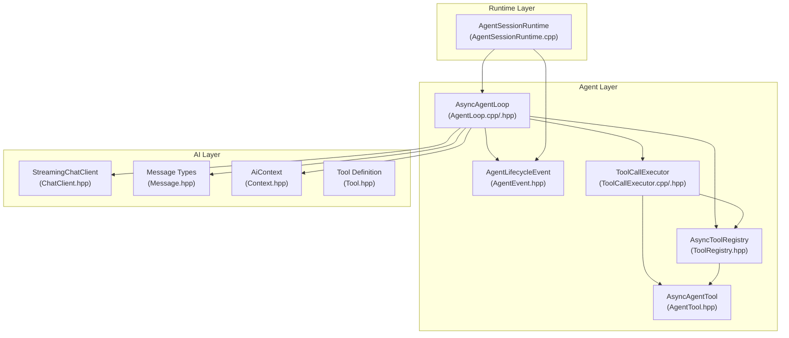
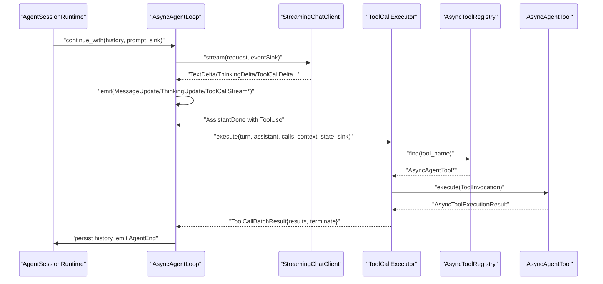
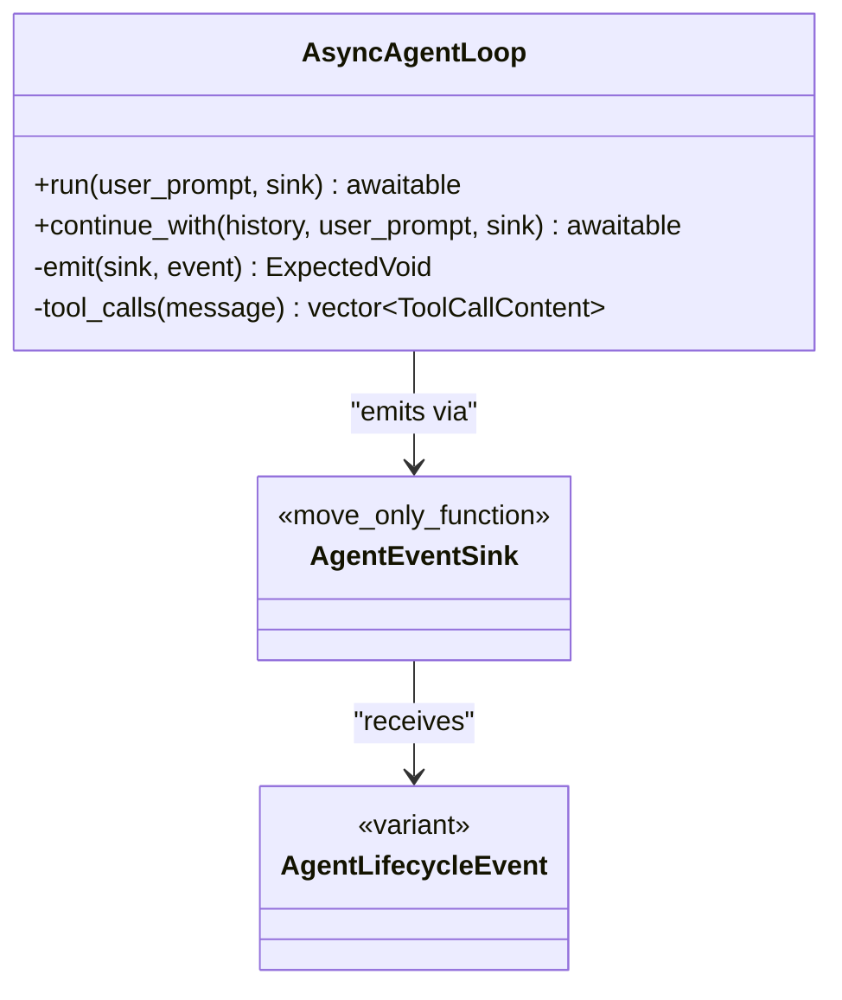
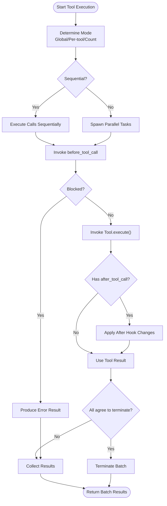
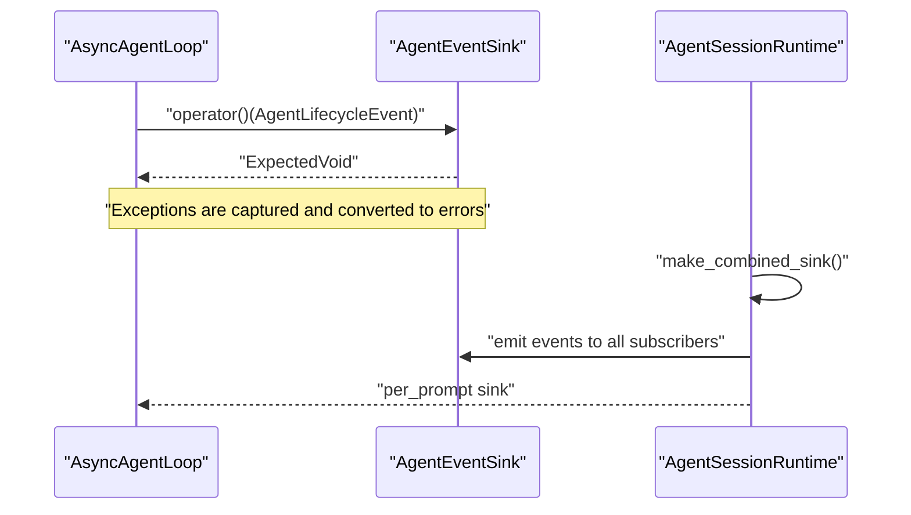
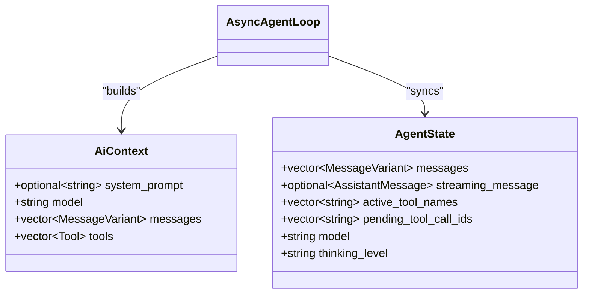
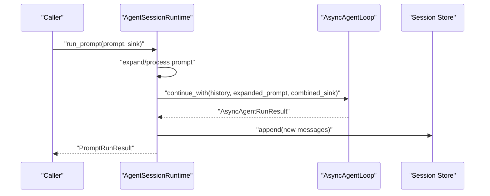
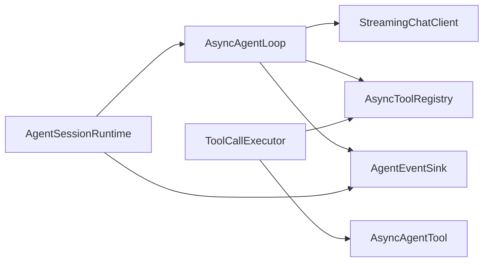

# Agent System

<cite>
**Referenced Files in This Document**
- [AgentLoop.hpp](file://include/cch/agent/AgentLoop.hpp)
- [AgentLoop.cpp](file://src/agent/AgentLoop.cpp)
- [AgentEvent.hpp](file://include/cch/agent/AgentEvent.hpp)
- [AgentContext.hpp](file://include/cch/agent/AgentContext.hpp)
- [AgentTool.hpp](file://include/cch/agent/AgentTool.hpp)
- [ToolRegistry.hpp](file://include/cch/agent/ToolRegistry.hpp)
- [ToolCallExecutor.hpp](file://src/agent/ToolCallExecutor.hpp)
- [ToolCallExecutor.cpp](file://src/agent/ToolCallExecutor.cpp)
- [ChatClient.hpp](file://include/cch/ai/ChatClient.hpp)
- [Message.hpp](file://include/cch/ai/Message.hpp)
- [Context.hpp](file://include/cch/ai/Context.hpp)
- [Tool.hpp](file://include/cch/ai/Tool.hpp)
- [AgentSessionRuntime.cpp](file://src/coding_agent/runtime/AgentSessionRuntime.cpp)
- [Error.hpp](file://include/cch/util/Error.hpp)
- [AsyncAgentLoopTest.cpp](file://tests/agent/AsyncAgentLoopTest.cpp)
- [ToolCallExecutorTest.cpp](file://tests/agent/ToolCallExecutorTest.cpp)
</cite>

## Table of Contents
1. [Introduction](#introduction)
2. [Project Structure](#project-structure)
3. [Core Components](#core-components)
4. [Architecture Overview](#architecture-overview)
5. [Detailed Component Analysis](#detailed-component-analysis)
6. [Dependency Analysis](#dependency-analysis)
7. [Performance Considerations](#performance-considerations)
8. [Troubleshooting Guide](#troubleshooting-guide)
9. [Conclusion](#conclusion)

## Introduction
This document explains the agent system’s coroutine-based loop architecture and its role in orchestrating AI interactions, tool execution, and session management. It covers the agent lifecycle events enabling event-driven communication, the tool call orchestration pipeline, the event emission system with move-only callback semantics, conversation history management, and the relationship between the agent loop and the broader runtime system. Practical examples illustrate event handling, tool execution patterns, and integration with the AI provider layer. Error handling and recovery mechanisms are documented to guide robust integrations.

## Project Structure
The agent system is organized around a coroutine-driven loop that integrates with an AI provider client, a tool registry, and a runtime session manager. Key modules include:
- Agent loop and lifecycle events
- Tool registry and tool execution
- AI provider interface and message types
- Runtime integration for sessions and event sinks

**Diagram sources**
- [AgentLoop.cpp:240-531](file://src/agent/AgentLoop.cpp#L240-L531)
- [AgentEvent.hpp:91-110](file://include/cch/agent/AgentEvent.hpp#L91-L110)
- [AgentTool.hpp:64-76](file://include/cch/agent/AgentTool.hpp#L64-L76)
- [ToolRegistry.hpp:13-48](file://include/cch/agent/ToolRegistry.hpp#L13-L48)
- [ToolCallExecutor.cpp:120-143](file://src/agent/ToolCallExecutor.cpp#L120-L143)
- [ChatClient.hpp:23-34](file://include/cch/ai/ChatClient.hpp#L23-L34)
- [Message.hpp:31-105](file://include/cch/ai/Message.hpp#L31-L105)
- [Context.hpp:12-17](file://include/cch/ai/Context.hpp#L12-L17)
- [Tool.hpp:97-101](file://include/cch/ai/Tool.hpp#L97-L101)
- [AgentSessionRuntime.cpp:47-91](file://src/coding_agent/runtime/AgentSessionRuntime.cpp#L47-L91)

**Section sources**
- [AgentLoop.hpp:14-36](file://include/cch/agent/AgentLoop.hpp#L14-L36)
- [AgentLoop.cpp:240-531](file://src/agent/AgentLoop.cpp#L240-L531)
- [AgentEvent.hpp:91-110](file://include/cch/agent/AgentEvent.hpp#L91-L110)
- [AgentTool.hpp:64-76](file://include/cch/agent/AgentTool.hpp#L64-L76)
- [ToolRegistry.hpp:13-48](file://include/cch/agent/ToolRegistry.hpp#L13-L48)
- [ToolCallExecutor.hpp:31-62](file://src/agent/ToolCallExecutor.hpp#L31-L62)
- [ToolCallExecutor.cpp:120-143](file://src/agent/ToolCallExecutor.cpp#L120-L143)
- [ChatClient.hpp:23-34](file://include/cch/ai/ChatClient.hpp#L23-L34)
- [Message.hpp:31-105](file://include/cch/ai/Message.hpp#L31-L105)
- [Context.hpp:12-17](file://include/cch/ai/Context.hpp#L12-L17)
- [Tool.hpp:97-101](file://include/cch/ai/Tool.hpp#L97-L101)
- [AgentSessionRuntime.cpp:47-91](file://src/coding_agent/runtime/AgentSessionRuntime.cpp#L47-L91)

## Core Components
- Coroutine-based agent loop: Drives turns, streams assistant responses, parses tool calls, and coordinates tool execution.
- Lifecycle events: A variant of structured events emitted during agent execution to enable event-driven integrations.
- Tool registry: Manages asynchronous tools and exposes their definitions to the AI provider.
- Tool call executor: Executes tool calls sequentially or in parallel, honoring per-tool and global execution modes.
- AI provider client: Streams assistant events and returns the final assistant message.
- Runtime session manager: Integrates the agent loop into a session lifecycle, persists history, and manages subscribers.

Key responsibilities:
- Agent loop: Orchestrates turns, validates and applies turn updates, emits lifecycle events, and manages conversation history.
- Tool executor: Parses tool arguments, invokes hooks, executes tools, and aggregates results.
- Event emission: Uses move-only callbacks to deliver structured lifecycle events safely.
- Runtime integration: Subscribes to events, persists session entries, and coordinates shutdown.

**Section sources**
- [AgentLoop.cpp:240-531](file://src/agent/AgentLoop.cpp#L240-L531)
- [AgentEvent.hpp:91-110](file://include/cch/agent/AgentEvent.hpp#L91-L110)
- [ToolRegistry.hpp:13-48](file://include/cch/agent/ToolRegistry.hpp#L13-L48)
- [ToolCallExecutor.cpp:120-143](file://src/agent/ToolCallExecutor.cpp#L120-L143)
- [ChatClient.hpp:23-34](file://include/cch/ai/ChatClient.hpp#L23-L34)
- [AgentSessionRuntime.cpp:164-199](file://src/coding_agent/runtime/AgentSessionRuntime.cpp#L164-L199)

## Architecture Overview
The agent loop is a coroutine-driven control plane that:
- Builds an AI context from conversation history and optional hooks.
- Streams assistant events and updates internal state incrementally.
- Extracts tool calls from assistant messages and delegates execution to the tool call executor.
- Emits lifecycle events for external subscribers.
- Applies turn updates and decides continuation conditions.

**Diagram sources**
- [AgentSessionRuntime.cpp:164-199](file://src/coding_agent/runtime/AgentSessionRuntime.cpp#L164-L199)
- [AgentLoop.cpp:295-384](file://src/agent/AgentLoop.cpp#L295-L384)
- [ToolCallExecutor.cpp:123-143](file://src/agent/ToolCallExecutor.cpp#L123-L143)
- [ToolRegistry.hpp:29-32](file://include/cch/agent/ToolRegistry.hpp#L29-L32)
- [AgentTool.hpp:69-70](file://include/cch/agent/AgentTool.hpp#L69-L70)

## Detailed Component Analysis

### Agent Loop and Lifecycle Events
The agent loop encapsulates the turn-based orchestration:
- Initializes AI context and agent state.
- Emits lifecycle events for start/end of turns, messages, thinking, tool call streaming, and execution.
- Streams assistant events and updates state incrementally.
- Extracts tool calls and executes them via the tool call executor.
- Applies turn updates and decides whether to continue or terminate.

Lifecycle events include:
- Start/end of agent run, turns, and message streaming.
- Thinking and tool call streaming updates.
- Tool execution start/end with content deltas.
- Turn end with stop reason and agent end with success and reason.

**Diagram sources**
- [AgentLoop.hpp:16-36](file://include/cch/agent/AgentLoop.hpp#L16-L36)
- [AgentEvent.hpp:91-110](file://include/cch/agent/AgentEvent.hpp#L91-L110)

**Section sources**
- [AgentLoop.cpp:240-531](file://src/agent/AgentLoop.cpp#L240-L531)
- [AgentEvent.hpp:12-106](file://include/cch/agent/AgentEvent.hpp#L12-L106)

### Tool Call Orchestration
The tool call executor:
- Determines execution mode (sequential vs. parallel) based on global mode, per-tool hints, and call count.
- Parses tool arguments from assistant messages, validating JSON and falling back to empty arguments when absent.
- Invokes pre/post hooks to block or modify tool execution.
- Executes tools concurrently when appropriate, collecting results and applying termination hints.
- Produces tool result messages and updates agent state.

**Diagram sources**
- [ToolCallExecutor.cpp:123-143](file://src/agent/ToolCallExecutor.cpp#L123-L143)
- [ToolCallExecutor.cpp:145-250](file://src/agent/ToolCallExecutor.cpp#L145-L250)
- [ToolCallExecutor.cpp:252-514](file://src/agent/ToolCallExecutor.cpp#L252-L514)

**Section sources**
- [ToolCallExecutor.hpp:19-41](file://src/agent/ToolCallExecutor.hpp#L19-L41)
- [ToolCallExecutor.cpp:120-143](file://src/agent/ToolCallExecutor.cpp#L120-L143)
- [ToolCallExecutor.cpp:145-250](file://src/agent/ToolCallExecutor.cpp#L145-L250)
- [ToolCallExecutor.cpp:252-514](file://src/agent/ToolCallExecutor.cpp#L252-L514)

### Event Emission and Subscriber Ownership
The agent loop and tool executor use move-only callbacks for event emission:
- AgentEventSink is a move-only function wrapper typed as ExpectedVoid(const AgentLifecycleEvent&).
- The emitter checks for callable validity and catches exceptions, converting them into errors.
- Runtime composes multiple sinks into a single combined sink, preserving subscriber ownership and thread-safety.

**Diagram sources**
- [AgentEvent.hpp:108-110](file://include/cch/agent/AgentEvent.hpp#L108-L110)
- [AgentLoop.cpp:533-550](file://src/agent/AgentLoop.cpp#L533-L550)
- [AgentSessionRuntime.cpp:201-223](file://src/coding_agent/runtime/AgentSessionRuntime.cpp#L201-L223)

**Section sources**
- [AgentEvent.hpp:108-110](file://include/cch/agent/AgentEvent.hpp#L108-L110)
- [AgentLoop.cpp:533-550](file://src/agent/AgentLoop.cpp#L533-L550)
- [AgentSessionRuntime.cpp:201-223](file://src/coding_agent/runtime/AgentSessionRuntime.cpp#L201-L223)

### Conversation History Management
The agent maintains conversation context across turns:
- AiContext holds system prompt, model, messages, and tool definitions.
- AgentState tracks messages, streaming assistant message, active/pending tool call identifiers, model, and thinking level.
- The loop appends user prompts, steering messages, tool results, and assistant messages to history.
- Hooks can transform or filter context before sending to the provider.

**Diagram sources**
- [Context.hpp:12-17](file://include/cch/ai/Context.hpp#L12-L17)
- [AgentContext.hpp:73-80](file://include/cch/agent/AgentContext.hpp#L73-L80)
- [AgentLoop.cpp:32-34](file://src/agent/AgentLoop.cpp#L32-L34)

**Section sources**
- [Context.hpp:12-17](file://include/cch/ai/Context.hpp#L12-L17)
- [AgentContext.hpp:73-80](file://include/cch/agent/AgentContext.hpp#L73-L80)
- [AgentLoop.cpp:32-34](file://src/agent/AgentLoop.cpp#L32-L34)

### Relationship to the Runtime System
The runtime integrates the agent loop into a session:
- Constructs AsyncAgentOptions and transforms context to inject skills.
- Spawns the agent loop on an io_context and synchronizes results.
- Persists new history entries and exposes subscription APIs for event sinks.
- Provides combined sink composition and safe subscriber lifecycle management.

**Diagram sources**
- [AgentSessionRuntime.cpp:93-162](file://src/coding_agent/runtime/AgentSessionRuntime.cpp#L93-L162)
- [AgentSessionRuntime.cpp:164-199](file://src/coding_agent/runtime/AgentSessionRuntime.cpp#L164-L199)

**Section sources**
- [AgentSessionRuntime.cpp:47-91](file://src/coding_agent/runtime/AgentSessionRuntime.cpp#L47-L91)
- [AgentSessionRuntime.cpp:93-162](file://src/coding_agent/runtime/AgentSessionRuntime.cpp#L93-L162)
- [AgentSessionRuntime.cpp:164-199](file://src/coding_agent/runtime/AgentSessionRuntime.cpp#L164-L199)

### Practical Examples

- Agent event handling
  - Subscribe to events and react to message updates, thinking deltas, and tool execution lifecycle.
  - Example patterns are demonstrated in tests emitting lifecycle events and asserting counts.

- Tool execution patterns
  - Sequential vs. parallel execution depending on global mode, per-tool mode, and call count.
  - Blocking via before_tool_call and post-processing via after_tool_call.
  - Termination hints to stop the run when all calls agree.

- Integration with AI provider layer
  - StreamingChatClient drives assistant event emission; the loop translates events into lifecycle emissions and state updates.
  - Tool arguments are parsed from assistant messages and passed to tools.

**Section sources**
- [AsyncAgentLoopTest.cpp:164-213](file://tests/agent/AsyncAgentLoopTest.cpp#L164-L213)
- [AsyncAgentLoopTest.cpp:215-247](file://tests/agent/AsyncAgentLoopTest.cpp#L215-L247)
- [AsyncAgentLoopTest.cpp:281-318](file://tests/agent/AsyncAgentLoopTest.cpp#L281-L318)
- [ToolCallExecutorTest.cpp:236-261](file://tests/agent/ToolCallExecutorTest.cpp#L236-L261)
- [ToolCallExecutorTest.cpp:325-351](file://tests/agent/ToolCallExecutorTest.cpp#L325-L351)
- [ToolCallExecutorTest.cpp:389-412](file://tests/agent/ToolCallExecutorTest.cpp#L389-L412)
- [ChatClient.hpp:27-33](file://include/cch/ai/ChatClient.hpp#L27-L33)

## Dependency Analysis
The agent system exhibits low coupling and high cohesion:
- AsyncAgentLoop depends on StreamingChatClient, AsyncToolRegistry, and AgentEventSink.
- ToolCallExecutor depends on AsyncToolRegistry and AsyncAgentTool.
- AgentSessionRuntime composes AsyncAgentLoop and manages subscriptions and persistence.

**Diagram sources**
- [AgentLoop.hpp:16-36](file://include/cch/agent/AgentLoop.hpp#L16-L36)
- [ToolCallExecutor.hpp:31-62](file://src/agent/ToolCallExecutor.hpp#L31-L62)
- [AgentSessionRuntime.cpp:47-91](file://src/coding_agent/runtime/AgentSessionRuntime.cpp#L47-L91)

**Section sources**
- [AgentLoop.hpp:16-36](file://include/cch/agent/AgentLoop.hpp#L16-L36)
- [ToolCallExecutor.hpp:31-62](file://src/agent/ToolCallExecutor.hpp#L31-L62)
- [AgentSessionRuntime.cpp:47-91](file://src/coding_agent/runtime/AgentSessionRuntime.cpp#L47-L91)

## Performance Considerations
- Concurrency: Parallel tool execution reduces latency when tools are independent and not explicitly marked sequential. The executor chooses sequential when any tool requests it or when the call count exceeds configured limits.
- Backpressure: Queued messages are validated for count and size to prevent unbounded memory growth.
- Streaming: Incremental updates minimize UI stalls and improve responsiveness.
- Locking: Parallel execution uses fine-grained locking and channel-based coordination to synchronize results safely.

[No sources needed since this section provides general guidance]

## Troubleshooting Guide
Common issues and recovery strategies:
- Max turns exceeded: The loop terminates with a validation error and emits an agent end event. Increase max_turns or refine steering/follow-up logic.
- Event sink failures: Exceptions thrown by sinks are captured and converted into tool errors; the run is aborted. Ensure sinks are resilient and avoid throwing in event handlers.
- Malformed tool arguments: Arguments are parsed from raw JSON; invalid JSON yields error tool results. Validate tool schemas and argument generation.
- Provider errors: Assistant stream errors propagate with provider-specific details; inspect error code and detail for remediation.
- Hook failures: before_tool_call and after_tool_call hooks can fail the run; wrap hook logic with proper error handling and logging.

**Section sources**
- [AgentLoop.cpp:525-530](file://src/agent/AgentLoop.cpp#L525-L530)
- [AgentLoop.cpp:533-550](file://src/agent/AgentLoop.cpp#L533-L550)
- [ToolCallExecutor.cpp:41-55](file://src/agent/ToolCallExecutor.cpp#L41-L55)
- [ToolCallExecutor.cpp:64-90](file://src/agent/ToolCallExecutor.cpp#L64-L90)
- [Error.hpp:10-23](file://include/cch/util/Error.hpp#L10-L23)

## Conclusion
The agent system’s coroutine-based loop provides a robust, event-driven framework for orchestrating AI interactions and tool execution. Its lifecycle events, move-only callback semantics, and strict error handling enable reliable integrations. The runtime layer ties the loop into sessions, ensuring conversation continuity and subscriber management. By leveraging hooks, streaming updates, and configurable concurrency, the system supports diverse use cases from simple chat to complex tool-augmented reasoning.