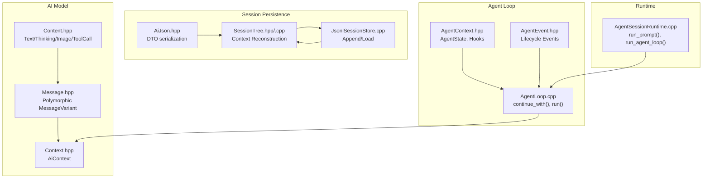
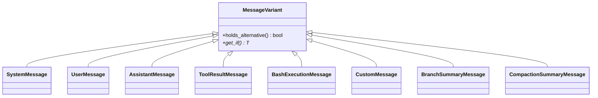
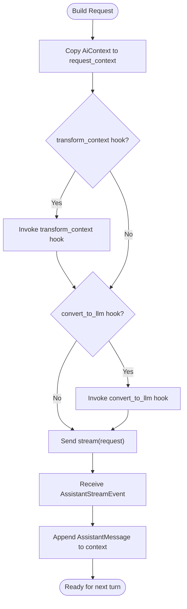
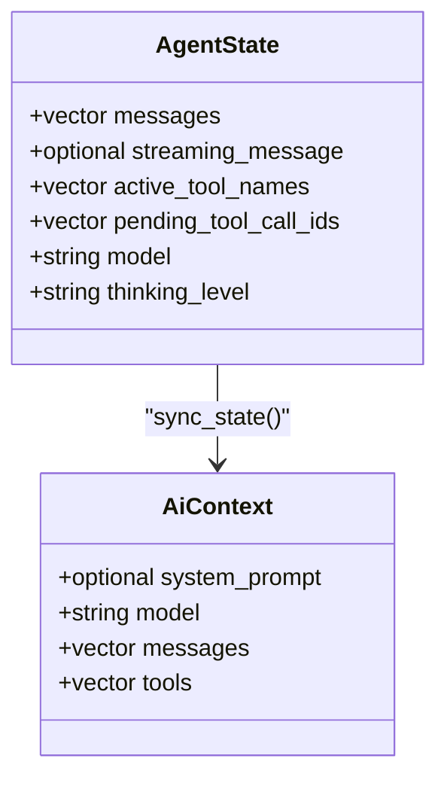
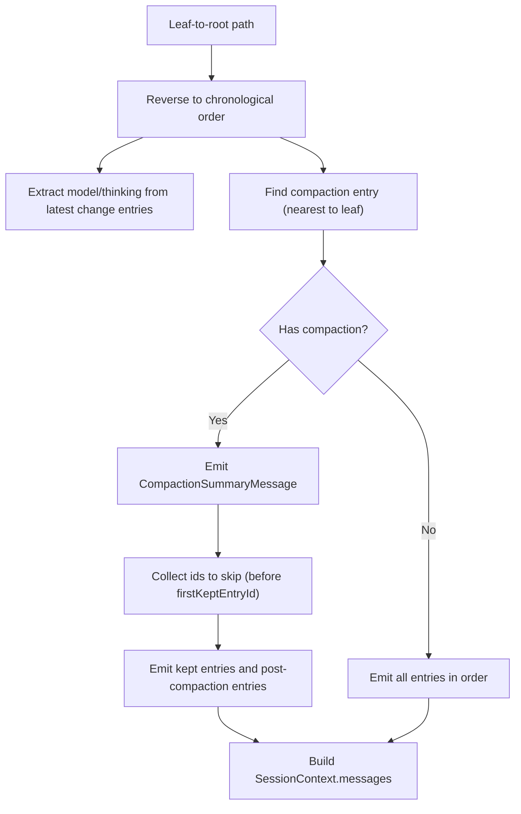
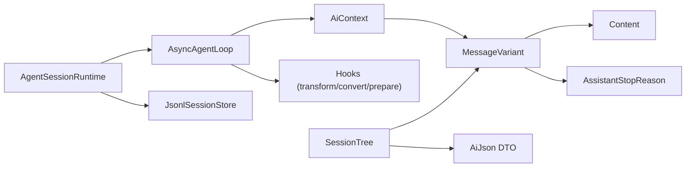

# Conversation History Management

<cite>
**Referenced Files in This Document**
- [Message.hpp](file://include/cch/ai/Message.hpp)
- [Content.hpp](file://include/cch/ai/Content.hpp)
- [Context.hpp](file://include/cch/ai/Context.hpp)
- [AgentContext.hpp](file://include/cch/agent/AgentContext.hpp)
- [AgentEvent.hpp](file://include/cch/agent/AgentEvent.hpp)
- [AgentLoop.cpp](file://src/agent/AgentLoop.cpp)
- [AgentSessionRuntime.cpp](file://src/coding_agent/runtime/AgentSessionRuntime.cpp)
- [SessionTree.hpp](file://include/cch/harness/session/SessionTree.hpp)
- [SessionTree.cpp](file://src/harness/session/SessionTree.cpp)
- [JsonlSessionStore.cpp](file://src/harness/session/JsonlSessionStore.cpp)
- [AiJson.hpp](file://src/ai/glaze/AiJson.hpp)
- [Usage.hpp](file://include/cch/ai/Usage.hpp)
</cite>

## Table of Contents
1. [Introduction](#introduction)
2. [Project Structure](#project-structure)
3. [Core Components](#core-components)
4. [Architecture Overview](#architecture-overview)
5. [Detailed Component Analysis](#detailed-component-analysis)
6. [Dependency Analysis](#dependency-analysis)
7. [Performance Considerations](#performance-considerations)
8. [Troubleshooting Guide](#troubleshooting-guide)
9. [Conclusion](#conclusion)

## Introduction
This document explains how the agent system manages conversation history across multiple turns, preserving context using a polymorphic message system. It covers how the agent resumes conversations with full context via the continue_with() method, how context is built and transmitted to AI providers, and how conversation state is maintained. It also details strategies for handling context length limits, pruning, and memory optimization, with practical examples and diagrams.

## Project Structure
The conversation history management spans several modules:
- AI message model and polymorphism
- Agent loop and turn orchestration
- Session persistence and reconstruction
- Runtime integration for prompt-driven runs



**Diagram sources**
- [Message.hpp:97-105](file://include/cch/ai/Message.hpp#L97-L105)
- [Content.hpp:37-39](file://include/cch/ai/Content.hpp#L37-L39)
- [Context.hpp:12-17](file://include/cch/ai/Context.hpp#L12-L17)
- [AgentContext.hpp:73-87](file://include/cch/agent/AgentContext.hpp#L73-L87)
- [AgentEvent.hpp:91-106](file://include/cch/agent/AgentEvent.hpp#L91-L106)
- [AgentLoop.cpp:249-256](file://src/agent/AgentLoop.cpp#L249-L256)
- [SessionTree.hpp:18-25](file://include/cch/harness/session/SessionTree.hpp#L18-L25)
- [JsonlSessionStore.cpp:114-126](file://src/harness/session/JsonlSessionStore.cpp#L114-L126)
- [AiJson.hpp:602-622](file://src/ai/glaze/AiJson.hpp#L602-L622)
- [AgentSessionRuntime.cpp:164-199](file://src/coding_agent/runtime/AgentSessionRuntime.cpp#L164-L199)

**Section sources**
- [Message.hpp:97-105](file://include/cch/ai/Message.hpp#L97-L105)
- [AgentLoop.cpp:249-256](file://src/agent/AgentLoop.cpp#L249-L256)
- [AgentSessionRuntime.cpp:164-199](file://src/coding_agent/runtime/AgentSessionRuntime.cpp#L164-L199)
- [SessionTree.hpp:18-25](file://include/cch/harness/session/SessionTree.hpp#L18-L25)

## Core Components
- Polymorphic message system: MessageVariant encapsulates System, User, Assistant, ToolResult, and extended runtime messages. This enables heterogeneous histories to be stored and transmitted uniformly.
- Agent state and hooks: AgentState tracks messages, streaming assistant state, active/pending tool call IDs, and model/thinking level. Hooks enable transforming context, converting to LLM-ready messages, injecting steering/follow-up messages, and preparing next-turn updates.
- Session reconstruction: SessionTree rebuilds an LLM-ready AiContext from persisted entries, handling compaction summaries, branch summaries, and state changes.

Key responsibilities:
- Maintain message ordering and role assignment
- Preserve timestamps and structured content
- Enforce queued message limits and validate turn updates
- Inject context and prune history when needed

**Section sources**
- [Message.hpp:97-105](file://include/cch/ai/Message.hpp#L97-L105)
- [AgentContext.hpp:73-87](file://include/cch/agent/AgentContext.hpp#L73-L87)
- [AgentContext.hpp:27-32](file://include/cch/agent/AgentContext.hpp#L27-L32)
- [SessionTree.hpp:18-25](file://include/cch/harness/session/SessionTree.hpp#L18-L25)

## Architecture Overview
The agent orchestrates multi-turn conversations by:
- Accepting initial history and a user prompt
- Building an AiContext with messages and tools
- Optionally transforming and converting context before sending to the provider
- Streaming assistant responses, extracting tool calls, executing tools, and appending results
- Applying optional steering/follow-up messages and preparing next-turn updates
- Persisting new messages and reconstructing context for future sessions

```mermaid
sequenceDiagram
participant User as "Caller"
participant Runtime as "AgentSessionRuntime"
participant Loop as "AsyncAgentLoop"
participant Provider as "StreamingChatClient"
User->>Runtime : "run_prompt(prompt)"
Runtime->>Loop : "continue_with(history, prompt)"
Loop->>Loop : "build AiContext (model, tools, messages)"
alt transform_context hook present
Loop->>Loop : "invoke_transform_context_hook()"
end
alt convert_to_llm hook present
Loop->>Loop : "invoke_convert_to_llm_hook()"
end
Loop->>Provider : "stream(request)"
Provider-->>Loop : "stream events (text/tool-call/thinking)"
Loop->>Loop : "append ToolResultMessage if tool calls"
alt prepare_next_turn hook present
Loop->>Loop : "apply_turn_update(options, context, state)"
end
Loop-->>Runtime : "AsyncAgentRunResult (context, stop_reason, turns)"
Runtime->>Runtime : "persist new messages"
Runtime-->>User : "PromptRunResult"
```

**Diagram sources**
- [AgentSessionRuntime.cpp:164-199](file://src/coding_agent/runtime/AgentSessionRuntime.cpp#L164-L199)
- [AgentLoop.cpp:249-327](file://src/agent/AgentLoop.cpp#L249-L327)
- [AgentLoop.cpp:395-443](file://src/agent/AgentLoop.cpp#L395-L443)
- [AgentLoop.cpp:482-515](file://src/agent/AgentLoop.cpp#L482-L515)

## Detailed Component Analysis

### Polymorphic Message System and Content
- MessageVariant aggregates multiple message types, enabling heterogeneous histories.
- Content variants (Text, Thinking, Image) and AssistantContent variants (Text, Thinking, ToolCall) define how content is represented and extracted.
- Extended runtime messages (BashExecution, Custom, BranchSummary, CompactionSummary) can be converted to UserMessage for LLM consumption.



**Diagram sources**
- [Message.hpp:97-105](file://include/cch/ai/Message.hpp#L97-L105)
- [Message.hpp:31-95](file://include/cch/ai/Message.hpp#L31-L95)

**Section sources**
- [Message.hpp:97-105](file://include/cch/ai/Message.hpp#L97-L105)
- [Content.hpp:37-39](file://include/cch/ai/Content.hpp#L37-L39)
- [Message.hpp:148-205](file://include/cch/ai/Message.hpp#L148-L205)

### Agent Loop and Continue With
- The continue_with() method initializes AiContext with provided history, sets model, and appends the user prompt as a UserMessage.
- It streams assistant responses, updates AgentState, executes tool calls, and appends ToolResultMessage entries.
- Hooks allow injecting steering messages, follow-ups, and transforming context before each request.

```mermaid
sequenceDiagram
participant Caller as "Caller"
participant Loop as "AsyncAgentLoop"
participant Sink as "AgentEventSink"
Caller->>Loop : "continue_with(history, user_prompt)"
Loop->>Loop : "initialize AiContext + AgentState"
Loop->>Sink : "AgentStartEvent"
Loop->>Loop : "append UserMessage"
loop Turns
alt pending_messages not empty
Loop->>Loop : "append queued messages"
end
Loop->>Sink : "MessageStartEvent"
Loop->>Loop : "build request (transform/convert hooks)"
Loop->>Provider : "stream(request)"
Provider-->>Loop : "stream events"
Loop->>Loop : "append AssistantMessage"
alt tool calls
Loop->>Loop : "execute tools, append ToolResultMessage"
end
alt steering/follow-up hooks
Loop->>Loop : "inject messages"
end
alt prepare_next_turn hook
Loop->>Loop : "apply_turn_update"
end
end
Loop->>Sink : "AgentEndEvent"
Loop-->>Caller : "AsyncAgentRunResult"
```

**Diagram sources**
- [AgentLoop.cpp:249-264](file://src/agent/AgentLoop.cpp#L249-L264)
- [AgentLoop.cpp:280-523](file://src/agent/AgentLoop.cpp#L280-L523)
- [AgentEvent.hpp:12-89](file://include/cch/agent/AgentEvent.hpp#L12-L89)

**Section sources**
- [AgentLoop.cpp:249-264](file://src/agent/AgentLoop.cpp#L249-L264)
- [AgentLoop.cpp:280-523](file://src/agent/AgentLoop.cpp#L280-L523)
- [AgentEvent.hpp:91-106](file://include/cch/agent/AgentEvent.hpp#L91-L106)

### Context Building and Provider Transmission
- AiContext carries system_prompt, model, messages, and tools.
- The agent constructs a request_context from AiContext, optionally applying transform_context and convert_to_llm hooks.
- The resulting messages are sent to the provider; assistant responses are streamed and appended to context.



**Diagram sources**
- [Context.hpp:12-17](file://include/cch/ai/Context.hpp#L12-L17)
- [AgentLoop.cpp:295-327](file://src/agent/AgentLoop.cpp#L295-L327)

**Section sources**
- [Context.hpp:12-17](file://include/cch/ai/Context.hpp#L12-L17)
- [AgentLoop.cpp:295-327](file://src/agent/AgentLoop.cpp#L295-L327)

### Conversation State Management
- AgentState tracks messages, streaming assistant message, active tool names, pending tool call IDs, model, and thinking level.
- sync_state mirrors AiContext into AgentState to keep them consistent.
- Tool call IDs are tracked to manage tool execution lifecycle.



**Diagram sources**
- [AgentContext.hpp:73-87](file://include/cch/agent/AgentContext.hpp#L73-L87)
- [AgentContext.hpp:12-17](file://include/cch/agent/AgentContext.hpp#L12-L17)

**Section sources**
- [AgentContext.hpp:73-87](file://include/cch/agent/AgentContext.hpp#L73-L87)
- [AgentLoop.cpp:32-34](file://src/agent/AgentLoop.cpp#L32-L34)

### Resume and Continue With Patterns
- continue_with(history, user_prompt) allows resuming with prior conversation history.
- The runtime loads previous history, runs the agent loop, and persists new messages to the session store.

```mermaid
sequenceDiagram
participant Runtime as "AgentSessionRuntime"
participant Store as "JsonlSessionStore"
participant Loop as "AsyncAgentLoop"
Runtime->>Store : "load(session_path)"
Store-->>Runtime : "LoadedSession (history)"
Runtime->>Loop : "continue_with(history, prompt)"
Loop-->>Runtime : "AsyncAgentRunResult (new_messages)"
Runtime->>Store : "append(new_messages)"
Store-->>Runtime : "ok"
Runtime-->>Runtime : "update session.history"
```

**Diagram sources**
- [AgentSessionRuntime.cpp:164-199](file://src/coding_agent/runtime/AgentSessionRuntime.cpp#L164-L199)
- [JsonlSessionStore.cpp:114-126](file://src/harness/session/JsonlSessionStore.cpp#L114-L126)

**Section sources**
- [AgentSessionRuntime.cpp:164-199](file://src/coding_agent/runtime/AgentSessionRuntime.cpp#L164-L199)
- [JsonlSessionStore.cpp:114-126](file://src/harness/session/JsonlSessionStore.cpp#L114-L126)

### Session Context Reconstruction and Memory Optimization
- SessionTree.buildSessionContext reconstructs an AiContext from a leaf-to-root path:
  - Extracts model and thinking level from the nearest change entries on the path.
  - Handles compaction by emitting a CompactionSummaryMessage and skipping pre-kept entries.
  - Converts BranchSummaryEntry and CustomMessageEntry to their respective message types.
- DTO serialization maps extended runtime messages to roles for persistence and later reconstruction.



**Diagram sources**
- [SessionTree.cpp:176-273](file://src/harness/session/SessionTree.cpp#L176-L273)
- [AiJson.hpp:602-618](file://src/ai/glaze/AiJson.hpp#L602-L618)

**Section sources**
- [SessionTree.hpp:18-25](file://include/cch/harness/session/SessionTree.hpp#L18-L25)
- [SessionTree.cpp:176-273](file://src/harness/session/SessionTree.cpp#L176-L273)
- [AiJson.hpp:602-618](file://src/ai/glaze/AiJson.hpp#L602-L618)

### Practical Examples

- Resuming a conversation with full context:
  - Provide prior history to continue_with(history, user_prompt).
  - The agent appends the new user prompt and proceeds with turns, preserving all prior messages.

- Injecting steering messages:
  - Use get_steering_messages hook to inject additional context or instructions before the next request.

- Converting extended runtime messages to LLM-friendly form:
  - Use helper conversions (e.g., bash_execution_to_user_message) to transform extended types into UserMessage for LLM consumption.

- Applying next-turn updates:
  - prepare_next_turn hook can append messages, change model, or adjust thinking level; validate_turn_update ensures safety for model changes.

**Section sources**
- [AgentLoop.cpp:267-278](file://src/agent/AgentLoop.cpp#L267-L278)
- [Message.hpp:148-205](file://include/cch/ai/Message.hpp#L148-L205)
- [AgentLoop.cpp:482-515](file://src/agent/AgentLoop.cpp#L482-L515)

## Dependency Analysis
- MessageVariant depends on Content and Usage enums.
- AgentLoop depends on AiContext, hooks, and StreamingChatClient.
- SessionTree depends on SessionEntry types and AiJson DTO mapping.
- AgentSessionRuntime composes AgentLoop and JsonlSessionStore.



**Diagram sources**
- [Message.hpp:97-105](file://include/cch/ai/Message.hpp#L97-L105)
- [Content.hpp:37-39](file://include/cch/ai/Content.hpp#L37-L39)
- [Usage.hpp:27-34](file://include/cch/ai/Usage.hpp#L27-L34)
- [Context.hpp:12-17](file://include/cch/ai/Context.hpp#L12-L17)
- [AgentLoop.cpp:249-327](file://src/agent/AgentLoop.cpp#L249-L327)
- [SessionTree.cpp:176-273](file://src/harness/session/SessionTree.cpp#L176-L273)
- [AiJson.hpp:602-618](file://src/ai/glaze/AiJson.hpp#L602-L618)
- [AgentSessionRuntime.cpp:164-199](file://src/coding_agent/runtime/AgentSessionRuntime.cpp#L164-L199)
- [JsonlSessionStore.cpp:114-126](file://src/harness/session/JsonlSessionStore.cpp#L114-L126)

**Section sources**
- [AgentLoop.cpp:249-327](file://src/agent/AgentLoop.cpp#L249-L327)
- [SessionTree.cpp:176-273](file://src/harness/session/SessionTree.cpp#L176-L273)
- [AgentSessionRuntime.cpp:164-199](file://src/coding_agent/runtime/AgentSessionRuntime.cpp#L164-L199)

## Performance Considerations
- Queued message validation: Limits enforce maximum count and total bytes for steering/follow-up messages to prevent excessive memory usage.
- Approximate sizing: Heuristics estimate content sizes for User/Assistant/ToolResult/System messages to bound overhead.
- Streaming assistant responses: Incremental updates minimize latency and memory footprint during long generations.
- Compaction: Skipping pre-kept entries reduces context length while preserving continuity.

Recommendations:
- Prefer compaction for long histories to reduce tokens.
- Use transform_context to filter or summarize low-signal content.
- Limit tool output and use truncate flags to avoid oversized ToolResultMessage payloads.

**Section sources**
- [AgentLoop.cpp:82-105](file://src/agent/AgentLoop.cpp#L82-L105)
- [AgentLoop.cpp:36-80](file://src/agent/AgentLoop.cpp#L36-L80)
- [SessionTree.cpp:211-270](file://src/harness/session/SessionTree.cpp#L211-L270)

## Troubleshooting Guide
Common issues and resolutions:
- Exceeded queued messages or size limits: The agent validates pending messages and returns a validation error if limits are exceeded.
- Invalid model or thinking level updates: Updates are rejected if empty or outside allowed values; ensure hooks return valid settings.
- Provider errors: Assistant stream errors propagate with provider-specific details; check provider logs and credentials.
- Session persistence failures: If append fails, the runtime reports a persistence error; verify storage permissions and disk space.
- Max turns exceeded: If the agent reaches max_turns without a final assistant response, it returns an error indicating the loop timed out.

Operational tips:
- Monitor queued message counts and sizes via validation hooks.
- Use prepare_next_turn to safely inject context or switch models.
- Inspect last assistant text via runtime helpers to confirm completion.

**Section sources**
- [AgentLoop.cpp:82-105](file://src/agent/AgentLoop.cpp#L82-L105)
- [AgentLoop.cpp:113-154](file://src/agent/AgentLoop.cpp#L113-L154)
- [AgentSessionRuntime.cpp:180-199](file://src/coding_agent/runtime/AgentSessionRuntime.cpp#L180-L199)

## Conclusion
The agent’s conversation history management leverages a robust polymorphic message system, strict state synchronization, and flexible hooks to preserve context across turns. SessionTree and JSONL persistence enable reliable reconstruction and pruning strategies like compaction. By combining streaming responses, validation, and controlled context injection, the system balances fidelity, performance, and usability for long-running coding tasks.