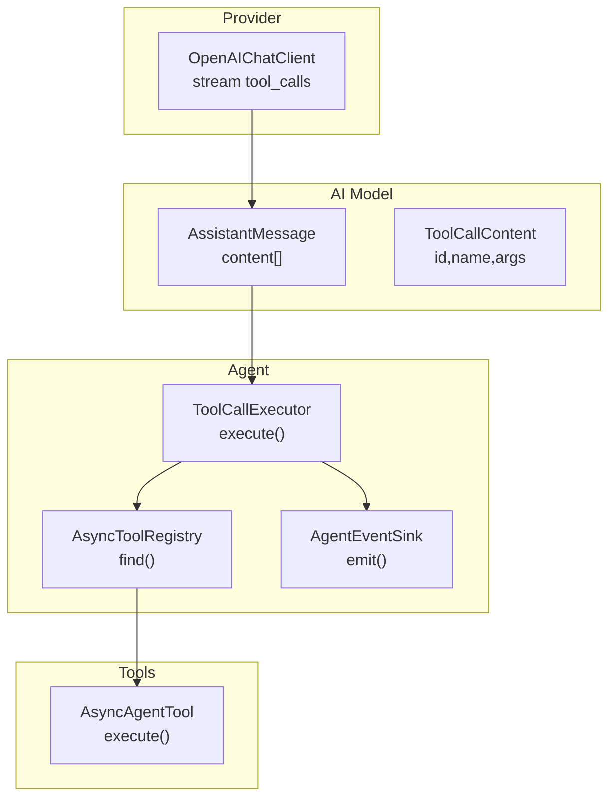
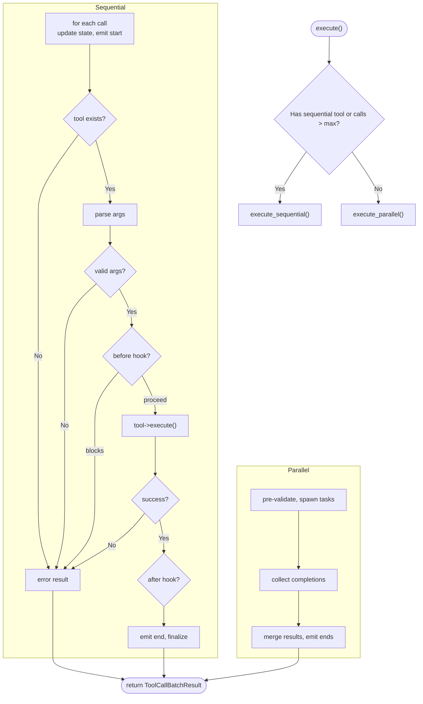
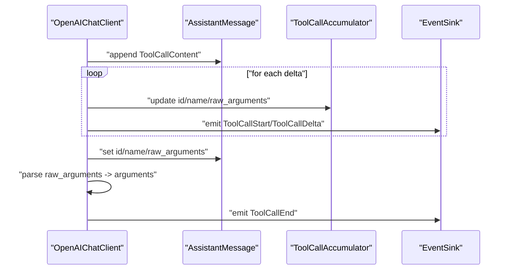
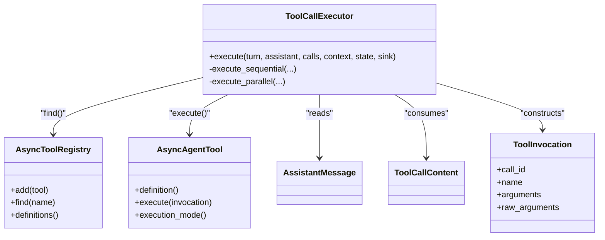

# Tool Call Orchestration

<cite>
**Referenced Files in This Document**
- [ToolCallExecutor.hpp](file://src/agent/ToolCallExecutor.hpp)
- [ToolCallExecutor.cpp](file://src/agent/ToolCallExecutor.cpp)
- [AgentTool.hpp](file://include/cch/agent/AgentTool.hpp)
- [ToolRegistry.hpp](file://include/cch/agent/ToolRegistry.hpp)
- [Message.hpp](file://include/cch/ai/Message.hpp)
- [Content.hpp](file://include/cch/ai/Content.hpp)
- [Tool.hpp](file://include/cch/ai/Tool.hpp)
- [OpenAIChatClient.cpp](file://src/ai/providers/OpenAIChatClient.cpp)
- [AgentLoop.cpp](file://src/agent/AgentLoop.cpp)
- [ToolCallExecutorTest.cpp](file://tests/agent/ToolCallExecutorTest.cpp)
</cite>

## Table of Contents
1. [Introduction](#introduction)
2. [Project Structure](#project-structure)
3. [Core Components](#core-components)
4. [Architecture Overview](#architecture-overview)
5. [Detailed Component Analysis](#detailed-component-analysis)
6. [Dependency Analysis](#dependency-analysis)
7. [Performance Considerations](#performance-considerations)
8. [Security and Sandboxing](#security-and-sandboxing)
9. [Troubleshooting Guide](#troubleshooting-guide)
10. [Conclusion](#conclusion)
11. [Appendices](#appendices)

## Introduction
This document explains the tool call orchestration system that parses, validates, and executes tool requests originating from AI responses. It focuses on the ToolCallExecutor class, the tool_calls extraction pipeline from AssistantMessage content, and the integration with AsyncToolRegistry for tool discovery and execution. It also documents execution phases (parameter parsing, validation, execution, and result processing), error propagation, practical patterns, custom tool integration, execution hooks, and security/resource management considerations.

## Project Structure
The tool call orchestration spans several modules:
- Agent orchestration: ToolCallExecutor orchestrates tool execution and integrates with hooks and event sinks.
- Tool registry: AsyncToolRegistry manages registered tools and resolves them by name.
- AI message model: AssistantMessage and ToolCallContent represent streamed tool calls from providers.
- Provider integration: OpenAIChatClient streams tool calls into AssistantMessage content.
- Agent loop: AgentLoop coordinates turns, collects tool calls, and invokes ToolCallExecutor.



**Diagram sources**
- [ToolCallExecutor.cpp:120-143](file://src/agent/ToolCallExecutor.cpp#L120-L143)
- [ToolRegistry.hpp:29-32](file://include/cch/agent/ToolRegistry.hpp#L29-L32)
- [OpenAIChatClient.cpp:373-488](file://src/ai/providers/OpenAIChatClient.cpp#L373-L488)
- [Message.hpp:41-53](file://include/cch/ai/Message.hpp#L41-L53)
- [Content.hpp:27-35](file://include/cch/ai/Content.hpp#L27-L35)

**Section sources**
- [ToolCallExecutor.hpp:31-62](file://src/agent/ToolCallExecutor.hpp#L31-L62)
- [ToolRegistry.hpp:13-48](file://include/cch/agent/ToolRegistry.hpp#L13-L48)
- [Message.hpp:41-53](file://include/cch/ai/Message.hpp#L41-L53)
- [Content.hpp:27-35](file://include/cch/ai/Content.hpp#L27-L35)
- [OpenAIChatClient.cpp:373-488](file://src/ai/providers/OpenAIChatClient.cpp#L373-L488)

## Core Components
- ToolCallExecutor: Orchestrates tool execution in either sequential or parallel mode, handles parameter parsing/validation, invokes before/after hooks, and emits lifecycle events.
- AsyncToolRegistry: Stores and retrieves AsyncAgentTool instances by tool name.
- AsyncAgentTool: Abstraction for asynchronous tools with a definition and an awaitable execute method.
- ToolInvocation: Encapsulates a single tool call’s identity, name, parsed arguments, and raw arguments.
- ToolCallBatchResult: Aggregates per-call results and a batch-wide termination flag.
- AssistantMessage and ToolCallContent: Data structures representing AI-provided tool calls.

Key responsibilities:
- Parse and validate tool call arguments from ToolCallContent.
- Resolve tools via AsyncToolRegistry.
- Enforce execution mode (sequential vs parallel) based on tool hints and configuration.
- Apply before/after hooks to block, modify, or terminate tool execution.
- Emit lifecycle events and maintain AgentState.

**Section sources**
- [ToolCallExecutor.hpp:19-62](file://src/agent/ToolCallExecutor.hpp#L19-L62)
- [ToolRegistry.hpp:13-48](file://include/cch/agent/ToolRegistry.hpp#L13-L48)
- [AgentTool.hpp:19-76](file://include/cch/agent/AgentTool.hpp#L19-L76)
- [Message.hpp:41-62](file://include/cch/ai/Message.hpp#L41-L62)
- [Content.hpp:27-35](file://include/cch/ai/Content.hpp#L27-L35)

## Architecture Overview
The orchestration pipeline:
1. Provider streams tool calls into AssistantMessage content as ToolCallContent.
2. AgentLoop detects tool calls and constructs a vector of ToolCallContent.
3. ToolCallExecutor decides sequential vs parallel execution.
4. For each call:
   - Validates arguments and prepares ToolInvocation.
   - Optionally invokes before hook to block or inspect.
   - Executes AsyncAgentTool::execute().
   - Optionally invokes after hook to transform result or set termination.
   - Emits lifecycle events and updates AgentState.

```mermaid
sequenceDiagram
participant Prov as "Provider"
participant AI as "AssistantMessage"
participant Loop as "AgentLoop"
participant Exec as "ToolCallExecutor"
participant Reg as "AsyncToolRegistry"
participant Tool as "AsyncAgentTool"
Prov->>AI : "stream tool_calls"
AI-->>Loop : "AssistantMessage with ToolCallContent"
Loop->>Exec : "execute(turn, assistant, calls, ...)"
Exec->>Reg : "find(tool.name)"
Reg-->>Exec : "AsyncAgentTool*"
Exec->>Exec : "parse/validate args"
Exec->>Tool : "execute(ToolInvocation)"
Tool-->>Exec : "AsyncToolExecutionResult"
Exec->>Exec : "after hook (optional)"
Exec-->>Loop : "ToolCallBatchResult"
```

**Diagram sources**
- [OpenAIChatClient.cpp:373-488](file://src/ai/providers/OpenAIChatClient.cpp#L373-L488)
- [AgentLoop.cpp:407-434](file://src/agent/AgentLoop.cpp#L407-L434)
- [ToolCallExecutor.cpp:123-143](file://src/agent/ToolCallExecutor.cpp#L123-L143)
- [ToolRegistry.hpp:29-32](file://include/cch/agent/ToolRegistry.hpp#L29-L32)
- [AgentTool.hpp:69-70](file://include/cch/agent/AgentTool.hpp#L69-L70)

## Detailed Component Analysis

### ToolCallExecutor
Responsibilities:
- Decide execution mode (sequential or parallel) based on configuration and tool hints.
- Sequential execution:
  - Iterates calls, updates AgentState, emits ToolExecutionStart/End events, and aggregates results.
  - Applies before/after hooks and honors termination hints.
- Parallel execution:
  - Pre-validates calls, spawns coroutines, and synchronizes completion via concurrent_channel.
  - Uses thread-safe event emission and error aggregation.
- Parameter parsing and validation:
  - Converts raw_arguments to JsonValue, sets arguments_valid and argument_error accordingly.
- Error handling:
  - Produces ToolResultMessage with is_error=true for unknown tools, invalid arguments, hook failures, tool execution errors, and exceptions.
  - Propagates fatal errors from hooks and event sinks.

Execution modes:
- Sequential: Ensures deterministic ordering; useful for tools that mutate shared resources.
- Parallel: Executes independent tools concurrently up to max_parallel_tools; falls back to sequential when any tool requires it.

Hooks:
- before_tool_call: Can block execution and supply a reason.
- after_tool_call: Can override content/details/is_error and request batch termination.

Batch termination:
- A batch terminates only if all finalized calls indicate termination and none are in error.



**Diagram sources**
- [ToolCallExecutor.cpp:123-143](file://src/agent/ToolCallExecutor.cpp#L123-L143)
- [ToolCallExecutor.cpp:145-250](file://src/agent/ToolCallExecutor.cpp#L145-L250)
- [ToolCallExecutor.cpp:252-514](file://src/agent/ToolCallExecutor.cpp#L252-L514)

**Section sources**
- [ToolCallExecutor.hpp:19-62](file://src/agent/ToolCallExecutor.hpp#L19-L62)
- [ToolCallExecutor.cpp:123-514](file://src/agent/ToolCallExecutor.cpp#L123-L514)

### AsyncToolRegistry
Responsibilities:
- Register tools via add(unique_ptr<AsyncAgentTool>).
- Lookup tools by name via find(string).
- Enumerate tool definitions for schema exposure.

Behavior:
- Rejects null tools during add.
- Returns pointer or null if not found.

**Section sources**
- [ToolRegistry.hpp:21-32](file://include/cch/agent/ToolRegistry.hpp#L21-L32)

### AsyncAgentTool and ToolInvocation
- AsyncAgentTool:
  - Provides definition() for metadata and execute(ToolInvocation) returning AsyncToolExecutionResult.
  - Optional execution_mode() to hint sequential execution.
- ToolInvocation:
  - Carries call_id, name, parsed arguments (JsonValue), and raw_arguments.

**Section sources**
- [AgentTool.hpp:19-76](file://include/cch/agent/AgentTool.hpp#L19-L76)

### AI Message Model: AssistantMessage and ToolCallContent
- AssistantMessage.content stores a vector of AssistantContent, which includes TextContent, ThinkingContent, and ToolCallContent.
- ToolCallContent holds id, name, optional parsed arguments, raw_arguments, validity flags, and optional argument_error.

Provider integration:
- OpenAIChatClient streams tool_calls deltas, assembling ToolCallContent blocks and emitting ToolCallStart/ToolCallDelta/ToolCallEnd events. It parses raw_arguments into structured arguments and marks validity.

**Section sources**
- [Message.hpp:41-53](file://include/cch/ai/Message.hpp#L41-L53)
- [Content.hpp:27-35](file://include/cch/ai/Content.hpp#L27-L35)
- [OpenAIChatClient.cpp:373-488](file://src/ai/providers/OpenAIChatClient.cpp#L373-L488)

### AgentLoop Integration
- AgentLoop detects tool calls from AssistantMessage and constructs a vector of ToolCallContent.
- It configures ToolCallExecutorOptions (before/after hooks, execution mode, max_parallel_tools) and invokes ToolCallExecutor::execute.
- Handles errors by emitting AgentEndEvent and returning unexpected results.

**Section sources**
- [AgentLoop.cpp:407-434](file://src/agent/AgentLoop.cpp#L407-L434)

### Tool Calls Extraction from AI Responses
- The provider stream accumulates tool call deltas by index, building ToolCallContent entries.
- It ensures id and name are populated and parses raw_arguments into structured JSON, setting arguments_valid and argument_error.
- Emits ToolCallStart/ToolCallDelta/ToolCallEnd events for observability.



**Diagram sources**
- [OpenAIChatClient.cpp:373-488](file://src/ai/providers/OpenAIChatClient.cpp#L373-L488)

**Section sources**
- [OpenAIChatClient.cpp:373-488](file://src/ai/providers/OpenAIChatClient.cpp#L373-L488)

## Dependency Analysis
- ToolCallExecutor depends on:
  - AsyncToolRegistry for tool lookup.
  - AsyncAgentTool for execution.
  - AI message types for input and output.
  - Event sink for lifecycle reporting.
- AsyncToolRegistry depends on:
  - AsyncAgentTool definitions and storage.
- OpenAIChatClient depends on:
  - AssistantMessage construction and event emission.
- AgentLoop depends on:
  - ToolCallExecutor and event sink.



**Diagram sources**
- [ToolCallExecutor.hpp:31-62](file://src/agent/ToolCallExecutor.hpp#L31-L62)
- [ToolRegistry.hpp:13-48](file://include/cch/agent/ToolRegistry.hpp#L13-L48)
- [AgentTool.hpp:64-76](file://include/cch/agent/AgentTool.hpp#L64-L76)
- [Message.hpp:41-53](file://include/cch/ai/Message.hpp#L41-L53)
- [Content.hpp:27-35](file://include/cch/ai/Content.hpp#L27-L35)

**Section sources**
- [ToolCallExecutor.hpp:31-62](file://src/agent/ToolCallExecutor.hpp#L31-L62)
- [ToolRegistry.hpp:13-48](file://include/cch/agent/ToolRegistry.hpp#L13-L48)
- [AgentTool.hpp:64-76](file://include/cch/agent/AgentTool.hpp#L64-L76)
- [Message.hpp:41-53](file://include/cch/ai/Message.hpp#L41-L53)
- [Content.hpp:27-35](file://include/cch/ai/Content.hpp#L27-L35)

## Performance Considerations
- Sequential vs Parallel:
  - Sequential guarantees order and avoids contention for shared resources.
  - Parallel maximizes throughput for independent tools; configurable via ToolCallExecutorOptions and per-tool execution_mode hints.
- Concurrency controls:
  - max_parallel_tools limits concurrent tasks.
  - concurrent_channel coordinates completion and reduces overhead.
- Event emission:
  - Parallel mode uses a thread-safe wrapper around the event sink to avoid races.
- Memory and CPU:
  - Prefer streaming raw_arguments and parsing once per call.
  - Minimize copying by passing JsonValue by move where appropriate.

[No sources needed since this section provides general guidance]

## Security and Sandboxing
- Input validation:
  - ToolCallExecutor rejects malformed arguments and unknown tools early, producing error results.
- Hook safety:
  - before_tool_call and after_tool_call are wrapped in try/catch and converted to util::Error to prevent crashes.
- Error propagation:
  - Fatal errors from hooks and event sinks abort execution and are surfaced to the caller.
- Resource management:
  - Tools should enforce timeouts and resource quotas at the tool level.
  - Consider isolating long-running tools in separate execution environments or containers.
- Trust and permissions:
  - Use before_tool_call to gate sensitive operations (e.g., filesystem access).
  - Treat raw_arguments as untrusted input; validate against tool-specific schemas.

[No sources needed since this section provides general guidance]

## Troubleshooting Guide
Common issues and resolutions:
- Unknown tool:
  - Symptom: Tool result marked is_error with “unknown tool” message.
  - Resolution: Ensure tool is registered via AsyncToolRegistry::add.
- Malformed arguments:
  - Symptom: Tool result marked is_error with argument_error details.
  - Resolution: Verify provider streaming correctness and argument JSON validity.
- Hook failures:
  - Symptom: Execution aborted with hook failure message.
  - Resolution: Fix hook logic and ensure robust exception handling.
- Parallel execution stalls:
  - Symptom: Tasks not completing.
  - Resolution: Check max_parallel_tools and executor availability; verify event sink activity.
- Termination confusion:
  - Symptom: Batch does not terminate despite tool requesting it.
  - Resolution: Only successful, non-error results can trigger batch termination; error results reset the termination signal.

**Section sources**
- [ToolCallExecutorTest.cpp:353-387](file://tests/agent/ToolCallExecutorTest.cpp#L353-L387)
- [ToolCallExecutorTest.cpp:389-412](file://tests/agent/ToolCallExecutorTest.cpp#L389-L412)
- [ToolCallExecutorTest.cpp:414-435](file://tests/agent/ToolCallExecutorTest.cpp#L414-L435)
- [ToolCallExecutorTest.cpp:437-478](file://tests/agent/ToolCallExecutorTest.cpp#L437-L478)

## Conclusion
The tool call orchestration system provides a robust, extensible framework for parsing AI-generated tool requests, validating parameters, resolving tools, and executing them safely with hooks and lifecycle events. It supports both sequential and parallel execution modes, with clear error propagation and termination semantics. By integrating tightly with AsyncToolRegistry and AsyncAgentTool, it enables custom tool development and secure operation in production environments.

[No sources needed since this section summarizes without analyzing specific files]

## Appendices

### Practical Examples and Patterns
- Single tool call (sequential):
  - Register a tool, construct ToolCallContent, and call ToolCallExecutor::execute.
- Multiple tool calls:
  - Execute sequentially or in parallel depending on configuration and tool hints.
- Blocking execution:
  - Use before_tool_call to block based on policy or context.
- Overriding results:
  - Use after_tool_call to replace content or details and optionally mark termination.
- Sequential fallback:
  - If any tool requests sequential mode, the executor falls back to sequential execution.

**Section sources**
- [ToolCallExecutorTest.cpp:236-289](file://tests/agent/ToolCallExecutorTest.cpp#L236-L289)
- [ToolCallExecutorTest.cpp:291-323](file://tests/agent/ToolCallExecutorTest.cpp#L291-L323)
- [ToolCallExecutorTest.cpp:325-351](file://tests/agent/ToolCallExecutorTest.cpp#L325-L351)
- [ToolCallExecutorTest.cpp:389-412](file://tests/agent/ToolCallExecutorTest.cpp#L389-L412)
- [ToolCallExecutorTest.cpp:414-435](file://tests/agent/ToolCallExecutorTest.cpp#L414-L435)
- [ToolCallExecutorTest.cpp:437-478](file://tests/agent/ToolCallExecutorTest.cpp#L437-L478)

### Custom Tool Integration
Steps:
1. Implement AsyncAgentTool with definition() and execute().
2. Optionally override execution_mode() to hint sequential.
3. Register the tool via AsyncToolRegistry::add.
4. Use before/after hooks for policy enforcement and result transformation.

**Section sources**
- [AgentTool.hpp:64-76](file://include/cch/agent/AgentTool.hpp#L64-L76)
- [ToolRegistry.hpp:21-27](file://include/cch/agent/ToolRegistry.hpp#L21-L27)

### Execution Hooks
- Before hook:
  - Context includes assistant message, tool call, parsed args, and AI context.
  - Can block execution and provide a reason.
- After hook:
  - Context includes assistant message, tool call, parsed args, execution result, and AI context.
  - Can override content/details/is_error and request termination.

**Section sources**
- [AgentTool.hpp:33-59](file://include/cch/agent/AgentTool.hpp#L33-L59)
- [ToolCallExecutor.cpp:64-90](file://src/agent/ToolCallExecutor.cpp#L64-L90)
- [ToolCallExecutor.cpp:173-185](file://src/agent/ToolCallExecutor.cpp#L173-L185)
- [ToolCallExecutor.cpp:203-224](file://src/agent/ToolCallExecutor.cpp#L203-L224)
- [ToolCallExecutor.cpp:288-300](file://src/agent/ToolCallExecutor.cpp#L288-L300)
- [ToolCallExecutor.cpp:404-437](file://src/agent/ToolCallExecutor.cpp#L404-L437)