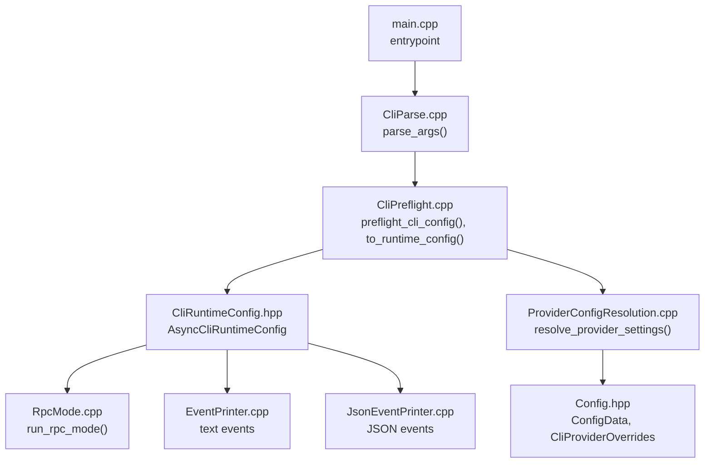
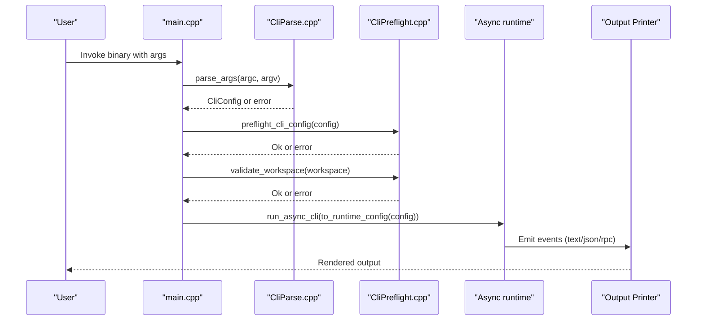
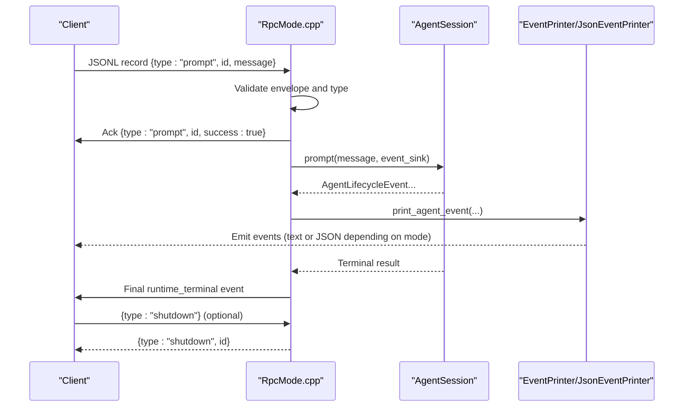
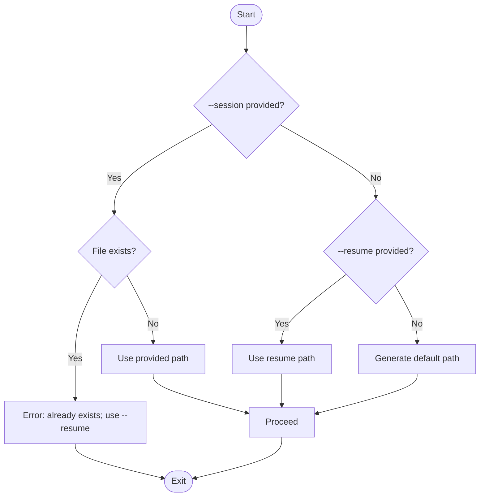
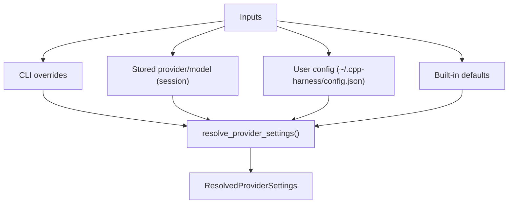
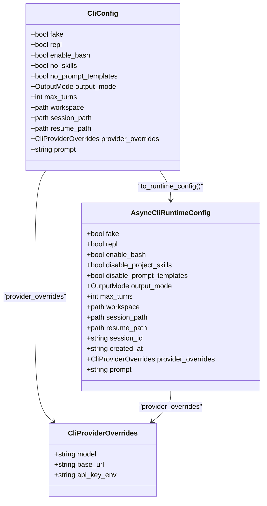

# CLI Interface

<cite>
**Referenced Files in This Document**
- [main.cpp](file://src/main.cpp)
- [CliParse.hpp](file://src/cli/CliParse.hpp)
- [CliParse.cpp](file://src/cli/CliParse.cpp)
- [CliPreflight.hpp](file://src/cli/CliPreflight.hpp)
- [CliPreflight.cpp](file://src/cli/CliPreflight.cpp)
- [CliConfig.hpp](file://src/cli/CliConfig.hpp)
- [CliRuntimeConfig.hpp](file://src/cli/CliRuntimeConfig.hpp)
- [Config.hpp](file://include/cch/coding_agent/Config.hpp)
- [ProviderConfigResolution.cpp](file://src/coding_agent/ProviderConfigResolution.cpp)
- [EventPrinter.cpp](file://src/coding_agent/runtime/EventPrinter.cpp)
- [JsonEventPrinter.cpp](file://src/coding_agent/runtime/JsonEventPrinter.cpp)
- [RpcMode.cpp](file://src/coding_agent/runtime/RpcMode.cpp)
- [RpcMode.hpp](file://src/coding_agent/runtime/RpcMode.hpp)
</cite>

## Table of Contents
1. [Introduction](#introduction)
2. [Project Structure](#project-structure)
3. [Core Components](#core-components)
4. [Architecture Overview](#architecture-overview)
5. [Detailed Component Analysis](#detailed-component-analysis)
6. [Dependency Analysis](#dependency-analysis)
7. [Performance Considerations](#performance-considerations)
8. [Troubleshooting Guide](#troubleshooting-guide)
9. [Conclusion](#conclusion)
10. [Appendices](#appendices)

## Introduction
This document describes the CLI interface of the coding-agent harness. It covers all command-line options and flags, their effects on runtime behavior, interaction modes (text, JSON, RPC), session management, provider configuration and precedence, slash-command processing, output formatting, and practical workflows. It also explains how CLI flags map to the underlying runtime configuration.

## Project Structure
The CLI pipeline is implemented in a small set of focused modules:
- Argument parsing and validation
- Preflight checks and workspace normalization
- Provider configuration resolution
- Runtime mode dispatch (text, JSON, RPC)
- Event printers for human-readable and machine-readable output

**Diagram sources**
- [main.cpp:7-32](file://src/main.cpp#L7-L32)
- [CliParse.cpp:64-176](file://src/cli/CliParse.cpp#L64-L176)
- [CliPreflight.cpp:65-115](file://src/cli/CliPreflight.cpp#L65-L115)
- [CliRuntimeConfig.hpp:18-36](file://src/cli/CliRuntimeConfig.hpp#L18-L36)
- [RpcMode.cpp:79-206](file://src/coding_agent/runtime/RpcMode.cpp#L79-L206)
- [EventPrinter.cpp:8-29](file://src/coding_agent/runtime/EventPrinter.cpp#L8-L29)
- [JsonEventPrinter.cpp:80-152](file://src/coding_agent/runtime/JsonEventPrinter.cpp#L80-L152)
- [ProviderConfigResolution.cpp:35-95](file://src/coding_agent/ProviderConfigResolution.cpp#L35-L95)
- [Config.hpp:15-50](file://include/cch/coding_agent/Config.hpp#L15-L50)

**Section sources**
- [main.cpp:7-32](file://src/main.cpp#L7-L32)
- [CliParse.cpp:64-176](file://src/cli/CliParse.cpp#L64-L176)
- [CliPreflight.cpp:65-115](file://src/cli/CliPreflight.cpp#L65-L115)
- [CliRuntimeConfig.hpp:18-36](file://src/cli/CliRuntimeConfig.hpp#L18-L36)
- [ProviderConfigResolution.cpp:35-95](file://src/coding_agent/ProviderConfigResolution.cpp#L35-L95)
- [Config.hpp:15-50](file://include/cch/coding_agent/Config.hpp#L15-L50)

## Core Components
- CLI argument parser: Defines all flags, validates constraints, and produces a structured configuration.
- Preflight validator: Ensures safe operation (workspace validity, API key presence for real providers).
- Runtime configuration builder: Converts CLI config into a runtime-ready structure.
- Output printers: Human-friendly text printer and machine-readable JSON printer.
- RPC mode: Reads JSONL records from stdin and writes responses to stdout.

Key configuration surfaces:
- OutputMode: text | json | rpc
- Provider overrides: model, base-url, api-key-env
- Session management: --session (new), --resume (append)
- Interaction: --repl (interactive prompts), --max-turns (limit)
- Safety and capabilities: --fake, --enable-bash, --no-skills, --no-prompt-templates, --prompt-template, --approve/--no-approve, --workspace

**Section sources**
- [CliParse.cpp:64-176](file://src/cli/CliParse.cpp#L64-L176)
- [CliPreflight.cpp:65-115](file://src/cli/CliPreflight.cpp#L65-L115)
- [CliConfig.hpp:12-30](file://src/cli/CliConfig.hpp#L12-L30)
- [CliRuntimeConfig.hpp:12-36](file://src/cli/CliRuntimeConfig.hpp#L12-L36)
- [EventPrinter.cpp:8-29](file://src/coding_agent/runtime/EventPrinter.cpp#L8-L29)
- [JsonEventPrinter.cpp:80-152](file://src/coding_agent/runtime/JsonEventPrinter.cpp#L80-L152)
- [RpcMode.cpp:79-206](file://src/coding_agent/runtime/RpcMode.cpp#L79-L206)

## Architecture Overview
The CLI orchestrates a simple pipeline: parse → validate → normalize → run. The runtime configuration drives the selected output mode and session behavior.

**Diagram sources**
- [main.cpp:7-32](file://src/main.cpp#L7-L32)
- [CliParse.cpp:64-176](file://src/cli/CliParse.cpp#L64-L176)
- [CliPreflight.cpp:65-115](file://src/cli/CliPreflight.cpp#L65-L115)

## Detailed Component Analysis

### Command-Line Options and Effects
- --fake
  - Effect: Use a deterministic fake provider (no network).
  - Impact: Skips API key checks; useful for demos and testing.
- --repl
  - Effect: Read prompts interactively until exit/quit.
  - Constraints: Cannot combine with --mode json or --mode rpc.
- --enable-bash
  - Effect: Allow model-requested bash commands.
  - Safety: Use with caution; implies elevated privileges.
- --approve / --no-approve
  - Effect: Trust project resources for this run (mutually exclusive).
  - Impact: Controls whether project skills/templates are enabled.
- --no-skills
  - Effect: Disable project-local skills for this run.
- --no-prompt-templates
  - Effect: Disable all prompt template loading.
- --prompt-template <path...>
  - Effect: Load a prompt template file or directory (repeatable).
- --workspace <path>
  - Effect: Set workspace boundary for tools; defaults to current working directory.
  - Validation: Must be an existing directory; normalized to canonical form.
- --session <path>
  - Effect: Create a new JSONL session at path.
  - Constraint: Cannot be combined with --resume.
- --resume <path>
  - Effect: Resume and append to an existing JSONL session.
  - Constraint: Cannot be combined with --session.
- --max-turns <N>
  - Effect: Maximum model turns per prompt (range 1..64).
- --model <name>
  - Effect: Provider model name override.
- --base-url <url>
  - Effect: OpenAI-compatible base URL override.
- --api-key-env <var>
  - Effect: Environment variable containing API key override.
- --mode <text|json|rpc>
  - Effect: Output mode selection.
  - Constraints: --mode json and --mode rpc cannot be combined with --repl; --mode rpc disallows positional prompt.
- prompt (positional)
  - Effect: Initial prompt text; required unless --repl is used.

Behavioral notes:
- Unknown options produce a normalized “unknown option” message.
- Conflicting flags produce specific error messages (e.g., “use either --session or --resume, not both”).

**Section sources**
- [CliParse.cpp:78-176](file://src/cli/CliParse.cpp#L78-L176)
- [CliParse.cpp:27-47](file://src/cli/CliParse.cpp#L27-L47)
- [CliPreflight.cpp:65-92](file://src/cli/CliPreflight.cpp#L65-L92)
- [CliPreflight.cpp:51-63](file://src/cli/CliPreflight.cpp#L51-L63)

### Interaction Modes

#### Text Mode (--mode text)
- Purpose: Human-readable semantic event printing.
- Output: Lines prefixed with semantic markers (e.g., [assistant], [tool-call], [completed]).
- Typical use: Quick inspection, debugging, interactive exploration.

**Section sources**
- [EventPrinter.cpp:8-29](file://src/coding_agent/runtime/EventPrinter.cpp#L8-L29)

#### JSON Mode (--mode json)
- Purpose: Machine-readable, compact event objects.
- Output: One JSON object per line (JSONL) representing lifecycle events and terminal outcomes.
- Constraints: Cannot be combined with --repl; useful for external integrations and automated processing.

**Section sources**
- [JsonEventPrinter.cpp:80-152](file://src/coding_agent/runtime/JsonEventPrinter.cpp#L80-L152)
- [CliParse.cpp:163-174](file://src/cli/CliParse.cpp#L163-L174)

#### RPC Mode (--mode rpc)
- Purpose: Persistent stdin/stdout command loop for external clients.
- Protocol: Reads JSONL records from stdin; writes response records to stdout.
- Supported commands:
  - get_state: Returns provider, model, sessionId, workspace, messageCount.
  - get_last_assistant_text: Returns last assistant text or null.
  - shutdown: Terminates the process.
  - prompt(message): Executes a prompt; emits events via the selected printer; responds with success or error.
- Constraints: No positional prompt; no --repl.

**Diagram sources**
- [RpcMode.cpp:79-206](file://src/coding_agent/runtime/RpcMode.cpp#L79-L206)
- [EventPrinter.cpp:8-29](file://src/coding_agent/runtime/EventPrinter.cpp#L8-L29)
- [JsonEventPrinter.cpp:80-152](file://src/coding_agent/runtime/JsonEventPrinter.cpp#L80-L152)

**Section sources**
- [CliParse.cpp:169-171](file://src/cli/CliParse.cpp#L169-L171)
- [RpcMode.cpp:79-206](file://src/coding_agent/runtime/RpcMode.cpp#L79-L206)
- [RpcMode.hpp:12-21](file://src/coding_agent/runtime/RpcMode.hpp#L12-L21)

### Session Management
- New session: --session <path>
  - Behavior: Creates a new JSONL session at the given path; if absent, a default path is generated.
  - Validation: Fails if the file already exists.
- Resume session: --resume <path>
  - Behavior: Appends to an existing JSONL session.
  - Constraints: Mutually exclusive with --session.
- Default session path generation:
  - Composed from current directory, a fixed sessions folder, timestamp with milliseconds, and a random suffix.

**Diagram sources**
- [CliPreflight.cpp:65-92](file://src/cli/CliPreflight.cpp#L65-L92)
- [CliPreflight.cpp:44-47](file://src/cli/CliPreflight.cpp#L44-L47)

**Section sources**
- [CliParse.cpp:96-99](file://src/cli/CliParse.cpp#L96-L99)
- [CliPreflight.cpp:65-92](file://src/cli/CliPreflight.cpp#L65-L92)
- [CliPreflight.cpp:44-47](file://src/cli/CliPreflight.cpp#L44-L47)

### Provider Configuration Flags and Precedence
Flags:
- --model <name>
- --base-url <url>
- --api-key-env <var>

Precedence (highest to lowest):
1. CLI explicit overrides
2. Session-stored provider/model
3. User config file (~/.cpp-harness/config.json)
4. Built-in defaults

Resolution specifics:
- Provider registry name is “openai-compatible” by default; overridden by stored provider when present.
- Model defaults: provider-specific fallbacks apply when not set.
- Base URL defaults to a public endpoint when not provided.
- API key environment variable chain is resolved from CLI or config; falls back to a default name.

**Diagram sources**
- [ProviderConfigResolution.cpp:35-95](file://src/coding_agent/ProviderConfigResolution.cpp#L35-L95)
- [Config.hpp:15-50](file://include/cch/coding_agent/Config.hpp#L15-L50)

**Section sources**
- [CliParse.cpp:137-145](file://src/cli/CliParse.cpp#L137-L145)
- [ProviderConfigResolution.cpp:35-95](file://src/coding_agent/ProviderConfigResolution.cpp#L35-L95)
- [Config.hpp:15-50](file://include/cch/coding_agent/Config.hpp#L15-L50)

### Slash Commands and Skill Invocation
Slash commands are processed by the runtime’s prompt processing pipeline. Supported commands include:
- /help
- /clear
- /compact
- /exit

Skill invocation syntax:
- /skill:name

These are interpreted by the prompt processor and may trigger actions such as clearing context, switching compact mode, or invoking a named skill. Their exact behavior depends on the active prompt processing pipeline and available skills.

**Section sources**
- [main.cpp:7-32](file://src/main.cpp#L7-L32)
- [CliParse.cpp:64-176](file://src/cli/CliParse.cpp#L64-L176)

### Output Formatting and Event Types
- Text mode:
  - Semantic prefixes indicate event categories (e.g., [assistant], [tool-call], [completed]).
  - Provides concise, human-friendly summaries of agent lifecycle events.
- JSON mode:
  - Emits structured records per event with schema version and sequence number.
  - Includes types such as agent_start, turn_start, message_update, tool_execution_start/end, turn_end, and runtime_terminal.
  - Certain internal events are omitted in JSON mode for clarity.

Interpretation tips:
- message_update with truncation indicates content was shortened to a bounded size.
- runtime_terminal signals completion with success flag and optional diagnostic message.

**Section sources**
- [EventPrinter.cpp:8-29](file://src/coding_agent/runtime/EventPrinter.cpp#L8-L29)
- [JsonEventPrinter.cpp:80-152](file://src/coding_agent/runtime/JsonEventPrinter.cpp#L80-L152)

### Practical Examples and Workflows
Note: Replace placeholders with your environment values.

- Text mode with new session and explicit model:
  - cpp-harness --session ./logs/my-run.jsonl --model gpt-4o-mini "Refactor the logger to use RAII"
- JSON mode for automation:
  - cpp-harness --mode json --workspace /path/to/project --prompt-template ./prompts "Implement feature X"
- RPC mode for external client:
  - echo '{"type":"prompt","id":"1","message":"Fix the build"}' | cpp-harness --mode rpc
  - Client reads JSONL from stdout; sends shutdown when done.
- Interactive REPL:
  - cpp-harness --repl --enable-bash
- Resume an existing session:
  - cpp-harness --resume ./logs/previous.jsonl "Continue from here"

Constraints reminder:
- --mode json and --mode rpc cannot be combined with --repl.
- --mode rpc requires reading prompts from stdin; do not pass a positional prompt.
- Do not combine --session and --resume.

**Section sources**
- [CliParse.cpp:163-174](file://src/cli/CliParse.cpp#L163-L174)
- [CliParse.cpp:96-99](file://src/cli/CliParse.cpp#L96-L99)
- [RpcMode.cpp:79-206](file://src/coding_agent/runtime/RpcMode.cpp#L79-L206)

## Dependency Analysis
The CLI configuration is transformed into a runtime configuration struct that controls behavior across modes and printers.

**Diagram sources**
- [CliConfig.hpp:12-30](file://src/cli/CliConfig.hpp#L12-L30)
- [CliRuntimeConfig.hpp:18-36](file://src/cli/CliRuntimeConfig.hpp#L18-L36)
- [Config.hpp:46-50](file://include/cch/coding_agent/Config.hpp#L46-L50)

**Section sources**
- [CliPreflight.cpp:94-115](file://src/cli/CliPreflight.cpp#L94-L115)
- [CliConfig.hpp:12-30](file://src/cli/CliConfig.hpp#L12-L30)
- [CliRuntimeConfig.hpp:18-36](file://src/cli/CliRuntimeConfig.hpp#L18-L36)
- [Config.hpp:46-50](file://include/cch/coding_agent/Config.hpp#L46-L50)

## Performance Considerations
- JSON mode reduces human overhead and is suitable for high-throughput automation.
- RPC mode enables decoupled clients and persistent sessions.
- Limiting --max-turns can reduce latency and cost under constrained conditions.
- Using --fake avoids network overhead for testing and demos.

## Troubleshooting Guide
Common issues and resolutions:
- Unknown option errors:
  - Normalize to “unknown option” messages; check spelling and supported flags.
- Conflicting flags:
  - “Use either --session or --resume, not both.”
  - “--mode json cannot be combined with --repl.”
  - “--mode rpc cannot be combined with --repl.”
  - “--mode rpc reads prompts from stdin; positional prompt is not allowed.”
- Missing prompt:
  - When not using --repl, a prompt is required.
- Workspace errors:
  - Ensure the workspace path exists and is a directory; it is normalized to a canonical path.
- API key missing:
  - For real providers, ensure the resolved API key environment variable is set before running.

**Section sources**
- [CliParse.cpp:27-47](file://src/cli/CliParse.cpp#L27-L47)
- [CliParse.cpp:163-174](file://src/cli/CliParse.cpp#L163-L174)
- [CliPreflight.cpp:51-63](file://src/cli/CliPreflight.cpp#L51-L63)
- [CliPreflight.cpp:86-91](file://src/cli/CliPreflight.cpp#L86-L91)

## Conclusion
The CLI provides a flexible, safety-aware interface for interacting with the coding agent. By combining session management, provider configuration, and output modes, users can tailor workflows from interactive exploration to automated processing and RPC-driven integrations.

## Appendices

### Appendix A: Provider Resolution Reference
- Provider registry name: openai-compatible (unless overridden by stored provider)
- Model defaults: provider-specific fallbacks
- Base URL defaults: public endpoint
- API key environment variable: CLI override, config chain, or default

**Section sources**
- [ProviderConfigResolution.cpp:35-95](file://src/coding_agent/ProviderConfigResolution.cpp#L35-L95)
- [Config.hpp:15-50](file://include/cch/coding_agent/Config.hpp#L15-L50)