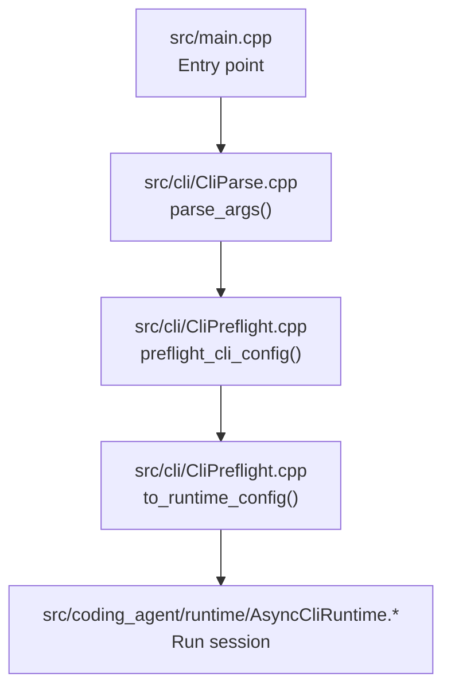
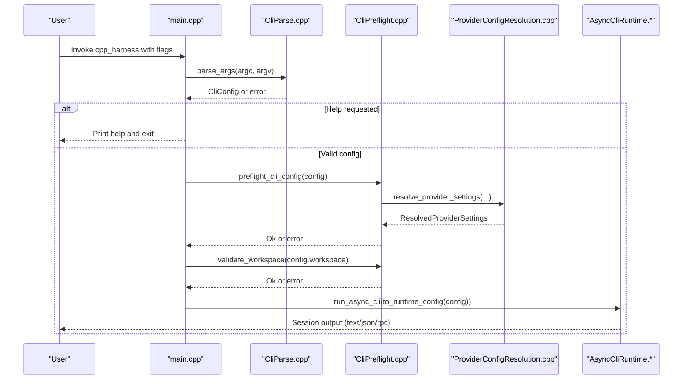
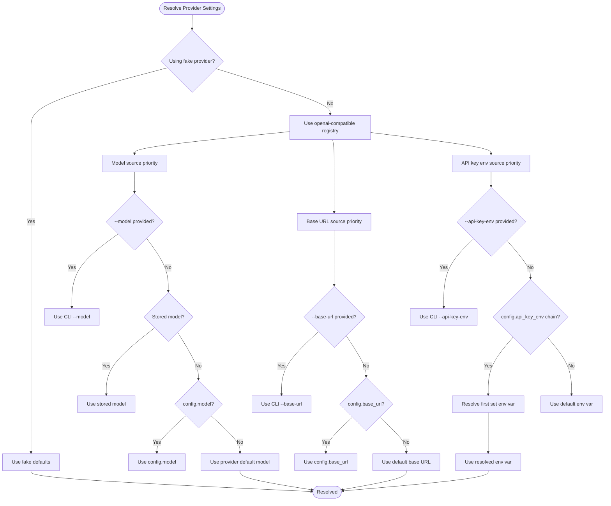
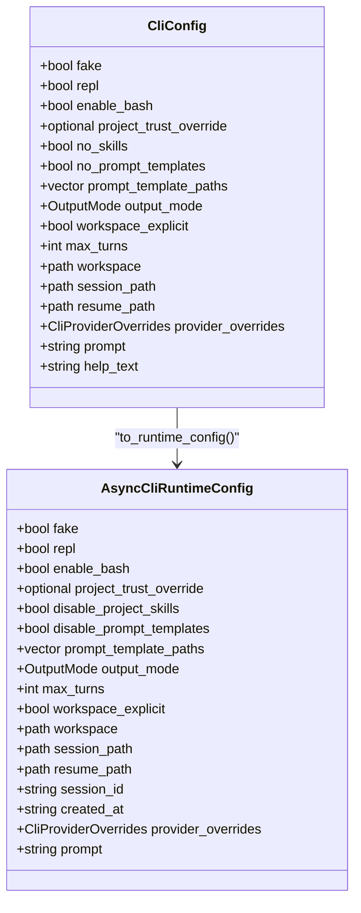
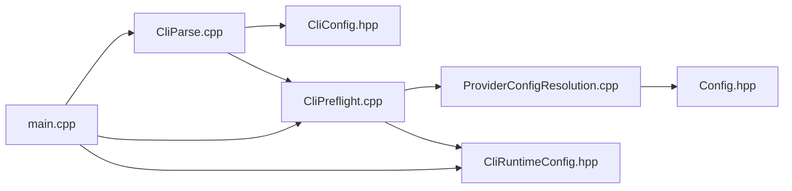

# Configuration Management

<cite>
**Referenced Files in This Document**
- [README.md](file://README.md)
- [src/main.cpp](file://src/main.cpp)
- [src/cli/CliParse.hpp](file://src/cli/CliParse.hpp)
- [src/cli/CliParse.cpp](file://src/cli/CliParse.cpp)
- [src/cli/CliPreflight.hpp](file://src/cli/CliPreflight.hpp)
- [src/cli/CliPreflight.cpp](file://src/cli/CliPreflight.cpp)
- [src/cli/CliConfig.hpp](file://src/cli/CliConfig.hpp)
- [src/cli/CliRuntimeConfig.hpp](file://src/cli/CliRuntimeConfig.hpp)
- [include/cch/coding_agent/Config.hpp](file://include/cch/coding_agent/Config.hpp)
- [src/coding_agent/ProviderConfigResolution.cpp](file://src/coding_agent/ProviderConfigResolution.cpp)
- [tests/cli/CliParseTest.cpp](file://tests/cli/CliParseTest.cpp)
- [tests/cli/CliSmokeTest.cpp](file://tests/cli/CliSmokeTest.cpp)
</cite>

## Table of Contents
1. [Introduction](#introduction)
2. [Project Structure](#project-structure)
3. [Core Components](#core-components)
4. [Architecture Overview](#architecture-overview)
5. [Detailed Component Analysis](#detailed-component-analysis)
6. [Dependency Analysis](#dependency-analysis)
7. [Performance Considerations](#performance-considerations)
8. [Troubleshooting Guide](#troubleshooting-guide)
9. [Conclusion](#conclusion)
10. [Appendices](#appendices)

## Introduction
This document explains CLI configuration management for the project, focusing on command-line flags, validation, error handling, and the relationship between CLI flags and runtime configuration resolution. It covers:
- Flags for session lifecycle: --session and --resume
- Boundary settings: --workspace
- Conversation limits: --max-turns
- Provider configuration flags: --model, --base-url, --api-key-env
- Flag precedence rules and provider configuration resolution
- Practical examples, invalid combination detection, and best practices for different deployment scenarios

## Project Structure
The CLI configuration pipeline spans several modules:
- Argument parsing and normalization
- Pre-flight validation and provider resolution
- Runtime configuration shaping for the agent loop

**Diagram sources**
- [src/main.cpp:7-32](file://src/main.cpp#L7-L32)
- [src/cli/CliParse.cpp:64-176](file://src/cli/CliParse.cpp#L64-L176)
- [src/cli/CliPreflight.cpp:65-115](file://src/cli/CliPreflight.cpp#L65-L115)

**Section sources**
- [src/main.cpp:7-32](file://src/main.cpp#L7-L32)
- [README.md:157-173](file://README.md#L157-L173)

## Core Components
- CliConfig: Holds parsed CLI flags and provider overrides, including session, workspace, max-turns, and provider settings.
- CliRuntimeConfig: Transient runtime configuration passed to the agent loop, including session identifiers and resolved provider settings.
- Provider configuration resolution: Combines CLI overrides, persisted session values, user config, and defaults.

Key responsibilities:
- Parse and validate flags, enforce mutually exclusive options, and normalize errors.
- Validate workspace, session paths, and provider API key presence for real-provider mode.
- Convert parsed CLI into runtime configuration with defaults and derived values.

**Section sources**
- [src/cli/CliConfig.hpp:12-30](file://src/cli/CliConfig.hpp#L12-L30)
- [src/cli/CliRuntimeConfig.hpp:18-36](file://src/cli/CliRuntimeConfig.hpp#L18-L36)
- [include/cch/coding_agent/Config.hpp:44-76](file://include/cch/coding_agent/Config.hpp#L44-L76)

## Architecture Overview
The CLI configuration flow:

**Diagram sources**
- [src/main.cpp:7-32](file://src/main.cpp#L7-L32)
- [src/cli/CliParse.cpp:64-176](file://src/cli/CliParse.cpp#L64-L176)
- [src/cli/CliPreflight.cpp:65-115](file://src/cli/CliPreflight.cpp#L65-L115)
- [src/coding_agent/ProviderConfigResolution.cpp:35-95](file://src/coding_agent/ProviderConfigResolution.cpp#L35-L95)

## Detailed Component Analysis

### CLI Flags and Validation
- --session <path>: Creates a new JSONL session at the given path. Enforced to not exist unless resuming.
- --resume <path>: Resumes and appends to an existing JSONL session. Mutually exclusive with --session.
- --workspace <path>: Sets the workspace boundary for tools. Defaults to current working directory; validated to be a directory.
- --max-turns <N>: Maximum model turns per prompt; validated to be within a range.
- --model <name>, --base-url <url>, --api-key-env <var>: Provider configuration flags. Only recorded when explicitly provided.
- --mode <text|json|rpc>: Output mode; enforced to be compatible with other flags.
- --repl: Interactive prompt loop; incompatible with certain modes.
- --fake: Use deterministic fake provider (no network).
- --enable-bash: Allow model-requested bash commands.
- --approve/-a and --no-approve: One-run project trust overrides.
- --no-skills and --no-prompt-templates: Disable project-local skills and prompt templates.

Validation highlights:
- Mutually exclusive: --session and --resume; --mode json cannot combine with --repl; --mode rpc cannot combine with --repl or accept positional prompt.
- Prompt requirement: A prompt is required unless --repl is used.
- Unknown options normalized to “unknown option” messages.
- Workspace must be an existing directory.

**Section sources**
- [src/cli/CliParse.cpp:78-176](file://src/cli/CliParse.cpp#L78-L176)
- [src/cli/CliParse.cpp:27-47](file://src/cli/CliParse.cpp#L27-L47)
- [src/cli/CliPreflight.cpp:51-63](file://src/cli/CliPreflight.cpp#L51-L63)
- [tests/cli/CliParseTest.cpp:54-103](file://tests/cli/CliParseTest.cpp#L54-L103)
- [tests/cli/CliSmokeTest.cpp:192-223](file://tests/cli/CliSmokeTest.cpp#L192-L223)
- [tests/cli/CliSmokeTest.cpp:519-537](file://tests/cli/CliSmokeTest.cpp#L519-L537)

### Provider Configuration Resolution
Provider settings are resolved in priority order:
1. CLI explicit overrides (when provided)
2. Session-stored provider/model (if resuming)
3. User config (~/.cpp-harness/config.json)
4. Built-in defaults

Specifically:
- Model: CLI --model > stored model > config.model > provider default
- Base URL: CLI --base-url > config.base_url > default
- API key environment: CLI --api-key-env > config.api_key_env chain > default
- Provider registry name: defaults to openai-compatible unless fake is used

Pre-flight validation ensures an API key is available for real-provider mode by resolving the chain and checking environment variables.

**Diagram sources**
- [src/coding_agent/ProviderConfigResolution.cpp:35-95](file://src/coding_agent/ProviderConfigResolution.cpp#L35-L95)
- [include/cch/coding_agent/Config.hpp:44-76](file://include/cch/coding_agent/Config.hpp#L44-L76)

**Section sources**
- [src/coding_agent/ProviderConfigResolution.cpp:35-95](file://src/coding_agent/ProviderConfigResolution.cpp#L35-L95)
- [src/cli/CliPreflight.cpp:79-91](file://src/cli/CliPreflight.cpp#L79-L91)
- [include/cch/coding_agent/Config.hpp:15-25](file://include/cch/coding_agent/Config.hpp#L15-L25)

### Relationship Between CLI Flags and Runtime Configuration
- Parsed CLI flags are transformed into AsyncCliRuntimeConfig, which includes:
  - Output mode, max turns, workspace, session paths, provider overrides, and prompt text
  - Derived values such as session_id and created_at timestamps
- The runtime configuration is passed to the agent loop for session creation or resumption.

**Diagram sources**
- [src/cli/CliConfig.hpp:12-30](file://src/cli/CliConfig.hpp#L12-L30)
- [src/cli/CliRuntimeConfig.hpp:18-36](file://src/cli/CliRuntimeConfig.hpp#L18-L36)
- [src/cli/CliPreflight.cpp:94-115](file://src/cli/CliPreflight.cpp#L94-L115)

**Section sources**
- [src/cli/CliPreflight.cpp:94-115](file://src/cli/CliPreflight.cpp#L94-L115)
- [src/cli/CliConfig.hpp:12-30](file://src/cli/CliConfig.hpp#L12-L30)
- [src/cli/CliRuntimeConfig.hpp:18-36](file://src/cli/CliRuntimeConfig.hpp#L18-L36)

### Flag Precedence Rules
- Session flags: --session and --resume are mutually exclusive. If neither is provided, a default session path is generated.
- Provider flags: When explicitly provided, --model, --base-url, and --api-key-env override any persisted or configured values.
- Workspace: --workspace sets workspace_explicit and overrides the default current working directory.
- Max turns: --max-turns overrides the default runtime value when provided.
- Output mode: --mode determines the output format; certain combinations are disallowed.
- Project trust: --approve/-a and --no-approve set project_trust_override; --no-skills disables project skills regardless of trust.

**Section sources**
- [src/cli/CliParse.cpp:96-101](file://src/cli/CliParse.cpp#L96-L101)
- [src/cli/CliParse.cpp:128-145](file://src/cli/CliParse.cpp#L128-L145)
- [src/cli/CliParse.cpp:152-160](file://src/cli/CliParse.cpp#L152-L160)
- [src/coding_agent/ProviderConfigResolution.cpp:41-95](file://src/coding_agent/ProviderConfigResolution.cpp#L41-L95)

### Validation Logic and Error Handling
- Parse-time errors are normalized and augmented with help text.
- Pre-flight checks:
  - Reject existing session path unless resuming.
  - For real-provider mode, ensure API key is available via resolved chain.
- Workspace validation enforces directory existence and normalizes the path.
- Mode compatibility checks prevent invalid combinations (e.g., --mode json with --repl).
- Exit codes:
  - Non-zero exit indicates validation or runtime error; startup errors go to stderr.

**Section sources**
- [src/cli/CliParse.cpp:110-122](file://src/cli/CliParse.cpp#L110-L122)
- [src/cli/CliPreflight.cpp:65-91](file://src/cli/CliPreflight.cpp#L65-L91)
- [src/cli/CliPreflight.cpp:51-63](file://src/cli/CliPreflight.cpp#L51-L63)

### Examples of Common Configuration Patterns
- One-shot with fake provider and explicit session:
  - Example invocation: [tests/cli/CliSmokeTest.cpp:152](file://tests/cli/CliSmokeTest.cpp#L152)
- JSON output with fake provider:
  - Example invocation: [tests/cli/CliSmokeTest.cpp:228](file://tests/cli/CliSmokeTest.cpp#L228)
- RPC mode with stdin commands:
  - Example invocation: [tests/cli/CliSmokeTest.cpp:300](file://tests/cli/CliSmokeTest.cpp#L300)
- Resume an existing session:
  - Example invocation: [tests/cli/CliSmokeTest.cpp:449](file://tests/cli/CliSmokeTest.cpp#L449)
- Kimi Code via OpenAI-compatible path:
  - Example invocation: [README.md:97-105](file://README.md#L97-L105)

Best practices:
- Always pass --base-url, --model, and --api-key-env together when using a non-default provider (e.g., Kimi).
- Prefer explicit flags for provider configuration to keep runtime context explicit when resuming sessions.
- Use --workspace to constrain tool access to a specific directory.
- Use --max-turns to bound long-running loops.

**Section sources**
- [tests/cli/CliSmokeTest.cpp:149-171](file://tests/cli/CliSmokeTest.cpp#L149-L171)
- [tests/cli/CliSmokeTest.cpp:225-248](file://tests/cli/CliSmokeTest.cpp#L225-L248)
- [tests/cli/CliSmokeTest.cpp:292-328](file://tests/cli/CliSmokeTest.cpp#L292-L328)
- [tests/cli/CliSmokeTest.cpp:443-453](file://tests/cli/CliSmokeTest.cpp#L443-L453)
- [README.md:93-113](file://README.md#L93-L113)

## Dependency Analysis
The CLI configuration depends on:
- CLI parsing library for flag definition and validation
- Provider configuration resolution for precedence and defaults
- Config loader for user configuration and API key chain resolution
- Runtime configuration builder for session creation/resumption

**Diagram sources**
- [src/cli/CliParse.cpp:64-176](file://src/cli/CliParse.cpp#L64-L176)
- [src/cli/CliPreflight.cpp:65-115](file://src/cli/CliPreflight.cpp#L65-L115)
- [src/coding_agent/ProviderConfigResolution.cpp:35-95](file://src/coding_agent/ProviderConfigResolution.cpp#L35-L95)
- [include/cch/coding_agent/Config.hpp:28-42](file://include/cch/coding_agent/Config.hpp#L28-L42)
- [src/main.cpp:7-32](file://src/main.cpp#L7-L32)

**Section sources**
- [src/cli/CliParse.cpp:64-176](file://src/cli/CliParse.cpp#L64-L176)
- [src/cli/CliPreflight.cpp:65-115](file://src/cli/CliPreflight.cpp#L65-L115)
- [src/coding_agent/ProviderConfigResolution.cpp:35-95](file://src/coding_agent/ProviderConfigResolution.cpp#L35-L95)
- [include/cch/coding_agent/Config.hpp:28-42](file://include/cch/coding_agent/Config.hpp#L28-L42)
- [src/main.cpp:7-32](file://src/main.cpp#L7-L32)

## Performance Considerations
- CLI parsing and preflight checks are lightweight and occur before session creation.
- Provider resolution is O(1) with constant-time lookups and minimal allocations.
- Workspace validation performs a single filesystem check; ensure paths are not excessively deep to avoid traversal overhead.
- JSON/RPC modes emit compact JSONL; consider buffering and flushing strategies in high-throughput scenarios.

## Troubleshooting Guide
Common issues and resolutions:
- Invalid combination errors:
  - “use either --session or --resume, not both”: Provide only one of --session or --resume.
  - “--mode json cannot be combined with --repl”: Use --mode text or remove --repl.
  - “--mode rpc cannot be combined with --repl”: Remove --repl.
  - “--mode rpc reads prompts from stdin; positional prompt is not allowed”: Remove positional prompt when using --mode rpc.
  - “prompt is required unless --repl is used”: Provide a prompt or use --repl.
- Unknown option:
  - “unknown option: …”: Verify flag spelling and availability in the current binary.
- Existing session path:
  - “session file already exists; use --resume to append”: Use --resume with the existing path.
- Missing API key:
  - “missing API key; set <env> before real-provider mode”: Export the environment variable or pass --api-key-env.
- Workspace validation:
  - “invalid workspace path”: Ensure the path exists and is a directory.
- Max turns:
  - “--max-turns” or “Could not parse”: Provide an integer within the accepted range.

**Section sources**
- [src/cli/CliParse.cpp:110-122](file://src/cli/CliParse.cpp#L110-L122)
- [src/cli/CliPreflight.cpp:65-91](file://src/cli/CliPreflight.cpp#L65-L91)
- [src/cli/CliPreflight.cpp:51-57](file://src/cli/CliPreflight.cpp#L51-L57)
- [tests/cli/CliParseTest.cpp:70-76](file://tests/cli/CliParseTest.cpp#L70-L76)
- [tests/cli/CliSmokeTest.cpp:192-223](file://tests/cli/CliSmokeTest.cpp#L192-L223)
- [tests/cli/CliSmokeTest.cpp:519-537](file://tests/cli/CliSmokeTest.cpp#L519-L537)
- [tests/cli/CliSmokeTest.cpp:585-593](file://tests/cli/CliSmokeTest.cpp#L585-L593)

## Conclusion
The CLI configuration system provides a robust, validated, and predictable way to control session lifecycle, workspace boundaries, conversation limits, and provider settings. By understanding flag precedence and validation rules, users can reliably configure the harness for diverse deployment scenarios, from local development to provider-specific integrations like Kimi Code.

## Appendices

### Appendix A: Flag Reference
- --session <path>: Create a new JSONL session at path
- --resume <path>: Resume and append to an existing JSONL session
- --workspace <path>: Set workspace boundary for tools
- --max-turns <N>: Maximum model turns per prompt
- --model <name>: Provider model name
- --base-url <url>: OpenAI-compatible base URL
- --api-key-env <var>: Environment variable containing API key
- --mode <text|json|rpc>: Output mode
- --repl: Interactive prompt loop
- --fake: Use deterministic fake provider
- --enable-bash: Allow model-requested bash commands
- --approve/-a: Trust project resources for this run
- --no-approve: Do not trust project resources for this run
- --no-skills: Disable project-local skills for this run
- --no-prompt-templates: Disable all prompt template loading
- --prompt-template <path>: Load a prompt template file or directory (repeatable)

**Section sources**
- [src/cli/CliParse.cpp:78-108](file://src/cli/CliParse.cpp#L78-L108)
- [src/cli/CliParse.cpp:128-145](file://src/cli/CliParse.cpp#L128-L145)
- [src/cli/CliParse.cpp:152-160](file://src/cli/CliParse.cpp#L152-L160)