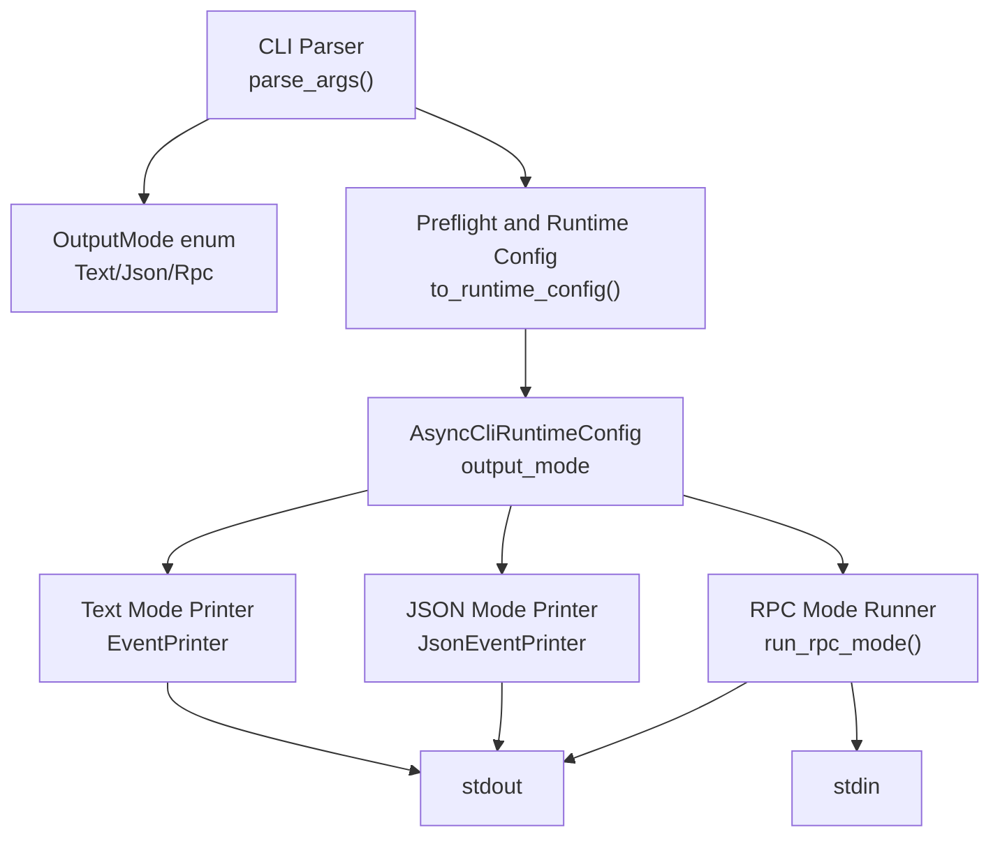
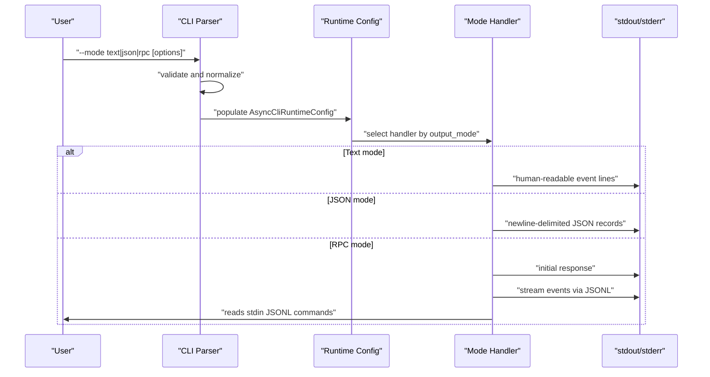
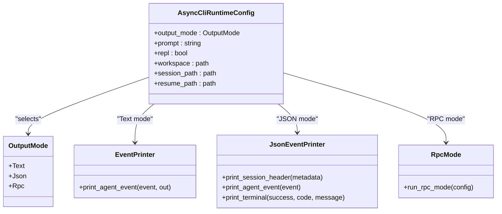

# Interaction Modes

<cite>
**Referenced Files in This Document**
- [CliParse.cpp](file://src/cli/CliParse.cpp)
- [CliParse.hpp](file://src/cli/CliParse.hpp)
- [CliRuntimeConfig.hpp](file://src/cli/CliRuntimeConfig.hpp)
- [CliPreflight.cpp](file://src/cli/CliPreflight.cpp)
- [CliPreflight.hpp](file://src/cli/CliPreflight.hpp)
- [EventPrinter.cpp](file://src/coding_agent/runtime/EventPrinter.cpp)
- [EventPrinter.hpp](file://src/coding_agent/runtime/EventPrinter.hpp)
- [JsonEventPrinter.cpp](file://src/coding_agent/runtime/JsonEventPrinter.cpp)
- [JsonEventPrinter.hpp](file://src/coding_agent/runtime/JsonEventPrinter.hpp)
- [RpcMode.cpp](file://src/coding_agent/runtime/RpcMode.cpp)
- [RpcMode.hpp](file://src/coding_agent/runtime/RpcMode.hpp)
</cite>

## Table of Contents
1. [Introduction](#introduction)
2. [Project Structure](#project-structure)
3. [Core Components](#core-components)
4. [Architecture Overview](#architecture-overview)
5. [Detailed Component Analysis](#detailed-component-analysis)
6. [Dependency Analysis](#dependency-analysis)
7. [Performance Considerations](#performance-considerations)
8. [Troubleshooting Guide](#troubleshooting-guide)
9. [Conclusion](#conclusion)

## Introduction
This document explains the CLI interaction modes that control how the agent emits events during a run: text mode, JSON mode, and RPC mode. It describes the behavioral differences among these modes, including event formatting, output structure, and typical use cases. It also clarifies how each mode affects event emission, tool execution feedback, and session persistence, and provides practical examples of equivalent operations across modes.

## Project Structure
The CLI parsing and runtime configuration define the interaction mode. The runtime components implement the actual output behavior for each mode.

**Diagram sources**
- [CliParse.cpp:64-176](file://src/cli/CliParse.cpp#L64-L176)
- [CliRuntimeConfig.hpp:12-36](file://src/cli/CliRuntimeConfig.hpp#L12-L36)
- [CliPreflight.cpp:94-115](file://src/cli/CliPreflight.cpp#L94-L115)
- [EventPrinter.cpp:8-29](file://src/coding_agent/runtime/EventPrinter.cpp#L8-L29)
- [JsonEventPrinter.cpp:53-152](file://src/coding_agent/runtime/JsonEventPrinter.cpp#L53-L152)
- [RpcMode.cpp:79-206](file://src/coding_agent/runtime/RpcMode.cpp#L79-L206)

**Section sources**
- [CliParse.cpp:64-176](file://src/cli/CliParse.cpp#L64-L176)
- [CliRuntimeConfig.hpp:12-36](file://src/cli/CliRuntimeConfig.hpp#L12-L36)
- [CliPreflight.cpp:94-115](file://src/cli/CliPreflight.cpp#L94-L115)

## Core Components
- OutputMode enumeration defines the three interaction modes: Text, Json, and Rpc.
- CLI parsing validates mode selection and enforces constraints (e.g., REPL cannot be combined with JSON or RPC modes; RPC mode requires stdin prompts).
- Runtime configuration carries the selected mode and related flags.
- Mode-specific printers and runners emit or process events according to the chosen mode.

Key responsibilities:
- Text mode prints human-readable event summaries to stdout.
- JSON mode streams structured, newline-delimited records to stdout.
- RPC mode runs a persistent stdin/stdout command loop, responding to JSONL envelopes with success/error responses.

**Section sources**
- [CliRuntimeConfig.hpp:12-16](file://src/cli/CliRuntimeConfig.hpp#L12-L16)
- [CliParse.cpp:49-60](file://src/cli/CliParse.cpp#L49-L60)
- [CliParse.cpp:163-174](file://src/cli/CliParse.cpp#L163-L174)
- [CliPreflight.cpp:94-115](file://src/cli/CliPreflight.cpp#L94-L115)

## Architecture Overview
The CLI determines the mode and passes configuration to the runtime. The runtime selects the appropriate emitter or runner.

**Diagram sources**
- [CliParse.cpp:64-176](file://src/cli/CliParse.cpp#L64-L176)
- [CliPreflight.cpp:94-115](file://src/cli/CliPreflight.cpp#L94-L115)
- [EventPrinter.cpp:8-29](file://src/coding_agent/runtime/EventPrinter.cpp#L8-L29)
- [JsonEventPrinter.cpp:53-152](file://src/coding_agent/runtime/JsonEventPrinter.cpp#L53-L152)
- [RpcMode.cpp:79-206](file://src/coding_agent/runtime/RpcMode.cpp#L79-L206)

## Detailed Component Analysis

### Text Mode
Behavior:
- Emits concise, human-readable event lines to stdout.
- Suitable for interactive inspection and debugging.
- Does not emit terminal records; completion or error status is printed as a summary line.

Typical outputs:
- Model request turn indicators.
- Assistant message deltas streamed as they arrive.
- Tool execution start/end with success or error markers.
- Final completion or provider error summary.

Use cases:
- Interactive development sessions where readability is prioritized.
- Quick verification of agent behavior without external tooling.

Practical example:
- Equivalent operation: run a single prompt and observe formatted lines indicating turns, streaming assistant text, and tool execution outcomes.

How it affects event emission and feedback:
- Emission is line-based and optimized for scanning.
- No JSON serialization overhead; output is flushed as events occur.

**Section sources**
- [EventPrinter.cpp:8-29](file://src/coding_agent/runtime/EventPrinter.cpp#L8-L29)
- [CliParse.cpp:163-174](file://src/cli/CliParse.cpp#L163-L174)

### JSON Mode
Behavior:
- Streams newline-delimited JSON records to stdout.
- Records include a sequence number and schema version; some event types are omitted in early versions.
- Emits a session header record, followed by lifecycle events, and a terminal record upon completion.

Record characteristics:
- Each record is a JSON object on its own line.
- Common fields include type, schemaVersion, and seq.
- Some internal or unsupported event variants are intentionally skipped.

Use cases:
- Automation pipelines, log aggregation, and post-run analysis.
- Integrating with external systems that consume structured logs.

Practical example:
- Equivalent operation: run a single prompt and capture stdout to process each JSON line with a downstream consumer.

How it affects event emission and feedback:
- Emission is compact and machine-parseable.
- Terminal status is emitted as a dedicated record, enabling consumers to detect completion deterministically.

**Section sources**
- [JsonEventPrinter.cpp:53-152](file://src/coding_agent/runtime/JsonEventPrinter.cpp#L53-L152)
- [CliParse.cpp:163-174](file://src/cli/CliParse.cpp#L163-L174)

### RPC Mode
Behavior:
- Runs a persistent stdin/stdout loop that expects JSONL command envelopes.
- Supported commands include prompt, get_state, get_last_assistant_text, and shutdown.
- Responds to each command with a JSONL envelope containing id, type, and result/error.

Command flow:
- The client sends a JSON object with type and id.
- The server responds immediately with a success envelope acknowledging receipt.
- Events are streamed to stdout as JSON records during processing.
- Completion is signaled by a terminal record; the process exits nonzero on failure.

Use cases:
- Embedding the agent in another program or language via a simple protocol.
- Long-running sessions where the host controls prompts and state.

Practical example:
- Equivalent operation: pipe a series of JSONL commands to the process’s stdin and read responses from stdout, interleaved with event records.

How it affects event emission and feedback:
- Events are emitted as JSON records during command execution.
- The host controls when prompts are issued; the agent streams updates until completion.
- Failure conditions are surfaced via terminal records and nonzero exit codes.

**Section sources**
- [RpcMode.cpp:79-206](file://src/coding_agent/runtime/RpcMode.cpp#L79-L206)
- [CliParse.cpp:166-171](file://src/cli/CliParse.cpp#L166-L171)

### Mode Selection and Constraints
- Mode selection is validated by the CLI parser.
- Certain combinations are disallowed:
  - REPL cannot be used with JSON or RPC modes.
  - RPC mode cannot accept a positional prompt; it reads from stdin.
  - Non-RPC modes require a prompt unless REPL is enabled.

These constraints ensure that each mode operates predictably within its intended workflow.

**Section sources**
- [CliParse.cpp:163-174](file://src/cli/CliParse.cpp#L163-L174)

## Dependency Analysis
The runtime configuration drives which emitter or runner is used. The emitters depend on the agent event type definitions and produce mode-appropriate output.

**Diagram sources**
- [CliRuntimeConfig.hpp:12-36](file://src/cli/CliRuntimeConfig.hpp#L12-L36)
- [EventPrinter.cpp:8-29](file://src/coding_agent/runtime/EventPrinter.cpp#L8-L29)
- [JsonEventPrinter.cpp:53-152](file://src/coding_agent/runtime/JsonEventPrinter.cpp#L53-L152)
- [RpcMode.cpp:79-206](file://src/coding_agent/runtime/RpcMode.cpp#L79-L206)

**Section sources**
- [CliRuntimeConfig.hpp:12-36](file://src/cli/CliRuntimeConfig.hpp#L12-L36)
- [EventPrinter.cpp:8-29](file://src/coding_agent/runtime/EventPrinter.cpp#L8-L29)
- [JsonEventPrinter.cpp:53-152](file://src/coding_agent/runtime/JsonEventPrinter.cpp#L53-L152)
- [RpcMode.cpp:79-206](file://src/coding_agent/runtime/RpcMode.cpp#L79-L206)

## Performance Considerations
- Text mode minimizes overhead by writing short, formatted lines as events occur.
- JSON mode writes newline-delimited records with minimal indentation; it includes a small header and terminal record at session boundaries.
- RPC mode writes responses immediately upon receiving commands and flushes after each response, ensuring low latency for interactive hosts.
- All modes flush or write promptly to maintain responsiveness during long-running sessions.

[No sources needed since this section provides general guidance]

## Troubleshooting Guide
Common issues and resolutions:
- Unsupported mode combination:
  - Using REPL with JSON or RPC mode is rejected by the CLI parser.
  - RPC mode cannot accept a positional prompt; remove the prompt argument when using RPC mode.
- Missing prompt:
  - Non-RPC, non-REPL runs require a prompt; supply one or enable REPL.
- Output not appearing:
  - In RPC mode, ensure the host sends a proper JSONL envelope with type and id; empty or malformed lines trigger error responses.
- Nonzero exit:
  - RPC mode exits with nonzero status when a command fails; check the terminal record emitted before exit.

**Section sources**
- [CliParse.cpp:163-174](file://src/cli/CliParse.cpp#L163-L174)
- [RpcMode.cpp:82-126](file://src/coding_agent/runtime/RpcMode.cpp#L82-L126)

## Conclusion
- Choose text mode for quick, readable inspection of agent behavior.
- Choose JSON mode for automation and structured logging.
- Choose RPC mode for embedding the agent in another system via a simple stdin/stdout protocol.
- Respect the CLI constraints to ensure predictable behavior across modes.

[No sources needed since this section summarizes without analyzing specific files]