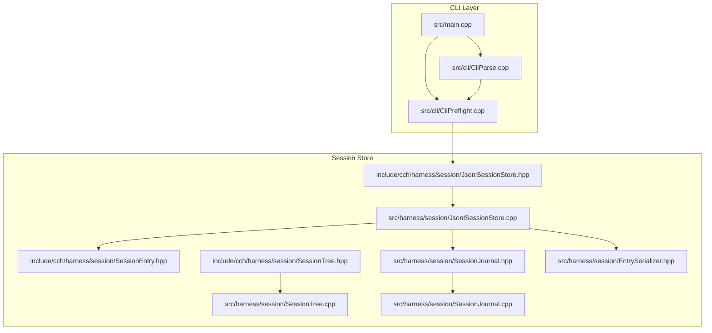
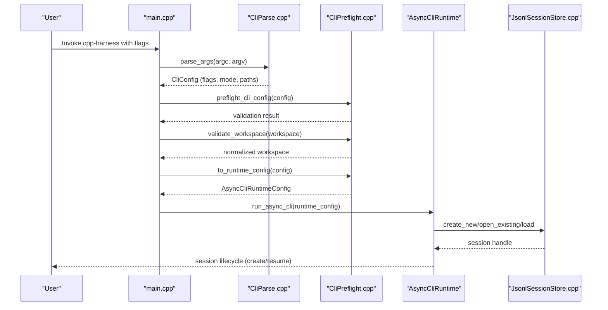
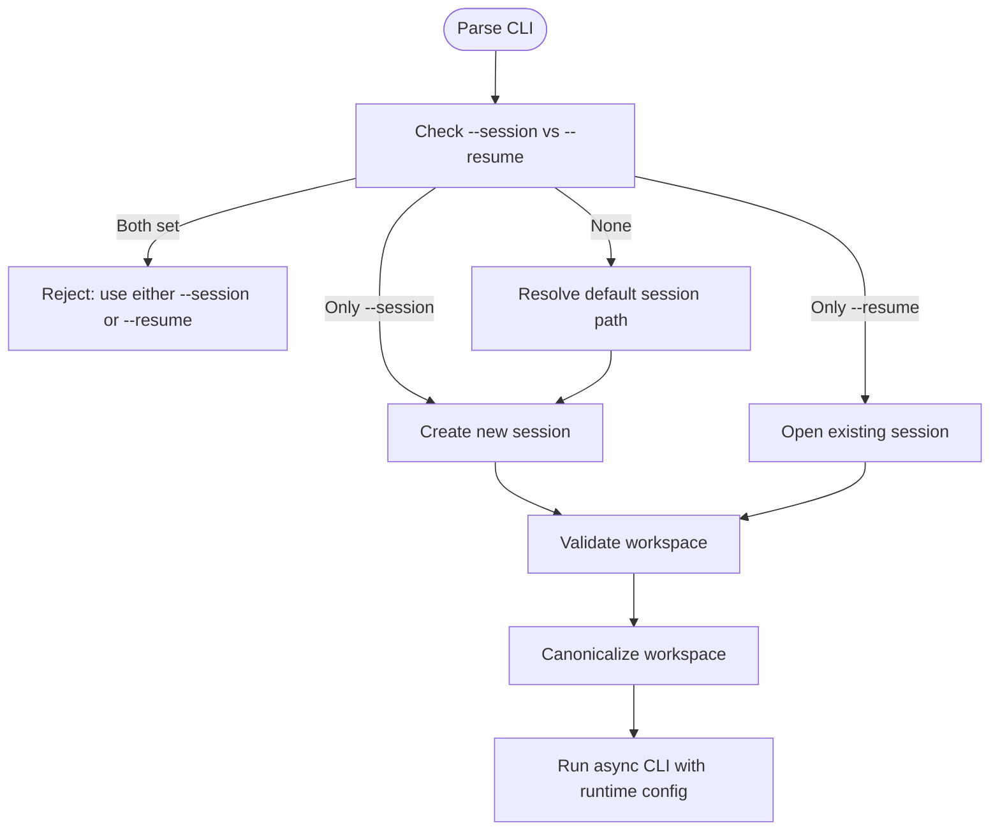
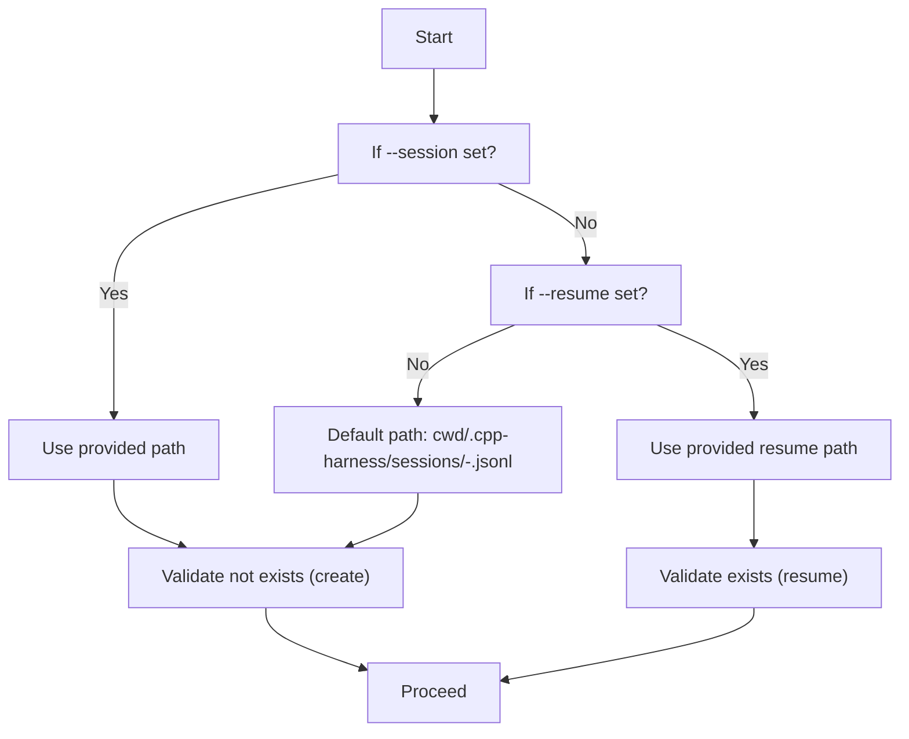
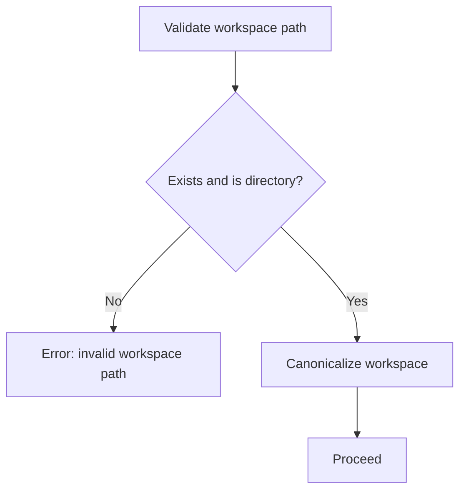
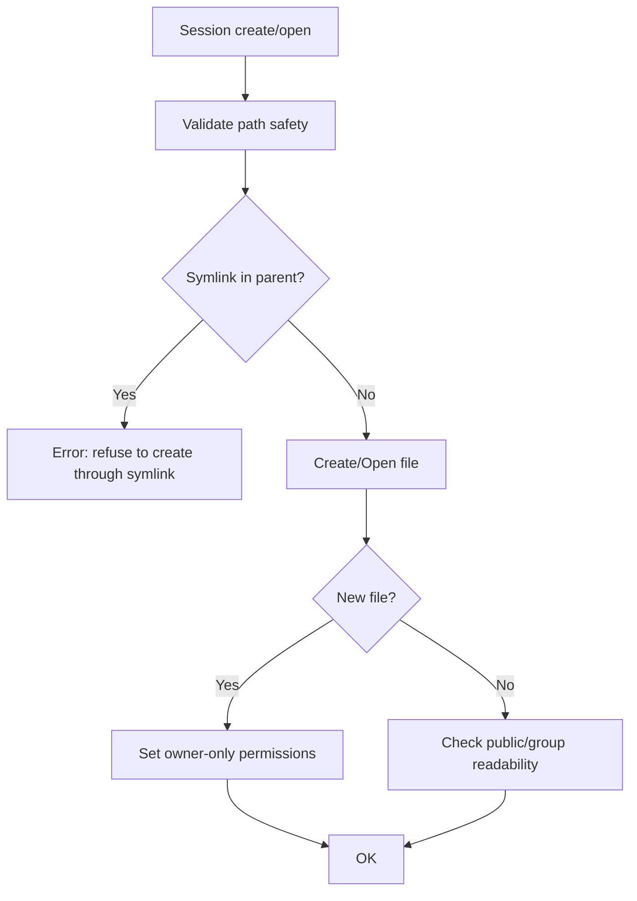
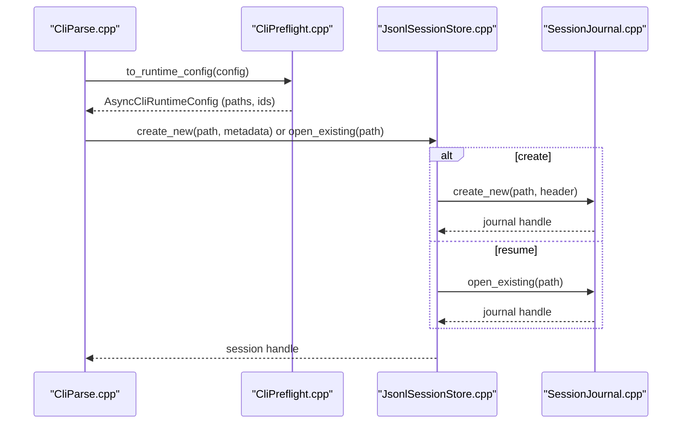
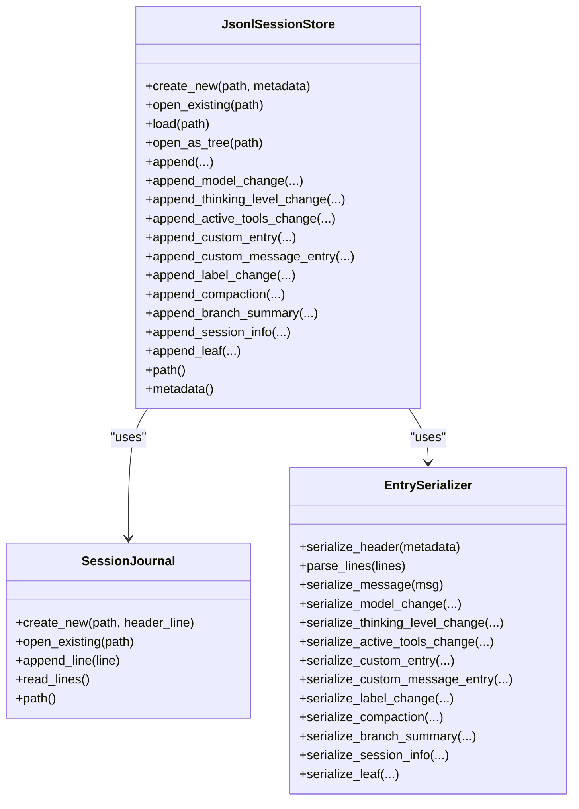
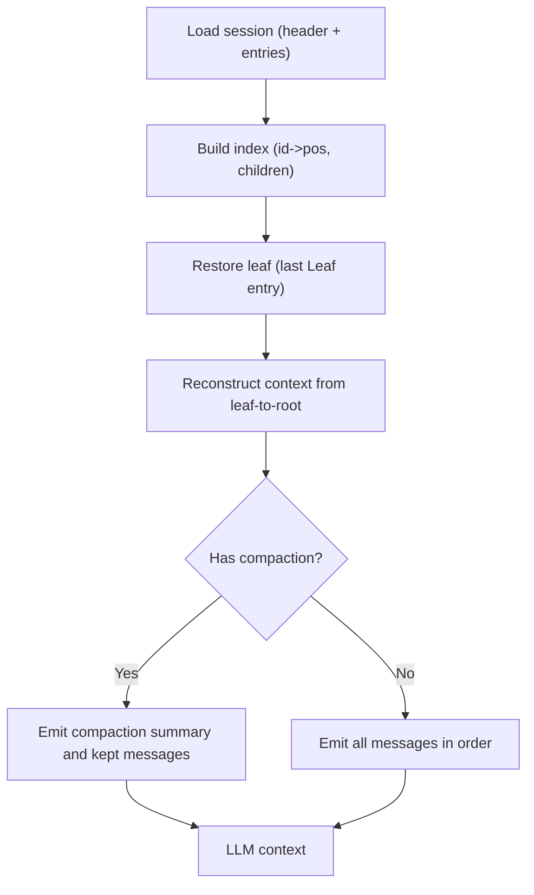
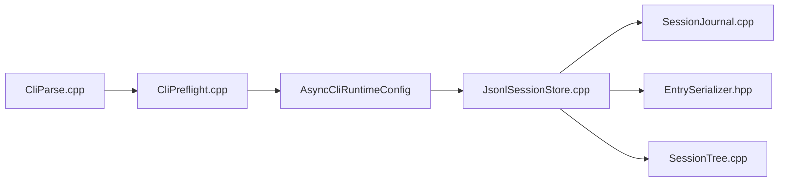

# Session Management

<cite>
**Referenced Files in This Document**
- [main.cpp](file://src/main.cpp)
- [CliParse.cpp](file://src/cli/CliParse.cpp)
- [CliPreflight.cpp](file://src/cli/CliPreflight.cpp)
- [JsonlSessionStore.hpp](file://include/cch/harness/session/JsonlSessionStore.hpp)
- [JsonlSessionStore.cpp](file://src/harness/session/JsonlSessionStore.cpp)
- [SessionEntry.hpp](file://include/cch/harness/session/SessionEntry.hpp)
- [SessionTree.hpp](file://include/cch/harness/session/SessionTree.hpp)
- [SessionTree.cpp](file://src/harness/session/SessionTree.cpp)
- [SessionJournal.hpp](file://src/harness/session/SessionJournal.hpp)
- [SessionJournal.cpp](file://src/harness/session/SessionJournal.cpp)
- [EntrySerializer.hpp](file://src/harness/session/EntrySerializer.hpp)
- [CliSmokeTest.cpp](file://tests/cli/CliSmokeTest.cpp)
</cite>

## Table of Contents
1. [Introduction](#introduction)
2. [Project Structure](#project-structure)
3. [Core Components](#core-components)
4. [Architecture Overview](#architecture-overview)
5. [Detailed Component Analysis](#detailed-component-analysis)
6. [Dependency Analysis](#dependency-analysis)
7. [Performance Considerations](#performance-considerations)
8. [Troubleshooting Guide](#troubleshooting-guide)
9. [Conclusion](#conclusion)
10. [Appendices](#appendices)

## Introduction
This document explains the CLI session management capabilities of the project, focusing on how sessions are created, continued, and managed through the command-line interface. It covers:
- CLI flags for session creation (--session) and continuation (--resume)
- Session path resolution and workspace boundary enforcement
- Session validation and safety rules
- The relationship between CLI flags and session store operations
- JSONL file handling and metadata management
- Practical workflows, troubleshooting, and best practices

## Project Structure
The session management feature spans CLI parsing, runtime configuration, and the session store subsystem:
- CLI parsing and preflight live under src/cli
- The session store and tree APIs live under include/cch/harness/session and src/harness/session
- The main entry point orchestrates parsing, validation, and runtime startup

**Diagram sources**
- [main.cpp:1-33](file://src/main.cpp#L1-L33)
- [CliParse.cpp:64-176](file://src/cli/CliParse.cpp#L64-L176)
- [CliPreflight.cpp:65-115](file://src/cli/CliPreflight.cpp#L65-L115)
- [JsonlSessionStore.hpp:18-79](file://include/cch/harness/session/JsonlSessionStore.hpp#L18-L79)
- [JsonlSessionStore.cpp:50-112](file://src/harness/session/JsonlSessionStore.cpp#L50-L112)
- [SessionEntry.hpp:13-52](file://include/cch/harness/session/SessionEntry.hpp#L13-L52)
- [SessionTree.hpp:34-145](file://include/cch/harness/session/SessionTree.hpp#L34-L145)
- [SessionTree.cpp:12-25](file://src/harness/session/SessionTree.cpp#L12-L25)
- [SessionJournal.hpp:18-48](file://src/harness/session/SessionJournal.hpp#L18-L48)
- [SessionJournal.cpp:99-150](file://src/harness/session/SessionJournal.cpp#L99-L150)
- [EntrySerializer.hpp:18-78](file://src/harness/session/EntrySerializer.hpp#L18-L78)

**Section sources**
- [main.cpp:1-33](file://src/main.cpp#L1-L33)
- [CliParse.cpp:64-176](file://src/cli/CliParse.cpp#L64-L176)
- [CliPreflight.cpp:65-115](file://src/cli/CliPreflight.cpp#L65-L115)

## Core Components
- CLI argument parsing defines --session and --resume flags and enforces mutual exclusivity. It also validates mode and prompt constraints.
- Preflight resolves default session paths, validates workspace boundaries, and ensures API keys are present for real-provider modes.
- The session store manages JSONL-backed session journals, serializes typed entries, and exposes tree navigation for context reconstruction.
- Safety rules enforce owner-only permissions, reject symlinks, and prevent unsafe directory traversals.

Key responsibilities:
- CLI flags: --session (create), --resume (append), --workspace (boundary), --mode (text/json/rpc), --repl, and others
- Session path resolution: default location under workspace with timestamped filenames; explicit override via --session or --resume
- Validation: mutual exclusivity of --session and --resume; workspace existence and normalization; API key presence for non-fake runs
- Store operations: create_new/open_existing/load/open_as_tree; append_* methods for typed entries; leaf navigation and branch summaries

**Section sources**
- [CliParse.cpp:96-99](file://src/cli/CliParse.cpp#L96-L99)
- [CliParse.cpp:162-175](file://src/cli/CliParse.cpp#L162-L175)
- [CliPreflight.cpp:44-47](file://src/cli/CliPreflight.cpp#L44-L47)
- [CliPreflight.cpp:51-63](file://src/cli/CliPreflight.cpp#L51-L63)
- [CliPreflight.cpp:65-92](file://src/cli/CliPreflight.cpp#L65-L92)
- [JsonlSessionStore.hpp:27-32](file://include/cch/harness/session/JsonlSessionStore.hpp#L27-L32)
- [JsonlSessionStore.cpp:50-89](file://src/harness/session/JsonlSessionStore.cpp#L50-L89)
- [SessionJournal.cpp:106-131](file://src/harness/session/SessionJournal.cpp#L106-L131)
- [SessionJournal.cpp:243-257](file://src/harness/session/SessionJournal.cpp#L243-L257)

## Architecture Overview
The CLI orchestrates session lifecycle through a clear pipeline: parse flags, validate configuration, resolve workspace and session paths, then hand off to the async runtime which uses the session store.

**Diagram sources**
- [main.cpp:7-31](file://src/main.cpp#L7-L31)
- [CliParse.cpp:64-176](file://src/cli/CliParse.cpp#L64-L176)
- [CliPreflight.cpp:65-115](file://src/cli/CliPreflight.cpp#L65-L115)
- [JsonlSessionStore.cpp:50-112](file://src/harness/session/JsonlSessionStore.cpp#L50-L112)

## Detailed Component Analysis

### CLI Flags and Lifecycle Control
- --session: Creates a new session file at the specified path or a default path under the workspace. Enforced mutually exclusive with --resume.
- --resume: Opens an existing session file for appending. Enforced mutually exclusive with --session.
- --workspace: Sets the workspace boundary; validated and canonicalized early in startup.
- Mode constraints: --mode json and --mode rpc cannot be combined with --repl; --mode rpc requires reading prompts from stdin rather than positional arguments.

**Diagram sources**
- [CliParse.cpp:96-99](file://src/cli/CliParse.cpp#L96-L99)
- [CliParse.cpp:162-175](file://src/cli/CliParse.cpp#L162-L175)
- [CliPreflight.cpp:44-47](file://src/cli/CliPreflight.cpp#L44-L47)
- [CliPreflight.cpp:59-63](file://src/cli/CliPreflight.cpp#L59-L63)

**Section sources**
- [CliParse.cpp:96-99](file://src/cli/CliParse.cpp#L96-L99)
- [CliParse.cpp:162-175](file://src/cli/CliParse.cpp#L162-L175)
- [CliPreflight.cpp:44-47](file://src/cli/CliPreflight.cpp#L44-L47)
- [CliPreflight.cpp:59-63](file://src/cli/CliPreflight.cpp#L59-L63)

### Session Path Resolution and Defaults
- Default session path: under the current working directory, inside a .cpp-harness/sessions folder, named with a timestamp and random suffix ending in .jsonl.
- Explicit --session or --resume overrides default behavior; preflight prevents creating a session that already exists unless resuming.

**Diagram sources**
- [CliPreflight.cpp:44-47](file://src/cli/CliPreflight.cpp#L44-L47)
- [CliPreflight.cpp:108-114](file://src/cli/CliPreflight.cpp#L108-L114)
- [CliPreflight.cpp:67-69](file://src/cli/CliPreflight.cpp#L67-L69)

**Section sources**
- [CliPreflight.cpp:44-47](file://src/cli/CliPreflight.cpp#L44-L47)
- [CliPreflight.cpp:67-69](file://src/cli/CliPreflight.cpp#L67-L69)
- [CliPreflight.cpp:108-114](file://src/cli/CliPreflight.cpp#L108-L114)

### Workspace Boundary Enforcement
- Workspace must exist and be a directory; otherwise, startup fails early.
- Canonicalization normalizes the path to a weakly canonical form, falling back to lexically normalized if canonicalization fails.

**Diagram sources**
- [CliPreflight.cpp:51-57](file://src/cli/CliPreflight.cpp#L51-L57)
- [CliPreflight.cpp:59-63](file://src/cli/CliPreflight.cpp#L59-L63)

**Section sources**
- [CliPreflight.cpp:51-57](file://src/cli/CliPreflight.cpp#L51-L57)
- [CliPreflight.cpp:59-63](file://src/cli/CliPreflight.cpp#L59-L63)

### Session Validation and Safety Rules
- Session creation:
  - Rejects existing files; use --resume to append.
  - Enforces owner-only permissions on new files.
  - Prohibits creating through symlinked parent paths.
- Session opening:
  - Validates path safety and permissions.
- API key checks:
  - For non-fake runs, ensures API key environment is resolvable.

**Diagram sources**
- [SessionJournal.cpp:106-131](file://src/harness/session/SessionJournal.cpp#L106-L131)
- [SessionJournal.cpp:137-150](file://src/harness/session/SessionJournal.cpp#L137-L150)
- [SessionJournal.cpp:243-257](file://src/harness/session/SessionJournal.cpp#L243-L257)
- [SessionJournal.cpp:259-293](file://src/harness/session/SessionJournal.cpp#L259-L293)

**Section sources**
- [SessionJournal.cpp:106-131](file://src/harness/session/SessionJournal.cpp#L106-L131)
- [SessionJournal.cpp:137-150](file://src/harness/session/SessionJournal.cpp#L137-L150)
- [SessionJournal.cpp:243-257](file://src/harness/session/SessionJournal.cpp#L243-L257)
- [SessionJournal.cpp:259-293](file://src/harness/session/SessionJournal.cpp#L259-L293)

### Relationship Between CLI Flags and Session Store Operations
- --session triggers JsonlSessionStore::create_new with metadata derived from runtime config.
- --resume triggers JsonlSessionStore::open_existing or load, then opens the session journal for appending.
- The store writes typed entries (messages, model changes, thinking level changes, active tools, custom entries, labels, compacted summaries, branch summaries, session info, leaf markers) via SessionJournal.

**Diagram sources**
- [CliPreflight.cpp:94-115](file://src/cli/CliPreflight.cpp#L94-L115)
- [JsonlSessionStore.cpp:50-89](file://src/harness/session/JsonlSessionStore.cpp#L50-L89)
- [SessionJournal.cpp:99-150](file://src/harness/session/SessionJournal.cpp#L99-L150)

**Section sources**
- [CliPreflight.cpp:94-115](file://src/cli/CliPreflight.cpp#L94-L115)
- [JsonlSessionStore.cpp:50-89](file://src/harness/session/JsonlSessionStore.cpp#L50-L89)
- [SessionJournal.cpp:99-150](file://src/harness/session/SessionJournal.cpp#L99-L150)

### JSONL File Handling and Metadata Management
- Header line encodes SessionMetadata (session_id, created_at, workspace, provider, model).
- Typed entries are serialized via EntrySerializer and appended as JSONL lines.
- SessionTree reconstructs context from the active leaf, handling compaction and branch summaries.

**Diagram sources**
- [JsonlSessionStore.hpp:18-79](file://include/cch/harness/session/JsonlSessionStore.hpp#L18-L79)
- [JsonlSessionStore.cpp:50-310](file://src/harness/session/JsonlSessionStore.cpp#L50-L310)
- [SessionJournal.hpp:18-48](file://src/harness/session/SessionJournal.hpp#L18-L48)
- [EntrySerializer.hpp:18-78](file://src/harness/session/EntrySerializer.hpp#L18-L78)

**Section sources**
- [JsonlSessionStore.hpp:18-79](file://include/cch/harness/session/JsonlSessionStore.hpp#L18-L79)
- [JsonlSessionStore.cpp:50-112](file://src/harness/session/JsonlSessionStore.cpp#L50-L112)
- [SessionEntry.hpp:13-52](file://include/cch/harness/session/SessionEntry.hpp#L13-L52)
- [EntrySerializer.hpp:18-78](file://src/harness/session/EntrySerializer.hpp#L18-L78)

### Session Tree Navigation and Context Reconstruction
- SessionTree builds indices and inferred parent relationships for O(1) lookups and efficient traversal.
- It supports branching, collecting branches, and building a chronological context for the LLM, including model/thinking-level state and compaction-aware message emission.

**Diagram sources**
- [SessionTree.cpp:12-25](file://src/harness/session/SessionTree.cpp#L12-L25)
- [SessionTree.cpp:93-115](file://src/harness/session/SessionTree.cpp#L93-L115)
- [SessionTree.cpp:176-273](file://src/harness/session/SessionTree.cpp#L176-L273)

**Section sources**
- [SessionTree.hpp:34-145](file://include/cch/harness/session/SessionTree.hpp#L34-L145)
- [SessionTree.cpp:12-25](file://src/harness/session/SessionTree.cpp#L12-L25)
- [SessionTree.cpp:93-115](file://src/harness/session/SessionTree.cpp#L93-L115)
- [SessionTree.cpp:176-273](file://src/harness/session/SessionTree.cpp#L176-L273)

## Dependency Analysis
- CLI depends on:
  - CliParse for flag parsing and validation
  - CliPreflight for workspace validation, default path resolution, and runtime config conversion
- Runtime receives AsyncCliRuntimeConfig with session paths and IDs
- Session store depends on:
  - SessionJournal for safe file I/O
  - EntrySerializer for typed serialization
  - SessionTree for navigation and context reconstruction

**Diagram sources**
- [CliParse.cpp:64-176](file://src/cli/CliParse.cpp#L64-L176)
- [CliPreflight.cpp:94-115](file://src/cli/CliPreflight.cpp#L94-L115)
- [JsonlSessionStore.cpp:50-112](file://src/harness/session/JsonlSessionStore.cpp#L50-L112)
- [SessionJournal.cpp:99-150](file://src/harness/session/SessionJournal.cpp#L99-L150)
- [EntrySerializer.hpp:18-78](file://src/harness/session/EntrySerializer.hpp#L18-L78)
- [SessionTree.cpp:12-25](file://src/harness/session/SessionTree.cpp#L12-L25)

**Section sources**
- [CliParse.cpp:64-176](file://src/cli/CliParse.cpp#L64-L176)
- [CliPreflight.cpp:94-115](file://src/cli/CliPreflight.cpp#L94-L115)
- [JsonlSessionStore.cpp:50-112](file://src/harness/session/JsonlSessionStore.cpp#L50-L112)

## Performance Considerations
- Append-only JSONL writes minimize contention; fsync ensures durability on Unix-like systems.
- SessionTree indexing enables O(1) lookups and efficient traversal, reducing overhead during context reconstruction.
- Avoid excessive branching and compaction events to keep context reconstruction linear in the number of retained entries.

## Troubleshooting Guide
Common issues and resolutions:
- Using --session and --resume together:
  - Symptom: Immediate rejection with a message indicating mutual exclusivity.
  - Cause: CLI enforces mutual exclusivity between --session and --resume.
  - Fix: Choose one flag per run.
  - Evidence: [CliParse.cpp:31-33](file://src/cli/CliParse.cpp#L31-L33), [CliSmokeTest.cpp:519-527](file://tests/cli/CliSmokeTest.cpp#L519-L527)
- Attempting to create a session that already exists:
  - Symptom: Error instructing to use --resume to append.
  - Cause: Session creation rejects existing files.
  - Fix: Use --resume with the existing path or remove the file.
  - Evidence: [CliPreflight.cpp:67-69](file://src/cli/CliPreflight.cpp#L67-L69), [SessionJournal.cpp:119-121](file://src/harness/session/SessionJournal.cpp#L119-L121)
- Resume workspace mismatch:
  - Symptom: Non-zero exit with a message about workspace mismatch.
  - Cause: Resuming a session whose metadata workspace differs from the current workspace.
  - Fix: Use the same workspace as recorded in the session metadata.
  - Evidence: [CliSmokeTest.cpp:503-517](file://tests/cli/CliSmokeTest.cpp#L503-L517)
- Mode and REPL conflicts:
  - Symptom: Error when combining --mode json/rpc with --repl or using positional prompt with --mode rpc.
  - Cause: CLI enforces mode constraints.
  - Fix: Remove conflicting flags or adjust mode.
  - Evidence: [CliParse.cpp:163-171](file://src/cli/CliParse.cpp#L163-L171)
- Missing API key for real-provider mode:
  - Symptom: Error requiring an API key environment variable.
  - Cause: Preflight checks for API key presence when not using --fake.
  - Fix: Set the appropriate environment variable or use --fake.
  - Evidence: [CliPreflight.cpp:79-91](file://src/cli/CliPreflight.cpp#L79-L91)

**Section sources**
- [CliParse.cpp:31-33](file://src/cli/CliParse.cpp#L31-L33)
- [CliParse.cpp:163-171](file://src/cli/CliParse.cpp#L163-L171)
- [CliPreflight.cpp:67-69](file://src/cli/CliPreflight.cpp#L67-L69)
- [CliPreflight.cpp:79-91](file://src/cli/CliPreflight.cpp#L79-L91)
- [SessionJournal.cpp:119-121](file://src/harness/session/SessionJournal.cpp#L119-L121)
- [CliSmokeTest.cpp:503-517](file://tests/cli/CliSmokeTest.cpp#L503-L517)
- [CliSmokeTest.cpp:519-527](file://tests/cli/CliSmokeTest.cpp#L519-L527)

## Conclusion
The CLI session management system provides a robust, secure, and extensible foundation for capturing and navigating conversational transcripts. By enforcing strict validation and safety rules, leveraging typed JSONL entries, and offering powerful tree navigation, it supports both simple one-off runs and complex exploratory workflows with branching and context reconstruction.

## Appendices

### Example Workflows
- Create a new session with a custom path:
  - Use --session with a .jsonl filename; the system validates the path and sets owner-only permissions.
  - Reference: [CliPreflight.cpp:108-114](file://src/cli/CliPreflight.cpp#L108-L114), [SessionJournal.cpp:106-131](file://src/harness/session/SessionJournal.cpp#L106-L131)
- Resume an existing session:
  - Use --resume with the same .jsonl file; the system opens it safely and appends new entries.
  - Reference: [SessionJournal.cpp:137-150](file://src/harness/session/SessionJournal.cpp#L137-L150)
- Switch branches and summarize:
  - Use SessionTree to navigate and optionally generate branch summaries via branchWithSummary.
  - Reference: [SessionTree.hpp:118-124](file://include/cch/harness/session/SessionTree.hpp#L118-L124), [SessionTree.cpp:311-372](file://src/harness/session/SessionTree.cpp#L311-L372)

### Best Practices
- Keep sessions organized under a dedicated workspace boundary.
- Prefer default session paths for quick runs; specify --session only when explicit control is needed.
- Avoid mixing --session and --resume; choose the appropriate flag per run.
- For long exploratory sessions, leverage SessionTree to branch and summarize to maintain clarity.
- Ensure API keys are configured for non-fake runs; otherwise, use --fake for local testing.