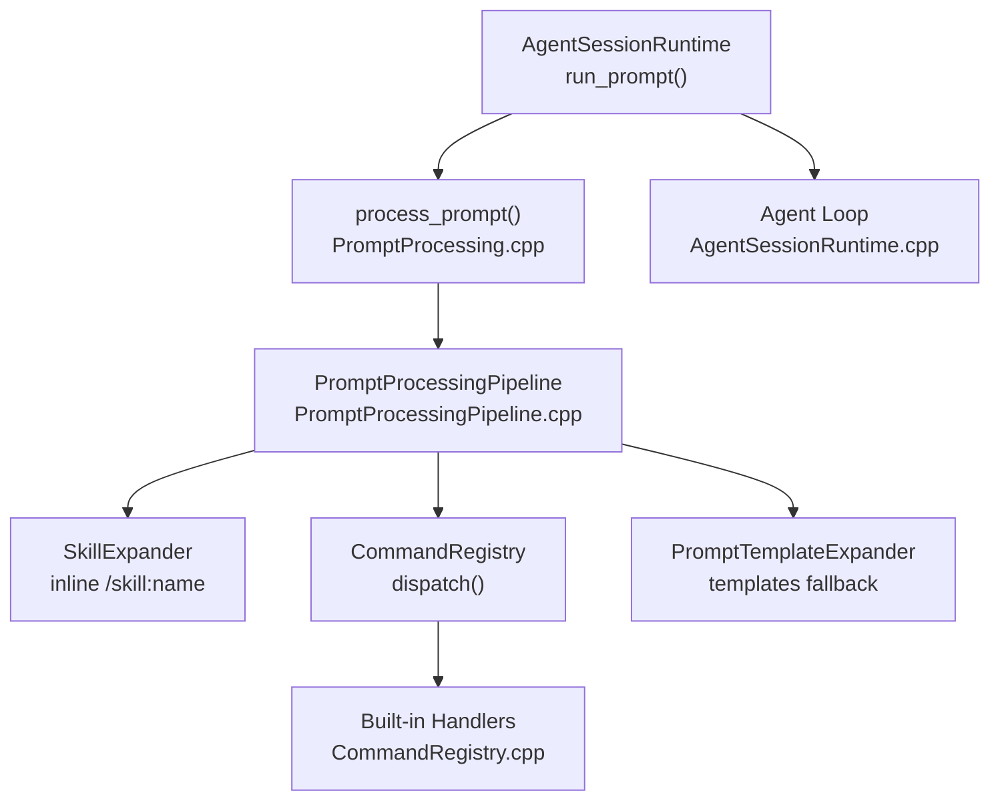
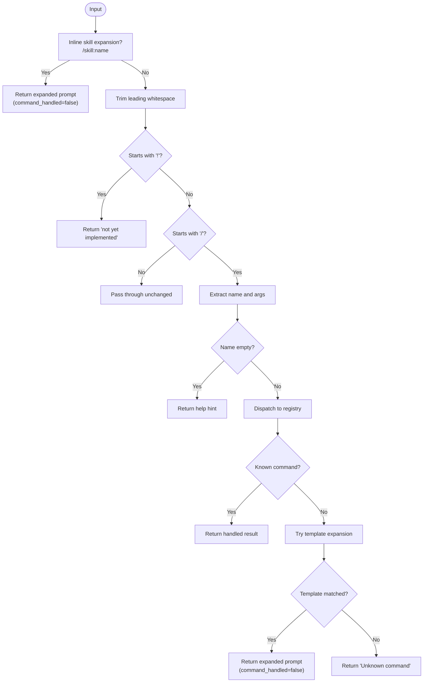
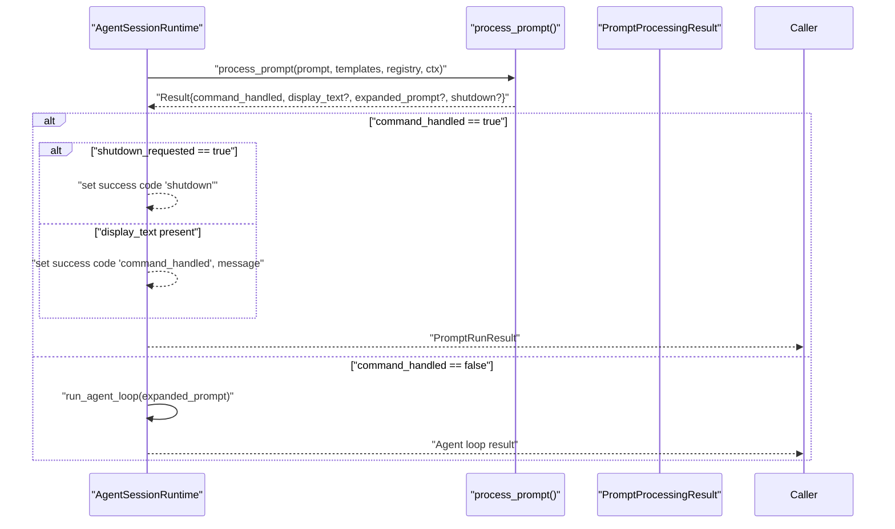
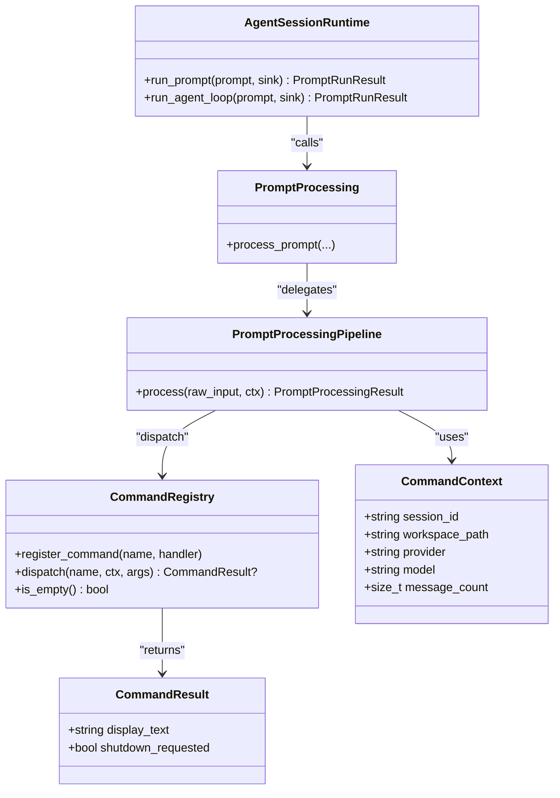

# Slash Commands

<cite>
**Referenced Files in This Document**
- [AgentSessionRuntime.cpp](file://src/coding_agent/runtime/AgentSessionRuntime.cpp)
- [PromptProcessing.hpp](file://include/cch/coding_agent/PromptProcessing.hpp)
- [PromptProcessing.cpp](file://src/coding_agent/PromptProcessing.cpp)
- [PromptProcessingPipeline.hpp](file://include/cch/coding_agent/PromptProcessingPipeline.hpp)
- [PromptProcessingPipeline.cpp](file://src/coding_agent/PromptProcessingPipeline.cpp)
- [CommandRegistry.hpp](file://include/cch/coding_agent/CommandRegistry.hpp)
- [CommandRegistry.cpp](file://src/coding_agent/CommandRegistry.cpp)
- [BuiltinCommandsTest.cpp](file://tests/coding_agent/BuiltinCommandsTest.cpp)
- [README.md](file://README.md)
</cite>

## Table of Contents
1. [Introduction](#introduction)
2. [Project Structure](#project-structure)
3. [Core Components](#core-components)
4. [Architecture Overview](#architecture-overview)
5. [Detailed Component Analysis](#detailed-component-analysis)
6. [Dependency Analysis](#dependency-analysis)
7. [Performance Considerations](#performance-considerations)
8. [Troubleshooting Guide](#troubleshooting-guide)
9. [Conclusion](#conclusion)

## Introduction
This document explains slash command functionality in the coding agent harness. It covers built-in slash commands, the /skill:name invocation syntax, and how slash commands are parsed, validated, and executed within the agent loop. It also documents command precedence, error handling, and security considerations, and shows how slash commands integrate with the broader CLI workflow.

## Project Structure
Slash command processing is implemented in the coding agent runtime layer and integrates with the agent loop. The key files are:
- Prompt processing orchestration and public APIs
- Command registry and built-in command handlers
- Agent session runtime that invokes prompt processing and decides whether to run the agent loop



**Diagram sources**
- [AgentSessionRuntime.cpp:93-162](file://src/coding_agent/runtime/AgentSessionRuntime.cpp#L93-L162)
- [PromptProcessing.cpp:31-58](file://src/coding_agent/PromptProcessing.cpp#L31-L58)
- [PromptProcessingPipeline.cpp:46-106](file://src/coding_agent/PromptProcessingPipeline.cpp#L46-L106)
- [CommandRegistry.cpp:18-52](file://src/coding_agent/CommandRegistry.cpp#L18-L52)

**Section sources**
- [AgentSessionRuntime.cpp:93-162](file://src/coding_agent/runtime/AgentSessionRuntime.cpp#L93-L162)
- [PromptProcessing.hpp:43-59](file://include/cch/coding_agent/PromptProcessing.hpp#L43-L59)
- [PromptProcessing.cpp:31-58](file://src/coding_agent/PromptProcessing.cpp#L31-L58)
- [PromptProcessingPipeline.hpp:26-42](file://include/cch/coding_agent/PromptProcessingPipeline.hpp#L26-L42)
- [PromptProcessingPipeline.cpp:46-106](file://src/coding_agent/PromptProcessingPipeline.cpp#L46-L106)
- [CommandRegistry.hpp:36-65](file://include/cch/coding_agent/CommandRegistry.hpp#L36-L65)
- [CommandRegistry.cpp:18-52](file://src/coding_agent/CommandRegistry.cpp#L18-L52)

## Core Components
- PromptProcessingResult: Result type indicating whether a command was handled, optional display text, optional shutdown request, and the prompt to pass to the agent loop.
- CommandContext: Provides session metadata (IDs, provider, model, message count) to command handlers.
- CommandRegistry: Map-based registry of command name → handler, enabling scalable command addition.
- PromptProcessingPipeline: Orchestrates skill expansion, command detection/dispatch, and template expansion in order.
- Built-in commands: Implemented as lambda handlers registered into the registry.

Key behaviors:
- /skill:name is expanded inline before command dispatch.
- Slash commands are detected by leading "/" and dispatched to the registry.
- Unknown commands fall back to template expansion; otherwise, they are reported as unknown.
- Shell passthrough (!) is detected and returns a deferred message.

**Section sources**
- [PromptProcessingPipeline.hpp:12-22](file://include/cch/coding_agent/PromptProcessingPipeline.hpp#L12-L22)
- [CommandRegistry.hpp:11-34](file://include/cch/coding_agent/CommandRegistry.hpp#L11-L34)
- [CommandRegistry.cpp:18-52](file://src/coding_agent/CommandRegistry.cpp#L18-L52)
- [PromptProcessingPipeline.cpp:46-106](file://src/coding_agent/PromptProcessingPipeline.cpp#L46-L106)

## Architecture Overview
Slash command processing occurs before the agent loop in the REPL mode. The runtime:
- Expands skills inline if present
- Processes the prompt through the pipeline
- If a command is handled, returns immediately without invoking the agent loop
- If not handled, runs the agent loop with the resulting prompt

```mermaid
sequenceDiagram
participant User as "User"
participant Runtime as "AgentSessionRuntime"
participant Proc as "process_prompt()"
participant Pipe as "PromptProcessingPipeline"
participant Reg as "CommandRegistry"
participant Loop as "Agent Loop"
User->>Runtime : "run_prompt(prompt)"
Runtime->>Proc : "process_prompt(prompt, templates, registry, ctx)"
Proc->>Pipe : "pipeline.process(raw_input, ctx)"
alt "/skill : name present"
Pipe->>Pipe : "inline skill expansion"
Pipe-->>Proc : "expanded prompt"
Proc-->>Runtime : "command_handled=false, expanded_prompt"
Runtime->>Runtime : "skip agent loop"
Runtime-->>User : "return with expanded prompt"
else "slash command"
Pipe->>Reg : "dispatch(name, ctx, args)"
alt "known command"
Reg-->>Pipe : "CommandResult"
Pipe-->>Proc : "command_handled=true, display_text, shutdown?"
Proc-->>Runtime : "command_handled=true"
Runtime->>Runtime : "handle shutdown or display"
Runtime-->>User : "return handled result"
else "unknown command"
Pipe->>Pipe : "try template expansion"
alt "template matched"
Pipe-->>Proc : "command_handled=false, expanded prompt"
Proc-->>Runtime : "command_handled=false"
Runtime->>Loop : "run_agent_loop(expanded_prompt)"
Loop-->>Runtime : "loop result"
Runtime-->>User : "return loop result"
else "no template"
Pipe-->>Proc : "command_handled=true, error text"
Proc-->>Runtime : "command_handled=true"
Runtime-->>User : "return handled error"
end
end
end
```

**Diagram sources**
- [AgentSessionRuntime.cpp:93-162](file://src/coding_agent/runtime/AgentSessionRuntime.cpp#L93-L162)
- [PromptProcessing.cpp:31-58](file://src/coding_agent/PromptProcessing.cpp#L31-L58)
- [PromptProcessingPipeline.cpp:46-106](file://src/coding_agent/PromptProcessingPipeline.cpp#L46-L106)
- [CommandRegistry.cpp:18-52](file://src/coding_agent/CommandRegistry.cpp#L18-L52)

## Detailed Component Analysis

### Slash Command Syntax and Invocation Patterns
- Slash commands: Start with "/", followed by a command name and optional arguments. The pipeline extracts the name and arguments, trims whitespace, and dispatches to the registry.
- Skill invocation: /skill:name [arguments]. The pipeline expands this inline before command dispatch. If the skill is not found, the input is passed through unchanged.
- Shell passthrough: Lines starting with "!" are detected and return a deferred message indicating not yet implemented.

Examples of usage patterns:
- /session: Print current session metadata.
- /quit: Request shutdown.
- /new: Instruction to start a new session.
- /resume <session-id>: Instruction to resume a session with the given ID.
- /skill:name [instructions]: Inline expansion to a skill’s content with optional additional instructions.

Precedence:
1. Inline skill expansion (/skill:name)
2. Slash command dispatch
3. Template expansion fallback
4. Passthrough error for unknown commands

Security considerations:
- Command handlers receive a read-only CommandContext and operate synchronously before the agent loop.
- Shell passthrough (!) is intentionally deferred to avoid unintended system command execution.

**Section sources**
- [PromptProcessingPipeline.cpp:19-34](file://src/coding_agent/PromptProcessingPipeline.cpp#L19-L34)
- [PromptProcessingPipeline.cpp:61-66](file://src/coding_agent/PromptProcessingPipeline.cpp#L61-L66)
- [PromptProcessingPipeline.cpp:68-100](file://src/coding_agent/PromptProcessingPipeline.cpp#L68-L100)
- [CommandRegistry.cpp:18-52](file://src/coding_agent/CommandRegistry.cpp#L18-L52)
- [README.md:239-239](file://README.md#L239-L239)

### Built-in Slash Commands
The built-in commands are registered in the CommandRegistry and return a CommandResult with display text and optional shutdown flag.

- /session: Returns session metadata (ID, workspace, provider, model, message count).
- /quit: Requests shutdown with a display message.
- /new: Returns instructions to start a new session.
- /resume <session-id>: Returns instructions to resume a session; requires an argument.

Validation and error handling:
- Missing command name produces a helpful hint.
- Unknown command triggers an “Unknown command” message.
- Missing argument for /resume shows usage guidance.

Integration with CLI:
- REPL mode supports built-in slash commands and /skill:name invocation.
- RPC mode reads prompts from stdin commands and does not use REPL commands.

**Section sources**
- [CommandRegistry.cpp:18-52](file://src/coding_agent/CommandRegistry.cpp#L18-L52)
- [BuiltinCommandsTest.cpp:15-29](file://tests/coding_agent/BuiltinCommandsTest.cpp#L15-L29)
- [BuiltinCommandsTest.cpp:39-94](file://tests/coding_agent/BuiltinCommandsTest.cpp#L39-L94)
- [README.md:239-239](file://README.md#L239-L239)

### Slash Command Processing Flow
The PromptProcessingPipeline performs the following steps:
1. Attempt inline skill expansion. If successful, return the expanded prompt without invoking the agent loop.
2. Detect shell passthrough (!) and return a deferred message.
3. Detect slash command:
   - Extract command name and arguments.
   - Dispatch to the registry; if found, return handled result.
   - If not found, attempt template expansion; if matched, return expanded prompt.
   - Otherwise, return an “Unknown command” message.



**Diagram sources**
- [PromptProcessingPipeline.cpp:46-106](file://src/coding_agent/PromptProcessingPipeline.cpp#L46-L106)

**Section sources**
- [PromptProcessingPipeline.cpp:46-106](file://src/coding_agent/PromptProcessingPipeline.cpp#L46-L106)

### Integration with Agent Loop
AgentSessionRuntime coordinates:
- Skill expansion
- Prompt processing
- Decision to handle commands or run the agent loop

Behavior:
- If command_handled is true, AgentSessionRuntime returns early with either a display message or shutdown signal.
- If command_handled is false, the agent loop is invoked with the expanded prompt.



**Diagram sources**
- [AgentSessionRuntime.cpp:93-162](file://src/coding_agent/runtime/AgentSessionRuntime.cpp#L93-L162)
- [PromptProcessing.cpp:31-58](file://src/coding_agent/PromptProcessing.cpp#L31-L58)

**Section sources**
- [AgentSessionRuntime.cpp:93-162](file://src/coding_agent/runtime/AgentSessionRuntime.cpp#L93-L162)

## Dependency Analysis
- AgentSessionRuntime depends on PromptProcessing to decide whether to run the agent loop.
- PromptProcessing delegates to PromptProcessingPipeline for orchestration.
- PromptProcessingPipeline composes three stages: SkillExpander, CommandRegistry, and PromptTemplateExpander.
- CommandRegistry is a map-based dispatcher that scales beyond built-ins.



**Diagram sources**
- [AgentSessionRuntime.cpp:93-162](file://src/coding_agent/runtime/AgentSessionRuntime.cpp#L93-L162)
- [PromptProcessing.cpp:31-58](file://src/coding_agent/PromptProcessing.cpp#L31-L58)
- [PromptProcessingPipeline.hpp:26-42](file://include/cch/coding_agent/PromptProcessingPipeline.hpp#L26-L42)
- [CommandRegistry.hpp:36-65](file://include/cch/coding_agent/CommandRegistry.hpp#L36-L65)

**Section sources**
- [AgentSessionRuntime.cpp:93-162](file://src/coding_agent/runtime/AgentSessionRuntime.cpp#L93-L162)
- [PromptProcessing.hpp:43-59](file://include/cch/coding_agent/PromptProcessing.hpp#L43-L59)
- [PromptProcessingPipeline.hpp:26-42](file://include/cch/coding_agent/PromptProcessingPipeline.hpp#L26-L42)
- [CommandRegistry.hpp:36-65](file://include/cch/coding_agent/CommandRegistry.hpp#L36-L65)

## Performance Considerations
- Inline skill expansion short-circuits command/template processing when applicable, avoiding unnecessary work.
- CommandRegistry uses an unordered_map for O(1) average-case dispatch.
- Prompt processing is linear in input length and number of templates/skills; complexity is dominated by string operations and map lookups.
- Shell passthrough detection is constant-time and avoids heavy processing.

## Troubleshooting Guide
Common issues and resolutions:
- Unknown command: The pipeline returns a handled result with an “Unknown command” message. Verify spelling and supported commands.
- Missing command name: The pipeline returns a helpful hint to use “/session or /quit”. Add a command name after “/”.
- Missing argument for /resume: The handler returns usage guidance. Provide a session ID.
- Shell passthrough (!): Detected and returns a deferred message. Use REPL features or adjust expectations.
- Agent loop not running: If a command is handled, the agent loop is skipped by design. Use non-command input to trigger the agent loop.

**Section sources**
- [PromptProcessingPipeline.cpp:61-66](file://src/coding_agent/PromptProcessingPipeline.cpp#L61-L66)
- [PromptProcessingPipeline.cpp:68-100](file://src/coding_agent/PromptProcessingPipeline.cpp#L68-L100)
- [CommandRegistry.cpp:40-51](file://src/coding_agent/CommandRegistry.cpp#L40-L51)
- [BuiltinCommandsTest.cpp:15-29](file://tests/coding_agent/BuiltinCommandsTest.cpp#L15-L29)
- [BuiltinCommandsTest.cpp:96-105](file://tests/coding_agent/BuiltinCommandsTest.cpp#L96-L105)

## Conclusion
Slash commands are processed in a deterministic pipeline that prioritizes inline skill expansion, slash command dispatch, and template expansion. Built-in commands provide session lifecycle controls and informational feedback, while /skill:name enables explicit skill invocation. The design keeps the agent loop provider-agnostic and separates user-visible command wiring from the core loop, ensuring scalability and maintainability.