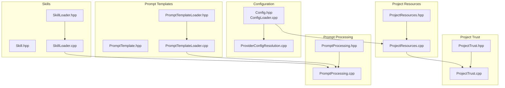
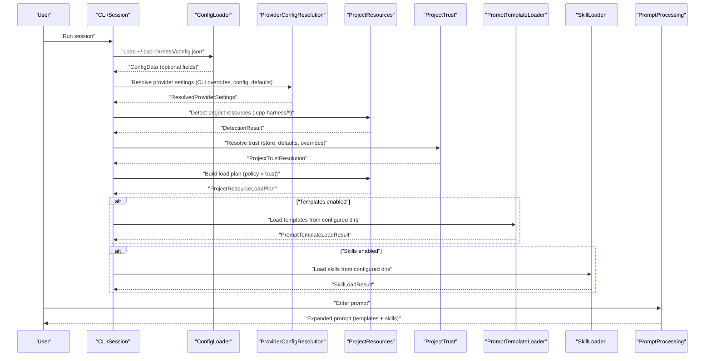
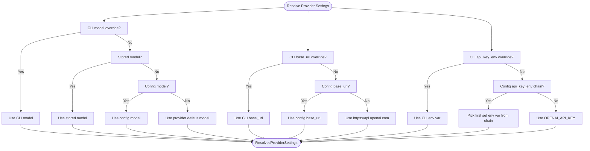
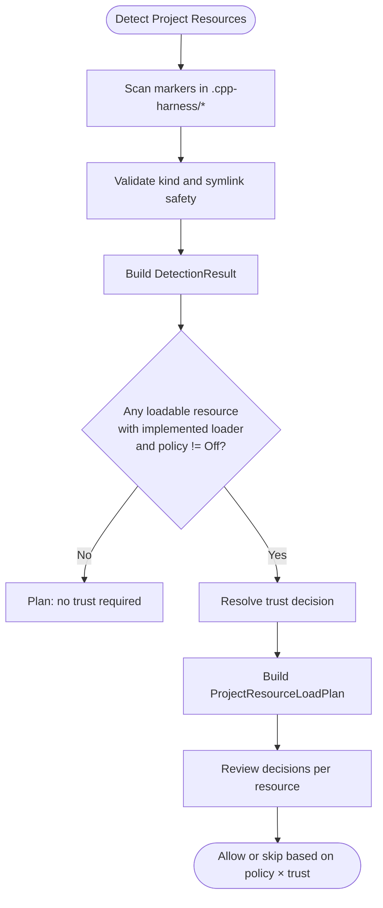
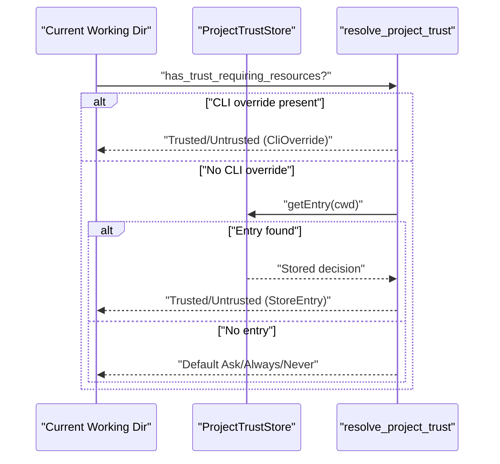
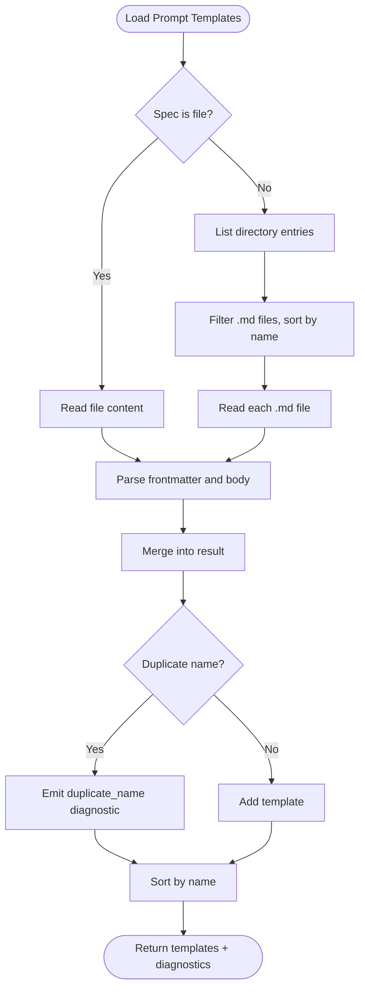
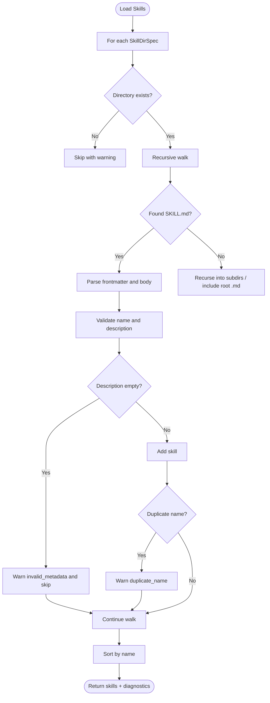
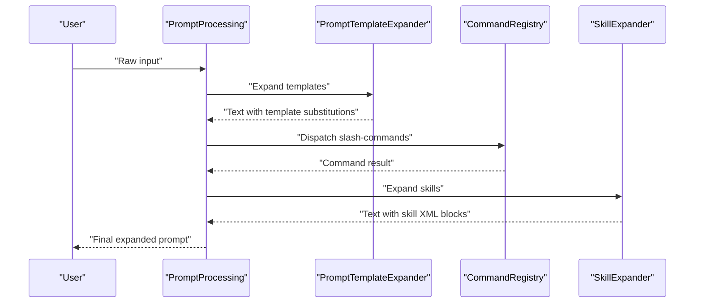
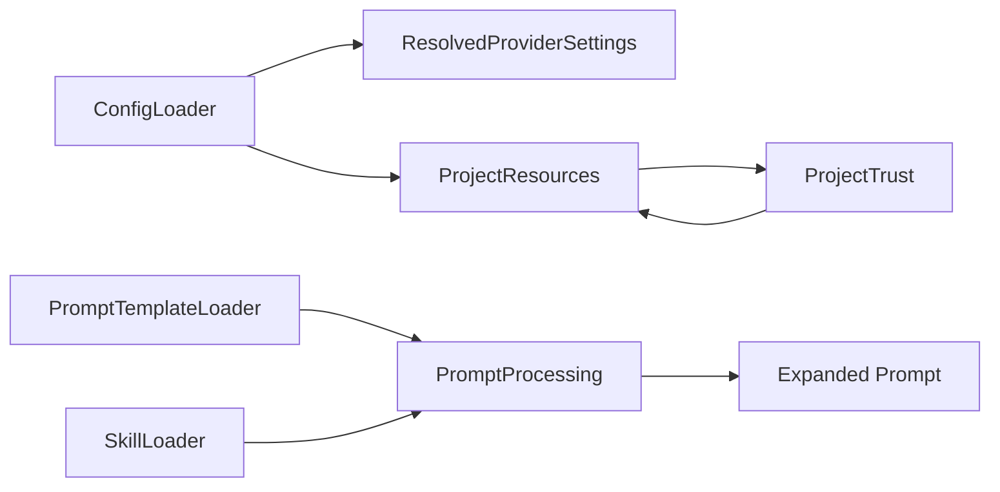

# Configuration and Resources

<cite>
**Referenced Files in This Document**
- [Config.hpp](file://include/cch/coding_agent/Config.hpp)
- [ConfigLoader.cpp](file://src/coding_agent/ConfigLoader.cpp)
- [ProjectResources.hpp](file://include/cch/coding_agent/ProjectResources.hpp)
- [ProjectResources.cpp](file://src/coding_agent/ProjectResources.cpp)
- [ProjectTrust.hpp](file://include/cch/coding_agent/ProjectTrust.hpp)
- [ProjectTrust.cpp](file://src/coding_agent/ProjectTrust.cpp)
- [PromptTemplate.hpp](file://include/cch/coding_agent/PromptTemplate.hpp)
- [PromptTemplateLoader.hpp](file://src/coding_agent/PromptTemplateLoader.hpp)
- [PromptTemplateLoader.cpp](file://src/coding_agent/PromptTemplateLoader.cpp)
- [Skill.hpp](file://include/cch/coding_agent/Skill.hpp)
- [SkillLoader.hpp](file://src/coding_agent/SkillLoader.hpp)
- [SkillLoader.cpp](file://src/coding_agent/SkillLoader.cpp)
- [PromptProcessing.hpp](file://include/cch/coding_agent/PromptProcessing.hpp)
- [PromptProcessing.cpp](file://src/coding_agent/PromptProcessing.cpp)
- [ProviderConfigResolution.cpp](file://src/coding_agent/ProviderConfigResolution.cpp)
</cite>

## Table of Contents
1. [Introduction](#introduction)
2. [Project Structure](#project-structure)
3. [Core Components](#core-components)
4. [Architecture Overview](#architecture-overview)
5. [Detailed Component Analysis](#detailed-component-analysis)
6. [Dependency Analysis](#dependency-analysis)
7. [Performance Considerations](#performance-considerations)
8. [Troubleshooting Guide](#troubleshooting-guide)
9. [Conclusion](#conclusion)
10. [Appendices](#appendices)

## Introduction
This document explains how configuration and resources are managed in the project. It covers:
- Provider configuration resolution and initialization
- Project resource discovery and loading (skills, prompt templates, and other resources)
- The project trust system that governs whether project-authored resources are loaded
- The prompt template system and how templates are loaded, processed, and applied
- Configuration precedence and how settings from different sources interact
- Validation, error handling, and security considerations for resource loading
- Practical examples of configuration files, trust decisions, and resource management
- How configuration affects runtime behavior, including agent execution and tool availability

## Project Structure
The configuration and resource subsystem spans several headers and implementations:
- Configuration: user-level settings and provider resolution
- Project resources: discovery and load planning for project-authored assets
- Project trust: trust store and resolution logic
- Prompt templates: discovery, parsing, and expansion
- Skills: discovery, parsing, validation, and expansion
- Prompt processing: orchestration of template and skill expansions

**Diagram sources**
- [Config.hpp:1-78](file://include/cch/coding_agent/Config.hpp#L1-L78)
- [ConfigLoader.cpp:1-133](file://src/coding_agent/ConfigLoader.cpp#L1-L133)
- [ProviderConfigResolution.cpp:1-110](file://src/coding_agent/ProviderConfigResolution.cpp#L1-L110)
- [ProjectResources.hpp:1-112](file://include/cch/coding_agent/ProjectResources.hpp#L1-L112)
- [ProjectResources.cpp:1-298](file://src/coding_agent/ProjectResources.cpp#L1-L298)
- [ProjectTrust.hpp:1-93](file://include/cch/coding_agent/ProjectTrust.hpp#L1-L93)
- [ProjectTrust.cpp:1-335](file://src/coding_agent/ProjectTrust.cpp#L1-L335)
- [PromptTemplate.hpp:1-18](file://include/cch/coding_agent/PromptTemplate.hpp#L1-L18)
- [PromptTemplateLoader.hpp:1-67](file://src/coding_agent/PromptTemplateLoader.hpp#L1-L67)
- [PromptTemplateLoader.cpp:1-225](file://src/coding_agent/PromptTemplateLoader.cpp#L1-L225)
- [Skill.hpp:1-60](file://include/cch/coding_agent/Skill.hpp#L1-L60)
- [SkillLoader.hpp:1-45](file://src/coding_agent/SkillLoader.hpp#L1-L45)
- [SkillLoader.cpp:1-374](file://src/coding_agent/SkillLoader.cpp#L1-L374)
- [PromptProcessing.hpp:1-62](file://include/cch/coding_agent/PromptProcessing.hpp#L1-L62)
- [PromptProcessing.cpp:1-61](file://src/coding_agent/PromptProcessing.cpp#L1-L61)

**Section sources**
- [Config.hpp:1-78](file://include/cch/coding_agent/Config.hpp#L1-L78)
- [ProjectResources.hpp:1-112](file://include/cch/coding_agent/ProjectResources.hpp#L1-L112)
- [ProjectTrust.hpp:1-93](file://include/cch/coding_agent/ProjectTrust.hpp#L1-L93)
- [PromptTemplate.hpp:1-18](file://include/cch/coding_agent/PromptTemplate.hpp#L1-L18)
- [Skill.hpp:1-60](file://include/cch/coding_agent/Skill.hpp#L1-L60)
- [PromptProcessing.hpp:1-62](file://include/cch/coding_agent/PromptProcessing.hpp#L1-L62)

## Core Components
- Configuration data model and loader: reads user config, resolves API keys, and exposes provider settings resolution helpers.
- Project resource detection and load planning: discovers markers, validates loadability, and builds a plan gated by trust.
- Project trust store and resolution: reads/writes a secure trust map, resolves trust decisions, and records diagnostics.
- Prompt template loader and processor: loads templates from files/dirs, parses frontmatter, and expands templates in prompts.
- Skill loader and processor: discovers skills, validates metadata, and expands skills inline in prompts.
- Prompt processing orchestrator: composes template and skill expansion into a single pipeline.

**Section sources**
- [ConfigLoader.cpp:11-119](file://src/coding_agent/ConfigLoader.cpp#L11-L119)
- [ProjectResources.cpp:149-277](file://src/coding_agent/ProjectResources.cpp#L149-L277)
- [ProjectTrust.cpp:187-210](file://src/coding_agent/ProjectTrust.cpp#L187-L210)
- [PromptTemplateLoader.cpp:41-107](file://src/coding_agent/PromptTemplateLoader.cpp#L41-L107)
- [SkillLoader.cpp:93-210](file://src/coding_agent/SkillLoader.cpp#L93-L210)
- [PromptProcessing.cpp:31-58](file://src/coding_agent/PromptProcessing.cpp#L31-L58)

## Architecture Overview
The configuration and resource system follows a layered approach:
- User configuration is loaded from a JSON file and merged with CLI overrides and defaults.
- Project resources are discovered via markers; load decisions depend on policy and trust.
- Prompt templates and skills are loaded according to discovery rules and validated for correctness.
- Prompt processing composes template expansion and skill expansion into a unified pipeline.

**Diagram sources**
- [ConfigLoader.cpp:11-119](file://src/coding_agent/ConfigLoader.cpp#L11-L119)
- [ProviderConfigResolution.cpp:35-95](file://src/coding_agent/ProviderConfigResolution.cpp#L35-L95)
- [ProjectResources.cpp:149-277](file://src/coding_agent/ProjectResources.cpp#L149-L277)
- [ProjectTrust.cpp:269-332](file://src/coding_agent/ProjectTrust.cpp#L269-L332)
- [PromptTemplateLoader.cpp:109-222](file://src/coding_agent/PromptTemplateLoader.cpp#L109-L222)
- [SkillLoader.cpp:327-371](file://src/coding_agent/SkillLoader.cpp#L327-L371)
- [PromptProcessing.cpp:31-58](file://src/coding_agent/PromptProcessing.cpp#L31-L58)

## Detailed Component Analysis

### Provider Configuration Resolution
Provider settings are resolved through a strict precedence:
- CLI overrides take highest priority
- Session-stored provider/model are next
- User config (config.json) is next
- Built-in provider defaults apply otherwise

**Diagram sources**
- [ProviderConfigResolution.cpp:35-95](file://src/coding_agent/ProviderConfigResolution.cpp#L35-L95)

**Section sources**
- [Config.hpp:44-76](file://include/cch/coding_agent/Config.hpp#L44-L76)
- [ProviderConfigResolution.cpp:11-18](file://src/coding_agent/ProviderConfigResolution.cpp#L11-L18)
- [ProviderConfigResolution.cpp:35-95](file://src/coding_agent/ProviderConfigResolution.cpp#L35-L95)

### Project Resource Discovery and Load Planning
Project resources are discovered by scanning for predefined markers under the workspace. Each detected resource is validated for kind and symlink safety. A load plan is computed based on:
- Policy (e.g., project_skills)
- Implemented loaders (currently skills and prompts)
- Trust decision (Trusted vs Untrusted)

**Diagram sources**
- [ProjectResources.cpp:149-205](file://src/coding_agent/ProjectResources.cpp#L149-L205)
- [ProjectResources.cpp:218-234](file://src/coding_agent/ProjectResources.cpp#L218-L234)
- [ProjectResources.cpp:236-277](file://src/coding_agent/ProjectResources.cpp#L236-L277)

**Section sources**
- [ProjectResources.hpp:15-112](file://include/cch/coding_agent/ProjectResources.hpp#L15-L112)
- [ProjectResources.cpp:18-26](file://src/coding_agent/ProjectResources.cpp#L18-L26)
- [ProjectResources.cpp:149-205](file://src/coding_agent/ProjectResources.cpp#L149-L205)
- [ProjectResources.cpp:218-277](file://src/coding_agent/ProjectResources.cpp#L218-L277)

### Project Trust Store and Resolution
The trust store is a JSON file containing a map of workspace paths to trust decisions (boolean or null). Resolution follows:
- CLI override (explicit True/False)
- Presence of trust-requiring resources
- Stored entry nearest to current working directory
- Default policy (Ask/Always/Never)
- Diagnostics for store errors

**Diagram sources**
- [ProjectTrust.cpp:187-210](file://src/coding_agent/ProjectTrust.cpp#L187-L210)
- [ProjectTrust.cpp:269-332](file://src/coding_agent/ProjectTrust.cpp#L269-L332)

**Section sources**
- [ProjectTrust.hpp:40-91](file://include/cch/coding_agent/ProjectTrust.hpp#L40-L91)
- [ProjectTrust.cpp:42-100](file://src/coding_agent/ProjectTrust.cpp#L42-L100)
- [ProjectTrust.cpp:184-210](file://src/coding_agent/ProjectTrust.cpp#L184-L210)
- [ProjectTrust.cpp:269-332](file://src/coding_agent/ProjectTrust.cpp#L269-L332)

### Prompt Template System
Prompt templates are loaded from Markdown files with YAML frontmatter. Discovery supports:
- Single-file loading
- Directory scanning (non-recursive) for .md files
- Dotfiles and non-files are ignored
- Duplicate names produce diagnostics
- Deterministic ordering by name

**Diagram sources**
- [PromptTemplateLoader.cpp:109-222](file://src/coding_agent/PromptTemplateLoader.cpp#L109-L222)
- [PromptTemplateLoader.cpp:41-107](file://src/coding_agent/PromptTemplateLoader.cpp#L41-L107)

**Section sources**
- [PromptTemplateLoader.hpp:38-66](file://src/coding_agent/PromptTemplateLoader.hpp#L38-L66)
- [PromptTemplateLoader.cpp:109-222](file://src/coding_agent/PromptTemplateLoader.cpp#L109-L222)
- [PromptTemplate.hpp:8-15](file://include/cch/coding_agent/PromptTemplate.hpp#L8-L15)

### Skill Loading and Expansion
Skills are discovered from SKILL.md files with validated frontmatter. Validation enforces:
- Name derived from parent directory or frontmatter
- Description presence and length limits
- Optional flag to disable model invocation
- Duplicate detection and diagnostics
- Recursive traversal with safe symlink handling

**Diagram sources**
- [SkillLoader.cpp:327-371](file://src/coding_agent/SkillLoader.cpp#L327-L371)
- [SkillLoader.cpp:212-325](file://src/coding_agent/SkillLoader.cpp#L212-L325)
- [SkillLoader.cpp:93-210](file://src/coding_agent/SkillLoader.cpp#L93-L210)

**Section sources**
- [SkillLoader.hpp:13-45](file://src/coding_agent/SkillLoader.hpp#L13-L45)
- [SkillLoader.cpp:327-371](file://src/coding_agent/SkillLoader.cpp#L327-L371)
- [Skill.hpp:8-59](file://include/cch/coding_agent/Skill.hpp#L8-L59)

### Prompt Processing Pipeline
Prompt processing composes template expansion and skill expansion:
- Template expansion: matches /templateName and substitutes content
- Slash commands: dispatched via CommandRegistry
- Skill expansion: expands /skill:name into XML blocks

**Diagram sources**
- [PromptProcessing.cpp:31-58](file://src/coding_agent/PromptProcessing.cpp#L31-L58)
- [PromptProcessing.hpp:23-61](file://include/cch/coding_agent/PromptProcessing.hpp#L23-L61)

**Section sources**
- [PromptProcessing.hpp:20-61](file://include/cch/coding_agent/PromptProcessing.hpp#L20-L61)
- [PromptProcessing.cpp:17-58](file://src/coding_agent/PromptProcessing.cpp#L17-L58)

## Dependency Analysis
- Configuration depends on JSON parsing utilities and environment variables.
- Project resources depend on the workspace filesystem abstraction and trust resolution.
- Trust store enforces file-system security checks and atomic writes.
- Prompt template and skill loaders depend on frontmatter parsing and filesystem utilities.
- Prompt processing composes template and skill expansion into a single pipeline.

**Diagram sources**
- [ConfigLoader.cpp:11-119](file://src/coding_agent/ConfigLoader.cpp#L11-L119)
- [ProjectResources.cpp:236-277](file://src/coding_agent/ProjectResources.cpp#L236-L277)
- [ProjectTrust.cpp:187-210](file://src/coding_agent/ProjectTrust.cpp#L187-L210)
- [PromptTemplateLoader.cpp:109-222](file://src/coding_agent/PromptTemplateLoader.cpp#L109-L222)
- [SkillLoader.cpp:327-371](file://src/coding_agent/SkillLoader.cpp#L327-L371)
- [PromptProcessing.cpp:31-58](file://src/coding_agent/PromptProcessing.cpp#L31-L58)

**Section sources**
- [ConfigLoader.cpp:11-119](file://src/coding_agent/ConfigLoader.cpp#L11-L119)
- [ProjectResources.cpp:236-277](file://src/coding_agent/ProjectResources.cpp#L236-L277)
- [ProjectTrust.cpp:187-210](file://src/coding_agent/ProjectTrust.cpp#L187-L210)
- [PromptTemplateLoader.cpp:109-222](file://src/coding_agent/PromptTemplateLoader.cpp#L109-L222)
- [SkillLoader.cpp:327-371](file://src/coding_agent/SkillLoader.cpp#L327-L371)
- [PromptProcessing.cpp:31-58](file://src/coding_agent/PromptProcessing.cpp#L31-L58)

## Performance Considerations
- Resource discovery is linear in the number of detected markers and directory entries; keep discovery scopes minimal.
- Sorting templates and skills improves determinism at O(n log n) cost; acceptable for typical workloads.
- Trust store reads/writes are infrequent; cache results at the session level if needed.
- Template and skill loading avoid deep recursion by scanning only immediate children for templates and enforcing one SKILL.md per directory.

[No sources needed since this section provides general guidance]

## Troubleshooting Guide
Common issues and diagnostics:
- Invalid JSON in config.json: loader returns an error detailing parse failure.
- Invalid default_project_trust or project_resources.skills: validation errors specify allowed values.
- Trust store unreadable/writable by others: security checks fail with actionable diagnostics.
- Template/skill duplicates: diagnostics emitted with duplicate_name code; first occurrence wins.
- Missing or invalid frontmatter: diagnostics emitted with parse_failed or invalid_metadata codes.
- Symlink mismatches: diagnostics indicate kind mismatch or invalid symlink targets.

**Section sources**
- [ConfigLoader.cpp:28-34](file://src/coding_agent/ConfigLoader.cpp#L28-L34)
- [ConfigLoader.cpp:73-89](file://src/coding_agent/ConfigLoader.cpp#L73-L89)
- [ProjectTrust.cpp:42-100](file://src/coding_agent/ProjectTrust.cpp#L42-L100)
- [ProjectTrust.cpp:102-160](file://src/coding_agent/ProjectTrust.cpp#L102-L160)
- [PromptTemplateLoader.cpp:118-136](file://src/coding_agent/PromptTemplateLoader.cpp#L118-L136)
- [SkillLoader.cpp:258-274](file://src/coding_agent/SkillLoader.cpp#L258-L274)
- [SkillLoader.cpp:127-136](file://src/coding_agent/SkillLoader.cpp#L127-L136)

## Conclusion
The configuration and resource system provides a robust, layered approach to managing provider settings, project resources, and prompt composition:
- Clear precedence ensures predictable behavior across CLI, session, and config sources.
- Strict trust gating protects users from untrusted project-authored resources.
- Safe, deterministic discovery and validation minimize runtime surprises.
- Prompt processing integrates templates and skills seamlessly into agent workflows.

[No sources needed since this section summarizes without analyzing specific files]

## Appendices

### Configuration Precedence and Examples
- Provider settings precedence: CLI overrides > session-stored > config.json > provider defaults.
- Example config.json fields:
  - provider: string (overrides registry name)
  - model: string
  - base_url: string
  - api_key_env: string or array of strings
  - default_project_trust: "ask" | "always" | "never"
  - project_resources.skills: "auto" | "on" | "off"

**Section sources**
- [Config.hpp:15-25](file://include/cch/coding_agent/Config.hpp#L15-L25)
- [ConfigLoader.cpp:37-72](file://src/coding_agent/ConfigLoader.cpp#L37-L72)
- [ProviderConfigResolution.cpp:35-95](file://src/coding_agent/ProviderConfigResolution.cpp#L35-L95)

### Trust Decision Examples
- CLI override forces a decision regardless of store or defaults.
- Stored entry nearest to CWD determines trust for that branch.
- DefaultAsk yields Untrusted without UI; DefaultAlways/DefaultNever yield Trusted/Untrusted respectively.

**Section sources**
- [ProjectTrust.cpp:269-332](file://src/coding_agent/ProjectTrust.cpp#L269-L332)

### Resource Management Examples
- Detecting project skills and prompts via .cpp-harness markers.
- Building a load plan that respects policy and trust.
- Skipping resources due to unsupported kinds or trust rejections.

**Section sources**
- [ProjectResources.cpp:149-205](file://src/coding_agent/ProjectResources.cpp#L149-L205)
- [ProjectResources.cpp:236-277](file://src/coding_agent/ProjectResources.cpp#L236-L277)

### Prompt Template and Skill Usage
- Templates: load from files/directories, deduplicate by name, expand by /templateName.
- Skills: load from SKILL.md with validated metadata, expand inline via /skill:name.

**Section sources**
- [PromptTemplateLoader.cpp:109-222](file://src/coding_agent/PromptTemplateLoader.cpp#L109-L222)
- [SkillLoader.cpp:327-371](file://src/coding_agent/SkillLoader.cpp#L327-L371)
- [PromptProcessing.cpp:31-58](file://src/coding_agent/PromptProcessing.cpp#L31-L58)