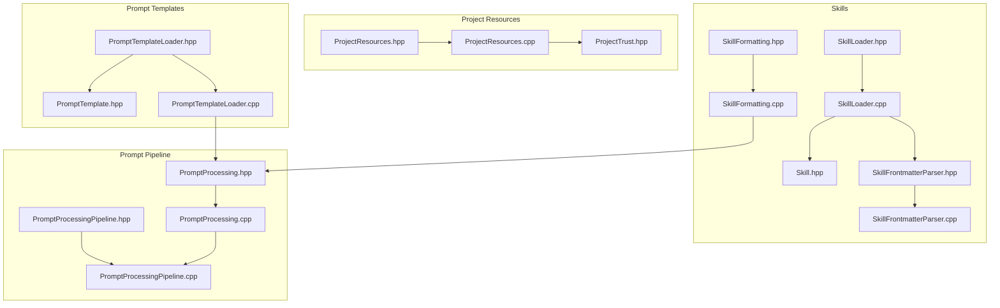
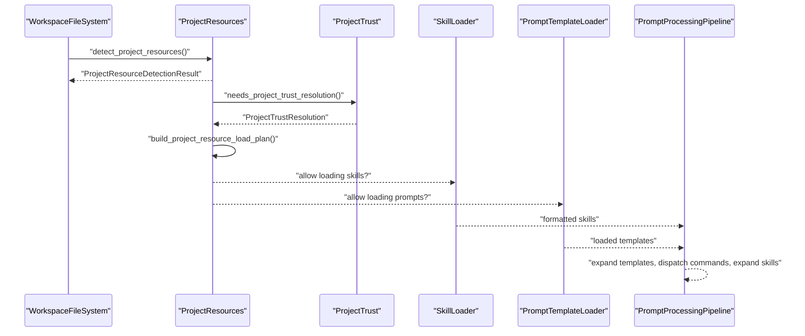
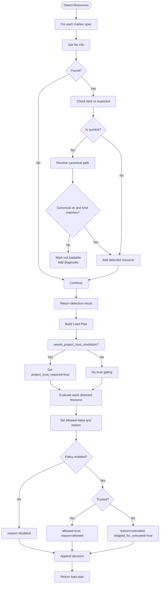
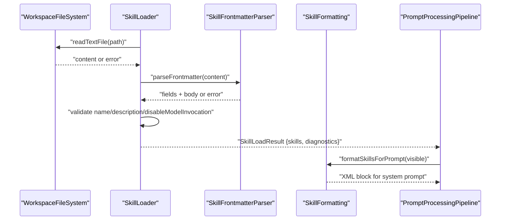
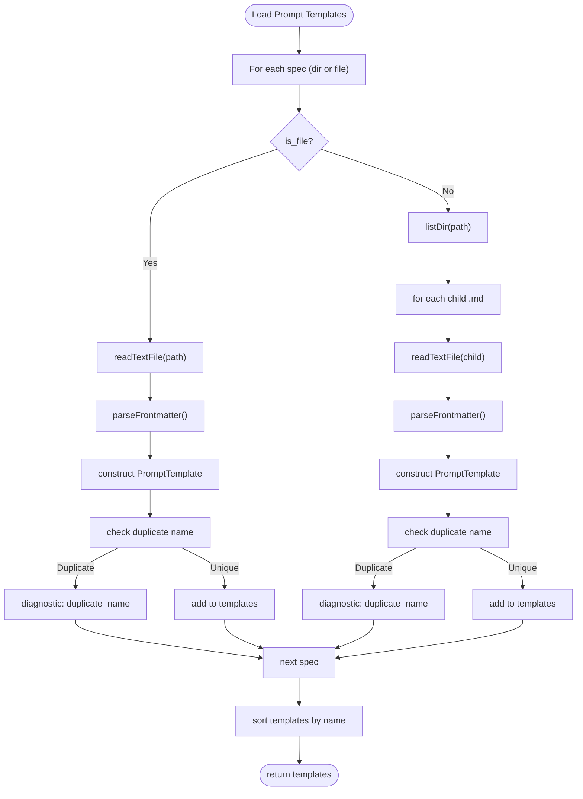
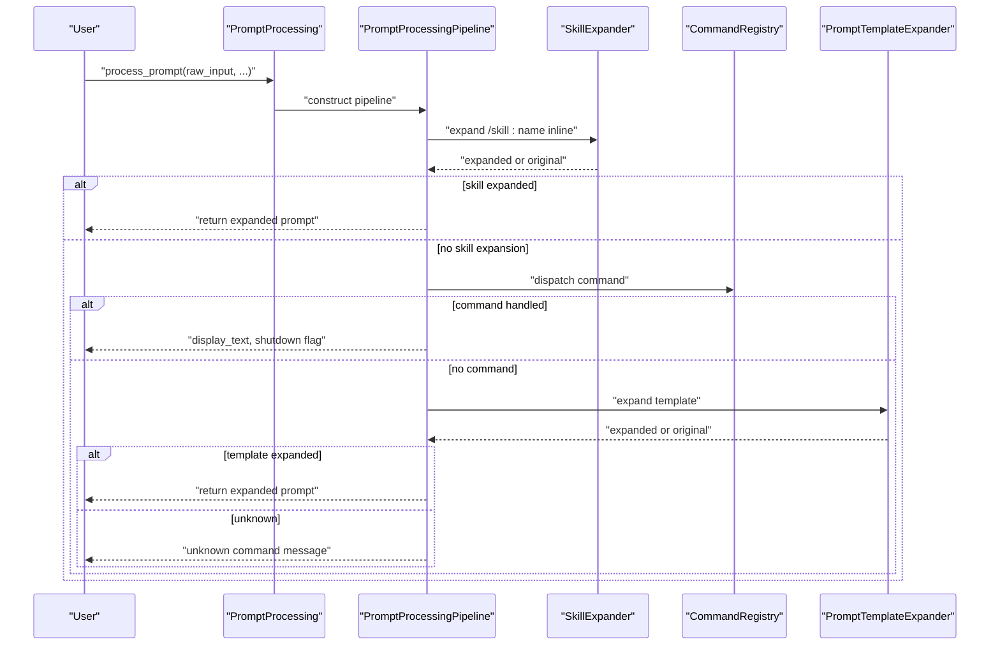
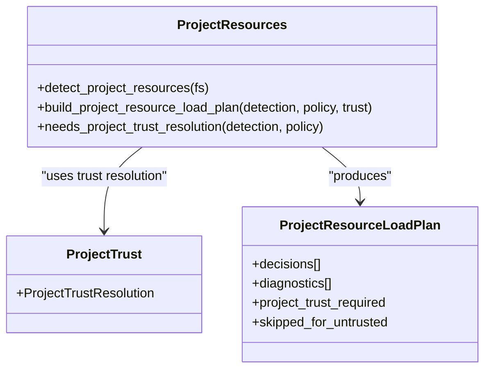
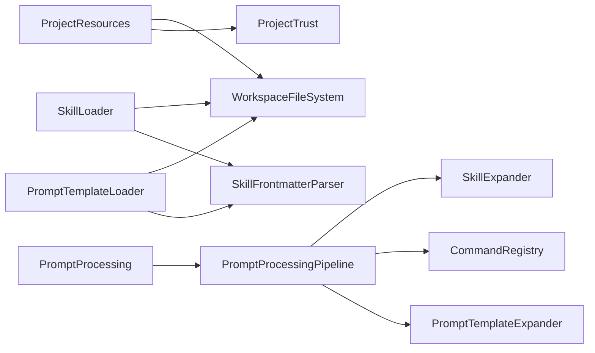

# Project Resources

<cite>
**Referenced Files in This Document**
- [ProjectResources.hpp](file://include/cch/coding_agent/ProjectResources.hpp)
- [ProjectResources.cpp](file://src/coding_agent/ProjectResources.cpp)
- [ProjectTrust.hpp](file://include/cch/coding_agent/ProjectTrust.hpp)
- [Skill.hpp](file://include/cch/coding_agent/Skill.hpp)
- [SkillLoader.hpp](file://src/coding_agent/SkillLoader.hpp)
- [SkillLoader.cpp](file://src/coding_agent/SkillLoader.cpp)
- [SkillFrontmatterParser.hpp](file://src/coding_agent/SkillFrontmatterParser.hpp)
- [SkillFrontmatterParser.cpp](file://src/coding_agent/SkillFrontmatterParser.cpp)
- [SkillFormatting.hpp](file://src/coding_agent/SkillFormatting.hpp)
- [SkillFormatting.cpp](file://src/coding_agent/SkillFormatting.cpp)
- [PromptTemplate.hpp](file://include/cch/coding_agent/PromptTemplate.hpp)
- [PromptTemplateLoader.hpp](file://src/coding_agent/PromptTemplateLoader.hpp)
- [PromptTemplateLoader.cpp](file://src/coding_agent/PromptTemplateLoader.cpp)
- [PromptProcessing.hpp](file://include/cch/coding_agent/PromptProcessing.hpp)
- [PromptProcessing.cpp](file://src/coding_agent/PromptProcessing.cpp)
- [PromptProcessingPipeline.hpp](file://include/cch/coding_agent/PromptProcessingPipeline.hpp)
- [PromptProcessingPipeline.cpp](file://src/coding_agent/PromptProcessingPipeline.cpp)
</cite>

## Table of Contents
1. [Introduction](#introduction)
2. [Project Structure](#project-structure)
3. [Core Components](#core-components)
4. [Architecture Overview](#architecture-overview)
5. [Detailed Component Analysis](#detailed-component-analysis)
6. [Dependency Analysis](#dependency-analysis)
7. [Performance Considerations](#performance-considerations)
8. [Troubleshooting Guide](#troubleshooting-guide)
9. [Conclusion](#conclusion)
10. [Appendices](#appendices)

## Introduction
This document explains the project resources system that discovers, loads, validates, and manages skills and prompt templates within a project. It focuses on:
- How resources are discovered and detected
- The ProjectResources class and its role in enabling/disabling resources
- The skill loading mechanism (file discovery, parsing, formatting)
- The resource enablement system and how user preferences influence loading
- The relationship between project resources and the trust system
- Resource caching, validation, and error handling
- Integration with the prompt processing pipeline and agent execution

## Project Structure
The project resources system spans several headers and implementations:
- Discovery and enablement: ProjectResources.hpp/.cpp define detection markers, policies, diagnostics, and load planning.
- Trust integration: ProjectTrust.hpp defines trust resolution used by ProjectResources.
- Skills: Skill.hpp describes the in-memory representation; SkillLoader.hpp/.cpp implement discovery and parsing; SkillFrontmatterParser.* implements YAML frontmatter parsing; SkillFormatting.* formats skills for prompts.
- Prompt templates: PromptTemplate.hpp describes the in-memory representation; PromptTemplateLoader.hpp/.cpp implement discovery and parsing.
- Prompt processing pipeline: PromptProcessing.hpp/.cpp and PromptProcessingPipeline.* orchestrate template expansion, command dispatch, and skill expansion.

**Diagram sources**
- [ProjectResources.hpp](file://include/cch/coding_agent/ProjectResources.hpp)
- [ProjectResources.cpp](file://src/coding_agent/ProjectResources.cpp)
- [ProjectTrust.hpp](file://include/cch/coding_agent/ProjectTrust.hpp)
- [Skill.hpp](file://include/cch/coding_agent/Skill.hpp)
- [SkillLoader.hpp](file://src/coding_agent/SkillLoader.hpp)
- [SkillLoader.cpp](file://src/coding_agent/SkillLoader.cpp)
- [SkillFrontmatterParser.hpp](file://src/coding_agent/SkillFrontmatterParser.hpp)
- [SkillFrontmatterParser.cpp](file://src/coding_agent/SkillFrontmatterParser.cpp)
- [SkillFormatting.hpp](file://src/coding_agent/SkillFormatting.hpp)
- [SkillFormatting.cpp](file://src/coding_agent/SkillFormatting.cpp)
- [PromptTemplate.hpp](file://include/cch/coding_agent/PromptTemplate.hpp)
- [PromptTemplateLoader.hpp](file://src/coding_agent/PromptTemplateLoader.hpp)
- [PromptTemplateLoader.cpp](file://src/coding_agent/PromptTemplateLoader.cpp)
- [PromptProcessing.hpp](file://include/cch/coding_agent/PromptProcessing.hpp)
- [PromptProcessing.cpp](file://src/coding_agent/PromptProcessing.cpp)
- [PromptProcessingPipeline.hpp](file://include/cch/coding_agent/PromptProcessingPipeline.hpp)
- [PromptProcessingPipeline.cpp](file://src/coding_agent/PromptProcessingPipeline.cpp)

**Section sources**
- [ProjectResources.hpp](file://include/cch/coding_agent/ProjectResources.hpp)
- [ProjectResources.cpp](file://src/coding_agent/ProjectResources.cpp)
- [ProjectTrust.hpp](file://include/cch/coding_agent/ProjectTrust.hpp)
- [Skill.hpp](file://include/cch/coding_agent/Skill.hpp)
- [SkillLoader.hpp](file://src/coding_agent/SkillLoader.hpp)
- [SkillLoader.cpp](file://src/coding_agent/SkillLoader.cpp)
- [SkillFrontmatterParser.hpp](file://src/coding_agent/SkillFrontmatterParser.hpp)
- [SkillFrontmatterParser.cpp](file://src/coding_agent/SkillFrontmatterParser.cpp)
- [SkillFormatting.hpp](file://src/coding_agent/SkillFormatting.hpp)
- [SkillFormatting.cpp](file://src/coding_agent/SkillFormatting.cpp)
- [PromptTemplate.hpp](file://include/cch/coding_agent/PromptTemplate.hpp)
- [PromptTemplateLoader.hpp](file://src/coding_agent/PromptTemplateLoader.hpp)
- [PromptTemplateLoader.cpp](file://src/coding_agent/PromptTemplateLoader.cpp)
- [PromptProcessing.hpp](file://include/cch/coding_agent/PromptProcessing.hpp)
- [PromptProcessing.cpp](file://src/coding_agent/PromptProcessing.cpp)
- [PromptProcessingPipeline.hpp](file://include/cch/coding_agent/PromptProcessingPipeline.hpp)
- [PromptProcessingPipeline.cpp](file://src/coding_agent/PromptProcessingPipeline.cpp)

## Core Components
- ProjectResources: Discovers resource markers, builds diagnostics, enforces enablement policy, and produces a load plan gated by trust.
- Skill system: Loads SKILL.md files, validates frontmatter, deduplicates by name, and formats skills for inclusion in prompts.
- Prompt template system: Loads .md files with YAML frontmatter, extracts metadata, and provides template expansion.
- Prompt processing pipeline: Orchestrates skill expansion, slash-command dispatch, and template expansion.

Key responsibilities:
- Discovery: ProjectResources detects markers under .cpp-harness/.
- Enablement: Policies and trust control whether detected resources are loaded.
- Validation: Skills and templates are validated; diagnostics are accumulated without failing the whole load.
- Formatting: Visible skills are formatted into an XML block for system prompts.
- Integration: Loaded resources feed into the prompt processing pipeline and agent execution.

**Section sources**
- [ProjectResources.hpp](file://include/cch/coding_agent/ProjectResources.hpp)
- [ProjectResources.cpp](file://src/coding_agent/ProjectResources.cpp)
- [Skill.hpp](file://include/cch/coding_agent/Skill.hpp)
- [SkillLoader.hpp](file://src/coding_agent/SkillLoader.hpp)
- [SkillLoader.cpp](file://src/coding_agent/SkillLoader.cpp)
- [SkillFrontmatterParser.hpp](file://src/coding_agent/SkillFrontmatterParser.hpp)
- [SkillFrontmatterParser.cpp](file://src/coding_agent/SkillFrontmatterParser.cpp)
- [SkillFormatting.hpp](file://src/coding_agent/SkillFormatting.hpp)
- [SkillFormatting.cpp](file://src/coding_agent/SkillFormatting.cpp)
- [PromptTemplate.hpp](file://include/cch/coding_agent/PromptTemplate.hpp)
- [PromptTemplateLoader.hpp](file://src/coding_agent/PromptTemplateLoader.hpp)
- [PromptTemplateLoader.cpp](file://src/coding_agent/PromptTemplateLoader.cpp)
- [PromptProcessing.hpp](file://include/cch/coding_agent/PromptProcessing.hpp)
- [PromptProcessing.cpp](file://src/coding_agent/PromptProcessing.cpp)
- [PromptProcessingPipeline.hpp](file://include/cch/coding_agent/PromptProcessingPipeline.hpp)
- [PromptProcessingPipeline.cpp](file://src/coding_agent/PromptProcessingPipeline.cpp)

## Architecture Overview
The project resources system integrates with the trust system and prompt processing pipeline. At a high level:
- ProjectResources detects resource markers and constructs a load plan based on policy and trust.
- Skills and prompt templates are loaded only when allowed by the plan.
- Loaded skills are formatted for system prompts and integrated into the pipeline.
- Prompt templates are expanded and commands are dispatched before agent execution.

**Diagram sources**
- [ProjectResources.cpp](file://src/coding_agent/ProjectResources.cpp)
- [ProjectTrust.hpp](file://include/cch/coding_agent/ProjectTrust.hpp)
- [SkillLoader.cpp](file://src/coding_agent/SkillLoader.cpp)
- [PromptTemplateLoader.cpp](file://src/coding_agent/PromptTemplateLoader.cpp)
- [PromptProcessingPipeline.cpp](file://src/coding_agent/PromptProcessingPipeline.cpp)

## Detailed Component Analysis

### ProjectResources: Discovery, Enablement, and Load Planning
ProjectResources defines:
- Resource kinds (settings, skills, prompts, extensions, packages, system prompts)
- Enablement modes (auto, on, off)
- Diagnostics and skip reasons
- Detection markers under .cpp-harness/
- Policy-driven enablement
- Trust-aware load planning

Discovery and validation:
- Iterates over predefined marker specs and checks file kinds and symlinks.
- Emits diagnostics for mismatches and unresolved symlinks.
- Determines whether a resource is loadable based on kind and symlink resolution.

Enablement and trust:
- Applies policy per resource kind.
- Builds a load plan that sets allowed flags and reasons based on detection, loader availability, policy, and trust.
- Reports whether trust is required and whether any resources were skipped due to untrusted status.

**Diagram sources**
- [ProjectResources.cpp](file://src/coding_agent/ProjectResources.cpp)

**Section sources**
- [ProjectResources.hpp](file://include/cch/coding_agent/ProjectResources.hpp)
- [ProjectResources.cpp](file://src/coding_agent/ProjectResources.cpp)

### Skill Loading Mechanism
Skill discovery and parsing:
- loadSkillFromFile reads a file via WorkspaceFileSystem, parses YAML frontmatter, validates metadata, and constructs a Skill.
- loadSkills recursively scans directories, supports root-level .md files for global directories, and deduplicates by name.
- Frontmatter parsing is shared with prompt templates and follows a flat key: value format.

Validation and diagnostics:
- Name validation enforces length, character set, and hyphen rules; must match parent directory unless overridden by frontmatter.
- Description is required and trimmed; empty or too long triggers diagnostics.
- disableModelInvocation toggles visibility in model-visible lists.
- Diagnostics are warnings and do not fail loading; duplicates produce warnings and are skipped.

Formatting for prompts:
- formatSkillsForPrompt generates an XML block for system prompts containing visible skills.
- formatSkillInvocation wraps a skill’s content into an XML block suitable for inline expansion.

**Diagram sources**
- [SkillLoader.cpp](file://src/coding_agent/SkillLoader.cpp)
- [SkillFrontmatterParser.cpp](file://src/coding_agent/SkillFrontmatterParser.cpp)
- [SkillFormatting.cpp](file://src/coding_agent/SkillFormatting.cpp)
- [PromptProcessingPipeline.cpp](file://src/coding_agent/PromptProcessingPipeline.cpp)

**Section sources**
- [Skill.hpp](file://include/cch/coding_agent/Skill.hpp)
- [SkillLoader.hpp](file://src/coding_agent/SkillLoader.hpp)
- [SkillLoader.cpp](file://src/coding_agent/SkillLoader.cpp)
- [SkillFrontmatterParser.hpp](file://src/coding_agent/SkillFrontmatterParser.hpp)
- [SkillFrontmatterParser.cpp](file://src/coding_agent/SkillFrontmatterParser.cpp)
- [SkillFormatting.hpp](file://src/coding_agent/SkillFormatting.hpp)
- [SkillFormatting.cpp](file://src/coding_agent/SkillFormatting.cpp)

### Prompt Template Loading Mechanism
Prompt template discovery and parsing:
- loadPromptTemplateFromFile reads .md files, parses YAML frontmatter, and constructs a PromptTemplate with optional description and argument hint.
- loadPromptTemplates scans directories for .md children (non-recursively), supports explicit file specs, and deduplicates by name.

Validation and diagnostics:
- Non-.md files are ignored.
- Duplicates produce warnings; missing directories are silently skipped except for diagnostics when not found.

**Diagram sources**
- [PromptTemplateLoader.cpp](file://src/coding_agent/PromptTemplateLoader.cpp)

**Section sources**
- [PromptTemplate.hpp](file://include/cch/coding_agent/PromptTemplate.hpp)
- [PromptTemplateLoader.hpp](file://src/coding_agent/PromptTemplateLoader.hpp)
- [PromptTemplateLoader.cpp](file://src/coding_agent/PromptTemplateLoader.cpp)

### Prompt Processing Pipeline Integration
The pipeline orchestrates:
- Inline skill expansion for /skill:name commands
- Slash-command dispatch via CommandRegistry
- Prompt template expansion
- Passing through raw input when nothing matches

Integration points:
- PromptProcessing delegates to PromptProcessingPipeline.
- Pipeline composes PromptTemplateExpander and SkillExpander with CommandRegistry.
- Skill expansion uses loaded skills and WorkspaceFileSystem to read referenced files.

**Diagram sources**
- [PromptProcessing.cpp](file://src/coding_agent/PromptProcessing.cpp)
- [PromptProcessingPipeline.cpp](file://src/coding_agent/PromptProcessingPipeline.cpp)

**Section sources**
- [PromptProcessing.hpp](file://include/cch/coding_agent/PromptProcessing.hpp)
- [PromptProcessing.cpp](file://src/coding_agent/PromptProcessing.cpp)
- [PromptProcessingPipeline.hpp](file://include/cch/coding_agent/PromptProcessingPipeline.hpp)
- [PromptProcessingPipeline.cpp](file://src/coding_agent/PromptProcessingPipeline.cpp)

### Relationship Between Project Resources and Trust System
- ProjectResources uses ProjectTrustResolution to decide whether to allow loading detected resources.
- needs_project_trust_resolution determines if trust is required based on detected kinds, policy, and loader availability.
- build_project_resource_load_plan sets allowed flags and reasons accordingly, marking skipped_for_untrusted when trust is insufficient.

**Diagram sources**
- [ProjectResources.cpp](file://src/coding_agent/ProjectResources.cpp)
- [ProjectTrust.hpp](file://include/cch/coding_agent/ProjectTrust.hpp)

**Section sources**
- [ProjectResources.cpp](file://src/coding_agent/ProjectResources.cpp)
- [ProjectTrust.hpp](file://include/cch/coding_agent/ProjectTrust.hpp)

### Resource Caching, Validation, and Error Handling
- Resource caching: ProjectResources does not cache loaded resources; it focuses on detection and planning. Skills and templates are loaded on-demand when allowed.
- Validation: Both skills and templates validate metadata and emit diagnostics as warnings. Failures do not abort loading; instead, problematic items are skipped and reported.
- Error handling: WorkspaceFileSystem errors are captured and turned into diagnostics. Symlink resolution errors are surfaced to avoid unsafe loading.

**Section sources**
- [ProjectResources.cpp](file://src/coding_agent/ProjectResources.cpp)
- [SkillLoader.cpp](file://src/coding_agent/SkillLoader.cpp)
- [PromptTemplateLoader.cpp](file://src/coding_agent/PromptTemplateLoader.cpp)

### Examples and Formats

- Skill definition format (SKILL.md):
  - YAML frontmatter with keys such as name, description, disable-model-invocation.
  - Body content after the frontmatter becomes the skill instructions.
  - Parent directory name convention and validation rules apply.

- Prompt template format (.md):
  - YAML frontmatter with optional description and argument-hint.
  - Body content is the template content.

- Resource file structures:
  - Skills: .cpp-harness/skills/<skill>/SKILL.md
  - Prompts: .cpp-harness/prompts/*.md
  - Settings/system prompts: .cpp-harness/settings.json, .cpp-harness/SYSTEM.md, .cpp-harness/APPEND_SYSTEM.md
  - Extensions/packages: .cpp-harness/extensions/, .cpp-harness/packages/

- Loading workflows:
  - ProjectResources detects markers and builds a load plan.
  - SkillLoader and PromptTemplateLoader load allowed resources.
  - PromptProcessingPipeline integrates loaded resources into prompt expansion and command dispatch.

**Section sources**
- [SkillLoader.hpp](file://src/coding_agent/SkillLoader.hpp)
- [SkillLoader.cpp](file://src/coding_agent/SkillLoader.cpp)
- [PromptTemplateLoader.hpp](file://src/coding_agent/PromptTemplateLoader.hpp)
- [PromptTemplateLoader.cpp](file://src/coding_agent/PromptTemplateLoader.cpp)
- [ProjectResources.hpp](file://include/cch/coding_agent/ProjectResources.hpp)
- [ProjectResources.cpp](file://src/coding_agent/ProjectResources.cpp)

## Dependency Analysis
High-level dependencies among components:
- ProjectResources depends on WorkspaceFileSystem and ProjectTrust.
- SkillLoader depends on WorkspaceFileSystem and SkillFrontmatterParser.
- PromptTemplateLoader depends on WorkspaceFileSystem and SkillFrontmatterParser.
- PromptProcessingPipeline composes PromptTemplateExpander, CommandRegistry, and SkillExpander.
- PromptProcessing delegates to the pipeline.

**Diagram sources**
- [ProjectResources.cpp](file://src/coding_agent/ProjectResources.cpp)
- [SkillLoader.cpp](file://src/coding_agent/SkillLoader.cpp)
- [PromptTemplateLoader.cpp](file://src/coding_agent/PromptTemplateLoader.cpp)
- [PromptProcessing.cpp](file://src/coding_agent/PromptProcessing.cpp)
- [PromptProcessingPipeline.cpp](file://src/coding_agent/PromptProcessingPipeline.cpp)

**Section sources**
- [ProjectResources.cpp](file://src/coding_agent/ProjectResources.cpp)
- [SkillLoader.cpp](file://src/coding_agent/SkillLoader.cpp)
- [PromptTemplateLoader.cpp](file://src/coding_agent/PromptTemplateLoader.cpp)
- [PromptProcessing.cpp](file://src/coding_agent/PromptProcessing.cpp)
- [PromptProcessingPipeline.cpp](file://src/coding_agent/PromptProcessingPipeline.cpp)

## Performance Considerations
- Deterministic traversal: Skills and templates are sorted to ensure deterministic output ordering.
- Minimal allocations: String views and reserve hints are used to reduce reallocations during formatting.
- Early exits: Skill discovery stops after encountering SKILL.md in a directory to limit recursion depth.
- Diagnostics accumulation: Warnings are aggregated rather than failing fast, avoiding repeated retries.

[No sources needed since this section provides general guidance]

## Troubleshooting Guide
Common issues and diagnostics:
- Skill diagnostics:
  - read_failed: Unable to read file.
  - parse_failed: Frontmatter parsing error.
  - invalid_metadata: Missing or invalid description; name validation failures.
  - duplicate_name: Duplicate skill names across discovered files.
- Prompt template diagnostics:
  - read_failed: Unable to read file.
  - parse_failed: Frontmatter parsing error.
  - duplicate_name: Duplicate template names.

Remediation tips:
- Ensure SKILL.md and .md files have proper YAML frontmatter blocks.
- Verify skill names match parent directory conventions and follow allowed character rules.
- Check for duplicate names across directories and remove or rename conflicting entries.
- Confirm resource markers (.cpp-harness/*) exist and are not broken symlinks.

**Section sources**
- [Skill.hpp](file://include/cch/coding_agent/Skill.hpp)
- [SkillLoader.cpp](file://src/coding_agent/SkillLoader.cpp)
- [PromptTemplateLoader.hpp](file://src/coding_agent/PromptTemplateLoader.hpp)
- [PromptTemplateLoader.cpp](file://src/coding_agent/PromptTemplateLoader.cpp)

## Conclusion
The project resources system provides a robust, trust-aware mechanism for discovering, validating, and loading skills and prompt templates. It integrates cleanly with the prompt processing pipeline, ensuring that only allowed resources are applied to agent execution. Diagnostics guide users toward fixing issues without blocking the system, and the design supports future extensibility for additional resource kinds.

[No sources needed since this section summarizes without analyzing specific files]

## Appendices

### Appendix A: Resource Enablement and Trust Decision Matrix
- Auto: Default behavior; subject to trust and loader availability.
- On: Force-enable resources when detected and loadable.
- Off: Disable resources regardless of detection.
- Trust gating: If trust is required, resources are allowed only when Trusted; otherwise skipped.

**Section sources**
- [ProjectResources.hpp](file://include/cch/coding_agent/ProjectResources.hpp)
- [ProjectResources.cpp](file://src/coding_agent/ProjectResources.cpp)