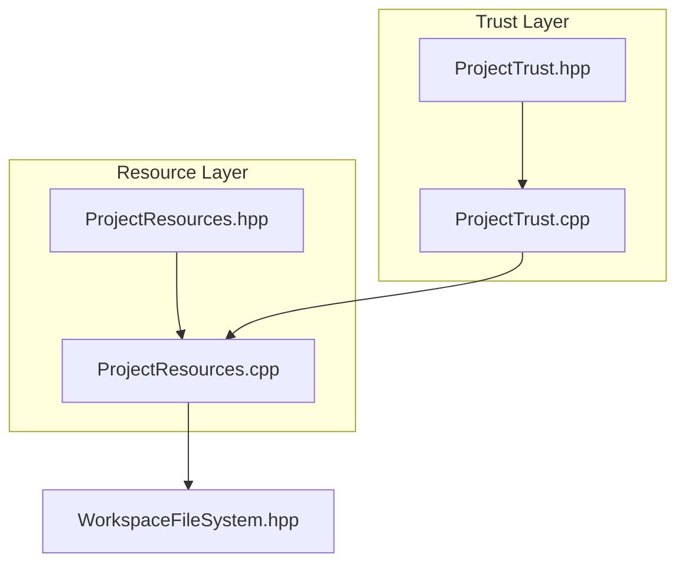
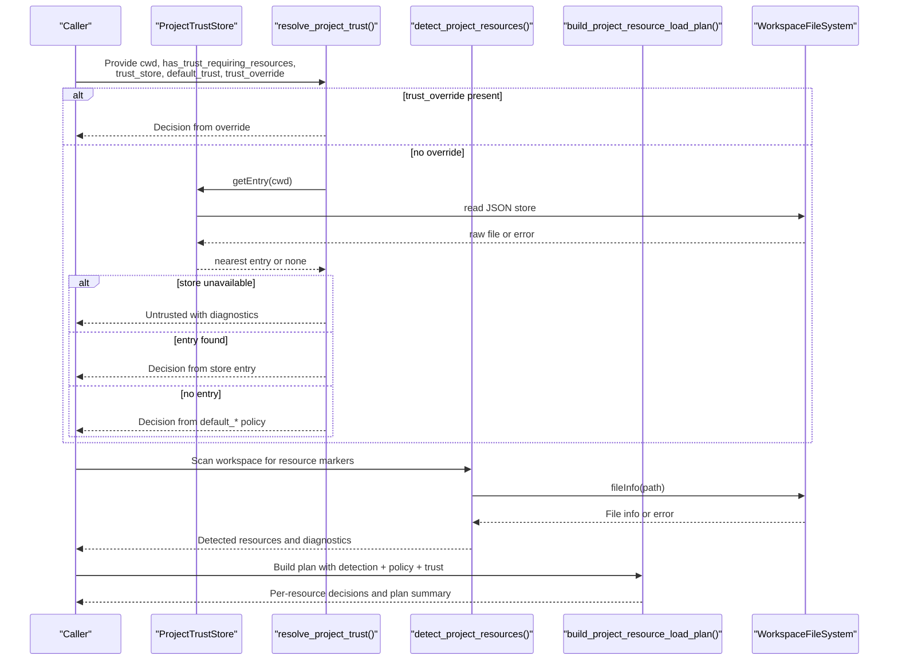
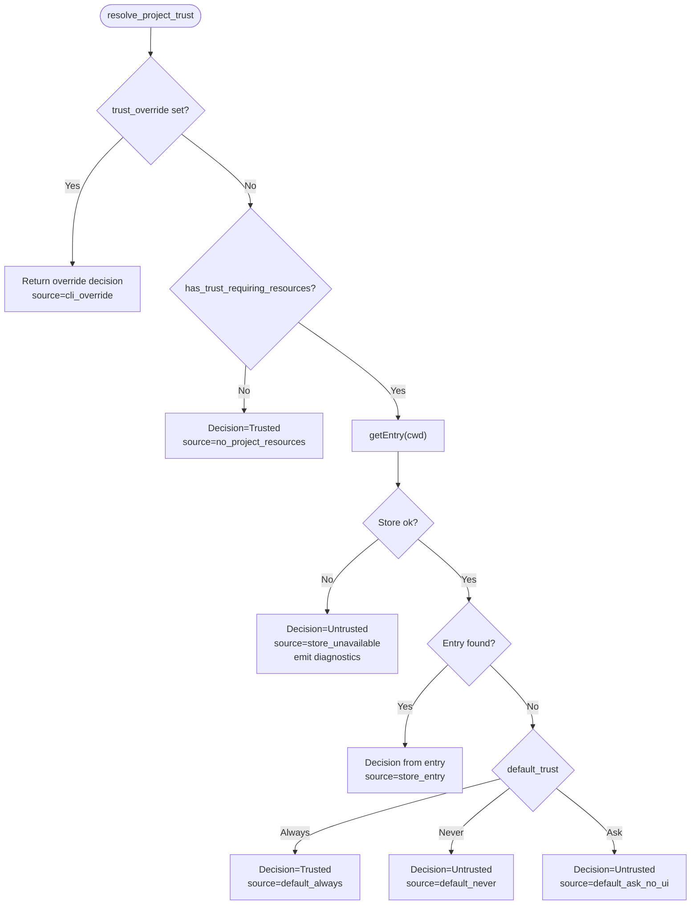
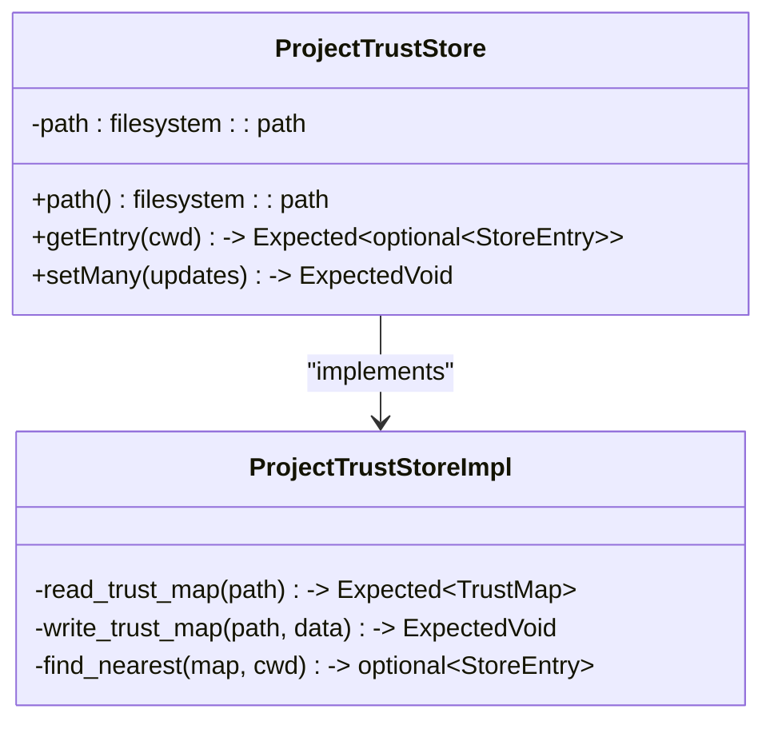
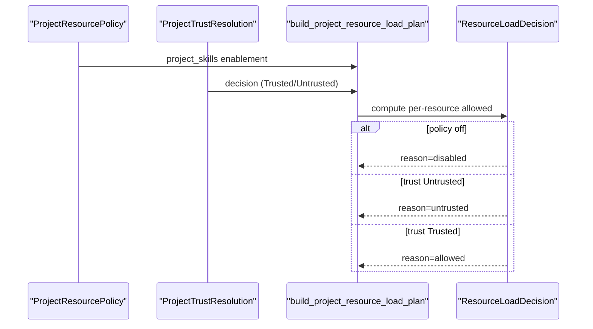
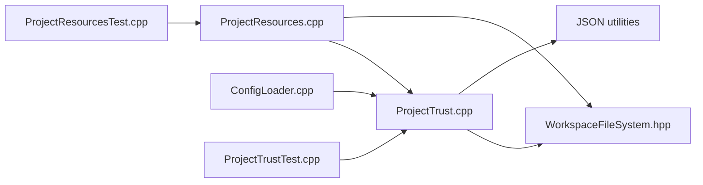

# Project Trust

<cite>
**Referenced Files in This Document**
- [ProjectTrust.hpp](file://include/cch/coding_agent/ProjectTrust.hpp)
- [ProjectTrust.cpp](file://src/coding_agent/ProjectTrust.cpp)
- [ProjectResources.hpp](file://include/cch/coding_agent/ProjectResources.hpp)
- [ProjectResources.cpp](file://src/coding_agent/ProjectResources.cpp)
- [ProjectTrustTest.cpp](file://tests/coding_agent/ProjectTrustTest.cpp)
- [ProjectResourcesTest.cpp](file://tests/coding_agent/ProjectResourcesTest.cpp)
- [WorkspaceFileSystem.hpp](file://src/harness/WorkspaceFileSystem.hpp)
- [ConfigLoader.cpp](file://src/coding_agent/ConfigLoader.cpp)
</cite>

## Table of Contents
1. [Introduction](#introduction)
2. [Project Structure](#project-structure)
3. [Core Components](#core-components)
4. [Architecture Overview](#architecture-overview)
5. [Detailed Component Analysis](#detailed-component-analysis)
6. [Dependency Analysis](#dependency-analysis)
7. [Performance Considerations](#performance-considerations)
8. [Troubleshooting Guide](#troubleshooting-guide)
9. [Conclusion](#conclusion)

## Introduction
This document explains the project trust system that governs how project-authored resources are discovered, validated, and conditionally loaded. It covers:
- The DefaultProjectTrust enumeration and how it influences automatic trust decisions
- The trust resolution pipeline and how user preferences interact with project-local settings
- The ResourceEnablement system and how it governs resource loading permissions
- Examples of trust configurations, policy enforcement, and user override mechanisms
- Security implications of trust decisions and protection against untrusted project resources
- The relationship between trust settings and the resource loading pipeline
- Persistence, validation, and error handling for trust-related operations

## Project Structure
The trust system spans two primary modules:
- ProjectTrust: Defines trust enums, resolution logic, and a persistent trust store
- ProjectResources: Defines resource kinds, enablement policies, detection, and load planning gated by trust

**Diagram sources**
- [ProjectTrust.hpp:10-92](file://include/cch/coding_agent/ProjectTrust.hpp#L10-L92)
- [ProjectTrust.cpp:17-334](file://src/coding_agent/ProjectTrust.cpp#L17-L334)
- [ProjectResources.hpp:13-111](file://include/cch/coding_agent/ProjectResources.hpp#L13-L111)
- [ProjectResources.cpp:9-297](file://src/coding_agent/ProjectResources.cpp#L9-L297)
- [WorkspaceFileSystem.hpp:31-819](file://src/harness/WorkspaceFileSystem.hpp#L31-L819)

**Section sources**
- [ProjectTrust.hpp:10-92](file://include/cch/coding_agent/ProjectTrust.hpp#L10-L92)
- [ProjectResources.hpp:13-111](file://include/cch/coding_agent/ProjectResources.hpp#L13-L111)

## Core Components
- DefaultProjectTrust: Controls default behavior when no project-specific trust setting is present
- ProjectTrustStore: Persistent JSON store mapping workspace paths to trust decisions
- ProjectTrustResolution: Final trust decision plus provenance and diagnostics
- ProjectResourcePolicy: User policy controlling which resource kinds are enabled
- ProjectResourceLoadPlan: Decisions for each detected resource, gated by trust and policy

Key responsibilities:
- Trust decision-making: CLI overrides, project-local store entries, and defaults
- Resource discovery and validation: Detects project markers and validates their integrity
- Policy enforcement: Applies user enablement settings and trust gating
- Security: Fails closed on invalid or unsafe conditions

**Section sources**
- [ProjectTrust.hpp:12-62](file://include/cch/coding_agent/ProjectTrust.hpp#L12-L62)
- [ProjectTrust.cpp:270-332](file://src/coding_agent/ProjectTrust.cpp#L270-L332)
- [ProjectResources.hpp:25-83](file://include/cch/coding_agent/ProjectResources.hpp#L25-L83)
- [ProjectResources.cpp:236-277](file://src/coding_agent/ProjectResources.cpp#L236-L277)

## Architecture Overview
The trust system integrates with resource detection and loading. At a high level:
- ProjectTrustStore persists and resolves trust decisions per workspace path
- ProjectResources detects markers and builds a plan for which resources to load
- ProjectResourceLoadPlan enforces trust gating and user policy

**Diagram sources**
- [ProjectTrust.cpp:269-332](file://src/coding_agent/ProjectTrust.cpp#L269-L332)
- [ProjectTrust.cpp:187-210](file://src/coding_agent/ProjectTrust.cpp#L187-L210)
- [ProjectResources.cpp:149-205](file://src/coding_agent/ProjectResources.cpp#L149-L205)
- [ProjectResources.cpp:236-277](file://src/coding_agent/ProjectResources.cpp#L236-L277)
- [WorkspaceFileSystem.hpp:307-371](file://src/harness/WorkspaceFileSystem.hpp#L307-L371)

## Detailed Component Analysis

### DefaultProjectTrust and Trust Resolution
- DefaultProjectTrust supports three modes:
  - Ask: Require explicit user action (treated as untrusted in absence of store entry)
  - Always: Automatically trust project resources
  - Never: Never trust project resources
- The resolver applies a strict precedence:
  1) CLI override (if provided)
  2) No-project-resources case (trusted by default)
  3) Project-local store entry (nearest ancestor match)
  4) Default policy (Always/ Never/ Ask)
- Diagnostics are emitted when the trust store is unavailable or malformed.

**Diagram sources**
- [ProjectTrust.cpp:269-332](file://src/coding_agent/ProjectTrust.cpp#L269-L332)

**Section sources**
- [ProjectTrust.hpp:18-22](file://include/cch/coding_agent/ProjectTrust.hpp#L18-L22)
- [ProjectTrust.cpp:269-332](file://src/coding_agent/ProjectTrust.cpp#L269-L332)
- [ProjectTrustTest.cpp:84-126](file://tests/coding_agent/ProjectTrustTest.cpp#L84-L126)

### ProjectTrustStore: Persistence, Validation, and Error Handling
- Stores a JSON object mapping canonicalized workspace paths to booleans (true/false) or null (clear)
- Reads and writes are atomic via a temporary file and rename
- Validates:
  - Non-empty path
  - Regular file (rejects symlinks and directories)
  - Safe permissions (on Unix-like systems, restricts group/other writability)
  - Valid JSON object with boolean/null values
- Lookup uses nearest-ancestor matching (nearest directory with a stored decision)
- Writes erase null entries and persist only explicit decisions

**Diagram sources**
- [ProjectTrust.hpp:64-77](file://include/cch/coding_agent/ProjectTrust.hpp#L64-L77)
- [ProjectTrust.cpp:184-210](file://src/coding_agent/ProjectTrust.cpp#L184-L210)
- [ProjectTrust.cpp:42-160](file://src/coding_agent/ProjectTrust.cpp#L42-L160)
- [ProjectTrust.cpp:162-180](file://src/coding_agent/ProjectTrust.cpp#L162-L180)

**Section sources**
- [ProjectTrust.cpp:42-160](file://src/coding_agent/ProjectTrust.cpp#L42-L160)
- [ProjectTrust.cpp:162-180](file://src/coding_agent/ProjectTrust.cpp#L162-L180)
- [ProjectTrust.cpp:187-210](file://src/coding_agent/ProjectTrust.cpp#L187-L210)
- [ProjectTrustTest.cpp:15-82](file://tests/coding_agent/ProjectTrustTest.cpp#L15-L82)

### Resource Detection, Enablement, and Load Planning
- Resource kinds: Settings, Skills, Prompts, Extensions, Packages, System prompts
- Detection scans for well-known markers under the workspace’s hidden harness directory
- Validation:
  - Enforces case-sensitive marker names
  - Rejects symlinked markers that escape the workspace or resolve to unexpected kinds
- Enablement policy:
  - ResourceEnablement supports Auto, On, Off
  - Current policy exposes a single knob: project_skills
- Load planning:
  - Skips unsupported or disabled resources
  - Gates supported resources behind trust decisions
  - Produces per-resource decisions and a plan summary

```mermaid
flowchart TD
DStart(["detect_project_resources"]) --> Scan["For each marker<br/>fs.fileInfo(path)"]
Scan --> Found{"Found?"}
Found --> |No| NextMarker["Continue"]
Found --> |Yes| KindCheck["Validate kind matches expected"]
KindCheck --> Symlink{"Is symlink?"}
Symlink --> |Yes| Canonical["Canonicalize and validate"]
Symlink --> |No| Record["Record detected resource"]
Canonical --> Ok{"Valid?"}
Ok --> |No| MarkUnusable["Mark loadable=false<br/>add diagnostic"]
Ok --> |Yes| Record
Record --> NextMarker
NextMarker --> DEnd(["Return detection result"])
PStart(["build_project_resource_load_plan"]) --> ForEach["For each detected resource"]
ForEach --> Loadable{"loadable?"}
Loadable --> |No| SkipDError["reason=detection_error"]
Loadable --> |Yes| Implemented{"loader implemented?"}
Implemented --> |No| SkipUnsupported["reason=unsupported"]
Implemented --> |Yes| Enabled{"policy allows?"}
Enabled --> |No| SkipDisabled["reason=disabled"]
Enabled --> |Yes| ApplyTrust{"trust.decision"}
ApplyTrust --> |Trusted| Allow["allowed=true<br/>reason=allowed"]
ApplyTrust --> |Untrusted| Deny["reason=untrusted<br/>plan.skipped_for_untrusted=true"]
```

**Diagram sources**
- [ProjectResources.cpp:149-205](file://src/coding_agent/ProjectResources.cpp#L149-L205)
- [ProjectResources.cpp:236-277](file://src/coding_agent/ProjectResources.cpp#L236-L277)
- [WorkspaceFileSystem.hpp:307-371](file://src/harness/WorkspaceFileSystem.hpp#L307-L371)

**Section sources**
- [ProjectResources.hpp:15-83](file://include/cch/coding_agent/ProjectResources.hpp#L15-L83)
- [ProjectResources.cpp:149-205](file://src/coding_agent/ProjectResources.cpp#L149-L205)
- [ProjectResources.cpp:236-277](file://src/coding_agent/ProjectResources.cpp#L236-L277)
- [ProjectResourcesTest.cpp:36-134](file://tests/coding_agent/ProjectResourcesTest.cpp#L36-L134)

### Relationship Between Trust Settings and the Resource Loading Pipeline
- Trust gating is enforced during load planning:
  - If trust is Untrusted, resources that require trust are skipped
  - If trust is Trusted, supported and enabled resources are allowed
- Policy gating occurs prior to trust checks:
  - Resources disabled by policy are skipped regardless of trust
- The plan indicates whether any resources were skipped due to lack of trust

**Diagram sources**
- [ProjectResources.hpp:74-83](file://include/cch/coding_agent/ProjectResources.hpp#L74-L83)
- [ProjectResources.cpp:236-277](file://src/coding_agent/ProjectResources.cpp#L236-L277)

**Section sources**
- [ProjectResources.cpp:236-277](file://src/coding_agent/ProjectResources.cpp#L236-L277)

### Configuration and User Overrides
- default_project_trust: Set via configuration to control default behavior
- CLI override: Passed to trust resolver to force a decision
- Project-local store: Per-workspace trust decisions persisted in a JSON file
- Resource enablement: ProjectResourcePolicy controls whether specific resource kinds are considered

**Section sources**
- [ConfigLoader.cpp:73-89](file://src/coding_agent/ConfigLoader.cpp#L73-L89)
- [ProjectTrust.cpp:269-332](file://src/coding_agent/ProjectTrust.cpp#L269-L332)
- [ProjectResources.hpp:74-76](file://include/cch/coding_agent/ProjectResources.hpp#L74-L76)

## Dependency Analysis
Trust and resource components depend on shared infrastructure:
- WorkspaceFileSystem ensures safe, contained filesystem operations and validates markers
- JSON utilities are used for trust store serialization/deserialization
- Tests exercise both positive and negative paths, including malformed stores and symlink protections

**Diagram sources**
- [ProjectTrust.cpp:1-11](file://src/coding_agent/ProjectTrust.cpp#L1-L11)
- [ProjectResources.cpp:1-4](file://src/coding_agent/ProjectResources.cpp#L1-L4)
- [WorkspaceFileSystem.hpp:31-819](file://src/harness/WorkspaceFileSystem.hpp#L31-L819)
- [ConfigLoader.cpp:73-89](file://src/coding_agent/ConfigLoader.cpp#L73-L89)
- [ProjectTrustTest.cpp:15-149](file://tests/coding_agent/ProjectTrustTest.cpp#L15-L149)
- [ProjectResourcesTest.cpp:11-237](file://tests/coding_agent/ProjectResourcesTest.cpp#L11-L237)

**Section sources**
- [ProjectTrust.cpp:1-11](file://src/coding_agent/ProjectTrust.cpp#L1-L11)
- [ProjectResources.cpp:1-4](file://src/coding_agent/ProjectResources.cpp#L1-L4)
- [WorkspaceFileSystem.hpp:31-819](file://src/harness/WorkspaceFileSystem.hpp#L31-L819)
- [ConfigLoader.cpp:73-89](file://src/coding_agent/ConfigLoader.cpp#L73-L89)
- [ProjectTrustTest.cpp:15-149](file://tests/coding_agent/ProjectTrustTest.cpp#L15-L149)
- [ProjectResourcesTest.cpp:11-237](file://tests/coding_agent/ProjectResourcesTest.cpp#L11-L237)

## Performance Considerations
- Trust store reads/writes are O(n) in number of entries; typical workspaces have few entries
- Ancestral lookup is O(h) in directory depth; bounded by filesystem hierarchy
- Resource detection iterates a small fixed set of markers; overhead is minimal
- JSON parsing and filesystem operations dominate cost; caching is not implemented but not required given scale

## Troubleshooting Guide
Common issues and resolutions:
- Malformed trust store: Parser rejects non-object JSON or invalid value types; resolver treats as store_unavailable and emits diagnostics
- Symlinked trust store: Refused to read/write; use a regular file
- Unavailable trust store: On read failure, resolver returns Untrusted with diagnostics
- Case-sensitive markers: Ensure marker names match exactly
- Escaping symlinks: Symlinked markers pointing outside the workspace are rejected
- Policy conflicts: If a resource kind is disabled by policy, it is skipped even if trust is granted

Operational tips:
- Clear a decision by setting it to Unknown/None in the store
- Use CLI override to force a decision for a single run
- Review diagnostics for detailed reasons why resources were skipped

**Section sources**
- [ProjectTrust.cpp:42-99](file://src/coding_agent/ProjectTrust.cpp#L42-L99)
- [ProjectTrust.cpp:102-160](file://src/coding_agent/ProjectTrust.cpp#L102-L160)
- [ProjectTrustTest.cpp:60-82](file://tests/coding_agent/ProjectTrustTest.cpp#L60-L82)
- [ProjectResourcesTest.cpp:136-154](file://tests/coding_agent/ProjectResourcesTest.cpp#L136-L154)
- [ProjectResources.cpp:149-205](file://src/coding_agent/ProjectResources.cpp#L149-L205)

## Conclusion
The project trust system provides a secure, configurable mechanism to manage project-authored resources:
- Defaults are explicit and controllable via configuration
- Decisions are persisted locally and resolved with clear provenance
- Resource loading is gated by both policy and trust, ensuring untrusted resources are not executed
- Robust validation and diagnostics protect against unsafe configurations and misuses