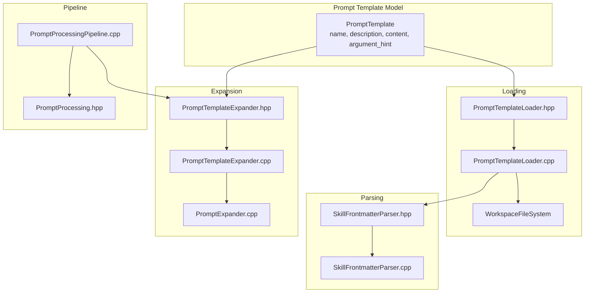
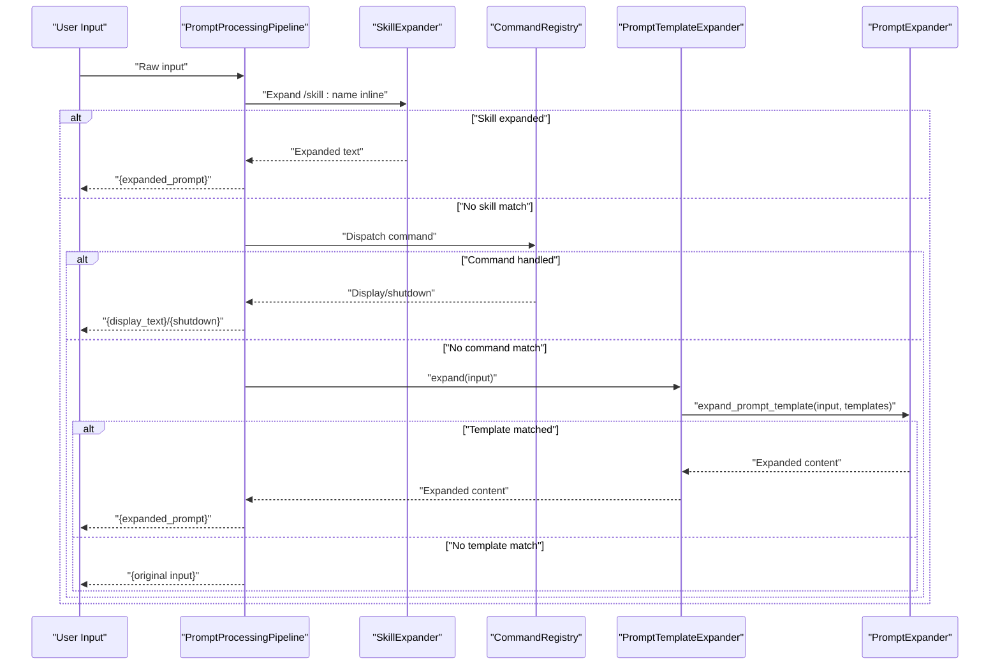
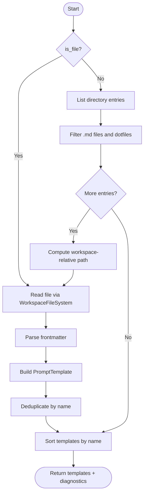
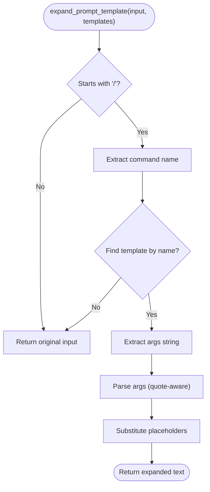
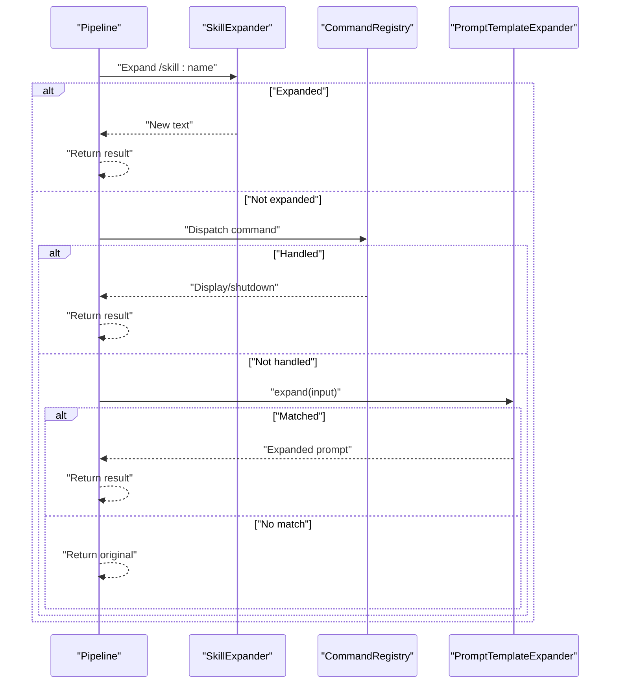
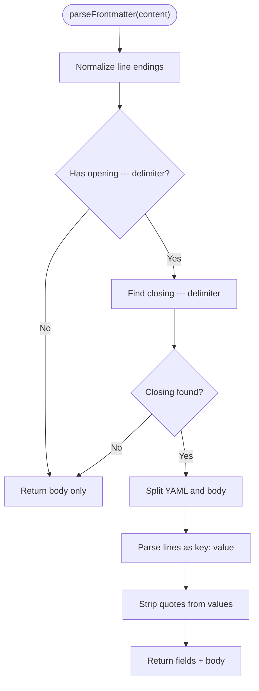
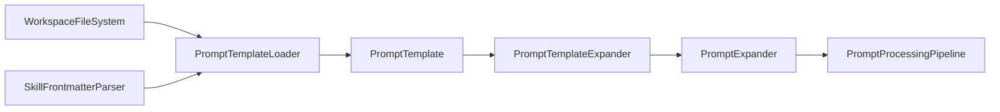

# Prompt Templates

<cite>
**Referenced Files in This Document**
- [PromptTemplate.hpp](file://include/cch/coding_agent/PromptTemplate.hpp)
- [PromptTemplateLoader.hpp](file://src/coding_agent/PromptTemplateLoader.hpp)
- [PromptTemplateLoader.cpp](file://src/coding_agent/PromptTemplateLoader.cpp)
- [PromptTemplateExpander.hpp](file://include/cch/coding_agent/PromptTemplateExpander.hpp)
- [PromptTemplateExpander.cpp](file://src/coding_agent/PromptTemplateExpander.cpp)
- [PromptExpander.cpp](file://src/coding_agent/PromptExpander.cpp)
- [PromptProcessing.hpp](file://include/cch/coding_agent/PromptProcessing.hpp)
- [PromptProcessingPipeline.cpp](file://src/coding_agent/PromptProcessingPipeline.cpp)
- [SkillFrontmatterParser.hpp](file://src/coding_agent/SkillFrontmatterParser.hpp)
- [SkillFrontmatterParser.cpp](file://src/coding_agent/SkillFrontmatterParser.cpp)
- [PromptTemplateLoaderTest.cpp](file://tests/coding_agent/PromptTemplateLoaderTest.cpp)
- [PromptExpanderTest.cpp](file://tests/coding_agent/PromptExpanderTest.cpp)
</cite>

## Table of Contents
1. [Introduction](#introduction)
2. [Project Structure](#project-structure)
3. [Core Components](#core-components)
4. [Architecture Overview](#architecture-overview)
5. [Detailed Component Analysis](#detailed-component-analysis)
6. [Dependency Analysis](#dependency-analysis)
7. [Performance Considerations](#performance-considerations)
8. [Troubleshooting Guide](#troubleshooting-guide)
9. [Conclusion](#conclusion)
10. [Appendices](#appendices)

## Introduction
This document explains the prompt template system used to define, load, parse, and expand reusable prompt fragments. It covers:
- How templates are represented and loaded from project resources and explicit files
- How YAML frontmatter is parsed to extract metadata and content
- How templates are expanded with dynamic arguments using a bash-style substitution syntax
- How the template expansion integrates into the prompt processing pipeline and influences agent behavior
- Validation, diagnostics, error handling, and debugging techniques

## Project Structure
The prompt template system spans several headers and implementations under the coding_agent module and integrates with the prompt processing pipeline and frontmatter parsing utilities.

**Diagram sources**
- [PromptTemplate.hpp:8-15](file://include/cch/coding_agent/PromptTemplate.hpp#L8-L15)
- [PromptTemplateLoader.hpp:39-64](file://src/coding_agent/PromptTemplateLoader.hpp#L39-L64)
- [PromptTemplateLoader.cpp:41-107](file://src/coding_agent/PromptTemplateLoader.cpp#L41-L107)
- [SkillFrontmatterParser.hpp:11-27](file://src/coding_agent/SkillFrontmatterParser.hpp#L11-L27)
- [SkillFrontmatterParser.cpp:67-180](file://src/coding_agent/SkillFrontmatterParser.cpp#L67-L180)
- [PromptTemplateExpander.hpp:11-21](file://include/cch/coding_agent/PromptTemplateExpander.hpp#L11-L21)
- [PromptTemplateExpander.cpp:9-17](file://src/coding_agent/PromptTemplateExpander.cpp#L9-L17)
- [PromptExpander.cpp:203-231](file://src/coding_agent/PromptExpander.cpp#L203-L231)
- [PromptProcessingPipeline.cpp:38-106](file://src/coding_agent/PromptProcessingPipeline.cpp#L38-L106)
- [PromptProcessing.hpp:37-59](file://include/cch/coding_agent/PromptProcessing.hpp#L37-L59)

**Section sources**
- [PromptTemplate.hpp:8-15](file://include/cch/coding_agent/PromptTemplate.hpp#L8-L15)
- [PromptTemplateLoader.hpp:39-64](file://src/coding_agent/PromptTemplateLoader.hpp#L39-L64)
- [PromptTemplateLoader.cpp:41-107](file://src/coding_agent/PromptTemplateLoader.cpp#L41-L107)
- [SkillFrontmatterParser.hpp:11-27](file://src/coding_agent/SkillFrontmatterParser.hpp#L11-L27)
- [SkillFrontmatterParser.cpp:67-180](file://src/coding_agent/SkillFrontmatterParser.cpp#L67-L180)
- [PromptTemplateExpander.hpp:11-21](file://include/cch/coding_agent/PromptTemplateExpander.hpp#L11-L21)
- [PromptTemplateExpander.cpp:9-17](file://src/coding_agent/PromptTemplateExpander.cpp#L9-L17)
- [PromptExpander.cpp:203-231](file://src/coding_agent/PromptExpander.cpp#L203-L231)
- [PromptProcessingPipeline.cpp:38-106](file://src/coding_agent/PromptProcessingPipeline.cpp#L38-L106)
- [PromptProcessing.hpp:37-59](file://include/cch/coding_agent/PromptProcessing.hpp#L37-L59)

## Core Components
- PromptTemplate: A passive-value container holding the template’s name, optional description, content body, and optional argument hint.
- PromptTemplateLoader: Loads templates from explicit files or directories, parsing YAML frontmatter and deduplicating by name.
- PromptTemplateExpander: Provides a simple interface to expand inputs that match a template command pattern.
- PromptExpander: Implements the core expansion logic, including argument parsing and substitution patterns.
- PromptProcessingPipeline: Integrates template expansion into the prompt processing flow alongside command dispatch and skill expansion.

Key responsibilities:
- Loading: Discover .md files, skip hidden files, parse frontmatter, build template list, sort deterministically, and emit diagnostics.
- Parsing: Extract name from filename, description and argument_hint from frontmatter fields, and body content.
- Expansion: Match command-like inputs, locate template by name, parse arguments respecting quoting, and substitute placeholders.
- Pipeline: Attempt skill expansion first, then command dispatch, then template expansion, and finally report unknown commands.

**Section sources**
- [PromptTemplate.hpp:8-15](file://include/cch/coding_agent/PromptTemplate.hpp#L8-L15)
- [PromptTemplateLoader.hpp:39-64](file://src/coding_agent/PromptTemplateLoader.hpp#L39-L64)
- [PromptTemplateLoader.cpp:41-107](file://src/coding_agent/PromptTemplateLoader.cpp#L41-L107)
- [PromptTemplateExpander.hpp:11-21](file://include/cch/coding_agent/PromptTemplateExpander.hpp#L11-L21)
- [PromptTemplateExpander.cpp:9-17](file://src/coding_agent/PromptTemplateExpander.cpp#L9-L17)
- [PromptExpander.cpp:203-231](file://src/coding_agent/PromptExpander.cpp#L203-L231)
- [PromptProcessingPipeline.cpp:38-106](file://src/coding_agent/PromptProcessingPipeline.cpp#L38-L106)

## Architecture Overview
The template system is layered:
- Data model: PromptTemplate
- Loading: PromptTemplateLoader reads files and parses frontmatter
- Expansion: PromptTemplateExpander delegates to PromptExpander
- Integration: PromptProcessingPipeline orchestrates expansion and command dispatch

**Diagram sources**
- [PromptProcessingPipeline.cpp:46-106](file://src/coding_agent/PromptProcessingPipeline.cpp#L46-L106)
- [PromptTemplateExpander.cpp:12-17](file://src/coding_agent/PromptTemplateExpander.cpp#L12-L17)
- [PromptExpander.cpp:203-231](file://src/coding_agent/PromptExpander.cpp#L203-L231)
- [PromptProcessing.hpp:45-59](file://include/cch/coding_agent/PromptProcessing.hpp#L45-L59)

## Detailed Component Analysis

### PromptTemplate
- Purpose: Lightweight, immutable descriptor of a prompt template.
- Fields:
  - name: Unique identifier derived from filename (without .md).
  - description: Optional human-readable description from frontmatter.
  - content: The template body supporting argument substitutions.
  - argument_hint: Optional hint for autocomplete UX.

Complexity:
- Storage overhead proportional to content length.
- Equality comparisons by name for deduplication.

**Section sources**
- [PromptTemplate.hpp:8-15](file://include/cch/coding_agent/PromptTemplate.hpp#L8-L15)

### PromptTemplateLoader
Responsibilities:
- Load a single .md file: read text, parse frontmatter, extract name/description/argument_hint/body, construct PromptTemplate, and collect diagnostics.
- Discover and load from directories: list entries, filter .md files, skip dotfiles, compute workspace-relative paths, and repeat per-file loading.
- Deduplicate by name across all loaded templates; first occurrence wins.
- Emit diagnostics for file info/list/read failures, parse errors, and duplicate names.
- Deterministic ordering by sorting templates by name.

Key behaviors:
- Filename-derived name stripping .md suffix.
- Frontmatter extraction supports description and argument-hint fields.
- Directory scanning is non-recursive and ignores non-files and dot-prefixed entries.

**Diagram sources**
- [PromptTemplateLoader.cpp:109-222](file://src/coding_agent/PromptTemplateLoader.cpp#L109-L222)
- [PromptTemplateLoader.hpp:39-64](file://src/coding_agent/PromptTemplateLoader.hpp#L39-L64)

**Section sources**
- [PromptTemplateLoader.cpp:41-107](file://src/coding_agent/PromptTemplateLoader.cpp#L41-L107)
- [PromptTemplateLoader.cpp:109-222](file://src/coding_agent/PromptTemplateLoader.cpp#L109-L222)
- [PromptTemplateLoader.hpp:39-64](file://src/coding_agent/PromptTemplateLoader.hpp#L39-L64)

### PromptTemplateExpander
- Purpose: Thin adapter around the core expansion function.
- Methods:
  - Constructor stores a reference to the template vector.
  - expand(input): Delegates to the free function that performs matching and substitution.

Integration:
- Used by PromptProcessingPipeline to expand template commands after skill expansion and command dispatch attempts.

**Section sources**
- [PromptTemplateExpander.hpp:11-21](file://include/cch/coding_agent/PromptTemplateExpander.hpp#L11-L21)
- [PromptTemplateExpander.cpp:9-17](file://src/coding_agent/PromptTemplateExpander.cpp#L9-L17)

### PromptExpander (Template Expansion Core)
- Input detection: Only inputs starting with '/' trigger template expansion.
- Matching: Extract command name and locate a template with matching name.
- Argument parsing: Bash-style parser supporting single/double quotes and escaping; preserves spaces inside quotes.
- Substitution patterns:
  - $1, $2, ... positional arguments
  - $@ and $ARGUMENTS for all arguments joined by spaces
  - ${N:-default}: use argument N if present, otherwise default
  - ${@:N}: slice from argument N onward
  - ${@:N:L}: slice from N with length L
- Out-of-range references yield empty segments; unmatched ${...} constructs are passed through.

**Diagram sources**
- [PromptExpander.cpp:203-231](file://src/coding_agent/PromptExpander.cpp#L203-L231)
- [PromptExpander.cpp:36-83](file://src/coding_agent/PromptExpander.cpp#L36-L83)
- [PromptExpander.cpp:97-197](file://src/coding_agent/PromptExpander.cpp#L97-L197)

**Section sources**
- [PromptExpander.cpp:203-231](file://src/coding_agent/PromptExpander.cpp#L203-L231)
- [PromptExpander.cpp:36-83](file://src/coding_agent/PromptExpander.cpp#L36-L83)
- [PromptExpander.cpp:97-197](file://src/coding_agent/PromptExpander.cpp#L97-L197)

### PromptProcessingPipeline Integration
- Attempts skill expansion first; if expanded, returns the expanded prompt without further processing.
- Otherwise trims input and detects special prefixes (e.g., shell passthrough).
- If input looks like a command, dispatches to CommandRegistry; handles display/shutdown signals.
- If no command matches, tries template expansion; if successful, returns expanded prompt for agent consumption.
- If unknown command, returns an appropriate message.

**Diagram sources**
- [PromptProcessingPipeline.cpp:46-106](file://src/coding_agent/PromptProcessingPipeline.cpp#L46-L106)

**Section sources**
- [PromptProcessingPipeline.cpp:38-106](file://src/coding_agent/PromptProcessingPipeline.cpp#L38-L106)

### Frontmatter Parsing (YAML Block)
- Parses content delimited by "---" markers.
- Treats the region between delimiters as flat key: value pairs.
- Strips quotes from values and trims whitespace.
- Returns empty frontmatter when no frontmatter block exists.
- Emits structured diagnostics for malformed frontmatter.

**Diagram sources**
- [SkillFrontmatterParser.cpp:67-180](file://src/coding_agent/SkillFrontmatterParser.cpp#L67-L180)

**Section sources**
- [SkillFrontmatterParser.hpp:11-27](file://src/coding_agent/SkillFrontmatterParser.hpp#L11-L27)
- [SkillFrontmatterParser.cpp:67-180](file://src/coding_agent/SkillFrontmatterParser.cpp#L67-L180)

## Dependency Analysis
- PromptTemplateLoader depends on:
  - WorkspaceFileSystem for IO
  - SkillFrontmatterParser for YAML frontmatter parsing
- PromptTemplateExpander depends on PromptTemplate and delegates to PromptExpander.
- PromptExpander depends on PromptTemplate and implements argument parsing and substitution.
- PromptProcessingPipeline composes SkillExpander, CommandRegistry, and PromptTemplateExpander.

**Diagram sources**
- [PromptTemplateLoader.cpp:1-10](file://src/coding_agent/PromptTemplateLoader.cpp#L1-L10)
- [PromptTemplateLoader.cpp:41-107](file://src/coding_agent/PromptTemplateLoader.cpp#L41-L107)
- [PromptTemplateExpander.cpp:12-17](file://src/coding_agent/PromptTemplateExpander.cpp#L12-L17)
- [PromptExpander.cpp:203-231](file://src/coding_agent/PromptExpander.cpp#L203-L231)
- [PromptProcessingPipeline.cpp:38-44](file://src/coding_agent/PromptProcessingPipeline.cpp#L38-L44)

**Section sources**
- [PromptTemplateLoader.cpp:1-10](file://src/coding_agent/PromptTemplateLoader.cpp#L1-L10)
- [PromptTemplateLoader.cpp:41-107](file://src/coding_agent/PromptTemplateLoader.cpp#L41-L107)
- [PromptTemplateExpander.cpp:12-17](file://src/coding_agent/PromptTemplateExpander.cpp#L12-L17)
- [PromptExpander.cpp:203-231](file://src/coding_agent/PromptExpander.cpp#L203-L231)
- [PromptProcessingPipeline.cpp:38-44](file://src/coding_agent/PromptProcessingPipeline.cpp#L38-L44)

## Performance Considerations
- Loading:
  - Directory scanning is O(N log N) due to sorting; N is the number of discovered .md files.
  - Deduplication is linear in the number of newly loaded templates against the accumulator.
- Expansion:
  - Argument parsing is linear in the length of the args string.
  - Substitution loops over the template content; worst-case O(C + A) where C is content length and A is total argument length.
- Memory:
  - Templates are stored by value; consider move semantics where applicable.
  - Expansion builds a result string; reserve strategies are used to reduce reallocations.

[No sources needed since this section provides general guidance]

## Troubleshooting Guide
Common issues and diagnostics:
- File read failures: Diagnostics include read_failed with the failing path.
- Directory listing failures: Non-fatal; only logs diagnostics for non-NotFound errors.
- Frontmatter parse errors: Diagnostics include parse_failed with a descriptive message.
- Duplicate template names: Diagnostics include duplicate_name; the first occurrence wins.
- Unknown command: After template expansion fails, the pipeline reports Unknown command.

Debugging tips:
- Verify .md filenames and frontmatter delimiters.
- Confirm template names match the command prefix exactly.
- Use test cases to validate argument parsing and substitution patterns.
- Inspect diagnostics returned during loading to identify the root cause.

**Section sources**
- [PromptTemplateLoader.cpp:56-78](file://src/coding_agent/PromptTemplateLoader.cpp#L56-L78)
- [PromptTemplateLoader.cpp:140-151](file://src/coding_agent/PromptTemplateLoader.cpp#L140-L151)
- [PromptTemplateLoader.cpp:196-210](file://src/coding_agent/PromptTemplateLoader.cpp#L196-L210)
- [PromptProcessingPipeline.cpp:68-99](file://src/coding_agent/PromptProcessingPipeline.cpp#L68-L99)
- [PromptTemplateLoaderTest.cpp:118-135](file://tests/coding_agent/PromptTemplateLoaderTest.cpp#L118-L135)
- [PromptTemplateLoaderTest.cpp:210-223](file://tests/coding_agent/PromptTemplateLoaderTest.cpp#L210-L223)
- [PromptTemplateLoaderTest.cpp:171-193](file://tests/coding_agent/PromptTemplateLoaderTest.cpp#L171-L193)

## Conclusion
The prompt template system provides a robust, extensible mechanism for defining reusable prompts with metadata, loading them from project resources, and expanding them with dynamic arguments. Its integration into the prompt processing pipeline ensures that templates can influence agent behavior by transforming user input into richer, parameterized prompts prior to command dispatch.

[No sources needed since this section summarizes without analyzing specific files]

## Appendices

### Template Syntax and Substitution Patterns
- Positional arguments: $1, $2, ...
- All arguments: $@ or $ARGUMENTS
- Default fallback: ${N:-default}
- Slicing from index: ${@:N} or ${@:N:L}
- Quoting: Single and double quotes preserve spaces and literal characters
- Escaping: Backslash escapes quotes inside double-quoted strings

Examples (descriptive):
- A greeting template with a single positional argument and default fallback
- An echo template that concatenates all arguments
- A slicing template that skips the first argument and prints the rest

**Section sources**
- [PromptExpanderTest.cpp:23-45](file://tests/coding_agent/PromptExpanderTest.cpp#L23-L45)
- [PromptExpanderTest.cpp:47-77](file://tests/coding_agent/PromptExpanderTest.cpp#L47-L77)
- [PromptExpanderTest.cpp:79-93](file://tests/coding_agent/PromptExpanderTest.cpp#L79-L93)

### Template Composition and Ordering
- Templates are sorted by name to ensure deterministic output.
- Directory scans are non-recursive; only immediate .md children are considered.
- Dot-prefixed entries are skipped to avoid hidden templates.

**Section sources**
- [PromptTemplateLoader.cpp:154-157](file://src/coding_agent/PromptTemplateLoader.cpp#L154-L157)
- [PromptTemplateLoader.cpp:158-171](file://src/coding_agent/PromptTemplateLoader.cpp#L158-L171)
- [PromptTemplateLoader.cpp:217-219](file://src/coding_agent/PromptTemplateLoader.cpp#L217-L219)