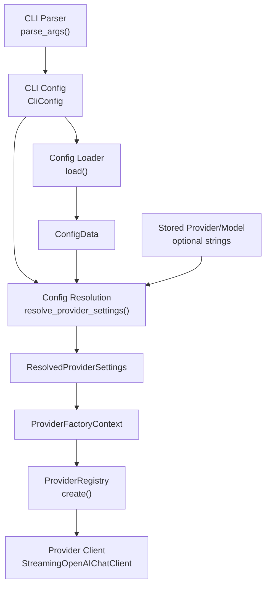
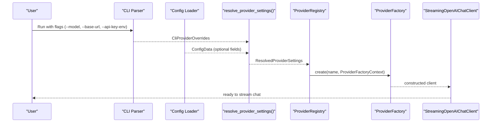
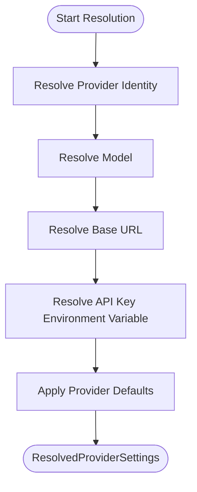
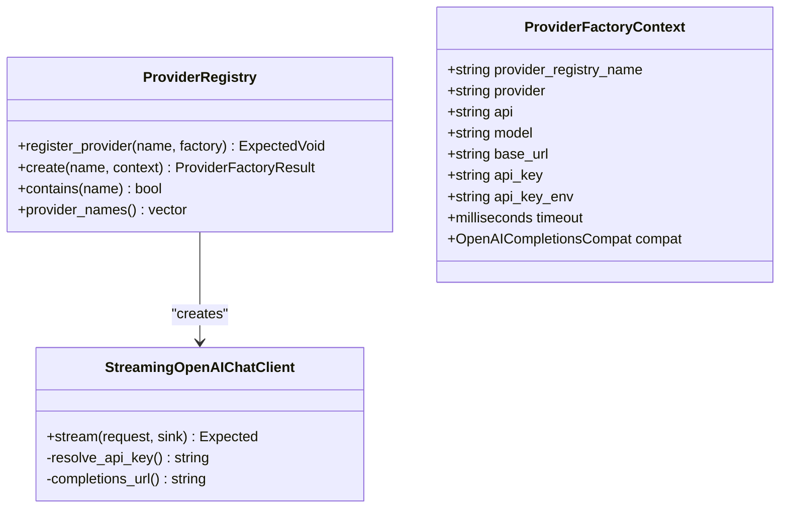
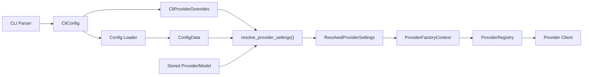

# Provider Configuration

<cite>
**Referenced Files in This Document**
- [Config.hpp](file://include/cch/coding_agent/Config.hpp)
- [ProviderConfigResolution.cpp](file://src/coding_agent/ProviderConfigResolution.cpp)
- [ConfigLoader.cpp](file://src/coding_agent/ConfigLoader.cpp)
- [CliParse.cpp](file://src/cli/CliParse.cpp)
- [CliConfig.hpp](file://src/cli/CliConfig.hpp)
- [ProviderRegistry.hpp](file://include/cch/ai/ProviderRegistry.hpp)
- [ProviderRegistry.cpp](file://src/ai/ProviderRegistry.cpp)
- [OpenAIChatClient.hpp](file://include/cch/ai/providers/OpenAIChatClient.hpp)
- [main.cpp](file://src/main.cpp)
- [ProviderConfigResolutionTest.cpp](file://tests/coding_agent/ProviderConfigResolutionTest.cpp)
- [ConfigLoaderTest.cpp](file://tests/coding_agent/ConfigLoaderTest.cpp)
</cite>

## Table of Contents
1. [Introduction](#introduction)
2. [Project Structure](#project-structure)
3. [Core Components](#core-components)
4. [Architecture Overview](#architecture-overview)
5. [Detailed Component Analysis](#detailed-component-analysis)
6. [Dependency Analysis](#dependency-analysis)
7. [Performance Considerations](#performance-considerations)
8. [Troubleshooting Guide](#troubleshooting-guide)
9. [Conclusion](#conclusion)

## Introduction
This document explains the provider configuration system used to select and initialize AI providers. It covers how provider settings are resolved across multiple layers (CLI overrides, session-stored values, config file, and provider defaults), how environment variables are used for API keys, and how the final configuration is transformed into a provider-ready structure. It also documents the provider registry integration and error handling for invalid configurations and missing API keys.

## Project Structure
The provider configuration pipeline spans several modules:
- CLI parsing and configuration capture
- Configuration loading from a user JSON file
- Resolution of provider settings and API key environment chains
- Provider registry creation and initialization
- Provider-specific client configuration

**Diagram sources**
- [CliParse.cpp:64-179](file://src/cli/CliParse.cpp#L64-L179)
- [CliConfig.hpp:12-30](file://src/cli/CliConfig.hpp#L12-L30)
- [ConfigLoader.cpp:11-119](file://src/coding_agent/ConfigLoader.cpp#L11-L119)
- [Config.hpp:15-76](file://include/cch/coding_agent/Config.hpp#L15-L76)
- [ProviderConfigResolution.cpp:35-95](file://src/coding_agent/ProviderConfigResolution.cpp#L35-L95)
- [ProviderRegistry.hpp:21-51](file://include/cch/ai/ProviderRegistry.hpp#L21-L51)
- [ProviderRegistry.cpp:26-83](file://src/ai/ProviderRegistry.cpp#L26-L83)
- [OpenAIChatClient.hpp:13-40](file://include/cch/ai/providers/OpenAIChatClient.hpp#L13-L40)

**Section sources**
- [main.cpp:7-32](file://src/main.cpp#L7-L32)
- [CliParse.cpp:64-179](file://src/cli/CliParse.cpp#L64-L179)
- [ConfigLoader.cpp:11-119](file://src/coding_agent/ConfigLoader.cpp#L11-L119)
- [ProviderConfigResolution.cpp:35-95](file://src/coding_agent/ProviderConfigResolution.cpp#L35-L95)
- [ProviderRegistry.cpp:26-83](file://src/ai/ProviderRegistry.cpp#L26-L83)

## Core Components
- ConfigData: Holds optional fields loaded from the user config file. These include provider identity, model, base URL, API key environment variable chain, and project resource controls.
- CliProviderOverrides: Captures CLI-provided overrides for provider-facing settings (model, base URL, API key environment variable).
- ResolvedProviderSettings: Finalized provider configuration produced by resolving the priority hierarchy. Includes registry name, provider identity, API type, model, base URL, and API key environment variable.
- ConfigLoader: Loads JSON configuration, parses known fields, and resolves API key values from environment variables.
- ProviderRegistry: Maps registry names to provider factories and constructs provider clients with a ProviderFactoryContext.

**Section sources**
- [Config.hpp:15-76](file://include/cch/coding_agent/Config.hpp#L15-L76)
- [ConfigLoader.cpp:11-119](file://src/coding_agent/ConfigLoader.cpp#L11-L119)
- [ProviderRegistry.hpp:21-51](file://include/cch/ai/ProviderRegistry.hpp#L21-L51)

## Architecture Overview
The configuration resolution follows a strict priority order:
1. CLI overrides (explicit flags)
2. Session-stored provider/model (when resuming)
3. Config file values
4. Built-in provider defaults

API key resolution supports a chain of environment variables, preferring the first set and non-empty value.

**Diagram sources**
- [CliParse.cpp:64-179](file://src/cli/CliParse.cpp#L64-L179)
- [ConfigLoader.cpp:11-119](file://src/coding_agent/ConfigLoader.cpp#L11-L119)
- [ProviderConfigResolution.cpp:35-95](file://src/coding_agent/ProviderConfigResolution.cpp#L35-L95)
- [ProviderRegistry.cpp:26-83](file://src/ai/ProviderRegistry.cpp#L26-L83)
- [OpenAIChatClient.hpp:26-40](file://include/cch/ai/providers/OpenAIChatClient.hpp#L26-L40)

## Detailed Component Analysis

### ConfigData and ConfigLoader
ConfigData encapsulates optional fields that can be supplied by the user via a JSON file. ConfigLoader.load reads the file, validates JSON, and extracts known fields while ignoring unknown keys. It supports:
- provider: provider identity string
- model: model name string
- base_url: base URL string
- api_key_env: single string or array of environment variable names forming a resolution chain
- default_project_trust: validation-enforced string mapped to an enum
- project_resources.skills: validation-enforced string mapped to an enum

ConfigLoader.resolve_api_key returns the value of the first environment variable in the chain that is set and non-empty, or nullopt if none are set.

Practical notes:
- Nonexistent or unreadable config files produce default-constructed ConfigData (no errors).
- Malformed JSON produces a parse error.
- Unknown keys are ignored for forward compatibility.

**Section sources**
- [Config.hpp:15-25](file://include/cch/coding_agent/Config.hpp#L15-L25)
- [ConfigLoader.cpp:11-119](file://src/coding_agent/ConfigLoader.cpp#L11-L119)
- [ConfigLoaderTest.cpp:11-126](file://tests/coding_agent/ConfigLoaderTest.cpp#L11-L126)

### CLI Overrides and Provider Settings Resolution
The CLI exposes three provider-related flags:
- --model: sets the model name
- --base-url: sets the provider base URL
- --api-key-env: sets the environment variable name used to fetch the API key

These are captured into CliProviderOverrides and later merged with session-stored values and ConfigData to form ResolvedProviderSettings.

The resolution algorithm:
- Provider identity: CLI overrides take precedence; otherwise session-stored provider identity is used; otherwise config.provider; otherwise a default identity for the selected registry name.
- Model: CLI overrides; otherwise session-stored model; otherwise config.model; otherwise provider-specific default.
- Base URL: CLI overrides; otherwise config.base_url; otherwise a default base URL.
- API key environment variable: CLI overrides; otherwise config.api_key_env; otherwise a default environment variable name.

Additionally, resolved_api_key_env_chain returns the effective environment variable chain used for API key lookup.

**Diagram sources**
- [ProviderConfigResolution.cpp:35-95](file://src/coding_agent/ProviderConfigResolution.cpp#L35-L95)

**Section sources**
- [CliParse.cpp:102-106](file://src/cli/CliParse.cpp#L102-L106)
- [CliConfig.hpp:27](file://src/cli/CliConfig.hpp#L27)
- [ProviderConfigResolution.cpp:35-95](file://src/coding_agent/ProviderConfigResolution.cpp#L35-L95)
- [ProviderConfigResolutionTest.cpp:18-100](file://tests/coding_agent/ProviderConfigResolutionTest.cpp#L18-L100)

### API Key Resolution Chain
Two mechanisms are involved:
- resolved_api_key_env_chain: determines which environment variable name is used for API key lookup based on CLI and config precedence.
- ConfigLoader::resolve_api_key: resolves the actual API key value by scanning the environment variable chain and returning the first set and non-empty value.

Behavior:
- If CLI specifies --api-key-env, that single variable name is used.
- Otherwise, if config.api_key_env is present (string or array), that chain is used.
- Otherwise, a default environment variable name is used.

**Section sources**
- [ProviderConfigResolution.cpp:97-107](file://src/coding_agent/ProviderConfigResolution.cpp#L97-L107)
- [ConfigLoader.cpp:121-130](file://src/coding_agent/ConfigLoader.cpp#L121-L130)
- [ConfigLoaderTest.cpp:73-85](file://tests/coding_agent/ConfigLoaderTest.cpp#L73-L85)

### Provider Registry Integration
The provider registry maps registry names to factories that construct provider clients. The default registry registers:
- "openai-compatible": builds a streaming client with configurable base URL, model, API key, API key environment variable, and compatibility settings.
- "fake": builds a scripted fake client for offline testing.

ProviderFactoryContext carries the finalized configuration (including provider identity, API type, model, base URL, API key, API key environment variable, and timeout) into the factory.

**Diagram sources**
- [ProviderRegistry.hpp:21-51](file://include/cch/ai/ProviderRegistry.hpp#L21-L51)
- [ProviderRegistry.cpp:26-83](file://src/ai/ProviderRegistry.cpp#L26-L83)
- [OpenAIChatClient.hpp:13-40](file://include/cch/ai/providers/OpenAIChatClient.hpp#L13-L40)

**Section sources**
- [ProviderRegistry.cpp:47-83](file://src/ai/ProviderRegistry.cpp#L47-L83)
- [ProviderRegistry.hpp:40-53](file://include/cch/ai/ProviderRegistry.hpp#L40-L53)
- [OpenAIChatClient.hpp:26-40](file://include/cch/ai/providers/OpenAIChatClient.hpp#L26-L40)

### Practical Examples of Configuration Precedence
- CLI overrides model: When --model is provided, it takes precedence over config.model and stored model.
- Stored model on resume: When resuming a session, stored model can override config.model if CLI does not specify --model.
- Provider identity precedence: When using an OpenAI-compatible adapter, config.provider can change the provider identity recorded in sessions and messages, while the registry name remains "openai-compatible".
- Base URL precedence: --base-url overrides config.base_url; otherwise a default base URL is applied.
- API key environment variable precedence: --api-key-env overrides config.api_key_env; otherwise the chain from config or a default is used.

**Section sources**
- [ProviderConfigResolutionTest.cpp:18-156](file://tests/coding_agent/ProviderConfigResolutionTest.cpp#L18-L156)
- [ProviderConfigResolution.cpp:35-95](file://src/coding_agent/ProviderConfigResolution.cpp#L35-L95)

### CLI Flag Interactions
- --session and --resume are mutually exclusive.
- --mode cannot be combined with --repl.
- --mode rpc requires prompts to come from stdin and disallows positional prompts.
- A prompt is required unless --repl is used.

**Section sources**
- [CliParse.cpp:89-175](file://src/cli/CliParse.cpp#L89-L175)

## Dependency Analysis
The configuration pipeline depends on:
- CLI parsing to capture user intent
- Config file loading to supply persistent defaults
- Resolution logic to merge sources into a single configuration
- Provider registry to instantiate the appropriate client

**Diagram sources**
- [CliParse.cpp:64-179](file://src/cli/CliParse.cpp#L64-L179)
- [ConfigLoader.cpp:11-119](file://src/coding_agent/ConfigLoader.cpp#L11-L119)
- [ProviderConfigResolution.cpp:35-95](file://src/coding_agent/ProviderConfigResolution.cpp#L35-L95)
- [ProviderRegistry.cpp:26-83](file://src/ai/ProviderRegistry.cpp#L26-L83)

**Section sources**
- [main.cpp:7-32](file://src/main.cpp#L7-L32)
- [CliParse.cpp:64-179](file://src/cli/CliParse.cpp#L64-L179)
- [ConfigLoader.cpp:11-119](file://src/coding_agent/ConfigLoader.cpp#L11-L119)
- [ProviderConfigResolution.cpp:35-95](file://src/coding_agent/ProviderConfigResolution.cpp#L35-L95)
- [ProviderRegistry.cpp:26-83](file://src/ai/ProviderRegistry.cpp#L26-L83)

## Performance Considerations
- Environment variable lookups are O(n) in the length of the chain; keep chains short.
- JSON parsing occurs only when the config file exists and is readable.
- Provider instantiation defers heavy work to the client constructor; avoid unnecessary re-creations.

## Troubleshooting Guide
Common issues and resolutions:
- Missing API key:
  - Symptom: Provider fails to authenticate.
  - Cause: None of the environment variables in the resolved chain are set or are empty.
  - Fix: Set the environment variable indicated by resolved_api_key_env_chain or pass --api-key-env to override.
- Invalid config file:
  - Symptom: Parse error reported.
  - Cause: Malformed JSON.
  - Fix: Correct the JSON syntax in the config file.
- Unknown provider:
  - Symptom: Error indicating unknown provider.
  - Cause: Attempting to create a provider not registered.
  - Fix: Use a registered provider name (e.g., "openai-compatible" or "fake").
- Conflicting CLI flags:
  - Symptom: Validation error about mutually exclusive flags or invalid combinations.
  - Fix: Remove conflicting flags or adjust modes/prompts according to CLI rules.

**Section sources**
- [ConfigLoader.cpp:28-34](file://src/coding_agent/ConfigLoader.cpp#L28-L34)
- [ProviderRegistry.cpp:28-31](file://src/ai/ProviderRegistry.cpp#L28-L31)
- [CliParse.cpp:116-175](file://src/cli/CliParse.cpp#L116-L175)

## Conclusion
The provider configuration system cleanly separates concerns across CLI, session storage, config file, and provider defaults. It provides robust precedence rules, flexible API key resolution via environment variable chains, and a clear provider registry mechanism for constructing clients. By following the documented precedence and validation rules, users can reliably configure providers for both development and production scenarios.