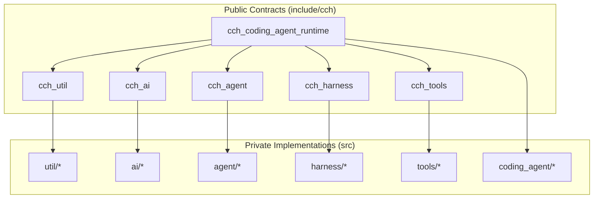
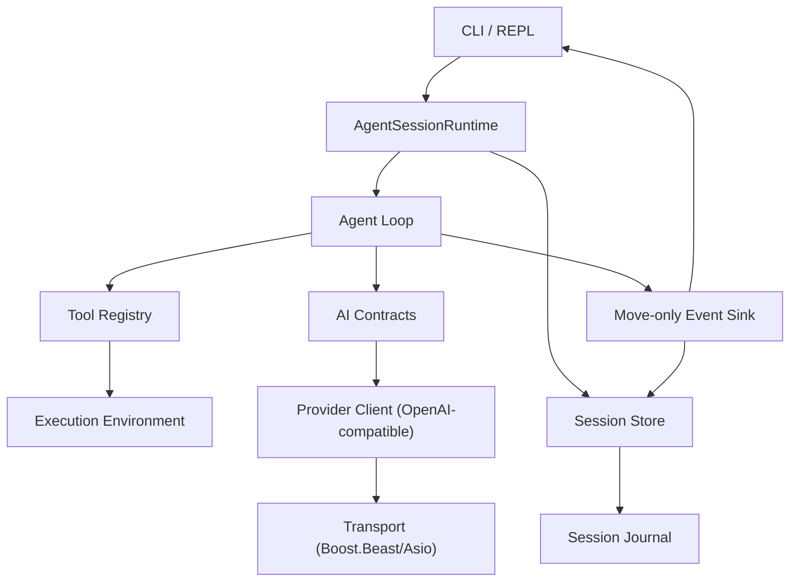
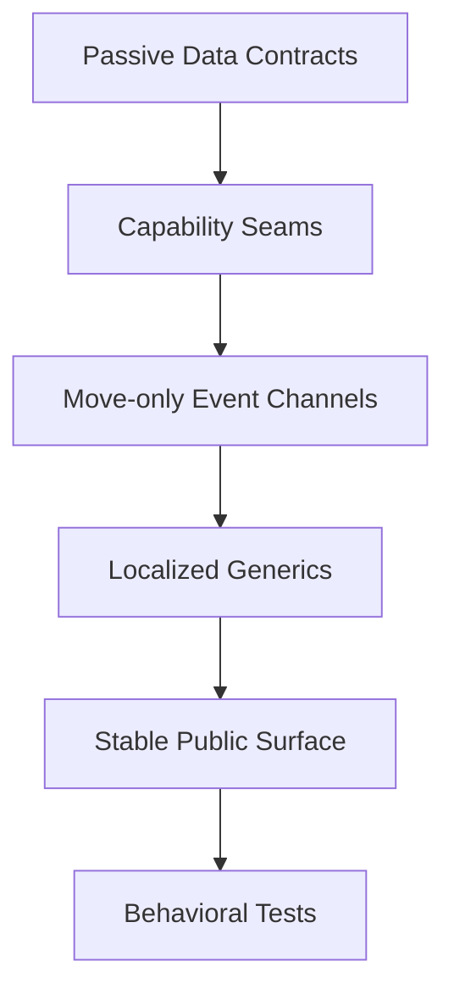

# Contributing Guidelines

<cite>
**Referenced Files in This Document**
- [README.md](file://README.md)
- [CMakeLists.txt](file://CMakeLists.txt)
- [CMakePresets.json](file://CMakePresets.json)
- [vcpkg.json](file://vcpkg.json)
- [scripts/bootstrap.sh](file://scripts/bootstrap.sh)
- [scripts/bootstrap.ps1](file://scripts/bootstrap.ps1)
- [tests/TestMain.cpp](file://tests/TestMain.cpp)
- [third_party/catch2/catch_test_macros.hpp](file://third_party/catch2/catch_test_macros.hpp)
- [docs/plans/2026-06-10-004-refactor-anti-fragile-cpp-architecture-plan.md](file://docs/plans/2026-06-10-004-refactor-anti-fragile-cpp-architecture-plan.md)
- [include/cch/util/Error.hpp](file://include/cch/util/Error.hpp)
- [include/cch/coding_agent/Sdk.hpp](file://include/cch/coding_agent/Sdk.hpp)
- [tests/architecture/PublicHeaderBoundaryTest.cpp](file://tests/architecture/PublicHeaderBoundaryTest.cpp)
- [tests/architecture/ArchitectureSurfaceScanTest.cpp](file://tests/architecture/ArchitectureSurfaceScanTest.cpp)
- [tests/agent/AsyncAgentLoopTest.cpp](file://tests/agent/AsyncAgentLoopTest.cpp)
- [tests/coding_agent/SdkSessionTest.cpp](file://tests/coding_agent/SdkSessionTest.cpp)
</cite>

## Table of Contents
1. [Introduction](#introduction)
2. [Project Structure](#project-structure)
3. [Core Components](#core-components)
4. [Architecture Overview](#architecture-overview)
5. [Development Setup](#development-setup)
6. [Code Style and Standards](#code-style-and-standards)
7. [Testing Requirements](#testing-requirements)
8. [Pull Request Process](#pull-request-process)
9. [Architectural Constraints and Anti-Fragile Principles](#architectural-constraints-and-anti-fragile-principles)
10. [Build System and CMake Presets](#build-system-and-cmake-presets)
11. [Documentation Updates](#documentation-updates)
12. [Release Process and Versioning](#release-process-and-versioning)
13. [Community Guidelines and Communication](#community-guidelines-and-communication)
14. [Troubleshooting Guide](#troubleshooting-guide)
15. [Conclusion](#conclusion)

## Introduction
This document describes how to contribute effectively to the C++ Coding Harness project. It covers development setup, dependency management, code style, testing, pull request workflow, architectural constraints aligned with anti-fragile design, build system usage with CMake presets, documentation updates, release/versioning, and community practices.

## Project Structure
The repository follows a modular CMake-based structure with a clear separation between public include contracts and private implementation sources. The main packages are:
- cch_util: error contracts, expected-style types, JSON adapter, and async process execution
- cch_ai: AI contracts, provider-neutral interfaces, provider registry, and OpenAI-compatible client
- cch_agent: agent loop, tool registry, and event contracts
- cch_harness: execution environment, session store, and workspace filesystem
- cch_tools: tool factories bridging agent contracts to harness capabilities
- cch_coding_agent_runtime: CLI, runtime orchestration, session lifecycle, and SDK surface

**Diagram sources**
- [CMakeLists.txt:1-212](file://CMakeLists.txt#L1-L212)

**Section sources**
- [CMakeLists.txt:1-212](file://CMakeLists.txt#L1-L212)
- [README.md:135-151](file://README.md#L135-L151)

## Core Components
- Anti-fragile architecture rules drive the design: passive data contracts, capability seams, move-only event sinks, and localized generic machinery.
- The SDK provides an embeddable C++23 surface for host applications to integrate the agent loop without shelling out to the CLI.
- Tests validate architecture guardrails, public header boundaries, and behavior correctness across agent, AI, harness, tools, and CLI surfaces.

**Section sources**
- [docs/plans/2026-06-10-004-refactor-anti-fragile-cpp-architecture-plan.md:1-464](file://docs/plans/2026-06-10-004-refactor-anti-fragile-cpp-architecture-plan.md#L1-L464)
- [include/cch/coding_agent/Sdk.hpp:1-347](file://include/cch/coding_agent/Sdk.hpp#L1-L347)

## Architecture Overview
The system is organized as layered capability seams with passive data contracts at the center. Providers, execution environments, and tools are replaceable interfaces behind headers. Events use move-only sinks to avoid shared ownership. Serialization and provider DTOs are isolated to implementation layers.

**Diagram sources**
- [docs/plans/2026-06-10-004-refactor-anti-fragile-cpp-architecture-plan.md:79-121](file://docs/plans/2026-06-10-004-refactor-anti-fragile-cpp-architecture-plan.md#L79-L121)

**Section sources**
- [docs/plans/2026-06-10-004-refactor-anti-fragile-cpp-architecture-plan.md:79-121](file://docs/plans/2026-06-10-004-refactor-anti-fragile-cpp-architecture-plan.md#L79-L121)

## Development Setup
- Compiler and toolchain: C++23-capable compiler; CMake 3.25+; CTest enabled by default.
- Dependencies are managed via vcpkg manifest mode or system packages. The project declares CLI11, Glaze, Boost.Asio/Beast, OpenSSL, and Catch2 in vcpkg.json.
- Bootstrap scripts automate vcpkg setup and CMake configuration for both Linux/macOS and Windows.

Key steps:
- Use the bootstrap script to configure with vcpkg preset, optionally build and test.
- Alternatively, configure with the system preset if dependencies are installed system-wide.
- Presets support Debug and Release configurations.

**Section sources**
- [README.md:21-87](file://README.md#L21-L87)
- [vcpkg.json:1-15](file://vcpkg.json#L1-L15)
- [CMakePresets.json:1-72](file://CMakePresets.json#L1-L72)
- [scripts/bootstrap.sh:1-130](file://scripts/bootstrap.sh#L1-L130)

## Code Style and Standards
- Language standard: C++23 with CMake setting CMAKE_CXX_STANDARD to 23.
- Compile-time warnings: -Wall -Wextra -Wpedantic applied consistently across targets.
- Error handling: std::expected-based contracts with a dedicated Error type and error code enumeration.
- Public headers: Must compile from include only; private headers and implementation details are excluded from public include paths.
- Architecture tests: Guardrails enforced by dedicated tests ensuring public/private boundaries and absence of legacy tokens.

Recommended practices:
- Keep public APIs as passive value contracts and capability interfaces.
- Isolate templates and generic machinery inside implementation files or private namespaces.
- Use move-only event sinks to prevent shared ownership and improve lifetime safety.
- Avoid exposing provider DTOs, Boost.JSON, or legacy result wrappers in public headers.

**Section sources**
- [CMakeLists.txt:9-31](file://CMakeLists.txt#L9-L31)
- [include/cch/util/Error.hpp:1-76](file://include/cch/util/Error.hpp#L1-L76)
- [tests/architecture/PublicHeaderBoundaryTest.cpp:1-65](file://tests/architecture/PublicHeaderBoundaryTest.cpp#L1-L65)
- [tests/architecture/ArchitectureSurfaceScanTest.cpp:1-175](file://tests/architecture/ArchitectureSurfaceScanTest.cpp#L1-L175)

## Testing Requirements
- Test framework: Catch2-compatible lightweight macros and a minimal test harness entry point.
- Test categories: Architecture guardrails, AI contracts, agent loop, provider transport, tools, harness, CLI, and SDK.
- Running tests: Use CTest presets or filter by tags to run subsets (e.g., architecture, ai, agent, tools, harness, cli).
- Live provider tests: Optional and opt-in; default suite avoids live network calls.

Guidelines for adding tests:
- Place new tests under tests/<area>/ with appropriate tags.
- Validate architecture invariants alongside functional behavior.
- Prefer fake providers and controlled environments to avoid flakiness.
- Include both positive and negative cases (e.g., malformed inputs, error propagation).

**Section sources**
- [tests/TestMain.cpp:1-6](file://tests/TestMain.cpp#L1-L6)
- [third_party/catch2/catch_test_macros.hpp:1-71](file://third_party/catch2/catch_test_macros.hpp#L1-L71)
- [README.md:282-302](file://README.md#L282-L302)
- [tests/architecture/ArchitectureSurfaceScanTest.cpp:62-175](file://tests/architecture/ArchitectureSurfaceScanTest.cpp#L62-L175)

## Pull Request Process
- Branching: Create feature branches from the latest main.
- Commit hygiene: Keep commits focused; reference related issues and docs.
- Tests: Ensure all relevant tests pass locally using CTest presets.
- Review criteria:
  - Adherence to anti-fragile architecture rules (passive contracts, capability seams, move-only events, localized generics).
  - Public header boundary compliance and absence of legacy tokens.
  - Clear, minimal diffs that preserve the experimental, non-compatible posture.
  - Documentation and examples updated as needed.
- Merge requirements:
  - At least one maintainer approval.
  - Passing CI checks and tests.
  - No regressions in architecture guardrail tests.

**Section sources**
- [docs/plans/2026-06-10-004-refactor-anti-fragile-cpp-architecture-plan.md:445-464](file://docs/plans/2026-06-10-004-refactor-anti-fragile-cpp-architecture-plan.md#L445-L464)
- [tests/architecture/PublicHeaderBoundaryTest.cpp:32-65](file://tests/architecture/PublicHeaderBoundaryTest.cpp#L32-L65)

## Architectural Constraints and Anti-Fragile Principles
Anti-fragile rules implemented in this project:
- Passive value contracts: Structs, std::variant alternatives, std::expected failures.
- Capability seams: Replaceable interfaces or concrete implementations hidden behind headers.
- Weak event connections: Move-only callback semantics for event sinks.
- Localized generic machinery: Templates and Concepts remain in implementation layers.

Validation:
- ArchitectureSurfaceScanTest and PublicHeaderBoundaryTest enforce compile-time and surface-level constraints.
- AsyncAgentLoopTest and SdkSessionTest demonstrate behavior correctness under the architectural rules.

**Diagram sources**
- [docs/plans/2026-06-10-004-refactor-anti-fragile-cpp-architecture-plan.md:29-72](file://docs/plans/2026-06-10-004-refactor-anti-fragile-cpp-architecture-plan.md#L29-L72)
- [tests/architecture/ArchitectureSurfaceScanTest.cpp:81-175](file://tests/architecture/ArchitectureSurfaceScanTest.cpp#L81-L175)

**Section sources**
- [docs/plans/2026-06-10-004-refactor-anti-fragile-cpp-architecture-plan.md:29-72](file://docs/plans/2026-06-10-004-refactor-anti-fragile-cpp-architecture-plan.md#L29-L72)
- [tests/architecture/ArchitectureSurfaceScanTest.cpp:81-175](file://tests/architecture/ArchitectureSurfaceScanTest.cpp#L81-L175)

## Build System and CMake Presets
- CMake minimum version 3.25; C++23 standard; warnings enabled.
- Targets:
  - cch_util, cch_ai, cch_agent, cch_harness, cch_tools, cch_coding_agent_runtime
  - cpp_harness (executable) and cpp_harness_tests (test executable)
- Presets:
  - vcpkg: manifest mode with vcpkg toolchain
  - vcpkg-release: Release build preset
  - system: uses system-installed dependencies

Usage:
- Configure with cmake --preset <preset>
- Build with cmake --build --preset <preset>
- Test with ctest --preset <preset>

**Section sources**
- [CMakeLists.txt:1-212](file://CMakeLists.txt#L1-L212)
- [CMakePresets.json:1-72](file://CMakePresets.json#L1-L72)

## Documentation Updates
- Update README.md for user-facing changes, examples, and CLI usage.
- Keep architecture notes aligned with anti-fragile refactors; document removed compatibility surfaces.
- For SDK changes, update include/cch/coding_agent/Sdk.hpp usage examples and behavior notes.

**Section sources**
- [README.md:1-308](file://README.md#L1-L308)
- [docs/plans/2026-06-10-004-refactor-anti-fragile-cpp-architecture-plan.md:445-464](file://docs/plans/2026-06-10-004-refactor-anti-fragile-cpp-architecture-plan.md#L445-L464)

## Release Process and Versioning
- Version: The project uses a version-string in vcpkg.json; maintain semantic versioning discipline.
- Baseline: vcpkg builtin-baseline is pinned to ensure reproducible dependency builds.
- Release workflow:
  - Tag releases after completing planned milestones.
  - Update vcpkg.json version-string and baseline as needed.
  - Publish artifacts and update README examples accordingly.

**Section sources**
- [vcpkg.json:1-15](file://vcpkg.json#L1-L15)

## Community Guidelines and Communication
- The project is experimental and non-compatible; breaking changes may occur to simplify the architecture.
- Use GitHub Issues for bug reports and feature proposals.
- Keep discussions focused on architectural alignment with anti-fragile principles and minimal, test-backed changes.

**Section sources**
- [README.md:1-19](file://README.md#L1-L19)

## Troubleshooting Guide
Common setup and build issues:
- Missing dependencies: Use the vcpkg bootstrap script or install system packages as described in README.
- CMake cache conflicts: The bootstrap script clears stale caches when switching between vcpkg and system presets.
- Live provider failures: Use fake provider examples and architecture tests to validate without network calls.
- Test failures: Run filtered test suites by category to isolate issues.

**Section sources**
- [scripts/bootstrap.sh:101-127](file://scripts/bootstrap.sh#L101-L127)
- [README.md:115-134](file://README.md#L115-L134)

## Conclusion
Contributions should prioritize architectural simplicity, testability, and adherence to anti-fragile principles. Follow the setup and testing procedures, update documentation, and coordinate with maintainers for significant changes. Together we can evolve a robust, replaceable, and minimal C++ coding harness.