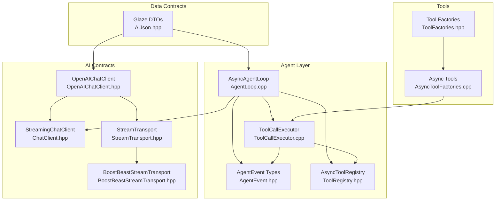
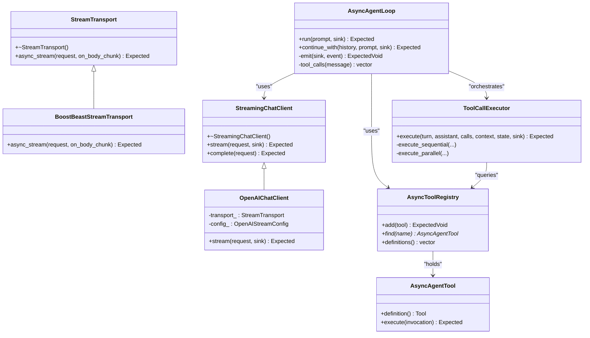
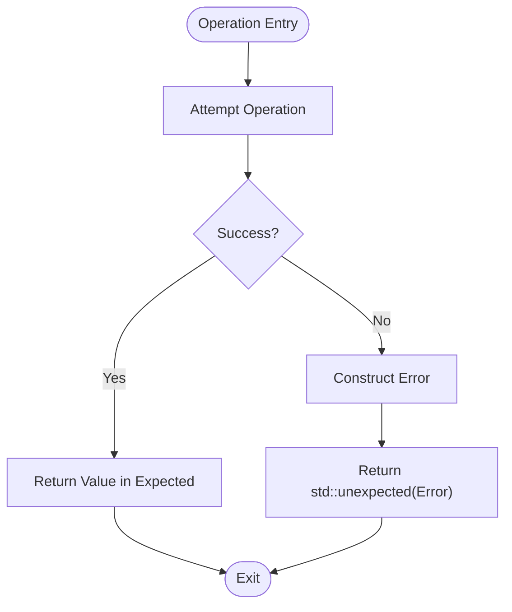
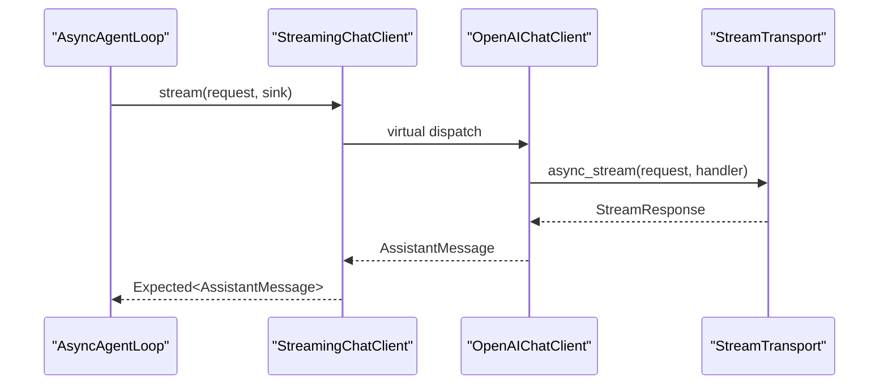
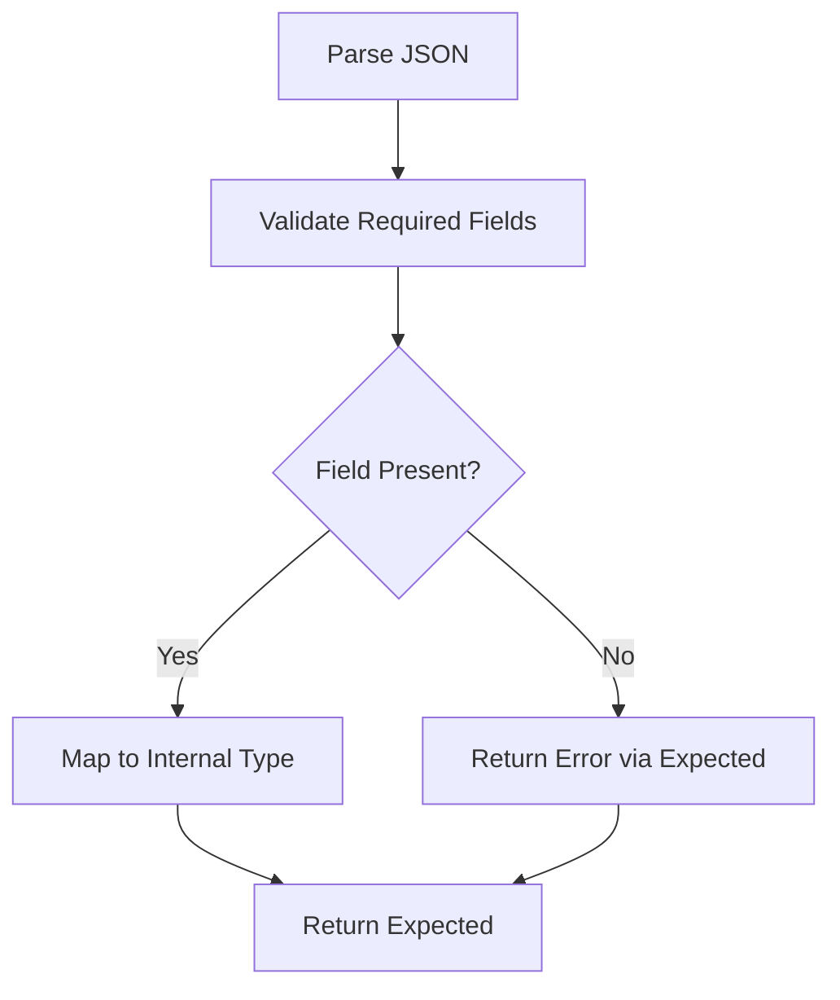
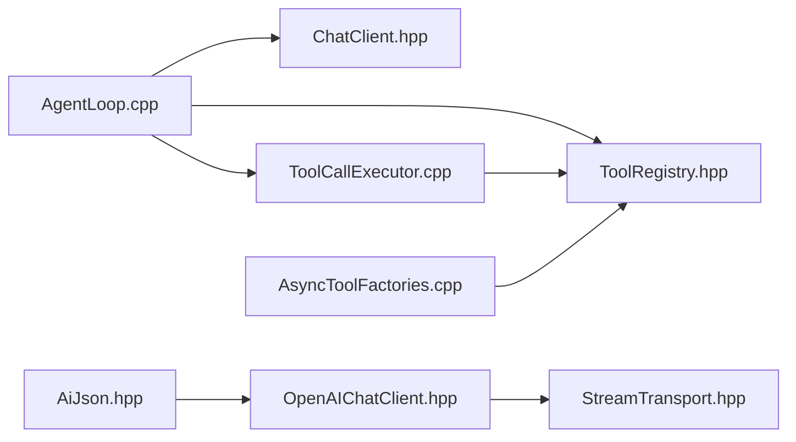

# Core Concepts

<cite>
**Referenced Files in This Document**
- [AgentLoop.hpp](file://include/cch/agent/AgentLoop.hpp)
- [AgentLoop.cpp](file://src/agent/AgentLoop.cpp)
- [AgentEvent.hpp](file://include/cch/agent/AgentEvent.hpp)
- [Error.hpp](file://include/cch/util/Error.hpp)
- [ExpectedMacros.hpp](file://src/util/ExpectedMacros.hpp)
- [ChatClient.hpp](file://include/cch/ai/ChatClient.hpp)
- [OpenAIChatClient.hpp](file://include/cch/ai/providers/OpenAIChatClient.hpp)
- [StreamTransport.hpp](file://include/cch/ai/providers/StreamTransport.hpp)
- [BoostBeastStreamTransport.hpp](file://src/ai/providers/BoostBeastStreamTransport.hpp)
- [AiJson.hpp](file://src/ai/glaze/AiJson.hpp)
- [ToolRegistry.hpp](file://include/cch/agent/ToolRegistry.hpp)
- [ToolCallExecutor.hpp](file://src/agent/ToolCallExecutor.hpp)
- [ToolCallExecutor.cpp](file://src/agent/ToolCallExecutor.cpp)
- [ToolFactories.hpp](file://include/cch/tools/ToolFactories.hpp)
- [AsyncToolFactories.cpp](file://src/tools/AsyncToolFactories.cpp)
</cite>

## Table of Contents
1. [Introduction](#introduction)
2. [Project Structure](#project-structure)
3. [Core Components](#core-components)
4. [Architecture Overview](#architecture-overview)
5. [Detailed Component Analysis](#detailed-component-analysis)
6. [Dependency Analysis](#dependency-analysis)
7. [Performance Considerations](#performance-considerations)
8. [Troubleshooting Guide](#troubleshooting-guide)
9. [Conclusion](#conclusion)

## Introduction
This document explains the anti-fragile architecture principles implemented in the C++ Coding Harness. It focuses on:
- Passive data contracts: aggregate-friendly structs, variant-based message modeling, and structured error propagation via std::expected.
- Replaceable capability seams: pluggable chat clients, stream transports, and execution environments.
- Weak event connections: move-only callback semantics for event sinks to avoid shared ownership.
- Localized generic machinery: Glaze-based DTOs and schema conversion layered in implementation files.

These patterns collectively enable flexibility, safety, and resilience across agent loops, tool execution, and provider integrations.

## Project Structure
The core concepts span several layers:
- Agent orchestration and events: agent loop, lifecycle events, and tool execution coordination.
- AI contracts and streaming: chat client interface, streaming request/response, and SSE parsing.
- Transport abstraction: pluggable network transport for streaming requests.
- Data contracts: Glaze DTOs and schema conversion for robust serialization/deserialization.
- Tools and execution: async tool registry, executor, and built-in tools backed by an execution environment.



**Diagram sources**
- [AgentLoop.cpp:240-531](file://src/agent/AgentLoop.cpp#L240-L531)
- [AgentEvent.hpp:91-110](file://include/cch/agent/AgentEvent.hpp#L91-L110)
- [ToolRegistry.hpp:13-48](file://include/cch/agent/ToolRegistry.hpp#L13-L48)
- [ToolCallExecutor.cpp:120-143](file://src/agent/ToolCallExecutor.cpp#L120-L143)
- [ChatClient.hpp:23-34](file://include/cch/ai/ChatClient.hpp#L23-L34)
- [OpenAIChatClient.hpp:26-40](file://include/cch/ai/providers/OpenAIChatClient.hpp#L26-L40)
- [StreamTransport.hpp:35-42](file://include/cch/ai/providers/StreamTransport.hpp#L35-L42)
- [BoostBeastStreamTransport.hpp:7-12](file://src/ai/providers/BoostBeastStreamTransport.hpp#L7-L12)
- [AiJson.hpp:103-108](file://src/ai/glaze/AiJson.hpp#L103-L108)
- [ToolFactories.hpp:10-14](file://include/cch/tools/ToolFactories.hpp#L10-L14)
- [AsyncToolFactories.cpp:404-420](file://src/tools/AsyncToolFactories.cpp#L404-L420)

**Section sources**
- [AgentLoop.hpp:16-36](file://include/cch/agent/AgentLoop.hpp#L16-L36)
- [AgentEvent.hpp:91-110](file://include/cch/agent/AgentEvent.hpp#L91-L110)
- [ChatClient.hpp:23-34](file://include/cch/ai/ChatClient.hpp#L23-L34)
- [StreamTransport.hpp:35-42](file://include/cch/ai/providers/StreamTransport.hpp#L35-L42)
- [AiJson.hpp:103-108](file://src/ai/glaze/AiJson.hpp#L103-L108)
- [ToolRegistry.hpp:13-48](file://include/cch/agent/ToolRegistry.hpp#L13-L48)
- [ToolCallExecutor.hpp:31-62](file://src/agent/ToolCallExecutor.hpp#L31-L62)
- [ToolFactories.hpp:10-14](file://include/cch/tools/ToolFactories.hpp#L10-L14)

## Core Components
This section outlines the foundational building blocks that embody anti-fragile principles.

- Passive data contracts
  - Aggregate-friendly structs: message roles, content variants, and usage/usage-cost DTOs are designed as plain data aggregates suitable for construction, copying, and variant visits.
  - Variant-based modeling: messages and content are modeled as std::variant types, enabling extensible yet safe dispatch without dynamic_cast or virtual inheritance.
  - Structured error propagation: util::Expected<T, Error> centralizes error handling across the pipeline, ensuring failures are explicit and carry rich context.

- Replaceable capability seams
  - StreamingChatClient defines a pure virtual streaming interface; implementations (e.g., OpenAI) depend on pluggable StreamTransport for network I/O.
  - Tool execution depends on AsyncToolRegistry and AsyncAgentTool implementations, allowing different tool sets and execution modes.

- Weak event connections
  - AgentEventSink is a std::move_only_function<util::ExpectedVoid(const AgentLifecycleEvent&)>, enforcing move-only semantics so subscribers retain ownership without shared_ptr overhead.

- Localized generic machinery
  - Glaze DTOs encapsulate schema conversion and validation close to the boundary, keeping internal message types clean while enabling robust JSON interchange.

**Section sources**
- [AgentEvent.hpp:12-106](file://include/cch/agent/AgentEvent.hpp#L12-L106)
- [Error.hpp:25-35](file://include/cch/util/Error.hpp#L25-L35)
- [ChatClient.hpp:21-34](file://include/cch/ai/ChatClient.hpp#L21-L34)
- [StreamTransport.hpp:15-42](file://include/cch/ai/providers/StreamTransport.hpp#L15-L42)
- [AiJson.hpp:21-101](file://src/ai/glaze/AiJson.hpp#L21-L101)
- [ToolRegistry.hpp:21-44](file://include/cch/agent/ToolRegistry.hpp#L21-L44)

## Architecture Overview
The anti-fragile architecture separates concerns into composable, replaceable parts while preserving strong contracts and predictable error handling.



**Diagram sources**
- [ChatClient.hpp:23-34](file://include/cch/ai/ChatClient.hpp#L23-L34)
- [OpenAIChatClient.hpp:26-40](file://include/cch/ai/providers/OpenAIChatClient.hpp#L26-L40)
- [StreamTransport.hpp:35-42](file://include/cch/ai/providers/StreamTransport.hpp#L35-L42)
- [BoostBeastStreamTransport.hpp:7-12](file://src/ai/providers/BoostBeastStreamTransport.hpp#L7-L12)
- [AgentLoop.cpp:240-531](file://src/agent/AgentLoop.cpp#L240-L531)
- [ToolCallExecutor.hpp:31-62](file://src/agent/ToolCallExecutor.hpp#L31-L62)
- [ToolRegistry.hpp:13-48](file://include/cch/agent/ToolRegistry.hpp#L13-L48)

## Detailed Component Analysis

### Anti-Fragile Data Contracts
- Aggregate-friendly structs
  - Message and content types are designed as aggregates with straightforward constructors and members, enabling efficient composition and variant dispatch.
  - Example constructs include MessageVariant, Content variants, Usage/UsageCost DTOs, and diagnostic entries.

- std::variant alternatives
  - Messages and content are represented as std::variant types, allowing safe, exhaustive handling via std::visit and avoiding brittle inheritance hierarchies.

- std::expected failures
  - util::Expected<T, Error> wraps all operations that can fail, carrying an Error with code, message, detail, and optional context. Macros simplify coroutine error propagation.



**Diagram sources**
- [Error.hpp:25-35](file://include/cch/util/Error.hpp#L25-L35)
- [ExpectedMacros.hpp:10-27](file://src/util/ExpectedMacros.hpp#L10-L27)

**Section sources**
- [AiJson.hpp:21-101](file://src/ai/glaze/AiJson.hpp#L21-L101)
- [Error.hpp:25-73](file://include/cch/util/Error.hpp#L25-L73)
- [ExpectedMacros.hpp:10-27](file://src/util/ExpectedMacros.hpp#L10-L27)

### Replaceable Capability Seams
- Chat clients
  - StreamingChatClient defines the streaming contract; OpenAIChatClient implements it using a StreamTransport for network I/O.
  - This separation allows swapping providers or transport mechanisms without changing higher-level orchestration.

- Stream transports
  - StreamTransport abstracts HTTP streaming; BoostBeastStreamTransport provides a concrete implementation, isolating networking details.

- Execution environments
  - Tools depend on AsyncExecutionEnv via factories, enabling different execution backends (local, sandboxed, remote) without altering tool logic.



**Diagram sources**
- [AgentLoop.cpp:329-384](file://src/agent/AgentLoop.cpp#L329-L384)
- [ChatClient.hpp:27-33](file://include/cch/ai/ChatClient.hpp#L27-L33)
- [OpenAIChatClient.hpp:30-32](file://include/cch/ai/providers/OpenAIChatClient.hpp#L30-L32)
- [StreamTransport.hpp:39-41](file://include/cch/ai/providers/StreamTransport.hpp#L39-L41)

**Section sources**
- [ChatClient.hpp:23-34](file://include/cch/ai/ChatClient.hpp#L23-L34)
- [OpenAIChatClient.hpp:26-40](file://include/cch/ai/providers/OpenAIChatClient.hpp#L26-L40)
- [StreamTransport.hpp:35-42](file://include/cch/ai/providers/StreamTransport.hpp#L35-L42)
- [BoostBeastStreamTransport.hpp:7-12](file://src/ai/providers/BoostBeastStreamTransport.hpp#L7-L12)

### Weak Event Connections
- Move-only callback semantics
  - AgentEventSink is a std::move_only_function<util::ExpectedVoid(const AgentLifecycleEvent&)>, preventing accidental copying and enforcing ownership transfer.
  - The agent loop emits lifecycle events through this sink, and tool execution mirrors the pattern for tool execution events.

- Subscriber ownership without shared_ptr
  - Because the sink is move-only, subscribers can own their state and pass it into the loop without requiring shared_ptr or atomic reference counting.

```mermaid
sequenceDiagram
participant Loop as "AsyncAgentLoop"
participant Sink as "AgentEventSink"
participant Exec as "ToolCallExecutor"
Loop->>Sink : operator()(AgentStartEvent)
Loop->>Sink : operator()(TurnStartEvent)
Loop->>Exec : execute(...)
Exec->>Sink : operator()(ToolExecutionStartEvent)
Exec->>Sink : operator()(ToolExecutionEndEvent)
Loop->>Sink : operator()(AgentEndEvent)
```

**Diagram sources**
- [AgentEvent.hpp:108-110](file://include/cch/agent/AgentEvent.hpp#L108-L110)
- [AgentLoop.cpp:261-271](file://src/agent/AgentLoop.cpp#L261-L271)
- [ToolCallExecutor.cpp:157-158](file://src/agent/ToolCallExecutor.cpp#L157-L158)

**Section sources**
- [AgentEvent.hpp:108-110](file://include/cch/agent/AgentEvent.hpp#L108-L110)
- [AgentLoop.cpp:533-550](file://src/agent/AgentLoop.cpp#L533-L550)
- [ToolCallExecutor.cpp:92-109](file://src/agent/ToolCallExecutor.cpp#L92-L109)

### Localized Generic Machinery
- Glaze DTOs and schema conversion
  - AiJson.hpp defines DTOs for messages, usage, diagnostics, and tools, plus conversion helpers to/from internal types.
  - Conversion functions validate required fields and propagate errors via util::Expected, keeping schema mismatches explicit and localized.

- Implementation-layer schema conversion
  - Schema conversion remains in implementation files (e.g., AiJson.hpp), avoiding leakage of Glaze internals into public headers.



**Diagram sources**
- [AiJson.hpp:164-194](file://src/ai/glaze/AiJson.hpp#L164-L194)
- [AiJson.hpp:284-317](file://src/ai/glaze/AiJson.hpp#L284-L317)
- [AiJson.hpp:408-420](file://src/ai/glaze/AiJson.hpp#L408-L420)

**Section sources**
- [AiJson.hpp:147-194](file://src/ai/glaze/AiJson.hpp#L147-L194)
- [AiJson.hpp:284-391](file://src/ai/glaze/AiJson.hpp#L284-L391)
- [AiJson.hpp:408-514](file://src/ai/glaze/AiJson.hpp#L408-L514)

### Practical Examples: Agent Loop, Tool Execution, Provider Integration

- Agent loop orchestration
  - The loop builds an AiContext, streams assistant events via StreamingChatClient, parses tool calls, and executes tools through ToolCallExecutor.
  - Events are emitted via AgentEventSink; errors are propagated using util::Expected and CCH_TRY macros.

- Tool execution
  - ToolCallExecutor selects sequential vs. parallel execution based on tool capabilities and configuration.
  - It invokes hooks before/after tool execution, handles per-call termination signals, and emits tool execution events.

- Provider integration
  - OpenAIChatClient composes a StreamTransport to perform streaming HTTP requests and convert provider-specific responses into AssistantMessage.
  - AiJson helpers convert between provider JSON and internal message types.

```mermaid
sequenceDiagram
participant User as "Caller"
participant Loop as "AsyncAgentLoop"
participant Client as "StreamingChatClient"
participant Exec as "ToolCallExecutor"
participant Registry as "AsyncToolRegistry"
participant Tool as "AsyncAgentTool"
User->>Loop : run(user_prompt, sink)
Loop->>Client : stream(request, sink)
Client-->>Loop : AssistantMessage
Loop->>Exec : execute(turn, assistant, calls, context, state, sink)
Exec->>Registry : find(tool_name)
Registry-->>Exec : AsyncAgentTool*
Exec->>Tool : execute(invocation)
Tool-->>Exec : AsyncToolExecutionResult
Exec-->>Loop : ToolCallBatchResult
Loop-->>User : AsyncAgentRunResult
```

**Diagram sources**
- [AgentLoop.cpp:249-531](file://src/agent/AgentLoop.cpp#L249-L531)
- [ToolCallExecutor.cpp:123-143](file://src/agent/ToolCallExecutor.cpp#L123-L143)
- [ToolRegistry.hpp:29-32](file://include/cch/agent/ToolRegistry.hpp#L29-L32)
- [AsyncToolFactories.cpp:404-420](file://src/tools/AsyncToolFactories.cpp#L404-L420)

**Section sources**
- [AgentLoop.cpp:249-531](file://src/agent/AgentLoop.cpp#L249-L531)
- [ToolCallExecutor.cpp:123-250](file://src/agent/ToolCallExecutor.cpp#L123-L250)
- [OpenAIChatClient.hpp:26-40](file://include/cch/ai/providers/OpenAIChatClient.hpp#L26-L40)
- [AiJson.hpp:624-762](file://src/ai/glaze/AiJson.hpp#L624-L762)

## Dependency Analysis
Anti-fragility emerges from low coupling and high cohesion:
- Agent loop depends on StreamingChatClient and ToolCallExecutor but not on specific providers or tool implementations.
- Tool execution depends on AsyncToolRegistry and AsyncAgentTool abstractions, enabling varied tool sets.
- Data contracts are isolated behind Glaze conversions, minimizing cross-layer coupling.



**Diagram sources**
- [AgentLoop.cpp:240-531](file://src/agent/AgentLoop.cpp#L240-L531)
- [ToolCallExecutor.cpp:120-143](file://src/agent/ToolCallExecutor.cpp#L120-L143)
- [OpenAIChatClient.hpp:26-40](file://include/cch/ai/providers/OpenAIChatClient.hpp#L26-L40)
- [StreamTransport.hpp:35-42](file://include/cch/ai/providers/StreamTransport.hpp#L35-L42)
- [AiJson.hpp:103-108](file://src/ai/glaze/AiJson.hpp#L103-L108)
- [AsyncToolFactories.cpp:404-420](file://src/tools/AsyncToolFactories.cpp#L404-L420)

**Section sources**
- [AgentLoop.hpp:16-36](file://include/cch/agent/AgentLoop.hpp#L16-L36)
- [ToolRegistry.hpp:13-48](file://include/cch/agent/ToolRegistry.hpp#L13-L48)
- [ToolCallExecutor.hpp:31-62](file://src/agent/ToolCallExecutor.hpp#L31-L62)
- [ChatClient.hpp:23-34](file://include/cch/ai/ChatClient.hpp#L23-L34)

## Performance Considerations
- Prefer sequential tool execution when tools require exclusive access or when parallelism overhead outweighs gains.
- Limit queued messages and sizes to bound memory growth during long conversations.
- Use move-only sinks to avoid unnecessary copies and allocations in hot event emission paths.
- Keep Glaze conversions localized to IO boundaries to minimize reflection overhead.

## Troubleshooting Guide
- Error propagation
  - Utilize CCH_TRY and CCH_TRY_VOID macros to propagate errors from Expected-returning operations in coroutines.
  - Inspect Error.code, Error.message, and Error.detail to diagnose failures originating in providers, tools, or validation.

- Event sink failures
  - AgentEventSink exceptions are captured and converted to Error with code Tool; ensure sinks are lightweight and exception-safe.

- Tool argument validation
  - ToolCallExecutor validates tool arguments and reports invalid JSON or malformed arguments with detailed messages.

**Section sources**
- [ExpectedMacros.hpp:10-27](file://src/util/ExpectedMacros.hpp#L10-L27)
- [AgentLoop.cpp:533-550](file://src/agent/AgentLoop.cpp#L533-L550)
- [ToolCallExecutor.cpp:41-55](file://src/agent/ToolCallExecutor.cpp#L41-L55)

## Conclusion
The C++ Coding Harness applies anti-fragile principles by:
- Using passive data contracts with aggregate-friendly structs and std::variant to model messages safely.
- Enforcing replaceable seams for chat clients, transports, and execution environments.
- Employing move-only event sinks to manage ownership without shared_ptr.
- Encapsulating generic machinery (Glaze DTOs) in implementation layers for localized schema conversion.

Together, these patterns yield a flexible, resilient system where components remain loosely coupled, failures are explicit and contextual, and extension points are clearly defined.