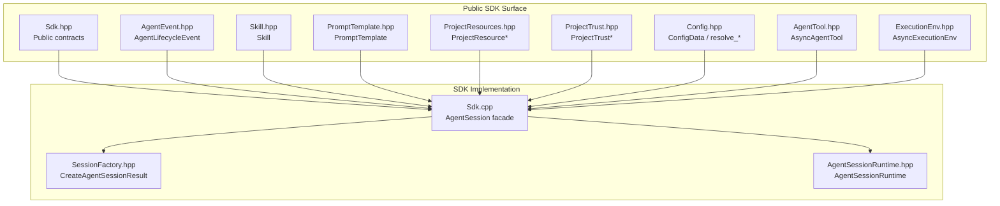
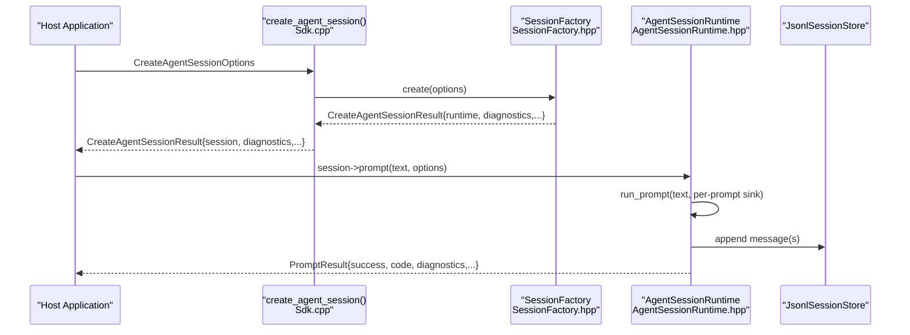
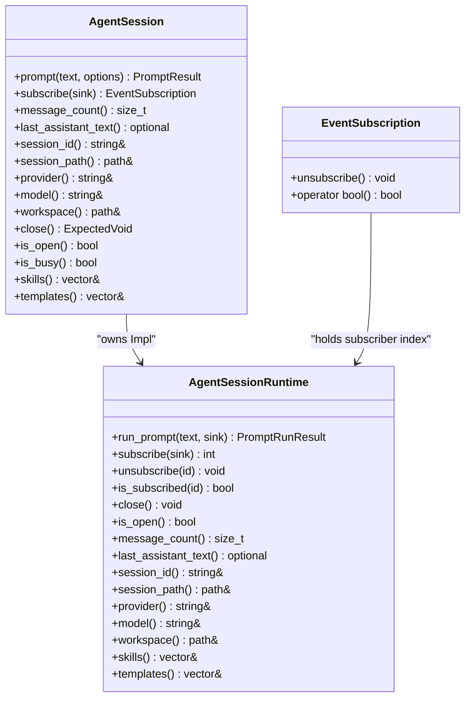
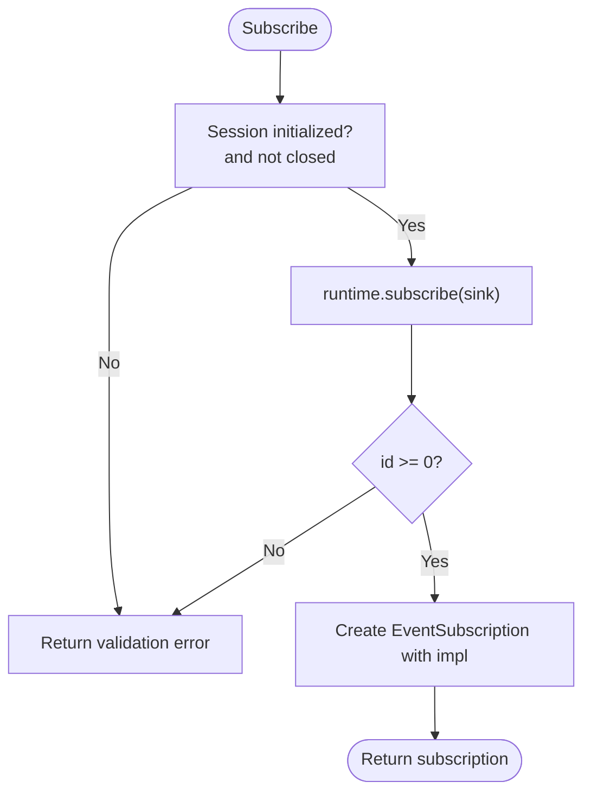
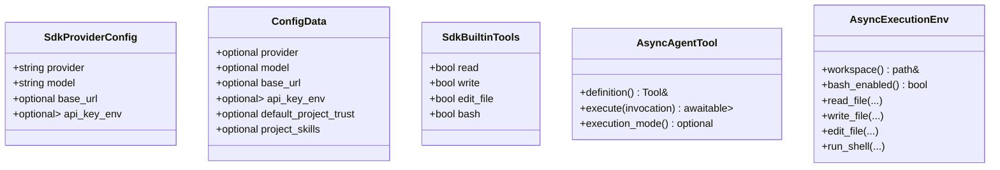
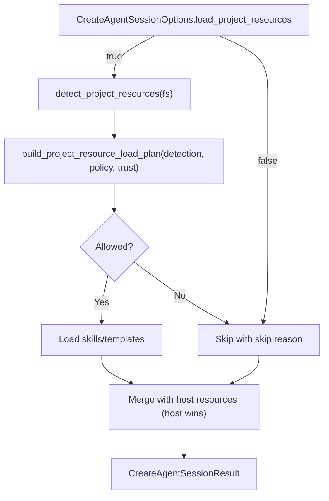
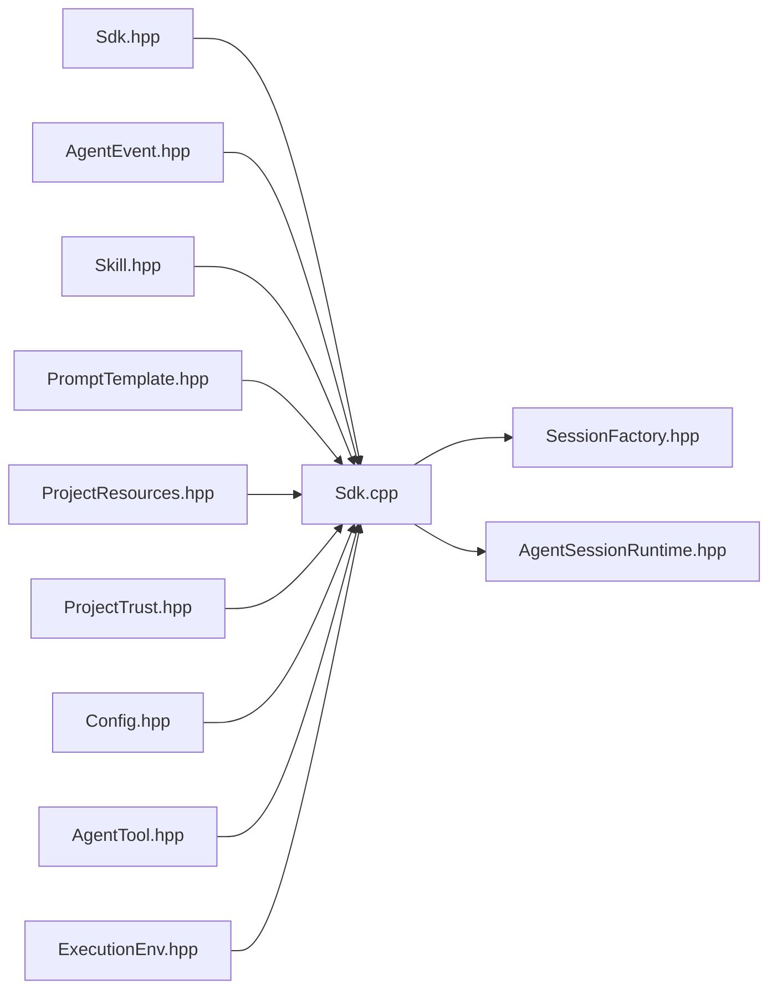

# Embeddable SDK

<cite>
**Referenced Files in This Document**
- [Sdk.hpp](file://include/cch/coding_agent/Sdk.hpp)
- [Sdk.cpp](file://src/coding_agent/Sdk.cpp)
- [AgentEvent.hpp](file://include/cch/agent/AgentEvent.hpp)
- [ProjectResources.hpp](file://include/cch/coding_agent/ProjectResources.hpp)
- [ProjectTrust.hpp](file://include/cch/coding_agent/ProjectTrust.hpp)
- [Skill.hpp](file://include/cch/coding_agent/Skill.hpp)
- [PromptTemplate.hpp](file://include/cch/coding_agent/PromptTemplate.hpp)
- [SessionFactory.hpp](file://src/coding_agent/runtime/SessionFactory.hpp)
- [AgentSessionRuntime.hpp](file://src/coding_agent/runtime/AgentSessionRuntime.hpp)
- [ExecutionEnv.hpp](file://include/cch/harness/ExecutionEnv.hpp)
- [Config.hpp](file://include/cch/coding_agent/Config.hpp)
- [AgentTool.hpp](file://include/cch/agent/AgentTool.hpp)
- [README.md](file://README.md)
- [SdkSessionTest.cpp](file://tests/coding_agent/SdkSessionTest.cpp)
- [2026-06-21-001-feat-t8-embeddable-sdk-surface-plan.md](file://docs/plans/2026-06-21-001-feat-t8-embeddable-sdk-surface-plan.md)
</cite>

## Table of Contents
1. [Introduction](#introduction)
2. [Project Structure](#project-structure)
3. [Core Components](#core-components)
4. [Architecture Overview](#architecture-overview)
5. [Detailed Component Analysis](#detailed-component-analysis)
6. [Dependency Analysis](#dependency-analysis)
7. [Performance Considerations](#performance-considerations)
8. [Troubleshooting Guide](#troubleshooting-guide)
9. [Conclusion](#conclusion)
10. [Appendices](#appendices)

## Introduction
This document describes the embeddable SDK surface for the C++23 coding agent harness. The SDK enables host applications to integrate the agent loop directly into their process, without shelling out to the CLI or relying on CLI/RPC globals. It provides a source-level API that is experimental and not ABI-stable, focusing on a narrow set of capabilities aligned with the existing runtime’s session, tool, and resource seams.

Key characteristics:
- Same-process embedding with a move-only session facade.
- Blocking prompt execution with deterministic lifecycle and event fanout.
- Host-provided streaming chat client and execution environment, or SDK convenience provider construction.
- Built-in tool selection with safe defaults and custom tool registration.
- Programmatic skills, prompt templates, and slash-command handlers; optional project resource discovery under explicit trust/resource controls.
- Strict separation of public SDK contracts from private runtime implementation headers.

## Project Structure
The SDK is exposed via a dedicated public header and implemented by adapting the existing runtime. The most relevant parts are:
- Public SDK API: include/cch/coding_agent/Sdk.hpp
- SDK implementation: src/coding_agent/Sdk.cpp
- Runtime integration: src/coding_agent/runtime/SessionFactory.hpp and src/coding_agent/runtime/AgentSessionRuntime.hpp
- Event contracts: include/cch/agent/AgentEvent.hpp
- Resource contracts: include/cch/coding_agent/Skill.hpp, include/cch/coding_agent/PromptTemplate.hpp, include/cch/coding_agent/ProjectResources.hpp, include/cch/coding_agent/ProjectTrust.hpp
- Capability seam: include/cch/harness/ExecutionEnv.hpp
- Provider configuration: include/cch/coding_agent/Config.hpp
- Tool contracts: include/cch/agent/AgentTool.hpp
- Tests validating SDK behavior: tests/coding_agent/SdkSessionTest.cpp
- Plan and rationale: docs/plans/2026-06-21-001-feat-t8-embeddable-sdk-surface-plan.md
- High-level project overview and SDK summary: README.md

**Diagram sources**
- [Sdk.hpp:1-347](file://include/cch/coding_agent/Sdk.hpp#L1-L347)
- [Sdk.cpp:1-235](file://src/coding_agent/Sdk.cpp#L1-L235)
- [AgentEvent.hpp:1-111](file://include/cch/agent/AgentEvent.hpp#L1-L111)
- [Skill.hpp:1-60](file://include/cch/coding_agent/Skill.hpp#L1-L60)
- [PromptTemplate.hpp:1-18](file://include/cch/coding_agent/PromptTemplate.hpp#L1-L18)
- [ProjectResources.hpp:1-112](file://include/cch/coding_agent/ProjectResources.hpp#L1-L112)
- [ProjectTrust.hpp:1-93](file://include/cch/coding_agent/ProjectTrust.hpp#L1-L93)
- [Config.hpp:1-78](file://include/cch/coding_agent/Config.hpp#L1-L78)
- [AgentTool.hpp:1-79](file://include/cch/agent/AgentTool.hpp#L1-L79)
- [ExecutionEnv.hpp:1-337](file://include/cch/harness/ExecutionEnv.hpp#L1-L337)
- [SessionFactory.hpp:1-66](file://src/coding_agent/runtime/SessionFactory.hpp#L1-L66)
- [AgentSessionRuntime.hpp:1-113](file://src/coding_agent/runtime/AgentSessionRuntime.hpp#L1-L113)

**Section sources**
- [README.md:174-241](file://README.md#L174-L241)
- [2026-06-21-001-feat-t8-embeddable-sdk-surface-plan.md:17-47](file://docs/plans/2026-06-21-001-feat-t8-embeddable-sdk-surface-plan.md#L17-L47)

## Core Components
- Session creation and factory
  - create_agent_session(CreateAgentSessionOptions) returns util::Expected<CreateAgentSessionResult>.
  - Supports explicit create or resume path, workspace requirement, provider configuration or host-provided client, and optional project resource loading with trust/resource controls.
- AgentSession facade
  - Move-only handle with blocking prompt(), event subscriptions, state accessors, and idempotent close().
  - Enforces single active prompt at a time and clear lifecycle states.
- Event subscription system
  - AgentEventSink is a move-only callback receiving AgentLifecycleEvent variants.
  - EventSubscription RAII handle manages subscription lifetime and idempotent unsubscribe.
- Provider and tool configuration
  - SdkProviderConfig for default client construction; host can supply StreamingChatClient.
  - SdkBuiltinTools for safe defaults; custom tools via agent::AsyncAgentTool.
- Resource loading
  - Host-provided skills and prompt templates; optional project skills/prompts discovery controlled by ProjectTrust and ProjectResource policies.
- Diagnostics and metadata
  - Creation diagnostics and resolved metadata surfaced in CreateAgentSessionResult.

**Section sources**
- [Sdk.hpp:36-347](file://include/cch/coding_agent/Sdk.hpp#L36-L347)
- [Sdk.cpp:78-188](file://src/coding_agent/Sdk.cpp#L78-L188)
- [AgentEvent.hpp:12-111](file://include/cch/agent/AgentEvent.hpp#L12-L111)
- [ProjectResources.hpp:15-112](file://include/cch/coding_agent/ProjectResources.hpp#L15-L112)
- [ProjectTrust.hpp:12-93](file://include/cch/coding_agent/ProjectTrust.hpp#L12-L93)
- [Skill.hpp:35-60](file://include/cch/coding_agent/Skill.hpp#L35-L60)
- [PromptTemplate.hpp:8-18](file://include/cch/coding_agent/PromptTemplate.hpp#L8-L18)
- [Config.hpp:15-78](file://include/cch/coding_agent/Config.hpp#L15-L78)
- [AgentTool.hpp:64-79](file://include/cch/agent/AgentTool.hpp#L64-L79)
- [ExecutionEnv.hpp:198-337](file://include/cch/harness/ExecutionEnv.hpp#L198-L337)

## Architecture Overview
The SDK wraps the existing runtime by translating public SDK options into an internal AgentSessionCreationRequest, assembling services, and returning a public AgentSession backed by AgentSessionRuntime. The runtime orchestrates prompt processing, persistence, and event fanout.

**Diagram sources**
- [Sdk.cpp:224-232](file://src/coding_agent/Sdk.cpp#L224-L232)
- [SessionFactory.hpp:59-63](file://src/coding_agent/runtime/SessionFactory.hpp#L59-L63)
- [AgentSessionRuntime.hpp:52-54](file://src/coding_agent/runtime/AgentSessionRuntime.hpp#L52-L54)

**Section sources**
- [Sdk.cpp:194-232](file://src/coding_agent/Sdk.cpp#L194-L232)
- [SessionFactory.hpp:16-63](file://src/coding_agent/runtime/SessionFactory.hpp#L16-L63)
- [AgentSessionRuntime.hpp:37-110](file://src/coding_agent/runtime/AgentSessionRuntime.hpp#L37-L110)

## Detailed Component Analysis

### Session Creation and Management
- Factory
  - create_agent_session validates options (exactly one of session_path or resume_path, workspace presence, provider/client availability), opens/creates JSONL session, assembles provider client, execution environment, tools, and resources, and returns a session handle with diagnostics.
- AgentSession lifecycle
  - States: Open → (prompt)* → Closed.
  - prompt() is blocking and serial; re-entrancy returns a validation error.
  - close() is idempotent; clears subscribers and releases SDK-owned resources; host-provided execution environments are not cleaned up by the SDK.
  - is_open() and is_busy() provide state queries.
- State accessors
  - message_count(), last_assistant_text(), session_id(), session_path(), provider(), model(), workspace(), skills(), templates() reflect committed history and loaded resources.

**Diagram sources**
- [Sdk.hpp:251-332](file://include/cch/coding_agent/Sdk.hpp#L251-L332)
- [Sdk.hpp:215-237](file://include/cch/coding_agent/Sdk.hpp#L215-L237)
- [AgentSessionRuntime.hpp:37-110](file://src/coding_agent/runtime/AgentSessionRuntime.hpp#L37-L110)

**Section sources**
- [Sdk.hpp:241-332](file://include/cch/coding_agent/Sdk.hpp#L241-L332)
- [Sdk.cpp:78-188](file://src/coding_agent/Sdk.cpp#L78-L188)
- [AgentSessionRuntime.hpp:37-110](file://src/coding_agent/runtime/AgentSessionRuntime.hpp#L37-L110)

### Event Subscription System
- AgentEventSink is a move-only callback accepting AgentLifecycleEvent variants.
- AgentSession::subscribe registers a sink and returns EventSubscription; sinks are called for every event during prompts.
- EventSubscription supports unsubscribe() and boolean conversion to check liveness; destroying the handle unsubscribes.
- Per-prompt sinks are supported via PromptOptions and are combined with persistent subscribers.

**Diagram sources**
- [AgentEvent.hpp:108-111](file://include/cch/agent/AgentEvent.hpp#L108-L111)
- [Sdk.hpp:271-278](file://include/cch/coding_agent/Sdk.hpp#L271-L278)
- [Sdk.cpp:105-128](file://src/coding_agent/Sdk.cpp#L105-L128)
- [AgentSessionRuntime.hpp:58-65](file://src/coding_agent/runtime/AgentSessionRuntime.hpp#L58-L65)

**Section sources**
- [AgentEvent.hpp:12-111](file://include/cch/agent/AgentEvent.hpp#L12-L111)
- [Sdk.hpp:210-237](file://include/cch/coding_agent/Sdk.hpp#L210-L237)
- [Sdk.cpp:105-128](file://src/coding_agent/Sdk.cpp#L105-L128)

### Provider and Tool Configuration
- Provider configuration
  - SdkProviderConfig supplies provider, model, optional base_url, and an environment variable chain for API key resolution.
  - If no host-provided chat client is supplied, the SDK constructs a default OpenAI-compatible client using provider registry and resolved settings.
  - ConfigData and resolve_provider_settings define precedence and fallback rules.
- Built-in tools
  - SdkBuiltinTools selects read, write, edit_file, and bash; bash is opt-in.
- Custom tools
  - Register agent::AsyncAgentTool instances; duplicate names fail creation.
- Execution environment
  - Host can supply harness::AsyncExecutionEnv; otherwise a local environment is constructed for the workspace.

**Diagram sources**
- [Sdk.hpp:54-72](file://include/cch/coding_agent/Sdk.hpp#L54-L72)
- [Config.hpp:15-78](file://include/cch/coding_agent/Config.hpp#L15-L78)
- [AgentTool.hpp:64-79](file://include/cch/agent/AgentTool.hpp#L64-L79)
- [ExecutionEnv.hpp:198-337](file://include/cch/harness/ExecutionEnv.hpp#L198-L337)

**Section sources**
- [Sdk.hpp:54-149](file://include/cch/coding_agent/Sdk.hpp#L54-L149)
- [Config.hpp:15-78](file://include/cch/coding_agent/Config.hpp#L15-L78)
- [AgentTool.hpp:64-79](file://include/cch/agent/AgentTool.hpp#L64-L79)
- [ExecutionEnv.hpp:198-337](file://include/cch/harness/ExecutionEnv.hpp#L198-L337)

### Resource Loading System (Skills and Prompt Templates)
- Host-provided resources
  - Skills and PromptTemplate instances can be supplied via CreateAgentSessionOptions; they take precedence over project-discovered duplicates.
- Project resource discovery (opt-in)
  - When load_project_resources is true, project skills and templates under .cpp-harness are discovered and loaded according to ProjectResourcePolicy and ProjectTrustResolution.
  - Decisions and diagnostics are surfaced without printing to stdout/stderr.
- Trust controls
  - DefaultProjectTrust governs default trust behavior; ProjectTrustStore persists decisions and supports resolution from cwd with nearest-parent inheritance.
  - ProjectResourceLoadPlan indicates whether trust is required and whether resources were skipped for untrusted reasons.

**Diagram sources**
- [Sdk.hpp:136-149](file://include/cch/coding_agent/Sdk.hpp#L136-L149)
- [ProjectResources.hpp:91-110](file://include/cch/coding_agent/ProjectResources.hpp#L91-L110)
- [ProjectTrust.hpp:85-91](file://include/cch/coding_agent/ProjectTrust.hpp#L85-L91)

**Section sources**
- [Sdk.hpp:124-149](file://include/cch/coding_agent/Sdk.hpp#L124-L149)
- [ProjectResources.hpp:15-112](file://include/cch/coding_agent/ProjectResources.hpp#L15-L112)
- [ProjectTrust.hpp:12-93](file://include/cch/coding_agent/ProjectTrust.hpp#L12-L93)

### Practical Examples
- Basic session creation, prompting, and closing
  - See usage example in README’s Embeddable C++ SDK section.
- Event subscription and per-prompt sinks
  - Tests demonstrate subscribing to lifecycle events and receiving them during prompt execution.
- Custom tools and commands
  - Tests register a custom AsyncAgentTool and a host-defined slash-command handler.
- Project resource loading
  - Tests show host-provided skills/templates and diagnostics for unknown skill commands.

**Section sources**
- [README.md:174-241](file://README.md#L174-L241)
- [SdkSessionTest.cpp:274-372](file://tests/coding_agent/SdkSessionTest.cpp#L274-L372)
- [SdkSessionTest.cpp:378-420](file://tests/coding_agent/SdkSessionTest.cpp#L378-L420)
- [SdkSessionTest.cpp:421-521](file://tests/coding_agent/SdkSessionTest.cpp#L421-L521)
- [SdkSessionTest.cpp:523-576](file://tests/coding_agent/SdkSessionTest.cpp#L523-L576)

## Dependency Analysis
The SDK maintains a strict public/private boundary:
- Public SDK contracts live under include/cch/coding_agent/ and include/cch/agent/, include/cch/harness/.
- Private runtime implementation is accessed only via pimpl and adapter classes in src/coding_agent/.

**Diagram sources**
- [Sdk.hpp:1-347](file://include/cch/coding_agent/Sdk.hpp#L1-L347)
- [Sdk.cpp:1-235](file://src/coding_agent/Sdk.cpp#L1-L235)
- [SessionFactory.hpp:1-66](file://src/coding_agent/runtime/SessionFactory.hpp#L1-L66)
- [AgentSessionRuntime.hpp:1-113](file://src/coding_agent/runtime/AgentSessionRuntime.hpp#L1-L113)
- [AgentEvent.hpp:1-111](file://include/cch/agent/AgentEvent.hpp#L1-L111)
- [Skill.hpp:1-60](file://include/cch/coding_agent/Skill.hpp#L1-L60)
- [PromptTemplate.hpp:1-18](file://include/cch/coding_agent/PromptTemplate.hpp#L1-L18)
- [ProjectResources.hpp:1-112](file://include/cch/coding_agent/ProjectResources.hpp#L1-L112)
- [ProjectTrust.hpp:1-93](file://include/cch/coding_agent/ProjectTrust.hpp#L1-L93)
- [Config.hpp:1-78](file://include/cch/coding_agent/Config.hpp#L1-L78)
- [AgentTool.hpp:1-79](file://include/cch/agent/AgentTool.hpp#L1-L79)
- [ExecutionEnv.hpp:1-337](file://include/cch/harness/ExecutionEnv.hpp#L1-L337)

**Section sources**
- [2026-06-21-001-feat-t8-embeddable-sdk-surface-plan.md:84-102](file://docs/plans/2026-06-21-001-feat-t8-embeddable-sdk-surface-plan.md#L84-L102)
- [README.md:135-151](file://README.md#L135-L151)

## Performance Considerations
- The SDK executes prompts synchronously and serially; concurrency is not supported in v1.
- Event fanout occurs per sink; failing sinks fail the prompt to prevent silent loss.
- Persistence is append-before-in-memory-commit; partial writes can occur and require recovery guidance.
- Provider and environment construction are lightweight; heavy work happens during prompt execution.

[No sources needed since this section provides general guidance]

## Troubleshooting Guide
Common validation and runtime errors surfaced via util::Expected:
- Validation errors for invalid options (both or neither of session_path/resume_path set, missing workspace, missing provider/client, duplicate tool/command names).
- Prompt failures with stable codes such as completed, command_handled, max_turns_exceeded, session_persist_failed, runtime_error, event_sink_failed.
- Diagnostics for resource loading and trust decisions are returned as values rather than printed to stdout/stderr.

**Section sources**
- [Sdk.hpp:182-208](file://include/cch/coding_agent/Sdk.hpp#L182-L208)
- [Sdk.cpp:78-103](file://src/coding_agent/Sdk.cpp#L78-L103)
- [SdkSessionTest.cpp:127-228](file://tests/coding_agent/SdkSessionTest.cpp#L127-L228)
- [SdkSessionTest.cpp:446-497](file://tests/coding_agent/SdkSessionTest.cpp#L446-L497)

## Conclusion
The embeddable SDK v1 provides a focused, same-process integration surface for the coding agent. It emphasizes determinism, safety, and clear separation of concerns, while deferring advanced features such as concurrent prompts, session tree navigation, and ABI stability. Hosts can supply custom providers, execution environments, tools, and resources, and receive structured diagnostics and committed state accessors.

[No sources needed since this section summarizes without analyzing specific files]

## Appendices

### SDK Limitations Compared to the Full Runtime
- ABI-stable binary distribution, plugin ABI, or package-manager integration.
- Full pi AgentSessionRuntime replacement APIs (newSession, switchSession, fork, clone, import/export).
- Public branch/tree navigation, compaction resume, and parent-aware tree append behavior.
- In-memory sessions and concurrent prompts; cancellation, abort, steer, followUp, queueing.
- Dynamic TypeScript/JavaScript extensions, extension UI, hot reload, MCP, or package installation.
- TUI run modes, themes, keybindings, or widgets; OAuth/subscription providers, model catalogs.
- JSON/RPC wire DTO exposure or a full pi RPC command matrix.
- Sandbox/container guarantees beyond the existing workspace guard.

**Section sources**
- [2026-06-21-001-feat-t8-embeddable-sdk-surface-plan.md:67-79](file://docs/plans/2026-06-21-001-feat-t8-embeddable-sdk-surface-plan.md#L67-L79)
- [README.md:231-239](file://README.md#L231-L239)

### Versioning, Compatibility, and Migration
- The SDK is experimental and source-level only; it is not ABI-stable.
- The plan documents risks and migration notes, including a potential change for api_key_env usage and environment variable handling in tests.
- Future SDK versions may evolve the public contracts while maintaining the same lifecycle and event semantics.

**Section sources**
- [2026-06-21-001-feat-t8-embeddable-sdk-surface-plan.md:566-574](file://docs/plans/2026-06-21-001-feat-t8-embeddable-sdk-surface-plan.md#L566-L574)
- [2026-06-21-001-feat-t8-embeddable-sdk-surface-plan.md:186-192](file://docs/plans/2026-06-21-001-feat-t8-embeddable-sdk-surface-plan.md#L186-L192)