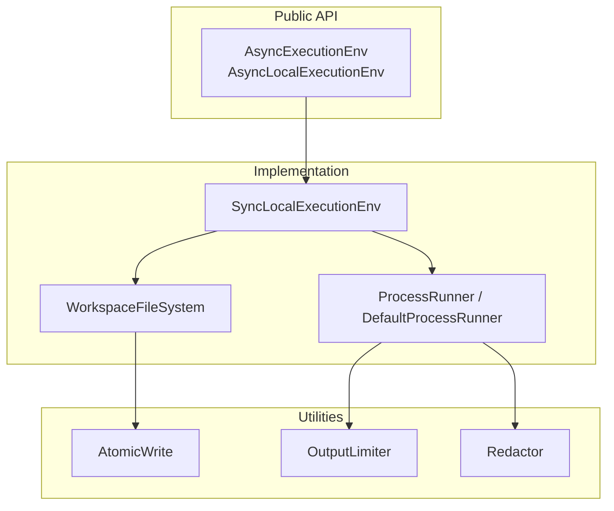
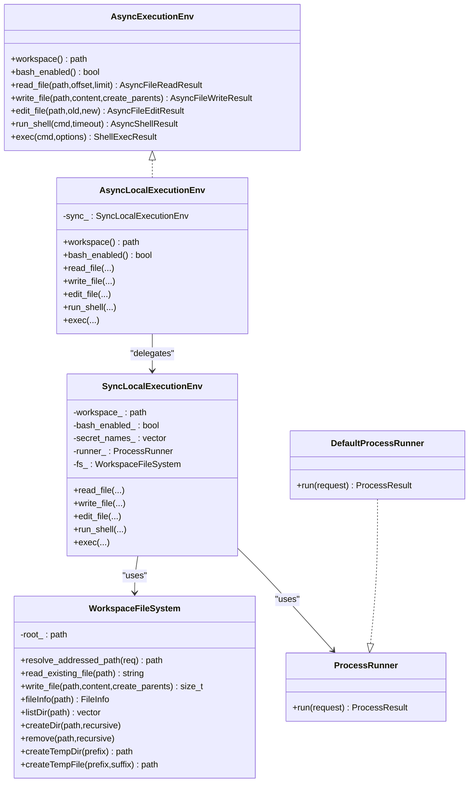
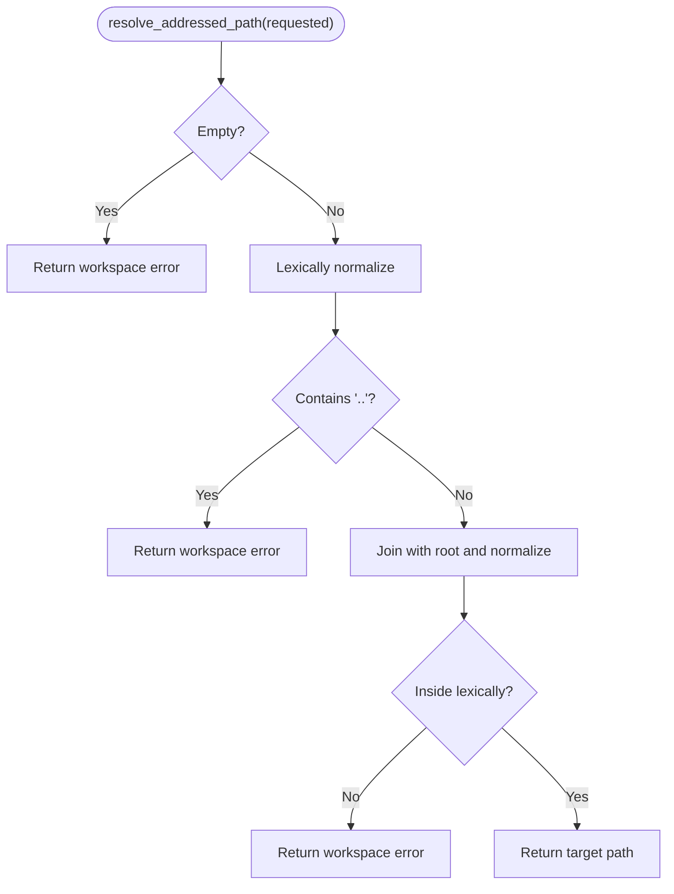
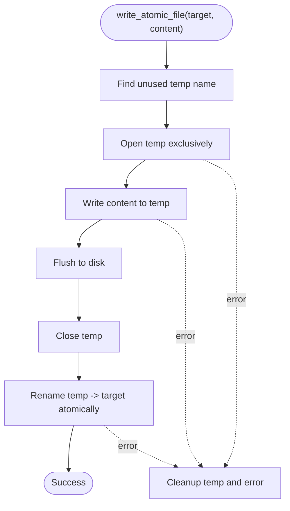
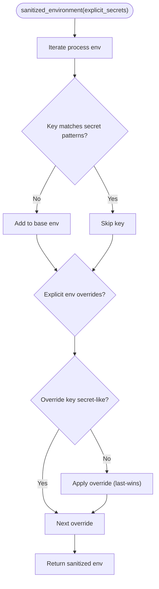
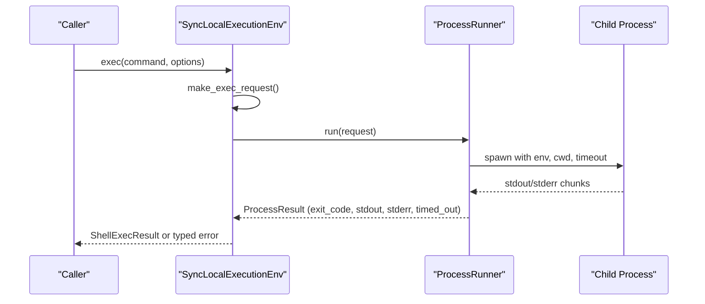
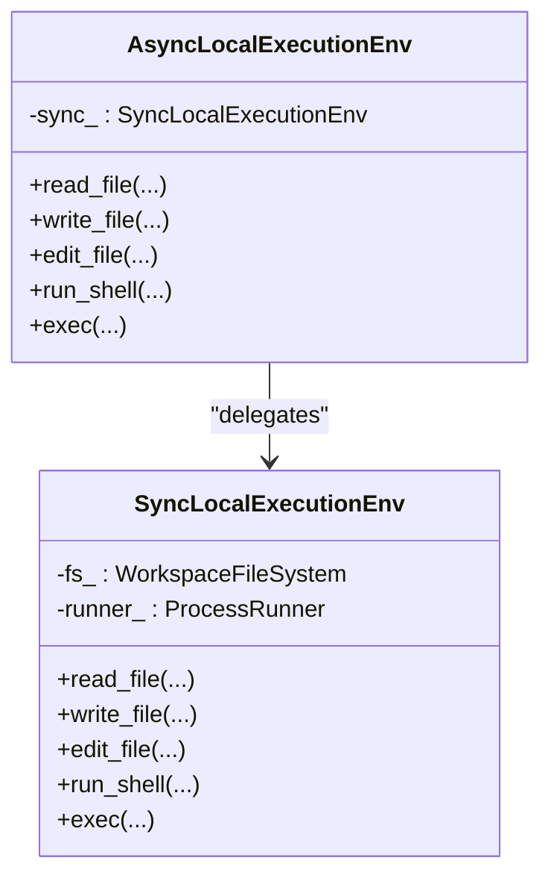
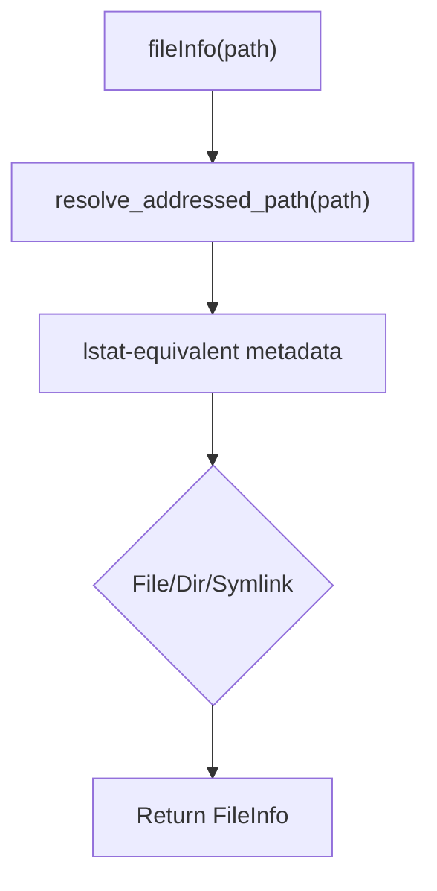
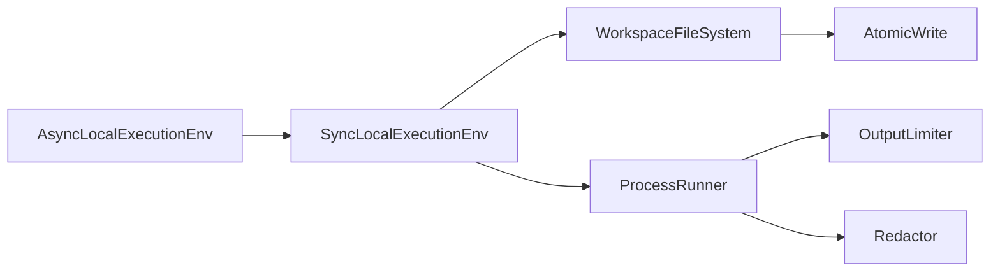

# Execution Environment

<cite>
**Referenced Files in This Document**
- [ExecutionEnv.hpp](file://include/cch/harness/ExecutionEnv.hpp)
- [LocalExecutionEnv.hpp](file://include/cch/harness/LocalExecutionEnv.hpp)
- [AsyncLocalExecutionEnv.cpp](file://src/harness/AsyncLocalExecutionEnv.cpp)
- [SyncLocalExecutionEnv.cpp](file://src/harness/SyncLocalExecutionEnv.cpp)
- [WorkspaceFileSystem.hpp](file://src/harness/WorkspaceFileSystem.hpp)
- [AtomicWrite.hpp](file://src/harness/AtomicWrite.hpp)
- [Process.hpp](file://src/util/Process.hpp)
- [OutputLimiter.hpp](file://src/util/OutputLimiter.hpp)
- [Redactor.hpp](file://src/util/Redactor.hpp)
- [AsyncLocalExecutionEnvTest.cpp](file://tests/harness/AsyncLocalExecutionEnvTest.cpp)
- [WorkspaceFileSystemTest.cpp](file://tests/harness/WorkspaceFileSystemTest.cpp)
</cite>

## Table of Contents
1. [Introduction](#introduction)
2. [Project Structure](#project-structure)
3. [Core Components](#core-components)
4. [Architecture Overview](#architecture-overview)
5. [Detailed Component Analysis](#detailed-component-analysis)
6. [Dependency Analysis](#dependency-analysis)
7. [Performance Considerations](#performance-considerations)
8. [Troubleshooting Guide](#troubleshooting-guide)
9. [Conclusion](#conclusion)

## Introduction
This document explains the execution environment that powers secure tool execution within a controlled workspace. It covers:
- Secure workspace operations and containment guarantees
- Guard mechanisms preventing path traversal and symlink attacks
- Shell command execution with timeouts, process management, and output limiting
- Atomic write operations ensuring data integrity during file modifications
- Execution environment abstractions enabling async and sync implementations
- Environment sanitization that removes sensitive variables from tool execution contexts
- Workspace validation, path resolution, and containment policies
- Practical examples, process execution patterns, and security considerations
- Clarification of the distinction between the execution environment and sandboxing

## Project Structure
The execution environment is implemented as a layered abstraction:
- Public interface: AsyncExecutionEnv defines the capability seam for asynchronous operations
- Concrete implementations: AsyncLocalExecutionEnv and SyncLocalExecutionEnv
- Underlying filesystem: WorkspaceFileSystem enforces workspace containment and symlink safety
- Process execution: ProcessRunner and DefaultProcessRunner manage process spawning, timeouts, and output limits
- Utilities: AtomicWrite, OutputLimiter, and Redactor support atomic file updates and output safety

**Diagram sources**
- [ExecutionEnv.hpp:198-334](file://include/cch/harness/ExecutionEnv.hpp#L198-L334)
- [LocalExecutionEnv.hpp:10-83](file://include/cch/harness/LocalExecutionEnv.hpp#L10-L83)
- [SyncLocalExecutionEnv.cpp:81-90](file://src/harness/SyncLocalExecutionEnv.cpp#L81-L90)
- [WorkspaceFileSystem.hpp:31-45](file://src/harness/WorkspaceFileSystem.hpp#L31-L45)
- [Process.hpp:45-56](file://src/util/Process.hpp#L45-L56)
- [AtomicWrite.hpp:29-134](file://src/harness/AtomicWrite.hpp#L29-L134)
- [OutputLimiter.hpp:19-48](file://src/util/OutputLimiter.hpp#L19-L48)
- [Redactor.hpp:10-41](file://src/util/Redactor.hpp#L10-L41)

**Section sources**
- [ExecutionEnv.hpp:198-334](file://include/cch/harness/ExecutionEnv.hpp#L198-L334)
- [LocalExecutionEnv.hpp:10-83](file://include/cch/harness/LocalExecutionEnv.hpp#L10-L83)
- [SyncLocalExecutionEnv.cpp:81-90](file://src/harness/SyncLocalExecutionEnv.cpp#L81-L90)
- [WorkspaceFileSystem.hpp:31-45](file://src/harness/WorkspaceFileSystem.hpp#L31-L45)
- [Process.hpp:45-56](file://src/util/Process.hpp#L45-L56)
- [AtomicWrite.hpp:29-134](file://src/harness/AtomicWrite.hpp#L29-L134)
- [OutputLimiter.hpp:19-48](file://src/util/OutputLimiter.hpp#L19-L48)
- [Redactor.hpp:10-41](file://src/util/Redactor.hpp#L10-L41)

## Core Components
- AsyncExecutionEnv: Defines the async capability seam for file and shell operations, plus typed error conversions for compatibility.
- AsyncLocalExecutionEnv: Async facade delegating to a shared SyncLocalExecutionEnv instance.
- SyncLocalExecutionEnv: Implements synchronous operations, builds sanitized environments, validates cwd, and orchestrates process execution.
- WorkspaceFileSystem: Enforces workspace containment, rejects absolute paths and escapes, prevents symlink traversal, and supports atomic writes.
- ProcessRunner/DefaultProcessRunner: Spawns processes, manages timeouts, captures stdout/stderr, and applies output limits.
- AtomicWrite: Provides atomic file replacement to ensure data integrity during writes.
- OutputLimiter: Applies byte and line caps to process output.
- Redactor: Heuristically redacts secret-like content from text.

**Section sources**
- [ExecutionEnv.hpp:198-334](file://include/cch/harness/ExecutionEnv.hpp#L198-L334)
- [LocalExecutionEnv.hpp:10-83](file://include/cch/harness/LocalExecutionEnv.hpp#L10-L83)
- [AsyncLocalExecutionEnv.cpp:10-18](file://src/harness/AsyncLocalExecutionEnv.cpp#L10-L18)
- [SyncLocalExecutionEnv.cpp:81-90](file://src/harness/SyncLocalExecutionEnv.cpp#L81-L90)
- [WorkspaceFileSystem.hpp:31-45](file://src/harness/WorkspaceFileSystem.hpp#L31-L45)
- [Process.hpp:45-56](file://src/util/Process.hpp#L45-L56)
- [AtomicWrite.hpp:29-134](file://src/harness/AtomicWrite.hpp#L29-L134)
- [OutputLimiter.hpp:19-48](file://src/util/OutputLimiter.hpp#L19-L48)
- [Redactor.hpp:10-41](file://src/util/Redactor.hpp#L10-L41)

## Architecture Overview
The execution environment separates concerns across layers:
- Async facade for external consumers
- Shared sync implementation for core logic
- Workspace filesystem for containment and atomic writes
- Process runner for execution, timeouts, and output limits
- Utility modules for output limiting and redaction

**Diagram sources**
- [ExecutionEnv.hpp:198-334](file://include/cch/harness/ExecutionEnv.hpp#L198-L334)
- [LocalExecutionEnv.hpp:10-83](file://include/cch/harness/LocalExecutionEnv.hpp#L10-L83)
- [SyncLocalExecutionEnv.cpp:81-90](file://src/harness/SyncLocalExecutionEnv.cpp#L81-L90)
- [WorkspaceFileSystem.hpp:31-45](file://src/harness/WorkspaceFileSystem.hpp#L31-L45)
- [Process.hpp:45-56](file://src/util/Process.hpp#L45-L56)

## Detailed Component Analysis

### Workspace Containment and Path Safety
WorkspaceFileSystem enforces strict containment:
- Rejects absolute paths and any path segment attempting to escape the workspace
- Validates parent directories and rejects symlink components that lead outside the workspace
- Uses lstat-equivalent metadata for listing and fileInfo without following symlinks
- Prevents writing through final symlinks and rejects missing parents unless explicitly creating

**Diagram sources**
- [WorkspaceFileSystem.hpp:49-68](file://src/harness/WorkspaceFileSystem.hpp#L49-L68)

Practical examples:
- Reading a file inside the workspace succeeds; reading across a symlink to outside fails.
- Writing to a path with a symlink in the parent chain fails.
- Creating nested directories respects containment and avoids symlink traversal.

**Section sources**
- [WorkspaceFileSystem.hpp:49-68](file://src/harness/WorkspaceFileSystem.hpp#L49-L68)
- [WorkspaceFileSystem.hpp:74-132](file://src/harness/WorkspaceFileSystem.hpp#L74-L132)
- [WorkspaceFileSystem.hpp:134-182](file://src/harness/WorkspaceFileSystem.hpp#L134-L182)
- [WorkspaceFileSystemTest.cpp:21-43](file://tests/harness/WorkspaceFileSystemTest.cpp#L21-L43)
- [WorkspaceFileSystemTest.cpp:66-89](file://tests/harness/WorkspaceFileSystemTest.cpp#L66-L89)
- [WorkspaceFileSystemTest.cpp:324-344](file://tests/harness/WorkspaceFileSystemTest.cpp#L324-L344)

### Atomic Writes and Data Integrity
AtomicWrite ensures atomic replacement of target files:
- Allocates a unique temporary file under the same directory as the target
- Writes content and flushes to disk
- Renames the temporary file to the target atomically
- On POSIX, uses openat/fdatasync/renameat to avoid race conditions

**Diagram sources**
- [AtomicWrite.hpp:29-134](file://src/harness/AtomicWrite.hpp#L29-L134)

Practical examples:
- Writing a file with create_parents=true creates intermediate directories safely.
- Atomic replacement prevents partial or partially written files from being observed.

**Section sources**
- [AtomicWrite.hpp:29-134](file://src/harness/AtomicWrite.hpp#L29-L134)
- [WorkspaceFileSystem.hpp:177-182](file://src/harness/WorkspaceFileSystem.hpp#L177-L182)

### Environment Sanitization and Secret Filtering
Environment sanitization strips secret-like variables:
- Builds a base environment from process environment, excluding secret-like keys
- Explicit overrides are applied last; secret-like keys are ignored
- Heuristics detect common secret indicators (e.g., API key, token, secret, password, JWT, certificate)

**Diagram sources**
- [SyncLocalExecutionEnv.cpp:51-69](file://src/harness/SyncLocalExecutionEnv.cpp#L51-L69)
- [SyncLocalExecutionEnv.cpp:317-328](file://src/harness/SyncLocalExecutionEnv.cpp#L317-L328)

Practical examples:
- OPENAI_API_KEY and similar keys are excluded from child processes.
- Explicit overrides for non-secret keys shadow base variables.

**Section sources**
- [SyncLocalExecutionEnv.cpp:51-69](file://src/harness/SyncLocalExecutionEnv.cpp#L51-L69)
- [SyncLocalExecutionEnv.cpp:317-328](file://src/harness/SyncLocalExecutionEnv.cpp#L317-L328)
- [AsyncLocalExecutionEnvTest.cpp:189-219](file://tests/harness/AsyncLocalExecutionEnvTest.cpp#L189-L219)

### Shell Execution, Timeouts, and Output Limiting
ProcessRunner spawns commands with:
- Working directory bound to the workspace
- Optional cwd override validated through workspace containment
- Explicit environment with sanitized base and non-secret overrides
- Timeout enforcement and per-stream output limits
- Optional stdout/stderr callbacks for streaming

**Diagram sources**
- [SyncLocalExecutionEnv.cpp:295-346](file://src/harness/SyncLocalExecutionEnv.cpp#L295-L346)
- [Process.hpp:16-49](file://src/util/Process.hpp#L16-L49)

Practical examples:
- Concurrency: Multiple shell commands run concurrently without blocking the IO context.
- Timeouts: Long-running commands terminate early and report timeout.
- Split streams: stdout and stderr are captured separately; combined compatibility output is constructed deterministically.

**Section sources**
- [SyncLocalExecutionEnv.cpp:295-346](file://src/harness/SyncLocalExecutionEnv.cpp#L295-L346)
- [Process.hpp:16-49](file://src/util/Process.hpp#L16-L49)
- [AsyncLocalExecutionEnvTest.cpp:138-187](file://tests/harness/AsyncLocalExecutionEnvTest.cpp#L138-L187)
- [AsyncLocalExecutionEnvTest.cpp:441-478](file://tests/harness/AsyncLocalExecutionEnvTest.cpp#L441-L478)
- [AsyncLocalExecutionEnvTest.cpp:500-513](file://tests/harness/AsyncLocalExecutionEnvTest.cpp#L500-L513)

### Async and Sync Implementation Abstraction
AsyncLocalExecutionEnv delegates all operations to a shared SyncLocalExecutionEnv instance:
- Async facade forwards calls and translates results
- SyncLocalExecutionEnv performs the actual work, including workspace validation, environment sanitization, and process orchestration

**Diagram sources**
- [LocalExecutionEnv.hpp:10-83](file://include/cch/harness/LocalExecutionEnv.hpp#L10-L83)
- [AsyncLocalExecutionEnv.cpp:10-18](file://src/harness/AsyncLocalExecutionEnv.cpp#L10-L18)
- [SyncLocalExecutionEnv.cpp:81-90](file://src/harness/SyncLocalExecutionEnv.cpp#L81-L90)

**Section sources**
- [LocalExecutionEnv.hpp:10-83](file://include/cch/harness/LocalExecutionEnv.hpp#L10-L83)
- [AsyncLocalExecutionEnv.cpp:10-18](file://src/harness/AsyncLocalExecutionEnv.cpp#L10-L18)
- [SyncLocalExecutionEnv.cpp:81-90](file://src/harness/SyncLocalExecutionEnv.cpp#L81-L90)

### Workspace Validation, Path Resolution, and Containment Policies
WorkspaceFileSystem provides:
- absolutePath/joinPath: workspace-aware path construction
- canonicalPath: resolves symlinks within workspace bounds
- exists: returns false for missing paths; errors for invalid cases
- remove: rejects workspace root removal and handles symlink removal without crossing boundaries
- createTempDir/createTempFile: workspace-contained temporary artifacts

**Diagram sources**
- [WorkspaceFileSystem.hpp:307-371](file://src/harness/WorkspaceFileSystem.hpp#L307-L371)

Practical examples:
- Listing directory contents reports symlinks as symlinks without following targets.
- Canonical path resolves within workspace and rejects targets outside.

**Section sources**
- [WorkspaceFileSystem.hpp:188-208](file://src/harness/WorkspaceFileSystem.hpp#L188-L208)
- [WorkspaceFileSystem.hpp:434-450](file://src/harness/WorkspaceFileSystem.hpp#L434-L450)
- [WorkspaceFileSystem.hpp:452-465](file://src/harness/WorkspaceFileSystem.hpp#L452-L465)
- [WorkspaceFileSystem.hpp:501-562](file://src/harness/WorkspaceFileSystem.hpp#L501-L562)
- [WorkspaceFileSystem.hpp:564-614](file://src/harness/WorkspaceFileSystem.hpp#L564-L614)
- [WorkspaceFileSystemTest.cpp:105-133](file://tests/harness/WorkspaceFileSystemTest.cpp#L105-L133)
- [WorkspaceFileSystemTest.cpp:281-291](file://tests/harness/WorkspaceFileSystemTest.cpp#L281-L291)

### Security Boundaries: Execution Environment vs Sandboxing
- Execution environment: Provides workspace containment, symlink safety, atomic writes, environment sanitization, and bounded output. It is not a sandbox; it does not isolate the host OS or restrict system calls beyond path and environment controls.
- Sandboxing: Typically involves OS-level isolation (e.g., containers, namespaces, seccomp). The execution environment is a containment layer for file and process operations within a workspace; deeper isolation is not provided here.

[No sources needed since this section clarifies conceptual distinctions without analyzing specific files]

## Dependency Analysis
The execution environment composes several modules with clear responsibilities:
- AsyncLocalExecutionEnv depends on SyncLocalExecutionEnv
- SyncLocalExecutionEnv depends on WorkspaceFileSystem and ProcessRunner
- WorkspaceFileSystem depends on AtomicWrite for atomic writes
- ProcessRunner depends on OutputLimiter and Redactor for output safety

**Diagram sources**
- [LocalExecutionEnv.hpp:10-83](file://include/cch/harness/LocalExecutionEnv.hpp#L10-L83)
- [AsyncLocalExecutionEnv.cpp:10-18](file://src/harness/AsyncLocalExecutionEnv.cpp#L10-L18)
- [SyncLocalExecutionEnv.cpp:81-90](file://src/harness/SyncLocalExecutionEnv.cpp#L81-L90)
- [WorkspaceFileSystem.hpp:31-45](file://src/harness/WorkspaceFileSystem.hpp#L31-L45)
- [AtomicWrite.hpp:29-134](file://src/harness/AtomicWrite.hpp#L29-L134)
- [Process.hpp:45-56](file://src/util/Process.hpp#L45-L56)
- [OutputLimiter.hpp:19-48](file://src/util/OutputLimiter.hpp#L19-L48)
- [Redactor.hpp:10-41](file://src/util/Redactor.hpp#L10-L41)

**Section sources**
- [LocalExecutionEnv.hpp:10-83](file://include/cch/harness/LocalExecutionEnv.hpp#L10-L83)
- [AsyncLocalExecutionEnv.cpp:10-18](file://src/harness/AsyncLocalExecutionEnv.cpp#L10-L18)
- [SyncLocalExecutionEnv.cpp:81-90](file://src/harness/SyncLocalExecutionEnv.cpp#L81-L90)
- [WorkspaceFileSystem.hpp:31-45](file://src/harness/WorkspaceFileSystem.hpp#L31-L45)
- [AtomicWrite.hpp:29-134](file://src/harness/AtomicWrite.hpp#L29-L134)
- [Process.hpp:45-56](file://src/util/Process.hpp#L45-L56)
- [OutputLimiter.hpp:19-48](file://src/util/OutputLimiter.hpp#L19-L48)
- [Redactor.hpp:10-41](file://src/util/Redactor.hpp#L10-L41)

## Performance Considerations
- Concurrency: AsyncLocalExecutionEnv enables concurrent shell executions without blocking the IO context.
- Output caps: OutputLimiter prevents unbounded memory growth from large outputs.
- Atomic writes: Reduce partial write visibility and minimize retries.
- Environment sanitization: Avoids expensive or redundant environment scans by filtering early.

[No sources needed since this section provides general guidance]

## Troubleshooting Guide
Common issues and resolutions:
- Bash disabled: Executing shell commands without enabling bash yields a shell-unavailable error.
- Timeout exceeded: Commands exceeding the configured timeout are terminated and reported as timed-out.
- Path containment violations: Using absolute paths or escaping the workspace results in workspace errors.
- Symlink-related failures: Reading/writing through final symlinks or having symlinks in parent paths is rejected.
- Nonzero exit codes: Preserved in results; inspect stdout/stderr for diagnostics.

**Section sources**
- [AsyncLocalExecutionEnvTest.cpp:125-136](file://tests/harness/AsyncLocalExecutionEnvTest.cpp#L125-L136)
- [AsyncLocalExecutionEnvTest.cpp:174-187](file://tests/harness/AsyncLocalExecutionEnvTest.cpp#L174-L187)
- [WorkspaceFileSystemTest.cpp:21-43](file://tests/harness/WorkspaceFileSystemTest.cpp#L21-L43)
- [WorkspaceFileSystemTest.cpp:66-89](file://tests/harness/WorkspaceFileSystemTest.cpp#L66-L89)
- [WorkspaceFileSystemTest.cpp:324-344](file://tests/harness/WorkspaceFileSystemTest.cpp#L324-L344)

## Conclusion
The execution environment provides a robust, secure foundation for tool execution within a controlled workspace:
- Strict containment and symlink safety protect against path traversal and symlink attacks
- Atomic writes ensure data integrity during file modifications
- Environment sanitization reduces the risk of leaking secrets into child processes
- Process execution includes timeouts, split streams, and output limiting
- The async/sync abstraction allows flexible deployment while maintaining consistent behavior
- The environment is not a sandbox; deeper isolation requires additional mechanisms