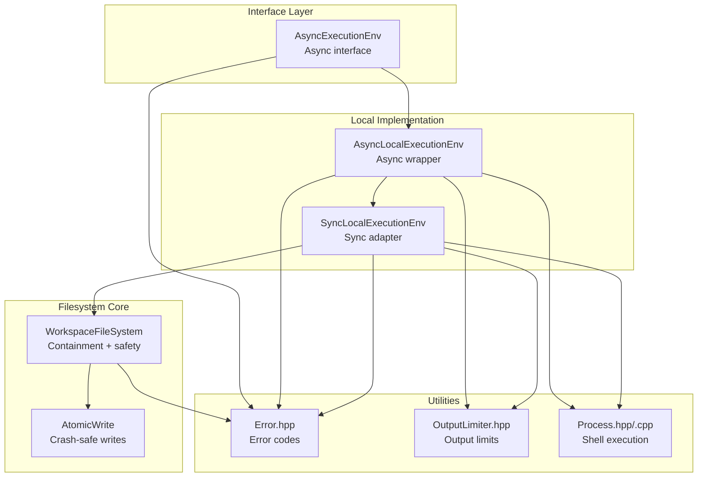
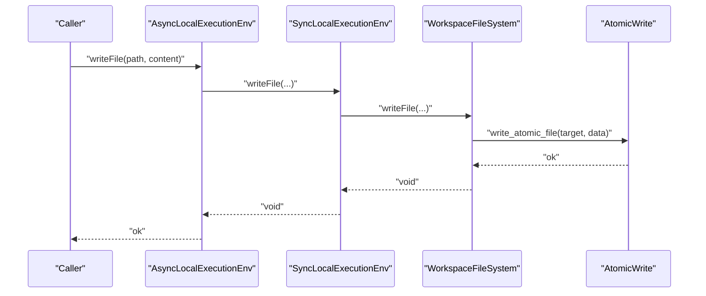
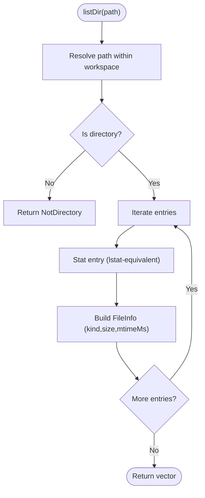
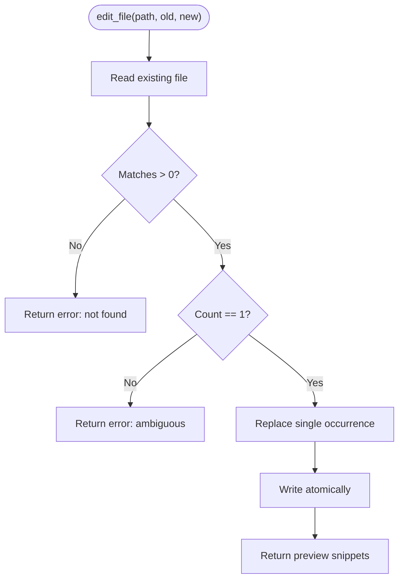
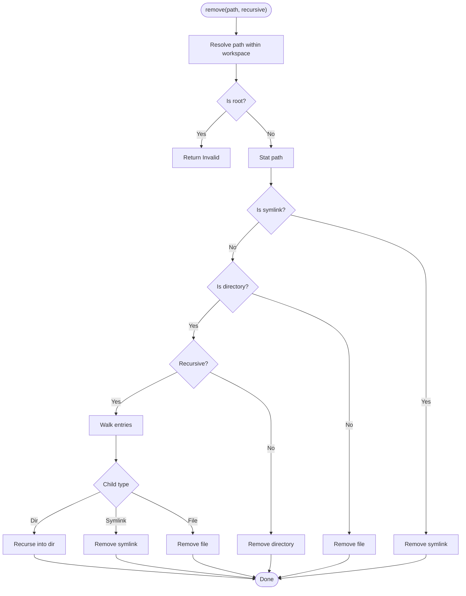
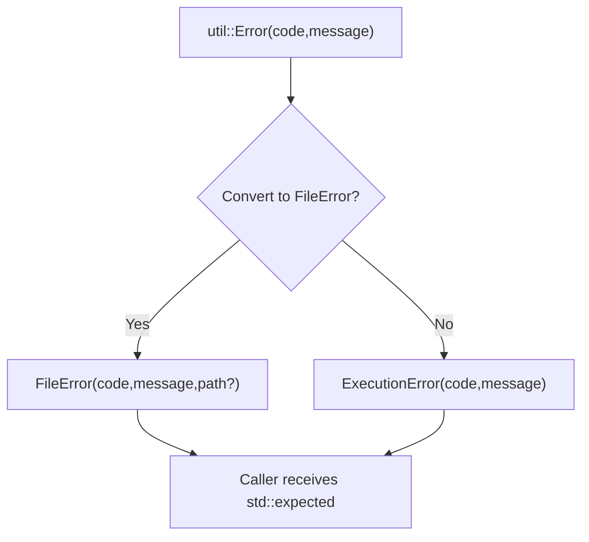
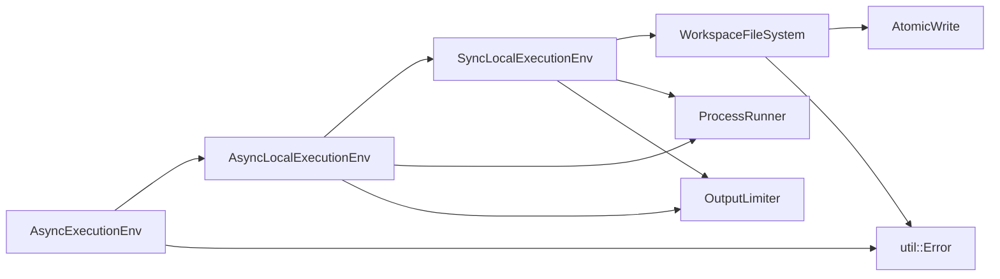

# File System Operations

<cite>
**Referenced Files in This Document**
- [ExecutionEnv.hpp](file://include/cch/harness/ExecutionEnv.hpp)
- [LocalExecutionEnv.hpp](file://include/cch/harness/LocalExecutionEnv.hpp)
- [AsyncLocalExecutionEnv.cpp](file://src/harness/AsyncLocalExecutionEnv.cpp)
- [SyncLocalExecutionEnv.cpp](file://src/harness/SyncLocalExecutionEnv.cpp)
- [WorkspaceFileSystem.hpp](file://src/harness/WorkspaceFileSystem.hpp)
- [AtomicWrite.hpp](file://src/harness/AtomicWrite.hpp)
- [Error.hpp](file://include/cch/util/Error.hpp)
- [OutputLimiter.hpp](file://src/util/OutputLimiter.hpp)
- [Process.hpp](file://src/util/Process.hpp)
- [Process.cpp](file://src/util/Process.cpp)
- [WorkspaceFileSystemTest.cpp](file://tests/harness/WorkspaceFileSystemTest.cpp)
</cite>

## Table of Contents
1. [Introduction](#introduction)
2. [Project Structure](#project-structure)
3. [Core Components](#core-components)
4. [Architecture Overview](#architecture-overview)
5. [Detailed Component Analysis](#detailed-component-analysis)
6. [Dependency Analysis](#dependency-analysis)
7. [Performance Considerations](#performance-considerations)
8. [Troubleshooting Guide](#troubleshooting-guide)
9. [Conclusion](#conclusion)

## Introduction
This document describes the file system operations exposed by the execution environment. It covers text and binary file I/O, directory listing, metadata retrieval, safe file editing with preview, existence checks, directory creation, and recursive deletion. It also documents standardized error handling with stable error codes, cross-platform compatibility via a unified abstraction, and performance considerations for large files. Practical usage patterns and best practices for secure file handling are included.

## Project Structure
The file system capability is implemented as a layered abstraction:
- An asynchronous interface defines the capability contract.
- A local implementation provides concrete operations backed by a workspace-scoped filesystem manager.
- A workspace-aware filesystem enforces containment and symlink safety.
- Atomic write utilities ensure crash-safe file updates.
- Tests validate behavior across platforms and edge cases.

**Diagram sources**
- [ExecutionEnv.hpp:198-334](file://include/cch/harness/ExecutionEnv.hpp#L198-L334)
- [LocalExecutionEnv.hpp:10-83](file://include/cch/harness/LocalExecutionEnv.hpp#L10-L83)
- [AsyncLocalExecutionEnv.cpp:10-179](file://src/harness/AsyncLocalExecutionEnv.cpp#L10-L179)
- [SyncLocalExecutionEnv.cpp:81-397](file://src/harness/SyncLocalExecutionEnv.cpp#L81-L397)
- [WorkspaceFileSystem.hpp:31-816](file://src/harness/WorkspaceFileSystem.hpp#L31-L816)
- [AtomicWrite.hpp:29-134](file://src/harness/AtomicWrite.hpp#L29-L134)
- [Error.hpp:10-75](file://include/cch/util/Error.hpp#L10-L75)
- [OutputLimiter.hpp:9-48](file://src/util/OutputLimiter.hpp#L9-L48)
- [Process.hpp:16-56](file://src/util/Process.hpp#L16-L56)
- [Process.cpp:132-261](file://src/util/Process.cpp#L132-L261)

**Section sources**
- [ExecutionEnv.hpp:198-334](file://include/cch/harness/ExecutionEnv.hpp#L198-L334)
- [LocalExecutionEnv.hpp:10-83](file://include/cch/harness/LocalExecutionEnv.hpp#L10-L83)
- [AsyncLocalExecutionEnv.cpp:10-179](file://src/harness/AsyncLocalExecutionEnv.cpp#L10-L179)
- [SyncLocalExecutionEnv.cpp:81-397](file://src/harness/SyncLocalExecutionEnv.cpp#L81-L397)
- [WorkspaceFileSystem.hpp:31-816](file://src/harness/WorkspaceFileSystem.hpp#L31-L816)
- [AtomicWrite.hpp:29-134](file://src/harness/AtomicWrite.hpp#L29-L134)
- [Error.hpp:10-75](file://include/cch/util/Error.hpp#L10-L75)
- [OutputLimiter.hpp:9-48](file://src/util/OutputLimiter.hpp#L9-L48)
- [Process.hpp:16-56](file://src/util/Process.hpp#L16-L56)
- [Process.cpp:132-261](file://src/util/Process.cpp#L132-L261)

## Core Components
- AsyncExecutionEnv: Defines the async capability surface for file and shell operations, including:
  - Text and binary I/O
  - Directory listing and metadata
  - Existence checks, directory creation, and recursive deletion
  - Safe text replacement with preview
  - Temporary resource creation
  - Standardized error codes for file and execution failures
- AsyncLocalExecutionEnv and SyncLocalExecutionEnv: Local implementations that delegate to WorkspaceFileSystem for filesystem operations and to ProcessRunner for shell execution.
- WorkspaceFileSystem: Enforces workspace containment, rejects escapes and unsafe symlinks, and provides robust file operations with platform-specific optimizations.
- AtomicWrite: Provides crash-safe file writes by staging to a temporary file and renaming atomically.
- Error conversion: Converts internal error codes to stable FileError and ExecutionError enums for callers.

Key capabilities:
- Text and binary reads/writes
- Append operations
- Metadata retrieval (name, path, kind, size, mtimeMs)
- Directory listing without following symlinks
- Existence checks
- Directory creation (recursive by default)
- Recursive deletion with symlink safety
- Canonical path resolution with symlink resolution
- Temporary directory and file creation within workspace
- Safe text replacement with preview and ambiguity checks

**Section sources**
- [ExecutionEnv.hpp:25-106](file://include/cch/harness/ExecutionEnv.hpp#L25-L106)
- [ExecutionEnv.hpp:198-334](file://include/cch/harness/ExecutionEnv.hpp#L198-L334)
- [LocalExecutionEnv.hpp:10-83](file://include/cch/harness/LocalExecutionEnv.hpp#L10-L83)
- [WorkspaceFileSystem.hpp:31-816](file://src/harness/WorkspaceFileSystem.hpp#L31-L816)
- [AtomicWrite.hpp:29-134](file://src/harness/AtomicWrite.hpp#L29-L134)
- [Error.hpp:10-75](file://include/cch/util/Error.hpp#L10-L75)

## Architecture Overview
The execution environment exposes a stable async interface. The local implementation bridges to synchronous operations that are delegated to WorkspaceFileSystem. Writes are performed atomically via AtomicWrite. Shell execution is handled separately by ProcessRunner.

```mermaid
classDiagram
class AsyncExecutionEnv {
+workspace() path
+bash_enabled() bool
+read_file(path,offset,limit) AsyncFileReadResult
+write_file(path,content,create_parents) AsyncFileWriteResult
+edit_file(path,old,new) AsyncFileEditResult
+run_shell(cmd,timeout) AsyncShellResult
+absolutePath(path) string
+joinPath(parts) string
+readTextFile(path) string
+readTextLines(path,maxLines) vector<string>
+readBinaryFile(path) BinaryData
+writeFile(path,content) void
+appendFile(path,content) void
+fileInfo(path) FileInfo
+listDir(path) vector<FileInfo>
+canonicalPath(path) string
+exists(path) bool
+createDir(path,recursive) void
+remove(path,recursive) void
+createTempDir(prefix) string
+createTempFile(prefix,suffix) string
+exec(cmd,options) ShellExecResult
}
class AsyncLocalExecutionEnv {
-sync_ SyncLocalExecutionEnv
+workspace() path
+bash_enabled() bool
+read_file(...)
+write_file(...)
+edit_file(...)
+run_shell(...)
+absolutePath(...)
+joinPath(...)
+readTextFile(...)
+readTextLines(...)
+readBinaryFile(...)
+writeFile(...)
+appendFile(...)
+fileInfo(...)
+listDir(...)
+canonicalPath(...)
+exists(...)
+createDir(...)
+remove(...)
+createTempDir(...)
+createTempFile(...)
+exec(...)
}
class SyncLocalExecutionEnv {
-workspace_ path
-bash_enabled_ bool
-secret_env_names_ vector<string>
-runner_ ProcessRunner
+read_file(...)
+write_file(...)
+edit_file(...)
+run_shell(...)
+absolutePath(...)
+joinPath(...)
+readTextFile(...)
+readTextLines(...)
+readBinaryFile(...)
+writeFile(...)
+appendFile(...)
+fileInfo(...)
+listDir(...)
+canonicalPath(...)
+exists(...)
+createDir(...)
+remove(...)
+createTempDir(...)
+createTempFile(...)
+exec(...)
}
class WorkspaceFileSystem {
-root_ path
+resolve_addressed_path(req) path
+read_existing_file(path) string
+write_file(path,content,create_parents) size_t
+absolutePath(path) string
+joinPath(parts) string
+readTextFile(path) string
+readTextLines(path,maxLines) vector<string>
+readBinaryFile(path) BinaryData
+writeFile(path,content) void
+appendFile(path,content) void
+fileInfo(path) FileInfo
+listDir(path) vector<FileInfo>
+canonicalPath(path) string
+exists(path) bool
+createDir(path,recursive) void
+remove(path,recursive) void
+createTempDir(prefix) string
+createTempFile(prefix,suffix) string
}
class AtomicWrite {
+write_atomic_file(target,content) void
}
AsyncExecutionEnv <|.. AsyncLocalExecutionEnv
AsyncLocalExecutionEnv --> SyncLocalExecutionEnv : "delegates"
SyncLocalExecutionEnv --> WorkspaceFileSystem : "uses"
WorkspaceFileSystem --> AtomicWrite : "writes via"
```

**Diagram sources**
- [ExecutionEnv.hpp:198-334](file://include/cch/harness/ExecutionEnv.hpp#L198-L334)
- [LocalExecutionEnv.hpp:10-83](file://include/cch/harness/LocalExecutionEnv.hpp#L10-L83)
- [AsyncLocalExecutionEnv.cpp:10-179](file://src/harness/AsyncLocalExecutionEnv.cpp#L10-L179)
- [SyncLocalExecutionEnv.cpp:81-397](file://src/harness/SyncLocalExecutionEnv.cpp#L81-L397)
- [WorkspaceFileSystem.hpp:31-816](file://src/harness/WorkspaceFileSystem.hpp#L31-L816)
- [AtomicWrite.hpp:29-134](file://src/harness/AtomicWrite.hpp#L29-L134)

## Detailed Component Analysis

### File I/O Capabilities
- Text reads:
  - read_file(offset, limit): Streams text with output limits and optional truncation.
  - readTextFile(path): Entire UTF-8 file.
  - readTextLines(path, maxLines): Lines up to a limit.
- Binary reads:
  - readBinaryFile(path): Returns raw bytes.
- Writes:
  - write_file(path, content, create_parents): Compatibility wrapper.
  - writeFile(path, WriteContent): Creates or overwrites with text or binary.
  - appendFile(path, WriteContent): Appends text or binary.
- Safety:
  - All writes are atomic via AtomicWrite to avoid partial files.
  - Parent creation is controlled by flags to prevent unintended side effects.

**Diagram sources**
- [AsyncLocalExecutionEnv.cpp:93-96](file://src/harness/AsyncLocalExecutionEnv.cpp#L93-L96)
- [SyncLocalExecutionEnv.cpp:249-251](file://src/harness/SyncLocalExecutionEnv.cpp#L249-L251)
- [WorkspaceFileSystem.hpp:255-271](file://src/harness/WorkspaceFileSystem.hpp#L255-L271)
- [AtomicWrite.hpp:29-134](file://src/harness/AtomicWrite.hpp#L29-L134)

**Section sources**
- [ExecutionEnv.hpp:207-268](file://include/cch/harness/ExecutionEnv.hpp#L207-L268)
- [AsyncLocalExecutionEnv.cpp:93-103](file://src/harness/AsyncLocalExecutionEnv.cpp#L93-L103)
- [SyncLocalExecutionEnv.cpp:249-251](file://src/harness/SyncLocalExecutionEnv.cpp#L249-L251)
- [WorkspaceFileSystem.hpp:210-271](file://src/harness/WorkspaceFileSystem.hpp#L210-L271)
- [AtomicWrite.hpp:29-134](file://src/harness/AtomicWrite.hpp#L29-L134)

### Directory Listing and Metadata
- listDir(path): Lists direct children without following symlinks; metadata per entry includes kind, size, and mtimeMs.
- fileInfo(path): Returns FileInfo with name, path, kind, size, and mtimeMs; does not follow symlinks for metadata.
- canonicalPath(path): Resolves symlinks for an existing path, ensuring result remains inside workspace.
- exists(path): Returns false for missing paths; other errors propagate as FileError.

**Diagram sources**
- [WorkspaceFileSystem.hpp:373-432](file://src/harness/WorkspaceFileSystem.hpp#L373-L432)
- [WorkspaceFileSystem.hpp:306-371](file://src/harness/WorkspaceFileSystem.hpp#L306-L371)

**Section sources**
- [WorkspaceFileSystem.hpp:373-432](file://src/harness/WorkspaceFileSystem.hpp#L373-L432)
- [WorkspaceFileSystem.hpp:306-371](file://src/harness/WorkspaceFileSystem.hpp#L306-L371)

### Safe Text Replacement with Preview
- edit_file(path, old_text, new_text):
  - Reads existing content.
  - Counts occurrences; fails if zero or more than one match.
  - Replaces the single occurrence and writes atomically.
  - Returns preview snippets of old and new text (limited length).

**Diagram sources**
- [SyncLocalExecutionEnv.cpp:147-167](file://src/harness/SyncLocalExecutionEnv.cpp#L147-L167)
- [WorkspaceFileSystem.hpp:255-271](file://src/harness/WorkspaceFileSystem.hpp#L255-L271)

**Section sources**
- [ExecutionEnv.hpp:215-218](file://include/cch/harness/ExecutionEnv.hpp#L215-L218)
- [SyncLocalExecutionEnv.cpp:147-167](file://src/harness/SyncLocalExecutionEnv.cpp#L147-L167)

### Existence Checking, Directory Creation, and Recursive Deletion
- exists(path): False for missing; other errors as FileError.
- createDir(path, recursive=true): Creates directories; recursive by default.
- remove(path, recursive=false): Removes files or directories; recursive deletes contents without recursing into symlinks; rejects removing the workspace root.

**Diagram sources**
- [WorkspaceFileSystem.hpp:501-562](file://src/harness/WorkspaceFileSystem.hpp#L501-L562)

**Section sources**
- [WorkspaceFileSystem.hpp:452-465](file://src/harness/WorkspaceFileSystem.hpp#L452-L465)
- [WorkspaceFileSystem.hpp:467-499](file://src/harness/WorkspaceFileSystem.hpp#L467-L499)
- [WorkspaceFileSystem.hpp:501-562](file://src/harness/WorkspaceFileSystem.hpp#L501-L562)

### File Information Retrieval
- FileInfo includes name, path, kind (File/Directory/Symlink), size, and mtimeMs.
- Platform differences:
  - Unix: Uses lstat-equivalent APIs to avoid following symlinks for metadata.
  - Windows: Uses filesystem APIs and handles last write time conversion.

**Section sources**
- [ExecutionEnv.hpp:94-106](file://include/cch/harness/ExecutionEnv.hpp#L94-L106)
- [WorkspaceFileSystem.hpp:306-371](file://src/harness/WorkspaceFileSystem.hpp#L306-L371)

### Cross-Platform Compatibility and Containment
- WorkspaceFileSystem enforces:
  - No absolute paths
  - No ".." escapes
  - No symlink traversal outside workspace for reads/writes
  - Canonicalization and containment checks
- AtomicWrite adapts to platform semantics for safe replacement.

**Section sources**
- [WorkspaceFileSystem.hpp:47-68](file://src/harness/WorkspaceFileSystem.hpp#L47-L68)
- [WorkspaceFileSystem.hpp:313-341](file://src/harness/WorkspaceFileSystem.hpp#L313-L341)
- [AtomicWrite.hpp:29-134](file://src/harness/AtomicWrite.hpp#L29-L134)

### Error Handling and Codes
- FileError codes: Aborted, NotFound, PermissionDenied, NotDirectory, IsDirectory, Invalid, NotSupported, Unknown.
- ExecutionError codes: Aborted, Timeout, ShellUnavailable, SpawnError, CallbackError, NotSupported, Unknown.
- Error conversion:
  - FileError is derived from internal util::Error with Workspace/Validation/Cancellation mapping.
  - ExecutionError maps timeouts and callback errors appropriately.

**Diagram sources**
- [ExecutionEnv.hpp:139-192](file://include/cch/harness/ExecutionEnv.hpp#L139-L192)
- [WorkspaceFileSystem.hpp:621-637](file://src/harness/WorkspaceFileSystem.hpp#L621-L637)

**Section sources**
- [ExecutionEnv.hpp:58-92](file://include/cch/harness/ExecutionEnv.hpp#L58-L92)
- [ExecutionEnv.hpp:139-192](file://include/cch/harness/ExecutionEnv.hpp#L139-L192)
- [WorkspaceFileSystem.hpp:621-637](file://src/harness/WorkspaceFileSystem.hpp#L621-L637)

### Practical Examples and Best Practices
- Reading text with limits:
  - Use read_file with offset and limit to page content safely.
  - Use readTextLines with maxLines to cap memory usage.
- Writing safely:
  - Prefer writeFile for atomic updates; appendFile for log-like growth.
- Editing:
  - Use edit_file for single, unambiguous replacements; rely on preview snippets.
- Existence and metadata:
  - Use exists to detect missing files without throwing; use fileInfo for size/mtime/kind.
- Directory operations:
  - createDir(recursive=true) for nested paths; remove(recursive=true) for cleanup.
- Security:
  - Never pass absolute paths or paths with ".."; rely on workspace containment.
  - Avoid writing through symlinks; WorkspaceFileSystem rejects final symlink targets.

**Section sources**
- [ExecutionEnv.hpp:207-268](file://include/cch/harness/ExecutionEnv.hpp#L207-L268)
- [WorkspaceFileSystemTest.cpp:10-19](file://tests/harness/WorkspaceFileSystemTest.cpp#L10-L19)
- [WorkspaceFileSystemTest.cpp:175-190](file://tests/harness/WorkspaceFileSystemTest.cpp#L175-L190)
- [WorkspaceFileSystemTest.cpp:208-225](file://tests/harness/WorkspaceFileSystemTest.cpp#L208-L225)
- [WorkspaceFileSystemTest.cpp:227-240](file://tests/harness/WorkspaceFileSystemTest.cpp#L227-L240)

## Dependency Analysis
- AsyncExecutionEnv depends on:
  - AsyncLocalExecutionEnv for async wrappers
  - SyncLocalExecutionEnv for synchronous operations
  - WorkspaceFileSystem for filesystem operations
  - ProcessRunner for shell execution
  - util::Error for error representation
- WorkspaceFileSystem depends on:
  - AtomicWrite for safe writes
  - util::Error for error codes
  - std::filesystem for path operations and directory iteration
- OutputLimiter is used by read_file to enforce streaming limits.

**Diagram sources**
- [ExecutionEnv.hpp:198-334](file://include/cch/harness/ExecutionEnv.hpp#L198-L334)
- [LocalExecutionEnv.hpp:10-83](file://include/cch/harness/LocalExecutionEnv.hpp#L10-L83)
- [AsyncLocalExecutionEnv.cpp:10-179](file://src/harness/AsyncLocalExecutionEnv.cpp#L10-L179)
- [SyncLocalExecutionEnv.cpp:81-397](file://src/harness/SyncLocalExecutionEnv.cpp#L81-L397)
- [WorkspaceFileSystem.hpp:31-816](file://src/harness/WorkspaceFileSystem.hpp#L31-L816)
- [AtomicWrite.hpp:29-134](file://src/harness/AtomicWrite.hpp#L29-L134)
- [Error.hpp:10-75](file://include/cch/util/Error.hpp#L10-L75)
- [OutputLimiter.hpp:9-48](file://src/util/OutputLimiter.hpp#L9-L48)
- [Process.hpp:16-56](file://src/util/Process.hpp#L16-L56)

**Section sources**
- [ExecutionEnv.hpp:198-334](file://include/cch/harness/ExecutionEnv.hpp#L198-L334)
- [WorkspaceFileSystem.hpp:31-816](file://src/harness/WorkspaceFileSystem.hpp#L31-L816)
- [AsyncLocalExecutionEnv.cpp:10-179](file://src/harness/AsyncLocalExecutionEnv.cpp#L10-L179)
- [SyncLocalExecutionEnv.cpp:81-397](file://src/harness/SyncLocalExecutionEnv.cpp#L81-L397)

## Performance Considerations
- Streaming reads:
  - read_file uses OutputLimiter to cap bytes and lines, preventing excessive memory usage.
- Large writes:
  - AtomicWrite stages content in a temporary file and renames atomically to minimize partial writes.
- Directory iteration:
  - listDir iterates entries and builds FileInfo incrementally; avoid deep recursive listings in hot paths.
- Shell execution:
  - ProcessRunner supports streaming stdout/stderr and per-stream truncation to bound memory.
- Cross-platform:
  - Unix path operations leverage low-level APIs for safety; Windows uses filesystem APIs with equivalent semantics.

[No sources needed since this section provides general guidance]

## Troubleshooting Guide
Common issues and resolutions:
- Path rejected as escaping workspace:
  - Ensure paths are relative and do not contain "..".
- PermissionDenied or Invalid errors:
  - Verify the path exists and is appropriate for the operation; check for symlink traps.
- NotFound during listing or metadata:
  - Confirm the path exists; note that missing paths return false for exists and NotFound for metadata.
- Shell unavailable:
  - Bash is disabled by default; enable explicitly if required.
- Callback errors:
  - Exceptions thrown in stdout/stderr callbacks propagate as ExecutionError::CallbackError.

**Section sources**
- [WorkspaceFileSystemTest.cpp:336-344](file://tests/harness/WorkspaceFileSystemTest.cpp#L336-L344)
- [WorkspaceFileSystemTest.cpp:125-133](file://tests/harness/WorkspaceFileSystemTest.cpp#L125-L133)
- [WorkspaceFileSystemTest.cpp:164-173](file://tests/harness/WorkspaceFileSystemTest.cpp#L164-L173)
- [SyncLocalExecutionEnv.cpp:356-397](file://src/harness/SyncLocalExecutionEnv.cpp#L356-L397)

## Conclusion
The execution environment provides a robust, cross-platform, and secure file system abstraction. It enforces workspace containment, offers atomic writes, and exposes a comprehensive set of operations for reading, writing, listing, and managing files and directories. Standardized error codes and preview-based editing help callers handle failures gracefully and avoid destructive mistakes. For large-scale operations, streaming reads and bounded outputs keep memory usage under control.