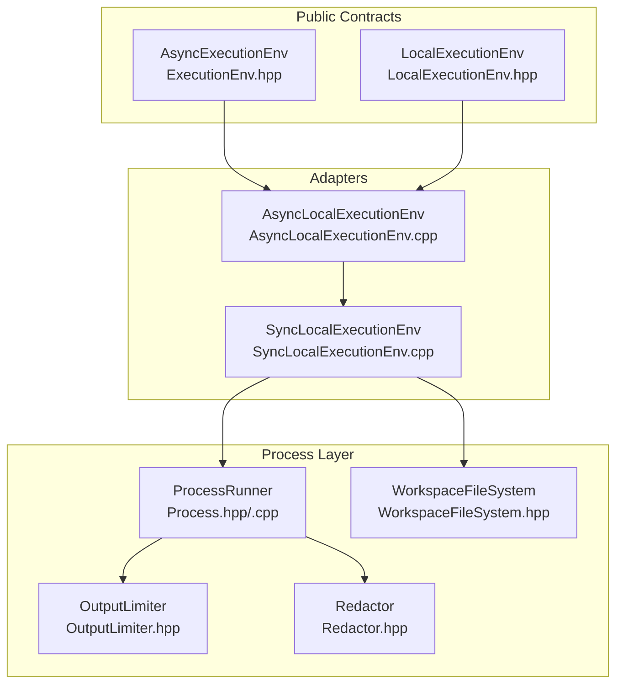
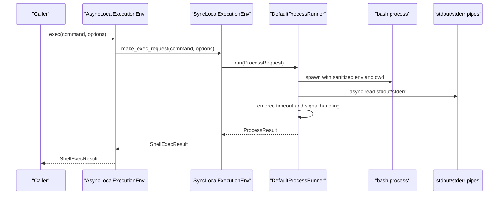
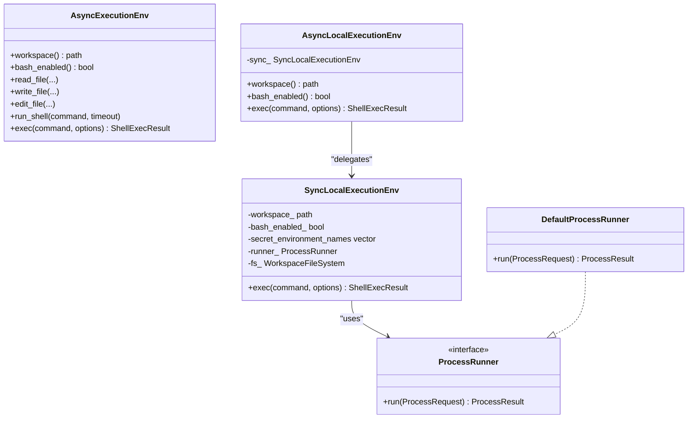
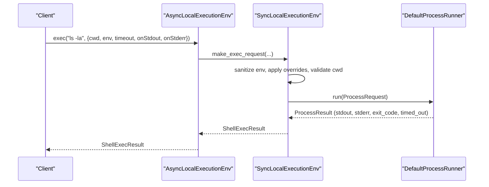
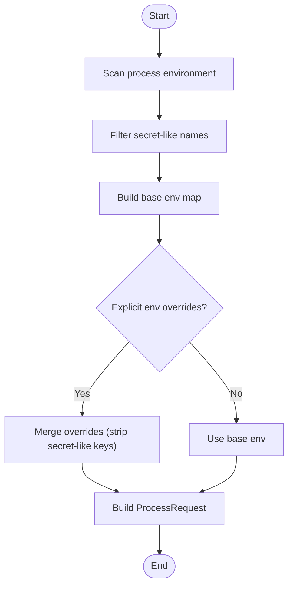
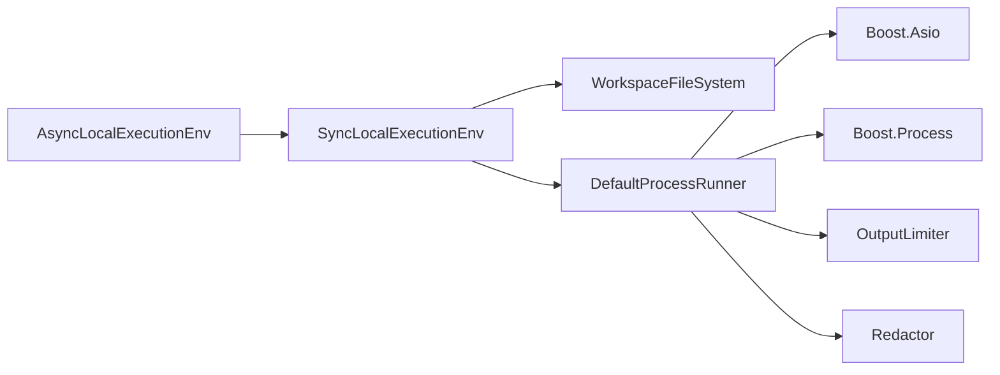

# Process Execution

<cite>
**Referenced Files in This Document**
- [ExecutionEnv.hpp](file://include/cch/harness/ExecutionEnv.hpp)
- [LocalExecutionEnv.hpp](file://include/cch/harness/LocalExecutionEnv.hpp)
- [AsyncLocalExecutionEnv.cpp](file://src/harness/AsyncLocalExecutionEnv.cpp)
- [SyncLocalExecutionEnv.cpp](file://src/harness/SyncLocalExecutionEnv.cpp)
- [Process.hpp](file://src/util/Process.hpp)
- [Process.cpp](file://src/util/Process.cpp)
- [WorkspaceFileSystem.hpp](file://src/harness/WorkspaceFileSystem.hpp)
- [OutputLimiter.hpp](file://src/util/OutputLimiter.hpp)
- [AsyncLocalExecutionEnvTest.cpp](file://tests/harness/AsyncLocalExecutionEnvTest.cpp)
- [Redactor.hpp](file://src/util/Redactor.hpp)
- [README.md](file://README.md)
</cite>

## Table of Contents
1. [Introduction](#introduction)
2. [Project Structure](#project-structure)
3. [Core Components](#core-components)
4. [Architecture Overview](#architecture-overview)
5. [Detailed Component Analysis](#detailed-component-analysis)
6. [Dependency Analysis](#dependency-analysis)
7. [Performance Considerations](#performance-considerations)
8. [Troubleshooting Guide](#troubleshooting-guide)
9. [Conclusion](#conclusion)
10. [Appendices](#appendices)

## Introduction
This document explains the process execution capabilities within the execution environment. It focuses on:
- Shell command execution with configurable timeouts, working directory overrides, and environment variable sanitization
- Process spawning mechanisms that remove sensitive variables from tool execution contexts
- Async and sync execution environment implementations and their performance characteristics
- Exec options including timeout configuration, stdout/stderr streaming callbacks, and environment overrides
- Process lifecycle management, signal handling, and resource cleanup procedures
- Practical examples of command execution patterns, timeout handling, and environment sanitization
- Process isolation, security considerations, and error handling strategies for failed executions

## Project Structure
The process execution feature spans several headers and implementations:
- Capability contracts and public API surface in the harness headers
- Local execution environment adapters (async and sync)
- Process runner abstraction and default implementation
- Workspace filesystem safety utilities
- Output limiting and redaction utilities
- Tests demonstrating concurrency, timeouts, and environment sanitization

**Diagram sources**
- [ExecutionEnv.hpp:198-334](file://include/cch/harness/ExecutionEnv.hpp#L198-L334)
- [LocalExecutionEnv.hpp:10-83](file://include/cch/harness/LocalExecutionEnv.hpp#L10-L83)
- [AsyncLocalExecutionEnv.cpp:10-179](file://src/harness/AsyncLocalExecutionEnv.cpp#L10-L179)
- [SyncLocalExecutionEnv.cpp:81-399](file://src/harness/SyncLocalExecutionEnv.cpp#L81-L399)
- [Process.hpp:45-54](file://src/util/Process.hpp#L45-L54)
- [Process.cpp:132-261](file://src/util/Process.cpp#L132-L261)
- [WorkspaceFileSystem.hpp:31-819](file://src/harness/WorkspaceFileSystem.hpp#L31-L819)
- [OutputLimiter.hpp:9-48](file://src/util/OutputLimiter.hpp#L9-L48)
- [Redactor.hpp:10-42](file://src/util/Redactor.hpp#L10-L42)

**Section sources**
- [ExecutionEnv.hpp:198-334](file://include/cch/harness/ExecutionEnv.hpp#L198-L334)
- [LocalExecutionEnv.hpp:10-83](file://include/cch/harness/LocalExecutionEnv.hpp#L10-L83)
- [AsyncLocalExecutionEnv.cpp:10-179](file://src/harness/AsyncLocalExecutionEnv.cpp#L10-L179)
- [SyncLocalExecutionEnv.cpp:81-399](file://src/harness/SyncLocalExecutionEnv.cpp#L81-L399)
- [Process.hpp:45-54](file://src/util/Process.hpp#L45-L54)
- [Process.cpp:132-261](file://src/util/Process.cpp#L132-L261)
- [WorkspaceFileSystem.hpp:31-819](file://src/harness/WorkspaceFileSystem.hpp#L31-L819)
- [OutputLimiter.hpp:9-48](file://src/util/OutputLimiter.hpp#L9-L48)
- [Redactor.hpp:10-42](file://src/util/Redactor.hpp#L10-L42)

## Core Components
- AsyncExecutionEnv: Public capability seam defining async filesystem and shell operations, including the new pi-shaped exec with split streams and callbacks.
- AsyncLocalExecutionEnv: Async adapter delegating to a shared SyncLocalExecutionEnv instance.
- SyncLocalExecutionEnv: Concrete implementation building ProcessRequest objects, applying workspace containment, environment sanitization, and timeout handling.
- ProcessRunner and DefaultProcessRunner: Asynchronous process spawning, stdout/stderr streaming, per-stream output limits, and timeout/signals.
- WorkspaceFileSystem: Workspace-scoped path resolution, containment, symlink safety, and temp artifact creation.
- OutputLimiter: Output truncation and marking for compatibility.
- Redactor: Heuristic-based redaction of secret-like values and keys.

Key execution contracts:
- ExecOptions: cwd override, env overrides, timeout, stdout/stderr streaming callbacks.
- ProcessRequest/ProcessResult: request/response for process execution with split streams and truncation flags.
- ShellExecResult: compatibility result with combined output and exit code.

**Section sources**
- [ExecutionEnv.hpp:114-133](file://include/cch/harness/ExecutionEnv.hpp#L114-L133)
- [Process.hpp:16-43](file://src/util/Process.hpp#L16-L43)
- [Process.hpp:45-54](file://src/util/Process.hpp#L45-L54)
- [WorkspaceFileSystem.hpp:31-819](file://src/harness/WorkspaceFileSystem.hpp#L31-L819)
- [OutputLimiter.hpp:9-48](file://src/util/OutputLimiter.hpp#L9-L48)
- [Redactor.hpp:10-42](file://src/util/Redactor.hpp#L10-L42)

## Architecture Overview
The execution environment composes capability contracts, adapters, and the process runner:
- AsyncExecutionEnv defines the public interface and pi-shaped contracts.
- AsyncLocalExecutionEnv forwards to SyncLocalExecutionEnv for synchronous execution.
- SyncLocalExecutionEnv constructs ProcessRequest objects, validates cwd, builds sanitized environments, and invokes DefaultProcessRunner.
- DefaultProcessRunner spawns bash, drains stdout/stderr pipes asynchronously, enforces timeouts, and manages signals and cleanup.

**Diagram sources**
- [AsyncLocalExecutionEnv.cpp:150-177](file://src/harness/AsyncLocalExecutionEnv.cpp#L150-L177)
- [SyncLocalExecutionEnv.cpp:295-346](file://src/harness/SyncLocalExecutionEnv.cpp#L295-L346)
- [Process.cpp:132-261](file://src/util/Process.cpp#L132-L261)

## Detailed Component Analysis

### AsyncExecutionEnv and Exec Options
- Defines ExecOptions with cwd override, env overrides, timeout, and optional stdout/stderr callbacks.
- Provides exec(command, options) returning ShellExecResult with separate stdout/stderr and exit code.
- Converts typed execution errors to util::Error for compatibility.

Practical implications:
- cwd is validated through workspace containment before spawning.
- env overrides are applied after sanitizing base environment; secret-like keys are stripped.
- Streaming callbacks receive raw chunks; exceptions in callbacks propagate as execution errors.

**Section sources**
- [ExecutionEnv.hpp:114-133](file://include/cch/harness/ExecutionEnv.hpp#L114-L133)
- [ExecutionEnv.hpp:328-334](file://include/cch/harness/ExecutionEnv.hpp#L328-L334)
- [ExecutionEnv.hpp:166-192](file://include/cch/harness/ExecutionEnv.hpp#L166-L192)

### AsyncLocalExecutionEnv
- Holds a shared SyncLocalExecutionEnv instance.
- Implements exec by delegating to sync_ and translating results.
- Inherits workspace and bash_enabled from sync_.

Concurrency characteristics:
- Delegates to DefaultProcessRunner which uses Boost.Asio coroutines and detached execution to run multiple commands concurrently.

**Section sources**
- [LocalExecutionEnv.hpp:10-83](file://include/cch/harness/LocalExecutionEnv.hpp#L10-L83)
- [AsyncLocalExecutionEnv.cpp:10-179](file://src/harness/AsyncLocalExecutionEnv.cpp#L10-L179)

### SyncLocalExecutionEnv
Responsibilities:
- Validates bash enablement and constructs ProcessRequest.
- Builds sanitized base environment by scanning process environment and filtering secret-like names.
- Applies explicit env overrides, stripping secret-like keys.
- Validates cwd override against workspace containment and directory existence.
- Spawns process via DefaultProcessRunner and translates results/errors.

Environment sanitization:
- Scans environment variables and filters out names matching configured secret names or heuristic patterns (e.g., API_KEY, TOKEN, SECRET, PASSWORD, CREDENTIAL, PRIVATE_KEY, AUTH, JWT, CERTIFICATE, PASSPHRASE, OPENAI).
- Explicit env overrides shadow sanitized base variables, but secret-like keys are not passed to the child process.

Timeout handling:
- Uses default 30s timeout if not provided; respects provided timeout in ExecOptions.
- Enforces steady-clock deadlines and cancels pipes on timeout.

**Section sources**
- [SyncLocalExecutionEnv.cpp:81-90](file://src/harness/SyncLocalExecutionEnv.cpp#L81-L90)
- [SyncLocalExecutionEnv.cpp:317-346](file://src/harness/SyncLocalExecutionEnv.cpp#L317-L346)
- [SyncLocalExecutionEnv.cpp:356-399](file://src/harness/SyncLocalExecutionEnv.cpp#L356-L399)

### DefaultProcessRunner
Core behaviors:
- Spawns bash with explicit working directory and environment.
- Drains stdout and stderr asynchronously via async_pipe and co_spawn.
- Enforces per-stream output limits and line counts.
- Implements timeout polling with a short poll interval; on timeout, cancels pipes and terminates process group.
- On timeout, waits briefly then sends SIGKILL on POSIX systems; otherwise uses process group terminate on Windows.
- Wraps callback exceptions as execution errors and ensures child is terminated safely.
- Produces ProcessResult with separate stdout/stderr, exit code, and truncation flags.

Signal handling and cleanup:
- Uses ChildGuard to ensure termination of child and process group on destruction.
- Releases guard after joining child to avoid double-termination.

**Section sources**
- [Process.hpp:45-54](file://src/util/Process.hpp#L45-L54)
- [Process.cpp:132-261](file://src/util/Process.cpp#L132-L261)

### WorkspaceFileSystem and Containment
- Ensures all addressed paths are workspace-contained and do not traverse symlinks outside the root.
- Validates cwd overrides by resolving and checking directory existence and symlink safety.
- Creates workspace-contained temp directories and files.

**Section sources**
- [WorkspaceFileSystem.hpp:31-819](file://src/harness/WorkspaceFileSystem.hpp#L31-L819)

### Output Limiting and Redaction
- OutputLimiter truncates output by bytes and lines, appending a truncation marker.
- Redactor provides heuristic-based redaction of secret-like values and keys in text.

**Section sources**
- [OutputLimiter.hpp:9-48](file://src/util/OutputLimiter.hpp#L9-L48)
- [Redactor.hpp:10-42](file://src/util/Redactor.hpp#L10-L42)

### Class Diagram: Execution Environment Classes

**Diagram sources**
- [ExecutionEnv.hpp:198-334](file://include/cch/harness/ExecutionEnv.hpp#L198-L334)
- [LocalExecutionEnv.hpp:10-83](file://include/cch/harness/LocalExecutionEnv.hpp#L10-L83)
- [SyncLocalExecutionEnv.cpp:81-90](file://src/harness/SyncLocalExecutionEnv.cpp#L81-L90)
- [Process.hpp:45-54](file://src/util/Process.hpp#L45-L54)
- [Process.cpp:132-261](file://src/util/Process.cpp#L132-L261)

### Sequence Diagram: Exec Flow

**Diagram sources**
- [AsyncLocalExecutionEnv.cpp:150-177](file://src/harness/AsyncLocalExecutionEnv.cpp#L150-L177)
- [SyncLocalExecutionEnv.cpp:295-346](file://src/harness/SyncLocalExecutionEnv.cpp#L295-L346)
- [Process.cpp:132-261](file://src/util/Process.cpp#L132-L261)

### Flowchart: Environment Sanitization

**Diagram sources**
- [SyncLocalExecutionEnv.cpp:317-346](file://src/harness/SyncLocalExecutionEnv.cpp#L317-L346)

## Dependency Analysis
- AsyncLocalExecutionEnv depends on SyncLocalExecutionEnv for synchronous execution.
- SyncLocalExecutionEnv depends on WorkspaceFileSystem for path validation and on DefaultProcessRunner for process execution.
- DefaultProcessRunner depends on Boost.Asio and Boost.Process for asynchronous IO and process spawning.
- OutputLimiter and Redactor provide auxiliary safety and output control.

**Diagram sources**
- [AsyncLocalExecutionEnv.cpp:10-179](file://src/harness/AsyncLocalExecutionEnv.cpp#L10-L179)
- [SyncLocalExecutionEnv.cpp:81-90](file://src/harness/SyncLocalExecutionEnv.cpp#L81-L90)
- [Process.cpp:132-261](file://src/util/Process.cpp#L132-L261)
- [OutputLimiter.hpp:9-48](file://src/util/OutputLimiter.hpp#L9-L48)
- [Redactor.hpp:10-42](file://src/util/Redactor.hpp#L10-L42)

**Section sources**
- [AsyncLocalExecutionEnv.cpp:10-179](file://src/harness/AsyncLocalExecutionEnv.cpp#L10-L179)
- [SyncLocalExecutionEnv.cpp:81-90](file://src/harness/SyncLocalExecutionEnv.cpp#L81-L90)
- [Process.cpp:132-261](file://src/util/Process.cpp#L132-L261)

## Performance Considerations
- Concurrency: AsyncLocalExecutionEnv executes multiple commands concurrently through DefaultProcessRunner’s detached coroutine scheduling.
- Polling and timeouts: DefaultProcessRunner polls child state with a fixed interval and cancels pipes on timeout, minimizing busy-wait overhead.
- Output limits: Per-stream byte and line limits prevent excessive memory usage; truncation markers indicate when output was cut off.
- Environment scanning: Environment filtering occurs once per request; explicit overrides are applied with last-write-wins semantics.

[No sources needed since this section provides general guidance]

## Troubleshooting Guide
Common issues and resolutions:
- Shell disabled: If bash is not enabled, exec returns a typed error indicating shell unavailability. Enable bash explicitly when constructing the environment.
- Timeout: Commands exceeding the configured timeout are terminated; the result indicates timed_out. Adjust ExecOptions.timeout accordingly.
- Secret exposure: Ensure secret-like environment variables are not passed via env overrides; the implementation strips them. Configure additional secret names if needed.
- Workspace containment: cwd overrides must resolve to a directory inside the workspace and not traverse symlinks outside. Validation errors are surfaced as typed FileError.
- Callback exceptions: Exceptions thrown in stdout/stderr callbacks are treated as execution errors and terminate the child safely.

**Section sources**
- [SyncLocalExecutionEnv.cpp:356-399](file://src/harness/SyncLocalExecutionEnv.cpp#L356-L399)
- [Process.cpp:242-244](file://src/util/Process.cpp#L242-L244)
- [WorkspaceFileSystem.hpp:31-819](file://src/harness/WorkspaceFileSystem.hpp#L31-L819)

## Conclusion
The execution environment provides a robust, secure, and efficient mechanism for shell command execution:
- Strong isolation via workspace containment and symlink safety
- Secure environment sanitization with configurable secret-name filtering
- Flexible exec options including cwd overrides, env overrides, timeouts, and streaming callbacks
- Reliable lifecycle management with timeout enforcement and signal handling
- Clear error translation and concurrency support

[No sources needed since this section summarizes without analyzing specific files]

## Appendices

### Practical Examples and Patterns
- Executing a command with a timeout and capturing stdout/stderr:
  - Construct ExecOptions with timeout and optional onStdout/onStderr callbacks.
  - Call exec(command, options) on AsyncLocalExecutionEnv or SyncLocalExecutionEnv.
- Overriding working directory:
  - Provide cwd in ExecOptions; the implementation validates it against workspace containment and directory existence.
- Environment overrides:
  - Provide env in ExecOptions; secret-like keys are stripped; non-secret keys shadow sanitized base variables.
- Handling timeouts:
  - If the process exceeds the configured timeout, timed_out is set in the result; adjust timeout or refactor long-running tasks.
- Concurrency:
  - Multiple exec calls can run concurrently; ensure the underlying runner handles concurrent processes appropriately.

**Section sources**
- [AsyncLocalExecutionEnv.cpp:150-177](file://src/harness/AsyncLocalExecutionEnv.cpp#L150-L177)
- [SyncLocalExecutionEnv.cpp:295-346](file://src/harness/SyncLocalExecutionEnv.cpp#L295-L346)
- [Process.cpp:132-261](file://src/util/Process.cpp#L132-L261)

### Security Considerations
- Environment sanitization:
  - Base environment is filtered for secret-like names; explicit env overrides are also filtered.
  - Additional secret names can be configured during environment construction.
- Workspace containment:
  - All operations are scoped to the workspace; absolute paths and escaping are rejected.
- Output redaction:
  - While process output is not automatically redacted, downstream redaction utilities can help scrub sensitive content from transcripts.

**Section sources**
- [SyncLocalExecutionEnv.cpp:317-346](file://src/harness/SyncLocalExecutionEnv.cpp#L317-L346)
- [WorkspaceFileSystem.hpp:31-819](file://src/harness/WorkspaceFileSystem.hpp#L31-L819)
- [Redactor.hpp:10-42](file://src/util/Redactor.hpp#L10-L42)

### Test Coverage Highlights
- Concurrent execution: Demonstrates multiple commands running concurrently without blocking the IO context.
- Timeout handling: Confirms timeout behavior and that elapsed time reflects non-blocking operation.
- Environment sanitization: Verifies that secret-like environment variables are not propagated to the child process.

**Section sources**
- [AsyncLocalExecutionEnvTest.cpp:138-187](file://tests/harness/AsyncLocalExecutionEnvTest.cpp#L138-L187)
- [AsyncLocalExecutionEnvTest.cpp:189-200](file://tests/harness/AsyncLocalExecutionEnvTest.cpp#L189-L200)