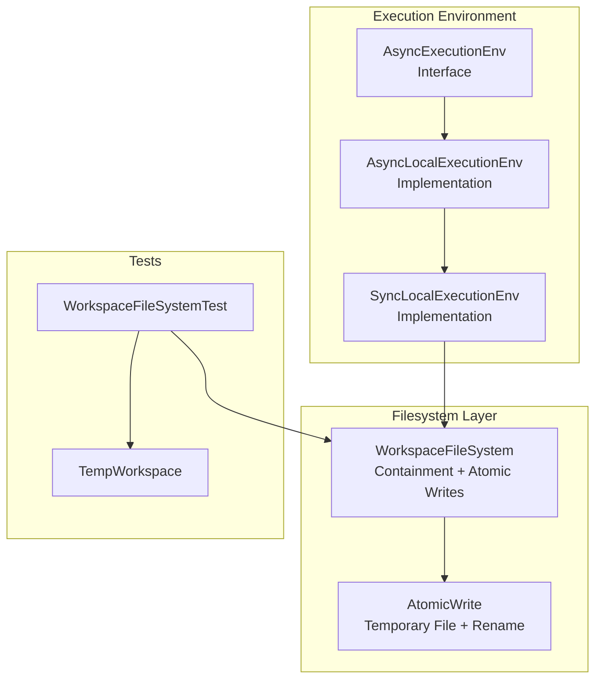
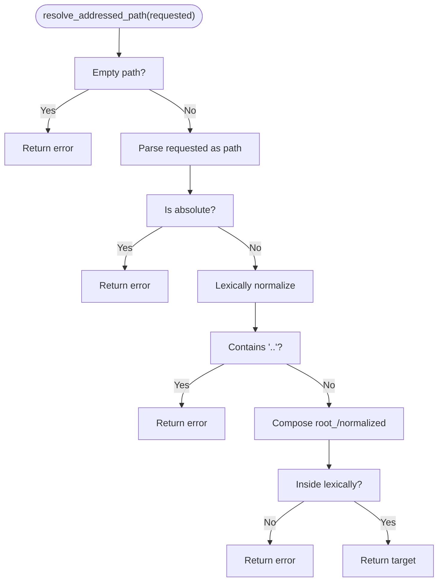
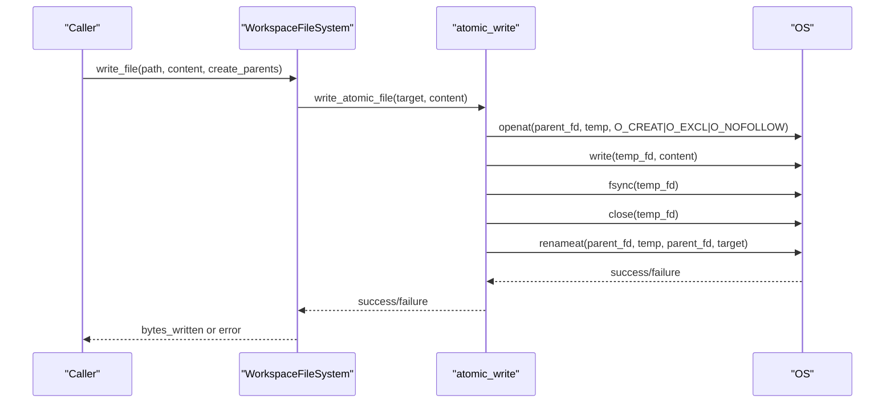
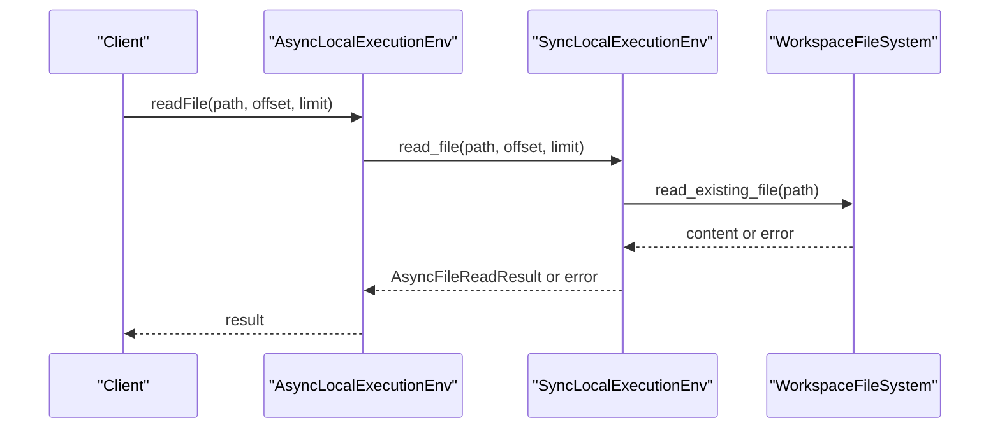
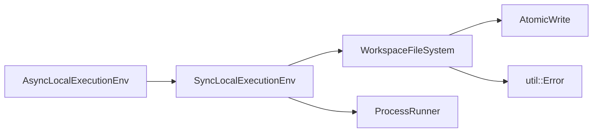

# Workspace Management

<cite>
**Referenced Files in This Document**
- [WorkspaceFileSystem.hpp](file://src/harness/WorkspaceFileSystem.hpp)
- [AtomicWrite.hpp](file://src/harness/AtomicWrite.hpp)
- [ExecutionEnv.hpp](file://include/cch/harness/ExecutionEnv.hpp)
- [LocalExecutionEnv.hpp](file://include/cch/harness/LocalExecutionEnv.hpp)
- [SyncLocalExecutionEnv.hpp](file://src/harness/SyncLocalExecutionEnv.hpp)
- [SyncLocalExecutionEnv.cpp](file://src/harness/SyncLocalExecutionEnv.cpp)
- [AsyncLocalExecutionEnv.cpp](file://src/harness/AsyncLocalExecutionEnv.cpp)
- [WorkspaceFileSystemTest.cpp](file://tests/harness/WorkspaceFileSystemTest.cpp)
- [TempWorkspace.hpp](file://tests/support/TempWorkspace.hpp)
</cite>

## Table of Contents
1. [Introduction](#introduction)
2. [Project Structure](#project-structure)
3. [Core Components](#core-components)
4. [Architecture Overview](#architecture-overview)
5. [Detailed Component Analysis](#detailed-component-analysis)
6. [Dependency Analysis](#dependency-analysis)
7. [Performance Considerations](#performance-considerations)
8. [Troubleshooting Guide](#troubleshooting-guide)
9. [Conclusion](#conclusion)

## Introduction
This document explains the workspace management subsystem that secures file operations within the execution environment. It covers:
- Guard mechanisms preventing path traversal and symlink attacks
- Validation and containment enforcement for all file operations
- Atomic write operations ensuring data integrity
- A filesystem abstraction that enforces permissions and boundaries
- Path resolution, containment enforcement, and workspace initialization
- Practical examples and lifecycle management
- Security isolation from the host system

## Project Structure
The workspace management spans several core files:
- Workspace filesystem abstraction and atomic writes
- Execution environment interfaces and local implementations
- Tests validating security and behavior

**Diagram sources**
- [ExecutionEnv.hpp:198-334](file://include/cch/harness/ExecutionEnv.hpp#L198-L334)
- [LocalExecutionEnv.hpp:10-83](file://include/cch/harness/LocalExecutionEnv.hpp#L10-L83)
- [SyncLocalExecutionEnv.hpp:13-78](file://src/harness/SyncLocalExecutionEnv.hpp#L13-L78)
- [WorkspaceFileSystem.hpp:31-816](file://src/harness/WorkspaceFileSystem.hpp#L31-L816)
- [AtomicWrite.hpp:21-134](file://src/harness/AtomicWrite.hpp#L21-L134)
- [WorkspaceFileSystemTest.cpp:10-345](file://tests/harness/WorkspaceFileSystemTest.cpp#L10-L345)
- [TempWorkspace.hpp:11-41](file://tests/support/TempWorkspace.hpp#L11-L41)

**Section sources**
- [ExecutionEnv.hpp:198-334](file://include/cch/harness/ExecutionEnv.hpp#L198-L334)
- [LocalExecutionEnv.hpp:10-83](file://include/cch/harness/LocalExecutionEnv.hpp#L10-L83)
- [SyncLocalExecutionEnv.hpp:13-78](file://src/harness/SyncLocalExecutionEnv.hpp#L13-L78)
- [WorkspaceFileSystem.hpp:31-816](file://src/harness/WorkspaceFileSystem.hpp#L31-L816)
- [AtomicWrite.hpp:21-134](file://src/harness/AtomicWrite.hpp#L21-L134)
- [WorkspaceFileSystemTest.cpp:10-345](file://tests/harness/WorkspaceFileSystemTest.cpp#L10-L345)
- [TempWorkspace.hpp:11-41](file://tests/support/TempWorkspace.hpp#L11-L41)

## Core Components
- WorkspaceFileSystem: Enforces containment, rejects absolute paths and escapes, prevents symlink traversal, and provides atomic writes.
- AtomicWrite: Implements atomic replacement via temporary files and rename operations.
- AsyncExecutionEnv and implementations: Expose a capability seam for filesystem and shell operations with workspace scoping.
- Tests: Validate containment, symlink safety, atomicity, and error handling.

Key responsibilities:
- Containment: All paths are lexically normalized and validated against the workspace root.
- Symlink safety: Reads and writes avoid following symlinks; parent paths are checked for symlink presence.
- Atomicity: Writes are performed via temporary files and atomic rename to prevent partial writes.
- Permissions: Errors are mapped to stable error codes for consistent handling.

**Section sources**
- [WorkspaceFileSystem.hpp:31-816](file://src/harness/WorkspaceFileSystem.hpp#L31-L816)
- [AtomicWrite.hpp:21-134](file://src/harness/AtomicWrite.hpp#L21-L134)
- [ExecutionEnv.hpp:51-192](file://include/cch/harness/ExecutionEnv.hpp#L51-L192)
- [WorkspaceFileSystemTest.cpp:10-345](file://tests/harness/WorkspaceFileSystemTest.cpp#L10-L345)

## Architecture Overview
The execution environment exposes two surfaces:
- Tool-shaped compatibility methods for legacy integrations
- Pi-shaped filesystem and shell methods for modern capabilities

Both surfaces route through WorkspaceFileSystem for filesystem operations and through SyncLocalExecutionEnv for shell commands.

```mermaid
classDiagram
class AsyncExecutionEnv {
+workspace() path
+bash_enabled() bool
+read_file(path,offset,limit) awaitable
+write_file(path,content,create_parents) awaitable
+edit_file(path,old,new) awaitable
+run_shell(cmd,timeout) awaitable
+absolutePath(path) awaitable
+joinPath(parts) awaitable
+readTextFile(path) awaitable
+readTextLines(path,maxLines) awaitable
+readBinaryFile(path) awaitable
+writeFile(path,content) awaitable
+appendFile(path,content) awaitable
+fileInfo(path) awaitable
+listDir(path) awaitable
+canonicalPath(path) awaitable
+exists(path) awaitable
+createDir(path,recursive) awaitable
+remove(path,recursive) awaitable
+createTempDir(prefix) awaitable
+createTempFile(prefix,suffix) awaitable
+exec(cmd,options) awaitable
}
class AsyncLocalExecutionEnv {
-sync_ SyncLocalExecutionEnv
+workspace() path
+bash_enabled() bool
+read_file(...)
+write_file(...)
+edit_file(...)
+run_shell(...)
+absolutePath(...)
+joinPath(...)
+readTextFile(...)
+readTextLines(...)
+readBinaryFile(...)
+writeFile(...)
+appendFile(...)
+fileInfo(...)
+listDir(...)
+canonicalPath(...)
+exists(...)
+createDir(...)
+remove(...)
+createTempDir(...)
+createTempFile(...)
+exec(...)
}
class SyncLocalExecutionEnv {
-workspace_ path
-bash_enabled_ bool
-secret_environment_names_ vector<string>
-runner_ ProcessRunner
-fs_ WorkspaceFileSystem
+workspace() path
+bash_enabled() bool
+read_file(...)
+write_file(...)
+edit_file(...)
+run_shell(...)
+absolutePath(...)
+joinPath(...)
+readTextFile(...)
+readTextLines(...)
+readBinaryFile(...)
+writeFile(...)
+appendFile(...)
+fileInfo(...)
+listDir(...)
+canonicalPath(...)
+exists(...)
+createDir(...)
+remove(...)
+createTempDir(...)
+createTempFile(...)
+exec(...)
}
class WorkspaceFileSystem {
-root_ path
+create(workspace) static
+root() path
+resolve_addressed_path(requested) path
+read_existing_file(requested) string
+write_file(requested,content,create_parents) size_t
+absolutePath(path) string
+joinPath(parts) string
+readTextFile(path) string
+readTextLines(path,maxLines) vector<string>
+readBinaryFile(path) BinaryData
+writeFile(path,content) void
+appendFile(path,content) void
+fileInfo(path) FileInfo
+listDir(path) vector<FileInfo>
+canonicalPath(path) string
+exists(path) bool
+createDir(path,recursive) void
+remove(path,recursive) void
+createTempDir(prefix) string
+createTempFile(prefix,suffix) string
}
AsyncExecutionEnv <|.. AsyncLocalExecutionEnv
AsyncLocalExecutionEnv --> SyncLocalExecutionEnv : "delegates"
SyncLocalExecutionEnv --> WorkspaceFileSystem : "uses"
```

**Diagram sources**
- [ExecutionEnv.hpp:198-334](file://include/cch/harness/ExecutionEnv.hpp#L198-L334)
- [LocalExecutionEnv.hpp:10-83](file://include/cch/harness/LocalExecutionEnv.hpp#L10-L83)
- [SyncLocalExecutionEnv.hpp:13-78](file://src/harness/SyncLocalExecutionEnv.hpp#L13-L78)
- [WorkspaceFileSystem.hpp:31-816](file://src/harness/WorkspaceFileSystem.hpp#L31-L816)

## Detailed Component Analysis

### WorkspaceFileSystem: Containment and Safety
- Initialization and root normalization: The constructor weakly canonicalizes the workspace path to establish a stable root.
- Path resolution: Rejects absolute paths and any normalized path containing “..” escapes. Ensures the final target remains lexically inside the workspace.
- Read safety: Uses platform-appropriate openat semantics to avoid following symlinks during reads and validates the target is a regular file.
- Write safety: Prevents writing through final symlinks and rejects non-regular targets. Parent directories are created safely without following symlinks.
- Atomic writes: Delegates to atomic write routines that stage content in a temporary file and rename it into place.
- Metadata and listing: Uses lstat-equivalent semantics to avoid following symlinks and reports symlink kinds explicitly.
- Canonicalization: Resolves symlinks but rejects canonicalized targets outside the workspace.
- Removal: Prevents deletion of the workspace root and avoids following symlinks to outside targets when removing.
- Temporary artifacts: Creates workspace-contained temp directories and files under a dedicated area.

**Diagram sources**
- [WorkspaceFileSystem.hpp:49-68](file://src/harness/WorkspaceFileSystem.hpp#L49-L68)

**Section sources**
- [WorkspaceFileSystem.hpp:31-816](file://src/harness/WorkspaceFileSystem.hpp#L31-L816)
- [WorkspaceFileSystemTest.cpp:10-345](file://tests/harness/WorkspaceFileSystemTest.cpp#L10-L345)

### AtomicWrite: Atomic Replacement
- Temporary staging: Allocates a unique temporary filename under the same directory as the target.
- Platform-specific creation: Uses O_NOFOLLOW and directory descriptors to avoid symlink races.
- Flush and close: Ensures data is persisted before renaming.
- Rename atomically: Renames the temporary file to the target, replacing it atomically.
- Fallback behavior: On non-unix platforms, uses a temporary file and atomic rename via filesystem APIs.

**Diagram sources**
- [AtomicWrite.hpp:29-134](file://src/harness/AtomicWrite.hpp#L29-L134)
- [WorkspaceFileSystem.hpp:134-182](file://src/harness/WorkspaceFileSystem.hpp#L134-L182)

**Section sources**
- [AtomicWrite.hpp:21-134](file://src/harness/AtomicWrite.hpp#L21-L134)
- [WorkspaceFileSystem.hpp:134-182](file://src/harness/WorkspaceFileSystem.hpp#L134-L182)

### Execution Environment Interfaces and Implementations
- AsyncExecutionEnv defines the capability seam with both tool-shaped and pi-shaped methods. Many methods default to “not supported,” enabling incremental adoption.
- AsyncLocalExecutionEnv delegates to SyncLocalExecutionEnv for synchronous operations, preserving async semantics.
- SyncLocalExecutionEnv constructs WorkspaceFileSystem with the configured workspace and routes pi-shaped filesystem calls to it. It also handles shell execution with workspace-scoped working directories and sanitized environment variables.

**Diagram sources**
- [LocalExecutionEnv.hpp:10-83](file://include/cch/harness/LocalExecutionEnv.hpp#L10-L83)
- [SyncLocalExecutionEnv.cpp:96-137](file://src/harness/SyncLocalExecutionEnv.cpp#L96-L137)
- [WorkspaceFileSystem.hpp:74-132](file://src/harness/WorkspaceFileSystem.hpp#L74-L132)

**Section sources**
- [ExecutionEnv.hpp:198-334](file://include/cch/harness/ExecutionEnv.hpp#L198-L334)
- [LocalExecutionEnv.hpp:10-83](file://include/cch/harness/LocalExecutionEnv.hpp#L10-L83)
- [SyncLocalExecutionEnv.hpp:13-78](file://src/harness/SyncLocalExecutionEnv.hpp#L13-L78)
- [SyncLocalExecutionEnv.cpp:96-137](file://src/harness/SyncLocalExecutionEnv.cpp#L96-L137)
- [AsyncLocalExecutionEnv.cpp:30-63](file://src/harness/AsyncLocalExecutionEnv.cpp#L30-L63)

### Path Resolution, Containment Enforcement, and Workspace Initialization
- Workspace initialization: Constructed with a path that is weakly canonicalized to a stable root.
- Path resolution: All operations validate that the requested path is relative, lexically normalized, and does not escape the workspace.
- Containment checks: Additional checks ensure parent directories are safe and do not contain symlinks that would lead outside the workspace.
- Canonicalization: Only allowed for existing paths and must remain within the workspace.

Practical examples (validated by tests):
- Absolute paths and “..” escapes are rejected.
- Final symlink writes and reads are rejected.
- Parent symlink containment is enforced during writes.
- Root removal is rejected.

**Section sources**
- [WorkspaceFileSystem.hpp:34-68](file://src/harness/WorkspaceFileSystem.hpp#L34-L68)
- [WorkspaceFileSystemTest.cpp:324-344](file://tests/harness/WorkspaceFileSystemTest.cpp#L324-L344)

### Workspace Lifecycle Management
- Creation: WorkspaceFileSystem::create validates that the workspace exists and is a directory.
- Operations: Read, write, list, metadata, canonicalization, directory creation, and removal are provided.
- Cleanup: Temporary artifacts are created under a workspace-contained area and can be cleaned up.

**Section sources**
- [WorkspaceFileSystem.hpp:37-43](file://src/harness/WorkspaceFileSystem.hpp#L37-L43)
- [WorkspaceFileSystem.hpp:565-614](file://src/harness/WorkspaceFileSystem.hpp#L565-L614)

### Security Boundary Enforcement
- Path traversal prevention: Absolute paths and “..” escapes are rejected.
- Symlink attack mitigation: Reads and writes avoid following symlinks; parent paths are scanned for symlink presence.
- Canonicalization safety: Canonical paths are validated to remain within the workspace.
- Removal safety: Root removal and symlink traversal during removal are prevented.

**Section sources**
- [WorkspaceFileSystem.hpp:49-68](file://src/harness/WorkspaceFileSystem.hpp#L49-L68)
- [WorkspaceFileSystem.hpp:134-182](file://src/harness/WorkspaceFileSystem.hpp#L134-L182)
- [WorkspaceFileSystem.hpp:502-562](file://src/harness/WorkspaceFileSystem.hpp#L502-L562)
- [WorkspaceFileSystemTest.cpp:21-99](file://tests/harness/WorkspaceFileSystemTest.cpp#L21-L99)

## Dependency Analysis
- WorkspaceFileSystem depends on:
  - std::filesystem for path operations and metadata
  - AtomicWrite for atomic file replacement
  - util::Error for consistent error reporting
- SyncLocalExecutionEnv composes WorkspaceFileSystem and ProcessRunner for shell execution.
- AsyncLocalExecutionEnv wraps SyncLocalExecutionEnv to expose async interfaces.

**Diagram sources**
- [WorkspaceFileSystem.hpp:3-10](file://src/harness/WorkspaceFileSystem.hpp#L3-L10)
- [AtomicWrite.hpp:3-9](file://src/harness/AtomicWrite.hpp#L3-L9)
- [SyncLocalExecutionEnv.hpp:3-6](file://src/harness/SyncLocalExecutionEnv.hpp#L3-L6)
- [AsyncLocalExecutionEnv.cpp:1-8](file://src/harness/AsyncLocalExecutionEnv.cpp#L1-L8)

**Section sources**
- [WorkspaceFileSystem.hpp:3-10](file://src/harness/WorkspaceFileSystem.hpp#L3-L10)
- [AtomicWrite.hpp:3-9](file://src/harness/AtomicWrite.hpp#L3-L9)
- [SyncLocalExecutionEnv.hpp:3-6](file://src/harness/SyncLocalExecutionEnv.hpp#L3-L6)
- [AsyncLocalExecutionEnv.cpp:1-8](file://src/harness/AsyncLocalExecutionEnv.cpp#L1-L8)

## Performance Considerations
- Atomic writes minimize partial writes and reduce the risk of corruption, but may incur extra disk I/O due to temporary files and fsync.
- Directory scanning and metadata collection are O(n) over directory entries; avoid excessive deep listings.
- Canonicalization and symlink checks add minimal overhead compared to the cost of I/O operations.
- Prefer batched operations where possible to reduce syscall overhead.

## Troubleshooting Guide
Common issues and resolutions:
- Path errors:
  - Absolute paths or “..” escapes are rejected. Use workspace-relative paths.
  - See containment errors for invalid paths.
- Symlink-related errors:
  - Writing through a final symlink is rejected. Remove the symlink or target the real file.
  - Parent symlink containment prevents unsafe writes. Remove or adjust the symlink.
- Existence and metadata:
  - exists returns false for missing paths; errors indicate containment violations.
  - fileInfo and listDir report symlink kinds explicitly without following targets.
- Atomic write failures:
  - Temporary file creation or rename failures indicate permission or filesystem issues.
- Root removal:
  - Removing the workspace root is intentionally rejected.

**Section sources**
- [WorkspaceFileSystemTest.cpp:21-99](file://tests/harness/WorkspaceFileSystemTest.cpp#L21-L99)
- [WorkspaceFileSystemTest.cpp:242-264](file://tests/harness/WorkspaceFileSystemTest.cpp#L242-L264)
- [WorkspaceFileSystem.hpp:502-562](file://src/harness/WorkspaceFileSystem.hpp#L502-L562)
- [WorkspaceFileSystem.hpp:806-811](file://src/harness/WorkspaceFileSystem.hpp#L806-L811)

## Conclusion
The workspace management subsystem provides robust containment and safety guarantees for file operations:
- Strict path validation and normalization prevent traversal and escape attempts.
- Symlink safety is enforced through no-follow semantics and parent path checks.
- Atomic writes ensure data integrity during modifications.
- The filesystem abstraction integrates cleanly with the execution environment’s capability seam.
- Tests validate security boundaries and operational correctness across platforms.