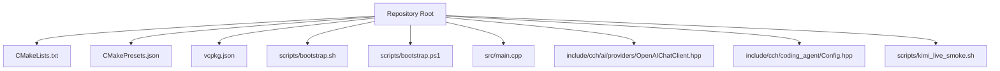
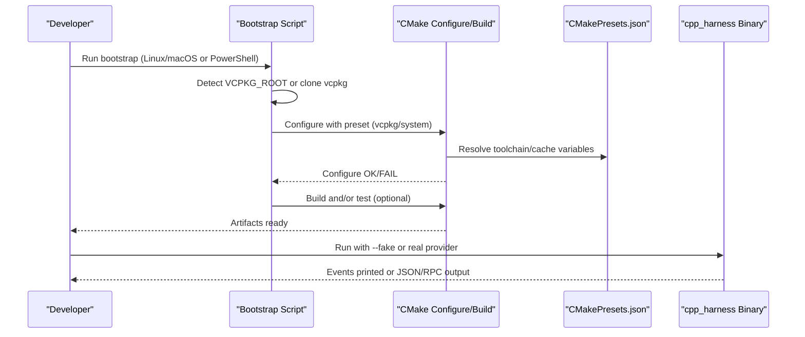
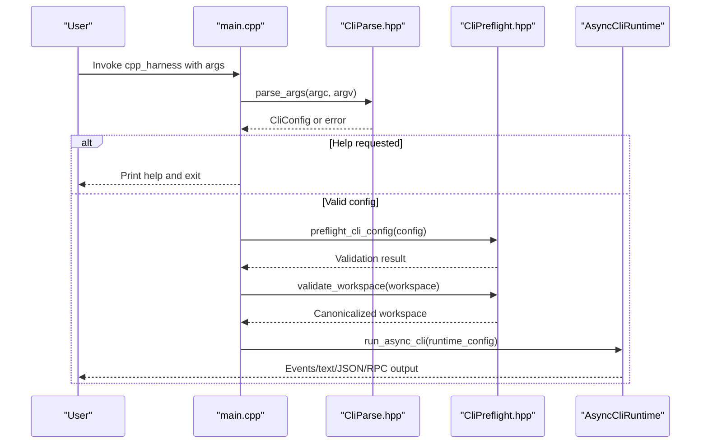
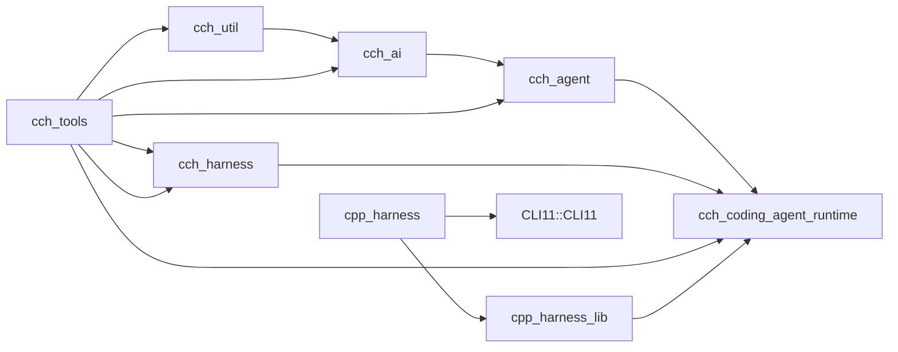

# Getting Started

<cite>
**Referenced Files in This Document**
- [README.md](file://README.md)
- [scripts/bootstrap.sh](file://scripts/bootstrap.sh)
- [scripts/bootstrap.ps1](file://scripts/bootstrap.ps1)
- [CMakeLists.txt](file://CMakeLists.txt)
- [CMakePresets.json](file://CMakePresets.json)
- [vcpkg.json](file://vcpkg.json)
- [src/main.cpp](file://src/main.cpp)
- [src/cli/CliParse.hpp](file://src/cli/CliParse.hpp)
- [src/cli/CliPreflight.hpp](file://src/cli/CliPreflight.hpp)
- [src/cli/CliConfig.hpp](file://src/cli/CliConfig.hpp)
- [include/cch/ai/providers/OpenAIChatClient.hpp](file://include/cch/ai/providers/OpenAIChatClient.hpp)
- [include/cch/coding_agent/Config.hpp](file://include/cch/coding_agent/Config.hpp)
- [scripts/kimi_live_smoke.sh](file://scripts/kimi_live_smoke.sh)
</cite>

## Table of Contents
1. [Introduction](#introduction)
2. [Project Structure](#project-structure)
3. [Core Components](#core-components)
4. [Architecture Overview](#architecture-overview)
5. [Detailed Component Analysis](#detailed-component-analysis)
6. [Dependency Analysis](#dependency-analysis)
7. [Performance Considerations](#performance-considerations)
8. [Troubleshooting Guide](#troubleshooting-guide)
9. [Conclusion](#conclusion)
10. [Appendices](#appendices)

## Introduction
This guide helps you quickly install, build, and run the C++ Coding Harness. It covers:
- Installing dependencies via vcpkg bootstrap or manual system packages
- Using the bootstrap scripts on Linux/macOS and Windows PowerShell
- Building with CMake presets (vcpkg vs system)
- First-run examples with the deterministic fake provider
- Environment setup for OpenAI-compatible providers and Kimi Code
- Verification steps and troubleshooting
- Quick-start examples for prompts, file operations, and REPL mode

## Project Structure
At a high level, the project is a CMake-based C++23 application with:
- A CMake build system and presets for vcpkg and system package modes
- A bootstrap script for Linux/macOS and a PowerShell script for Windows
- An executable that parses CLI arguments, validates configuration, and runs the agent loop
- Providers for OpenAI-compatible APIs and a deterministic fake provider for testing

**Diagram sources**
- [CMakeLists.txt:1-212](file://CMakeLists.txt#L1-L212)
- [CMakePresets.json:1-72](file://CMakePresets.json#L1-L72)
- [vcpkg.json:1-15](file://vcpkg.json#L1-L15)
- [scripts/bootstrap.sh:1-130](file://scripts/bootstrap.sh#L1-L130)
- [scripts/bootstrap.ps1:1-78](file://scripts/bootstrap.ps1#L1-L78)
- [src/main.cpp:1-33](file://src/main.cpp#L1-L33)
- [include/cch/ai/providers/OpenAIChatClient.hpp:1-43](file://include/cch/ai/providers/OpenAIChatClient.hpp#L1-L43)
- [include/cch/coding_agent/Config.hpp:1-78](file://include/cch/coding_agent/Config.hpp#L1-L78)
- [scripts/kimi_live_smoke.sh:1-80](file://scripts/kimi_live_smoke.sh#L1-L80)

**Section sources**
- [README.md:21-114](file://README.md#L21-L114)
- [CMakeLists.txt:1-212](file://CMakeLists.txt#L1-L212)
- [CMakePresets.json:1-72](file://CMakePresets.json#L1-L72)
- [vcpkg.json:1-15](file://vcpkg.json#L1-L15)

## Core Components
- Bootstrap scripts:
  - Linux/macOS: [scripts/bootstrap.sh:1-130](file://scripts/bootstrap.sh#L1-L130)
  - Windows PowerShell: [scripts/bootstrap.ps1:1-78](file://scripts/bootstrap.ps1#L1-L78)
- CMake build system:
  - [CMakeLists.txt:1-212](file://CMakeLists.txt#L1-L212)
  - Presets: [CMakePresets.json:1-72](file://CMakePresets.json#L1-L72)
  - Manifest: [vcpkg.json:1-15](file://vcpkg.json#L1-L15)
- CLI entry point and configuration:
  - [src/main.cpp:1-33](file://src/main.cpp#L1-L33)
  - [src/cli/CliParse.hpp:1-12](file://src/cli/CliParse.hpp#L1-L12)
  - [src/cli/CliPreflight.hpp:1-20](file://src/cli/CliPreflight.hpp#L1-L20)
  - [src/cli/CliConfig.hpp:1-33](file://src/cli/CliConfig.hpp#L1-L33)
- Provider configuration:
  - [include/cch/ai/providers/OpenAIChatClient.hpp:1-43](file://include/cch/ai/providers/OpenAIChatClient.hpp#L1-L43)
  - [include/cch/coding_agent/Config.hpp:1-78](file://include/cch/coding_agent/Config.hpp#L1-L78)
- Live smoke validation for Kimi:
  - [scripts/kimi_live_smoke.sh:1-80](file://scripts/kimi_live_smoke.sh#L1-L80)

**Section sources**
- [README.md:30-114](file://README.md#L30-L114)
- [src/main.cpp:1-33](file://src/main.cpp#L1-L33)
- [src/cli/CliConfig.hpp:1-33](file://src/cli/CliConfig.hpp#L1-L33)
- [include/cch/ai/providers/OpenAIChatClient.hpp:1-43](file://include/cch/ai/providers/OpenAIChatClient.hpp#L1-L43)
- [include/cch/coding_agent/Config.hpp:1-78](file://include/cch/coding_agent/Config.hpp#L1-L78)

## Architecture Overview
The build and runtime flow:

**Diagram sources**
- [scripts/bootstrap.sh:1-130](file://scripts/bootstrap.sh#L1-L130)
- [scripts/bootstrap.ps1:1-78](file://scripts/bootstrap.ps1#L1-L78)
- [CMakePresets.json:1-72](file://CMakePresets.json#L1-L72)
- [CMakeLists.txt:1-212](file://CMakeLists.txt#L1-L212)
- [src/main.cpp:1-33](file://src/main.cpp#L1-L33)

## Detailed Component Analysis

### Installation and Bootstrap (vcpkg)
- Purpose: Automatically bootstrap vcpkg and configure CMake in manifest mode to fetch dependencies.
- Options:
  - --no-build: Configure and set up dependencies without building.
  - --release: Use the Release preset.
  - --vcpkg-root DIR: Use an explicit vcpkg checkout instead of $VCPKG_ROOT or .deps/vcpkg.
- Linux/macOS:
  - Script: [scripts/bootstrap.sh:1-130](file://scripts/bootstrap.sh#L1-L130)
  - Typical invocation: [README.md:36-44](file://README.md#L36-L44)
- Windows PowerShell:
  - Script: [scripts/bootstrap.ps1:1-78](file://scripts/bootstrap.ps1#L1-L78)
  - Typical invocation: [README.md:40-44](file://README.md#L40-L44)

Key behaviors:
- Detects required tools (git, cmake).
- Clones vcpkg if needed and builds vcpkg if necessary.
- Sets VCPKG_ROOT and configures CMake with the chosen preset.
- Optionally builds and runs tests.

Verification:
- After running the bootstrap script, the build directory should contain generated artifacts and CMake cache reflecting the selected preset.

**Section sources**
- [README.md:30-58](file://README.md#L30-L58)
- [scripts/bootstrap.sh:1-130](file://scripts/bootstrap.sh#L1-L130)
- [scripts/bootstrap.ps1:1-78](file://scripts/bootstrap.ps1#L1-L78)

### Manual System Package Installation
- Purpose: Build against system-installed dependencies instead of vcpkg.
- Steps:
  - Install Boost, OpenSSL, Glaze, and CLI11 on your platform.
  - Configure and build using the system preset.
- References:
  - [README.md:60-68](file://README.md#L60-L68)
  - [CMakePresets.json:24-29](file://CMakePresets.json#L24-L29)
  - [CMakeLists.txt:15-19](file://CMakeLists.txt#L15-L19)

Notes:
- The system preset does not use the vcpkg toolchain.
- Ensure your system packages match the minimum versions indicated by the build system.

**Section sources**
- [README.md:60-68](file://README.md#L60-L68)
- [CMakePresets.json:24-29](file://CMakePresets.json#L24-L29)
- [CMakeLists.txt:15-19](file://CMakeLists.txt#L15-L19)

### Build Instructions (vcpkg and System Presets)
- vcpkg preset:
  - Configure: [CMakePresets.json:6-14](file://CMakePresets.json#L6-L14)
  - Build: [README.md:54-58](file://README.md#L54-L58)
  - Tests: [README.md:57-58](file://README.md#L57-L58)
- system preset:
  - Configure: [CMakePresets.json:24-29](file://CMakePresets.json#L24-L29)
  - Build: [README.md:65-68](file://README.md#L65-L68)
  - Tests: [README.md:67-68](file://README.md#L67-L68)

Build type differences:
- Debug preset: [CMakePresets.json:12-13](file://CMakePresets.json#L12-L13)
- Release preset: [CMakePresets.json:20-22](file://CMakePresets.json#L20-L22)

**Section sources**
- [README.md:52-68](file://README.md#L52-L68)
- [CMakePresets.json:6-29](file://CMakePresets.json#L6-L29)

### First Run with the Fake Provider
- Purpose: Validate installation and observe deterministic behavior without network calls.
- Examples:
  - Basic prompt: [README.md:72-78](file://README.md#L72-L78)
  - File read prompt: [README.md:74-75](file://README.md#L74-L75)
  - JSON mode filtering: [README.md:75-76](file://README.md#L75-L76)
  - RPC mode: [README.md:76-77](file://README.md#L76-L77)
  - REPL mode: [README.md:77-78](file://README.md#L77-L78)

CLI highlights:
- --fake enables the deterministic fake provider.
- --session records a redacted JSONL transcript.
- --mode text/json/rpc toggles output formats.
- --repl starts an interactive loop.

**Section sources**
- [README.md:70-78](file://README.md#L70-L78)
- [src/cli/CliConfig.hpp:12-30](file://src/cli/CliConfig.hpp#L12-L30)

### Environment Setup for Providers
- OpenAI-compatible providers:
  - Set the API key environment variable and pass it via --api-key-env.
  - Reference: [README.md:82-92](file://README.md#L82-L92)
  - Provider configuration structure: [include/cch/ai/providers/OpenAIChatClient.hpp:13-24](file://include/cch/ai/providers/OpenAIChatClient.hpp#L13-L24)
- Kimi Code integration:
  - Base URL and model are required for Kimi Code.
  - Example invocation: [README.md:97-105](file://README.md#L97-L105)
  - Live smoke validation: [scripts/kimi_live_smoke.sh:29-38](file://scripts/kimi_live_smoke.sh#L29-L38)

Provider resolution order:
- CLI overrides > session-stored values > user config (~/.cpp-harness/config.json) > built-in defaults.
- Reference: [include/cch/coding_agent/Config.hpp:64-70](file://include/cch/coding_agent/Config.hpp#L64-L70)

**Section sources**
- [README.md:82-114](file://README.md#L82-L114)
- [include/cch/ai/providers/OpenAIChatClient.hpp:13-24](file://include/cch/ai/providers/OpenAIChatClient.hpp#L13-L24)
- [include/cch/coding_agent/Config.hpp:13-70](file://include/cch/coding_agent/Config.hpp#L13-L70)
- [scripts/kimi_live_smoke.sh:29-38](file://scripts/kimi_live_smoke.sh#L29-L38)

### CLI Parsing and Runtime Flow
- Entry point:
  - [src/main.cpp:7-32](file://src/main.cpp#L7-L32)
- Argument parsing:
  - [src/cli/CliParse.hpp:9-11](file://src/cli/CliParse.hpp#L9-L11)
- Preflight and workspace validation:
  - [src/cli/CliPreflight.hpp:9-18](file://src/cli/CliPreflight.hpp#L9-L18)
- Runtime configuration:
  - [src/cli/CliPreflight.hpp:15-15](file://src/cli/CliPreflight.hpp#L15-L15)
  - [src/cli/CliConfig.hpp:12-30](file://src/cli/CliConfig.hpp#L12-L30)

**Diagram sources**
- [src/main.cpp:7-32](file://src/main.cpp#L7-L32)
- [src/cli/CliParse.hpp:9-11](file://src/cli/CliParse.hpp#L9-L11)
- [src/cli/CliPreflight.hpp:9-18](file://src/cli/CliPreflight.hpp#L9-L18)
- [src/cli/CliConfig.hpp:12-30](file://src/cli/CliConfig.hpp#L12-L30)

**Section sources**
- [src/main.cpp:1-33](file://src/main.cpp#L1-L33)
- [src/cli/CliParse.hpp:1-12](file://src/cli/CliParse.hpp#L1-L12)
- [src/cli/CliPreflight.hpp:1-20](file://src/cli/CliPreflight.hpp#L1-L20)
- [src/cli/CliConfig.hpp:1-33](file://src/cli/CliConfig.hpp#L1-L33)

### Quick-Start Examples
- Simple prompt with fake provider:
  - [README.md:72-74](file://README.md#L72-L74)
- File read with fake provider:
  - [README.md:74-75](file://README.md#L74-L75)
- JSON mode filtering:
  - [README.md:75-76](file://README.md#L75-L76)
- RPC mode:
  - [README.md:76-77](file://README.md#L76-L77)
- REPL mode:
  - [README.md:77-78](file://README.md#L77-L78)

**Section sources**
- [README.md:70-78](file://README.md#L70-L78)

## Dependency Analysis
- CMake targets and relationships:
  - cch_util → cch_ai → cch_agent → cch_coding_agent_runtime
  - cch_harness links with cch_ai and cch_util
  - cch_tools links with cch_agent, cch_harness, cch_ai, cch_util
  - cpp_harness_lib aggregates runtime; cpp_harness links to CLI11
- Presets:
  - vcpkg and vcpkg-release inherit toolchain from VCPKG_ROOT
  - system preset uses system packages

**Diagram sources**
- [CMakeLists.txt:33-149](file://CMakeLists.txt#L33-L149)

**Section sources**
- [CMakeLists.txt:1-212](file://CMakeLists.txt#L1-L212)
- [CMakePresets.json:1-72](file://CMakePresets.json#L1-L72)
- [vcpkg.json:1-15](file://vcpkg.json#L1-L15)

## Performance Considerations
- Use the Release preset for optimized builds when benchmarking or long-running sessions.
- Limit max turns to reduce runtime and API costs.
- Prefer JSON mode for machine-readable logs and reduced console overhead.

## Troubleshooting Guide
Common symptoms and checks:
- Missing API key:
  - Ensure the appropriate environment variable is exported and passed via --api-key-env.
  - Reference: [README.md:115-126](file://README.md#L115-L126)
- Authentication or authorization failure:
  - Verify the key is valid for the target provider and the base URL is correct.
  - Reference: [README.md:115-126](file://README.md#L115-L126)
- Invalid model:
  - Use the correct model name for the provider (e.g., kimi-for-coding for Kimi).
  - Reference: [README.md:115-126](file://README.md#L115-L126)
- Rate limit or quota error:
  - Retry later or check provider entitlements.
  - Reference: [README.md:115-126](file://README.md#L115-L126)
- Unexpected provider:
  - Ensure all flags (base URL, model, API key env) are present for the intended provider.
  - Reference: [README.md:115-126](file://README.md#L115-L126)
- 403 Forbidden:
  - Confirm subscription/agent access for the provider’s chat completions endpoint.
  - Reference: [README.md:115-126](file://README.md#L115-L126)
- Provider or transport error:
  - Re-run with harmless prompts and inspect diagnostics without printing secrets.
  - Reference: [README.md:115-126](file://README.md#L115-L126)

Live smoke validation for Kimi:
- Enable with CCH_LIVE_KIMI=1 and provide KIMI_API_KEY.
- The script validates absence of secrets in logs and presence of expected markers.
- Reference: [scripts/kimi_live_smoke.sh:1-80](file://scripts/kimi_live_smoke.sh#L1-L80)

**Section sources**
- [README.md:115-134](file://README.md#L115-L134)
- [scripts/kimi_live_smoke.sh:1-80](file://scripts/kimi_live_smoke.sh#L1-L80)

## Conclusion
You now have everything needed to install, build, and run the C++ Coding Harness locally. Start with the fake provider for quick validation, then configure a real provider using environment variables and CLI flags. Use the bootstrap scripts to streamline dependency management, and refer to the troubleshooting section for common issues.

## Appendices

### Appendix A: Bootstrap Options Summary
- Linux/macOS:
  - --no-build: Configure only
  - --test: Build and run tests
  - --release: Use Release preset
  - --vcpkg-root DIR: Use explicit vcpkg checkout
  - Reference: [scripts/bootstrap.sh:10-17](file://scripts/bootstrap.sh#L10-L17)
- Windows PowerShell:
  - -NoBuild, -Test, -Release, -VcpkgRoot
  - Reference: [scripts/bootstrap.ps1:1-6](file://scripts/bootstrap.ps1#L1-L6)

**Section sources**
- [scripts/bootstrap.sh:10-17](file://scripts/bootstrap.sh#L10-L17)
- [scripts/bootstrap.ps1:1-6](file://scripts/bootstrap.ps1#L1-L6)

### Appendix B: Preset and Toolchain Details
- vcpkg preset:
  - Toolchain: $VCPKG_ROOT/scripts/buildsystems/vcpkg.cmake
  - Build type: Debug by default
  - Reference: [CMakePresets.json:6-14](file://CMakePresets.json#L6-L14)
- vcpkg-release preset:
  - Inherits vcpkg, sets Release build type
  - Reference: [CMakePresets.json:16-23](file://CMakePresets.json#L16-L23)
- system preset:
  - No toolchain; uses system packages
  - Reference: [CMakePresets.json:24-29](file://CMakePresets.json#L24-L29)

**Section sources**
- [CMakePresets.json:6-29](file://CMakePresets.json#L6-L29)