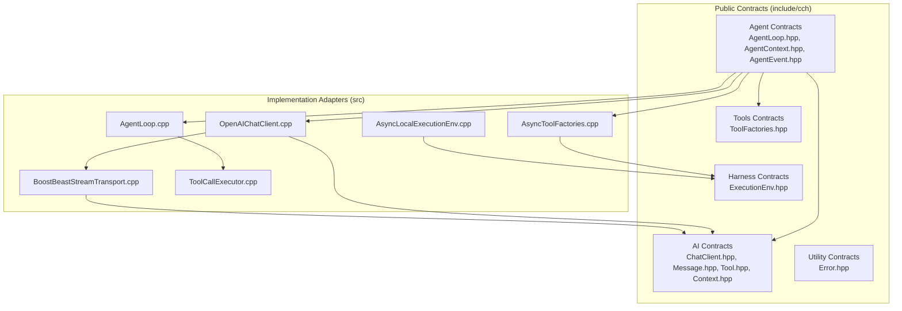
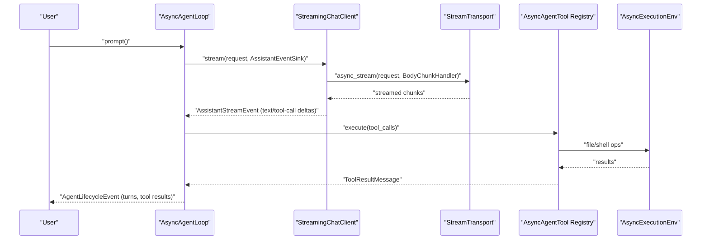
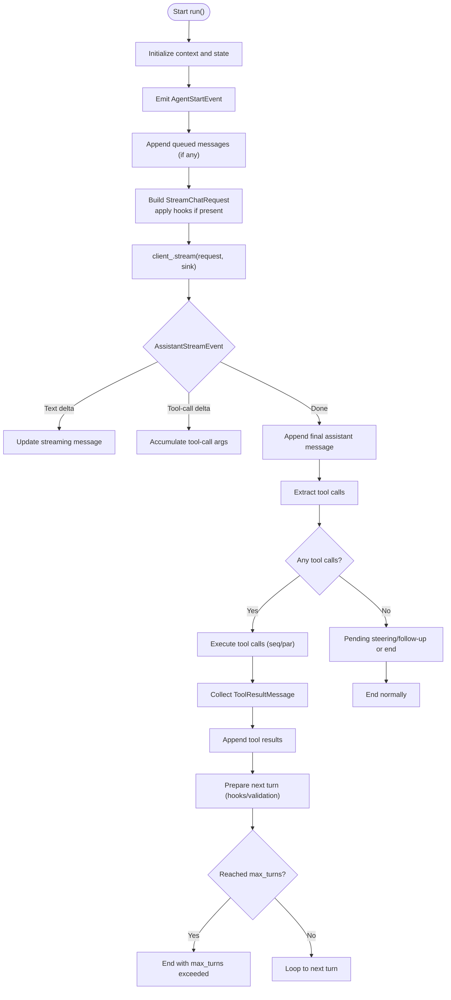
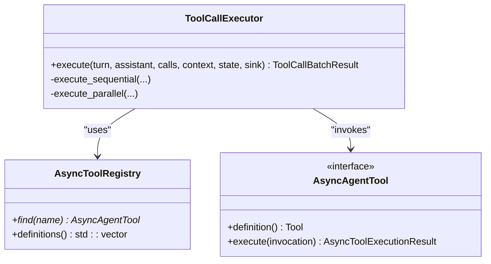
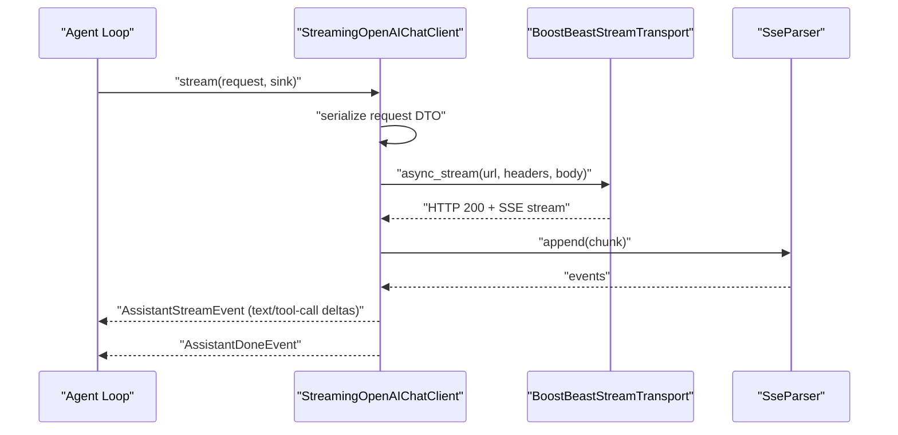
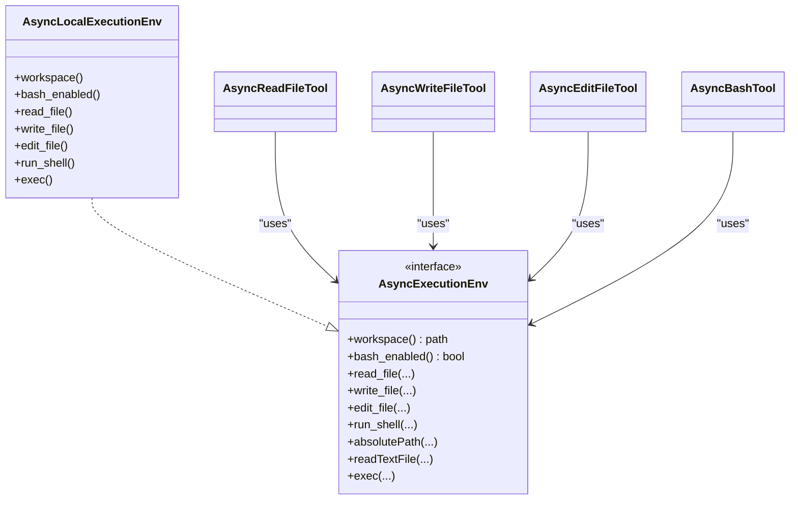
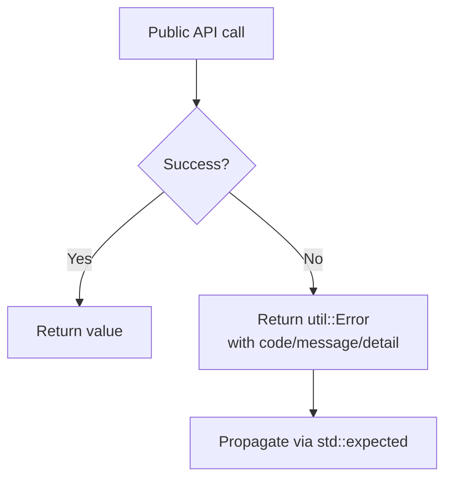
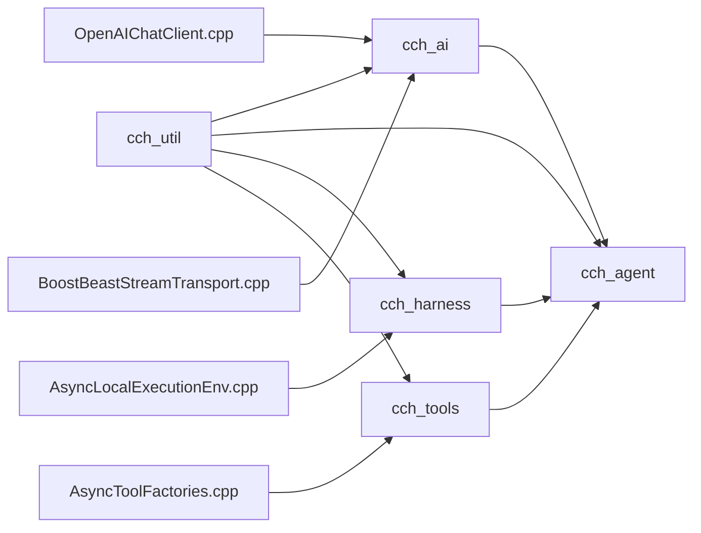

# Core Concepts

<cite>
**Referenced Files in This Document**
- [README.md](file://README.md)
- [AgentLoop.hpp](file://include/cch/agent/AgentLoop.hpp)
- [AgentContext.hpp](file://include/cch/agent/AgentContext.hpp)
- [AgentEvent.hpp](file://include/cch/agent/AgentEvent.hpp)
- [ChatClient.hpp](file://include/cch/ai/ChatClient.hpp)
- [StreamTransport.hpp](file://include/cch/ai/providers/StreamTransport.hpp)
- [ExecutionEnv.hpp](file://include/cch/harness/ExecutionEnv.hpp)
- [ToolFactories.hpp](file://include/cch/tools/ToolFactories.hpp)
- [AgentLoop.cpp](file://src/agent/AgentLoop.cpp)
- [ToolCallExecutor.hpp](file://src/agent/ToolCallExecutor.hpp)
- [ToolCallExecutor.cpp](file://src/agent/ToolCallExecutor.cpp)
- [OpenAIChatClient.cpp](file://src/ai/providers/OpenAIChatClient.cpp)
- [BoostBeastStreamTransport.cpp](file://src/ai/providers/BoostBeastStreamTransport.cpp)
- [AsyncLocalExecutionEnv.cpp](file://src/harness/AsyncLocalExecutionEnv.cpp)
- [AsyncToolFactories.cpp](file://src/tools/AsyncToolFactories.cpp)
- [Error.hpp](file://include/cch/util/Error.hpp)
</cite>

## Table of Contents
1. [Introduction](#introduction)
2. [Project Structure](#project-structure)
3. [Core Components](#core-components)
4. [Architecture Overview](#architecture-overview)
5. [Detailed Component Analysis](#detailed-component-analysis)
6. [Dependency Analysis](#dependency-analysis)
7. [Performance Considerations](#performance-considerations)
8. [Troubleshooting Guide](#troubleshooting-guide)
9. [Conclusion](#conclusion)

## Introduction
This document explains the anti-fragile architecture principles that underpin the C++ Coding Harness. Anti-fragility emphasizes resilience, replaceability, and clean separation of concerns. The project’s design centers on four pillars:
1. Passive data contracts with std::variant alternatives and std::expected failures
2. Replaceable capability seams for chat clients, stream transports, execution environments, and tools
3. Weak event connections using move-only callback semantics
4. Generic machinery isolation in implementation layers

It also documents the pi-style agent loop workflow (prompt → tool calls → execution → persistence) and how these principles map to the codebase structure. Finally, it outlines the package-style CMake targets and architectural boundaries between public contracts, capability seams, and implementation adapters, with practical examples demonstrating extensibility and maintainability.

## Project Structure
The repository is organized into distinct layers:
- Public contracts and SDK surface under include/cch
- Implementation adapters under src
- Tests under tests
- Documentation and plans under docs

Key packages and responsibilities:
- cch_util: error/expected contracts, move-only callback vocabulary, passive JsonValue, Glaze-backed JSON adapter, async process execution
- cch_ai: passive message/content/tool/context contracts, provider-neutral stream events, provider registry, OpenAI-compatible provider, scripted fake provider; SSE and Glaze provider mapping under src/ai
- cch_agent: coroutine agent loop, observable state values, lifecycle event values, move-only event sinks, async tool registry, expected-style tool execution contracts, optional pre/post tool-call hooks, context transforms, steering/follow-up queues, prepare-next-turn updates, sequential/parallel tool execution modes
- cch_harness: pi-shaped filesystem and shell execution capability contracts, local implementation with workspace containment, symlink safety, atomic writes, split-stream process execution, secret environment filtering, JSONL session persistence
- cch_tools: built-in read/write/edit/bash tool factories bridging agent tool contracts to harness capabilities
- cch_coding_agent_runtime: CLI argument parsing and preflight, runtime orchestration, session lifecycle, provider/tool service assembly, semantic event printing, JSON/RPC output modes, slash-command/prompt-template processing, project trust/resource controls, project-local skill discovery/loading and prompt formatting, and related runtime services

**Diagram sources**
- [AgentLoop.hpp:16-36](file://include/cch/agent/AgentLoop.hpp#L16-L36)
- [AgentContext.hpp:15-87](file://include/cch/agent/AgentContext.hpp#L15-L87)
- [AgentEvent.hpp:12-110](file://include/cch/agent/AgentEvent.hpp#L12-L110)
- [ChatClient.hpp:16-34](file://include/cch/ai/ChatClient.hpp#L16-L34)
- [StreamTransport.hpp:15-42](file://include/cch/ai/providers/StreamTransport.hpp#L15-L42)
- [ExecutionEnv.hpp:198-334](file://include/cch/harness/ExecutionEnv.hpp#L198-L334)
- [ToolFactories.hpp:10-13](file://include/cch/tools/ToolFactories.hpp#L10-L13)
- [AgentLoop.cpp:240-531](file://src/agent/AgentLoop.cpp#L240-L531)
- [ToolCallExecutor.cpp:120-514](file://src/agent/ToolCallExecutor.cpp#L120-L514)
- [OpenAIChatClient.cpp:260-497](file://src/ai/providers/OpenAIChatClient.cpp#L260-L497)
- [BoostBeastStreamTransport.cpp:91-218](file://src/ai/providers/BoostBeastStreamTransport.cpp#L91-L218)
- [AsyncLocalExecutionEnv.cpp:10-179](file://src/harness/AsyncLocalExecutionEnv.cpp#L10-L179)
- [AsyncToolFactories.cpp:404-420](file://src/tools/AsyncToolFactories.cpp#L404-L420)

**Section sources**
- [README.md:135-151](file://README.md#L135-L151)

## Core Components
This section maps the four architectural pillars to concrete code artifacts and explains how they enforce anti-fragility.

1) Passive data contracts with std::variant alternatives and std::expected failures
- Domain messages and tool calls are modeled as aggregates and std::variant unions, enabling stable, copyable contracts that are provider- and transport-agnostic.
- Errors are represented as std::expected<T, Error> with a unified Error enum, ensuring consistent propagation and handling across asynchronous boundaries.
- Examples:
  - Agent lifecycle events are a std::variant of event structs, consumed by move-only sinks.
  - Assistant messages and tool calls are std::variant-based, carrying content deltas and tool-call arguments.
  - All APIs return util::Expected<T> or std::expected<E>, surfacing failures without throwing.

2) Replaceable capability seams
- Chat clients, stream transports, execution environments, and tools are defined as abstract interfaces with concrete implementations behind capability seams.
- This enables swapping providers, transports, and execution backends without changing the agent loop or tool registries.
- Examples:
  - StreamingChatClient interface decouples the agent loop from provider specifics.
  - StreamTransport interface isolates HTTP/TLS/SSE handling from the provider client.
  - AsyncExecutionEnv abstracts filesystem and shell operations, with AsyncLocalExecutionEnv as the primary implementation.
  - AsyncAgentTool defines tool contracts; AsyncToolFactories produce concrete tools bound to the execution environment.

3) Weak event connections using move-only callback semantics
- Event sinks are std::move_only_function<util::ExpectedVoid(const Event&)>, allowing subscribers to own unique state without forcing shared ownership.
- The agent loop emits lifecycle events through these sinks, and tool executors emit tool execution events, all with robust error propagation.
- Examples:
  - AgentEventSink is a move-only function type used by the agent loop.
  - AssistantEventSink and BodyChunkHandler are move-only callbacks used by provider clients and transports.

4) Generic machinery isolation in implementation layers
- Glaze DTOs, provider mapping, SSE parsing, and JSON adapters live in src/ai/glaze and src/util, separated from public contracts.
- This keeps domain-facing headers free of generic serialization and transport details, reducing coupling and improving maintainability.
- Examples:
  - Provider DTOs and mapping are in src/ai/glaze and used by OpenAIChatClient.
  - JSON adapters and macros are in src/util and used across providers and tools.

**Section sources**
- [AgentEvent.hpp:91-110](file://include/cch/agent/AgentEvent.hpp#L91-L110)
- [ChatClient.hpp:21-34](file://include/cch/ai/ChatClient.hpp#L21-L34)
- [StreamTransport.hpp:33-42](file://include/cch/ai/providers/StreamTransport.hpp#L33-L42)
- [ExecutionEnv.hpp:198-334](file://include/cch/harness/ExecutionEnv.hpp#L198-L334)
- [ToolFactories.hpp:10-13](file://include/cch/tools/ToolFactories.hpp#L10-L13)
- [Error.hpp:10-75](file://include/cch/util/Error.hpp#L10-L75)
- [OpenAIChatClient.cpp:106-213](file://src/ai/providers/OpenAIChatClient.cpp#L106-L213)
- [BoostBeastStreamTransport.cpp:91-218](file://src/ai/providers/BoostBeastStreamTransport.cpp#L91-L218)
- [AsyncLocalExecutionEnv.cpp:10-179](file://src/harness/AsyncLocalExecutionEnv.cpp#L10-L179)
- [AsyncToolFactories.cpp:60-73](file://src/tools/AsyncToolFactories.cpp#L60-L73)

## Architecture Overview
The anti-fragile architecture enforces clear boundaries:
- Public contracts (include/cch) define passive data and capability interfaces
- Implementation adapters (src) encapsulate provider-specific logic, transports, and tool implementations
- The agent loop orchestrates the pi-style workflow: prompt → provider streaming → tool calls → execution → persistence

**Diagram sources**
- [AgentLoop.cpp:249-531](file://src/agent/AgentLoop.cpp#L249-L531)
- [OpenAIChatClient.cpp:263-497](file://src/ai/providers/OpenAIChatClient.cpp#L263-L497)
- [BoostBeastStreamTransport.cpp:91-218](file://src/ai/providers/BoostBeastStreamTransport.cpp#L91-L218)
- [ToolCallExecutor.cpp:123-514](file://src/agent/ToolCallExecutor.cpp#L123-L514)
- [AsyncLocalExecutionEnv.cpp:150-177](file://src/harness/AsyncLocalExecutionEnv.cpp#L150-L177)

## Detailed Component Analysis

### Agent Loop and Lifecycle Events
The agent loop coordinates the pi-style workflow:
- Accepts a user prompt and optional history
- Transforms and converts context via optional hooks
- Streams assistant responses and captures tool-call deltas
- Executes tool calls sequentially or in parallel
- Emits lifecycle events to move-only sinks
- Applies prepare-next-turn updates with validation

**Diagram sources**
- [AgentLoop.cpp:249-531](file://src/agent/AgentLoop.cpp#L249-L531)
- [AgentEvent.hpp:12-110](file://include/cch/agent/AgentEvent.hpp#L12-L110)
- [AgentContext.hpp:27-87](file://include/cch/agent/AgentContext.hpp#L27-L87)

**Section sources**
- [AgentLoop.hpp:16-36](file://include/cch/agent/AgentLoop.hpp#L16-L36)
- [AgentLoop.cpp:249-531](file://src/agent/AgentLoop.cpp#L249-L531)
- [AgentEvent.hpp:91-110](file://include/cch/agent/AgentEvent.hpp#L91-L110)
- [AgentContext.hpp:15-87](file://include/cch/agent/AgentContext.hpp#L15-L87)

### Tool Call Execution Engine
The engine executes tool calls with support for sequential and parallel modes, pre/post hooks, and batch termination:
- Parses tool-call arguments and validates JSON
- Invokes optional before/after hooks
- Executes tools via the registry and collects results
- Emits ToolExecutionStart/End events
- Supports batch termination when all calls request termination

**Diagram sources**
- [ToolCallExecutor.hpp:31-62](file://src/agent/ToolCallExecutor.hpp#L31-L62)
- [ToolCallExecutor.cpp:120-514](file://src/agent/ToolCallExecutor.cpp#L120-L514)
- [AsyncToolFactories.cpp:60-73](file://src/tools/AsyncToolFactories.cpp#L60-L73)

**Section sources**
- [ToolCallExecutor.hpp:19-62](file://src/agent/ToolCallExecutor.hpp#L19-L62)
- [ToolCallExecutor.cpp:123-514](file://src/agent/ToolCallExecutor.cpp#L123-L514)
- [AsyncToolFactories.cpp:60-73](file://src/tools/AsyncToolFactories.cpp#L60-L73)

### Provider Client and Stream Transport
The provider client abstracts streaming chat and SSE handling:
- Converts domain messages to provider DTOs
- Streams HTTP bodies via a transport
- Parses SSE chunks into assistant and tool-call deltas
- Emits structured AssistantStreamEvent to sinks

**Diagram sources**
- [OpenAIChatClient.cpp:263-497](file://src/ai/providers/OpenAIChatClient.cpp#L263-L497)
- [BoostBeastStreamTransport.cpp:91-218](file://src/ai/providers/BoostBeastStreamTransport.cpp#L91-L218)

**Section sources**
- [ChatClient.hpp:23-34](file://include/cch/ai/ChatClient.hpp#L23-L34)
- [OpenAIChatClient.cpp:260-497](file://src/ai/providers/OpenAIChatClient.cpp#L260-L497)
- [StreamTransport.hpp:35-42](file://include/cch/ai/providers/StreamTransport.hpp#L35-L42)
- [BoostBeastStreamTransport.cpp:91-218](file://src/ai/providers/BoostBeastStreamTransport.cpp#L91-L218)

### Execution Environment and Tools
The execution environment provides a stable, pi-shaped capability contract for filesystem and shell operations:
- Supports both legacy tool-shaped methods and new pi-shaped methods
- Converts internal errors to stable enums for external consumers
- Tools are created via factories and bound to the execution environment

**Diagram sources**
- [ExecutionEnv.hpp:198-334](file://include/cch/harness/ExecutionEnv.hpp#L198-L334)
- [AsyncLocalExecutionEnv.cpp:10-179](file://src/harness/AsyncLocalExecutionEnv.cpp#L10-L179)
- [AsyncToolFactories.cpp:404-420](file://src/tools/AsyncToolFactories.cpp#L404-L420)

**Section sources**
- [ExecutionEnv.hpp:198-334](file://include/cch/harness/ExecutionEnv.hpp#L198-L334)
- [AsyncLocalExecutionEnv.cpp:10-179](file://src/harness/AsyncLocalExecutionEnv.cpp#L10-L179)
- [AsyncToolFactories.cpp:404-420](file://src/tools/AsyncToolFactories.cpp#L404-L420)

### Error Handling and Expected Contracts
All APIs consistently return util::Expected<T> or std::expected<E>, with a unified Error enum covering domains like network, provider, tool, session, validation, workspace, and process. This ensures predictable error propagation and simplifies testing and composition.

**Diagram sources**
- [Error.hpp:10-75](file://include/cch/util/Error.hpp#L10-L75)
- [AgentLoop.cpp:533-550](file://src/agent/AgentLoop.cpp#L533-L550)
- [ToolCallExecutor.cpp:92-109](file://src/agent/ToolCallExecutor.cpp#L92-L109)

**Section sources**
- [Error.hpp:10-75](file://include/cch/util/Error.hpp#L10-L75)
- [AgentLoop.cpp:533-550](file://src/agent/AgentLoop.cpp#L533-L550)
- [ToolCallExecutor.cpp:92-109](file://src/agent/ToolCallExecutor.cpp#L92-L109)

## Dependency Analysis
Anti-fragile design minimizes coupling and maximizes replaceability:
- Public contracts depend only on passive data and std::variant; they avoid generic libraries
- Implementation adapters depend on Boost.Asio, Glaze, and provider-specific libraries
- The agent loop depends on capability interfaces, not concrete implementations
- Tools depend on the execution environment abstraction

**Diagram sources**
- [AgentLoop.hpp:16-36](file://include/cch/agent/AgentLoop.hpp#L16-L36)
- [ChatClient.hpp:23-34](file://include/cch/ai/ChatClient.hpp#L23-L34)
- [ExecutionEnv.hpp:198-334](file://include/cch/harness/ExecutionEnv.hpp#L198-L334)
- [ToolFactories.hpp:10-13](file://include/cch/tools/ToolFactories.hpp#L10-L13)
- [OpenAIChatClient.cpp:260-497](file://src/ai/providers/OpenAIChatClient.cpp#L260-L497)
- [BoostBeastStreamTransport.cpp:91-218](file://src/ai/providers/BoostBeastStreamTransport.cpp#L91-L218)
- [AsyncLocalExecutionEnv.cpp:10-179](file://src/harness/AsyncLocalExecutionEnv.cpp#L10-L179)
- [AsyncToolFactories.cpp:404-420](file://src/tools/AsyncToolFactories.cpp#L404-L420)

**Section sources**
- [AgentLoop.hpp:16-36](file://include/cch/agent/AgentLoop.hpp#L16-L36)
- [AgentContext.hpp:15-87](file://include/cch/agent/AgentContext.hpp#L15-L87)
- [AgentEvent.hpp:91-110](file://include/cch/agent/AgentEvent.hpp#L91-L110)
- [ChatClient.hpp:23-34](file://include/cch/ai/ChatClient.hpp#L23-L34)
- [StreamTransport.hpp:35-42](file://include/cch/ai/providers/StreamTransport.hpp#L35-L42)
- [ExecutionEnv.hpp:198-334](file://include/cch/harness/ExecutionEnv.hpp#L198-L334)
- [ToolFactories.hpp:10-13](file://include/cch/tools/ToolFactories.hpp#L10-L13)

## Performance Considerations
- Asynchronous design with coroutines and channels avoids blocking and reduces latency
- Parallel tool execution is gated by configurable limits and sequential fallback for tools requiring it
- Streaming provider responses minimize buffering and enable incremental UI updates
- Workspace containment and atomic writes reduce I/O overhead and improve reliability

## Troubleshooting Guide
Common issues and their origins:
- Missing API key or wrong base URL: provider client resolves keys and constructs URLs; errors are surfaced as util::Error with Provider code
- Transport/network errors: BoostBeast transport maps system errors to Network or Timeout codes
- Tool execution failures: tool factories return error results with details; execution environment maps internal errors to stable enums
- Event sink exceptions: agent loop catches and converts exceptions to Tool errors

**Section sources**
- [OpenAIChatClient.cpp:499-526](file://src/ai/providers/OpenAIChatClient.cpp#L499-L526)
- [BoostBeastStreamTransport.cpp:75-87](file://src/ai/providers/BoostBeastStreamTransport.cpp#L75-L87)
- [AsyncToolFactories.cpp:47-49](file://src/tools/AsyncToolFactories.cpp#L47-L49)
- [AgentLoop.cpp:533-550](file://src/agent/AgentLoop.cpp#L533-L550)

## Conclusion
The C++ Coding Harness demonstrates anti-fragile architecture through:
- Passive, variant-based contracts and std::expected error handling
- Replaceable capability seams for providers, transports, environments, and tools
- Weak, move-only event connections that prevent shared ownership overhead
- Isolation of generic machinery in implementation layers

These principles yield a resilient, extensible system where components can be swapped, tested independently, and evolved without breaking changes to public contracts. The pi-style agent loop and package-style CMake targets further reinforce maintainability and composability.