# Feature Highlights

<cite>
**Referenced Files in This Document**
- [README.md](file://README.md)
- [main.cpp](file://src/main.cpp)
- [Sdk.hpp](file://include/cch/coding_agent/Sdk.hpp)
- [SessionTree.hpp](file://include/cch/harness/session/SessionTree.hpp)
- [ExecutionEnv.hpp](file://include/cch/harness/ExecutionEnv.hpp)
- [ProviderRegistry.hpp](file://include/cch/ai/ProviderRegistry.hpp)
- [ToolRegistry.hpp](file://include/cch/agent/ToolRegistry.hpp)
- [ToolFactories.hpp](file://include/cch/tools/ToolFactories.hpp)
- [Skill.hpp](file://include/cch/coding_agent/Skill.hpp)
- [ProjectTrust.hpp](file://include/cch/coding_agent/ProjectTrust.hpp)
- [RpcMode.hpp](file://src/coding_agent/runtime/RpcMode.hpp)
- [JsonEventPrinter.hpp](file://src/coding_agent/runtime/JsonEventPrinter.hpp)
- [JsonlSessionStore.hpp](file://include/cch/harness/session/JsonlSessionStore.hpp)
- [StreamEvent.hpp](file://include/cch/ai/StreamEvent.hpp)
</cite>

## Table of Contents
1. [Introduction](#introduction)
2. [Project Structure](#project-structure)
3. [Core Components](#core-components)
4. [Architecture Overview](#architecture-overview)
5. [Detailed Component Analysis](#detailed-component-analysis)
6. [Dependency Analysis](#dependency-analysis)
7. [Performance Considerations](#performance-considerations)
8. [Troubleshooting Guide](#troubleshooting-guide)
9. [Conclusion](#conclusion)
10. [Appendices](#appendices)

## Introduction
This document presents the feature highlights of the C++ Coding Harness, emphasizing its multi-modal interaction modes (CLI text, JSON, RPC), persistent session management with JSONL storage and tree navigation, secure execution environment with workspace containment, extensible tool system with built-in capabilities, provider-agnostic AI integration with streaming support, and an embeddable C++ SDK for host applications. It also covers the skill system for project-local knowledge injection, project trust and resource controls, and clarifies the experimental nature versus production readiness status. Practical examples illustrate how the harness operates as both a CLI tool and an embeddable library, with explicit limitations and deferred features to set appropriate expectations.

## Project Structure
The project is organized into layered packages that separate public contracts, capability seams, and implementation adapters. The CLI entry point delegates to a runtime orchestrator that wires provider clients, execution environments, tools, and session persistence. The SDK exposes a source-level surface for embedding the agent loop without shelling out to the CLI.

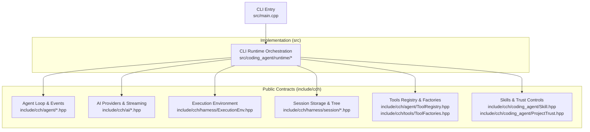

**Diagram sources**
- [main.cpp:1-33](file://src/main.cpp#L1-L33)
- [Sdk.hpp:1-347](file://include/cch/coding_agent/Sdk.hpp#L1-L347)
- [ExecutionEnv.hpp:1-337](file://include/cch/harness/ExecutionEnv.hpp#L1-L337)
- [SessionTree.hpp:1-148](file://include/cch/harness/session/SessionTree.hpp#L1-L148)
- [ToolRegistry.hpp:1-51](file://include/cch/agent/ToolRegistry.hpp#L1-L51)
- [ToolFactories.hpp:1-16](file://include/cch/tools/ToolFactories.hpp#L1-L16)
- [Skill.hpp:1-60](file://include/cch/coding_agent/Skill.hpp#L1-L60)
- [ProjectTrust.hpp:1-93](file://include/cch/coding_agent/ProjectTrust.hpp#L1-L93)

**Section sources**
- [README.md:135-151](file://README.md#L135-L151)
- [main.cpp:1-33](file://src/main.cpp#L1-L33)

## Core Components
- Multi-modal interaction modes:
  - CLI text mode prints semantic events for human readability.
  - JSON mode emits compact JSONL records for machine processing.
  - RPC mode provides a narrow JSONL stdin/stdout command loop for programmatic control.
- Persistent session management:
  - JSONL storage with v2 header and typed entries, plus v3 tree metadata for advanced navigation.
  - Session tree enables branch navigation, leaf tracking, and compaction-aware context reconstruction.
- Secure execution environment:
  - Workspace containment, symlink safety, atomic writes, and sanitized environment for shell execution.
- Extensible tool system:
  - Async tool registry with built-in file and bash tools; host can supply custom tools.
- Provider-agnostic AI integration:
  - Provider registry with OpenAI-compatible defaults and streaming support.
- Embeddable C++ SDK:
  - Source-level SDK surface for embedding the agent loop without CLI/RPC globals.

**Section sources**
- [README.md:157-173](file://README.md#L157-L173)
- [README.md:242-247](file://README.md#L242-L247)
- [README.md:248-255](file://README.md#L248-L255)
- [README.md:256-266](file://README.md#L256-L266)
- [README.md:174-241](file://README.md#L174-L241)
- [README.md:267-279](file://README.md#L267-L279)

## Architecture Overview
The harness follows an anti-fragile architecture with passive data contracts, replaceable capabilities, and event-driven flows. The CLI entry point parses arguments, validates workspace, and runs the async CLI runtime. The runtime composes provider clients, execution environments, tools, and session persistence, then drives the agent loop with streaming AI events.

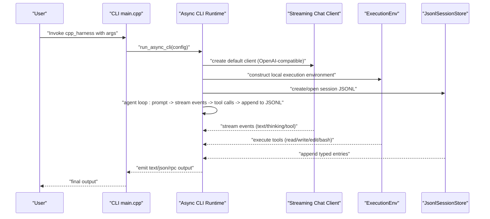

**Diagram sources**
- [main.cpp:7-32](file://src/main.cpp#L7-L32)
- [ProviderRegistry.hpp:40-56](file://include/cch/ai/ProviderRegistry.hpp#L40-L56)
- [ExecutionEnv.hpp:198-334](file://include/cch/harness/ExecutionEnv.hpp#L198-L334)
- [JsonlSessionStore.hpp:18-79](file://include/cch/harness/session/JsonlSessionStore.hpp#L18-L79)
- [StreamEvent.hpp:78-91](file://include/cch/ai/StreamEvent.hpp#L78-L91)

## Detailed Component Analysis

### Multi-modal Interaction Modes
- CLI text mode:
  - Emits semantic event lines for model requests, assistant messages, tool calls, tool results, provider errors, max turns, and completion reasons.
- JSON mode:
  - Emits compact JSONL records including a session header and lifecycle events such as agent_start, turn_start, message_update, tool_execution_start/end, turn_end, and runtime_terminal.
- RPC mode:
  - Reads JSONL stdin commands and writes responses/events to stdout; supports prompt, get_state, get_last_assistant_text, and shutdown; returns structured success:false for unsupported commands.

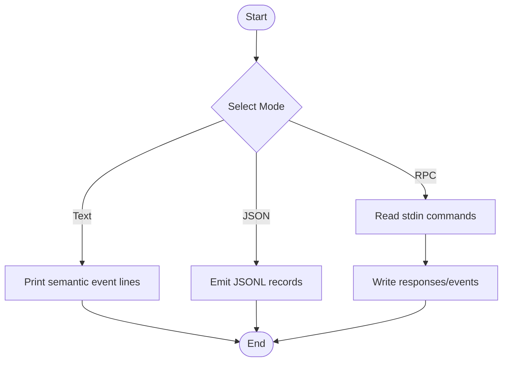

**Section sources**
- [README.md:157-173](file://README.md#L157-L173)
- [RpcMode.hpp:12-23](file://src/coding_agent/runtime/RpcMode.hpp#L12-L23)
- [JsonEventPrinter.hpp:12-26](file://src/coding_agent/runtime/JsonEventPrinter.hpp#L12-L26)

### Persistent Session Management with JSONL Storage and Tree Navigation
- JSONL storage:
  - Header with session/workspace/provider/model metadata.
  - Typed message entries with redacted content.
  - V3 tree metadata entries for model change, thinking level change, active tools change, custom/custom message, label, compaction, branch summary, session info, and leaf tracking.
- Session tree:
  - In-memory index enabling O(1) entry lookup and efficient traversal.
  - Leaf navigation, branch switching, and compaction-aware context reconstruction.
  - Optional branch summary hook to append summaries when switching branches.

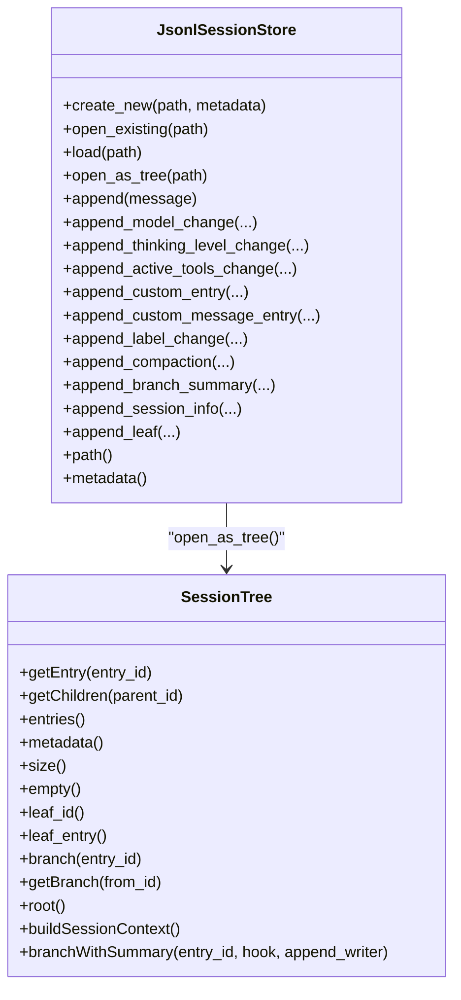

**Diagram sources**
- [JsonlSessionStore.hpp:18-79](file://include/cch/harness/session/JsonlSessionStore.hpp#L18-L79)
- [SessionTree.hpp:34-145](file://include/cch/harness/session/SessionTree.hpp#L34-L145)

**Section sources**
- [README.md:267-279](file://README.md#L267-L279)
- [JsonlSessionStore.hpp:18-79](file://include/cch/harness/session/JsonlSessionStore.hpp#L18-L79)
- [SessionTree.hpp:17-145](file://include/cch/harness/session/SessionTree.hpp#L17-L145)

### Secure Execution Environment with Workspace Containment
- Capability seam for asynchronous execution environment:
  - Workspace path and bash enablement.
  - File operations with stable error codes and pi-shaped metadata.
  - Shell execution with split stdout/stderr streams, timeouts, and sanitized environment.
- Safety guarantees:
  - Workspace containment, path validation, atomic writes, and symlink safety.
  - Bash tool requires explicit opt-in; environment filtering removes secrets.

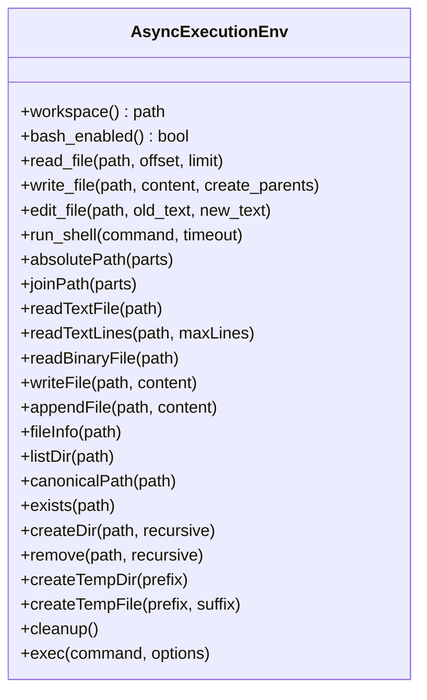

**Diagram sources**
- [ExecutionEnv.hpp:198-334](file://include/cch/harness/ExecutionEnv.hpp#L198-L334)

**Section sources**
- [README.md:256-266](file://README.md#L256-L266)
- [ExecutionEnv.hpp:58-192](file://include/cch/harness/ExecutionEnv.hpp#L58-L192)

### Extensible Tool System with Built-in Capabilities
- Tool registry:
  - Async tool registry keyed by tool name; definitions exported for tool schema.
- Built-in tools:
  - read_file, write_file, edit_file, and bash (opt-in).
- Tool factories:
  - Factory functions to create async tools bound to an execution environment.

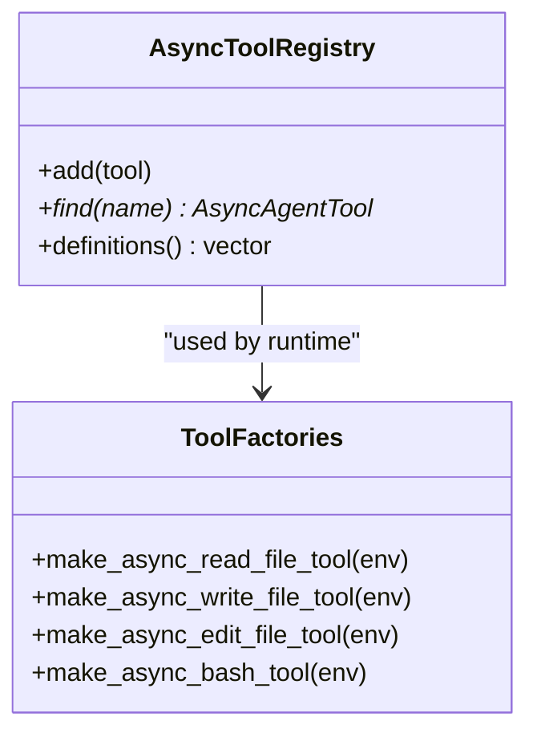

**Diagram sources**
- [ToolRegistry.hpp:13-48](file://include/cch/agent/ToolRegistry.hpp#L13-L48)
- [ToolFactories.hpp:10-13](file://include/cch/tools/ToolFactories.hpp#L10-L13)

**Section sources**
- [README.md:256-266](file://README.md#L256-L266)
- [ToolRegistry.hpp:21-44](file://include/cch/agent/ToolRegistry.hpp#L21-L44)
- [ToolFactories.hpp:10-13](file://include/cch/tools/ToolFactories.hpp#L10-L13)

### Provider-Agnostic AI Integration with Streaming Support
- Provider registry:
  - Registers provider factories and constructs streaming chat clients.
  - OpenAI-compatible defaults with configurable base URL and API key environment.
- Streaming support:
  - Stream events cover assistant start, text deltas, thinking deltas, tool call deltas, and completion/error events.
- Real provider usage:
  - OpenAI-compatible mode with optional base URL and model selection.

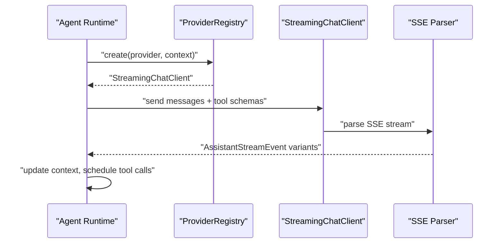

**Diagram sources**
- [ProviderRegistry.hpp:40-56](file://include/cch/ai/ProviderRegistry.hpp#L40-L56)
- [StreamEvent.hpp:78-91](file://include/cch/ai/StreamEvent.hpp#L78-L91)

**Section sources**
- [README.md:82-91](file://README.md#L82-L91)
- [README.md:170-171](file://README.md#L170-L171)
- [ProviderRegistry.hpp:18-53](file://include/cch/ai/ProviderRegistry.hpp#L18-L53)
- [StreamEvent.hpp:13-91](file://include/cch/ai/StreamEvent.hpp#L13-L91)

### Embeddable C++ SDK for Host Applications
- SDK surface:
  - Source-level only, experimental, not ABI-stable.
  - Create/resume sessions, subscribe to lifecycle events, run prompts, and close sessions.
- Supported v1 behavior:
  - Blocking prompt, event subscriptions via move-only sinks, host-provided chat clients and execution environments, built-in tool selection, custom tool registration, programmatic skills/templates/commands, project resource loading behind trust/resource controls.
- Not supported in SDK v1:
  - ABI stability, full pi runtime replacement APIs, tree navigation/compaction, concurrent prompts, cancellation, dynamic extensions, TUI, OAuth/subscription providers, or MCP integration.

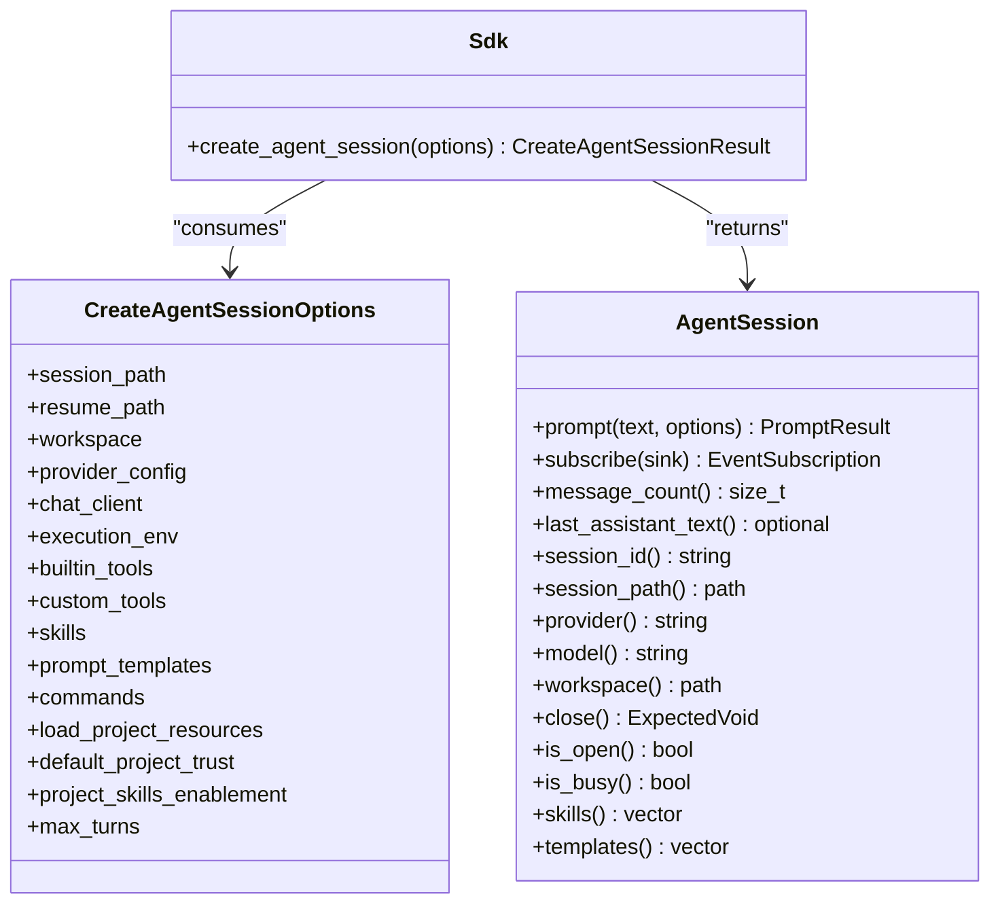

**Diagram sources**
- [Sdk.hpp:83-149](file://include/cch/coding_agent/Sdk.hpp#L83-L149)
- [Sdk.hpp:251-332](file://include/cch/coding_agent/Sdk.hpp#L251-L332)

**Section sources**
- [README.md:174-241](file://README.md#L174-L241)
- [Sdk.hpp:36-346](file://include/cch/coding_agent/Sdk.hpp#L36-L346)

### Skill System for Project-Local Knowledge Injection
- Discovery and loading:
  - At startup, CLI scans project-local .cpp-harness/skills for nested SKILL.md files when project resource load plan allows.
  - Skills use flat YAML frontmatter (name, description, optional disable-model-invocation) followed by markdown instructions.
- Visibility and invocation:
  - Valid skills are injected into model context through the pi-shaped <available_skills> block.
  - Skills with disable-model-invocation hidden from model-visible list but can be invoked explicitly with /skill:name.
- Diagnostics:
  - Malformed or duplicate skills produce warnings; editing during a running session is deferred.

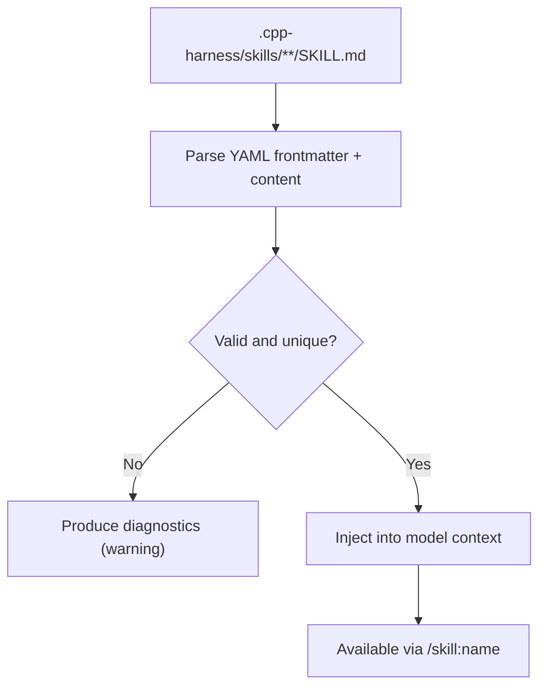

**Section sources**
- [README.md:242-247](file://README.md#L242-L247)
- [Skill.hpp:31-57](file://include/cch/coding_agent/Skill.hpp#L31-L57)

### Project Trust and Resource Controls
- Trust decision-making:
  - Protected project markers include .cpp-harness/settings.json, .cpp-harness/skills, .cpp-harness/prompts, and others.
  - Default policies: ask, always, or never; nearest-parent inheritance via trust store.
- One-run overrides:
  - --approve/-a and --no-approve allow one-run trust overrides; --no-skills suppresses project-local skills for that run.
- Not a sandbox:
  - Trust controls are an input-loading guard; they do not restrict built-in tools, model output, prompt injection from chosen files, shell commands enabled with --enable-bash, or content already present in a resumed session.

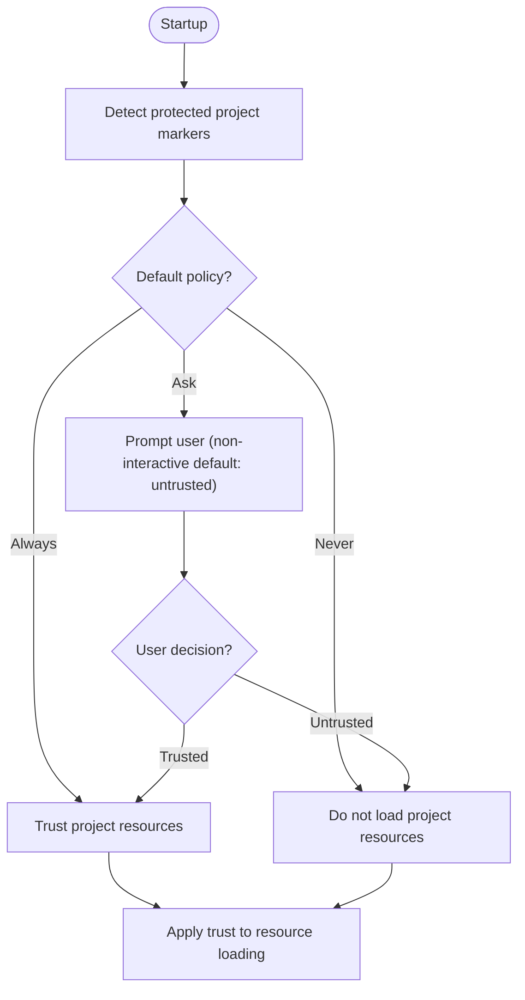

**Section sources**
- [README.md:248-255](file://README.md#L248-L255)
- [ProjectTrust.hpp:64-91](file://include/cch/coding_agent/ProjectTrust.hpp#L64-L91)

### Practical Examples

- CLI text mode:
  - Example invocation with a fake provider and JSONL session file, printing semantic events.
  - Example reading a file via tool and emitting semantic events.
  - Example using REPL mode with session persistence.
  - Example resuming a session and falling back to stored provider configuration.

- JSON mode:
  - Example emitting compact JSONL records with message_update events filtered via jq.

- RPC mode:
  - Example sending get_state and shutdown commands via stdin JSONL.

- Embedding with the SDK:
  - Example creating a session with provider config, subscribing to lifecycle events, running a prompt, and closing the session.

**Section sources**
- [README.md:70-78](file://README.md#L70-L78)
- [README.md:79-87](file://README.md#L79-L87)
- [README.md:170-171](file://README.md#L170-L171)
- [README.md:172-173](file://README.md#L172-L173)
- [README.md:183-216](file://README.md#L183-L216)

## Dependency Analysis
The CLI entry point depends on CLI parsing and preflight validation, then delegates to the async CLI runtime. The runtime composes provider clients, execution environments, tools, and session storage. The SDK mirrors this composition at a higher level for embedding.

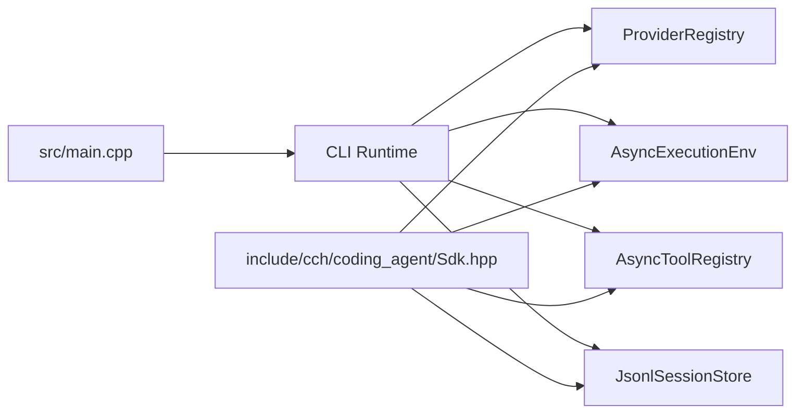

**Diagram sources**
- [main.cpp:7-32](file://src/main.cpp#L7-L32)
- [ProviderRegistry.hpp:40-56](file://include/cch/ai/ProviderRegistry.hpp#L40-L56)
- [ExecutionEnv.hpp:198-334](file://include/cch/harness/ExecutionEnv.hpp#L198-L334)
- [ToolRegistry.hpp:13-48](file://include/cch/agent/ToolRegistry.hpp#L13-L48)
- [JsonlSessionStore.hpp:18-79](file://include/cch/harness/session/JsonlSessionStore.hpp#L18-L79)
- [Sdk.hpp:343-344](file://include/cch/coding_agent/Sdk.hpp#L343-L344)

**Section sources**
- [README.md:135-151](file://README.md#L135-L151)
- [main.cpp:1-33](file://src/main.cpp#L1-L33)

## Performance Considerations
- Streaming AI responses reduce latency by incrementally exposing assistant text and tool calls.
- JSONL append is append-only and designed for redacted transcripts; tree navigation and compaction-aware context reconstruction are computed on demand.
- Workspace containment and sanitized environments avoid unnecessary overhead while preserving safety.
- The SDK is single-threaded and blocking per prompt; concurrency and cancellation are deferred.

[No sources needed since this section provides general guidance]

## Troubleshooting Guide
- Missing API key:
  - Ensure the correct environment variable is exported and passed via --api-key-env.
- Authentication or authorization failure:
  - Verify the key is valid for the selected provider and that the base URL is correct.
- Invalid model:
  - Use the supported model for the provider.
- Rate limit or quota error:
  - Retry later or check entitlements.
- Request unexpectedly going to another provider:
  - Ensure the base URL, model, and API key environment are all present.
- 403 Forbidden:
  - Confirm subscription/agent access for the provider’s coding endpoint.
- Provider or transport error:
  - Re-run with harmless prompts and inspect diagnostics without printing secrets.

**Section sources**
- [README.md:115-126](file://README.md#L115-L126)

## Conclusion
The C++ Coding Harness delivers a flexible, provider-agnostic coding agent with robust multi-modal interaction, persistent session management, secure execution, and an embeddable SDK surface. While experimental and not production-ready, it offers a solid foundation for integrating AI-assisted coding workflows in both CLI and embedded contexts. Users should expect deferred features such as full RPC parity, ABI stability, concurrent prompts, and advanced TUI capabilities, and treat the SDK as source-level only for now.

[No sources needed since this section summarizes without analyzing specific files]

## Appendices

### Deferred Features and Limitations
- Rich TUI, extensions, packages, global/config-driven skill directories, live skill reload, OAuth, full pi RPC command parity, MCP integration, permission prompts, native Windows shell process-tree termination semantics, tool execution streaming updates, subagents, C++26 reflection-generated schema, std::execution senders/receivers, ABI-stable binary distribution, or OS-level sandboxing.
- SDK v1 lacks ABI stability, full pi runtime replacement APIs, tree navigation/compaction, concurrent prompts, cancellation, dynamic extensions, TUI, OAuth/subscription providers, or MCP integration.

**Section sources**
- [README.md:303-308](file://README.md#L303-L308)