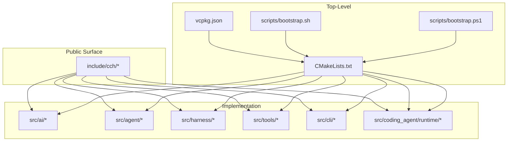
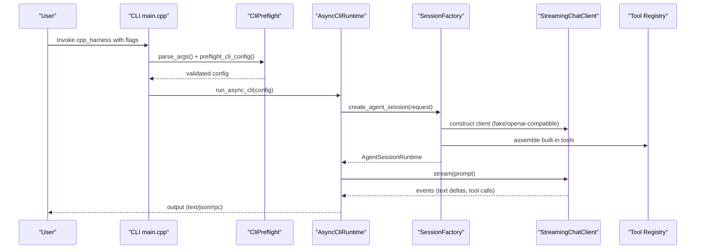
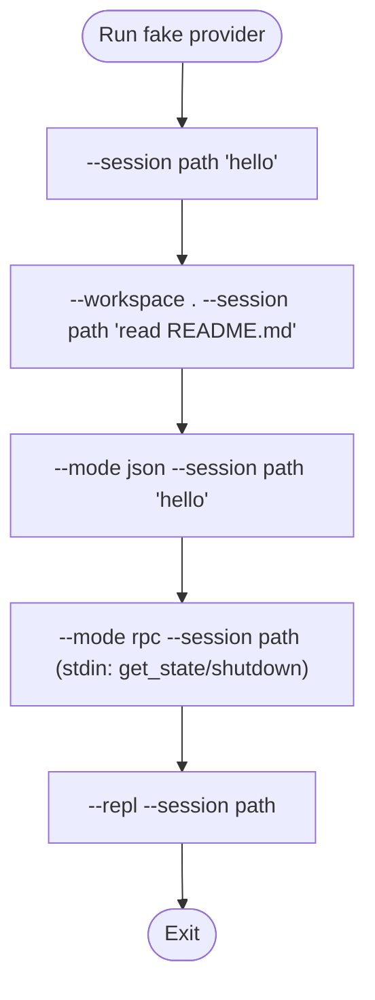
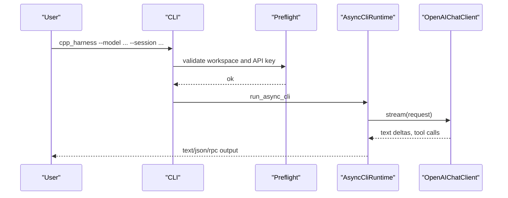
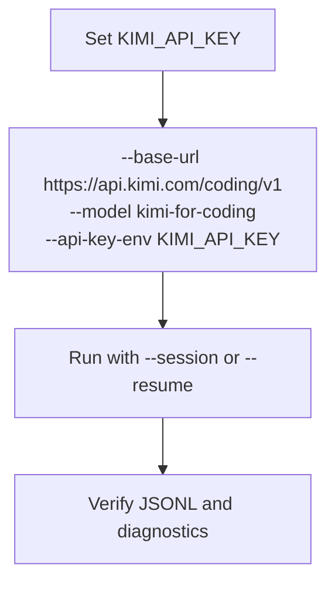
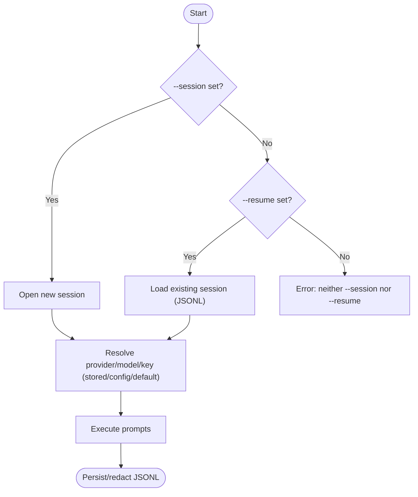
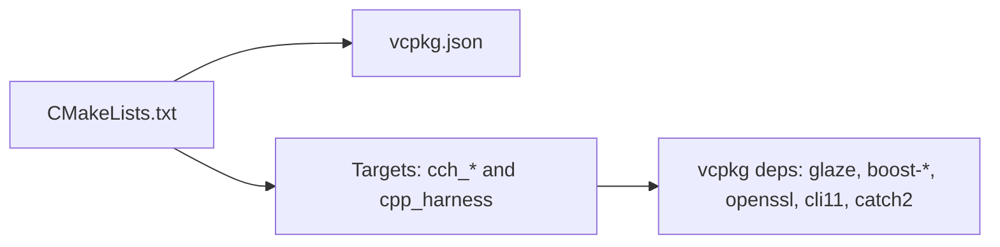

# Getting Started

<cite>
**Referenced Files in This Document**
- [README.md](file://README.md)
- [CMakeLists.txt](file://CMakeLists.txt)
- [vcpkg.json](file://vcpkg.json)
- [scripts/bootstrap.sh](file://scripts/bootstrap.sh)
- [scripts/bootstrap.ps1](file://scripts/bootstrap.ps1)
- [src/main.cpp](file://src/main.cpp)
- [src/cli/CliParse.cpp](file://src/cli/CliParse.cpp)
- [src/cli/CliPreflight.cpp](file://src/cli/CliPreflight.cpp)
- [src/ai/providers/FakeChatClient.cpp](file://src/ai/providers/FakeChatClient.cpp)
- [src/ai/providers/OpenAIChatClient.cpp](file://src/ai/providers/OpenAIChatClient.cpp)
- [src/coding_agent/runtime/AsyncCliRuntime.cpp](file://src/coding_agent/runtime/AsyncCliRuntime.cpp)
- [src/coding_agent/runtime/SessionFactory.cpp](file://src/coding_agent/runtime/SessionFactory.cpp)
</cite>

## Table of Contents
1. [Introduction](#introduction)
2. [Project Structure](#project-structure)
3. [Core Components](#core-components)
4. [Architecture Overview](#architecture-overview)
5. [Detailed Component Analysis](#detailed-component-analysis)
6. [Dependency Analysis](#dependency-analysis)
7. [Performance Considerations](#performance-considerations)
8. [Troubleshooting Guide](#troubleshooting-guide)
9. [Conclusion](#conclusion)
10. [Appendices](#appendices)

## Introduction
This guide helps you quickly install, configure, and run the C++ Coding Harness. You will:
- Install prerequisites (C++23 compiler, CMake 3.25+, and vcpkg-managed dependencies)
- Bootstrap the project on Linux/macOS or Windows
- Run your first sessions using the deterministic fake provider, a real OpenAI-compatible provider, and the Kimi Code integration
- Explore CLI modes (text, JSON, RPC) and session management (create vs resume)
- Verify success and troubleshoot common setup issues

## Project Structure
At a high level, the project is organized into:
- Public headers under include/cch exposing the embeddable SDK surface
- Implementation under src grouped by subsystems (AI providers, agent loop, harness, CLI/runtime)
- Tests under tests validating architecture and behavior
- Scripts under scripts for bootstrapping on Linux/macOS and Windows
- Top-level build and dependency manifests (CMakeLists.txt, vcpkg.json)

**Diagram sources**
- [CMakeLists.txt:1-212](file://CMakeLists.txt#L1-L212)
- [vcpkg.json:1-15](file://vcpkg.json#L1-L15)
- [scripts/bootstrap.sh:1-130](file://scripts/bootstrap.sh#L1-L130)
- [scripts/bootstrap.ps1:1-78](file://scripts/bootstrap.ps1#L1-L78)

**Section sources**
- [README.md:135-151](file://README.md#L135-L151)
- [CMakeLists.txt:1-212](file://CMakeLists.txt#L1-L212)
- [vcpkg.json:1-15](file://vcpkg.json#L1-L15)

## Core Components
- CLI entrypoint parses arguments, validates configuration, resolves workspace, and starts the async runtime
- Async runtime orchestrates session creation, event printing, and prompt execution
- Provider implementations: a deterministic fake provider and an OpenAI-compatible streaming client
- Session factory constructs the runtime, opens/loads sessions, and wires tools, skills, and templates

Key behaviors:
- CLI modes: text (human-readable), json (machine-readable events), rpc (stdin/stdout command loop)
- Session management: --session to create a new JSONL session; --resume to append to an existing session
- REPL mode: interactive loop with built-in slash commands

**Section sources**
- [src/main.cpp:1-33](file://src/main.cpp#L1-L33)
- [src/cli/CliParse.cpp:64-179](file://src/cli/CliParse.cpp#L64-L179)
- [src/cli/CliPreflight.cpp:65-122](file://src/cli/CliPreflight.cpp#L65-L122)
- [src/coding_agent/runtime/AsyncCliRuntime.cpp:41-228](file://src/coding_agent/runtime/AsyncCliRuntime.cpp#L41-L228)
- [src/coding_agent/runtime/SessionFactory.cpp:274-423](file://src/coding_agent/runtime/SessionFactory.cpp#L274-L423)

## Architecture Overview
The runtime composes a session from provider, tools, and workspace capabilities, then executes prompts with streaming events.

**Diagram sources**
- [src/main.cpp:7-32](file://src/main.cpp#L7-L32)
- [src/cli/CliParse.cpp:64-179](file://src/cli/CliParse.cpp#L64-L179)
- [src/cli/CliPreflight.cpp:65-122](file://src/cli/CliPreflight.cpp#L65-L122)
- [src/coding_agent/runtime/AsyncCliRuntime.cpp:41-228](file://src/coding_agent/runtime/AsyncCliRuntime.cpp#L41-L228)
- [src/coding_agent/runtime/SessionFactory.cpp:274-423](file://src/coding_agent/runtime/SessionFactory.cpp#L274-L423)
- [src/ai/providers/OpenAIChatClient.cpp:263-497](file://src/ai/providers/OpenAIChatClient.cpp#L263-L497)

## Detailed Component Analysis

### Installation and Bootstrapping
- Prerequisites
  - C++23-capable compiler and CMake 3.25+
  - vcpkg-managed dependencies (Glaze, Boost, OpenSSL, CLI11, Catch2)
- Recommended bootstrap with vcpkg
  - Linux/macOS: scripts/bootstrap.sh with --test
  - Windows: scripts/bootstrap.ps1 with -Test
- Manual vcpkg usage
  - cmake --preset vcpkg
  - cmake --build --preset vcpkg
  - ctest --preset vcpkg
- Using system packages
  - cmake --preset system
  - cmake --build --preset system
  - ctest --preset system

Verification steps
- After building, run the harness with the fake provider to verify installation
- Use --mode json or --mode rpc to observe machine-readable output
- Use --session to create a JSONL session and inspect .cpp-harness/sessions

**Section sources**
- [README.md:21-80](file://README.md#L21-L80)
- [README.md:60-69](file://README.md#L60-L69)
- [README.md:70-78](file://README.md#L70-L78)
- [scripts/bootstrap.sh:1-130](file://scripts/bootstrap.sh#L1-L130)
- [scripts/bootstrap.ps1:1-78](file://scripts/bootstrap.ps1#L1-L78)
- [CMakeLists.txt:1-212](file://CMakeLists.txt#L1-L212)
- [vcpkg.json:1-15](file://vcpkg.json#L1-L15)

### First Run Examples

#### Example 1: Deterministic Fake Provider
- Purpose: validate installation and observe the agent loop without network calls
- Typical invocation
  - Create a session and run a simple prompt
  - Read a file using the workspace boundary
  - Switch to JSON mode to see structured events
  - Use RPC mode with stdin commands for programmatic control
  - Use REPL mode for interactive multi-turn conversations

**Diagram sources**
- [README.md:70-78](file://README.md#L70-L78)

**Section sources**
- [README.md:70-78](file://README.md#L70-L78)
- [src/ai/providers/FakeChatClient.cpp:24-121](file://src/ai/providers/FakeChatClient.cpp#L24-L121)

#### Example 2: Real OpenAI-Compatible Provider
- Purpose: connect to a provider compatible with the OpenAI Chat Completions API
- Steps
  - Set the API key environment variable
  - Run with --model and optional --base-url
  - Observe streamed assistant text and tool-call events

**Diagram sources**
- [README.md:82-87](file://README.md#L82-L87)
- [src/cli/CliPreflight.cpp:65-92](file://src/cli/CliPreflight.cpp#L65-L92)
- [src/ai/providers/OpenAIChatClient.cpp:263-497](file://src/ai/providers/OpenAIChatClient.cpp#L263-L497)

**Section sources**
- [README.md:82-87](file://README.md#L82-L87)
- [src/cli/CliPreflight.cpp:65-92](file://src/cli/CliPreflight.cpp#L65-L92)
- [src/ai/providers/OpenAIChatClient.cpp:263-497](file://src/ai/providers/OpenAIChatClient.cpp#L263-L497)

#### Example 3: Kimi Code Integration
- Purpose: use the existing OpenAI-compatible provider path for Kimi Code
- Steps
  - Set the Kimi API key environment variable
  - Pass --base-url for Kimi’s coding endpoint, --model kimi-for-coding, and --api-key-env pointing to the key
  - Resume previous sessions with the same flags to keep runtime context explicit

**Diagram sources**
- [README.md:93-105](file://README.md#L93-L105)

**Section sources**
- [README.md:93-105](file://README.md#L93-L105)

### CLI Modes and Practical Patterns
- Text mode (default): human-readable semantic events
- JSON mode: machine-readable event stream suitable for post-processing
- RPC mode: stdin/stdout command loop for automation
- REPL mode: interactive loop with slash commands (/help, /clear, /compact, /exit)

Practical patterns
- One-shot prompts: positional arguments
- RPC automation: echo commands to stdin
- Interactive sessions: --repl with persistent history
- Mode restrictions: --mode json and --mode rpc cannot be combined with --repl; RPC mode reads from stdin and ignores positional prompts

**Section sources**
- [README.md:157-173](file://README.md#L157-L173)
- [src/cli/CliParse.cpp:162-175](file://src/cli/CliParse.cpp#L162-L175)

### Session Management with --session and --resume
- --session creates a new JSONL session at the given path
- --resume appends to an existing session and loads stored metadata
- On resume, if provider/model/api-key-env are not provided, the harness falls back to stored values, then to user config, then to defaults; explicit flags always win
- For Kimi sessions, re-specify all three flags on resume to maintain explicit context

**Diagram sources**
- [README.md:113-114](file://README.md#L113-L114)
- [src/cli/CliParse.cpp:96-99](file://src/cli/CliParse.cpp#L96-L99)
- [src/cli/CliPreflight.cpp:65-92](file://src/cli/CliPreflight.cpp#L65-L92)
- [src/coding_agent/runtime/SessionFactory.cpp:304-323](file://src/coding_agent/runtime/SessionFactory.cpp#L304-L323)

**Section sources**
- [README.md:113-114](file://README.md#L113-L114)
- [src/cli/CliParse.cpp:96-99](file://src/cli/CliParse.cpp#L96-L99)
- [src/cli/CliPreflight.cpp:65-92](file://src/cli/CliPreflight.cpp#L65-L92)
- [src/coding_agent/runtime/SessionFactory.cpp:304-323](file://src/coding_agent/runtime/SessionFactory.cpp#L304-L323)

## Dependency Analysis
- Build system
  - CMake minimum version 3.25, C++23 standard
  - Targets: cch_util, cch_ai, cch_agent, cch_harness, cch_tools, cch_coding_agent_runtime, cpp_harness, cpp_harness_tests
- Dependencies managed by vcpkg
  - Glaze, boost-process, boost-beast, boost-asio, openssl, cli11, catch2
- Presets
  - vcpkg/system presets select dependency resolution strategy

**Diagram sources**
- [CMakeLists.txt:1-212](file://CMakeLists.txt#L1-L212)
- [vcpkg.json:1-15](file://vcpkg.json#L1-L15)

**Section sources**
- [CMakeLists.txt:1-212](file://CMakeLists.txt#L1-L212)
- [vcpkg.json:1-15](file://vcpkg.json#L1-L15)

## Performance Considerations
- Streaming events minimize latency for long responses
- JSON mode reduces console overhead for automated pipelines
- RPC mode enables efficient automation without spawning subprocesses
- Use appropriate max-turn limits to bound session length

## Troubleshooting Guide
Common symptoms and checks
- Missing API key
  - Ensure the environment variable is exported and matches the provider configuration
- Authentication or authorization failure
  - Verify the key is valid for the selected provider and model
- Invalid model
  - Use the correct model name for the provider
- Rate limit or quota error
  - Retry later or adjust entitlements
- Request unexpectedly going to another provider
  - Confirm base URL, model, and API key environment variable are set consistently
- 403 Forbidden
  - Confirm subscription/agent access for the provider
- Provider or transport error
  - Re-run with safe prompts and inspect diagnostics without printing secrets

Live smoke validation
- Optional manual validation script for Kimi Code is provided; it requires explicit opt-in and uses throwaway resources

**Section sources**
- [README.md:115-134](file://README.md#L115-L134)

## Conclusion
You now have the essentials to install, bootstrap, and run the C++ Coding Harness across platforms. Start with the fake provider to validate your setup, then progress to real providers and integrations like Kimi Code. Use --session/--resume for reproducible, redacted transcripts and explore JSON/RPC modes for automation.

## Appendices

### Quick Reference: CLI Options and Behaviors
- --fake: deterministic fake provider (no network)
- --repl: interactive REPL with slash commands
- --enable-bash: allow model-requested bash commands
- --approve / --no-approve: trust project resources for this run
- --no-skills: disable project-local skills for this run
- --no-prompt-templates: disable all prompt template loading
- --prompt-template: load a specific prompt template file or directory
- --workspace: set workspace boundary
- --session: create a new JSONL session
- --resume: append to an existing JSONL session
- --max-turns: limit turns per prompt
- --model: provider model name
- --base-url: OpenAI-compatible base URL
- --api-key-env: environment variable containing API key
- --mode: text, json, or rpc

Notes
- --mode json cannot be combined with --repl
- --mode rpc cannot be combined with --repl
- --mode rpc reads prompts from stdin and ignores positional prompts
- A prompt is required unless --repl is used

**Section sources**
- [src/cli/CliParse.cpp:78-175](file://src/cli/CliParse.cpp#L78-L175)
- [src/cli/CliPreflight.cpp:65-122](file://src/cli/CliPreflight.cpp#L65-L122)