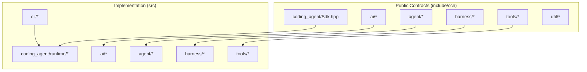
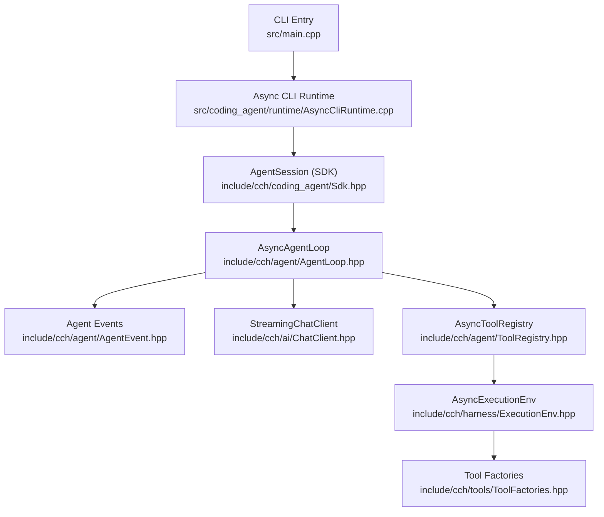
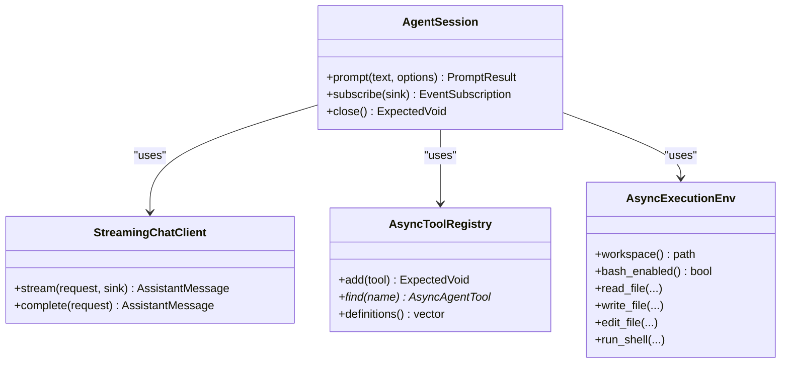
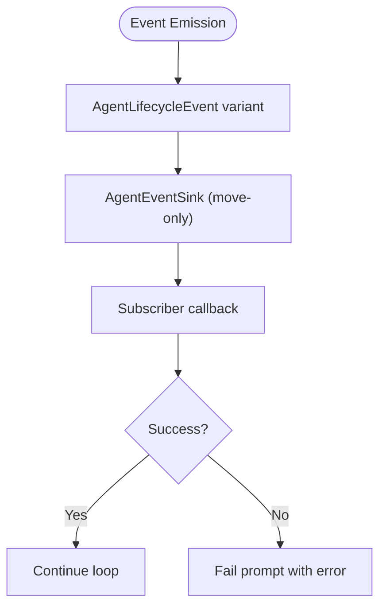
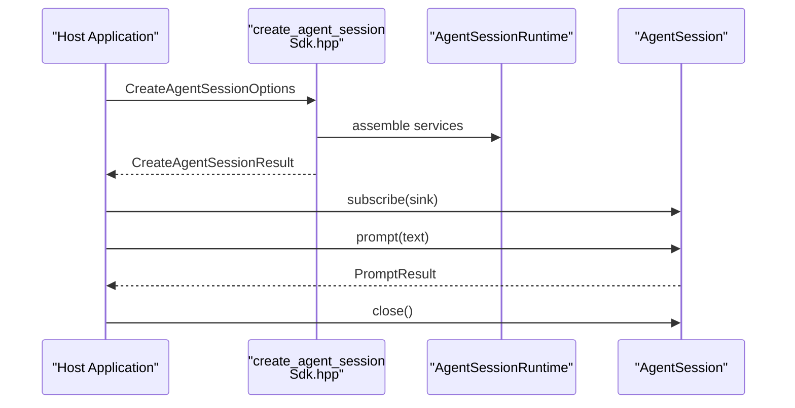
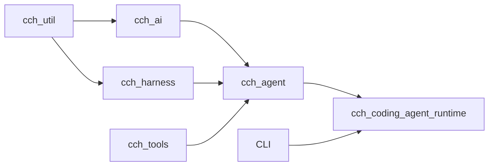

# Project Overview

<cite>
**Referenced Files in This Document**
- [README.md](file://README.md)
- [main.cpp](file://src/main.cpp)
- [AsyncCliRuntime.cpp](file://src/coding_agent/runtime/AsyncCliRuntime.cpp)
- [Sdk.hpp](file://include/cch/coding_agent/Sdk.hpp)
- [AgentLoop.hpp](file://include/cch/agent/AgentLoop.hpp)
- [AgentEvent.hpp](file://include/cch/agent/AgentEvent.hpp)
- [AgentContext.hpp](file://include/cch/agent/AgentContext.hpp)
- [ToolRegistry.hpp](file://include/cch/agent/ToolRegistry.hpp)
- [ToolFactories.hpp](file://include/cch/tools/ToolFactories.hpp)
- [ExecutionEnv.hpp](file://include/cch/harness/ExecutionEnv.hpp)
- [ChatClient.hpp](file://include/cch/ai/ChatClient.hpp)
- [Error.hpp](file://include/cch/util/Error.hpp)
- [SessionFactory.cpp](file://src/coding_agent/runtime/SessionFactory.cpp)
- [Config.hpp](file://include/cch/coding_agent/Config.hpp)
- [2026-06-16-001-refactor-pi-cpp-parity-todo.md](file://docs/plans/2026-06-16-001-refactor-pi-cpp-parity-todo.md)
</cite>

## Table of Contents
1. [Introduction](#introduction)
2. [Project Structure](#project-structure)
3. [Core Components](#core-components)
4. [Architecture Overview](#architecture-overview)
5. [Detailed Component Analysis](#detailed-component-analysis)
6. [Dependency Analysis](#dependency-analysis)
7. [Performance Considerations](#performance-considerations)
8. [Troubleshooting Guide](#troubleshooting-guide)
9. [Conclusion](#conclusion)

## Introduction
This project is an experimental C++23 coding-agent harness built around anti-fragile architecture principles. It emphasizes:
- Passive data contracts: value types, variants, and expected-style error handling
- Replaceable capability seams: providers, transports, execution environments, and tools
- Weak event connections: move-only callback semantics for event sinks
- Generic machinery locality: serialization and provider mappings remain behind implementation boundaries

The harness implements a pi-style agent loop: prompt → tool calls → execution → persistence. It is designed as both a CLI tool and an embeddable C++ SDK surface, with a focus on experimentation and incremental parity with the broader pi ecosystem.

**Section sources**
- [README.md:3-19](file://README.md#L3-L19)
- [2026-06-16-001-refactor-pi-cpp-parity-todo.md:17-22](file://docs/plans/2026-06-16-001-refactor-pi-cpp-parity-todo.md#L17-L22)

## Project Structure
The repository is organized into layered packages with clear separation of concerns:
- Public contracts and SDK surface under include/cch
- Implementation adapters under src
- CLI entrypoint and runtime orchestration
- Coding-agent runtime, session lifecycle, and resource loading
- Agent loop, tools, and capability seams
- AI contracts, providers, and stream events
- Harness execution environment and session storage



**Diagram sources**
- [README.md:135-151](file://README.md#L135-L151)

**Section sources**
- [README.md:135-151](file://README.md#L135-L151)

## Core Components
- Agent loop: orchestrates turns, manages state, and emits lifecycle events
- Capability seams: AI chat client, execution environment, and tool registry
- Event system: move-only sinks for lifecycle events
- SDK surface: same-process embeddable API for host applications
- CLI runtime: parses arguments, assembles services, and drives prompts

Key implementation anchors:
- Agent loop and lifecycle events
- Streaming chat client and provider registry
- Async execution environment and built-in tools
- Session creation and runtime services

**Section sources**
- [AgentLoop.hpp:16-36](file://include/cch/agent/AgentLoop.hpp#L16-L36)
- [AgentEvent.hpp:12-106](file://include/cch/agent/AgentEvent.hpp#L12-L106)
- [ChatClient.hpp:23-34](file://include/cch/ai/ChatClient.hpp#L23-L34)
- [ExecutionEnv.hpp:198-334](file://include/cch/harness/ExecutionEnv.hpp#L198-L334)
- [ToolRegistry.hpp:13-48](file://include/cch/agent/ToolRegistry.hpp#L13-L48)
- [ToolFactories.hpp:10-13](file://include/cch/tools/ToolFactories.hpp#L10-L13)
- [Sdk.hpp:26-346](file://include/cch/coding_agent/Sdk.hpp#L26-L346)

## Architecture Overview
Anti-fragile architecture principles are reflected in the codebase:
- Data-passive: contracts use aggregate-friendly structs, variants, and expected-style error handling
- Capability-seams: providers, transports, execution environments, and tools are replaceable interfaces
- Weak-events: event sinks are move-only and owned by subscribers
- Generic-machinery-local: Glaze DTOs and provider mappings are isolated from domain-facing headers



**Diagram sources**
- [main.cpp:7-32](file://src/main.cpp#L7-L32)
- [AsyncCliRuntime.cpp:41-225](file://src/coding_agent/runtime/AsyncCliRuntime.cpp#L41-L225)
- [Sdk.hpp:251-332](file://include/cch/coding_agent/Sdk.hpp#L251-L332)
- [AgentLoop.hpp:16-36](file://include/cch/agent/AgentLoop.hpp#L16-L36)
- [AgentEvent.hpp:91-106](file://include/cch/agent/AgentEvent.hpp#L91-L106)
- [ChatClient.hpp:23-34](file://include/cch/ai/ChatClient.hpp#L23-L34)
- [ToolRegistry.hpp:13-48](file://include/cch/agent/ToolRegistry.hpp#L13-L48)
- [ExecutionEnv.hpp:198-334](file://include/cch/harness/ExecutionEnv.hpp#L198-L334)
- [ToolFactories.hpp:10-13](file://include/cch/tools/ToolFactories.hpp#L10-L13)

## Detailed Component Analysis

### Pi-Style Agent Loop Workflow
The harness implements a prompt → tool calls → execution → persistence loop:
1. Accept a prompt from CLI or REPL
2. Send ordered messages plus JSON Schema tool definitions to an OpenAI-compatible chat API
3. Execute local tools requested via tool_calls
4. Append tool-result messages with matching call IDs
5. Repeat until the assistant stops or max-turn limit is reached
6. Persist the redacted typed transcript as JSONL

```mermaid
sequenceDiagram
participant CLI as "CLI Runtime<br/>AsyncCliRuntime.cpp"
participant SDK as "AgentSession<br/>Sdk.hpp"
participant LOOP as "AsyncAgentLoop<br/>AgentLoop.hpp"
participant AI as "StreamingChatClient<br/>ChatClient.hpp"
participant REG as "AsyncToolRegistry<br/>ToolRegistry.hpp"
participant ENV as "AsyncExecutionEnv<br/>ExecutionEnv.hpp"
CLI->>SDK : prompt(text)
SDK->>LOOP : run(user_prompt)
LOOP->>AI : stream(request, sink)
AI-->>LOOP : AssistantStreamEvent(s)
LOOP->>LOOP : extract tool_calls
LOOP->>REG : find(tool_name)
REG-->>LOOP : AsyncAgentTool
LOOP->>ENV : execute(tool_call)
ENV-->>LOOP : Tool result
LOOP-->>SDK : lifecycle events
SDK-->>CLI : PromptResult
```

**Diagram sources**
- [AsyncCliRuntime.cpp:134-205](file://src/coding_agent/runtime/AsyncCliRuntime.cpp#L134-L205)
- [Sdk.hpp:267-269](file://include/cch/coding_agent/Sdk.hpp#L267-L269)
- [AgentLoop.hpp:20-27](file://include/cch/agent/AgentLoop.hpp#L20-L27)
- [ChatClient.hpp:27-29](file://include/cch/ai/ChatClient.hpp#L27-L29)
- [ToolRegistry.hpp:29-32](file://include/cch/agent/ToolRegistry.hpp#L29-L32)
- [ExecutionEnv.hpp:207-221](file://include/cch/harness/ExecutionEnv.hpp#L207-L221)

**Section sources**
- [README.md:10-17](file://README.md#L10-L17)
- [AsyncCliRuntime.cpp:134-205](file://src/coding_agent/runtime/AsyncCliRuntime.cpp#L134-L205)
- [AgentLoop.hpp:20-27](file://include/cch/agent/AgentLoop.hpp#L20-L27)

### Capability Seams and Replaceable Interfaces
- AI chat client: provider-agnostic streaming interface
- Execution environment: workspace containment, file operations, and shell execution
- Tool registry: async tool discovery and execution
- Provider registry: pluggable provider construction and configuration



**Diagram sources**
- [ChatClient.hpp:23-34](file://include/cch/ai/ChatClient.hpp#L23-L34)
- [ExecutionEnv.hpp:198-334](file://include/cch/harness/ExecutionEnv.hpp#L198-L334)
- [ToolRegistry.hpp:13-48](file://include/cch/agent/ToolRegistry.hpp#L13-L48)
- [Sdk.hpp:251-332](file://include/cch/coding_agent/Sdk.hpp#L251-L332)

**Section sources**
- [ChatClient.hpp:23-34](file://include/cch/ai/ChatClient.hpp#L23-L34)
- [ExecutionEnv.hpp:198-334](file://include/cch/harness/ExecutionEnv.hpp#L198-L334)
- [ToolRegistry.hpp:13-48](file://include/cch/agent/ToolRegistry.hpp#L13-L48)
- [Sdk.hpp:251-332](file://include/cch/coding_agent/Sdk.hpp#L251-L332)

### Event-Driven Design and Move-Only Sinks
Agent lifecycle events are modeled as a variant of passive data structures. Event sinks are move-only functions that receive lifecycle events and return expected-style results. This enables subscribers to own unique state without forcing shared ownership.



**Diagram sources**
- [AgentEvent.hpp:91-106](file://include/cch/agent/AgentEvent.hpp#L91-L106)
- [AgentEvent.hpp:108](file://include/cch/agent/AgentEvent.hpp#L108)

**Section sources**
- [AgentEvent.hpp:12-106](file://include/cch/agent/AgentEvent.hpp#L12-L106)
- [Error.hpp:10-35](file://include/cch/util/Error.hpp#L10-L35)

### SDK Surface and Same-Process Embedding
The SDK provides a source-level API for embedding the agent loop without shelling out to the CLI. It supports creating/resuming sessions, registering tools and resources, sending prompts, subscribing to events, and closing sessions cleanly.



**Diagram sources**
- [Sdk.hpp:343-344](file://include/cch/coding_agent/Sdk.hpp#L343-L344)
- [SessionFactory.cpp:425-809](file://src/coding_agent/runtime/SessionFactory.cpp#L425-L809)
- [Sdk.hpp:251-332](file://include/cch/coding_agent/Sdk.hpp#L251-L332)

**Section sources**
- [README.md:174-241](file://README.md#L174-L241)
- [Sdk.hpp:26-346](file://include/cch/coding_agent/Sdk.hpp#L26-L346)
- [SessionFactory.cpp:425-809](file://src/coding_agent/runtime/SessionFactory.cpp#L425-L809)

### Practical Examples in Action
- CLI one-shot: run a single prompt and print semantic events or JSON/RPC output
- REPL mode: keep history in memory, support slash commands, and append to sessions
- Real-provider mode: connect to OpenAI-compatible providers or Kimi Code
- SDK usage: create a session programmatically, subscribe to events, and run prompts

**Section sources**
- [README.md:70-114](file://README.md#L70-L114)
- [AsyncCliRuntime.cpp:134-225](file://src/coding_agent/runtime/AsyncCliRuntime.cpp#L134-L225)
- [main.cpp:7-32](file://src/main.cpp#L7-L32)

## Dependency Analysis
The build organizes code into package-style targets with clear dependency directions:
- cch_ai depends on cch_util
- cch_agent depends on cch_ai, cch_harness, cch_tools
- cch_coding_agent_runtime depends on cch_agent, cch_harness, cch_tools
- CLI and runtime depend on the coding-agent runtime



**Diagram sources**
- [README.md:142-149](file://README.md#L142-L149)

**Section sources**
- [README.md:142-149](file://README.md#L142-L149)

## Performance Considerations
- Async I/O: coroutines and awaitables minimize blocking and enable efficient concurrency
- Event streaming: move-only sinks avoid unnecessary copies and enable efficient event delivery
- Serialization locality: Glaze mappings and provider DTOs are isolated from domain contracts
- Workspace containment: path validation and atomic writes prevent expensive error recovery

[No sources needed since this section provides general guidance]

## Troubleshooting Guide
Common issues and checks:
- Missing API key or invalid provider configuration
- Authentication or authorization failures
- Invalid model or rate limit/quota errors
- Provider or transport errors
- Session resume conflicts or unsupported topology

**Section sources**
- [README.md:115-126](file://README.md#L115-L126)

## Conclusion
This experimental C++23 coding-agent harness demonstrates anti-fragile architecture principles in practice. It provides a robust pi-style agent loop, replaceable capability seams, and a move-only event system, while maintaining a clear separation between public contracts and implementation details. The project serves as both a CLI tool and an embeddable SDK, with ongoing work to align with the broader pi ecosystem’s module and contract parity.

[No sources needed since this section summarizes without analyzing specific files]