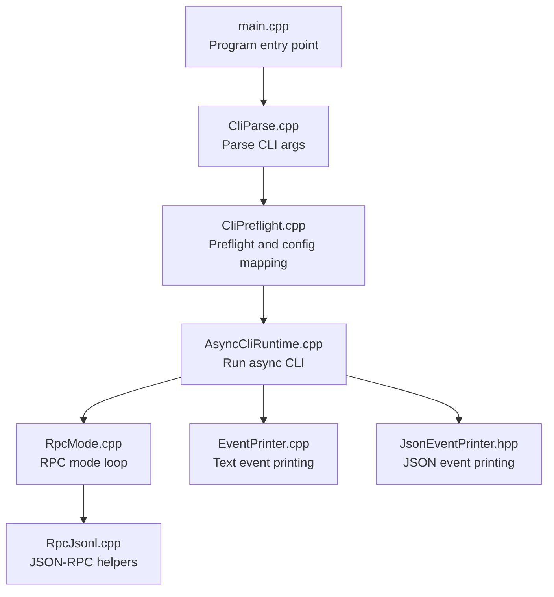
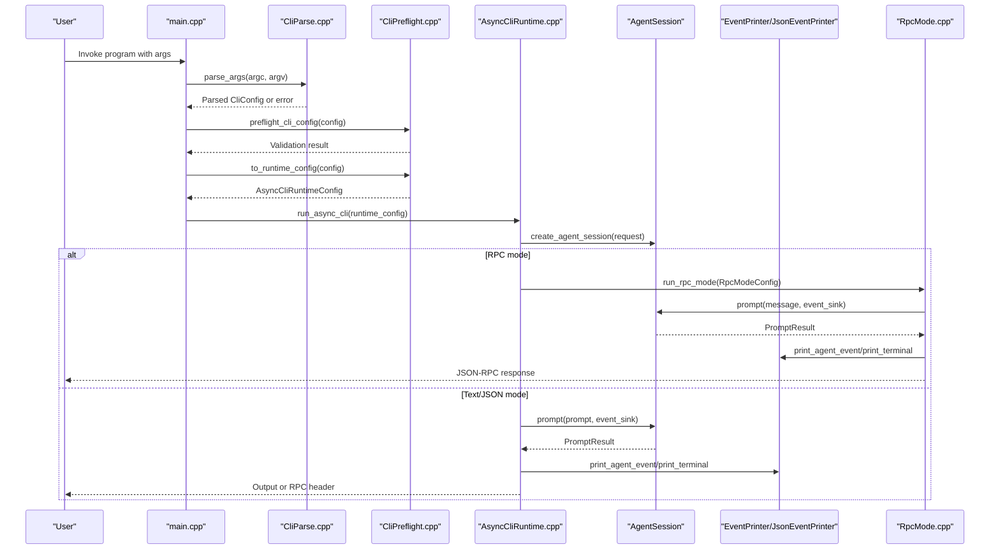
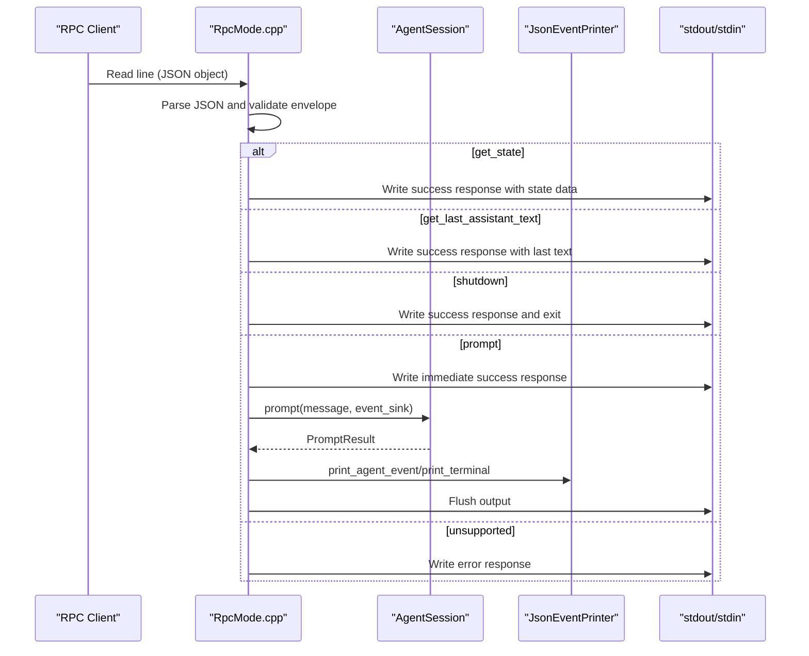
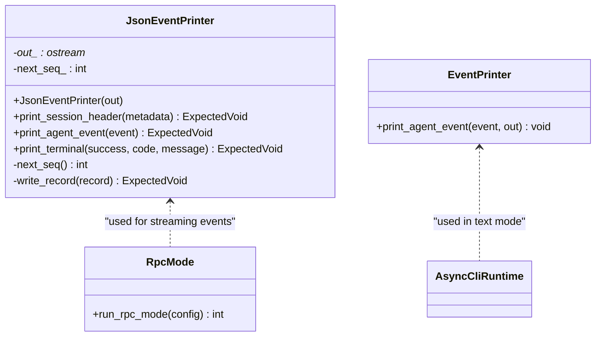
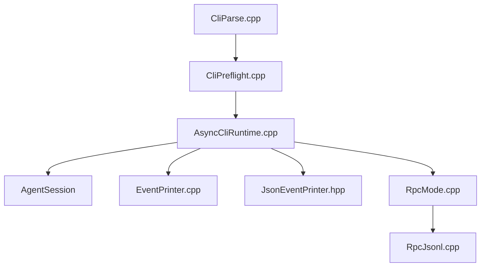

# CLI Runtime Management

<cite>
**Referenced Files in This Document**
- [main.cpp](file://src/main.cpp)
- [CliParse.hpp](file://src/cli/CliParse.hpp)
- [CliParse.cpp](file://src/cli/CliParse.cpp)
- [CliPreflight.hpp](file://src/cli/CliPreflight.hpp)
- [CliPreflight.cpp](file://src/cli/CliPreflight.cpp)
- [CliRuntimeConfig.hpp](file://src/cli/CliRuntimeConfig.hpp)
- [AsyncCliRuntime.hpp](file://src/coding_agent/runtime/AsyncCliRuntime.hpp)
- [AsyncCliRuntime.cpp](file://src/coding_agent/runtime/AsyncCliRuntime.cpp)
- [RpcMode.hpp](file://src/coding_agent/runtime/RpcMode.hpp)
- [RpcMode.cpp](file://src/coding_agent/runtime/RpcMode.cpp)
- [RpcJsonl.hpp](file://src/coding_agent/runtime/RpcJsonl.hpp)
- [RpcJsonl.cpp](file://src/coding_agent/runtime/RpcJsonl.cpp)
- [EventPrinter.hpp](file://src/coding_agent/runtime/EventPrinter.hpp)
- [EventPrinter.cpp](file://src/coding_agent/runtime/EventPrinter.cpp)
- [JsonEventPrinter.hpp](file://src/coding_agent/runtime/JsonEventPrinter.hpp)
</cite>

## Table of Contents
1. [Introduction](#introduction)
2. [Project Structure](#project-structure)
3. [Core Components](#core-components)
4. [Architecture Overview](#architecture-overview)
5. [Detailed Component Analysis](#detailed-component-analysis)
6. [Dependency Analysis](#dependency-analysis)
7. [Performance Considerations](#performance-considerations)
8. [Troubleshooting Guide](#troubleshooting-guide)
9. [Conclusion](#conclusion)

## Introduction
This document explains the CLI runtime management for the C++ coding-agent harness, focusing on how the AsyncCliRuntime coordinates different interaction modes: REPL, batch, JSON, and RPC. It covers runtime mode selection, execution context determination, RPC mode implementation with JSON-RPC protocol handling, input/output stream management, terminal interaction, mode transitions, and error handling strategies. Practical configuration examples and integration points with the broader agent system are included.

## Project Structure
The CLI runtime spans several modules:
- CLI argument parsing and preflight validation
- Runtime configuration construction
- Asynchronous CLI runtime orchestration
- RPC mode and JSON-RPC protocol handling
- Event printing for text and JSON outputs

**Diagram sources**
- [main.cpp:7-32](file://src/main.cpp#L7-L32)
- [CliParse.cpp:64-179](file://src/cli/CliParse.cpp#L64-L179)
- [CliPreflight.cpp:94-115](file://src/cli/CliPreflight.cpp#L94-L115)
- [AsyncCliRuntime.cpp:41-225](file://src/coding_agent/runtime/AsyncCliRuntime.cpp#L41-L225)
- [RpcMode.cpp:79-206](file://src/coding_agent/runtime/RpcMode.cpp#L79-L206)
- [EventPrinter.cpp:8-31](file://src/coding_agent/runtime/EventPrinter.cpp#L8-L31)
- [JsonEventPrinter.hpp:12-26](file://src/coding_agent/runtime/JsonEventPrinter.hpp#L12-L26)
- [RpcJsonl.cpp:13-91](file://src/coding_agent/runtime/RpcJsonl.cpp#L13-L91)

**Section sources**
- [main.cpp:7-32](file://src/main.cpp#L7-L32)
- [CliParse.cpp:64-179](file://src/cli/CliParse.cpp#L64-L179)
- [CliPreflight.cpp:94-115](file://src/cli/CliPreflight.cpp#L94-L115)

## Core Components
- OutputMode enumeration defines supported output modes: Text, Json, and Rpc.
- AsyncCliRuntimeConfig carries runtime configuration including mode selection, workspace, session paths, provider overrides, and prompt.
- run_async_cli orchestrates session creation, diagnostics reporting, and dispatches to REPL/batch or RPC mode.
- RpcModeConfig encapsulates input/output streams, session handle, provider/model identifiers, and workspace path for RPC mode.
- Event printers render agent lifecycle events to stdout in text or JSON formats.

Key responsibilities:
- Mode selection: Determined by CLI flags and validated during preflight.
- Execution context: Built from parsed CLI config and mapped to runtime config.
- RPC mode: Implements JSON-RPC over newline-delimited JSON records with explicit response envelopes.
- Terminal interaction: REPL prompts user input; batch executes a single prompt; JSON mode emits structured events; RPC mode consumes stdin and writes JSON responses.

**Section sources**
- [CliRuntimeConfig.hpp:12-36](file://src/cli/CliRuntimeConfig.hpp#L12-L36)
- [AsyncCliRuntime.hpp:7-7](file://src/coding_agent/runtime/AsyncCliRuntime.hpp#L7-L7)
- [AsyncCliRuntime.cpp:41-225](file://src/coding_agent/runtime/AsyncCliRuntime.cpp#L41-L225)
- [RpcMode.hpp:12-21](file://src/coding_agent/runtime/RpcMode.hpp#L12-L21)
- [EventPrinter.hpp:9-9](file://src/coding_agent/runtime/EventPrinter.hpp#L9-L9)
- [JsonEventPrinter.hpp:12-26](file://src/coding_agent/runtime/JsonEventPrinter.hpp#L12-L26)

## Architecture Overview
The runtime composes CLI parsing, preflight checks, session creation, and mode-specific execution loops. The diagram below maps the actual code paths and interactions.

**Diagram sources**
- [main.cpp:7-32](file://src/main.cpp#L7-L32)
- [CliParse.cpp:64-179](file://src/cli/CliParse.cpp#L64-L179)
- [CliPreflight.cpp:65-115](file://src/cli/CliPreflight.cpp#L65-L115)
- [AsyncCliRuntime.cpp:41-225](file://src/coding_agent/runtime/AsyncCliRuntime.cpp#L41-L225)
- [RpcMode.cpp:79-206](file://src/coding_agent/runtime/RpcMode.cpp#L79-L206)
- [EventPrinter.cpp:8-31](file://src/coding_agent/runtime/EventPrinter.cpp#L8-L31)
- [JsonEventPrinter.hpp:12-26](file://src/coding_agent/runtime/JsonEventPrinter.hpp#L12-L26)

## Detailed Component Analysis

### Mode Selection and Runtime Configuration
- CLI parsing supports three output modes: text, json, and rpc. Validation enforces incompatible combinations (e.g., json/rpc with repl, rpc with positional prompt).
- Preflight resolves provider settings and validates API keys for non-fake runs.
- Runtime configuration maps CLI flags and options into AsyncCliRuntimeConfig, including workspace normalization, default session paths, and timestamps.

Practical examples:
- REPL mode: Use --repl with --mode text to iterate prompts until exit/quit.
- Batch mode: Provide a prompt via positional argument or --prompt; use --mode text/json.
- JSON mode: Use --mode json for structured event output; avoid --repl.
- RPC mode: Use --mode rpc; read prompts from stdin; do not pass positional prompt.

**Section sources**
- [CliParse.cpp:49-60](file://src/cli/CliParse.cpp#L49-L60)
- [CliParse.cpp:162-175](file://src/cli/CliParse.cpp#L162-L175)
- [CliPreflight.cpp:65-92](file://src/cli/CliPreflight.cpp#L65-L92)
- [CliPreflight.cpp:94-115](file://src/cli/CliPreflight.cpp#L94-L115)
- [CliRuntimeConfig.hpp:18-36](file://src/cli/CliRuntimeConfig.hpp#L18-L36)

### AsyncCliRuntime Orchestration
Responsibilities:
- Load and merge configuration data.
- Register built-in commands and construct AgentSessionCreationRequest.
- Create agent session; handle resume vs. create errors.
- Initialize JSON printer for json mode and emit session header.
- Render diagnostics to stderr with categorized severity.
- Dispatch to REPL loop or single prompt execution depending on config.repl.
- Manage asynchronous event printing via io_context and worker thread when not in json mode.
- Translate prompt results into exit codes and messages.

Mode transitions:
- From batch to REPL occurs when config.repl is true.
- From json to terminal completion occurs after prompt execution completes.

**Section sources**
- [AsyncCliRuntime.cpp:41-225](file://src/coding_agent/runtime/AsyncCliRuntime.cpp#L41-L225)

### REPL Mode Behavior
- Prints a prompt and reads lines from stdin until exit/quit keywords.
- Executes each non-empty line as a prompt.
- Handles special command codes (e.g., command_handled, shutdown) and prints associated messages.
- Returns success on shutdown, non-zero on runtime failure.

**Section sources**
- [AsyncCliRuntime.cpp:207-221](file://src/coding_agent/runtime/AsyncCliRuntime.cpp#L207-L221)

### Batch Mode Behavior
- Executes a single prompt provided via CLI arguments.
- Emits final assistant text when completion code indicates success.
- Returns non-zero exit code on failure.

**Section sources**
- [AsyncCliRuntime.cpp:223-225](file://src/coding_agent/runtime/AsyncCliRuntime.cpp#L223-L225)

### JSON Mode Behavior
- Initializes JsonEventPrinter and prints a session header.
- Routes agent lifecycle events to JSON printer.
- Emits a terminal success/failure event upon prompt completion.
- Flushes output streams and returns appropriate exit codes.

**Section sources**
- [AsyncCliRuntime.cpp:88-95](file://src/coding_agent/runtime/AsyncCliRuntime.cpp#L88-L95)
- [AsyncCliRuntime.cpp:144-164](file://src/coding_agent/runtime/AsyncCliRuntime.cpp#L144-L164)
- [AsyncCliRuntime.cpp:191-204](file://src/coding_agent/runtime/AsyncCliRuntime.cpp#L191-L204)

### RPC Mode Implementation
RPC mode reads newline-delimited JSON records from stdin and writes JSON responses to stdout. Supported commands:
- get_state: Returns provider, model, sessionId, workspace, and messageCount.
- get_last_assistant_text: Returns last assistant text or null.
- shutdown: Acknowledges and exits with success.
- prompt: Validates presence of message, responds immediately, then streams agent events and a terminal success/failure response.

Protocol specifics:
- Envelope requires type and id fields as strings.
- Responses include id, type="response", command, success, optional data, and bounded error messages.
- Empty records produce error responses.
- Non-object records produce error responses.
- Unsupported commands produce error responses.

**Diagram sources**
- [RpcMode.cpp:79-206](file://src/coding_agent/runtime/RpcMode.cpp#L79-L206)
- [RpcJsonl.cpp:43-88](file://src/coding_agent/runtime/RpcJsonl.cpp#L43-L88)

**Section sources**
- [RpcMode.hpp:12-21](file://src/coding_agent/runtime/RpcMode.hpp#L12-L21)
- [RpcMode.cpp:79-206](file://src/coding_agent/runtime/RpcMode.cpp#L79-L206)
- [RpcJsonl.hpp:12-28](file://src/coding_agent/runtime/RpcJsonl.hpp#L12-L28)
- [RpcJsonl.cpp:13-91](file://src/coding_agent/runtime/RpcJsonl.cpp#L13-L91)

### Event Printing and Terminal Interaction
- Text mode: EventPrinter renders human-readable event markers to stdout.
- JSON mode: JsonEventPrinter serializes events and terminal results to stdout with sequence numbering and bounded flushing.
- AsyncCliRuntime manages an io_context and worker thread to safely post event rendering when not in JSON mode.

**Diagram sources**
- [JsonEventPrinter.hpp:12-26](file://src/coding_agent/runtime/JsonEventPrinter.hpp#L12-L26)
- [EventPrinter.cpp:8-31](file://src/coding_agent/runtime/EventPrinter.cpp#L8-L31)
- [RpcMode.cpp:79-206](file://src/coding_agent/runtime/RpcMode.cpp#L79-L206)

**Section sources**
- [EventPrinter.cpp:8-31](file://src/coding_agent/runtime/EventPrinter.cpp#L8-L31)
- [JsonEventPrinter.hpp:12-26](file://src/coding_agent/runtime/JsonEventPrinter.hpp#L12-L26)
- [AsyncCliRuntime.cpp:134-205](file://src/coding_agent/runtime/AsyncCliRuntime.cpp#L134-L205)

### Input Streams, Output Redirection, and Terminal Interaction
- REPL mode reads from stdin and writes to stdout.
- JSON mode writes structured events to stdout and flushes after each record.
- RPC mode reads JSON records from stdin and writes JSON responses to stdout.
- Diagnostics are emitted to stderr with severity categories and optional file paths.
- AsyncCliRuntime ensures proper cleanup of asynchronous printing threads and flushes output streams.

**Section sources**
- [AsyncCliRuntime.cpp:97-121](file://src/coding_agent/runtime/AsyncCliRuntime.cpp#L97-L121)
- [AsyncCliRuntime.cpp:134-205](file://src/coding_agent/runtime/AsyncCliRuntime.cpp#L134-L205)
- [RpcMode.cpp:79-206](file://src/coding_agent/runtime/RpcMode.cpp#L79-L206)

### Error Handling Strategies
- CLI parsing errors are normalized and returned as validation errors with helpful messages.
- Preflight validation checks existence of session files, workspace validity, and API key resolution for non-fake runs.
- Session creation errors distinguish resume mismatches and general failures; prints actionable messages to stderr.
- RPC mode validates envelopes and records, returning bounded error messages and immediate responses for malformed input.
- AsyncCliRuntime translates prompt failures into terminal JSON events and exit codes; distinguishes session persistence failures and general runtime errors.

**Section sources**
- [CliParse.cpp:27-47](file://src/cli/CliParse.cpp#L27-L47)
- [CliPreflight.cpp:65-92](file://src/cli/CliPreflight.cpp#L65-L92)
- [AsyncCliRuntime.cpp:71-81](file://src/coding_agent/runtime/AsyncCliRuntime.cpp#L71-L81)
- [RpcMode.cpp:82-126](file://src/coding_agent/runtime/RpcMode.cpp#L82-L126)
- [RpcJsonl.cpp:20-25](file://src/coding_agent/runtime/RpcJsonl.cpp#L20-L25)

## Dependency Analysis
The runtime depends on:
- CLI parsing and preflight for configuration validation and mapping.
- Agent session creation and lifecycle for prompt execution.
- Event printers for output formatting.
- RPC JSON helpers for protocol handling.

**Diagram sources**
- [CliParse.cpp:64-179](file://src/cli/CliParse.cpp#L64-L179)
- [CliPreflight.cpp:94-115](file://src/cli/CliPreflight.cpp#L94-L115)
- [AsyncCliRuntime.cpp:41-225](file://src/coding_agent/runtime/AsyncCliRuntime.cpp#L41-L225)
- [EventPrinter.cpp:8-31](file://src/coding_agent/runtime/EventPrinter.cpp#L8-L31)
- [JsonEventPrinter.hpp:12-26](file://src/coding_agent/runtime/JsonEventPrinter.hpp#L12-L26)
- [RpcMode.cpp:79-206](file://src/coding_agent/runtime/RpcMode.cpp#L79-L206)
- [RpcJsonl.cpp:13-91](file://src/coding_agent/runtime/RpcJsonl.cpp#L13-L91)

**Section sources**
- [AsyncCliRuntime.cpp:41-225](file://src/coding_agent/runtime/AsyncCliRuntime.cpp#L41-L225)
- [RpcMode.cpp:79-206](file://src/coding_agent/runtime/RpcMode.cpp#L79-L206)

## Performance Considerations
- Asynchronous event printing avoids blocking prompt execution in text mode by posting work to an io_context worker thread.
- JSON mode minimizes overhead by writing compact records and flushing per-line.
- RPC mode processes requests line-by-line, enabling streaming of agent events and immediate acknowledgments for prompt commands.
- Avoid combining --mode json/--mode rpc with --repl to prevent ambiguous input handling.

## Troubleshooting Guide
Common issues and resolutions:
- Invalid CLI arguments: Review normalized error messages and help output.
- Workspace path errors: Ensure the workspace exists and is a directory.
- API key missing for non-fake runs: Set the resolved environment variable before invoking the runtime.
- Session resume mismatch: The runtime prints a detailed message when the workspace does not match session metadata.
- RPC malformed records: The runtime responds with bounded error messages; ensure records are JSON objects with string type and id fields.
- Output failures: JSON serialization and stream flush errors are reported; check stdout availability and permissions.

**Section sources**
- [CliParse.cpp:27-47](file://src/cli/CliParse.cpp#L27-L47)
- [CliPreflight.cpp:51-57](file://src/cli/CliPreflight.cpp#L51-L57)
- [CliPreflight.cpp:86-91](file://src/cli/CliPreflight.cpp#L86-L91)
- [AsyncCliRuntime.cpp:71-81](file://src/coding_agent/runtime/AsyncCliRuntime.cpp#L71-L81)
- [RpcMode.cpp:82-126](file://src/coding_agent/runtime/RpcMode.cpp#L82-L126)
- [RpcJsonl.cpp:75-88](file://src/coding_agent/runtime/RpcJsonl.cpp#L75-L88)

## Conclusion
The AsyncCliRuntime provides a cohesive CLI interface supporting REPL, batch, JSON, and RPC modes. Mode selection is enforced by CLI parsing and preflight validation, ensuring safe and predictable execution contexts. RPC mode implements a robust JSON-RPC protocol over newline-delimited JSON, with strict envelope validation and bounded error reporting. Event printing adapts to each mode, and error handling communicates actionable feedback to users. Together, these components integrate tightly with the agent system to deliver flexible, reliable CLI interactions.