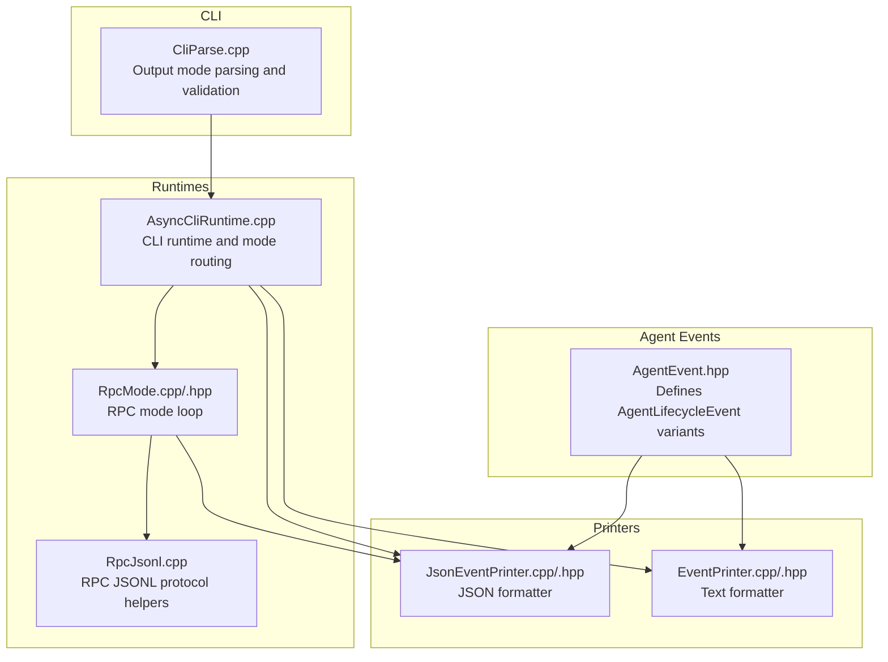
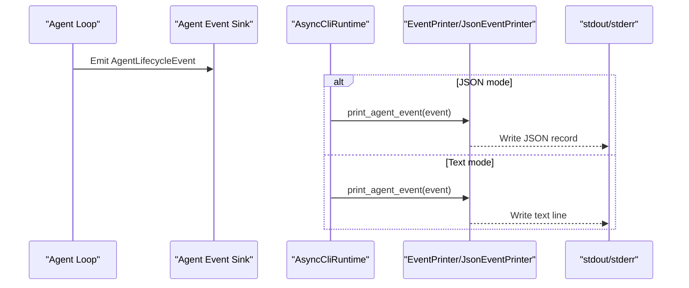
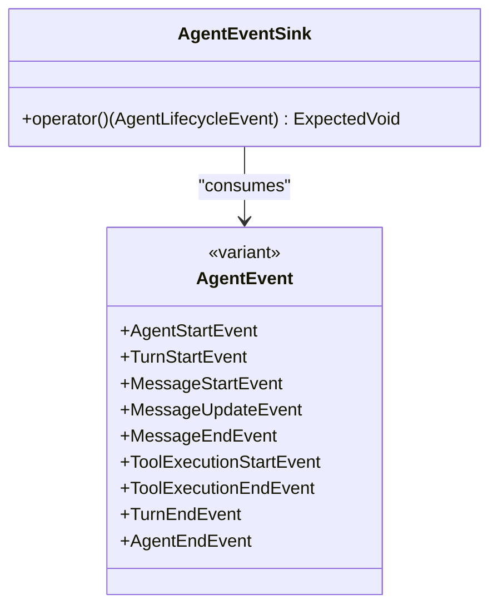
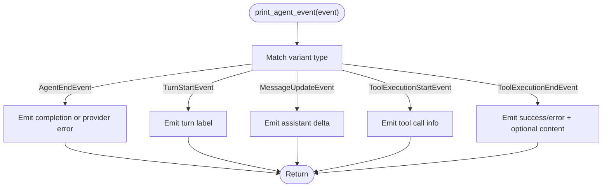
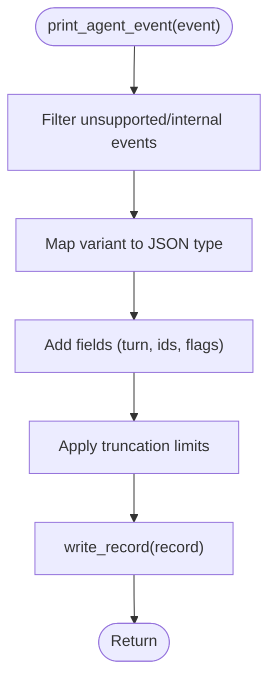
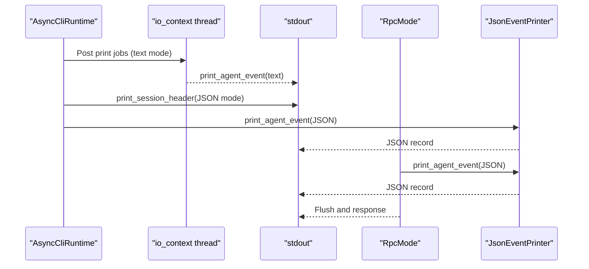
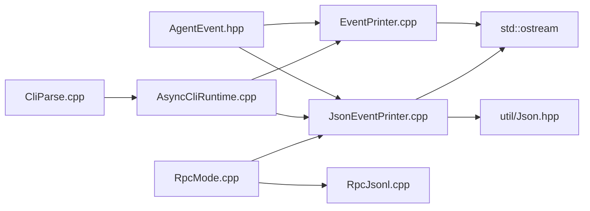

# Event Printing System

<cite>
**Referenced Files in This Document**
- [EventPrinter.hpp](file://src/coding_agent/runtime/EventPrinter.hpp)
- [EventPrinter.cpp](file://src/coding_agent/runtime/EventPrinter.cpp)
- [JsonEventPrinter.hpp](file://src/coding_agent/runtime/JsonEventPrinter.hpp)
- [JsonEventPrinter.cpp](file://src/coding_agent/runtime/JsonEventPrinter.cpp)
- [AgentEvent.hpp](file://include/cch/agent/AgentEvent.hpp)
- [AsyncCliRuntime.cpp](file://src/coding_agent/runtime/AsyncCliRuntime.cpp)
- [RpcMode.hpp](file://src/coding_agent/runtime/RpcMode.hpp)
- [RpcMode.cpp](file://src/coding_agent/runtime/RpcMode.cpp)
- [RpcJsonl.cpp](file://src/coding_agent/runtime/RpcJsonl.cpp)
- [CliParse.cpp](file://src/cli/CliParse.cpp)
- [OutputLimiter.hpp](file://src/util/OutputLimiter.hpp)
</cite>

## Table of Contents
1. [Introduction](#introduction)
2. [Project Structure](#project-structure)
3. [Core Components](#core-components)
4. [Architecture Overview](#architecture-overview)
5. [Detailed Component Analysis](#detailed-component-analysis)
6. [Dependency Analysis](#dependency-analysis)
7. [Performance Considerations](#performance-considerations)
8. [Troubleshooting Guide](#troubleshooting-guide)
9. [Conclusion](#conclusion)
10. [Appendices](#appendices)

## Introduction
This document explains the event printing system responsible for formatting and emitting agent lifecycle events. It covers how two printers—human-readable text and structured JSON—transform agent events into distinct output formats. It also documents the event emission pipeline, filtering and transformation rules, streaming and real-time delivery, and how output modes influence runtime behavior. Practical configuration examples, customization guidance, and integration tips for external systems are included, along with performance and memory considerations for high-volume and long-running sessions.

## Project Structure
The event printing system spans several runtime modules and shared event definitions:
- Event model: agent lifecycle event types and variant
- Text printer: human-readable console output
- JSON printer: structured, machine-processable records
- Runtime modes: CLI text/json/rpc modes and RPC protocol handling
- CLI parsing: output mode selection and constraints

**Diagram sources**
- [AgentEvent.hpp:1-111](file://include/cch/agent/AgentEvent.hpp#L1-L111)
- [EventPrinter.cpp:1-32](file://src/coding_agent/runtime/EventPrinter.cpp#L1-L32)
- [JsonEventPrinter.cpp:1-155](file://src/coding_agent/runtime/JsonEventPrinter.cpp#L1-L155)
- [AsyncCliRuntime.cpp:1-228](file://src/coding_agent/runtime/AsyncCliRuntime.cpp#L1-L228)
- [RpcMode.cpp:1-209](file://src/coding_agent/runtime/RpcMode.cpp#L1-L209)
- [RpcJsonl.cpp:1-91](file://src/coding_agent/runtime/RpcJsonl.cpp#L1-L91)
- [CliParse.cpp:1-179](file://src/cli/CliParse.cpp#L1-L179)

**Section sources**
- [AgentEvent.hpp:1-111](file://include/cch/agent/AgentEvent.hpp#L1-L111)
- [EventPrinter.hpp:1-12](file://src/coding_agent/runtime/EventPrinter.hpp#L1-L12)
- [JsonEventPrinter.hpp:1-29](file://src/coding_agent/runtime/JsonEventPrinter.hpp#L1-L29)
- [AsyncCliRuntime.cpp:1-228](file://src/coding_agent/runtime/AsyncCliRuntime.cpp#L1-L228)
- [RpcMode.hpp:1-24](file://src/coding_agent/runtime/RpcMode.hpp#L1-L24)
- [RpcMode.cpp:1-209](file://src/coding_agent/runtime/RpcMode.cpp#L1-L209)
- [RpcJsonl.cpp:1-91](file://src/coding_agent/runtime/RpcJsonl.cpp#L1-L91)
- [CliParse.cpp:1-179](file://src/cli/CliParse.cpp#L1-L179)

## Core Components
- Agent lifecycle event model: defines all event types emitted during agent execution, including turns, messages, tool calls, and completion/end signals.
- Text printer: converts events into concise, human-readable lines for console output.
- JSON printer: serializes events into newline-delimited JSON records with schema versioning, sequencing, and safety limits.
- Runtime mode orchestration: routes events to the appropriate printer based on selected output mode and manages streaming and real-time delivery.

Key responsibilities:
- EventPrinter: formats events for console readability.
- JsonEventPrinter: filters, transforms, and writes structured JSON records with truncation and diagnostic safeguards.
- AsyncCliRuntime: selects output mode, initializes printers, and streams events to stdout/stderr.
- RpcMode: runs an RPC loop that parses JSONL commands, executes prompts, and emits events via JsonEventPrinter.

**Section sources**
- [AgentEvent.hpp:91-106](file://include/cch/agent/AgentEvent.hpp#L91-L106)
- [EventPrinter.cpp:8-29](file://src/coding_agent/runtime/EventPrinter.cpp#L8-L29)
- [JsonEventPrinter.cpp:53-68](file://src/coding_agent/runtime/JsonEventPrinter.cpp#L53-L68)
- [AsyncCliRuntime.cpp:41-225](file://src/coding_agent/runtime/AsyncCliRuntime.cpp#L41-L225)
- [RpcMode.cpp:79-206](file://src/coding_agent/runtime/RpcMode.cpp#L79-L206)

## Architecture Overview
The system routes agent events through a sink to either a text or JSON printer depending on the runtime mode. In RPC mode, the loop reads JSONL commands from stdin, executes prompts, and streams events to stdout. In CLI text mode, events are posted to a background io_context and printed synchronously to stdout. In CLI JSON mode, events are written immediately to stdout with a session header and terminal record.

**Diagram sources**
- [AsyncCliRuntime.cpp:144-164](file://src/coding_agent/runtime/AsyncCliRuntime.cpp#L144-L164)
- [EventPrinter.cpp:8-29](file://src/coding_agent/runtime/EventPrinter.cpp#L8-L29)
- [JsonEventPrinter.cpp:80-139](file://src/coding_agent/runtime/JsonEventPrinter.cpp#L80-L139)

## Detailed Component Analysis

### Event Model and Emission Pipeline
Agent events are modeled as a variant covering lifecycle stages:
- Lifecycle: start, turn start/end, message start/update/end, tool execution start/end, thinking/streaming updates, and end/completion.
- The event sink signature accepts a move-only function that returns an expected void, enabling non-blocking emission.

**Diagram sources**
- [AgentEvent.hpp:12-106](file://include/cch/agent/AgentEvent.hpp#L12-L106)

**Section sources**
- [AgentEvent.hpp:12-106](file://include/cch/agent/AgentEvent.hpp#L12-L106)

### Text Event Printer
The text printer formats events into short, labeled lines for console readability:
- Turn starts, message updates, tool execution start/end, and completion/error outcomes are supported.
- Error outcomes include embedded content when present.
- Completion reasons are normalized for known failure modes.

**Diagram sources**
- [EventPrinter.cpp:8-29](file://src/coding_agent/runtime/EventPrinter.cpp#L8-L29)

**Section sources**
- [EventPrinter.cpp:8-29](file://src/coding_agent/runtime/EventPrinter.cpp#L8-L29)

### JSON Event Printer
The JSON printer transforms events into newline-delimited records with:
- Schema versioning and monotonically increasing sequence numbers.
- Filtering: certain internal or unsupported events are omitted.
- Truncation: text deltas and diagnostics are truncated to configured byte limits.
- Structured fields: assistant message events, tool call metadata, stop reasons, and content status indicators.
- Terminal record: a runtime terminal event indicates completion or failure.

**Diagram sources**
- [JsonEventPrinter.cpp:80-139](file://src/coding_agent/runtime/JsonEventPrinter.cpp#L80-L139)
- [JsonEventPrinter.cpp:57-68](file://src/coding_agent/runtime/JsonEventPrinter.cpp#L57-L68)
- [JsonEventPrinter.cpp:27-37](file://src/coding_agent/runtime/JsonEventPrinter.cpp#L27-L37)

**Section sources**
- [JsonEventPrinter.cpp:13-51](file://src/coding_agent/runtime/JsonEventPrinter.cpp#L13-L51)
- [JsonEventPrinter.cpp:53-68](file://src/coding_agent/runtime/JsonEventPrinter.cpp#L53-L68)
- [JsonEventPrinter.cpp:80-139](file://src/coding_agent/runtime/JsonEventPrinter.cpp#L80-L139)
- [JsonEventPrinter.cpp:141-152](file://src/coding_agent/runtime/JsonEventPrinter.cpp#L141-L152)

### Runtime Modes and Streaming Delivery
- CLI text mode: events are posted to a background io_context and printed synchronously to stdout. A dedicated thread runs the io_context to ensure real-time delivery.
- CLI JSON mode: events are written immediately to stdout with a session header and terminal record upon completion.
- RPC mode: the loop reads JSONL commands from stdin, validates envelopes, responds with success/error, and executes prompts. Events are emitted via JsonEventPrinter and flushed to stdout.

**Diagram sources**
- [AsyncCliRuntime.cpp:134-205](file://src/coding_agent/runtime/AsyncCliRuntime.cpp#L134-L205)
- [RpcMode.cpp:171-194](file://src/coding_agent/runtime/RpcMode.cpp#L171-L194)
- [RpcJsonl.cpp:49-62](file://src/coding_agent/runtime/RpcJsonl.cpp#L49-L62)

**Section sources**
- [AsyncCliRuntime.cpp:41-225](file://src/coding_agent/runtime/AsyncCliRuntime.cpp#L41-L225)
- [RpcMode.cpp:79-206](file://src/coding_agent/runtime/RpcMode.cpp#L79-L206)
- [RpcJsonl.cpp:13-91](file://src/coding_agent/runtime/RpcJsonl.cpp#L13-L91)

### Event Filtering and Transformation
- Filtering: certain internal events (thinking updates, queued message markers, and tool call streaming fragments) are intentionally omitted in JSON mode to keep records minimal and stable.
- Transformation: message deltas are truncated to a maximum byte size; diagnostics are similarly bounded; assistant message events include a status and omission reason when content is omitted.
- Sequencing and schema: each record carries a schema version and sequence number for traceability.

**Section sources**
- [JsonEventPrinter.cpp:84-91](file://src/coding_agent/runtime/JsonEventPrinter.cpp#L84-L91)
- [JsonEventPrinter.cpp:104-114](file://src/coding_agent/runtime/JsonEventPrinter.cpp#L104-L114)
- [JsonEventPrinter.cpp:147-150](file://src/coding_agent/runtime/JsonEventPrinter.cpp#L147-L150)
- [JsonEventPrinter.cpp:22-25](file://src/coding_agent/runtime/JsonEventPrinter.cpp#L22-L25)

### Output Formatting Details
- Text mode: concise, labeled lines for turns, assistant deltas, tool calls, and completion/error outcomes.
- JSON mode: structured records with standardized types, fields, and truncation metadata. A session header precedes events; a terminal record indicates runtime outcome.

**Section sources**
- [EventPrinter.cpp:8-29](file://src/coding_agent/runtime/EventPrinter.cpp#L8-L29)
- [JsonEventPrinter.cpp:70-78](file://src/coding_agent/runtime/JsonEventPrinter.cpp#L70-L78)
- [JsonEventPrinter.cpp:141-152](file://src/coding_agent/runtime/JsonEventPrinter.cpp#L141-L152)

### Relationship Between Event Printing and Runtime Modes
- Output mode selection is parsed from CLI arguments and validated against constraints (e.g., JSON and RPC modes disallow REPL).
- CLI runtime routes events to the chosen printer and ensures proper flushing and error reporting.
- RPC mode enforces strict JSONL command envelopes and responds to each command with a structured response.

**Section sources**
- [CliParse.cpp:49-60](file://src/cli/CliParse.cpp#L49-L60)
- [CliParse.cpp:163-175](file://src/cli/CliParse.cpp#L163-L175)
- [AsyncCliRuntime.cpp:41-132](file://src/coding_agent/runtime/AsyncCliRuntime.cpp#L41-L132)
- [RpcMode.cpp:118-126](file://src/coding_agent/runtime/RpcMode.cpp#L118-L126)

## Dependency Analysis
The event printing system depends on:
- Agent event model for event types and variant
- JSON utilities for serialization and bounded output
- CLI runtime for mode selection and event routing
- RPC JSONL helpers for command parsing and response formatting

**Diagram sources**
- [AgentEvent.hpp:1-111](file://include/cch/agent/AgentEvent.hpp#L1-L111)
- [EventPrinter.cpp:1-32](file://src/coding_agent/runtime/EventPrinter.cpp#L1-L32)
- [JsonEventPrinter.cpp:1-11](file://src/coding_agent/runtime/JsonEventPrinter.cpp#L1-L11)
- [AsyncCliRuntime.cpp:1-228](file://src/coding_agent/runtime/AsyncCliRuntime.cpp#L1-L228)
- [RpcMode.cpp:1-209](file://src/coding_agent/runtime/RpcMode.cpp#L1-L209)
- [RpcJsonl.cpp:1-91](file://src/coding_agent/runtime/RpcJsonl.cpp#L1-L91)
- [CliParse.cpp:1-179](file://src/cli/CliParse.cpp#L1-L179)

**Section sources**
- [JsonEventPrinter.cpp:1-11](file://src/coding_agent/runtime/JsonEventPrinter.cpp#L1-L11)
- [AsyncCliRuntime.cpp:1-228](file://src/coding_agent/runtime/AsyncCliRuntime.cpp#L1-L228)
- [RpcMode.cpp:1-209](file://src/coding_agent/runtime/RpcMode.cpp#L1-L209)
- [RpcJsonl.cpp:1-91](file://src/coding_agent/runtime/RpcJsonl.cpp#L1-L91)
- [CliParse.cpp:1-179](file://src/cli/CliParse.cpp#L1-L179)

## Performance Considerations
- Throughput and latency:
  - JSON mode writes newline-delimited records and flushes after each record; ensure consumers can process the stream efficiently.
  - Text mode posts to an io_context thread to avoid blocking the agent loop; tune thread scheduling for responsiveness.
- Memory management:
  - JSON printer applies byte limits to text deltas and diagnostics to cap memory growth during long sessions.
  - Output limiter utilities provide a general pattern for capping output size and line counts when integrating with external systems.
- Backpressure and flow control:
  - In RPC mode, responses are flushed immediately; ensure downstream consumers can keep up to prevent buffer buildup.
  - Consider batching or throttling for extremely high-frequency events if needed.

Practical tips:
- Prefer JSON mode for machine ingestion and replay; use text mode for interactive debugging.
- Monitor stdout buffering and consider explicit flushes when integrating with external systems.
- Apply truncation thresholds consistently across integrations to maintain bounded memory usage.

**Section sources**
- [JsonEventPrinter.cpp:15-16](file://src/coding_agent/runtime/JsonEventPrinter.cpp#L15-L16)
- [JsonEventPrinter.cpp:27-37](file://src/coding_agent/runtime/JsonEventPrinter.cpp#L27-L37)
- [OutputLimiter.hpp:19-48](file://src/util/OutputLimiter.hpp#L19-L48)
- [AsyncCliRuntime.cpp:134-169](file://src/coding_agent/runtime/AsyncCliRuntime.cpp#L134-L169)
- [RpcMode.cpp:49-62](file://src/coding_agent/runtime/RpcMode.cpp#L49-L62)

## Troubleshooting Guide
Common issues and resolutions:
- Output mode constraints:
  - JSON and RPC modes cannot be combined with REPL; CLI parser enforces these rules.
  - RPC mode requires reading prompts from stdin; positional prompts are not allowed.
- Event printing failures:
  - Text printer catches exceptions and reports errors to stderr; verify io_context thread health.
  - JSON printer returns errors for serialization or stream failures; check stdout availability and permissions.
- RPC command validation:
  - Envelope validation rejects malformed commands; ensure id/type fields are present and strings.
  - Responses include bounded error messages to prevent oversized logs.

Operational checks:
- Verify selected output mode matches intended integration target.
- Confirm session header is emitted before events in JSON mode.
- Ensure terminal record appears after successful or failed prompts in JSON mode.

**Section sources**
- [CliParse.cpp:163-175](file://src/cli/CliParse.cpp#L163-L175)
- [AsyncCliRuntime.cpp:151-162](file://src/coding_agent/runtime/AsyncCliRuntime.cpp#L151-L162)
- [JsonEventPrinter.cpp:59-67](file://src/coding_agent/runtime/JsonEventPrinter.cpp#L59-L67)
- [RpcMode.cpp:68-71](file://src/coding_agent/runtime/RpcMode.cpp#L68-L71)
- [RpcJsonl.cpp:60-73](file://src/coding_agent/runtime/RpcJsonl.cpp#L60-L73)

## Conclusion
The event printing system provides a robust, extensible mechanism for transforming agent lifecycle events into human-readable or machine-processable formats. By separating concerns between text and JSON printers, and by integrating cleanly with CLI and RPC runtimes, it supports diverse operational needs—from interactive debugging to automated monitoring and replay. Carefully applied filtering, truncation, and streaming ensure reliable performance under varied workloads.

## Appendices

### Practical Examples and Configuration
- Selecting output mode:
  - Use CLI flag to choose text, json, or rpc output modes; the parser validates constraints.
- Emitting a session header (JSON mode):
  - Initialize JsonEventPrinter and emit a session header before streaming events.
- Streaming events in RPC mode:
  - Read JSONL commands from stdin, validate envelopes, execute prompts, and emit events via JsonEventPrinter; flush responses promptly.
- Integrating with external systems:
  - Consume newline-delimited JSON records; apply truncation and size limits consistent with built-in thresholds.
  - For high-volume streams, consider buffering or consumer-side batching to manage throughput.

**Section sources**
- [CliParse.cpp:107-108](file://src/cli/CliParse.cpp#L107-L108)
- [AsyncCliRuntime.cpp:88-95](file://src/coding_agent/runtime/AsyncCliRuntime.cpp#L88-L95)
- [RpcMode.cpp:171-194](file://src/coding_agent/runtime/RpcMode.cpp#L171-L194)
- [JsonEventPrinter.cpp:70-78](file://src/coding_agent/runtime/JsonEventPrinter.cpp#L70-L78)