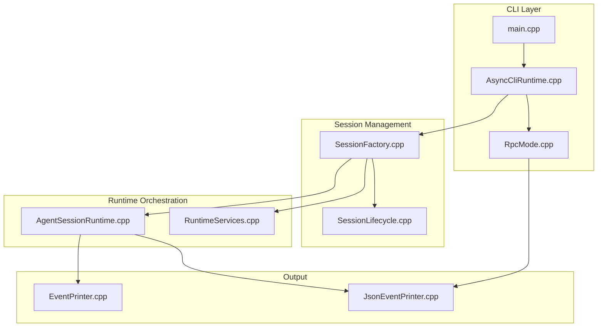
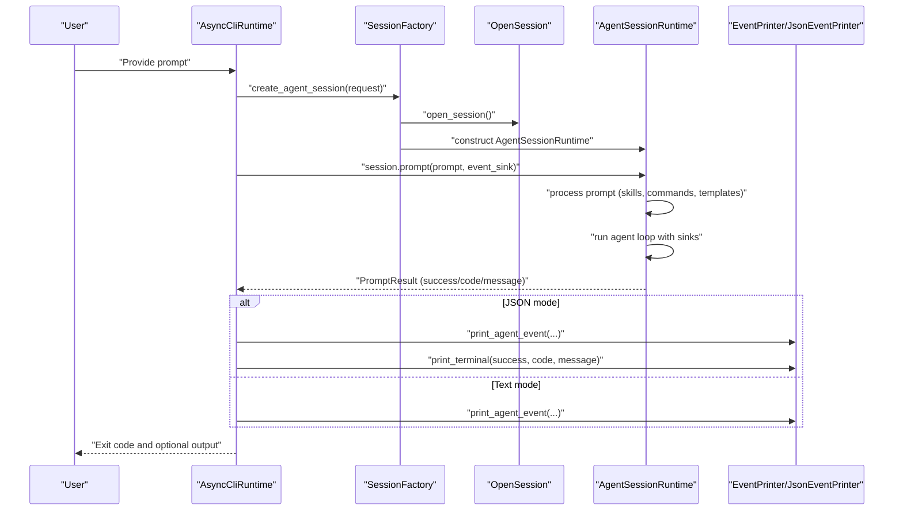
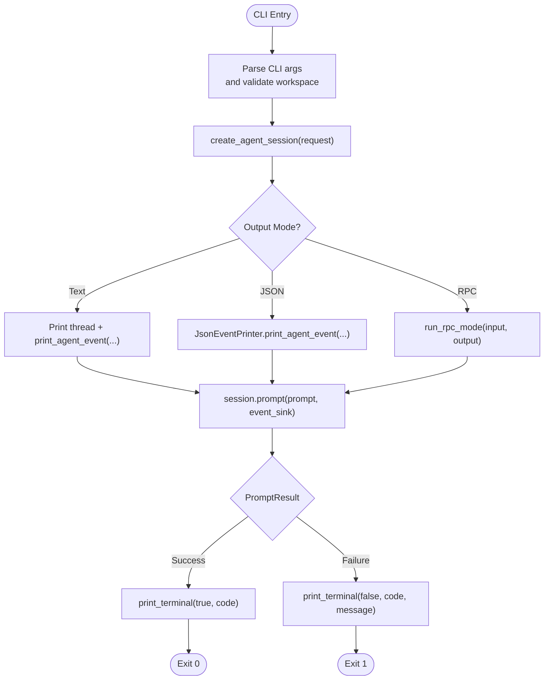
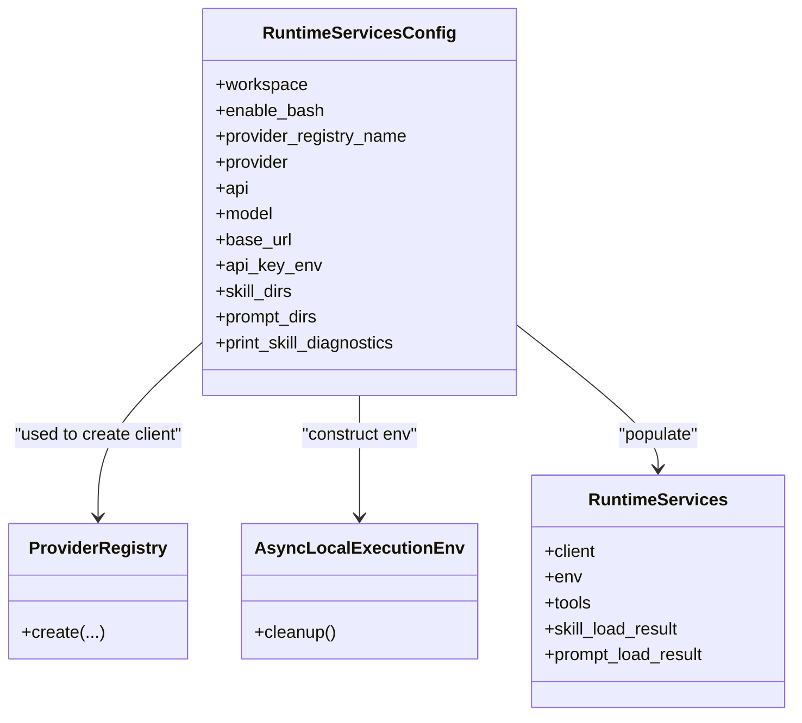
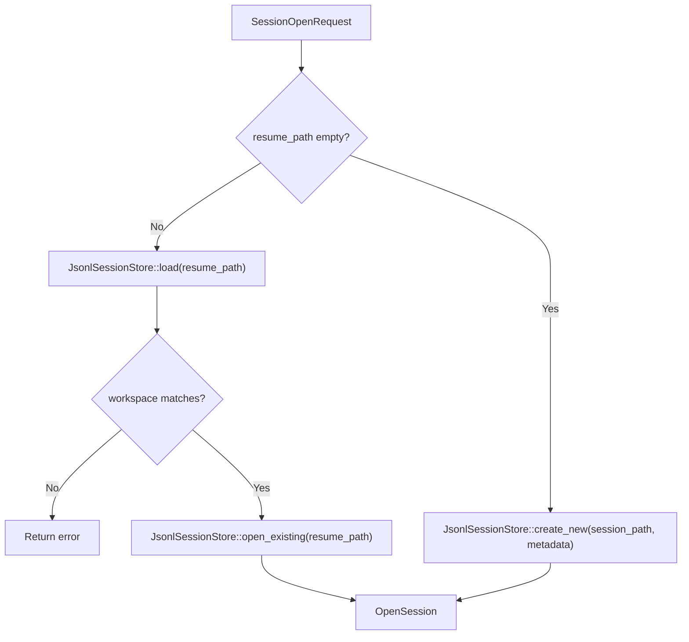
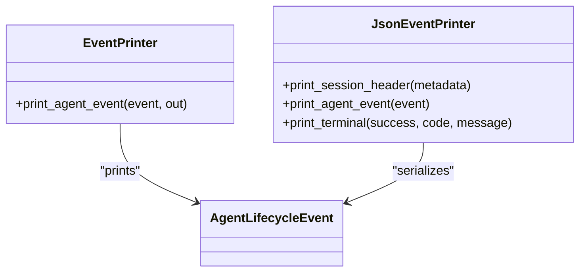
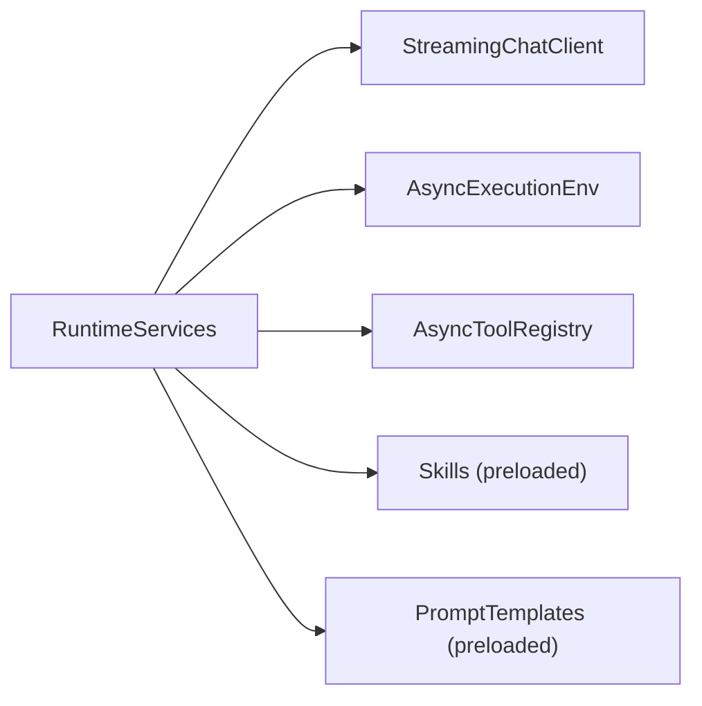
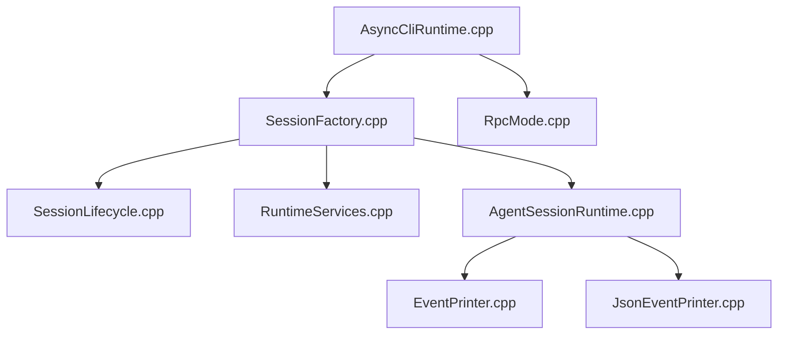

# Runtime Orchestration

<cite>
**Referenced Files in This Document**
- [main.cpp](file://src/main.cpp)
- [AsyncCliRuntime.cpp](file://src/coding_agent/runtime/AsyncCliRuntime.cpp)
- [AsyncCliRuntime.hpp](file://src/coding_agent/runtime/AsyncCliRuntime.hpp)
- [SessionFactory.cpp](file://src/coding_agent/runtime/SessionFactory.cpp)
- [SessionFactory.hpp](file://src/coding_agent/runtime/SessionFactory.hpp)
- [SessionLifecycle.cpp](file://src/coding_agent/runtime/SessionLifecycle.cpp)
- [SessionLifecycle.hpp](file://src/coding_agent/runtime/SessionLifecycle.hpp)
- [AgentSessionRuntime.cpp](file://src/coding_agent/runtime/AgentSessionRuntime.cpp)
- [AgentSessionRuntime.hpp](file://src/coding_agent/runtime/AgentSessionRuntime.hpp)
- [RuntimeServices.cpp](file://src/coding_agent/runtime/RuntimeServices.cpp)
- [RuntimeServices.hpp](file://src/coding_agent/runtime/RuntimeServices.hpp)
- [EventPrinter.cpp](file://src/coding_agent/runtime/EventPrinter.cpp)
- [EventPrinter.hpp](file://src/coding_agent/runtime/EventPrinter.hpp)
- [JsonEventPrinter.cpp](file://src/coding_agent/runtime/JsonEventPrinter.cpp)
- [JsonEventPrinter.hpp](file://src/coding_agent/runtime/JsonEventPrinter.hpp)
- [RpcMode.cpp](file://src/coding_agent/runtime/RpcMode.cpp)
- [RpcMode.hpp](file://src/coding_agent/runtime/RpcMode.hpp)
</cite>

## Table of Contents
1. [Introduction](#introduction)
2. [Project Structure](#project-structure)
3. [Core Components](#core-components)
4. [Architecture Overview](#architecture-overview)
5. [Detailed Component Analysis](#detailed-component-analysis)
6. [Dependency Analysis](#dependency-analysis)
7. [Performance Considerations](#performance-considerations)
8. [Troubleshooting Guide](#troubleshooting-guide)
9. [Conclusion](#conclusion)
10. [Appendices](#appendices)

## Introduction
This document explains the runtime orchestration of the coding agent system, focusing on how CLI and SDK contexts coordinate to manage sessions, assemble runtime services, and drive agent interactions. It covers:
- CLI runtime management and interaction modes (text, JSON, RPC)
- Service assembly pipeline for providers, tools, and execution environments
- Session lifecycle from creation to cleanup
- Event printing system and output formats
- Runtime services architecture and coordination
- Differences between CLI and SDK contexts and how orchestration principles apply universally
- Error handling and recovery strategies

## Project Structure
The runtime orchestration spans several modules:
- CLI entrypoint and adapters for interactive and RPC modes
- Session factory and lifecycle management
- Agent session runtime orchestrating prompt processing, agent loops, and persistence
- Event printers for text, JSON, and RPC JSONL
- Runtime services assembly for AI clients, tools, and execution environments



**Diagram sources**
- [main.cpp:1-33](file://src/main.cpp#L1-L33)
- [AsyncCliRuntime.cpp:1-228](file://src/coding_agent/runtime/AsyncCliRuntime.cpp#L1-L228)
- [RpcMode.cpp:1-209](file://src/coding_agent/runtime/RpcMode.cpp#L1-L209)
- [SessionFactory.cpp:1-809](file://src/coding_agent/runtime/SessionFactory.cpp#L1-L809)
- [SessionLifecycle.cpp:1-71](file://src/coding_agent/runtime/SessionLifecycle.cpp#L1-L71)
- [AgentSessionRuntime.cpp:1-278](file://src/coding_agent/runtime/AgentSessionRuntime.cpp#L1-L278)
- [RuntimeServices.cpp:1-127](file://src/coding_agent/runtime/RuntimeServices.cpp#L1-L127)
- [EventPrinter.cpp:1-32](file://src/coding_agent/runtime/EventPrinter.cpp#L1-L32)
- [JsonEventPrinter.cpp:1-155](file://src/coding_agent/runtime/JsonEventPrinter.cpp#L1-L155)

**Section sources**
- [main.cpp:1-33](file://src/main.cpp#L1-L33)
- [AsyncCliRuntime.cpp:1-228](file://src/coding_agent/runtime/AsyncCliRuntime.cpp#L1-L228)
- [RpcMode.cpp:1-209](file://src/coding_agent/runtime/RpcMode.cpp#L1-L209)
- [SessionFactory.cpp:1-809](file://src/coding_agent/runtime/SessionFactory.cpp#L1-L809)
- [SessionLifecycle.cpp:1-71](file://src/coding_agent/runtime/SessionLifecycle.cpp#L1-L71)
- [AgentSessionRuntime.cpp:1-278](file://src/coding_agent/runtime/AgentSessionRuntime.cpp#L1-L278)
- [RuntimeServices.cpp:1-127](file://src/coding_agent/runtime/RuntimeServices.cpp#L1-L127)
- [EventPrinter.cpp:1-32](file://src/coding_agent/runtime/EventPrinter.cpp#L1-L32)
- [JsonEventPrinter.cpp:1-155](file://src/coding_agent/runtime/JsonEventPrinter.cpp#L1-L155)

## Core Components
- CLI runtime adapter: parses CLI args, resolves configuration, creates sessions, and runs prompts in text, JSON, or RPC modes.
- Session factory: resolves provider settings, opens/creates sessions, loads project resources, builds runtime services, and constructs the agent runtime.
- Session lifecycle: opens or resumes sessions, validates workspaces, and manages session metadata.
- Agent session runtime: orchestrates prompt processing, command/template handling, agent loop execution, persistence, and event fanout.
- Runtime services: assembles AI client, execution environment, tool registry, and preloaded skills/templates.
- Event printers: render agent lifecycle events to stdout (text) or structured JSON records (JSON and RPC).

**Section sources**
- [AsyncCliRuntime.cpp:41-225](file://src/coding_agent/runtime/AsyncCliRuntime.cpp#L41-L225)
- [SessionFactory.cpp:274-423](file://src/coding_agent/runtime/SessionFactory.cpp#L274-L423)
- [SessionLifecycle.cpp:22-68](file://src/coding_agent/runtime/SessionLifecycle.cpp#L22-L68)
- [AgentSessionRuntime.cpp:47-162](file://src/coding_agent/runtime/AgentSessionRuntime.cpp#L47-L162)
- [RuntimeServices.cpp:15-124](file://src/coding_agent/runtime/RuntimeServices.cpp#L15-L124)
- [EventPrinter.cpp:8-29](file://src/coding_agent/runtime/EventPrinter.cpp#L8-L29)
- [JsonEventPrinter.cpp:53-152](file://src/coding_agent/runtime/JsonEventPrinter.cpp#L53-L152)

## Architecture Overview
The runtime architecture coordinates three primary paths:
- CLI interactive mode: prints human-readable events and returns exit codes.
- CLI JSON mode: emits structured JSON events and a terminal record.
- CLI RPC mode: reads JSONL commands from stdin and writes JSONL responses to stdout.



**Diagram sources**
- [AsyncCliRuntime.cpp:41-225](file://src/coding_agent/runtime/AsyncCliRuntime.cpp#L41-L225)
- [SessionFactory.cpp:274-423](file://src/coding_agent/runtime/SessionFactory.cpp#L274-L423)
- [AgentSessionRuntime.cpp:93-162](file://src/coding_agent/runtime/AgentSessionRuntime.cpp#L93-L162)
- [EventPrinter.cpp:8-29](file://src/coding_agent/runtime/EventPrinter.cpp#L8-L29)
- [JsonEventPrinter.cpp:80-152](file://src/coding_agent/runtime/JsonEventPrinter.cpp#L80-L152)

## Detailed Component Analysis

### CLI Runtime Management and Interaction Modes
The CLI runtime adapts to three output modes:
- Text mode: prints human-readable agent lifecycle events and final outcomes.
- JSON mode: prints structured JSON records for each event and a terminal record.
- RPC mode: consumes JSONL requests from stdin and produces JSONL responses to stdout.

Key behaviors:
- Loads default configuration and registers built-in commands.
- Creates or resumes sessions and prints diagnostics.
- Spawns a dedicated print thread for non-JSON modes to avoid blocking the prompt loop.
- Supports REPL mode for continuous interaction until shutdown or exit commands.



**Diagram sources**
- [AsyncCliRuntime.cpp:41-225](file://src/coding_agent/runtime/AsyncCliRuntime.cpp#L41-L225)
- [RpcMode.cpp:79-206](file://src/coding_agent/runtime/RpcMode.cpp#L79-L206)
- [JsonEventPrinter.cpp:141-152](file://src/coding_agent/runtime/JsonEventPrinter.cpp#L141-L152)

**Section sources**
- [AsyncCliRuntime.cpp:41-225](file://src/coding_agent/runtime/AsyncCliRuntime.cpp#L41-L225)
- [RpcMode.cpp:79-206](file://src/coding_agent/runtime/RpcMode.cpp#L79-L206)
- [EventPrinter.cpp:8-29](file://src/coding_agent/runtime/EventPrinter.cpp#L8-L29)
- [JsonEventPrinter.cpp:80-152](file://src/coding_agent/runtime/JsonEventPrinter.cpp#L80-L152)

### Service Assembly Process
The runtime services assembly builds:
- AI streaming chat client from provider registry and configuration
- Async execution environment (local shell, file IO)
- Tool registry with async file read/write/edit and optional bash
- Preloaded skills and prompt templates from workspace

Assembly steps:
- Resolve provider settings and construct a StreamingChatClient
- Initialize AsyncExecutionEnv with workspace and API key environment variables
- Register async tools into AsyncToolRegistry
- Optionally load skills and templates from configured directories
- Package into RuntimeServices for downstream use



**Diagram sources**
- [RuntimeServices.hpp:16-43](file://src/coding_agent/runtime/RuntimeServices.hpp#L16-L43)
- [RuntimeServices.cpp:15-124](file://src/coding_agent/runtime/RuntimeServices.cpp#L15-L124)

**Section sources**
- [RuntimeServices.cpp:15-124](file://src/coding_agent/runtime/RuntimeServices.cpp#L15-L124)
- [RuntimeServices.hpp:16-43](file://src/coding_agent/runtime/RuntimeServices.hpp#L16-L43)

### Session Lifecycle Management
Session lifecycle handles:
- Opening an existing session (resume) or creating a new one
- Validating workspace compatibility when resuming
- Preserving stored provider/model metadata for later client reconstruction
- Managing session metadata and message history



**Diagram sources**
- [SessionLifecycle.cpp:22-68](file://src/coding_agent/runtime/SessionLifecycle.cpp#L22-L68)
- [SessionLifecycle.hpp:14-35](file://src/coding_agent/runtime/SessionLifecycle.hpp#L14-L35)

**Section sources**
- [SessionLifecycle.cpp:22-68](file://src/coding_agent/runtime/SessionLifecycle.cpp#L22-L68)
- [SessionLifecycle.hpp:14-35](file://src/coding_agent/runtime/SessionLifecycle.hpp#L14-L35)

### Agent Session Runtime Orchestration
The AgentSessionRuntime orchestrates:
- Prompt run lifecycle: skill expansion, command/template processing, agent loop, persistence, and event fanout
- Combined event sink composition for subscribers and per-prompt sinks
- Subscription management for agent lifecycle events
- Cleanup of execution environment on close

```mermaid
sequenceDiagram
participant Runtime as "AgentSessionRuntime"
participant Skills as "SkillExpander"
participant Processor as "PromptProcessor"
participant Loop as "AsyncAgentLoop"
participant Store as "JsonlSessionStore"
Runtime->>Skills : "expand(prompt)"
alt changed
Runtime->>Runtime : "use expanded prompt"
else unchanged
Runtime->>Processor : "process_prompt(prompt, templates, commands)"
end
Runtime->>Loop : "continue_with(history, prompt, combined_sink)"
Loop-->>Runtime : "AsyncAgentRunResult"
Runtime->>Store : "append(new entries)"
Runtime-->>Runtime : "update history"
```

**Diagram sources**
- [AgentSessionRuntime.cpp:93-199](file://src/coding_agent/runtime/AgentSessionRuntime.cpp#L93-L199)
- [AgentSessionRuntime.hpp:37-110](file://src/coding_agent/runtime/AgentSessionRuntime.hpp#L37-L110)

**Section sources**
- [AgentSessionRuntime.cpp:93-199](file://src/coding_agent/runtime/AgentSessionRuntime.cpp#L93-L199)
- [AgentSessionRuntime.hpp:37-110](file://src/coding_agent/runtime/AgentSessionRuntime.hpp#L37-L110)

### Event Printing System
Two printers serve different output formats:
- Text printer: human-readable event labels and deltas
- JSON printer: structured records with schema version, sequence number, and truncation metadata



**Diagram sources**
- [EventPrinter.hpp:9](file://src/coding_agent/runtime/EventPrinter.hpp#L9)
- [EventPrinter.cpp:8-29](file://src/coding_agent/runtime/EventPrinter.cpp#L8-L29)
- [JsonEventPrinter.hpp:12-26](file://src/coding_agent/runtime/JsonEventPrinter.hpp#L12-L26)
- [JsonEventPrinter.cpp:80-152](file://src/coding_agent/runtime/JsonEventPrinter.cpp#L80-L152)

**Section sources**
- [EventPrinter.cpp:8-29](file://src/coding_agent/runtime/EventPrinter.cpp#L8-L29)
- [JsonEventPrinter.cpp:80-152](file://src/coding_agent/runtime/JsonEventPrinter.cpp#L80-L152)

### Runtime Services Architecture and Coordination
The runtime services architecture coordinates:
- Providers: AI client selection and configuration
- Tools: async tool registry with file and shell capabilities
- Execution environments: local async environment for safe operations
- Skills/templates: preloaded assets for prompt enhancement



**Diagram sources**
- [RuntimeServices.hpp:33-41](file://src/coding_agent/runtime/RuntimeServices.hpp#L33-L41)
- [RuntimeServices.cpp:35-50](file://src/coding_agent/runtime/RuntimeServices.cpp#L35-L50)

**Section sources**
- [RuntimeServices.cpp:35-50](file://src/coding_agent/runtime/RuntimeServices.cpp#L35-L50)
- [RuntimeServices.hpp:33-41](file://src/coding_agent/runtime/RuntimeServices.hpp#L33-L41)

### Relationship Between Runtime Orchestration and the Agent System
The runtime relies on the agent subsystem:
- AsyncAgentLoop drives conversation turns and tool execution
- AgentEventSink receives lifecycle events for printing and fanout
- Transform_context augments provider requests with available skills

```mermaid
sequenceDiagram
participant Runtime as "AgentSessionRuntime"
participant Loop as "AsyncAgentLoop"
participant Sink as "AgentEventSink"
participant Env as "AsyncExecutionEnv"
Runtime->>Loop : "continue_with(history, prompt, sink)"
Loop->>Env : "execute tools"
Loop-->>Sink : "emit lifecycle events"
Sink-->>Runtime : "processed events"
```

**Diagram sources**
- [AgentSessionRuntime.cpp:164-199](file://src/coding_agent/runtime/AgentSessionRuntime.cpp#L164-L199)

**Section sources**
- [AgentSessionRuntime.cpp:164-199](file://src/coding_agent/runtime/AgentSessionRuntime.cpp#L164-L199)

### Error Handling and Recovery Strategies
- Validation errors: CLI argument validation and workspace checks fail early with clear messages.
- Session errors: resume workspace mismatch and unsupported session topology are reported with actionable guidance.
- Provider/client errors: provider creation failures propagate with detailed messages; fallbacks and overrides are logged as diagnostics.
- Persistence errors: session append failures return terminal codes and halt further processing.
- Event printing errors: failures are captured and surfaced as runtime errors to maintain robustness.

Practical examples:
- CLI error reporting for resume mismatches and session creation failures
- RPC mode error responses for malformed JSONL envelopes and unsupported commands
- Terminal event emission for runtime completion or failure

**Section sources**
- [AsyncCliRuntime.cpp:72-81](file://src/coding_agent/runtime/AsyncCliRuntime.cpp#L72-L81)
- [RpcMode.cpp:82-203](file://src/coding_agent/runtime/RpcMode.cpp#L82-L203)
- [AgentSessionRuntime.cpp:180-195](file://src/coding_agent/runtime/AgentSessionRuntime.cpp#L180-L195)

### Practical Examples
- CLI configuration: defaults loaded from config path, built-in commands registered, and session created with provider overrides and workspace.
- Service initialization: runtime services constructed with provider registry, execution environment, and async tools; skills/templates optionally preloaded.
- Event processing: per-prompt event sink composed with subscriber sinks; JSON or text printers invoked depending on mode.

**Section sources**
- [AsyncCliRuntime.cpp:41-225](file://src/coding_agent/runtime/AsyncCliRuntime.cpp#L41-L225)
- [RuntimeServices.cpp:15-124](file://src/coding_agent/runtime/RuntimeServices.cpp#L15-L124)
- [AgentSessionRuntime.cpp:201-223](file://src/coding_agent/runtime/AgentSessionRuntime.cpp#L201-L223)

### Differences Between CLI and SDK Contexts
- CLI context: entrypoint parses arguments, performs preflight checks, and runs prompts with immediate output.
- SDK context: public API adapts creation options into internal requests, constructs runtime services, and exposes a richer toolset and resource loading pipeline.
- Shared orchestration: both contexts converge on the same session factory, lifecycle, runtime services, and agent loop, ensuring consistent behavior across contexts.

**Section sources**
- [main.cpp:7-31](file://src/main.cpp#L7-L31)
- [SessionFactory.cpp:425-809](file://src/coding_agent/runtime/SessionFactory.cpp#L425-L809)
- [AsyncCliRuntime.cpp:41-225](file://src/coding_agent/runtime/AsyncCliRuntime.cpp#L41-L225)

## Dependency Analysis
The runtime orchestrates tightly coupled modules with clear boundaries:
- CLI depends on session factory and RPC mode
- Session factory depends on lifecycle, runtime services, and provider/tool registries
- Agent runtime depends on session store, agent loop, and event printers
- Event printers depend on agent lifecycle events and JSON utilities



**Diagram sources**
- [AsyncCliRuntime.cpp:1-228](file://src/coding_agent/runtime/AsyncCliRuntime.cpp#L1-L228)
- [RpcMode.cpp:1-209](file://src/coding_agent/runtime/RpcMode.cpp#L1-L209)
- [SessionFactory.cpp:1-809](file://src/coding_agent/runtime/SessionFactory.cpp#L1-L809)
- [SessionLifecycle.cpp:1-71](file://src/coding_agent/runtime/SessionLifecycle.cpp#L1-L71)
- [RuntimeServices.cpp:1-127](file://src/coding_agent/runtime/RuntimeServices.cpp#L1-L127)
- [AgentSessionRuntime.cpp:1-278](file://src/coding_agent/runtime/AgentSessionRuntime.cpp#L1-L278)
- [EventPrinter.cpp:1-32](file://src/coding_agent/runtime/EventPrinter.cpp#L1-L32)
- [JsonEventPrinter.cpp:1-155](file://src/coding_agent/runtime/JsonEventPrinter.cpp#L1-L155)

**Section sources**
- [AsyncCliRuntime.cpp:1-228](file://src/coding_agent/runtime/AsyncCliRuntime.cpp#L1-L228)
- [RpcMode.cpp:1-209](file://src/coding_agent/runtime/RpcMode.cpp#L1-L209)
- [SessionFactory.cpp:1-809](file://src/coding_agent/runtime/SessionFactory.cpp#L1-L809)
- [SessionLifecycle.cpp:1-71](file://src/coding_agent/runtime/SessionLifecycle.cpp#L1-L71)
- [RuntimeServices.cpp:1-127](file://src/coding_agent/runtime/RuntimeServices.cpp#L1-L127)
- [AgentSessionRuntime.cpp:1-278](file://src/coding_agent/runtime/AgentSessionRuntime.cpp#L1-L278)
- [EventPrinter.cpp:1-32](file://src/coding_agent/runtime/EventPrinter.cpp#L1-L32)
- [JsonEventPrinter.cpp:1-155](file://src/coding_agent/runtime/JsonEventPrinter.cpp#L1-L155)

## Performance Considerations
- Event printing offloading: in non-JSON modes, a dedicated print thread prevents blocking the prompt loop.
- JSON serialization limits: text and diagnostic truncation ensures bounded payload sizes for streaming scenarios.
- Asynchronous execution: agent loop and tool execution leverage async environments to minimize latency.
- Minimal allocations: combined sink composes pointers to avoid unnecessary copies during event fanout.

[No sources needed since this section provides general guidance]

## Troubleshooting Guide
Common issues and resolutions:
- Resume workspace mismatch: ensure workspace flag aligns with session metadata or omit workspace to auto-resolve.
- Unsupported session topology: SDK v1 requires linear sessions; branching or compaction metadata cannot be appended.
- Provider/client construction failures: supply provider_config or host chat_client when resuming sessions without stored metadata.
- Session persistence failures: verify write permissions and disk availability; terminal code indicates persistence errors.
- RPC JSONL parsing errors: ensure each line is a valid JSON object with required fields; invalid envelopes produce error responses.

**Section sources**
- [SessionLifecycle.cpp:32-38](file://src/coding_agent/runtime/SessionLifecycle.cpp#L32-L38)
- [RpcMode.cpp:118-126](file://src/coding_agent/runtime/RpcMode.cpp#L118-L126)
- [SessionFactory.cpp:514-520](file://src/coding_agent/runtime/SessionFactory.cpp#L514-L520)
- [AgentSessionRuntime.cpp:192-195](file://src/coding_agent/runtime/AgentSessionRuntime.cpp#L192-L195)

## Conclusion
The runtime orchestration integrates CLI and SDK contexts around a shared session factory, lifecycle manager, runtime services assembler, and agent runtime. It supports multiple interaction modes with robust error handling, structured event printing, and consistent provider/tool coordination. The same orchestration principles apply across CLI and SDK, enabling flexible deployment and reliable operation.

[No sources needed since this section summarizes without analyzing specific files]

## Appendices
- Example CLI invocation: see main entrypoint and async CLI runtime integration.
- Example SDK creation: see session factory’s public and internal creation paths.

**Section sources**
- [main.cpp:7-31](file://src/main.cpp#L7-L31)
- [AsyncCliRuntime.cpp:41-225](file://src/coding_agent/runtime/AsyncCliRuntime.cpp#L41-L225)
- [SessionFactory.cpp:274-423](file://src/coding_agent/runtime/SessionFactory.cpp#L274-L423)
- [SessionFactory.cpp:425-809](file://src/coding_agent/runtime/SessionFactory.cpp#L425-L809)