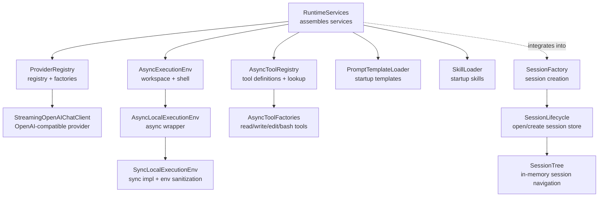
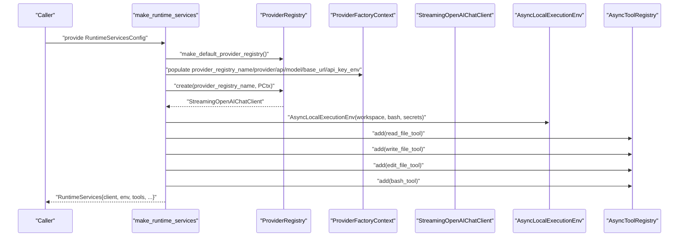
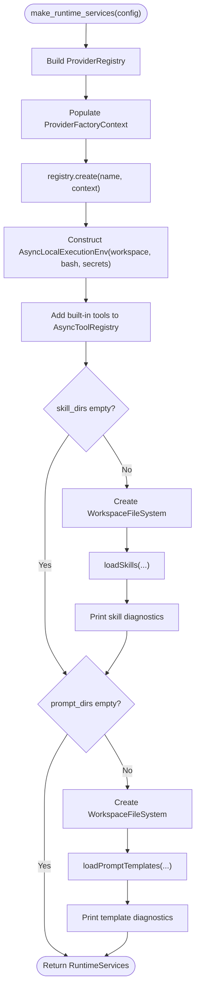
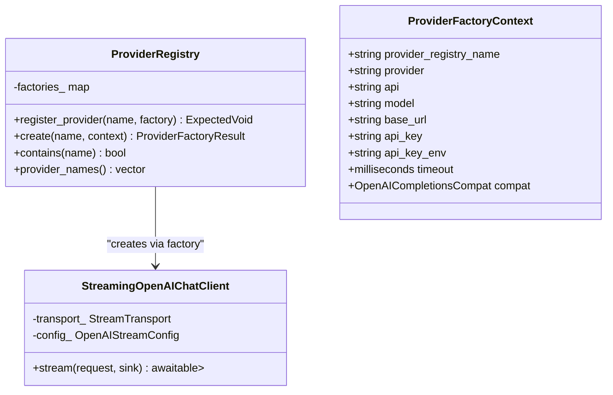
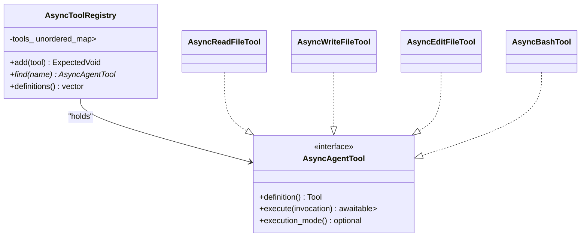
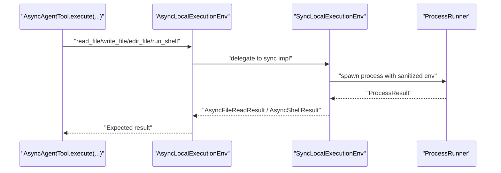
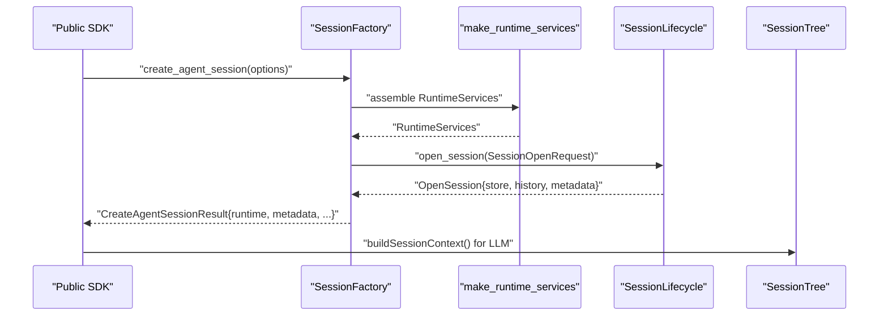
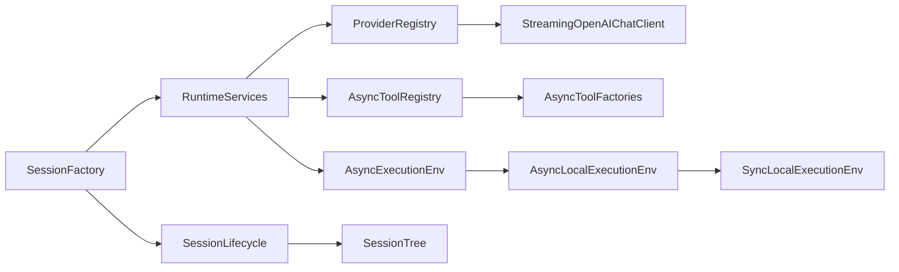

# Service Assembly

<cite>
**Referenced Files in This Document**
- [RuntimeServices.hpp](file://include/cch/coding_agent/runtime/RuntimeServices.hpp)
- [RuntimeServices.cpp](file://src/coding_agent/runtime/RuntimeServices.cpp)
- [ProviderRegistry.hpp](file://include/cch/ai/ProviderRegistry.hpp)
- [ProviderRegistry.cpp](file://src/ai/ProviderRegistry.cpp)
- [OpenAIChatClient.hpp](file://include/cch/ai/providers/OpenAIChatClient.hpp)
- [OpenAIChatClient.cpp](file://src/ai/providers/OpenAIChatClient.cpp)
- [ToolRegistry.hpp](file://include/cch/agent/ToolRegistry.hpp)
- [ToolFactories.hpp](file://include/cch/tools/ToolFactories.hpp)
- [AsyncToolFactories.cpp](file://src/tools/AsyncToolFactories.cpp)
- [LocalExecutionEnv.hpp](file://include/cch/harness/LocalExecutionEnv.hpp)
- [AsyncLocalExecutionEnv.cpp](file://src/harness/AsyncLocalExecutionEnv.cpp)
- [SyncLocalExecutionEnv.hpp](file://src/harness/SyncLocalExecutionEnv.hpp)
- [SyncLocalExecutionEnv.cpp](file://src/harness/SyncLocalExecutionEnv.cpp)
- [SessionFactory.hpp](file://src/coding_agent/runtime/SessionFactory.hpp)
- [SessionLifecycle.hpp](file://src/coding_agent/runtime/SessionLifecycle.hpp)
- [SessionLifecycle.cpp](file://src/coding_agent/runtime/SessionLifecycle.cpp)
- [SessionTree.hpp](file://include/cch/harness/session/SessionTree.hpp)
</cite>

## Table of Contents
1. [Introduction](#introduction)
2. [Project Structure](#project-structure)
3. [Core Components](#core-components)
4. [Architecture Overview](#architecture-overview)
5. [Detailed Component Analysis](#detailed-component-analysis)
6. [Dependency Analysis](#dependency-analysis)
7. [Performance Considerations](#performance-considerations)
8. [Troubleshooting Guide](#troubleshooting-guide)
9. [Conclusion](#conclusion)
10. [Appendices](#appendices)

## Introduction
This document explains how the runtime composes and wires services for agent sessions. It covers how RuntimeServices orchestrates AI provider selection, tool registry assembly, execution environment setup, and session management. It also documents the dependency injection pattern, provider resolution, tool registration, secure workspace operations, and the relationship between service assembly and the broader runtime architecture. Practical examples illustrate configuration, dependency resolution, and lifecycle management, along with guidance for integrating new components.

## Project Structure
The service assembly centers around a small set of runtime and harness components:
- Runtime services composition and configuration
- AI provider registry and clients
- Tool registry and tool factories
- Execution environment abstraction and local implementation
- Session lifecycle and storage

**Diagram sources**
- [RuntimeServices.cpp:15-124](file://src/coding_agent/runtime/RuntimeServices.cpp#L15-L124)
- [ProviderRegistry.cpp:47-83](file://src/ai/ProviderRegistry.cpp#L47-L83)
- [OpenAIChatClient.cpp:260-497](file://src/ai/providers/OpenAIChatClient.cpp#L260-L497)
- [AsyncLocalExecutionEnv.cpp:10-18](file://src/harness/AsyncLocalExecutionEnv.cpp#L10-L18)
- [SyncLocalExecutionEnv.cpp:81-90](file://src/harness/SyncLocalExecutionEnv.cpp#L81-L90)
- [AsyncToolFactories.cpp:404-418](file://src/tools/AsyncToolFactories.cpp#L404-L418)
- [SessionFactory.hpp:57-63](file://src/coding_agent/runtime/SessionFactory.hpp#L57-L63)
- [SessionLifecycle.cpp:22-68](file://src/coding_agent/runtime/SessionLifecycle.cpp#L22-L68)
- [SessionTree.hpp:34-145](file://include/cch/harness/session/SessionTree.hpp#L34-L145)

**Section sources**
- [RuntimeServices.hpp:14-46](file://include/cch/coding_agent/runtime/RuntimeServices.hpp#L14-L46)
- [RuntimeServices.cpp:15-124](file://src/coding_agent/runtime/RuntimeServices.cpp#L15-L124)
- [ProviderRegistry.hpp:18-56](file://include/cch/ai/ProviderRegistry.hpp#L18-L56)
- [ProviderRegistry.cpp:47-83](file://src/ai/ProviderRegistry.cpp#L47-L83)
- [ToolRegistry.hpp:13-48](file://include/cch/agent/ToolRegistry.hpp#L13-L48)
- [ToolFactories.hpp:10-15](file://include/cch/tools/ToolFactories.hpp#L10-L15)
- [AsyncToolFactories.cpp:404-418](file://src/tools/AsyncToolFactories.cpp#L404-L418)
- [LocalExecutionEnv.hpp:10-83](file://include/cch/harness/LocalExecutionEnv.hpp#L10-L83)
- [AsyncLocalExecutionEnv.cpp:10-18](file://src/harness/AsyncLocalExecutionEnv.cpp#L10-L18)
- [SyncLocalExecutionEnv.cpp:81-90](file://src/harness/SyncLocalExecutionEnv.cpp#L81-L90)
- [SessionFactory.hpp:57-63](file://src/coding_agent/runtime/SessionFactory.hpp#L57-L63)
- [SessionLifecycle.hpp:14-36](file://src/coding_agent/runtime/SessionLifecycle.hpp#L14-L36)
- [SessionLifecycle.cpp:22-68](file://src/coding_agent/runtime/SessionLifecycle.cpp#L22-L68)
- [SessionTree.hpp:34-145](file://include/cch/harness/session/SessionTree.hpp#L34-L145)

## Core Components
- RuntimeServices: Composes the chat client, async execution environment, tool registry, and loads skills/templates at startup. Exposes a factory function that returns a structured set of runtime services.
- ProviderRegistry: A registry of provider factories keyed by name. Provides create(...) to instantiate a StreamingChatClient from a ProviderFactoryContext.
- AsyncToolRegistry: A registry of AsyncAgentTool instances keyed by tool name. Supports adding tools and enumerating tool definitions.
- AsyncLocalExecutionEnv: An async facade delegating to SyncLocalExecutionEnv, exposing filesystem and shell operations with workspace containment and secret sanitization.
- SyncLocalExecutionEnv: Implements synchronous operations and process spawning with environment sanitization and workspace containment checks.
- SessionFactory and SessionLifecycle: Orchestrate session creation/opening, ensuring workspace consistency and storing provider/model metadata.
- SessionTree: In-memory indexing and navigation for session entries, enabling context reconstruction and branching.

**Section sources**
- [RuntimeServices.hpp:33-46](file://include/cch/coding_agent/runtime/RuntimeServices.hpp#L33-L46)
- [RuntimeServices.cpp:15-124](file://src/coding_agent/runtime/RuntimeServices.cpp#L15-L124)
- [ProviderRegistry.hpp:40-56](file://include/cch/ai/ProviderRegistry.hpp#L40-L56)
- [ProviderRegistry.cpp:12-83](file://src/ai/ProviderRegistry.cpp#L12-L83)
- [ToolRegistry.hpp:13-48](file://include/cch/agent/ToolRegistry.hpp#L13-L48)
- [LocalExecutionEnv.hpp:10-83](file://include/cch/harness/LocalExecutionEnv.hpp#L10-L83)
- [AsyncLocalExecutionEnv.cpp:10-18](file://src/harness/AsyncLocalExecutionEnv.cpp#L10-L18)
- [SyncLocalExecutionEnv.hpp:13-81](file://src/harness/SyncLocalExecutionEnv.hpp#L13-L81)
- [SessionFactory.hpp:57-63](file://src/coding_agent/runtime/SessionFactory.hpp#L57-L63)
- [SessionLifecycle.hpp:14-36](file://src/coding_agent/runtime/SessionLifecycle.hpp#L14-L36)
- [SessionTree.hpp:34-145](file://include/cch/harness/session/SessionTree.hpp#L34-L145)

## Architecture Overview
RuntimeServices is the central composition root. It:
- Builds a ProviderRegistry and resolves a StreamingChatClient via ProviderFactoryContext.
- Creates an AsyncExecutionEnv backed by SyncLocalExecutionEnv for secure workspace operations.
- Registers built-in tools (read, write, edit, bash) into AsyncToolRegistry.
- Optionally loads skills and prompt templates from configured directories.
- Returns a RuntimeServices object containing all assembled services.

**Diagram sources**
- [RuntimeServices.cpp:15-124](file://src/coding_agent/runtime/RuntimeServices.cpp#L15-L124)
- [ProviderRegistry.cpp:47-83](file://src/ai/ProviderRegistry.cpp#L47-L83)
- [OpenAIChatClient.cpp:260-261](file://src/ai/providers/OpenAIChatClient.cpp#L260-L261)
- [AsyncLocalExecutionEnv.cpp:10-18](file://src/harness/AsyncLocalExecutionEnv.cpp#L10-L18)
- [AsyncToolFactories.cpp:404-418](file://src/tools/AsyncToolFactories.cpp#L404-L418)

**Section sources**
- [RuntimeServices.cpp:15-124](file://src/coding_agent/runtime/RuntimeServices.cpp#L15-L124)
- [ProviderRegistry.cpp:47-83](file://src/ai/ProviderRegistry.cpp#L47-L83)
- [OpenAIChatClient.cpp:260-261](file://src/ai/providers/OpenAIChatClient.cpp#L260-L261)
- [AsyncLocalExecutionEnv.cpp:10-18](file://src/harness/AsyncLocalExecutionEnv.cpp#L10-L18)
- [AsyncToolFactories.cpp:404-418](file://src/tools/AsyncToolFactories.cpp#L404-L418)

## Detailed Component Analysis

### RuntimeServices Composition
- Provider resolution: Uses make_default_provider_registry to obtain a registry, then creates a client with ProviderFactoryContext values from the configuration.
- Execution environment: Constructs AsyncLocalExecutionEnv with workspace path, bash enable flag, and secret environment names.
- Tool registry: Adds four built-in tools via AsyncToolFactories, passing the shared AsyncExecutionEnv.
- Startup resources: Loads skills and prompt templates using WorkspaceFileSystem when configured, emitting diagnostics to stderr if requested.

**Diagram sources**
- [RuntimeServices.cpp:15-124](file://src/coding_agent/runtime/RuntimeServices.cpp#L15-L124)

**Section sources**
- [RuntimeServices.hpp:16-41](file://include/cch/coding_agent/runtime/RuntimeServices.hpp#L16-L41)
- [RuntimeServices.cpp:15-124](file://src/coding_agent/runtime/RuntimeServices.cpp#L15-L124)

### Provider Resolution and Factory Pattern
- ProviderRegistry stores factories keyed by name and exposes create(...), contains(...), and provider_names().
- make_default_provider_registry registers:
  - "openai-compatible": constructs StreamingOpenAIChatClient with a StreamTransport and OpenAIStreamConfig populated from ProviderFactoryContext.
  - "fake": scripted fake client for testing.
- ProviderFactoryContext carries static configuration such as provider identity, API, model, base URL, API key, and timeout.

**Diagram sources**
- [ProviderRegistry.hpp:40-56](file://include/cch/ai/ProviderRegistry.hpp#L40-L56)
- [ProviderRegistry.cpp:12-83](file://src/ai/ProviderRegistry.cpp#L12-L83)
- [OpenAIChatClient.hpp:26-40](file://include/cch/ai/providers/OpenAIChatClient.hpp#L26-L40)

**Section sources**
- [ProviderRegistry.hpp:18-56](file://include/cch/ai/ProviderRegistry.hpp#L18-L56)
- [ProviderRegistry.cpp:47-83](file://src/ai/ProviderRegistry.cpp#L47-L83)
- [OpenAIChatClient.hpp:13-40](file://include/cch/ai/providers/OpenAIChatClient.hpp#L13-L40)
- [OpenAIChatClient.cpp:260-261](file://src/ai/providers/OpenAIChatClient.cpp#L260-L261)

### Tool Registry Assembly
- AsyncToolRegistry manages AsyncAgentTool instances by name and exposes find(...) and definitions().
- Built-in tools are created via AsyncToolFactories and added to the registry:
  - read_file
  - write_file
  - edit_file
  - bash
- Each tool receives a shared AsyncExecutionEnv for filesystem and shell operations.

**Diagram sources**
- [ToolRegistry.hpp:13-48](file://include/cch/agent/ToolRegistry.hpp#L13-L48)
- [AsyncToolFactories.cpp:75-420](file://src/tools/AsyncToolFactories.cpp#L75-L420)

**Section sources**
- [ToolRegistry.hpp:13-48](file://include/cch/agent/ToolRegistry.hpp#L13-L48)
- [ToolFactories.hpp:10-15](file://include/cch/tools/ToolFactories.hpp#L10-L15)
- [AsyncToolFactories.cpp:404-418](file://src/tools/AsyncToolFactories.cpp#L404-L418)

### Execution Environment Setup and Secure Operations
- AsyncLocalExecutionEnv delegates to SyncLocalExecutionEnv, providing coroutine-based APIs for file and shell operations.
- SyncLocalExecutionEnv enforces:
  - Workspace containment for paths and working directories.
  - Secret environment sanitization based on explicit names and heuristics.
  - Controlled shell enablement with timeouts and output limiting.
- Environment errors are mapped to ExecutionError codes for robust error handling.

**Diagram sources**
- [LocalExecutionEnv.hpp:10-83](file://include/cch/harness/LocalExecutionEnv.hpp#L10-L83)
- [AsyncLocalExecutionEnv.cpp:30-63](file://src/harness/AsyncLocalExecutionEnv.cpp#L30-L63)
- [SyncLocalExecutionEnv.cpp:173-221](file://src/harness/SyncLocalExecutionEnv.cpp#L173-L221)

**Section sources**
- [LocalExecutionEnv.hpp:10-83](file://include/cch/harness/LocalExecutionEnv.hpp#L10-L83)
- [AsyncLocalExecutionEnv.cpp:10-18](file://src/harness/AsyncLocalExecutionEnv.cpp#L10-L18)
- [SyncLocalExecutionEnv.hpp:13-81](file://src/harness/SyncLocalExecutionEnv.hpp#L13-L81)
- [SyncLocalExecutionEnv.cpp:356-397](file://src/harness/SyncLocalExecutionEnv.cpp#L356-L397)

### Session Management Integration
- SessionFactory adapts public SDK options into internal AgentSessionCreationRequest and produces CreateAgentSessionResult with runtime, diagnostics, and metadata.
- SessionLifecycle opens or creates a JsonlSessionStore, validates workspace consistency on resume, and preserves provider/model metadata.
- SessionTree indexes entries and supports branch navigation and context reconstruction for LLM consumption.

**Diagram sources**
- [SessionFactory.hpp:57-63](file://src/coding_agent/runtime/SessionFactory.hpp#L57-L63)
- [RuntimeServices.cpp:15-124](file://src/coding_agent/runtime/RuntimeServices.cpp#L15-L124)
- [SessionLifecycle.cpp:22-68](file://src/coding_agent/runtime/SessionLifecycle.cpp#L22-L68)
- [SessionTree.hpp:88-92](file://include/cch/harness/session/SessionTree.hpp#L88-L92)

**Section sources**
- [SessionFactory.hpp:19-63](file://src/coding_agent/runtime/SessionFactory.hpp#L19-L63)
- [SessionLifecycle.hpp:14-36](file://src/coding_agent/runtime/SessionLifecycle.hpp#L14-L36)
- [SessionLifecycle.cpp:22-68](file://src/coding_agent/runtime/SessionLifecycle.cpp#L22-L68)
- [SessionTree.hpp:34-145](file://include/cch/harness/session/SessionTree.hpp#L34-L145)

## Dependency Analysis
- Coupling:
  - RuntimeServices depends on ProviderRegistry, ToolFactories, and ExecutionEnv abstractions.
  - ProviderRegistry depends on provider implementations and transport.
  - Tools depend on AsyncExecutionEnv for IO and shell operations.
  - SessionFactory and SessionLifecycle depend on RuntimeServices and session storage.
- Cohesion:
  - Each component encapsulates a single responsibility: provider selection, tool management, environment sandboxing, or session lifecycle.
- External dependencies:
  - Boost.Asio coroutines for async operations.
  - Optional environment variable resolution for API keys.
  - JSON serialization/deserialization for tool arguments and provider DTOs.

**Diagram sources**
- [RuntimeServices.cpp:15-124](file://src/coding_agent/runtime/RuntimeServices.cpp#L15-L124)
- [ProviderRegistry.cpp:47-83](file://src/ai/ProviderRegistry.cpp#L47-L83)
- [AsyncToolFactories.cpp:404-418](file://src/tools/AsyncToolFactories.cpp#L404-L418)
- [AsyncLocalExecutionEnv.cpp:10-18](file://src/harness/AsyncLocalExecutionEnv.cpp#L10-L18)
- [SessionFactory.hpp:57-63](file://src/coding_agent/runtime/SessionFactory.hpp#L57-L63)
- [SessionLifecycle.cpp:22-68](file://src/coding_agent/runtime/SessionLifecycle.cpp#L22-L68)
- [SessionTree.hpp:34-145](file://include/cch/harness/session/SessionTree.hpp#L34-L145)

**Section sources**
- [RuntimeServices.cpp:15-124](file://src/coding_agent/runtime/RuntimeServices.cpp#L15-L124)
- [ProviderRegistry.cpp:47-83](file://src/ai/ProviderRegistry.cpp#L47-L83)
- [AsyncToolFactories.cpp:404-418](file://src/tools/AsyncToolFactories.cpp#L404-L418)
- [AsyncLocalExecutionEnv.cpp:10-18](file://src/harness/AsyncLocalExecutionEnv.cpp#L10-L18)
- [SessionFactory.hpp:57-63](file://src/coding_agent/runtime/SessionFactory.hpp#L57-L63)
- [SessionLifecycle.cpp:22-68](file://src/coding_agent/runtime/SessionLifecycle.cpp#L22-L68)
- [SessionTree.hpp:34-145](file://include/cch/harness/session/SessionTree.hpp#L34-L145)

## Performance Considerations
- Async execution: All IO and shell operations are coroutine-based, minimizing blocking and enabling concurrency.
- Output limits: File reads and shell outputs are truncated to prevent excessive memory usage.
- Environment sanitization: Avoids leaking secrets by filtering environment variables, reducing risk and overhead.
- Provider streaming: SSE streaming with incremental parsing minimizes latency and memory footprint.
- Workspace containment: Path resolution and canonicalization reduce accidental cross-workspace access and potential overhead.

[No sources needed since this section provides general guidance]

## Troubleshooting Guide
Common issues and resolutions:
- Missing API key for provider: The provider client resolves API keys from configuration or environment variables; ensure the environment variable is set or pass an API key in the context.
- Shell disabled: Running shell commands requires explicit enablement; otherwise, spawn errors occur.
- Workspace mismatch on resume: When resuming a session, the workspace must match session metadata unless overridden explicitly.
- Tool argument parsing: Malformed tool arguments produce errors; verify tool invocation schemas and payloads.
- Timeout and process errors: ExecutionError codes distinguish timeouts, spawn failures, and callback errors.

**Section sources**
- [OpenAIChatClient.cpp:499-512](file://src/ai/providers/OpenAIChatClient.cpp#L499-L512)
- [SyncLocalExecutionEnv.cpp:173-221](file://src/harness/SyncLocalExecutionEnv.cpp#L173-L221)
- [SessionLifecycle.cpp:32-38](file://src/coding_agent/runtime/SessionLifecycle.cpp#L32-L38)
- [AsyncToolFactories.cpp:96-115](file://src/tools/AsyncToolFactories.cpp#L96-L115)

## Conclusion
RuntimeServices provides a clean composition root that wires together AI providers, tools, execution environments, and session management. The provider registry and factory pattern enable flexible provider selection, while the tool registry and execution environment abstractions ensure secure, controlled workspace operations. Session lifecycle and tree navigation integrate seamlessly, enabling robust agent sessions with diagnostic feedback and safe resource handling.

[No sources needed since this section summarizes without analyzing specific files]

## Appendices

### Practical Examples

- Service configuration
  - Configure provider registry name, provider identity, API, model, base URL, and API key environment variable.
  - Enable bash only when necessary and specify secret environment names to sanitize.
  - Provide skill and prompt template directories for startup loading.

- Dependency resolution
  - Use ProviderFactoryContext to supply static configuration to make_default_provider_registry.
  - Ensure the chosen provider name exists in ProviderRegistry before invoking create(...).

- Component lifecycle management
  - Construct AsyncLocalExecutionEnv with workspace path and secret names; it internally creates SyncLocalExecutionEnv.
  - Register tools via AsyncToolFactories and add them to AsyncToolRegistry.
  - Open or create sessions via SessionLifecycle to preserve provider/model metadata and enforce workspace consistency.

**Section sources**
- [RuntimeServices.hpp:16-31](file://include/cch/coding_agent/runtime/RuntimeServices.hpp#L16-L31)
- [RuntimeServices.cpp:15-124](file://src/coding_agent/runtime/RuntimeServices.cpp#L15-L124)
- [ProviderRegistry.cpp:47-83](file://src/ai/ProviderRegistry.cpp#L47-L83)
- [AsyncLocalExecutionEnv.cpp:10-18](file://src/harness/AsyncLocalExecutionEnv.cpp#L10-L18)
- [AsyncToolFactories.cpp:404-418](file://src/tools/AsyncToolFactories.cpp#L404-L418)
- [SessionLifecycle.cpp:22-68](file://src/coding_agent/runtime/SessionLifecycle.cpp#L22-L68)

### Service Discovery and Integration
- Adding a new AI provider
  - Implement a ProviderFactory that returns a StreamingChatClient.
  - Register the factory in make_default_provider_registry with a unique name.
  - Ensure ProviderFactoryContext fields are mapped to your client’s configuration.

- Adding a new tool
  - Implement AsyncAgentTool with a definition() and execute(...).
  - Provide a factory in AsyncToolFactories and add it to AsyncToolRegistry during RuntimeServices assembly.

- Extending execution environment capabilities
  - Extend AsyncExecutionEnv interface and implement AsyncLocalExecutionEnv and SyncLocalExecutionEnv variants.
  - Enforce workspace containment and secret sanitization in the sync implementation.

**Section sources**
- [ProviderRegistry.cpp:47-83](file://src/ai/ProviderRegistry.cpp#L47-L83)
- [AsyncToolFactories.cpp:404-418](file://src/tools/AsyncToolFactories.cpp#L404-L418)
- [LocalExecutionEnv.hpp:10-83](file://include/cch/harness/LocalExecutionEnv.hpp#L10-L83)
- [SyncLocalExecutionEnv.cpp:356-397](file://src/harness/SyncLocalExecutionEnv.cpp#L356-L397)