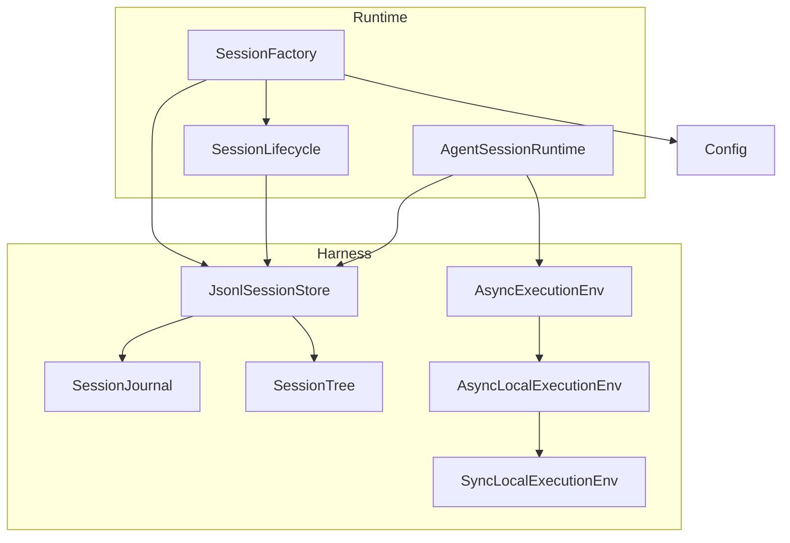
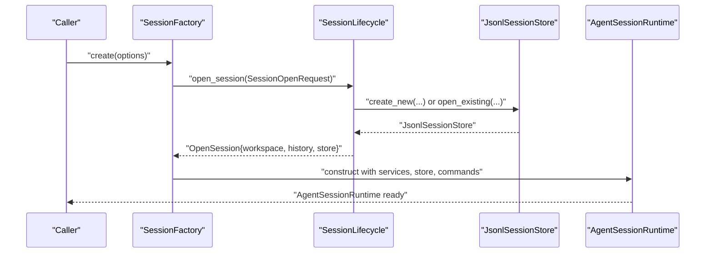
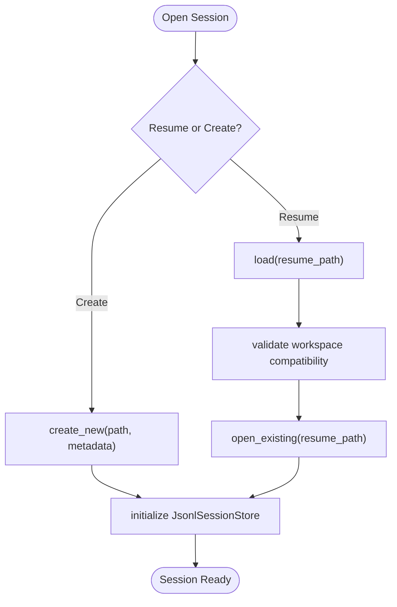
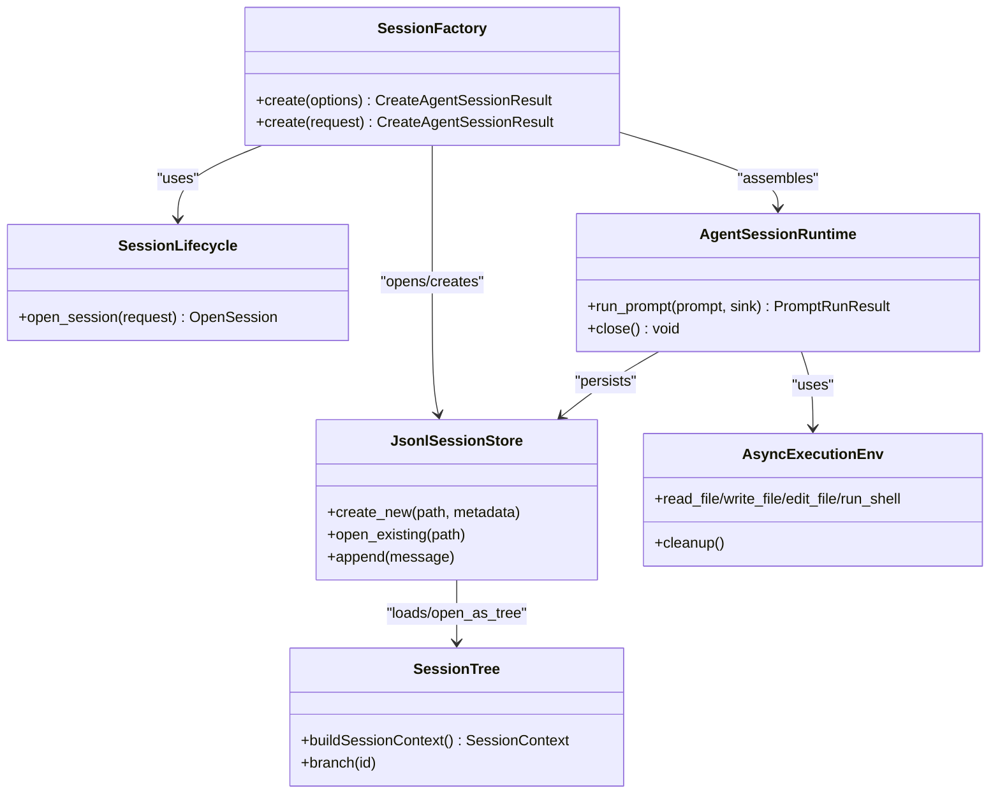

# Session Lifecycle

<cite>
**Referenced Files in This Document**
- [SessionFactory.hpp](file://src/coding_agent/runtime/SessionFactory.hpp)
- [SessionFactory.cpp](file://src/coding_agent/runtime/SessionFactory.cpp)
- [SessionLifecycle.hpp](file://src/coding_agent/runtime/SessionLifecycle.hpp)
- [SessionLifecycle.cpp](file://src/coding_agent/runtime/SessionLifecycle.cpp)
- [AgentSessionRuntime.hpp](file://src/coding_agent/runtime/AgentSessionRuntime.hpp)
- [AgentSessionRuntime.cpp](file://src/coding_agent/runtime/AgentSessionRuntime.cpp)
- [JsonlSessionStore.hpp](file://include/cch/harness/session/JsonlSessionStore.hpp)
- [JsonlSessionStore.cpp](file://src/harness/session/JsonlSessionStore.cpp)
- [SessionEntry.hpp](file://include/cch/harness/session/SessionEntry.hpp)
- [SessionTree.hpp](file://include/cch/harness/session/SessionTree.hpp)
- [SessionTree.cpp](file://src/harness/session/SessionTree.cpp)
- [ExecutionEnv.hpp](file://include/cch/harness/ExecutionEnv.hpp)
- [AsyncLocalExecutionEnv.cpp](file://src/harness/AsyncLocalExecutionEnv.cpp)
- [SyncLocalExecutionEnv.cpp](file://src/harness/SyncLocalExecutionEnv.cpp)
- [Config.hpp](file://include/cch/coding_agent/Config.hpp)
</cite>

## Table of Contents
1. [Introduction](#introduction)
2. [Project Structure](#project-structure)
3. [Core Components](#core-components)
4. [Architecture Overview](#architecture-overview)
5. [Detailed Component Analysis](#detailed-component-analysis)
6. [Dependency Analysis](#dependency-analysis)
7. [Performance Considerations](#performance-considerations)
8. [Troubleshooting Guide](#troubleshooting-guide)
9. [Conclusion](#conclusion)

## Introduction
This document explains the complete lifecycle of agent sessions from creation to destruction. It covers how sessions are created and configured, how they initialize and operate, how they persist and restore state, and how they integrate with the execution environment. It also documents session isolation, security considerations around environment variables and workspace boundaries, and robust error handling and recovery strategies.

## Project Structure
The session lifecycle spans several runtime and harness modules:
- Runtime session assembly and lifecycle orchestration
- Session store and journal for durable, append-only persistence
- Execution environment abstraction for safe workspace operations
- Configuration and provider resolution for session metadata

**Diagram sources**
- [SessionFactory.cpp:274-423](file://src/coding_agent/runtime/SessionFactory.cpp#L274-L423)
- [SessionLifecycle.cpp:22-68](file://src/coding_agent/runtime/SessionLifecycle.cpp#L22-L68)
- [AgentSessionRuntime.cpp:47-91](file://src/coding_agent/runtime/AgentSessionRuntime.cpp#L47-L91)
- [JsonlSessionStore.cpp:50-112](file://src/harness/session/JsonlSessionStore.cpp#L50-L112)
- [AsyncLocalExecutionEnv.cpp:10-18](file://src/harness/AsyncLocalExecutionEnv.cpp#L10-L18)
- [SyncLocalExecutionEnv.cpp:81-90](file://src/harness/SyncLocalExecutionEnv.cpp#L81-L90)
- [Config.hpp:15-76](file://include/cch/coding_agent/Config.hpp#L15-L76)

**Section sources**
- [SessionFactory.hpp:14-63](file://src/coding_agent/runtime/SessionFactory.hpp#L14-L63)
- [SessionFactory.cpp:274-423](file://src/coding_agent/runtime/SessionFactory.cpp#L274-L423)
- [SessionLifecycle.hpp:14-36](file://src/coding_agent/runtime/SessionLifecycle.hpp#L14-L36)
- [SessionLifecycle.cpp:22-68](file://src/coding_agent/runtime/SessionLifecycle.cpp#L22-L68)
- [AgentSessionRuntime.hpp:37-110](file://src/coding_agent/runtime/AgentSessionRuntime.hpp#L37-L110)
- [AgentSessionRuntime.cpp:47-91](file://src/coding_agent/runtime/AgentSessionRuntime.cpp#L47-L91)
- [JsonlSessionStore.hpp:18-79](file://include/cch/harness/session/JsonlSessionStore.hpp#L18-L79)
- [JsonlSessionStore.cpp:50-112](file://src/harness/session/JsonlSessionStore.cpp#L50-L112)
- [SessionEntry.hpp:13-52](file://include/cch/harness/session/SessionEntry.hpp#L13-L52)
- [SessionTree.hpp:34-145](file://include/cch/harness/session/SessionTree.hpp#L34-L145)
- [SessionTree.cpp:12-25](file://src/harness/session/SessionTree.cpp#L12-L25)
- [ExecutionEnv.hpp:198-334](file://include/cch/harness/ExecutionEnv.hpp#L198-L334)
- [AsyncLocalExecutionEnv.cpp:10-18](file://src/harness/AsyncLocalExecutionEnv.cpp#L10-L18)
- [SyncLocalExecutionEnv.cpp:81-90](file://src/harness/SyncLocalExecutionEnv.cpp#L81-L90)
- [Config.hpp:15-76](file://include/cch/coding_agent/Config.hpp#L15-L76)

## Core Components
- SessionFactory: Builds a session from public SDK options or internal requests, resolves provider settings, constructs runtime services, and assembles AgentSessionRuntime with proper configuration and initial state.
- SessionLifecycle: Opens or resumes a session, validates workspace compatibility, and prepares the JsonlSessionStore for durable persistence.
- AgentSessionRuntime: Manages the agent loop, prompt processing, event fanout, and session state transitions. Provides lifecycle hooks for closing and cleanup.
- JsonlSessionStore: Durable, append-only storage with tree entry APIs for structured session metadata and messages.
- SessionTree: In-memory index enabling navigation, branching, and context reconstruction from session entries.
- ExecutionEnv family: Abstracts workspace I/O and shell execution with strict sandboxing and secret handling.

**Section sources**
- [SessionFactory.hpp:57-63](file://src/coding_agent/runtime/SessionFactory.hpp#L57-L63)
- [SessionFactory.cpp:274-423](file://src/coding_agent/runtime/SessionFactory.cpp#L274-L423)
- [SessionLifecycle.hpp:25-36](file://src/coding_agent/runtime/SessionLifecycle.hpp#L25-L36)
- [SessionLifecycle.cpp:22-68](file://src/coding_agent/runtime/SessionLifecycle.cpp#L22-L68)
- [AgentSessionRuntime.hpp:37-110](file://src/coding_agent/runtime/AgentSessionRuntime.hpp#L37-L110)
- [AgentSessionRuntime.cpp:93-162](file://src/coding_agent/runtime/AgentSessionRuntime.cpp#L93-L162)
- [JsonlSessionStore.hpp:18-79](file://include/cch/harness/session/JsonlSessionStore.hpp#L18-L79)
- [JsonlSessionStore.cpp:114-126](file://src/harness/session/JsonlSessionStore.cpp#L114-L126)
- [SessionTree.hpp:34-145](file://include/cch/harness/session/SessionTree.hpp#L34-L145)
- [SessionTree.cpp:12-25](file://src/harness/session/SessionTree.cpp#L12-L25)
- [ExecutionEnv.hpp:198-334](file://include/cch/harness/ExecutionEnv.hpp#L198-L334)

## Architecture Overview
The session lifecycle integrates configuration resolution, session opening/resume, runtime assembly, and persistent storage. The execution environment mediates workspace operations safely.

**Diagram sources**
- [SessionFactory.cpp:274-423](file://src/coding_agent/runtime/SessionFactory.cpp#L274-L423)
- [SessionLifecycle.cpp:22-68](file://src/coding_agent/runtime/SessionLifecycle.cpp#L22-L68)
- [JsonlSessionStore.cpp:50-89](file://src/harness/session/JsonlSessionStore.cpp#L50-L89)
- [AgentSessionRuntime.cpp:47-91](file://src/coding_agent/runtime/AgentSessionRuntime.cpp#L47-L91)

## Detailed Component Analysis

### SessionFactory: Creation and Configuration
- Accepts public CreateAgentSessionOptions or internal AgentSessionCreationRequest.
- Validates exclusive session_path vs resume_path and workspace requirements.
- Resolves provider settings and constructs a StreamingChatClient when needed.
- Builds runtime services including execution environment, tools, skills, and prompt templates.
- Loads project resources when requested and merges host-provided resources with project ones.
- Constructs AgentSessionRuntime with max_turns, model, and diagnostic capture flags.

Key behaviors:
- Provider/client resolution and diagnostics collection.
- Workspace filesystem detection and project resource loading plan.
- Project trust resolution and resource enablement decisions.
- Tool and command registration with duplicate and collision checks.
- Execution environment selection (explicit or local async env).

Practical example workflows:
- New session creation with explicit workspace and provider configuration.
- Resume an existing session with validation of workspace compatibility and stored provider/model metadata.
- Mixed scenario: resume with host-provided chat client and override provider/model via explicit config.

**Section sources**
- [SessionFactory.hpp:19-53](file://src/coding_agent/runtime/SessionFactory.hpp#L19-L53)
- [SessionFactory.cpp:425-800](file://src/coding_agent/runtime/SessionFactory.cpp#L425-L800)
- [Config.hpp:64-76](file://include/cch/coding_agent/Config.hpp#L64-L76)

### SessionLifecycle: Opening and Resuming Sessions
- Supports two modes: create new session or resume an existing one.
- On resume: loads session metadata, enforces workspace compatibility, preserves stored provider/model for later resolution, and opens the store for append-only access.
- On create: generates session_id and ISO timestamp, writes header metadata, and initializes the store.

Workspace validation during resume:
- If caller specifies workspace explicitly, it must match the stored workspace.
- If not specified, the stored workspace is adopted.

Linear topology enforcement:
- During resume, non-linear entries (branches, compactions, tree metadata) are rejected for SDK v1’s linear-only mode.

**Section sources**
- [SessionLifecycle.hpp:14-36](file://src/coding_agent/runtime/SessionLifecycle.hpp#L14-L36)
- [SessionLifecycle.cpp:22-68](file://src/coding_agent/runtime/SessionLifecycle.cpp#L22-L68)

### AgentSessionRuntime: Initialization, Operation, and Cleanup
Initialization:
- Captures skills block and injects it into the agent’s context transformation pipeline.
- Configures agent loop with max_turns and model.
- Creates AsyncAgentLoop with tools and client.

Active operation:
- run_prompt orchestrates skill expansion, slash-command/template dispatch, and agent loop execution.
- Persists new messages to the session store and updates in-memory history.
- Aggregates diagnostics and returns standardized PromptRunResult.

Lifecycle:
- close transitions state to Closed, unsubscribes listeners, resets loop, and triggers best-effort execution environment cleanup.

Concurrency and safety:
- Uses io_context to drive async agent loop and ensures thread-safe state transitions guarded by State enum.

**Section sources**
- [AgentSessionRuntime.hpp:37-110](file://src/coding_agent/runtime/AgentSessionRuntime.hpp#L37-L110)
- [AgentSessionRuntime.cpp:47-91](file://src/coding_agent/runtime/AgentSessionRuntime.cpp#L47-L91)
- [AgentSessionRuntime.cpp:93-162](file://src/coding_agent/runtime/AgentSessionRuntime.cpp#L93-L162)
- [AgentSessionRuntime.cpp:164-199](file://src/coding_agent/runtime/AgentSessionRuntime.cpp#L164-L199)
- [AgentSessionRuntime.cpp:256-275](file://src/coding_agent/runtime/AgentSessionRuntime.cpp#L256-L275)

### Session Persistence and Restoration
JsonlSessionStore:
- Provides create_new/open_existing/load/open_as_tree.
- Append APIs for messages and tree entries (model change, thinking level, active tools, custom entries, labels, compaction, branch summary, session info, leaf).
- Maintains metadata and next-entry-id counters.

SessionJournal:
- Enforces path safety, private permissions, and append-only semantics for sensitive transcripts.

SessionTree:
- Indexes entries by ID and parent relationships, supports leaf navigation, branch reconstruction, and context building.
- Handles compaction summaries and emits appropriate message variants for LLM consumption.

**Diagram sources**
- [SessionLifecycle.cpp:22-68](file://src/coding_agent/runtime/SessionLifecycle.cpp#L22-L68)
- [JsonlSessionStore.cpp:50-89](file://src/harness/session/JsonlSessionStore.cpp#L50-L89)
- [JsonlSessionStore.cpp:91-112](file://src/harness/session/JsonlSessionStore.cpp#L91-L112)

**Section sources**
- [JsonlSessionStore.hpp:18-79](file://include/cch/harness/session/JsonlSessionStore.hpp#L18-L79)
- [JsonlSessionStore.cpp:114-126](file://src/harness/session/JsonlSessionStore.cpp#L114-L126)
- [SessionEntry.hpp:13-52](file://include/cch/harness/session/SessionEntry.hpp#L13-L52)
- [SessionTree.hpp:34-145](file://include/cch/harness/session/SessionTree.hpp#L34-L145)
- [SessionTree.cpp:12-25](file://src/harness/session/SessionTree.cpp#L12-L25)

### Execution Environment Management and Isolation
- AsyncExecutionEnv defines the capability seam for workspace I/O and shell execution.
- AsyncLocalExecutionEnv delegates to SyncLocalExecutionEnv, which sanitizes environment variables, enforces workspace containment, and applies timeouts and output limits.
- Secret detection heuristics exclude sensitive keys unless explicitly whitelisted.

Security and isolation:
- Workspace containment prevents escaping to parent directories.
- Bash enablement is opt-in; shell commands are executed with sanitized environment.
- Output truncation and streaming callbacks are supported to avoid memory pressure.

**Section sources**
- [ExecutionEnv.hpp:198-334](file://include/cch/harness/ExecutionEnv.hpp#L198-L334)
- [AsyncLocalExecutionEnv.cpp:10-18](file://src/harness/AsyncLocalExecutionEnv.cpp#L10-L18)
- [AsyncLocalExecutionEnv.cpp:150-177](file://src/harness/AsyncLocalExecutionEnv.cpp#L150-L177)
- [SyncLocalExecutionEnv.cpp:36-69](file://src/harness/SyncLocalExecutionEnv.cpp#L36-L69)
- [SyncLocalExecutionEnv.cpp:295-346](file://src/harness/SyncLocalExecutionEnv.cpp#L295-L346)

### Practical Workflows

#### Creating a New Session
- Provide session_path, workspace, and optional provider_config or host chat_client.
- SessionFactory generates session_id and created_at timestamp, opens store, and assembles runtime services.
- AgentSessionRuntime is ready to accept prompts.

**Section sources**
- [SessionFactory.cpp:425-521](file://src/coding_agent/runtime/SessionFactory.cpp#L425-L521)
- [SessionLifecycle.cpp:55-67](file://src/coding_agent/runtime/SessionLifecycle.cpp#L55-L67)

#### Resuming a Session
- Provide resume_path and optional workspace override.
- SessionLifecycle validates workspace compatibility and loads metadata/history.
- SessionFactory reconstructs provider/model when needed and enforces linear topology constraints.
- AgentSessionRuntime continues from persisted history.

**Section sources**
- [SessionFactory.cpp:492-580](file://src/coding_agent/runtime/SessionFactory.cpp#L492-L580)
- [SessionLifecycle.cpp:26-52](file://src/coding_agent/runtime/SessionLifecycle.cpp#L26-L52)

#### Running a Prompt and Persisting Results
- AgentSessionRuntime.run_prompt expands skills/templates, runs agent loop, appends new messages, and updates history.
- JsonlSessionStore persists entries atomically via Journal.

**Section sources**
- [AgentSessionRuntime.cpp:93-162](file://src/coding_agent/runtime/AgentSessionRuntime.cpp#L93-L162)
- [JsonlSessionStore.cpp:114-126](file://src/harness/session/JsonlSessionStore.cpp#L114-L126)

### Error Recovery and Graceful Degradation
- Validation errors for conflicting or missing options are surfaced early in SessionFactory.
- Provider/client construction failures are converted to standardized errors with actionable details.
- Workspace filesystem unavailability and project resource loading diagnostics are collected and reported.
- On resume, non-linear topologies are rejected with explicit error codes.
- Agent loop errors are mapped to terminal codes and display-friendly messages; session remains open for recovery.

**Section sources**
- [SessionFactory.cpp:432-443](file://src/coding_agent/runtime/SessionFactory.cpp#L432-L443)
- [SessionFactory.cpp:100-156](file://src/coding_agent/runtime/SessionFactory.cpp#L100-L156)
- [SessionFactory.cpp:513-521](file://src/coding_agent/runtime/SessionFactory.cpp#L513-L521)
- [AgentSessionRuntime.cpp:180-188](file://src/coding_agent/runtime/AgentSessionRuntime.cpp#L180-L188)

## Dependency Analysis

**Diagram sources**
- [SessionFactory.cpp:274-423](file://src/coding_agent/runtime/SessionFactory.cpp#L274-L423)
- [SessionLifecycle.cpp:22-68](file://src/coding_agent/runtime/SessionLifecycle.cpp#L22-L68)
- [AgentSessionRuntime.cpp:47-91](file://src/coding_agent/runtime/AgentSessionRuntime.cpp#L47-L91)
- [JsonlSessionStore.cpp:50-112](file://src/harness/session/JsonlSessionStore.cpp#L50-L112)
- [SessionTree.cpp:12-25](file://src/harness/session/SessionTree.cpp#L12-L25)
- [ExecutionEnv.hpp:198-334](file://include/cch/harness/ExecutionEnv.hpp#L198-L334)

**Section sources**
- [SessionFactory.hpp:57-63](file://src/coding_agent/runtime/SessionFactory.hpp#L57-L63)
- [SessionLifecycle.hpp:25-36](file://src/coding_agent/runtime/SessionLifecycle.hpp#L25-L36)
- [AgentSessionRuntime.hpp:37-110](file://src/coding_agent/runtime/AgentSessionRuntime.hpp#L37-L110)
- [JsonlSessionStore.hpp:18-79](file://include/cch/harness/session/JsonlSessionStore.hpp#L18-L79)
- [SessionTree.hpp:34-145](file://include/cch/harness/session/SessionTree.hpp#L34-L145)
- [ExecutionEnv.hpp:198-334](file://include/cch/harness/ExecutionEnv.hpp#L198-L334)

## Performance Considerations
- Prefer linear sessions for SDK v1 to avoid overhead of tree navigation and compaction handling.
- Use append-only store APIs to minimize random I/O and ensure atomicity.
- Limit diagnostics capture to essential cases to reduce overhead during prompt runs.
- Control max_turns to bound agent loop execution time and memory growth.

## Troubleshooting Guide
Common issues and resolutions:
- Both session_path and resume_path set: choose one.
- Workspace required for new sessions: supply a non-empty workspace.
- Resume workspace mismatch: omit workspace to adopt stored workspace or start a new session.
- Non-linear session topology on resume: remove branches/compactions or use a compatible mode.
- Provider/client resolution failures: ensure environment variables are set or supply a host client/provider config.
- Execution environment errors: verify bash enablement, workspace containment, and environment sanitization.

**Section sources**
- [SessionFactory.cpp:432-443](file://src/coding_agent/runtime/SessionFactory.cpp#L432-L443)
- [SessionFactory.cpp:471-476](file://src/coding_agent/runtime/SessionFactory.cpp#L471-L476)
- [SessionFactory.cpp:32-130](file://src/coding_agent/runtime/SessionFactory.cpp#L32-L130)
- [SessionLifecycle.cpp:32-38](file://src/coding_agent/runtime/SessionLifecycle.cpp#L32-L38)
- [SessionLifecycle.cpp:513-521](file://src/coding_agent/runtime/SessionLifecycle.cpp#L513-L521)
- [SyncLocalExecutionEnv.cpp:295-346](file://src/harness/SyncLocalExecutionEnv.cpp#L295-L346)

## Conclusion
The session lifecycle is designed for reliability, safety, and clarity. SessionFactory centralizes configuration and assembly, SessionLifecycle manages opening/resuming with strong workspace validation, AgentSessionRuntime coordinates prompt execution and persistence, and JsonlSessionStore/SessionTree provide robust, structured storage. The execution environment enforces isolation and security. Together, these components deliver a resilient, auditable, and secure session management system suitable for interactive coding agents.