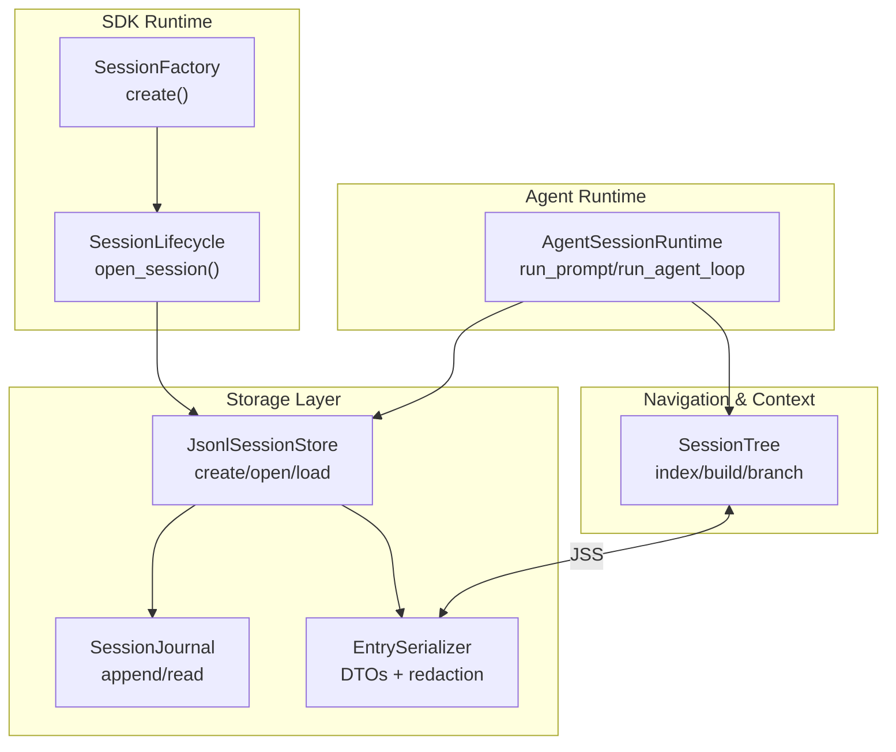
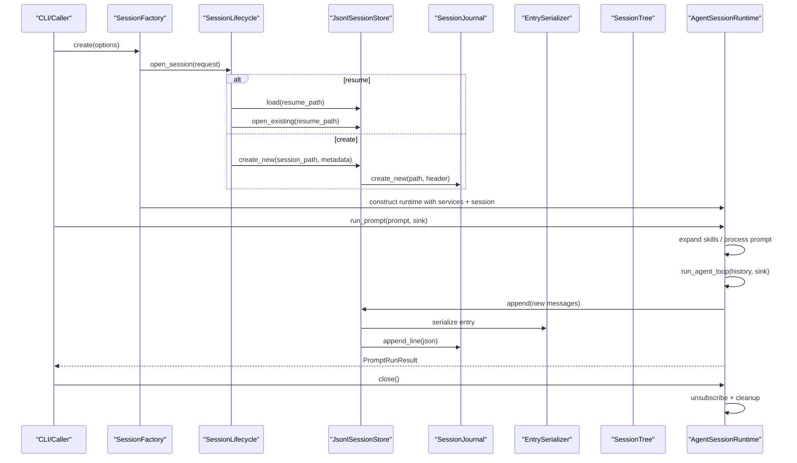
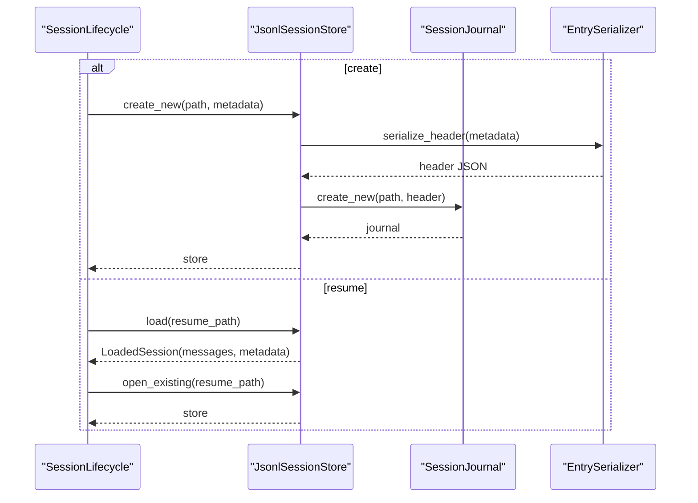
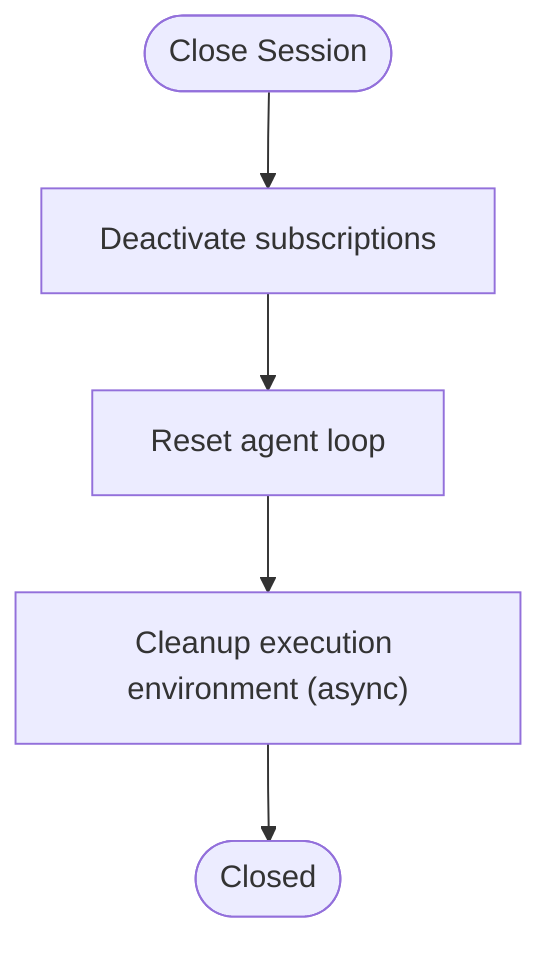
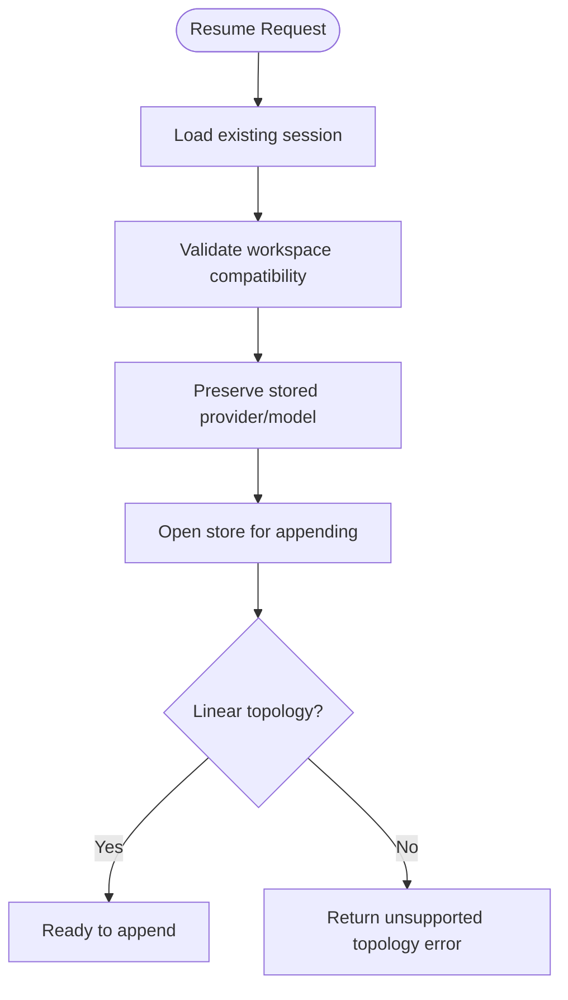
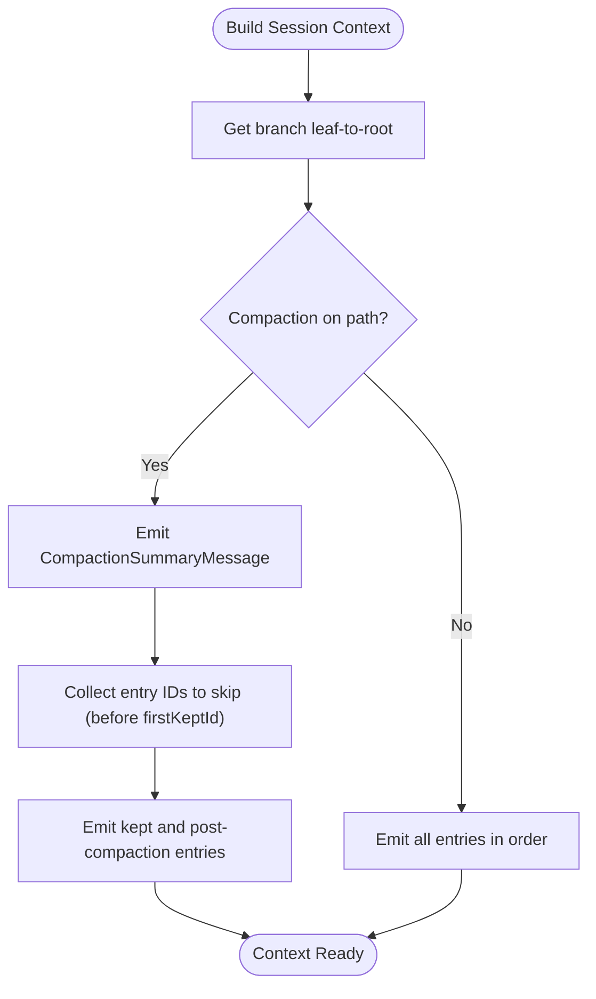
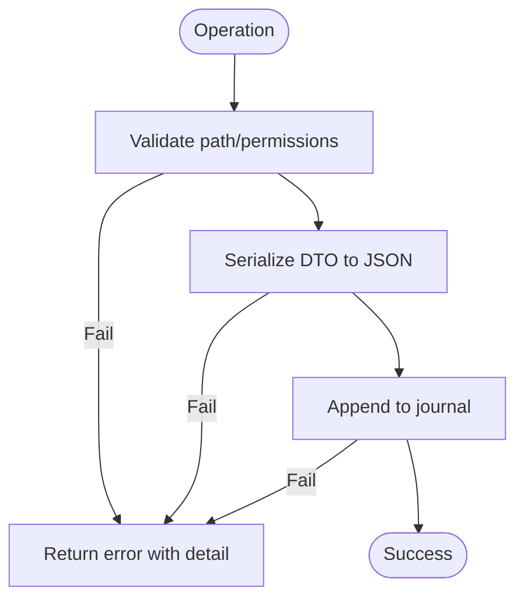
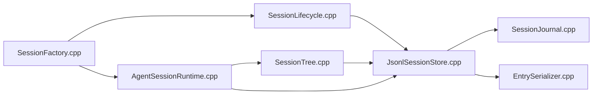

# Session Lifecycle Management

<cite>
**Referenced Files in This Document**
- [SessionTree.hpp](file://include/cch/harness/session/SessionTree.hpp)
- [SessionTree.cpp](file://src/harness/session/SessionTree.cpp)
- [JsonlSessionStore.hpp](file://include/cch/harness/session/JsonlSessionStore.hpp)
- [JsonlSessionStore.cpp](file://src/harness/session/JsonlSessionStore.cpp)
- [SessionJournal.hpp](file://src/harness/session/SessionJournal.hpp)
- [SessionJournal.cpp](file://src/harness/session/SessionJournal.cpp)
- [EntrySerializer.hpp](file://src/harness/session/EntrySerializer.hpp)
- [EntrySerializer.cpp](file://src/harness/session/EntrySerializer.cpp)
- [SessionEntry.hpp](file://include/cch/harness/session/SessionEntry.hpp)
- [SessionLifecycle.hpp](file://src/coding_agent/runtime/SessionLifecycle.hpp)
- [SessionLifecycle.cpp](file://src/coding_agent/runtime/SessionLifecycle.cpp)
- [SessionFactory.hpp](file://src/coding_agent/runtime/SessionFactory.hpp)
- [SessionFactory.cpp](file://src/coding_agent/runtime/SessionFactory.cpp)
- [AgentSessionRuntime.hpp](file://src/coding_agent/runtime/AgentSessionRuntime.hpp)
- [AgentSessionRuntime.cpp](file://src/coding_agent/runtime/AgentSessionRuntime.cpp)
</cite>

## Table of Contents
1. [Introduction](#introduction)
2. [Project Structure](#project-structure)
3. [Core Components](#core-components)
4. [Architecture Overview](#architecture-overview)
5. [Detailed Component Analysis](#detailed-component-analysis)
6. [Dependency Analysis](#dependency-analysis)
7. [Performance Considerations](#performance-considerations)
8. [Troubleshooting Guide](#troubleshooting-guide)
9. [Conclusion](#conclusion)

## Introduction
This document explains the complete session lifecycle in the system: creation, active operation, and termination. It covers how sessions are initialized with metadata and workspace, how they operate during message exchange and tool execution, and how they finalize with persistence and cleanup. It also documents the resume capability that continues sessions across runs, compaction for optimized storage and performance, error handling and recovery, and practical examples of lifecycle operations.

## Project Structure
The session lifecycle spans several modules:
- Storage and persistence: JSONL-backed journal, serializer, and store
- In-memory navigation and context reconstruction: session tree
- SDK runtime orchestration: session opening, provider/model resolution, and runtime creation
- Agent runtime: prompt processing, agent loop execution, and event streaming



**Diagram sources**
- [SessionJournal.cpp:137-150](file://src/harness/session/SessionJournal.cpp#L137-L150)
- [EntrySerializer.cpp:377-464](file://src/harness/session/EntrySerializer.cpp#L377-L464)
- [JsonlSessionStore.cpp:50-112](file://src/harness/session/JsonlSessionStore.cpp#L50-L112)
- [SessionTree.cpp:12-25](file://src/harness/session/SessionTree.cpp#L12-L25)
- [SessionLifecycle.cpp:22-68](file://src/coding_agent/runtime/SessionLifecycle.cpp#L22-L68)
- [SessionFactory.cpp:274-423](file://src/coding_agent/runtime/SessionFactory.cpp#L274-L423)
- [AgentSessionRuntime.cpp:93-162](file://src/coding_agent/runtime/AgentSessionRuntime.cpp#L93-L162)

**Section sources**
- [JsonlSessionStore.hpp:18-79](file://include/cch/harness/session/JsonlSessionStore.hpp#L18-L79)
- [SessionTree.hpp:34-145](file://include/cch/harness/session/SessionTree.hpp#L34-L145)
- [SessionEntry.hpp:13-54](file://include/cch/harness/session/SessionEntry.hpp#L13-L54)
- [SessionLifecycle.cpp:22-68](file://src/coding_agent/runtime/SessionLifecycle.cpp#L22-L68)
- [SessionFactory.cpp:274-423](file://src/coding_agent/runtime/SessionFactory.cpp#L274-L423)
- [AgentSessionRuntime.cpp:47-91](file://src/coding_agent/runtime/AgentSessionRuntime.cpp#L47-L91)

## Core Components
- Session metadata and entries define the session identity, workspace, provider, model, and typed entries (messages, model change, thinking level change, active tools change, custom entries, labels, compaction, branch summaries, session info, leaf).
- Journal enforces safe file creation and appends with permission checks and atomic-like semantics.
- Serializer translates between internal DTOs and JSONL lines, including redaction of sensitive content.
- Store wraps journal and serializer to expose high-level append APIs for each entry kind and to load sessions.
- Tree builds an in-memory index for O(1) lookup and parent-child traversal, enabling branch navigation and context reconstruction.
- Lifecycle opens or creates sessions, validates workspace compatibility on resume, and preserves stored provider/model for client construction.
- Factory composes runtime services, detects project resources, constructs tools and clients, and creates the agent runtime.
- Agent runtime executes prompts, expands skills, processes commands/templates, runs the agent loop, persists new entries, and manages subscriptions.

**Section sources**
- [SessionEntry.hpp:13-54](file://include/cch/harness/session/SessionEntry.hpp#L13-L54)
- [SessionJournal.cpp:99-150](file://src/harness/session/SessionJournal.cpp#L99-L150)
- [EntrySerializer.cpp:377-682](file://src/harness/session/EntrySerializer.cpp#L377-L682)
- [JsonlSessionStore.cpp:50-310](file://src/harness/session/JsonlSessionStore.cpp#L50-L310)
- [SessionTree.cpp:12-172](file://src/harness/session/SessionTree.cpp#L12-L172)
- [SessionLifecycle.cpp:22-68](file://src/coding_agent/runtime/SessionLifecycle.cpp#L22-L68)
- [SessionFactory.cpp:274-423](file://src/coding_agent/runtime/SessionFactory.cpp#L274-L423)
- [AgentSessionRuntime.cpp:47-162](file://src/coding_agent/runtime/AgentSessionRuntime.cpp#L47-L162)

## Architecture Overview
The lifecycle is orchestrated by the SDK runtime and executed by the agent runtime. Creation initializes metadata and workspace; active operation streams events and persists entries; termination closes subscriptions and cleans up the execution environment.



**Diagram sources**
- [SessionFactory.cpp:274-423](file://src/coding_agent/runtime/SessionFactory.cpp#L274-L423)
- [SessionLifecycle.cpp:22-68](file://src/coding_agent/runtime/SessionLifecycle.cpp#L22-L68)
- [JsonlSessionStore.cpp:50-112](file://src/harness/session/JsonlSessionStore.cpp#L50-L112)
- [SessionJournal.cpp:99-150](file://src/harness/session/SessionJournal.cpp#L99-L150)
- [EntrySerializer.cpp:466-473](file://src/harness/session/EntrySerializer.cpp#L466-L473)
- [AgentSessionRuntime.cpp:93-199](file://src/coding_agent/runtime/AgentSessionRuntime.cpp#L93-L199)

## Detailed Component Analysis

### Session Creation and Initialization
- New sessions: metadata is constructed with session ID, timestamp, workspace, provider, and model; a header line is written via the journal; the store is opened for appending.
- Resume sessions: the store loads existing entries and messages, validates workspace compatibility against stored metadata, preserves stored provider/model for later client construction, and opens the store for appending.



**Diagram sources**
- [SessionLifecycle.cpp:22-68](file://src/coding_agent/runtime/SessionLifecycle.cpp#L22-L68)
- [JsonlSessionStore.cpp:50-89](file://src/harness/session/JsonlSessionStore.cpp#L50-L89)
- [EntrySerializer.cpp:377-379](file://src/harness/session/EntrySerializer.cpp#L377-L379)
- [SessionJournal.cpp:99-135](file://src/harness/session/SessionJournal.cpp#L99-L135)

**Section sources**
- [SessionLifecycle.cpp:22-68](file://src/coding_agent/runtime/SessionLifecycle.cpp#L22-L68)
- [JsonlSessionStore.cpp:50-89](file://src/harness/session/JsonlSessionStore.cpp#L50-L89)
- [EntrySerializer.cpp:377-379](file://src/harness/session/EntrySerializer.cpp#L377-L379)
- [SessionJournal.cpp:99-135](file://src/harness/session/SessionJournal.cpp#L99-L135)

### Active Operation: Message Processing, Tool Execution, and State Updates
- Prompt processing: skills are expanded, slash commands are handled, and templates are expanded; if a command is handled, the runtime returns early without invoking the agent loop.
- Agent loop execution: the loop runs until completion or max turns; new messages are appended to the session and persisted; event sinks receive lifecycle events.
- Subscriptions: runtime supports subscribing to agent lifecycle events; subscriptions are managed and disabled on close.

```mermaid
sequenceDiagram
participant ASR as "AgentSessionRuntime"
participant WS as "WorkspaceFileSystem"
participant EXP as "SkillExpander"
participant PP as "PromptProcessor"
participant LOOP as "AgentLoop"
participant JSS as "JsonlSessionStore"
ASR->>WS : construct FS
ASR->>EXP : expand(prompt)
EXP-->>ASR : expanded or printed
alt expanded
ASR->>ASR : use expanded prompt
else processed
ASR->>PP : process prompt (commands/templates)
PP-->>ASR : expanded prompt or handled
end
ASR->>LOOP : continue_with(history, prompt, sink)
LOOP-->>ASR : AsyncAgentRunResult(context)
ASR->>JSS : append(new messages)
JSS-->>ASR : ok
ASR-->>ASR : update history
```

**Diagram sources**
- [AgentSessionRuntime.cpp:93-162](file://src/coding_agent/runtime/AgentSessionRuntime.cpp#L93-L162)
- [AgentSessionRuntime.cpp:164-199](file://src/coding_agent/runtime/AgentSessionRuntime.cpp#L164-L199)

**Section sources**
- [AgentSessionRuntime.cpp:93-162](file://src/coding_agent/runtime/AgentSessionRuntime.cpp#L93-L162)
- [AgentSessionRuntime.cpp:164-199](file://src/coding_agent/runtime/AgentSessionRuntime.cpp#L164-L199)

### Session Termination: Finalization, Cleanup, and Persistence
- Persistence: after agent loop completion, new messages are appended to the session store; serialization and journal append are performed.
- Cleanup: on close, subscriptions are deactivated, the agent loop is reset, and the execution environment is asynchronously cleaned up.



**Diagram sources**
- [AgentSessionRuntime.cpp:256-275](file://src/coding_agent/runtime/AgentSessionRuntime.cpp#L256-L275)

**Section sources**
- [AgentSessionRuntime.cpp:190-199](file://src/coding_agent/runtime/AgentSessionRuntime.cpp#L190-L199)
- [AgentSessionRuntime.cpp:256-275](file://src/coding_agent/runtime/AgentSessionRuntime.cpp#L256-L275)

### Resume Functionality: Cross-run Continuation
- On resume, the loader reads stored entries and messages; workspace compatibility is validated; stored provider/model metadata is preserved for client construction; the store is reopened for appending.
- Factory-level resume validation ensures the session topology is linear (no branches, compactions, labels, or leaf metadata) for SDK v1; if host client is used, stored metadata is informational.



**Diagram sources**
- [SessionLifecycle.cpp:22-68](file://src/coding_agent/runtime/SessionLifecycle.cpp#L22-L68)
- [SessionFactory.cpp:499-521](file://src/coding_agent/runtime/SessionFactory.cpp#L499-L521)

**Section sources**
- [SessionLifecycle.cpp:22-68](file://src/coding_agent/runtime/SessionLifecycle.cpp#L22-L68)
- [SessionFactory.cpp:499-521](file://src/coding_agent/runtime/SessionFactory.cpp#L499-L521)

### Session Compaction: Optimizing Storage and Performance
- Compaction entries summarize earlier entries and mark a first-kept entry ID; during context reconstruction, the tree emits a compaction summary message and skips entries before the first-kept ID, emitting only kept and post-compaction entries.
- Compaction maintains historical context by preserving the summary and ensuring continuity from the first kept entry onward.



**Diagram sources**
- [SessionTree.cpp:176-273](file://src/harness/session/SessionTree.cpp#L176-L273)
- [EntrySerializer.cpp:594-622](file://src/harness/session/EntrySerializer.cpp#L594-L622)

**Section sources**
- [SessionTree.cpp:176-273](file://src/harness/session/SessionTree.cpp#L176-L273)
- [EntrySerializer.cpp:594-622](file://src/harness/session/EntrySerializer.cpp#L594-L622)

### Error Handling, Rollback Mechanisms, and Recovery
- Journal and store enforce strict path validation and permission checks; exclusive creation prevents symlink traversal and race conditions; on failure, errors are propagated with detailed messages.
- Serializer redacts sensitive content to avoid logging secrets; malformed JSONL and missing types produce actionable errors.
- Runtime guards against concurrent prompt execution and returns terminal codes for loop errors; on close, cleanup is best-effort and asynchronous.



**Diagram sources**
- [SessionJournal.cpp:243-257](file://src/harness/session/SessionJournal.cpp#L243-L257)
- [SessionJournal.cpp:259-293](file://src/harness/session/SessionJournal.cpp#L259-L293)
- [EntrySerializer.cpp:466-473](file://src/harness/session/EntrySerializer.cpp#L466-L473)
- [JsonlSessionStore.cpp:114-126](file://src/harness/session/JsonlSessionStore.cpp#L114-L126)

**Section sources**
- [SessionJournal.cpp:243-293](file://src/harness/session/SessionJournal.cpp#L243-L293)
- [EntrySerializer.cpp:141-168](file://src/harness/session/EntrySerializer.cpp#L141-L168)
- [JsonlSessionStore.cpp:114-126](file://src/harness/session/JsonlSessionStore.cpp#L114-L126)
- [AgentSessionRuntime.cpp:96-101](file://src/coding_agent/runtime/AgentSessionRuntime.cpp#L96-L101)

### Practical Examples of Session Operations
- Creating a new session with explicit workspace and provider/model metadata, then appending a message entry.
- Resuming a session, validating workspace compatibility, and appending a model change entry.
- Running a prompt that triggers command handling versus one that invokes the agent loop and persists new messages.
- Performing a branch summary when navigating to a different leaf entry and persisting the summary.

**Section sources**
- [JsonlSessionStore.cpp:50-89](file://src/harness/session/JsonlSessionStore.cpp#L50-L89)
- [JsonlSessionStore.cpp:128-159](file://src/harness/session/JsonlSessionStore.cpp#L128-L159)
- [AgentSessionRuntime.cpp:93-162](file://src/coding_agent/runtime/AgentSessionRuntime.cpp#L93-L162)
- [SessionTree.cpp:311-372](file://src/harness/session/SessionTree.cpp#L311-L372)

## Dependency Analysis
The following diagram shows key dependencies among components involved in the session lifecycle.



**Diagram sources**
- [SessionLifecycle.cpp:22-68](file://src/coding_agent/runtime/SessionLifecycle.cpp#L22-L68)
- [SessionFactory.cpp:274-423](file://src/coding_agent/runtime/SessionFactory.cpp#L274-L423)
- [AgentSessionRuntime.cpp:47-91](file://src/coding_agent/runtime/AgentSessionRuntime.cpp#L47-L91)
- [JsonlSessionStore.cpp:50-112](file://src/harness/session/JsonlSessionStore.cpp#L50-L112)
- [SessionJournal.cpp:99-150](file://src/harness/session/SessionJournal.cpp#L99-L150)
- [EntrySerializer.cpp:377-464](file://src/harness/session/EntrySerializer.cpp#L377-L464)
- [SessionTree.cpp:12-25](file://src/harness/session/SessionTree.cpp#L12-L25)

**Section sources**
- [SessionLifecycle.cpp:22-68](file://src/coding_agent/runtime/SessionLifecycle.cpp#L22-L68)
- [SessionFactory.cpp:274-423](file://src/coding_agent/runtime/SessionFactory.cpp#L274-L423)
- [AgentSessionRuntime.cpp:47-91](file://src/coding_agent/runtime/AgentSessionRuntime.cpp#L47-L91)
- [JsonlSessionStore.cpp:50-112](file://src/harness/session/JsonlSessionStore.cpp#L50-L112)
- [SessionJournal.cpp:99-150](file://src/harness/session/SessionJournal.cpp#L99-L150)
- [EntrySerializer.cpp:377-464](file://src/harness/session/EntrySerializer.cpp#L377-L464)
- [SessionTree.cpp:12-25](file://src/harness/session/SessionTree.cpp#L12-L25)

## Performance Considerations
- Efficient indexing: SessionTree builds O(1) ID-to-index and children maps for fast navigation and traversal.
- Minimal serialization overhead: EntrySerializer generates compact JSON lines and redacts sensitive content before writing.
- Linear append pattern: Journal append uses synchronous write/fdatasync on Unix and flush/close on Windows to ensure durability.
- Context reconstruction cost: Compaction reduces emitted message count by skipping pre-kept entries, lowering LLM context size and processing time.

[No sources needed since this section provides general guidance]

## Troubleshooting Guide
Common issues and recovery steps:
- Session file already exists or is a symlink: creation fails with guidance to use resume or avoid symlinks.
- Permission issues: loading a session with public-readable permissions is rejected; fix file permissions to owner-only.
- Malformed JSONL or missing types: parsing errors include line number and GLAZE error details; fix the offending entry.
- Unsupported topology on resume: SDK v1 requires linear sessions; remove branches, compactions, labels, or leaf metadata before resuming.
- Provider/model metadata mismatch: when resuming without a host client, ensure stored provider/model can be reconstructed or supply provider_config/host client.

**Section sources**
- [SessionJournal.cpp:119-126](file://src/harness/session/SessionJournal.cpp#L119-L126)
- [SessionJournal.cpp:259-293](file://src/harness/session/SessionJournal.cpp#L259-L293)
- [EntrySerializer.cpp:141-168](file://src/harness/session/EntrySerializer.cpp#L141-L168)
- [SessionFactory.cpp:500-521](file://src/coding_agent/runtime/SessionFactory.cpp#L500-L521)

## Conclusion
The session lifecycle integrates robust storage, secure file handling, and efficient in-memory navigation to support reliable session creation, active operation, and termination. Resume enables cross-run continuity with workspace and metadata validation. Compaction optimizes storage and performance while maintaining historical context. Strong error handling and diagnostic reporting help diagnose and recover from failures.