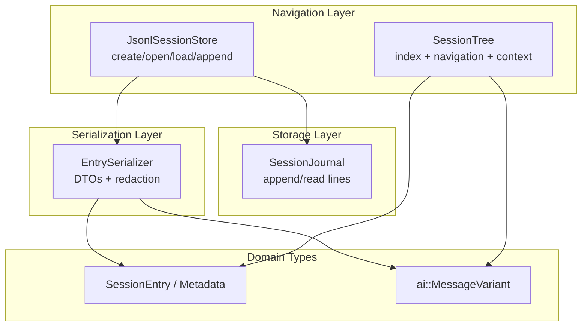
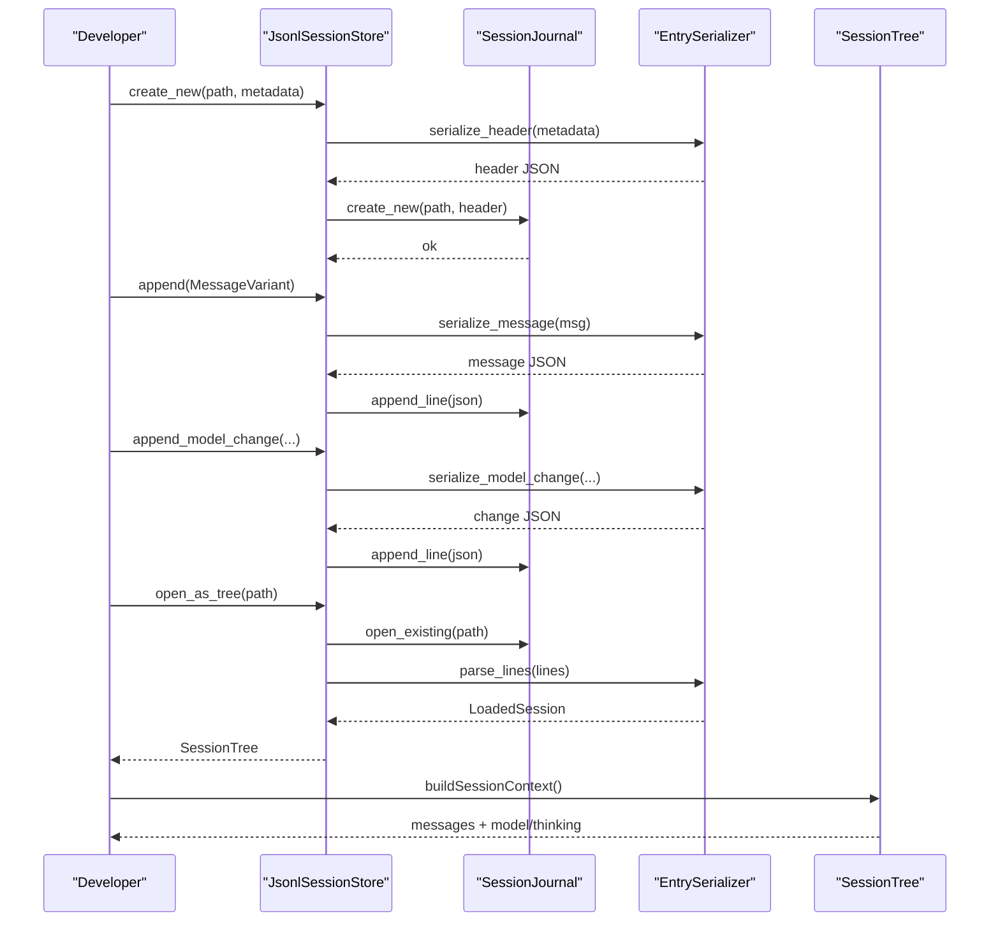
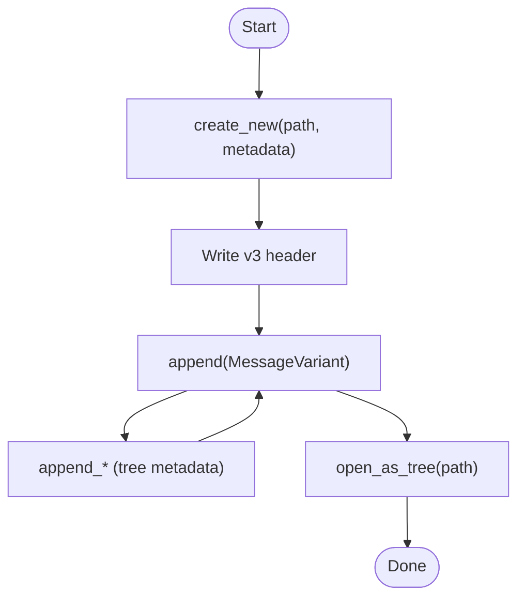
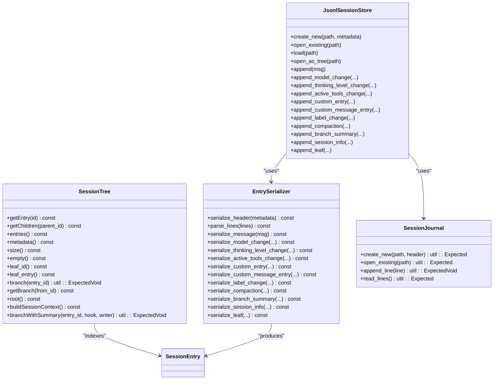
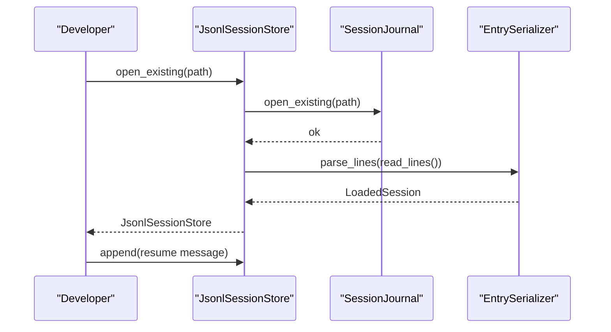
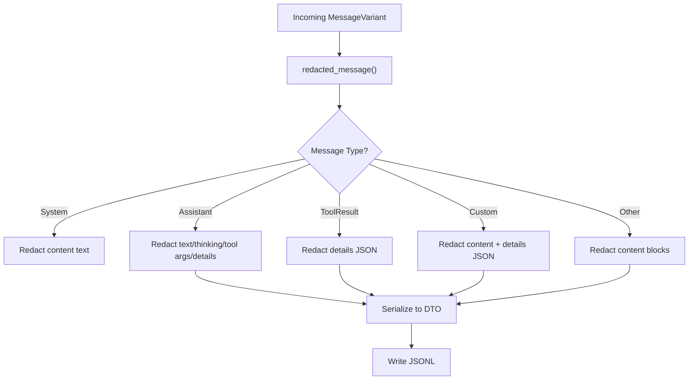
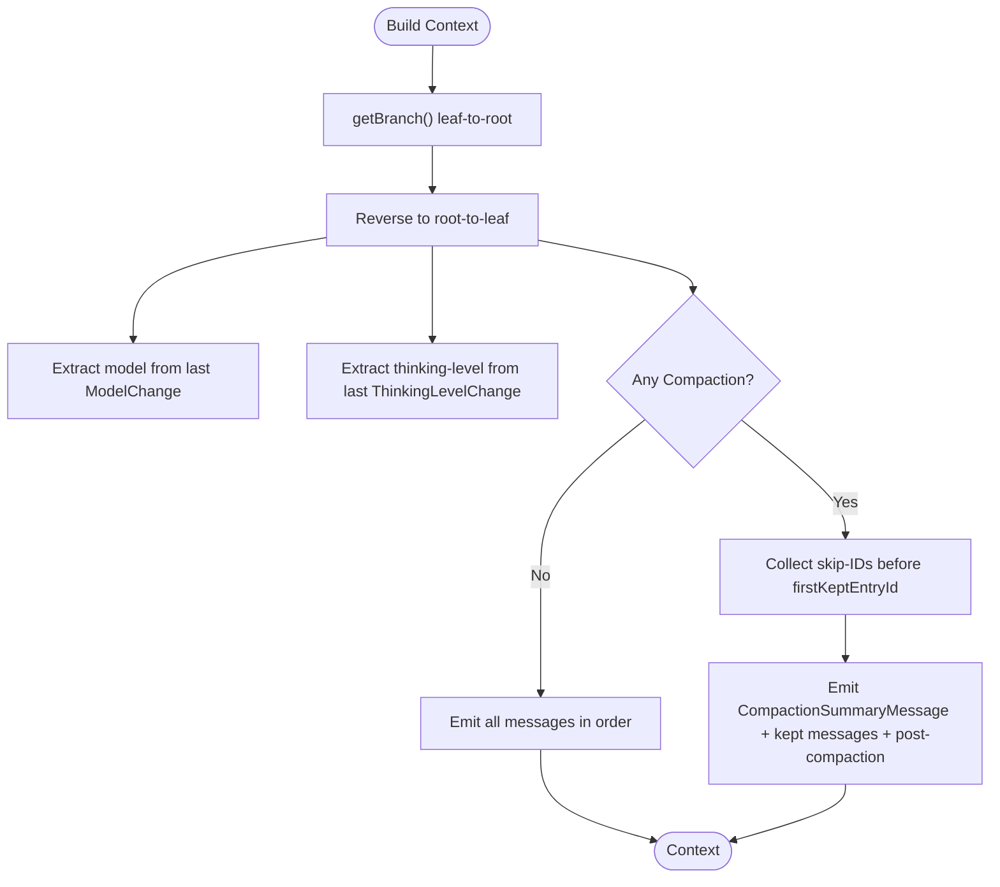
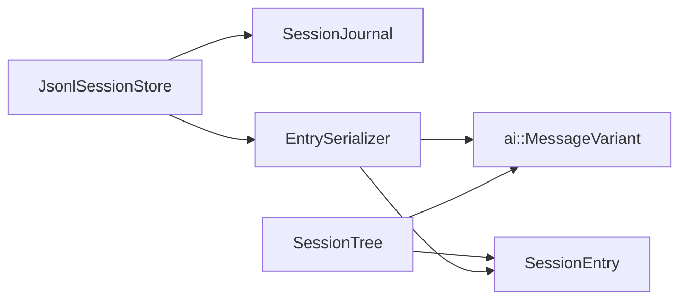

# Session Management

<cite>
**Referenced Files in This Document**
- [JsonlSessionStore.hpp](file://include/cch/harness/session/JsonlSessionStore.hpp)
- [JsonlSessionStore.cpp](file://src/harness/session/JsonlSessionStore.cpp)
- [SessionEntry.hpp](file://include/cch/harness/session/SessionEntry.hpp)
- [SessionTree.hpp](file://include/cch/harness/session/SessionTree.hpp)
- [SessionTree.cpp](file://src/harness/session/SessionTree.cpp)
- [SessionJournal.hpp](file://src/harness/session/SessionJournal.hpp)
- [SessionJournal.cpp](file://src/harness/session/SessionJournal.cpp)
- [EntrySerializer.hpp](file://src/harness/session/EntrySerializer.hpp)
- [EntrySerializer.cpp](file://src/harness/session/EntrySerializer.cpp)
- [Redactor.hpp](file://src/util/Redactor.hpp)
- [Message.hpp](file://include/cch/ai/Message.hpp)
- [JsonlSessionStoreTest.cpp](file://tests/harness/session/JsonlSessionStoreTest.cpp)
- [SessionTreeTest.cpp](file://tests/harness/session/SessionTreeTest.cpp)
</cite>

## Table of Contents
1. [Introduction](#introduction)
2. [Project Structure](#project-structure)
3. [Core Components](#core-components)
4. [Architecture Overview](#architecture-overview)
5. [Detailed Component Analysis](#detailed-component-analysis)
6. [Dependency Analysis](#dependency-analysis)
7. [Performance Considerations](#performance-considerations)
8. [Troubleshooting Guide](#troubleshooting-guide)
9. [Conclusion](#conclusion)
10. [Appendices](#appendices)

## Introduction
This document explains the session management subsystem that persists conversational and operational history in a robust, append-only JSONL format. It covers the v3 specification, the session lifecycle from creation to completion, tree navigation and compaction-aware context reconstruction, resume behavior across runs, redaction of sensitive content, and the relationship between session data and workspace state. Practical examples and troubleshooting guidance are included to help developers integrate and operate sessions effectively.

## Project Structure
The session management system is organized around three primary layers:
- Storage and I/O: SessionJournal provides safe, append-only file operations with strict permission and symlink checks.
- Serialization: EntrySerializer translates between domain objects and JSONL lines, including redaction and schema evolution.
- Navigation and Context: SessionTree indexes entries, supports branching and leaf navigation, and reconstructs LLM-ready contexts with compaction awareness.

**Diagram sources**
- [SessionJournal.hpp:12-38](file://src/harness/session/SessionJournal.hpp#L12-L38)
- [EntrySerializer.hpp:15-78](file://src/harness/session/EntrySerializer.hpp#L15-L78)
- [JsonlSessionStore.hpp:18-79](file://include/cch/harness/session/JsonlSessionStore.hpp#L18-L79)
- [SessionTree.hpp:27-145](file://include/cch/harness/session/SessionTree.hpp#L27-L145)
- [SessionEntry.hpp:13-52](file://include/cch/harness/session/SessionEntry.hpp#L13-L52)
- [Message.hpp:97-105](file://include/cch/ai/Message.hpp#L97-L105)

**Section sources**
- [SessionJournal.hpp:12-38](file://src/harness/session/SessionJournal.hpp#L12-L38)
- [EntrySerializer.hpp:15-78](file://src/harness/session/EntrySerializer.hpp#L15-L78)
- [JsonlSessionStore.hpp:18-79](file://include/cch/harness/session/JsonlSessionStore.hpp#L18-L79)
- [SessionTree.hpp:27-145](file://include/cch/harness/session/SessionTree.hpp#L27-L145)
- [SessionEntry.hpp:13-52](file://include/cch/harness/session/SessionEntry.hpp#L13-L52)
- [Message.hpp:97-105](file://include/cch/ai/Message.hpp#L97-L105)

## Core Components
- SessionJournal: Ensures secure file creation and appending, validates path safety, enforces owner-only permissions, and reads all lines.
- EntrySerializer: Converts between domain objects and JSONL DTOs, handles schema evolution (v3 header), redacts sensitive content, and parses entries.
- JsonlSessionStore: Coordinates file operations, exposes typed append APIs for messages and tree metadata, and provides load/open helpers.
- SessionTree: Builds in-memory indexes, supports leaf navigation, branch switching, compaction-aware context reconstruction, and branch summary hooks.

Key responsibilities:
- Safe I/O: Prevents symlink traversal and public-readable files.
- Schema evolution: v3 header with explicit version and session metadata.
- Redaction: Text and structured redaction for keys and values.
- Navigation: O(1) lookup by entry ID, parent-child indexing, leaf restoration, and branch path collection.
- Context reconstruction: Chronological message order, model/thinking-level extraction, compaction skipping, and conversion of special entries to messages.

**Section sources**
- [SessionJournal.cpp:99-150](file://src/harness/session/SessionJournal.cpp#L99-L150)
- [EntrySerializer.cpp:377-464](file://src/harness/session/EntrySerializer.cpp#L377-L464)
- [JsonlSessionStore.cpp:50-126](file://src/harness/session/JsonlSessionStore.cpp#L50-L126)
- [SessionTree.cpp:12-60](file://src/harness/session/SessionTree.cpp#L12-L60)

## Architecture Overview
The session lifecycle spans creation, incremental updates, and context reconstruction. The v3 header establishes session identity and workspace context. Tree entries record model changes, thinking level, active tools, labels, compactions, branch summaries, session info, and leaf positions. SessionTree enables navigation and compaction-aware context building.

**Diagram sources**
- [JsonlSessionStore.cpp:50-126](file://src/harness/session/JsonlSessionStore.cpp#L50-L126)
- [SessionJournal.cpp:99-150](file://src/harness/session/SessionJournal.cpp#L99-L150)
- [EntrySerializer.cpp:377-464](file://src/harness/session/EntrySerializer.cpp#L377-L464)
- [SessionTree.cpp:176-273](file://src/harness/session/SessionTree.cpp#L176-L273)

## Detailed Component Analysis

### JSONL Session Storage Format and Evolution (v2 to v3)
- v3 header: Explicit type "session" with version 3, including session_id, created_at, workspace path, provider, and model. This replaces earlier "header" type and aligns with the v3 tree entry schema.
- Entry types: Messages, model_change, thinking_level_change, active_tools_change, custom, custom_message, label, compaction, branch_summary, session_info, leaf.
- Entry IDs: 8-character lowercase hex strings generated per entry.
- Parent relationships: Explicit parentId for each entry; if absent, inferred from linear ordering.
- Unknown entries: Future or incompatible entries are preserved and reported separately.

Practical implications:
- Backward compatibility: v2-style headers are parsed and mapped to metadata.
- Mixed content: Tree entries and messages can interleave; loading preserves both.
- Safety: Strict validation prevents symlink usage and public-readable files.

**Section sources**
- [EntrySerializer.cpp:16-37](file://src/harness/session/EntrySerializer.cpp#L16-L37)
- [EntrySerializer.cpp:194-221](file://src/harness/session/EntrySerializer.cpp#L194-L221)
- [EntrySerializer.cpp:231-245](file://src/harness/session/EntrySerializer.cpp#L231-L245)
- [EntrySerializer.cpp:381-464](file://src/harness/session/EntrySerializer.cpp#L381-L464)
- [JsonlSessionStoreTest.cpp:150-190](file://tests/harness/session/JsonlSessionStoreTest.cpp#L150-L190)

### Session Lifecycle: Creation, Updates, Completion
- Creation: create_new(path, metadata) writes a v3 header and initializes the journal.
- Updates: append(...) for messages; specialized append_* methods for tree metadata (model_change, thinking_level_change, active_tools_change, custom, custom_message, label, compaction, branch_summary, session_info, leaf).
- Completion: open_as_tree(path) loads entries and constructs SessionTree for navigation and context reconstruction.

**Diagram sources**
- [JsonlSessionStore.cpp:50-126](file://src/harness/session/JsonlSessionStore.cpp#L50-L126)
- [EntrySerializer.cpp:466-574](file://src/harness/session/EntrySerializer.cpp#L466-L574)
- [SessionTree.cpp:12-25](file://src/harness/session/SessionTree.cpp#L12-L25)

**Section sources**
- [JsonlSessionStore.cpp:50-126](file://src/harness/session/JsonlSessionStore.cpp#L50-L126)
- [EntrySerializer.cpp:466-682](file://src/harness/session/EntrySerializer.cpp#L466-L682)
- [SessionTree.cpp:12-25](file://src/harness/session/SessionTree.cpp#L12-L25)

### Session Tree Navigation: Branching, Merging, and Leaf Restoration
- Indexing: build_index() maps entry_id to position and records children per parent; also captures inferred parents for entries without explicit parentId.
- Leaf restoration: restore_leaf_position() scans backwards for the last leaf entry and sets leaf_id accordingly; otherwise defaults to the last entry.
- Branching: branch(entry_id) switches the active leaf; getBranch(from_id) returns leaf-to-root path; root() identifies the root entry.
- Branch summary hook: branchWithSummary(entry_id, hook, append_writer) computes the abandoned branch, invokes the hook, conditionally appends a branch_summary entry, and updates the leaf.

**Diagram sources**
- [SessionTree.hpp:34-145](file://include/cch/harness/session/SessionTree.hpp#L34-L145)
- [EntrySerializer.hpp:18-78](file://src/harness/session/EntrySerializer.hpp#L18-L78)
- [SessionJournal.hpp:18-48](file://src/harness/session/SessionJournal.hpp#L18-L48)
- [JsonlSessionStore.hpp:18-79](file://include/cch/harness/session/JsonlSessionStore.hpp#L18-L79)

**Section sources**
- [SessionTree.cpp:27-172](file://src/harness/session/SessionTree.cpp#L27-L172)
- [SessionTree.cpp:311-372](file://src/harness/session/SessionTree.cpp#L311-L372)
- [JsonlSessionStore.cpp:106-126](file://src/harness/session/JsonlSessionStore.cpp#L106-L126)

### Resume Functionality Across Runs
- open_existing(path): Loads existing session, reads lines, and resumes appending messages or tree entries.
- Compatibility: Tests confirm that sessions with tree entries can be resumed and new messages appended.
- Safety: SessionJournal enforces path safety and private permissions during open.

**Diagram sources**
- [JsonlSessionStore.cpp:71-89](file://src/harness/session/JsonlSessionStore.cpp#L71-L89)
- [SessionJournal.cpp:137-149](file://src/harness/session/SessionJournal.cpp#L137-L149)
- [EntrySerializer.cpp:381-464](file://src/harness/session/EntrySerializer.cpp#L381-L464)

**Section sources**
- [JsonlSessionStore.cpp:71-89](file://src/harness/session/JsonlSessionStore.cpp#L71-L89)
- [JsonlSessionStoreTest.cpp:482-501](file://tests/harness/session/JsonlSessionStoreTest.cpp#L482-L501)

### Redaction of Sensitive Information
- Scope: EntrySerializer redacts message content and structured payloads. Redactor identifies secret-like keys and values (e.g., API keys, tokens, passwords).
- Application: redacted_message(...) applies redaction to various message types; redact_json_value(...) recursively redacts JSON structures; redact_text(...) sanitizes free-form text.
- Behavior: Sensitive values are replaced with sentinel markers; keys considered secret are redacted at the object level.

**Diagram sources**
- [EntrySerializer.cpp:332-373](file://src/harness/session/EntrySerializer.cpp#L332-L373)
- [EntrySerializer.cpp:272-296](file://src/harness/session/EntrySerializer.cpp#L272-L296)
- [Redactor.hpp:10-40](file://src/util/Redactor.hpp#L10-L40)

**Section sources**
- [EntrySerializer.cpp:272-373](file://src/harness/session/EntrySerializer.cpp#L272-L373)
- [Redactor.hpp:10-40](file://src/util/Redactor.hpp#L10-L40)
- [JsonlSessionStoreTest.cpp:72-127](file://tests/harness/session/JsonlSessionStoreTest.cpp#L72-L127)

### Session Compaction, Branch Summaries, and Context Reconstruction
- Compaction: append_compaction(...) records a compaction event with summary, firstKeptEntryId, tokensBefore, and optional details/fromHook. During context reconstruction, messages before firstKeptEntryId are skipped, and a CompactionSummaryMessage is emitted.
- Branch summaries: append_branch_summary(...) adds a branch summary entry; branchWithSummary(...) computes the abandoned branch, invokes a hook, optionally appends a summary entry, and switches the leaf.
- Context reconstruction: buildSessionContext() walks the leaf-to-root path, extracts model/thinking-level from nearest ancestors, emits messages (including converted special entries), and respects compaction boundaries.

**Diagram sources**
- [SessionTree.cpp:176-273](file://src/harness/session/SessionTree.cpp#L176-L273)
- [EntrySerializer.cpp:594-622](file://src/harness/session/EntrySerializer.cpp#L594-L622)

**Section sources**
- [SessionTree.cpp:176-273](file://src/harness/session/SessionTree.cpp#L176-L273)
- [EntrySerializer.cpp:594-650](file://src/harness/session/EntrySerializer.cpp#L594-L650)
- [SessionTreeTest.cpp:336-371](file://tests/harness/session/SessionTreeTest.cpp#L336-L371)

### Relationship Between Sessions and Workspace State
- Metadata: SessionMetadata includes session_id, created_at, workspace path, provider, and model. The workspace path is persisted in the v3 header.
- Navigation: SessionTree exposes metadata and entries; workspace path is available for downstream tooling and prompt expansion.
- Persistence: All entries are stored in a single JSONL file; the header encodes the workspace location.

**Section sources**
- [SessionEntry.hpp:13-19](file://include/cch/harness/session/SessionEntry.hpp#L13-L19)
- [EntrySerializer.cpp:194-204](file://src/harness/session/EntrySerializer.cpp#L194-L204)
- [SessionTree.hpp:56-57](file://include/cch/harness/session/SessionTree.hpp#L56-L57)

## Dependency Analysis
- Coupling: JsonlSessionStore depends on SessionJournal for I/O and EntrySerializer for DTO serialization/parsing.
- Cohesion: EntrySerializer encapsulates schema evolution and redaction logic; SessionTree focuses on indexing and navigation.
- External dependencies: Glaze JSON library for DTO serialization/deserialization; filesystem and OS primitives for secure file operations.

**Diagram sources**
- [JsonlSessionStore.hpp:18-79](file://include/cch/harness/session/JsonlSessionStore.hpp#L18-L79)
- [EntrySerializer.hpp:18-78](file://src/harness/session/EntrySerializer.hpp#L18-L78)
- [SessionTree.hpp:34-145](file://include/cch/harness/session/SessionTree.hpp#L34-L145)
- [Message.hpp:97-105](file://include/cch/ai/Message.hpp#L97-L105)

**Section sources**
- [JsonlSessionStore.cpp:50-126](file://src/harness/session/JsonlSessionStore.cpp#L50-L126)
- [EntrySerializer.cpp:377-464](file://src/harness/session/EntrySerializer.cpp#L377-L464)
- [SessionTree.cpp:12-25](file://src/harness/session/SessionTree.cpp#L12-L25)

## Performance Considerations
- Indexing cost: build_index() runs in O(n) and constructs O(1) lookup maps and children lists.
- I/O cost: SessionJournal uses atomic append and fsync on Unix; Windows uses binary append with flush/close.
- Memory: SessionTree owns the entries vector and indices; consider memory footprint for very long sessions.
- Redaction overhead: Applied at persistence boundary; keep payloads minimal to reduce regex processing.

[No sources needed since this section provides general guidance]

## Troubleshooting Guide
Common issues and resolutions:
- Malformed JSONL: parse_lines() reports line number and error context; fix the offending line.
- Missing type discriminator: EntrySerializer requires a "type" field; ensure entries conform to schema.
- Symlink or public-readable file: SessionJournal rejects symlinks and files readable by others; fix permissions and path.
- Target entry not found: branch() returns an error; verify entry ID exists in the tree.
- Permission failures: ensure owner-only permissions; SessionJournal validates and enforces them.

**Section sources**
- [EntrySerializer.cpp:145-168](file://src/harness/session/EntrySerializer.cpp#L145-L168)
- [SessionJournal.cpp:243-257](file://src/harness/session/SessionJournal.cpp#L243-L257)
- [SessionTree.cpp:122-130](file://src/harness/session/SessionTree.cpp#L122-L130)
- [JsonlSessionStoreTest.cpp:192-225](file://tests/harness/session/JsonlSessionStoreTest.cpp#L192-L225)

## Conclusion
The session management subsystem provides a secure, evolvable, and navigable way to persist conversations and operational events. With v3 headers, robust redaction, compaction-aware context reconstruction, and safe resume semantics, it supports complex workflows spanning multiple runs and branches. Developers can rely on clear APIs for appending messages and tree metadata, and on SessionTree for navigation and context building.

[No sources needed since this section summarizes without analyzing specific files]

## Appendices

### Practical Examples

- Creating a session and writing a message:
  - Use create_new(path, metadata) to initialize a v3 session.
  - Append a message with append(...).
  - Load with load(path) to verify structure and content.

- Writing tree metadata:
  - Use append_model_change, append_thinking_level_change, append_active_tools_change, append_custom_entry, append_custom_message_entry, append_label_change, append_compaction, append_branch_summary, append_session_info, and append_leaf.

- Resuming a session:
  - Use open_existing(path) to resume appending.
  - Use open_as_tree(path) to navigate and reconstruct context.

- Building a context:
  - Construct SessionTree from LoadedSession or via open_as_tree.
  - Call buildSessionContext() to get messages and model/thinking-level.

- Branching and summaries:
  - Use branch(entry_id) to switch the active leaf.
  - Use branchWithSummary(entry_id, hook, append_writer) to compute and append a branch summary.

**Section sources**
- [JsonlSessionStoreTest.cpp:54-70](file://tests/harness/session/JsonlSessionStoreTest.cpp#L54-L70)
- [JsonlSessionStoreTest.cpp:291-323](file://tests/harness/session/JsonlSessionStoreTest.cpp#L291-L323)
- [SessionTreeTest.cpp:160-182](file://tests/harness/session/SessionTreeTest.cpp#L160-L182)
- [SessionTreeTest.cpp:506-546](file://tests/harness/session/SessionTreeTest.cpp#L506-L546)