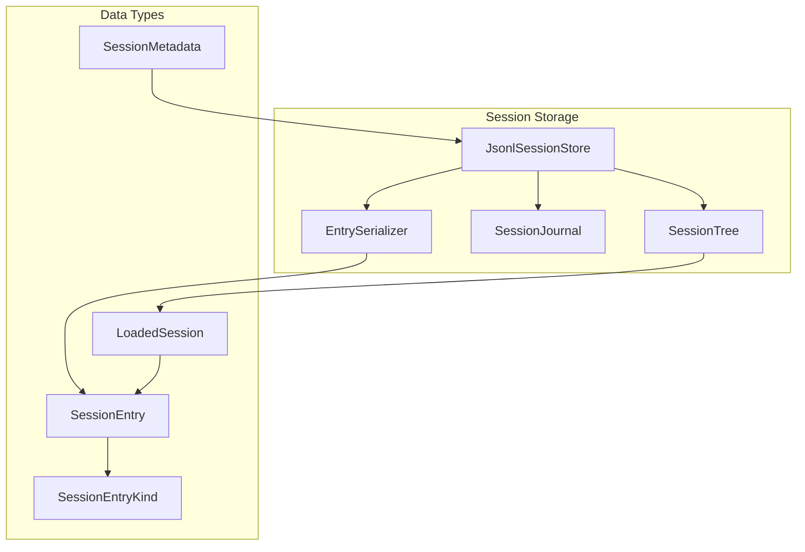
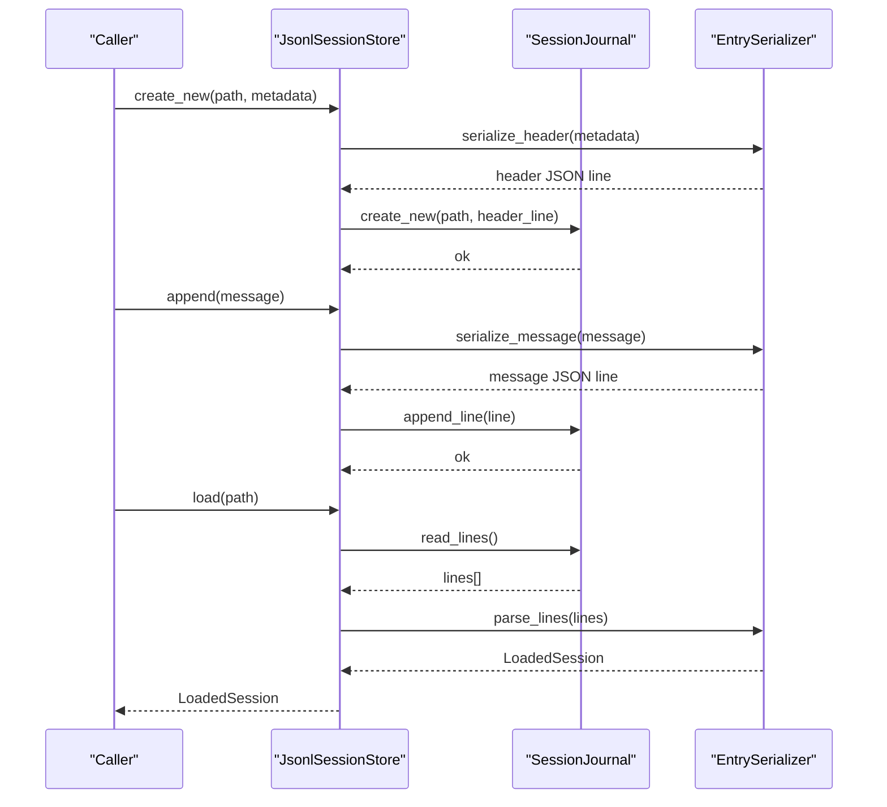
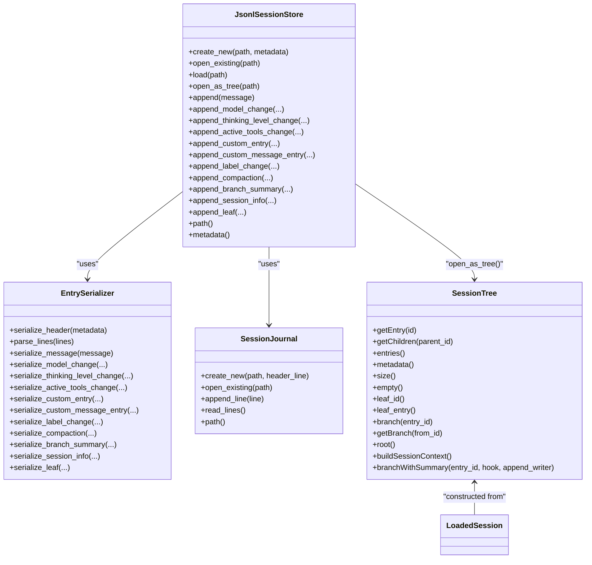

# Session Storage Format

<cite>
**Referenced Files in This Document**
- [SessionEntry.hpp](file://include/cch/harness/session/SessionEntry.hpp)
- [JsonlSessionStore.hpp](file://include/cch/harness/session/JsonlSessionStore.hpp)
- [EntrySerializer.hpp](file://src/harness/session/EntrySerializer.hpp)
- [EntrySerializer.cpp](file://src/harness/session/EntrySerializer.cpp)
- [JsonlSessionStore.cpp](file://src/harness/session/JsonlSessionStore.cpp)
- [SessionTree.hpp](file://include/cch/harness/session/SessionTree.hpp)
- [SessionTree.cpp](file://src/harness/session/SessionTree.cpp)
- [SessionJournal.hpp](file://src/harness/session/SessionJournal.hpp)
- [SessionJournal.cpp](file://src/harness/session/SessionJournal.cpp)
- [JsonlSessionStoreTest.cpp](file://tests/harness/session/JsonlSessionStoreTest.cpp)
- [SessionTreeTest.cpp](file://tests/harness/session/SessionTreeTest.cpp)
</cite>

## Table of Contents
1. [Introduction](#introduction)
2. [Project Structure](#project-structure)
3. [Core Components](#core-components)
4. [Architecture Overview](#architecture-overview)
5. [Detailed Component Analysis](#detailed-component-analysis)
6. [Dependency Analysis](#dependency-analysis)
7. [Performance Considerations](#performance-considerations)
8. [Troubleshooting Guide](#troubleshooting-guide)
9. [Conclusion](#conclusion)

## Introduction
This document specifies the JSON Lines (JSONL) session storage format used by the system to persist conversations and structured session events. It covers the evolution from v2 to v3 storage formats, the SessionEntry structure and SessionEntryKind enumeration, SessionMetadata, LoadedSession, and the end-to-end serialization/deserialization pipeline. It also explains how sessions are loaded and reconstructed into an in-memory SessionTree, how raw_line preservation works, and how unknown lines are handled. Practical examples and troubleshooting guidance are included to help diagnose and fix corrupted session files.

## Project Structure
The session storage system is organized around a small set of focused components:
- Data structures: SessionEntry, SessionEntryKind, SessionMetadata, LoadedSession
- Store interface: JsonlSessionStore
- Serialization: EntrySerializer
- Journaling: SessionJournal
- Reconstruction: SessionTree

**Diagram sources**
- [JsonlSessionStore.hpp:18-79](file://include/cch/harness/session/JsonlSessionStore.hpp#L18-L79)
- [EntrySerializer.hpp:18-78](file://src/harness/session/EntrySerializer.hpp#L18-L78)
- [SessionJournal.hpp:18-48](file://src/harness/session/SessionJournal.hpp#L18-L48)
- [SessionTree.hpp:34-145](file://include/cch/harness/session/SessionTree.hpp#L34-L145)
- [SessionEntry.hpp:13-52](file://include/cch/harness/session/SessionEntry.hpp#L13-L52)

**Section sources**
- [JsonlSessionStore.hpp:18-79](file://include/cch/harness/session/JsonlSessionStore.hpp#L18-L79)
- [EntrySerializer.hpp:18-78](file://src/harness/session/EntrySerializer.hpp#L18-L78)
- [SessionJournal.hpp:18-48](file://src/harness/session/SessionJournal.hpp#L18-L48)
- [SessionTree.hpp:34-145](file://include/cch/harness/session/SessionTree.hpp#L34-L145)
- [SessionEntry.hpp:13-52](file://include/cch/harness/session/SessionEntry.hpp#L13-L52)

## Core Components
- SessionEntryKind: Enumerates all supported entry types, including Header, Message, ModelChange, ThinkingLevelChange, ActiveToolsChange, Custom, CustomMessage, Label, Compaction, BranchSummary, SessionInfo, Leaf, and Unknown.
- SessionEntry: Represents a single persisted event with kind, identifiers, optional parent/leaf linkage, optional message variant, raw_line preservation, and a JSON payload.
- SessionMetadata: Captures session identity, creation timestamp, workspace path, provider, and model.
- LoadedSession: Aggregates metadata, messages, entries, and unknown_lines collected during parsing.
- JsonlSessionStore: Public API for creating/opening sessions, appending entries, and loading sessions.
- EntrySerializer: Converts between domain objects and JSONL lines, including redaction and parsing.
- SessionJournal: Low-level, safe, append-only file I/O with strict permission and symlink checks.
- SessionTree: In-memory index enabling navigation, leaf tracking, and context reconstruction.

**Section sources**
- [SessionEntry.hpp:21-52](file://include/cch/harness/session/SessionEntry.hpp#L21-L52)
- [JsonlSessionStore.hpp:18-79](file://include/cch/harness/session/JsonlSessionStore.hpp#L18-L79)
- [EntrySerializer.hpp:18-78](file://src/harness/session/EntrySerializer.hpp#L18-L78)
- [SessionJournal.hpp:18-48](file://src/harness/session/SessionJournal.hpp#L18-L48)
- [SessionTree.hpp:34-145](file://include/cch/harness/session/SessionTree.hpp#L34-L145)

## Architecture Overview
The system persists sessions as a sequence of JSONL lines. The first line is a header describing the session metadata and format version. Subsequent lines represent typed entries. The store coordinates file I/O via SessionJournal and delegates JSON conversion to EntrySerializer. Sessions can be loaded into memory as LoadedSession and then transformed into a navigable SessionTree.

**Diagram sources**
- [JsonlSessionStore.cpp:50-104](file://src/harness/session/JsonlSessionStore.cpp#L50-L104)
- [SessionJournal.cpp:99-150](file://src/harness/session/SessionJournal.cpp#L99-L150)
- [EntrySerializer.cpp:377-464](file://src/harness/session/EntrySerializer.cpp#L377-L464)

## Detailed Component Analysis

### JSONL Format Specification
- File encoding: UTF-8
- Line format: Each line is a single JSON object representing one entry. Lines are separated by LF.
- First line: Header describing session metadata and version.
- Subsequent lines: Typed entries representing messages and tree events.
- Empty lines: Allowed and preserved in raw_lines; parsers skip blank lines when reading.
- Unknown lines: Lines that fail to parse or lack a recognized type are recorded as Unknown entries and preserved in unknown_lines.

Version evolution:
- v2: Uses a header with fields including sessionId, createdAt, workspace, provider, model, id, timestamp, cwd.
- v3: Uses a header with fields including type, version, id, timestamp, cwd, provider, model. Version is 3.

Raw_line preservation:
- Each SessionEntry stores the original JSON line in raw_line to preserve formatting and enable diagnostics.

Unknown line handling:
- During parsing, unrecognized types are treated as Unknown entries and appended to unknown_lines for later inspection.

**Section sources**
- [EntrySerializer.cpp:16-37](file://src/harness/session/EntrySerializer.cpp#L16-L37)
- [EntrySerializer.cpp:381-464](file://src/harness/session/EntrySerializer.cpp#L381-L464)
- [JsonlSessionStoreTest.cpp:129-148](file://tests/harness/session/JsonlSessionStoreTest.cpp#L129-L148)

### SessionEntry and SessionEntryKind
SessionEntryKind enumerates all supported entry types:
- Header: Session header line
- Message: Conversation message
- ModelChange: Switch model/provider
- ThinkingLevelChange: Change thinking level
- ActiveToolsChange: Change active tools
- Custom: Arbitrary structured data
- CustomMessage: Injected message-like content
- Label: Attach label to a target entry
- Compaction: Summarize and prune earlier entries
- BranchSummary: Summary of an abandoned branch
- SessionInfo: Human-readable session name
- Leaf: Mark current active leaf position
- Unknown: Unrecognized entry type

SessionEntry fields:
- kind: Enumerated type
- entry_id: 8-character lowercase hex identifier
- parent_id: Optional parent entry ID
- leaf_id: Optional leaf target ID
- message: Optional message variant (when applicable)
- payload: Parsed JSON object
- raw_line: Original JSON line

**Section sources**
- [SessionEntry.hpp:21-44](file://include/cch/harness/session/SessionEntry.hpp#L21-L44)
- [EntrySerializer.cpp:231-245](file://src/harness/session/EntrySerializer.cpp#L231-L245)

### SessionMetadata
Fields:
- session_id: Unique session identifier
- created_at: ISO timestamp
- workspace: Absolute path to workspace
- provider: AI provider name
- model: Model identifier

**Section sources**
- [SessionEntry.hpp:13-19](file://include/cch/harness/session/SessionEntry.hpp#L13-L19)

### LoadedSession
Aggregation:
- metadata: SessionMetadata
- messages: Vector of message variants in chronological order
- entries: Vector of SessionEntry (excluding Header and Unknown)
- unknown_lines: Vector of unparsable lines

**Section sources**
- [SessionEntry.hpp:47-52](file://include/cch/harness/session/SessionEntry.hpp#L47-L52)

### Serialization and Deserialization Pipeline
EntrySerializer responsibilities:
- serialize_header: Writes v3 header with type, version, id, timestamp, cwd, provider, model.
- parse_lines: Reads lines, validates header presence, infers types, populates SessionEntry, preserves raw_line, collects unknown_lines.
- serialize_* methods: Convert tree events to JSONL lines with generated IDs and timestamps.
- Redaction: Sensitive content is redacted before persistence.

JsonlSessionStore responsibilities:
- create_new: Writes header and opens journal
- open_existing: Loads existing session and resumes writing
- append_*: Serializes and appends entries
- load: Opens journal, reads lines, delegates to EntrySerializer
- open_as_tree: Loads and constructs SessionTree

SessionJournal responsibilities:
- create_new: Exclusive creation with owner-only permissions
- open_existing: Validates path safety and permissions
- append_line: Append-only, fsync-safe
- read_lines: Read all lines preserving empty lines

**Section sources**
- [EntrySerializer.hpp:18-78](file://src/harness/session/EntrySerializer.hpp#L18-L78)
- [EntrySerializer.cpp:377-682](file://src/harness/session/EntrySerializer.cpp#L377-L682)
- [JsonlSessionStore.hpp:18-79](file://include/cch/harness/session/JsonlSessionStore.hpp#L18-L79)
- [JsonlSessionStore.cpp:50-307](file://src/harness/session/JsonlSessionStore.cpp#L50-L307)
- [SessionJournal.hpp:18-48](file://src/harness/session/SessionJournal.hpp#L18-L48)
- [SessionJournal.cpp:99-353](file://src/harness/session/SessionJournal.cpp#L99-L353)

### SessionTree: Loading and Reconstruction
SessionTree builds an in-memory index from LoadedSession:
- Filters Header and Unknown entries
- Builds ID-to-index map and children map
- Infers parent relationships for entries without explicit parent_id
- Restores leaf position from the last Leaf entry or defaults to the last entry

Reconstruction:
- buildSessionContext walks leaf-to-root, handles Compaction, converts BranchSummary and CustomMessage to messages, and extracts model/thinking-level state from the nearest change entries along the path.

Branch summary hook:
- branchWithSummary computes the abandoned branch, invokes a hook, optionally appends a BranchSummary entry, and updates the leaf.

**Section sources**
- [SessionTree.hpp:34-145](file://include/cch/harness/session/SessionTree.hpp#L34-L145)
- [SessionTree.cpp:12-374](file://src/harness/session/SessionTree.cpp#L12-L374)

### Relationship Between Session Entries and Conversation History
- Messages are the primary conversation history.
- Tree entries (ModelChange, ThinkingLevelChange, ActiveToolsChange, Label, Compaction, BranchSummary, SessionInfo, Leaf) augment the conversation with context and navigation metadata.
- Compaction summarizes earlier entries and prunes pre-kept messages during context reconstruction.
- BranchSummary and CustomMessage are converted into message forms during context building.

**Section sources**
- [SessionTree.cpp:176-307](file://src/harness/session/SessionTree.cpp#L176-L307)

## Dependency Analysis

**Diagram sources**
- [JsonlSessionStore.hpp:18-79](file://include/cch/harness/session/JsonlSessionStore.hpp#L18-L79)
- [EntrySerializer.hpp:18-78](file://src/harness/session/EntrySerializer.hpp#L18-L78)
- [SessionJournal.hpp:18-48](file://src/harness/session/SessionJournal.hpp#L18-L48)
- [SessionTree.hpp:34-145](file://include/cch/harness/session/SessionTree.hpp#L34-L145)

**Section sources**
- [JsonlSessionStore.hpp:18-79](file://include/cch/harness/session/JsonlSessionStore.hpp#L18-L79)
- [EntrySerializer.hpp:18-78](file://src/harness/session/EntrySerializer.hpp#L18-L78)
- [SessionJournal.hpp:18-48](file://src/harness/session/SessionJournal.hpp#L18-L48)
- [SessionTree.hpp:34-145](file://include/cch/harness/session/SessionTree.hpp#L34-L145)

## Performance Considerations
- Append-only writes: SessionJournal uses exclusive creation and append modes to minimize contention and ensure durability.
- Minimal parsing overhead: EntrySerializer performs lightweight JSON parsing and type inference; payloads are stored as util::JsonValue for flexibility.
- In-memory indexing: SessionTree builds O(1) lookups and child lists for efficient navigation.
- Redaction cost: Redaction occurs at serialization time; keep sensitive payloads minimal to reduce overhead.

## Troubleshooting Guide
Common issues and resolutions:
- Malformed JSONL: Parsing fails with a detailed error indicating the problematic line number. Fix by correcting the JSON or removing the offending line.
- Missing type field: Entry lacks a type discriminator; parser reports missing type at the affected line.
- Missing header: First line must be a valid header; absence causes a header-missing error.
- Symlink or public-readable file: SessionJournal refuses to open symlinks or files readable by others; fix permissions and path.
- Unknown lines: Unknown entries are preserved; review unknown_lines to diagnose future-format entries.
- Corrupted session: If a session cannot be loaded, inspect unknown_lines and raw_line content for clues. Consider reconstructing from known-good entries.

Practical examples:
- Redaction of sensitive fields during persistence ensures privacy; verify that redacted content appears as expected in raw lines.
- Mixed tree entries and messages round-trip correctly; verify order and IDs.
- open_existing allows resuming sessions with tree entries; ensure IDs remain consistent.

**Section sources**
- [EntrySerializer.cpp:381-464](file://src/harness/session/EntrySerializer.cpp#L381-L464)
- [SessionJournal.cpp:243-293](file://src/harness/session/SessionJournal.cpp#L243-L293)
- [JsonlSessionStoreTest.cpp:192-225](file://tests/harness/session/JsonlSessionStoreTest.cpp#L192-L225)
- [JsonlSessionStoreTest.cpp:227-245](file://tests/harness/session/JsonlSessionStoreTest.cpp#L227-L245)

## Conclusion
The JSONL session storage format provides a robust, extensible mechanism for persisting conversations and structured session metadata. The v3 header introduces clearer versioning and standardized fields. The separation of concerns between JsonlSessionStore, EntrySerializer, and SessionJournal yields a safe, readable, and maintainable system. SessionTree enables powerful navigation and context reconstruction, including compaction-aware history and branch summaries. By leveraging raw_line preservation and unknown line handling, the system remains resilient to evolving entry types and aids in diagnosing corruption.