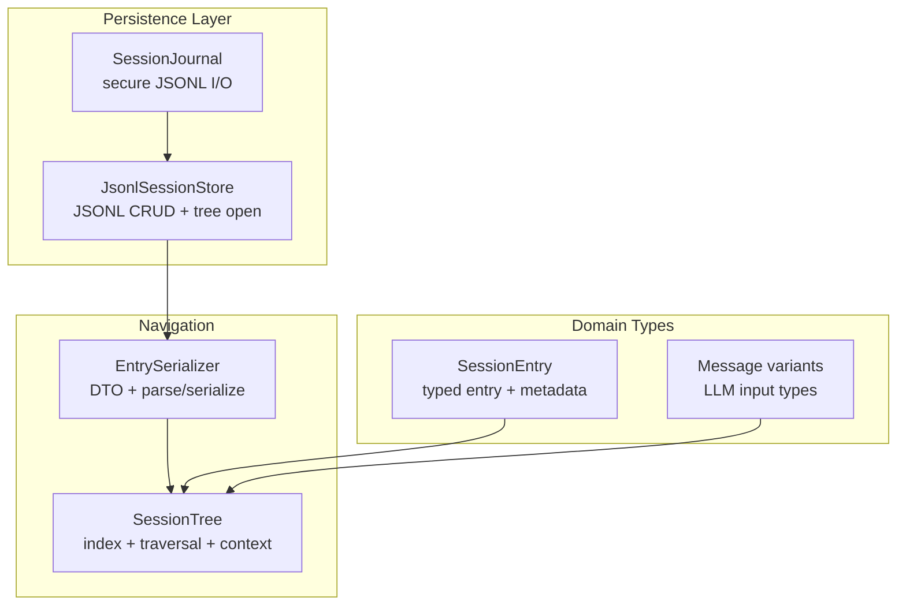
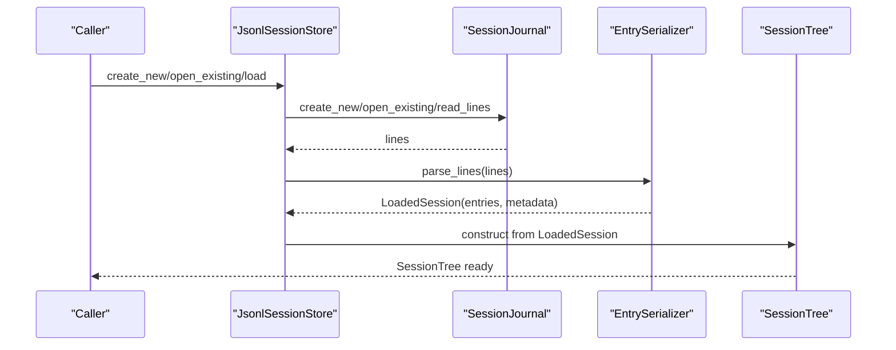
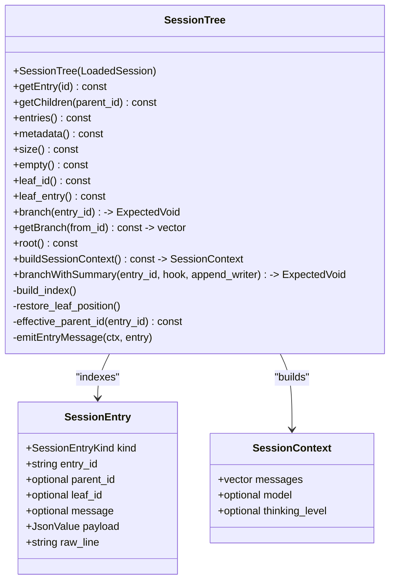
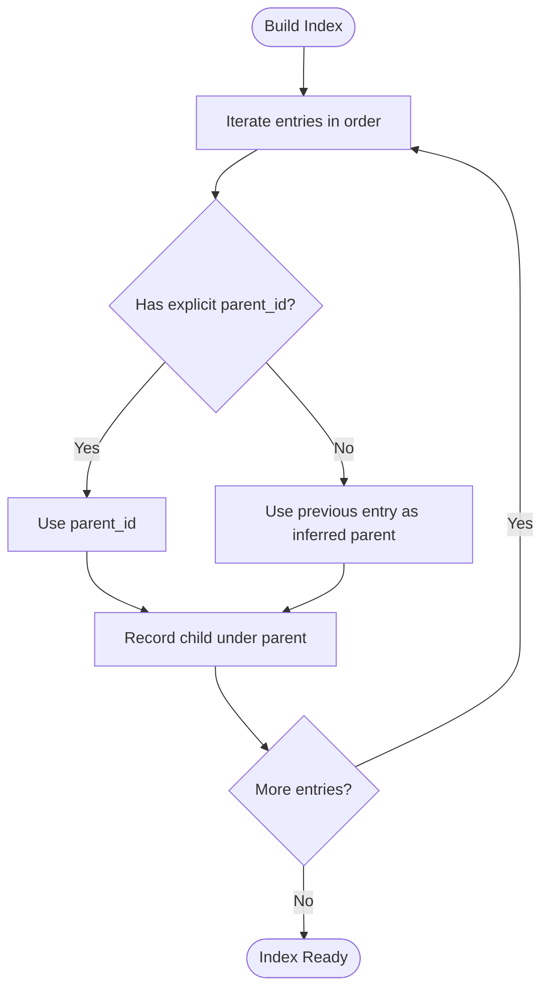
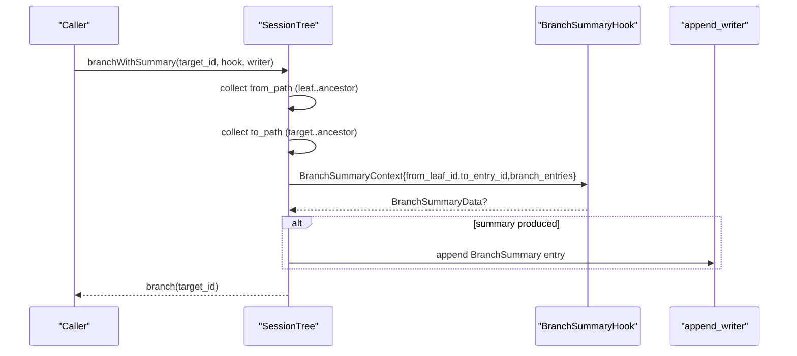
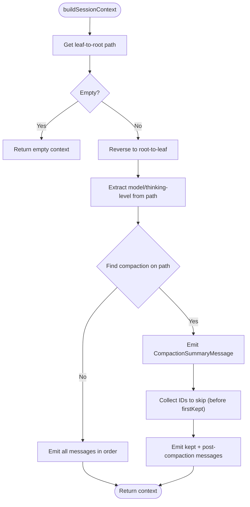
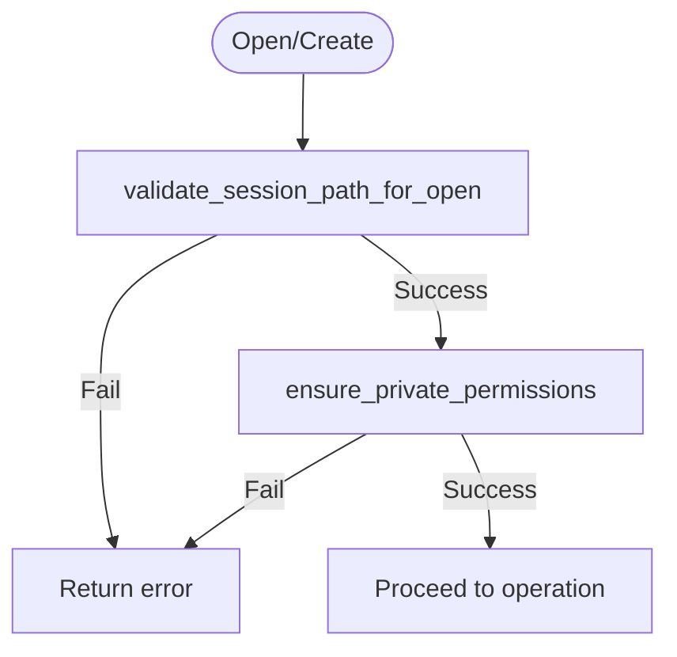
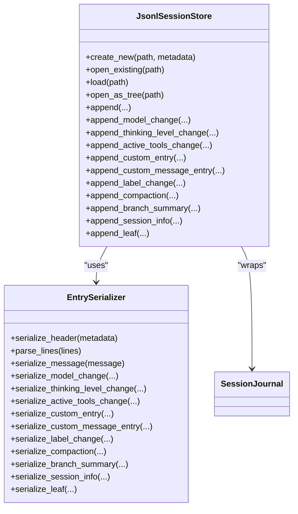
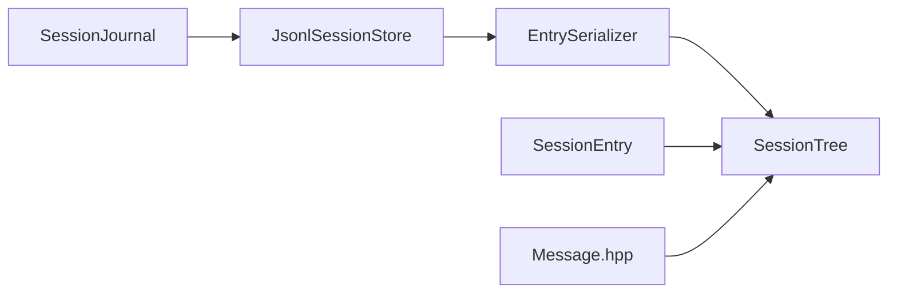

# Session Tree Navigation

<cite>
**Referenced Files in This Document**
- [SessionTree.hpp](file://include/cch/harness/session/SessionTree.hpp)
- [SessionTree.cpp](file://src/harness/session/SessionTree.cpp)
- [SessionEntry.hpp](file://include/cch/harness/session/SessionEntry.hpp)
- [SessionJournal.hpp](file://src/harness/session/SessionJournal.hpp)
- [SessionJournal.cpp](file://src/harness/session/SessionJournal.cpp)
- [JsonlSessionStore.hpp](file://include/cch/harness/session/JsonlSessionStore.hpp)
- [JsonlSessionStore.cpp](file://src/harness/session/JsonlSessionStore.cpp)
- [EntrySerializer.hpp](file://src/harness/session/EntrySerializer.hpp)
- [EntrySerializer.cpp](file://src/harness/session/EntrySerializer.cpp)
- [Message.hpp](file://include/cch/ai/Message.hpp)
- [SessionTreeTest.cpp](file://tests/harness/session/SessionTreeTest.cpp)
</cite>

## Table of Contents
1. [Introduction](#introduction)
2. [Project Structure](#project-structure)
3. [Core Components](#core-components)
4. [Architecture Overview](#architecture-overview)
5. [Detailed Component Analysis](#detailed-component-analysis)
6. [Dependency Analysis](#dependency-analysis)
7. [Performance Considerations](#performance-considerations)
8. [Troubleshooting Guide](#troubleshooting-guide)
9. [Conclusion](#conclusion)
10. [Appendices](#appendices)

## Introduction
This document explains the session tree navigation system that powers hierarchical conversation history management. It covers how sessions are represented as trees with parent-child relationships, how branches are created and navigated, and how context is reconstructed for LLM consumption. It documents the SessionTree class, branch summary hooks, compaction-aware context reconstruction, and the durable JSONL-backed journal used to track modifications. Practical examples demonstrate tree navigation, branch operations, and session history reconstruction, along with how changes propagate through the tree hierarchy.

## Project Structure
The session tree subsystem is organized around a small set of cohesive components:
- SessionTree: in-memory tree index and navigation
- SessionEntry: typed entry schema and metadata
- JsonlSessionStore: durable JSONL-backed session persistence
- SessionJournal: low-level, secure file I/O for JSONL
- EntrySerializer: serialization/deserialization of entries
- AI message types: extended runtime messages used during context reconstruction

**Diagram sources**
- [SessionJournal.hpp:18-48](file://src/harness/session/SessionJournal.hpp#L18-L48)
- [JsonlSessionStore.hpp:18-79](file://include/cch/harness/session/JsonlSessionStore.hpp#L18-L79)
- [EntrySerializer.hpp:18-78](file://src/harness/session/EntrySerializer.hpp#L18-L78)
- [SessionTree.hpp:34-145](file://include/cch/harness/session/SessionTree.hpp#L34-L145)
- [SessionEntry.hpp:37-52](file://include/cch/harness/session/SessionEntry.hpp#L37-L52)
- [Message.hpp:97-105](file://include/cch/ai/Message.hpp#L97-L105)

**Section sources**
- [SessionTree.hpp:1-148](file://include/cch/harness/session/SessionTree.hpp#L1-L148)
- [SessionEntry.hpp:1-55](file://include/cch/harness/session/SessionEntry.hpp#L1-L55)
- [JsonlSessionStore.hpp:1-82](file://include/cch/harness/session/JsonlSessionStore.hpp#L1-L82)
- [SessionJournal.hpp:1-51](file://src/harness/session/SessionJournal.hpp#L1-L51)
- [EntrySerializer.hpp:1-81](file://src/harness/session/EntrySerializer.hpp#L1-L81)
- [Message.hpp:1-208](file://include/cch/ai/Message.hpp#L1-L208)

## Core Components
- SessionTree: constructs an in-memory index from a loaded session, enabling O(1) entry lookup and efficient traversal. It supports leaf navigation, branch collection, root discovery, and compaction-aware context reconstruction.
- SessionEntry: defines the schema for all session entries, including kinds (Message, ModelChange, ThinkingLevelChange, Custom, CustomMessage, Label, Compaction, BranchSummary, SessionInfo, Leaf, Header, Unknown), metadata (entry_id, parent_id, leaf_id), and payload.
- JsonlSessionStore: wraps SessionJournal to provide typed append operations for tree entries and opens a session as a navigable SessionTree.
- SessionJournal: ensures safe, private JSONL file operations with strict path validation and permission enforcement.
- EntrySerializer: translates between domain objects and JSONL lines, including redaction rules for sensitive content.
- AI Message types: extended runtime messages (e.g., BranchSummaryMessage, CompactionSummaryMessage) are converted into LLM-friendly UserMessage forms during context reconstruction.

**Section sources**
- [SessionTree.hpp:34-145](file://include/cch/harness/session/SessionTree.hpp#L34-L145)
- [SessionEntry.hpp:21-52](file://include/cch/harness/session/SessionEntry.hpp#L21-L52)
- [JsonlSessionStore.hpp:18-79](file://include/cch/harness/session/JsonlSessionStore.hpp#L18-L79)
- [SessionJournal.hpp:18-48](file://src/harness/session/SessionJournal.hpp#L18-L48)
- [EntrySerializer.hpp:18-78](file://src/harness/session/EntrySerializer.hpp#L18-L78)
- [Message.hpp:85-105](file://include/cch/ai/Message.hpp#L85-L105)

## Architecture Overview
The system separates persistence from navigation:
- Persistence: JSONL files managed by SessionJournal and JsonlSessionStore
- Domain: SessionEntry and typed payloads
- Navigation: SessionTree builds indices and exposes traversal APIs
- Context: SessionTree reconstructs LLM-ready messages from the active leaf path

**Diagram sources**
- [JsonlSessionStore.cpp:91-112](file://src/harness/session/JsonlSessionStore.cpp#L91-L112)
- [SessionJournal.cpp:137-150](file://src/harness/session/SessionJournal.cpp#L137-L150)
- [EntrySerializer.cpp:381-464](file://src/harness/session/EntrySerializer.cpp#L381-L464)
- [SessionTree.cpp:12-25](file://src/harness/session/SessionTree.cpp#L12-L25)

## Detailed Component Analysis

### SessionTree: Hierarchical Navigation and Context Reconstruction
SessionTree builds an in-memory index from a LoadedSession and supports:
- O(1) entry lookup by ID
- Parent-child indexing and inferred parent relationships
- Leaf navigation and branch collection
- Root discovery
- Compaction-aware context reconstruction

Key behaviors:
- Construction filters header and unknown entries, then builds id_to_index_, children_, and inferred_parent_ maps.
- Leaf restoration scans backwards for a Leaf entry carrying a targetId; otherwise defaults to the last entry.
- Branch navigation resolves effective parents preferring explicit parent_id, falling back to inferred linear parent.
- Context reconstruction walks leaf-to-root, extracts model/thinking-level state closest to the leaf, and emits messages while honoring compaction boundaries.

**Diagram sources**
- [SessionTree.hpp:34-145](file://include/cch/harness/session/SessionTree.hpp#L34-L145)
- [SessionEntry.hpp:37-45](file://include/cch/harness/session/SessionEntry.hpp#L37-L45)
- [Message.hpp:97-105](file://include/cch/ai/Message.hpp#L97-L105)

**Section sources**
- [SessionTree.cpp:12-25](file://src/harness/session/SessionTree.cpp#L12-L25)
- [SessionTree.cpp:27-60](file://src/harness/session/SessionTree.cpp#L27-L60)
- [SessionTree.cpp:93-115](file://src/harness/session/SessionTree.cpp#L93-L115)
- [SessionTree.cpp:122-130](file://src/harness/session/SessionTree.cpp#L122-L130)
- [SessionTree.cpp:132-157](file://src/harness/session/SessionTree.cpp#L132-L157)
- [SessionTree.cpp:159-172](file://src/harness/session/SessionTree.cpp#L159-L172)
- [SessionTree.cpp:176-273](file://src/harness/session/SessionTree.cpp#L176-L273)
- [SessionTree.cpp:275-307](file://src/harness/session/SessionTree.cpp#L275-L307)
- [SessionTree.cpp:311-372](file://src/harness/session/SessionTree.cpp#L311-L372)

### Parent-Child Relationships and Tree Traversal
- Explicit parent_id is preferred; if absent, inferred parent is recorded from linear ordering.
- Children are indexed by parent ID for O(1) retrieval.
- Traversal follows effective_parent_id until reaching a node with no effective parent.

**Diagram sources**
- [SessionTree.cpp:27-60](file://src/harness/session/SessionTree.cpp#L27-L60)

**Section sources**
- [SessionTree.cpp:27-60](file://src/harness/session/SessionTree.cpp#L27-L60)
- [SessionTree.cpp:68-78](file://src/harness/session/SessionTree.cpp#L68-L78)

### Branch Creation and Merging
Branch creation is achieved by navigating to a target entry ID:
- branch(entry_id) validates existence and updates the active leaf.
- branchWithSummary collects the abandoned branch (from current leaf to common ancestor), invokes a hook to produce a summary, appends a BranchSummary entry via the provided writer, and then navigates to the target.

**Diagram sources**
- [SessionTree.cpp:311-372](file://src/harness/session/SessionTree.cpp#L311-L372)

**Section sources**
- [SessionTree.hpp:118-124](file://include/cch/harness/session/SessionTree.hpp#L118-L124)
- [SessionTree.cpp:311-372](file://src/harness/session/SessionTree.cpp#L311-L372)
- [SessionTreeTest.cpp:506-546](file://tests/harness/session/SessionTreeTest.cpp#L506-L546)

### Compaction-Aware Context Reconstruction
SessionTree’s buildSessionContext performs:
- Leaf-to-root traversal and reversal to chronological order
- Extract model and thinking-level state from the nearest change entries on the path
- Detect compaction entry closest to the leaf
- Emit a CompactionSummaryMessage summarizing pre-kept messages
- Skip messages before firstKeptEntryId, then emit kept and post-compaction messages

**Diagram sources**
- [SessionTree.cpp:176-273](file://src/harness/session/SessionTree.cpp#L176-L273)
- [Message.hpp:91-95](file://include/cch/ai/Message.hpp#L91-L95)

**Section sources**
- [SessionTree.cpp:176-273](file://src/harness/session/SessionTree.cpp#L176-L273)
- [Message.hpp:139-144](file://include/cch/ai/Message.hpp#L139-L144)

### SessionJournal: Secure JSONL Persistence
SessionJournal provides:
- create_new: exclusive creation with owner-only permissions and symlink rejection
- open_existing: validates path safety and permissions
- append_line: atomic append with fsync on Unix-like systems
- read_lines: reads all lines preserving empty lines

Security measures:
- Path validation prevents symlinks and unsafe parent paths
- Permissions enforced to restrict group/others read/write
- O_NOFOLLOW flags on Unix to avoid symlink traversal

**Diagram sources**
- [SessionJournal.cpp:243-257](file://src/harness/session/SessionJournal.cpp#L243-L257)
- [SessionJournal.cpp:259-293](file://src/harness/session/SessionJournal.cpp#L259-L293)

**Section sources**
- [SessionJournal.hpp:18-48](file://src/harness/session/SessionJournal.hpp#L18-L48)
- [SessionJournal.cpp:99-150](file://src/harness/session/SessionJournal.cpp#L99-L150)
- [SessionJournal.cpp:152-199](file://src/harness/session/SessionJournal.cpp#L152-L199)
- [SessionJournal.cpp:201-241](file://src/harness/session/SessionJournal.cpp#L201-L241)

### JsonlSessionStore and EntrySerializer Integration
JsonlSessionStore coordinates:
- Creating/opening sessions and loading entries
- Opening as a navigable SessionTree
- Typed append operations for model change, thinking level change, active tools change, custom entries, custom messages, labels, compaction, branch summaries, session info, and leaf entries
- Using EntrySerializer to convert domain objects to JSONL lines and vice versa

EntrySerializer:
- Defines DTOs for each entry kind
- Serializes and parses entries with robust error reporting
- Applies redaction rules for sensitive content

**Diagram sources**
- [JsonlSessionStore.hpp:18-79](file://include/cch/harness/session/JsonlSessionStore.hpp#L18-L79)
- [EntrySerializer.hpp:18-78](file://src/harness/session/EntrySerializer.hpp#L18-L78)
- [JsonlSessionStore.cpp:50-112](file://src/harness/session/JsonlSessionStore.cpp#L50-L112)
- [EntrySerializer.cpp:377-464](file://src/harness/session/EntrySerializer.cpp#L377-L464)

**Section sources**
- [JsonlSessionStore.cpp:50-112](file://src/harness/session/JsonlSessionStore.cpp#L50-L112)
- [EntrySerializer.cpp:377-464](file://src/harness/session/EntrySerializer.cpp#L377-L464)

### Practical Examples

#### Example 1: Tree Navigation and Context Reconstruction
- Create a session, append messages, open as tree, and build context from the leaf path.
- Demonstrates linear traversal, model/thinking-level extraction, and empty tree handling.

**Section sources**
- [SessionTreeTest.cpp:19-35](file://tests/harness/session/SessionTreeTest.cpp#L19-L35)
- [SessionTreeTest.cpp:296-313](file://tests/harness/session/SessionTreeTest.cpp#L296-L313)
- [SessionTreeTest.cpp:315-334](file://tests/harness/session/SessionTreeTest.cpp#L315-L334)
- [SessionTreeTest.cpp:415-428](file://tests/harness/session/SessionTreeTest.cpp#L415-L428)
- [SessionTreeTest.cpp:430-455](file://tests/harness/session/SessionTreeTest.cpp#L430-L455)

#### Example 2: Compaction-Aware Context
- Append messages, write a compaction entry keeping a later message, then build context.
- Confirms compaction summary is emitted and pre-kept messages are skipped.

**Section sources**
- [SessionTreeTest.cpp:336-371](file://tests/harness/session/SessionTreeTest.cpp#L336-L371)

#### Example 3: Branch Summary Hook and Navigation
- Create a tree, navigate to a root node, and generate a branch summary via branchWithSummary.
- Verifies that a BranchSummary entry is appended and the leaf is switched.

**Section sources**
- [SessionTreeTest.cpp:506-546](file://tests/harness/session/SessionTreeTest.cpp#L506-L546)
- [SessionTreeTest.cpp:548-578](file://tests/harness/session/SessionTreeTest.cpp#L548-L578)
- [SessionTreeTest.cpp:580-599](file://tests/harness/session/SessionTreeTest.cpp#L580-L599)

#### Example 4: Leaf Restoration and Round-Trip
- Append messages, write a Leaf entry pointing to a specific message, then reopen as tree.
- Confirms leaf restoration to the persisted targetId.

**Section sources**
- [SessionTreeTest.cpp:472-495](file://tests/harness/session/SessionTreeTest.cpp#L472-L495)

## Dependency Analysis
The following diagram shows the primary dependencies among components:

**Diagram sources**
- [SessionJournal.hpp:18-48](file://src/harness/session/SessionJournal.hpp#L18-L48)
- [JsonlSessionStore.cpp:91-112](file://src/harness/session/JsonlSessionStore.cpp#L91-L112)
- [EntrySerializer.cpp:381-464](file://src/harness/session/EntrySerializer.cpp#L381-L464)
- [SessionTree.cpp:12-25](file://src/harness/session/SessionTree.cpp#L12-L25)
- [SessionEntry.hpp:37-45](file://include/cch/harness/session/SessionEntry.hpp#L37-L45)
- [Message.hpp:97-105](file://include/cch/ai/Message.hpp#L97-L105)

**Section sources**
- [SessionTree.cpp:12-25](file://src/harness/session/SessionTree.cpp#L12-L25)
- [JsonlSessionStore.cpp:91-112](file://src/harness/session/JsonlSessionStore.cpp#L91-L112)
- [EntrySerializer.cpp:381-464](file://src/harness/session/EntrySerializer.cpp#L381-L464)

## Performance Considerations
- Indexing cost: build_index iterates entries once, building id_to_index_ and children_ maps in O(n).
- Lookup cost: getEntry is O(1) average-case hash map lookup.
- Traversal cost: getBranch traverses up to the root; worst-case O(n).
- Context reconstruction cost: O(n) to walk the path and emit messages; compaction adds set-based skip checks but remains O(n).
- I/O cost: SessionJournal append_line uses fsync on Unix-like systems for durability; ensure batched writes when appending many entries.

[No sources needed since this section provides general guidance]

## Troubleshooting Guide
Common issues and resolutions:
- Target entry not found when branching: branch returns an error; leaf remains unchanged.
- Unknown entry ID lookup: getEntry returns null pointer; handle gracefully.
- Permission errors on session files: ensure owner-only permissions and no public read; SessionJournal enforces this.
- Malformed JSONL: EntrySerializer reports parse errors with line numbers; fix malformed entries.
- Symlink or unsafe path: SessionJournal rejects symlinks and unsafe parent paths.

**Section sources**
- [SessionTree.cpp:122-130](file://src/harness/session/SessionTree.cpp#L122-L130)
- [SessionTree.cpp:62-66](file://src/harness/session/SessionTree.cpp#L62-L66)
- [SessionJournal.cpp:243-257](file://src/harness/session/SessionJournal.cpp#L243-L257)
- [SessionJournal.cpp:259-293](file://src/harness/session/SessionJournal.cpp#L259-L293)
- [EntrySerializer.cpp:393-404](file://src/harness/session/EntrySerializer.cpp#L393-L404)

## Conclusion
The session tree navigation system provides a robust, efficient mechanism for managing hierarchical conversation histories. It offers deterministic traversal, compaction-aware context reconstruction, and secure persistence through a dedicated JSONL journal. The combination of SessionTree, JsonlSessionStore, and EntrySerializer enables reliable branch operations, context-aware message emission, and coherent history maintenance across tree manipulations.

## Appendices

### Appendix A: SessionEntry Kinds and Payloads
- Header: session header metadata
- Message: LLM message variant
- ModelChange: model selection change
- ThinkingLevelChange: thinking level change
- ActiveToolsChange: active tools change
- Custom: custom structured data
- CustomMessage: custom message with content
- Label: label change targeting an entry
- Compaction: compaction summary and keep policy
- BranchSummary: summary of an abandoned branch
- SessionInfo: session-level information
- Leaf: persistent leaf position marker
- Unknown: unrecognized entry kind

**Section sources**
- [SessionEntry.hpp:21-35](file://include/cch/harness/session/SessionEntry.hpp#L21-L35)

### Appendix B: Relationship Between Tree Structure and Workspace State
- Tree nodes represent discrete events in the conversation lifecycle.
- Changes propagate through the tree hierarchy by appending new entries with explicit or inferred parent relationships.
- The active leaf determines the current context window; navigating to earlier nodes reduces context to that point.
- Compaction entries summarize earlier history, allowing downstream nodes to remain coherent while reducing token usage.
- Leaf entries persist the current active leaf position across sessions.

**Section sources**
- [SessionTree.cpp:93-115](file://src/harness/session/SessionTree.cpp#L93-L115)
- [SessionTree.cpp:176-273](file://src/harness/session/SessionTree.cpp#L176-L273)
- [JsonlSessionStore.cpp:293-307](file://src/harness/session/JsonlSessionStore.cpp#L293-L307)