# Testing and Quality Assurance

<cite>
**Referenced Files in This Document**
- [README.md](file://README.md)
- [CMakeLists.txt](file://CMakeLists.txt)
- [tests/TestMain.cpp](file://tests/TestMain.cpp)
- [third_party/catch2/catch_session.hpp](file://third_party/catch2/catch_session.hpp)
- [third_party/catch2/catch_test_macros.hpp](file://third_party/catch2/catch_test_macros.hpp)
- [tests/architecture/PublicHeaderBoundaryTest.cpp](file://tests/architecture/PublicHeaderBoundaryTest.cpp)
- [tests/architecture/MoveOnlyCallbackTest.cpp](file://tests/architecture/MoveOnlyCallbackTest.cpp)
- [tests/architecture/CMakeDependencyTest.cpp](file://tests/architecture/CMakeDependencyTest.cpp)
- [tests/agent/AsyncAgentLoopTest.cpp](file://tests/agent/AsyncAgentLoopTest.cpp)
- [tests/util/ExpectedMacrosTest.cpp](file://tests/util/ExpectedMacrosTest.cpp)
- [tests/coding_agent/SkillTest.cpp](file://tests/coding_agent/SkillTest.cpp)
- [tests/coding_agent/SkillIntegrationTest.cpp](file://tests/coding_agent/SkillIntegrationTest.cpp)
- [tests/harness/session/SessionTreeTest.cpp](file://tests/harness/session/SessionTreeTest.cpp)
- [tests/support/TempWorkspace.hpp](file://tests/support/TempWorkspace.hpp)
</cite>

## Table of Contents
1. [Introduction](#introduction)
2. [Project Structure](#project-structure)
3. [Core Components](#core-components)
4. [Architecture Overview](#architecture-overview)
5. [Detailed Component Analysis](#detailed-component-analysis)
6. [Dependency Analysis](#dependency-analysis)
7. [Performance Considerations](#performance-considerations)
8. [Troubleshooting Guide](#troubleshooting-guide)
9. [Conclusion](#conclusion)
10. [Appendices](#appendices)

## Introduction
This document describes the testing and quality assurance approach for the project. It explains how tests are organized, how unit and integration tests are structured, how architectural quality gates are enforced, and how to run targeted test suites. It also covers the test infrastructure, including the lightweight test framework, and demonstrates how tests validate both functional behavior and architectural constraints such as public header boundaries, dependency management, and move-only callback semantics.

## Project Structure
The test suite is organized by feature areas and architectural concerns:
- tests/architecture: Architectural quality gates and package dependency validation
- tests/agent: Coroutine-based agent loop behavior and hooks
- tests/ai: Provider-neutral contracts, streaming, and message/tool contracts
- tests/coding_agent: Skills, prompt processing, and runtime integration
- tests/harness: Session persistence, tree navigation, and workspace I/O
- tests/tools: Asynchronous tool factories
- tests/util: Expected monad macros and error propagation patterns
- tests/support: Test utilities such as temporary workspaces

The test runner is a minimal Catch-compatible harness that registers tests and executes them via a simple session.

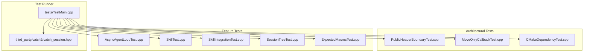

**Diagram sources**
- [tests/TestMain.cpp:1-6](file://tests/TestMain.cpp#L1-L6)
- [third_party/catch2/catch_session.hpp](file://third_party/catch2/catch_session.hpp)
- [tests/architecture/PublicHeaderBoundaryTest.cpp:1-65](file://tests/architecture/PublicHeaderBoundaryTest.cpp#L1-L65)
- [tests/architecture/MoveOnlyCallbackTest.cpp:1-71](file://tests/architecture/MoveOnlyCallbackTest.cpp#L1-L71)
- [tests/architecture/CMakeDependencyTest.cpp:1-124](file://tests/architecture/CMakeDependencyTest.cpp#L1-L124)
- [tests/agent/AsyncAgentLoopTest.cpp:1-1605](file://tests/agent/AsyncAgentLoopTest.cpp#L1-L1605)
- [tests/coding_agent/SkillTest.cpp:1-109](file://tests/coding_agent/SkillTest.cpp#L1-L109)
- [tests/coding_agent/SkillIntegrationTest.cpp:1-148](file://tests/coding_agent/SkillIntegrationTest.cpp#L1-L148)
- [tests/harness/session/SessionTreeTest.cpp:1-600](file://tests/harness/session/SessionTreeTest.cpp#L1-L600)
- [tests/util/ExpectedMacrosTest.cpp:1-115](file://tests/util/ExpectedMacrosTest.cpp#L1-L115)

**Section sources**
- [README.md:280-302](file://README.md#L280-L302)
- [CMakeLists.txt:153-211](file://CMakeLists.txt#L153-L211)

## Core Components
- Test runner entry point: A minimal main that delegates to the test session.
- Lightweight test framework: A small Catch-compatible macro and registrar system for registering and running tests.
- Test categories:
  - Unit tests for individual components (agent, AI contracts, utilities).
  - Integration tests validating end-to-end flows (skills, session tree, CLI smoke).
  - Architectural tests enforcing public header contracts, move-only semantics, and CMake dependency directions.

Key test execution patterns:
- Tagged test cases grouped by feature and quality level (e.g., [agent][async], [coding_agent][skill-integration]).
- Targeted execution via test filters (e.g., "[architecture]", "[agent][async]").
- Utilities for temporary workspaces and deterministic test fixtures.

**Section sources**
- [tests/TestMain.cpp:1-6](file://tests/TestMain.cpp#L1-L6)
- [third_party/catch2/catch_test_macros.hpp:1-71](file://third_party/catch2/catch_test_macros.hpp#L1-L71)
- [README.md:280-302](file://README.md#L280-L302)

## Architecture Overview
The test architecture enforces:
- Public header boundary: Only public headers are compiled and exercised in tests.
- Move-only callback semantics: Event sinks and hooks are move-only to avoid shared ownership overhead.
- Package dependency direction: CMake target link order reflects logical dependency direction.
- Provider isolation: AI provider implementations remain beneath the AI package boundary.

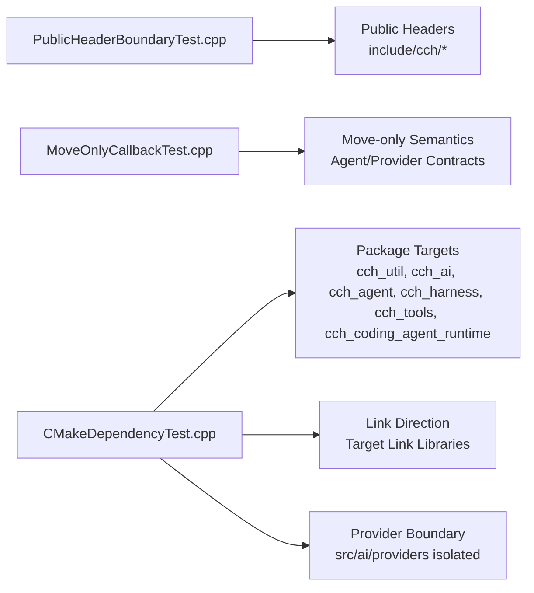

**Diagram sources**
- [tests/architecture/PublicHeaderBoundaryTest.cpp:1-65](file://tests/architecture/PublicHeaderBoundaryTest.cpp#L1-L65)
- [tests/architecture/MoveOnlyCallbackTest.cpp:1-71](file://tests/architecture/MoveOnlyCallbackTest.cpp#L1-L71)
- [tests/architecture/CMakeDependencyTest.cpp:1-124](file://tests/architecture/CMakeDependencyTest.cpp#L1-L124)
- [CMakeLists.txt:33-138](file://CMakeLists.txt#L33-L138)

## Detailed Component Analysis

### Test Runner and Framework
- The test executable aggregates all test sources and links against the library targets.
- The main entry point delegates to a test session that runs registered tests.
- A minimal Catch-compatible macro system registers test cases and assertions.

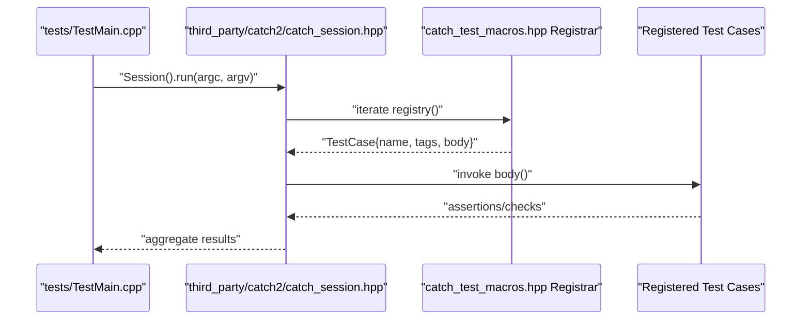

**Diagram sources**
- [tests/TestMain.cpp:1-6](file://tests/TestMain.cpp#L1-L6)
- [third_party/catch2/catch_session.hpp](file://third_party/catch2/catch_session.hpp)
- [third_party/catch2/catch_test_macros.hpp:1-71](file://third_party/catch2/catch_test_macros.hpp#L1-L71)

**Section sources**
- [tests/TestMain.cpp:1-6](file://tests/TestMain.cpp#L1-L6)
- [third_party/catch2/catch_test_macros.hpp:1-71](file://third_party/catch2/catch_test_macros.hpp#L1-L71)

### Public Header Boundary Validation
Purpose:
- Ensure public headers compile cleanly from the include contract surface.
- Validate that public contracts remain value and interface oriented (e.g., variants, abstract interfaces, move-only types).

Key checks:
- Compilation of representative public header includes.
- Static assertions for move-only and abstract types.
- Basic functional checks using public types.

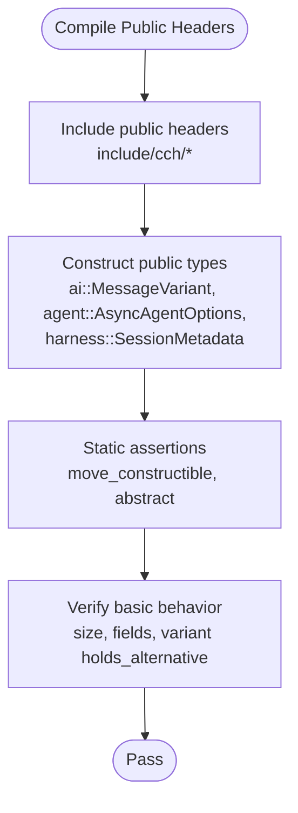

**Diagram sources**
- [tests/architecture/PublicHeaderBoundaryTest.cpp:1-65](file://tests/architecture/PublicHeaderBoundaryTest.cpp#L1-L65)

**Section sources**
- [tests/architecture/PublicHeaderBoundaryTest.cpp:1-65](file://tests/architecture/PublicHeaderBoundaryTest.cpp#L1-L65)

### Move-Only Callback Semantics
Purpose:
- Enforce move-only event sinks and hooks to prevent accidental copying and shared ownership.
- Validate that callbacks can own unique state and propagate errors.

Key checks:
- Static assertions ensuring types are move-only and not copyable.
- Runtime validation that captured state is moved and handlers can mutate captured state.
- Handlers for body chunks and agent lifecycle events.

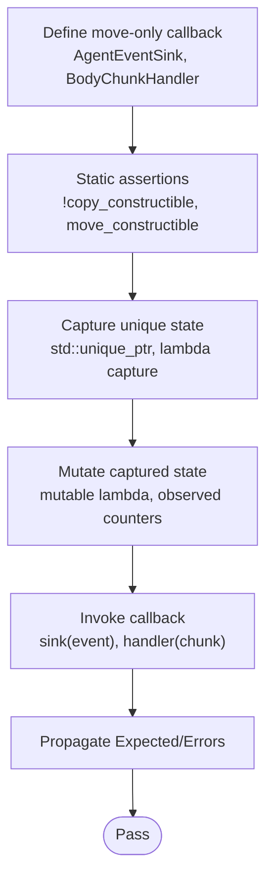

**Diagram sources**
- [tests/architecture/MoveOnlyCallbackTest.cpp:1-71](file://tests/architecture/MoveOnlyCallbackTest.cpp#L1-L71)

**Section sources**
- [tests/architecture/MoveOnlyCallbackTest.cpp:1-71](file://tests/architecture/MoveOnlyCallbackTest.cpp#L1-L71)

### CMake Dependency Management
Purpose:
- Validate that package-style targets are declared and linked in the intended direction.
- Ensure provider implementations remain beneath the AI package boundary.

Key checks:
- Presence of core targets (cch_util, cch_ai, cch_agent, cch_harness, cch_tools, cch_coding_agent_runtime).
- Link direction correctness among targets.
- Provider files do not reference runtime or tooling targets.

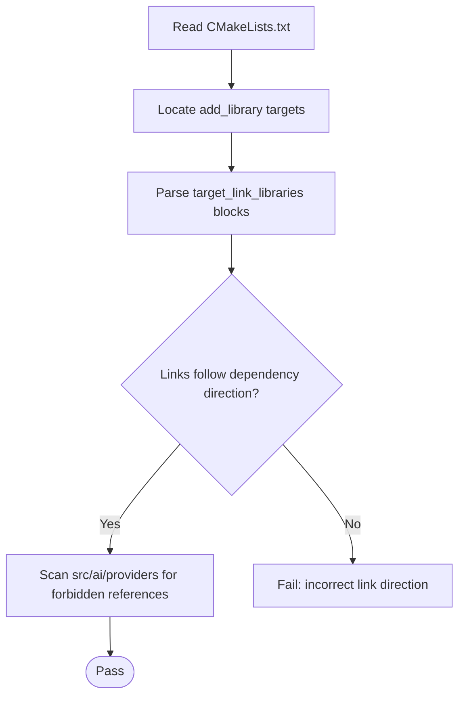

**Diagram sources**
- [tests/architecture/CMakeDependencyTest.cpp:1-124](file://tests/architecture/CMakeDependencyTest.cpp#L1-L124)
- [CMakeLists.txt:33-138](file://CMakeLists.txt#L33-L138)

**Section sources**
- [tests/architecture/CMakeDependencyTest.cpp:1-124](file://tests/architecture/CMakeDependencyTest.cpp#L1-L124)
- [CMakeLists.txt:33-138](file://CMakeLists.txt#L33-L138)

### Agent Loop: Unit and Integration Behaviors
Purpose:
- Validate asynchronous agent loop lifecycle, tool execution, and hook behaviors.
- Ensure deterministic event emission and error propagation.

Key aspects validated:
- Deterministic lifecycle events for text and thinking/tool-call streams.
- Tool call execution, argument parsing, and tool result injection.
- Policy hooks (before/after tool call) and termination hints.
- Transform/conversion hooks for context pruning and LLM message filtering.
- Concurrency and error propagation in parallel tool execution.

```mermaid
sequenceDiagram
participant Test as "AsyncAgentLoopTest.cpp"
participant Loop as "AsyncAgentLoop"
participant Client as "StreamingChatClient"
participant Registry as "AsyncToolRegistry"
participant Tool as "AsyncAgentTool"
Test->>Client : "configure fake responses"
Test->>Registry : "register tools"
Test->>Loop : "run(prompt, event_sink)"
Loop->>Client : "stream(model_request)"
Client-->>Loop : "TextDelta/ThinkingDelta/ToolCallStart/Delta/End"
Loop->>Registry : "find tool by name"
Registry-->>Loop : "tool definition"
Loop->>Tool : "execute(tool_invocation)"
Tool-->>Loop : "tool result"
Loop-->>Test : "emit lifecycle events"
Loop-->>Test : "return run result"
```

**Diagram sources**
- [tests/agent/AsyncAgentLoopTest.cpp:1-1605](file://tests/agent/AsyncAgentLoopTest.cpp#L1-L1605)

**Section sources**
- [tests/agent/AsyncAgentLoopTest.cpp:1-1605](file://tests/agent/AsyncAgentLoopTest.cpp#L1-L1605)

### Utility Macros: Expected Monads and Error Propagation
Purpose:
- Validate the CCH_TRY and CCH_TRY_VOID macros for composing awaitables and propagating errors.
- Ensure correct scoping and move semantics.

Key checks:
- Successful unwrapping continues execution.
- Failure short-circuits and propagates error codes/messages.
- Multiple uses in the same scope and moved values do not collide.

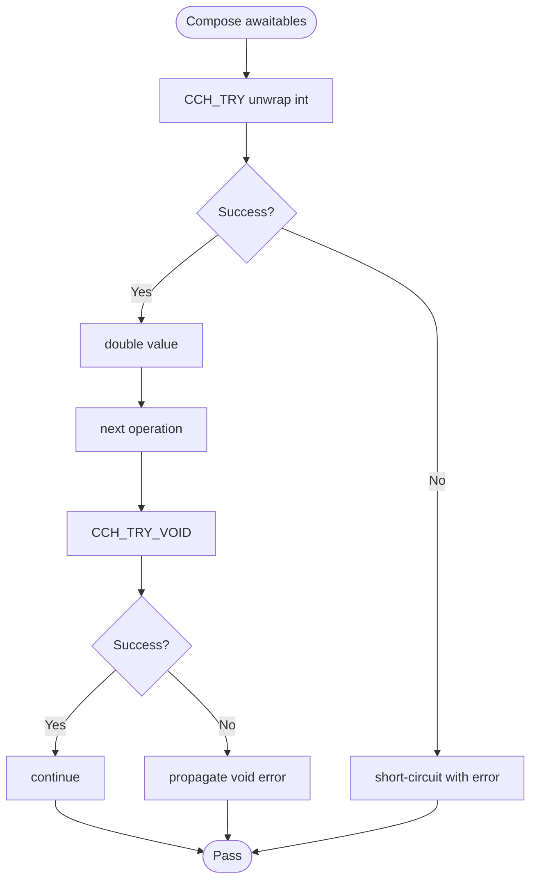

**Diagram sources**
- [tests/util/ExpectedMacrosTest.cpp:1-115](file://tests/util/ExpectedMacrosTest.cpp#L1-L115)

**Section sources**
- [tests/util/ExpectedMacrosTest.cpp:1-115](file://tests/util/ExpectedMacrosTest.cpp#L1-L115)

### Skills: Unit and Integration
Purpose:
- Validate skill data structures, diagnostics, and prompt integration.
- Ensure skill commands expand correctly and integrate with prompt processing.

Key checks:
- Skill aggregate construction and field access.
- Diagnostic construction and default values.
- Integration of formatting and expansion with workspace I/O and prompt processing.

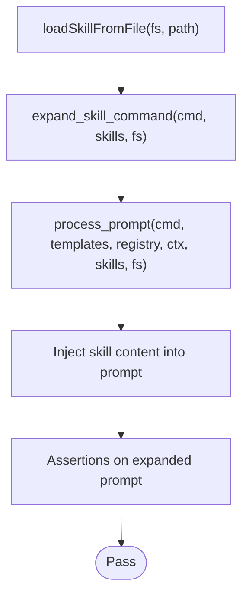

**Diagram sources**
- [tests/coding_agent/SkillTest.cpp:1-109](file://tests/coding_agent/SkillTest.cpp#L1-L109)
- [tests/coding_agent/SkillIntegrationTest.cpp:1-148](file://tests/coding_agent/SkillIntegrationTest.cpp#L1-L148)

**Section sources**
- [tests/coding_agent/SkillTest.cpp:1-109](file://tests/coding_agent/SkillTest.cpp#L1-L109)
- [tests/coding_agent/SkillIntegrationTest.cpp:1-148](file://tests/coding_agent/SkillIntegrationTest.cpp#L1-L148)

### Session Tree: Navigation and Context Reconstruction
Purpose:
- Validate session tree construction, leaf tracking, branching, and context reconstruction.
- Ensure compaction-aware context building and branch summary hooks.

Key checks:
- Construction from loaded sessions and lookup by entry ID.
- Branch navigation and leaf switching.
- Context reconstruction respecting model/thinking level and compaction summaries.
- Branch summary generation and append behavior.

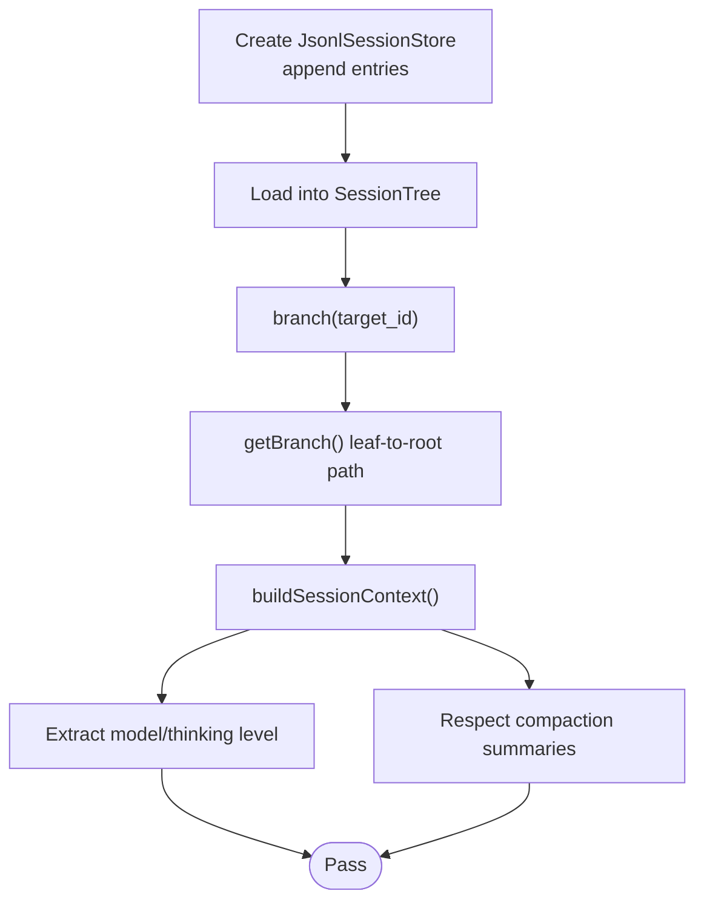

**Diagram sources**
- [tests/harness/session/SessionTreeTest.cpp:1-600](file://tests/harness/session/SessionTreeTest.cpp#L1-L600)

**Section sources**
- [tests/harness/session/SessionTreeTest.cpp:1-600](file://tests/harness/session/SessionTreeTest.cpp#L1-L600)

### Test Infrastructure Utilities
- Temporary workspace: Creates a unique temp directory, writes/reads files, and cleans up on destruction.
- Used extensively in integration tests to isolate file system operations.

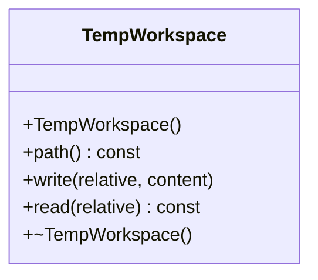

**Diagram sources**
- [tests/support/TempWorkspace.hpp:1-44](file://tests/support/TempWorkspace.hpp#L1-L44)

**Section sources**
- [tests/support/TempWorkspace.hpp:1-44](file://tests/support/TempWorkspace.hpp#L1-L44)

## Dependency Analysis
The test suite depends on:
- The library targets defined in CMake (cch_util, cch_ai, cch_agent, cch_harness, cch_tools, cch_coding_agent_runtime).
- The test runner executable links against the same libraries as the main binary to exercise the same code paths.

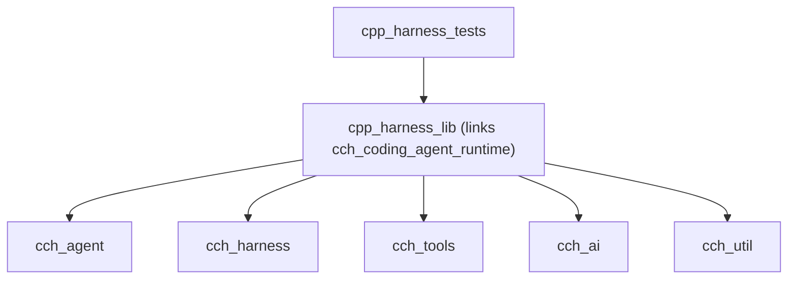

**Diagram sources**
- [CMakeLists.txt:140-149](file://CMakeLists.txt#L140-L149)
- [CMakeLists.txt:193-209](file://CMakeLists.txt#L193-L209)

**Section sources**
- [CMakeLists.txt:140-149](file://CMakeLists.txt#L140-L149)
- [CMakeLists.txt:193-209](file://CMakeLists.txt#L193-L209)

## Performance Considerations
- Tests use lightweight coroutines and in-memory operations to minimize overhead.
- Integration tests rely on temporary file systems to avoid external I/O latency.
- Assertions focus on correctness rather than timing; performance-sensitive validations are deferred to benchmarks outside this suite.

## Troubleshooting Guide
Common issues and resolutions:
- Missing API keys or invalid provider configuration: Ensure environment variables and base URLs match the provider’s requirements.
- Authentication failures: Verify keys are valid for the selected provider and model.
- Rate limits or quotas: Retry later or adjust subscription/entitlement.
- Incorrect provider routing: Confirm the base URL and model flags are set consistently.
- Session or workspace errors: Validate paths and permissions; use temporary workspaces for isolation.

Operational tips:
- Use the provided bootstrap scripts to configure dependencies and presets.
- Run targeted test suites using tag filters to quickly isolate failing areas.
- For live provider tests, use the optional smoke script with explicit opt-in.

**Section sources**
- [README.md:115-134](file://README.md#L115-L134)

## Conclusion
The testing and quality assurance strategy combines unit, integration, and architectural tests to ensure correctness, maintainability, and adherence to the project’s anti-fragile design principles. The lightweight test framework enables rapid feedback, while architectural gates protect public contracts and dependency boundaries. Targeted test execution and robust utilities facilitate efficient development and debugging.

## Appendices

### How to Run Specific Test Suites
- Run all architecture tests: [architecture]
- Run agent async tests: [agent][async]
- Run AI unit tests: [ai][u2]
- Run provider tests: [ai][provider]
- Run tools async tests: [tools][async]
- Run harness session tests: [harness][session]
- Run CLI smoke tests: [cli]

Examples:
- ./build/cpp_harness_tests "[architecture]"
- ./build/cpp_harness_tests "[agent][async]"
- ./build/cpp_harness_tests "[coding_agent][skill-integration]"

**Section sources**
- [README.md:280-302](file://README.md#L280-L302)

### Writing Tests for New Components
Guidelines:
- Place unit tests under the appropriate feature folder (e.g., tests/agent, tests/ai).
- Use descriptive test names and tags to categorize by feature and quality level.
- Prefer deterministic fixtures and temporary workspaces for I/O-dependent tests.
- Validate both functional behavior and architectural constraints (e.g., move-only semantics, public header contracts).
- Add integration tests when component interactions span multiple subsystems.

Utilities to reuse:
- tests/support/TempWorkspace.hpp for isolated file system operations.
- Third-party test macros for assertions and test registration.

**Section sources**
- [tests/support/TempWorkspace.hpp:1-44](file://tests/support/TempWorkspace.hpp#L1-L44)
- [third_party/catch2/catch_test_macros.hpp:1-71](file://third_party/catch2/catch_test_macros.hpp#L1-L71)