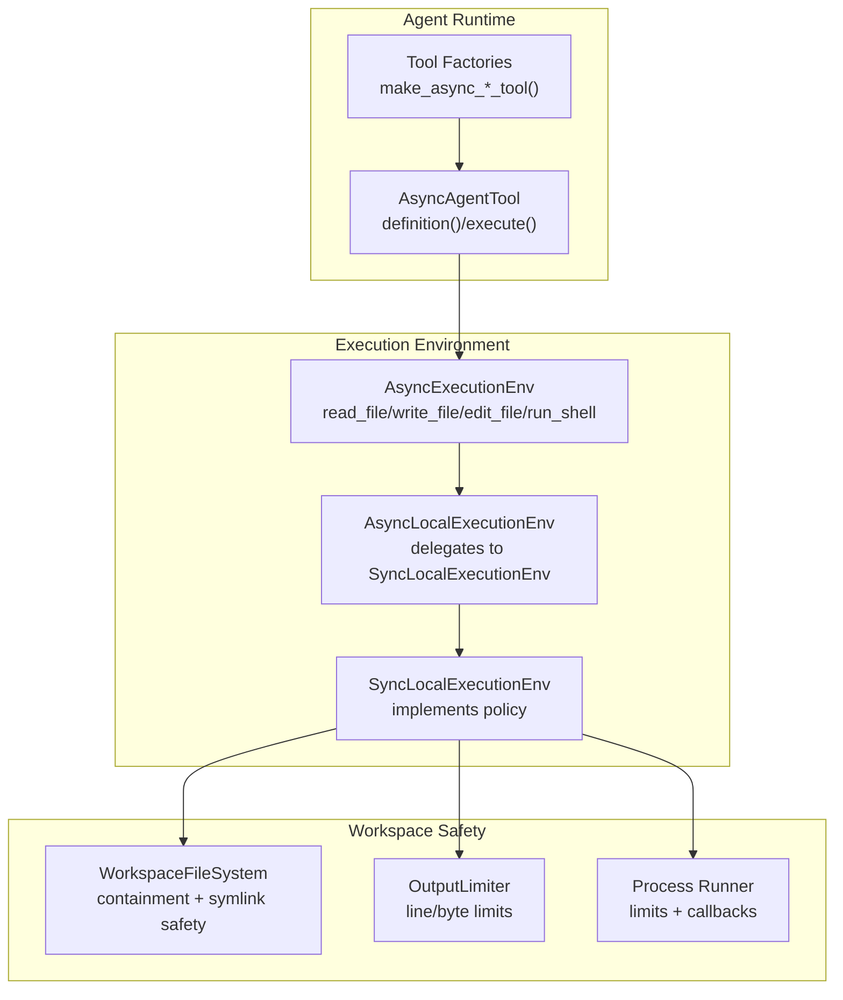
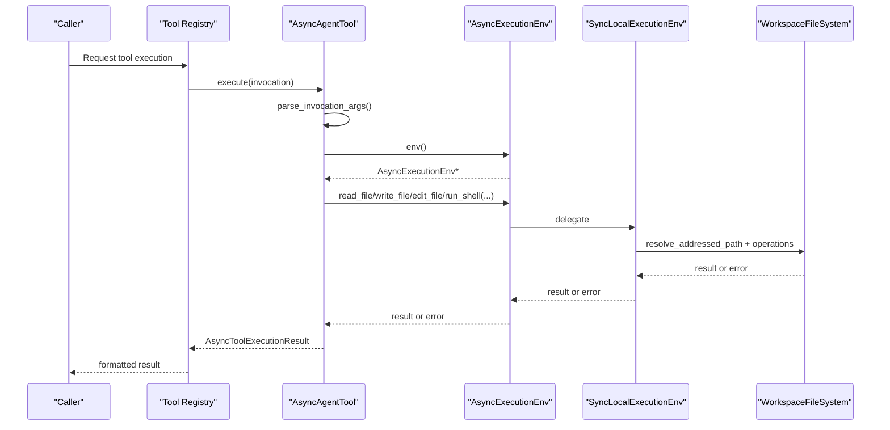
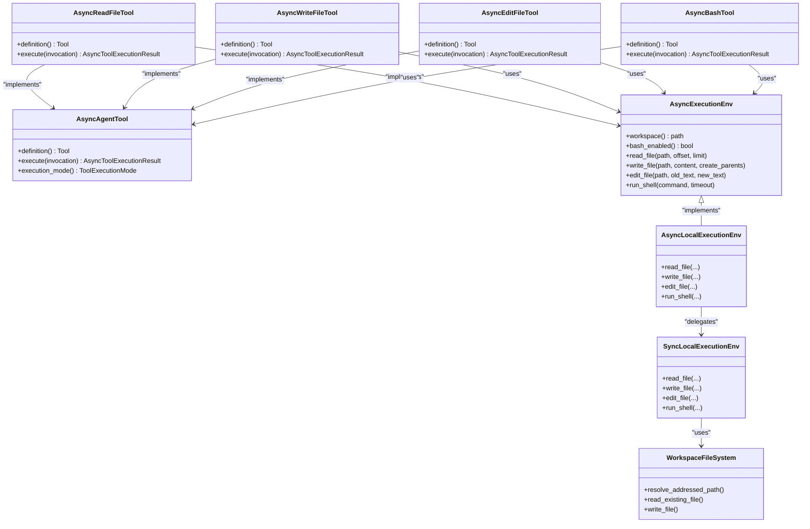

# Built-in Tools

<cite>
**Referenced Files in This Document**
- [ToolFactories.hpp](file://include/cch/tools/ToolFactories.hpp)
- [AsyncToolFactories.cpp](file://src/tools/AsyncToolFactories.cpp)
- [AgentTool.hpp](file://include/cch/agent/AgentTool.hpp)
- [ExecutionEnv.hpp](file://include/cch/harness/ExecutionEnv.hpp)
- [LocalExecutionEnv.hpp](file://include/cch/harness/LocalExecutionEnv.hpp)
- [AsyncLocalExecutionEnv.cpp](file://src/harness/AsyncLocalExecutionEnv.cpp)
- [SyncLocalExecutionEnv.cpp](file://src/harness/SyncLocalExecutionEnv.cpp)
- [WorkspaceFileSystem.hpp](file://src/harness/WorkspaceFileSystem.hpp)
- [OutputLimiter.hpp](file://src/util/OutputLimiter.hpp)
- [Process.cpp](file://src/util/Process.cpp)
- [SessionFactory.cpp](file://src/coding_agent/runtime/SessionFactory.cpp)
</cite>

## Table of Contents
1. [Introduction](#introduction)
2. [Project Structure](#project-structure)
3. [Core Components](#core-components)
4. [Architecture Overview](#architecture-overview)
5. [Detailed Component Analysis](#detailed-component-analysis)
6. [Dependency Analysis](#dependency-analysis)
7. [Performance Considerations](#performance-considerations)
8. [Troubleshooting Guide](#troubleshooting-guide)
9. [Conclusion](#conclusion)

## Introduction
This document describes the four built-in tools exposed by the agent runtime: read_file, write_file, edit_file, and bash. It explains each tool’s purpose, parameter schema, validation rules, security restrictions enforced by the execution environment, execution behavior, error handling, output formatting, and performance characteristics. It also covers how these tools integrate with the execution environment and enforces security boundaries via workspace containment and symlink safety.

## Project Structure
The built-in tools are implemented as asynchronous agent tools backed by an execution environment abstraction. Factory functions construct tool instances bound to a specific execution environment. The execution environment delegates to a local implementation that enforces workspace containment and shell safety.

**Diagram sources**
- [ToolFactories.hpp:10-13](file://include/cch/tools/ToolFactories.hpp#L10-L13)
- [AsyncToolFactories.cpp:404-418](file://src/tools/AsyncToolFactories.cpp#L404-L418)
- [AgentTool.hpp:64-76](file://include/cch/agent/AgentTool.hpp#L64-L76)
- [ExecutionEnv.hpp:198-221](file://include/cch/harness/ExecutionEnv.hpp#L198-L221)
- [LocalExecutionEnv.hpp:10-34](file://include/cch/harness/LocalExecutionEnv.hpp#L10-L34)
- [AsyncLocalExecutionEnv.cpp:10-63](file://src/harness/AsyncLocalExecutionEnv.cpp#L10-L63)
- [SyncLocalExecutionEnv.cpp:81-221](file://src/harness/SyncLocalExecutionEnv.cpp#L81-L221)
- [WorkspaceFileSystem.hpp:47-68](file://src/harness/WorkspaceFileSystem.hpp#L47-L68)
- [OutputLimiter.hpp:9-17](file://src/util/OutputLimiter.hpp#L9-L17)
- [Process.cpp:27-66](file://src/util/Process.cpp#L27-L66)

**Section sources**
- [ToolFactories.hpp:10-13](file://include/cch/tools/ToolFactories.hpp#L10-L13)
- [AsyncToolFactories.cpp:404-418](file://src/tools/AsyncToolFactories.cpp#L404-L418)
- [AgentTool.hpp:64-76](file://include/cch/agent/AgentTool.hpp#L64-L76)
- [ExecutionEnv.hpp:198-221](file://include/cch/harness/ExecutionEnv.hpp#L198-L221)
- [LocalExecutionEnv.hpp:10-34](file://include/cch/harness/LocalExecutionEnv.hpp#L10-L34)
- [AsyncLocalExecutionEnv.cpp:10-63](file://src/harness/AsyncLocalExecutionEnv.cpp#L10-L63)
- [SyncLocalExecutionEnv.cpp:81-221](file://src/harness/SyncLocalExecutionEnv.cpp#L81-L221)
- [WorkspaceFileSystem.hpp:47-68](file://src/harness/WorkspaceFileSystem.hpp#L47-L68)
- [OutputLimiter.hpp:9-17](file://src/util/OutputLimiter.hpp#L9-L17)
- [Process.cpp:27-66](file://src/util/Process.cpp#L27-L66)

## Core Components
- read_file: Reads a text file from the workspace with offset/limit pagination and truncation hints.
- write_file: Creates or overwrites a text file in the workspace, auto-creating parent directories when needed.
- edit_file: Performs exact-text replacements across one or more edits against the original file content, ensuring uniqueness and no overlap.
- bash: Executes shell commands within the workspace, enforcing enablement, timeouts, and output limits.

Each tool defines a JSON schema for its parameters and returns a standardized tool execution result with content, optional details, and error flags.

**Section sources**
- [AsyncToolFactories.cpp:79-116](file://src/tools/AsyncToolFactories.cpp#L79-L116)
- [AsyncToolFactories.cpp:122-152](file://src/tools/AsyncToolFactories.cpp#L122-L152)
- [AsyncToolFactories.cpp:158-288](file://src/tools/AsyncToolFactories.cpp#L158-L288)
- [AsyncToolFactories.cpp:294-400](file://src/tools/AsyncToolFactories.cpp#L294-L400)

## Architecture Overview
The tools are registered per-user configuration and executed through the agent runtime. Each tool parses its arguments, validates them, and invokes the execution environment. The execution environment enforces workspace containment, symlink safety, and shell enablement. Outputs are truncated according to configured limits, and errors are mapped to stable error codes.

**Diagram sources**
- [AgentTool.hpp:69-70](file://include/cch/agent/AgentTool.hpp#L69-L70)
- [ExecutionEnv.hpp:207-221](file://include/cch/harness/ExecutionEnv.hpp#L207-L221)
- [AsyncLocalExecutionEnv.cpp:30-63](file://src/harness/AsyncLocalExecutionEnv.cpp#L30-L63)
- [SyncLocalExecutionEnv.cpp:96-145](file://src/harness/SyncLocalExecutionEnv.cpp#L96-L145)
- [WorkspaceFileSystem.hpp:47-68](file://src/harness/WorkspaceFileSystem.hpp#L47-L68)

## Detailed Component Analysis

### read_file
Purpose
- Safely read a text file from the workspace with pagination and truncation hints.

Parameters
- path: Workspace-relative file path (required).
- offset: 1-based line offset (default 1).
- limit: Maximum number of lines to read (default 0, meaning no limit).

Validation and Security
- Enforced by the execution environment and workspace filesystem:
  - Workspace containment: rejects absolute paths and escapes (“..”).
  - Symlink safety: refuses to read through final symlinks.
  - Regular file requirement: only regular files are readable.
- Offset normalization ensures non-negative start positions.

Execution Behavior
- Reads lines incrementally up to limit or output limits.
- Returns content with a continuation hint appended when truncated.

Error Handling
- Propagates workspace/file errors with descriptive messages.
- On error, returns an error result with the message.

Output Formatting
- Plain text content.
- When truncated, appends a hint indicating next offset to continue.

Integration Notes
- Uses the execution environment’s read_file with offset/limit.
- Honors output limits via the execution environment’s internal limiter.

Practical Examples
- Read first 2000 lines from a file.
- Paginate by increasing offset until completion.
- Handle “path escapes workspace” and “not a regular file” errors.

Edge Cases
- Empty file yields empty content.
- Very long file is truncated to configured limits with a tail hint.

Security Boundary Enforcement
- Workspace containment and symlink safety enforced during resolution and read.

Performance Considerations
- Line-by-line streaming reduces memory overhead.
- Output truncation prevents excessive memory usage.

**Section sources**
- [AsyncToolFactories.cpp:79-116](file://src/tools/AsyncToolFactories.cpp#L79-L116)
- [ExecutionEnv.hpp:207-210](file://include/cch/harness/ExecutionEnv.hpp#L207-L210)
- [WorkspaceFileSystem.hpp:74-132](file://src/harness/WorkspaceFileSystem.hpp#L74-L132)
- [OutputLimiter.hpp:19-48](file://src/util/OutputLimiter.hpp#L19-L48)

### write_file
Purpose
- Create or overwrite a text file in the workspace.

Parameters
- path: Workspace-relative file path (required).
- content: File content (required).

Validation and Security
- Workspace containment and parent directory safety:
  - Parent directories are created when missing if permitted.
  - Rejects writing through final symlinks.
  - Rejects writing to non-regular files.
  - Parent path must not escape workspace and must not contain unsafe symlinks.

Execution Behavior
- Writes atomically via the workspace filesystem.
- Returns the number of bytes written.

Error Handling
- Propagates workspace/file errors with descriptive messages.
- On error, returns an error result with the message.

Output Formatting
- Returns a summary message indicating bytes written.

Integration Notes
- Uses the execution environment’s write_file with create_parents flag.

Practical Examples
- Initialize a new config file.
- Overwrite an existing log file.
- Handle permission errors and containment violations.

Edge Cases
- Writing to a path that escapes workspace or contains “..”.
- Parent directory creation failures.

Security Boundary Enforcement
- Workspace containment and symlink safety enforced during write.

Performance Considerations
- Atomic write minimizes partial writes.
- Large content is handled in-memory; consider splitting large writes.

**Section sources**
- [AsyncToolFactories.cpp:122-152](file://src/tools/AsyncToolFactories.cpp#L122-L152)
- [ExecutionEnv.hpp:212-214](file://include/cch/harness/ExecutionEnv.hpp#L212-L214)
- [WorkspaceFileSystem.hpp:134-182](file://src/harness/WorkspaceFileSystem.hpp#L134-L182)

### edit_file
Purpose
- Replace exact text regions inside a workspace file with one or more edits.
- Ensures each edit matches exactly once in the original file.

Parameters
- path: Workspace-relative file path (required).
- edits: Array of edit entries, each with oldText and newText (required).
- old_text/new_text: Legacy single-edit fallback (optional; mutually exclusive with edits array).

Validation and Security
- Workspace containment and symlink safety enforced during read and write.
- Each edit must specify non-empty oldText.
- oldText must appear exactly once in the original file; overlapping edits are rejected conceptually by applying edits against the original content.

Execution Behavior
- Reads the original file content.
- Validates each edit against the original content:
  - oldText must occur exactly once.
  - Applies replacements sequentially to produce a working copy.
- Writes the modified content back to disk.

Error Handling
- On invalid arguments, returns an error result with a descriptive message.
- On edit mismatches (not found or multiple matches), returns an error result.
- On write failures, returns an error result.

Output Formatting
- Returns a success message indicating number of replacements.
- Includes a simple line-diff preview showing first changed region with context.

Integration Notes
- Uses read_file to fetch original content and write_file to persist changes.
- Legacy single-edit mode converts old_text/new_text into a single-element edits array.

Practical Examples
- Replace a function signature across a single occurrence.
- Apply multiple independent edits in a single operation.
- Handle cases where oldText appears multiple times or not at all.

Edge Cases
- Empty edits array.
- Empty oldText in an edit.
- Overlapping or ambiguous replacements.

Security Boundary Enforcement
- Workspace containment and symlink safety enforced during read and write.

Performance Considerations
- Scans the entire file to count occurrences; avoid very large files for single edits.
- Sequential replacement preserves order; consider the impact of earlier replacements on later positions.

**Section sources**
- [AsyncToolFactories.cpp:158-288](file://src/tools/AsyncToolFactories.cpp#L158-L288)
- [ExecutionEnv.hpp:207-214](file://include/cch/harness/ExecutionEnv.hpp#L207-L214)
- [WorkspaceFileSystem.hpp:134-182](file://src/harness/WorkspaceFileSystem.hpp#L134-L182)

### bash
Purpose
- Run a shell command in the workspace when explicitly enabled.

Parameters
- command: Shell command (required).
- timeout: Optional timeout in seconds (no default implies no timeout).

Validation and Security
- Shell enablement: Requires explicit enablement in the execution environment; disabled by default.
- Working directory: If overridden, must resolve to a workspace-contained directory; rejects non-directories and escapes.
- Environment sanitization: Passes a sanitized environment, excluding secret-like names unless explicitly allowed.
- Output limits: Applies line/byte limits and strips ANSI escape sequences.

Execution Behavior
- Builds a process request with workspace working directory, sanitized environment, and optional timeout.
- Executes asynchronously and captures output.
- Truncates output to configured limits and optionally writes the full output to a workspace file.

Error Handling
- If shell is disabled, returns an error result indicating disablement.
- Maps process errors to stable execution error codes (timeout, spawn error, callback error).
- On error, returns an error result with the message.

Output Formatting
- Returns exit_code and flags (timed_out, truncated) followed by the processed output.
- Strips ANSI escape sequences from output.
- When truncated, indicates last N bytes and optionally the path to the saved full output.

Integration Notes
- Uses the execution environment’s run_shell or exec depending on the tool variant.
- Honors per-invocation timeout and global limits.

Practical Examples
- Run a build script with a 30-second timeout.
- Execute a lint command and review truncated output.
- Handle timeout and permission-denied errors.

Edge Cases
- Command string with embedded secrets (not redacted by this tool).
- Very long output exceeding limits.
- Working directory override pointing outside workspace.

Security Boundary Enforcement
- Shell enablement gate, workspace-contained working directory, sanitized environment, and output limits.

Performance Considerations
- Output capture is streamed with line/byte limits to prevent memory pressure.
- Optional callbacks for stdout/stderr incur overhead; use only when necessary.

**Section sources**
- [AsyncToolFactories.cpp:294-400](file://src/tools/AsyncToolFactories.cpp#L294-L400)
- [ExecutionEnv.hpp:219-221](file://include/cch/harness/ExecutionEnv.hpp#L219-L221)
- [LocalExecutionEnv.hpp:32-34](file://include/cch/harness/LocalExecutionEnv.hpp#L32-L34)
- [AsyncLocalExecutionEnv.cpp:51-63](file://src/harness/AsyncLocalExecutionEnv.cpp#L51-L63)
- [SyncLocalExecutionEnv.cpp:173-221](file://src/harness/SyncLocalExecutionEnv.cpp#L173-L221)
- [WorkspaceFileSystem.hpp:302-315](file://src/harness/WorkspaceFileSystem.hpp#L302-L315)
- [OutputLimiter.hpp:19-48](file://src/util/OutputLimiter.hpp#L19-L48)
- [Process.cpp:34-66](file://src/util/Process.cpp#L34-L66)

## Dependency Analysis
The tool implementations depend on the agent tool interface and the execution environment. The execution environment delegates to a local implementation that enforces workspace containment and shell safety. The workspace filesystem centralizes containment and symlink safety.

**Diagram sources**
- [AgentTool.hpp:64-76](file://include/cch/agent/AgentTool.hpp#L64-L76)
- [AsyncToolFactories.cpp:75-400](file://src/tools/AsyncToolFactories.cpp#L75-L400)
- [ExecutionEnv.hpp:198-334](file://include/cch/harness/ExecutionEnv.hpp#L198-L334)
- [LocalExecutionEnv.hpp:10-83](file://include/cch/harness/LocalExecutionEnv.hpp#L10-L83)
- [AsyncLocalExecutionEnv.cpp:10-179](file://src/harness/AsyncLocalExecutionEnv.cpp#L10-L179)
- [SyncLocalExecutionEnv.cpp:81-397](file://src/harness/SyncLocalExecutionEnv.cpp#L81-L397)
- [WorkspaceFileSystem.hpp:31-819](file://src/harness/WorkspaceFileSystem.hpp#L31-L819)

**Section sources**
- [AgentTool.hpp:64-76](file://include/cch/agent/AgentTool.hpp#L64-L76)
- [AsyncToolFactories.cpp:75-400](file://src/tools/AsyncToolFactories.cpp#L75-L400)
- [ExecutionEnv.hpp:198-334](file://include/cch/harness/ExecutionEnv.hpp#L198-L334)
- [LocalExecutionEnv.hpp:10-83](file://include/cch/harness/LocalExecutionEnv.hpp#L10-L83)
- [AsyncLocalExecutionEnv.cpp:10-179](file://src/harness/AsyncLocalExecutionEnv.cpp#L10-L179)
- [SyncLocalExecutionEnv.cpp:81-397](file://src/harness/SyncLocalExecutionEnv.cpp#L81-L397)
- [WorkspaceFileSystem.hpp:31-819](file://src/harness/WorkspaceFileSystem.hpp#L31-L819)

## Performance Considerations
- read_file: Streams lines and honors output limits to avoid loading entire files into memory. Pagination via offset/limit enables incremental retrieval.
- write_file: Uses atomic writes to minimize partial writes and potential corruption.
- edit_file: Scans the file to validate uniqueness of each edit; for very large files, consider splitting edits or avoiding single-shot replacements.
- bash: Streams output with line/byte limits and strips ANSI sequences. Optional callbacks add overhead; timeouts prevent runaway processes.

[No sources needed since this section provides general guidance]

## Troubleshooting Guide
Common issues and resolutions:
- Path escapes workspace or contains “..”: Indicates containment violation; adjust path to stay within the workspace root.
- Not a regular file: Attempted read/write on directory or symlink; use a regular file path.
- Parent directory does not exist: Enable automatic parent creation or create directories beforehand.
- Bash disabled: Re-run with explicit bash enablement; shell operations are gated by configuration.
- Timeout: Increase timeout or simplify the command; output may be truncated.
- Multiple matches for edit: Ensure oldText is unique; split into separate edits if needed.
- Callback errors: Fix callback logic; errors in callbacks propagate as execution errors.

**Section sources**
- [WorkspaceFileSystem.hpp:47-68](file://src/harness/WorkspaceFileSystem.hpp#L47-L68)
- [WorkspaceFileSystem.hpp:74-132](file://src/harness/WorkspaceFileSystem.hpp#L74-L132)
- [WorkspaceFileSystem.hpp:134-182](file://src/harness/WorkspaceFileSystem.hpp#L134-L182)
- [SyncLocalExecutionEnv.cpp:173-221](file://src/harness/SyncLocalExecutionEnv.cpp#L173-L221)
- [SyncLocalExecutionEnv.cpp:295-346](file://src/harness/SyncLocalExecutionEnv.cpp#L295-L346)
- [OutputLimiter.hpp:19-48](file://src/util/OutputLimiter.hpp#L19-L48)
- [Process.cpp:34-66](file://src/util/Process.cpp#L34-L66)

## Conclusion
The built-in tools provide safe, controlled access to workspace files and shell execution. They enforce strong security boundaries via workspace containment and symlink safety, apply output limits to protect performance, and offer clear error reporting. Use read_file for paginated access, write_file for controlled writes, edit_file for precise textual edits, and bash for workspace-scoped command execution with timeouts and sanitization.

[No sources needed since this section summarizes without analyzing specific files]