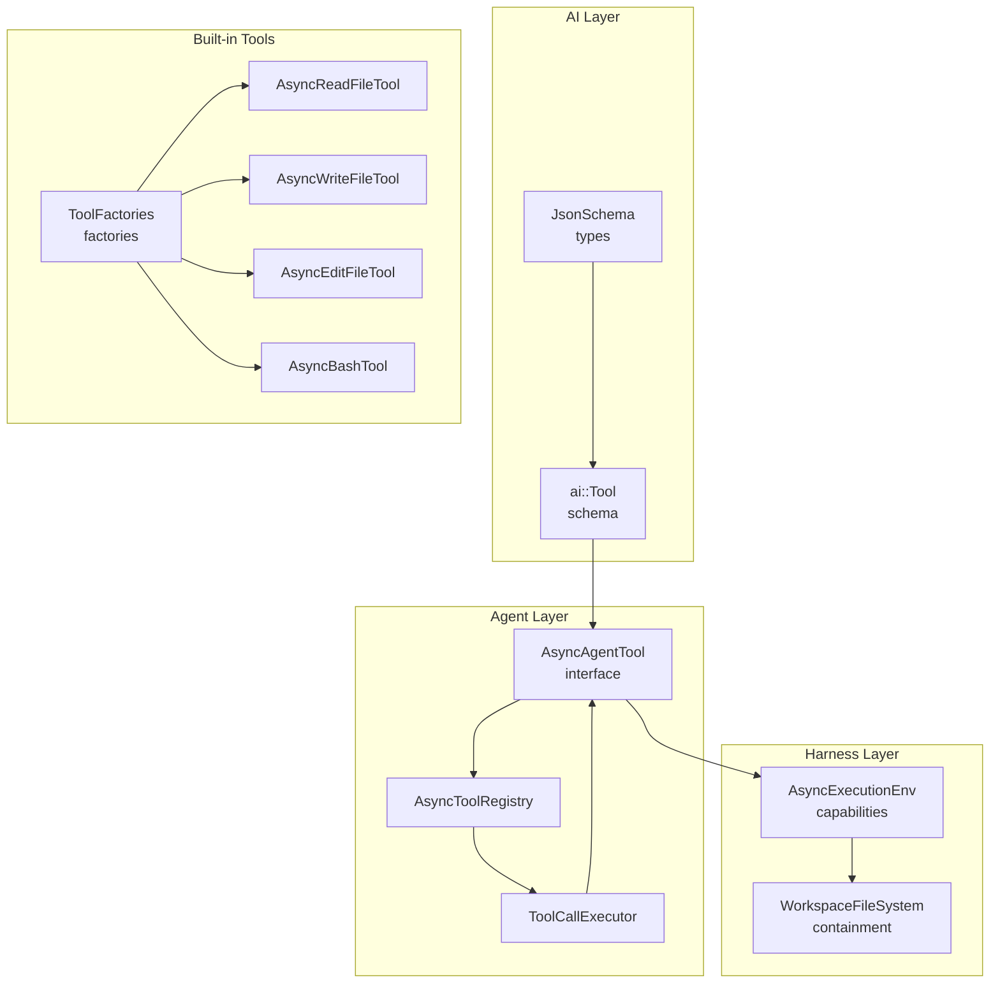
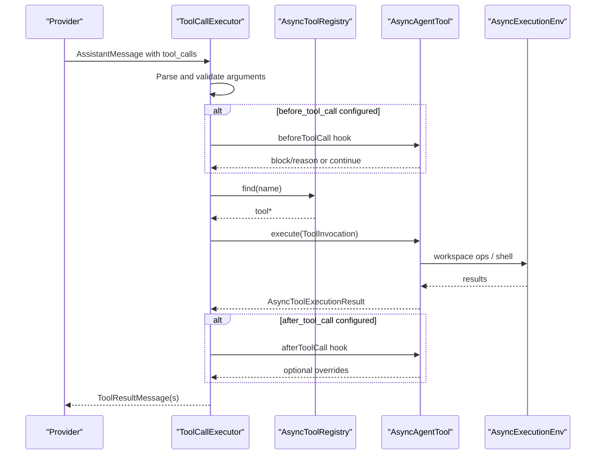
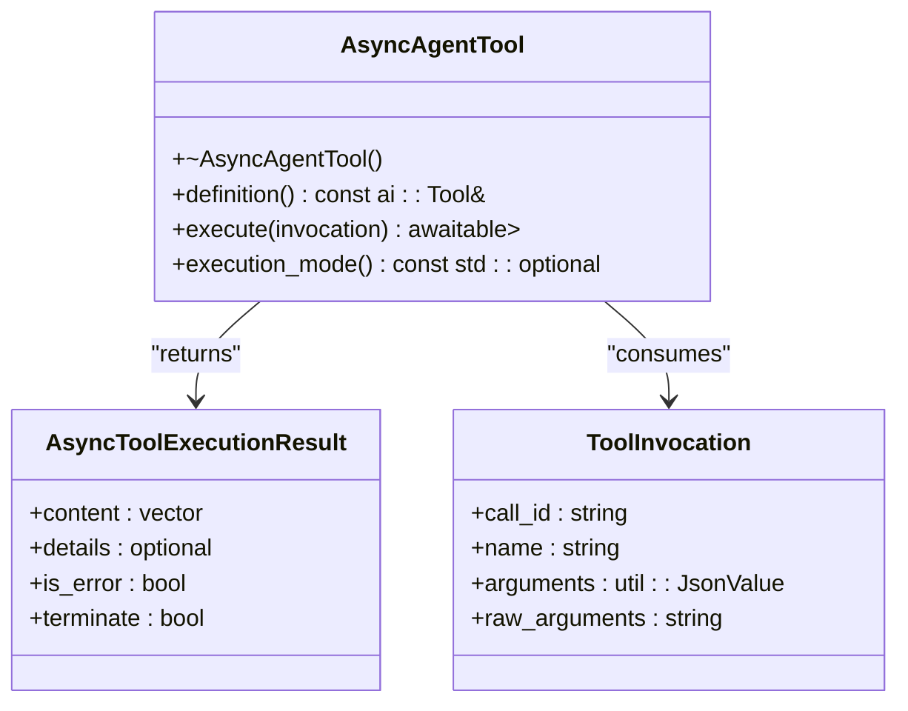
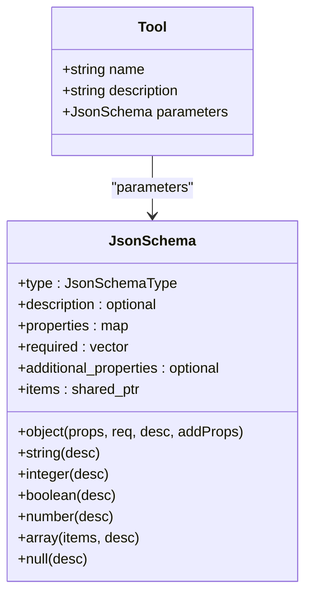
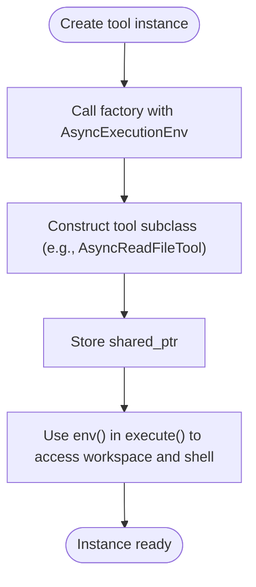
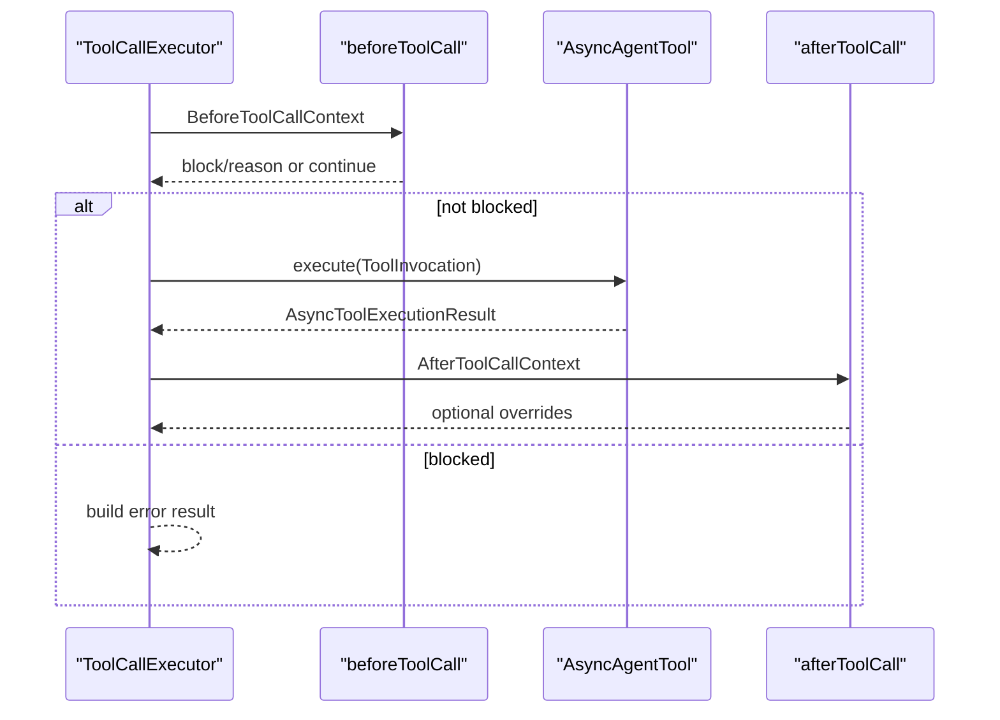
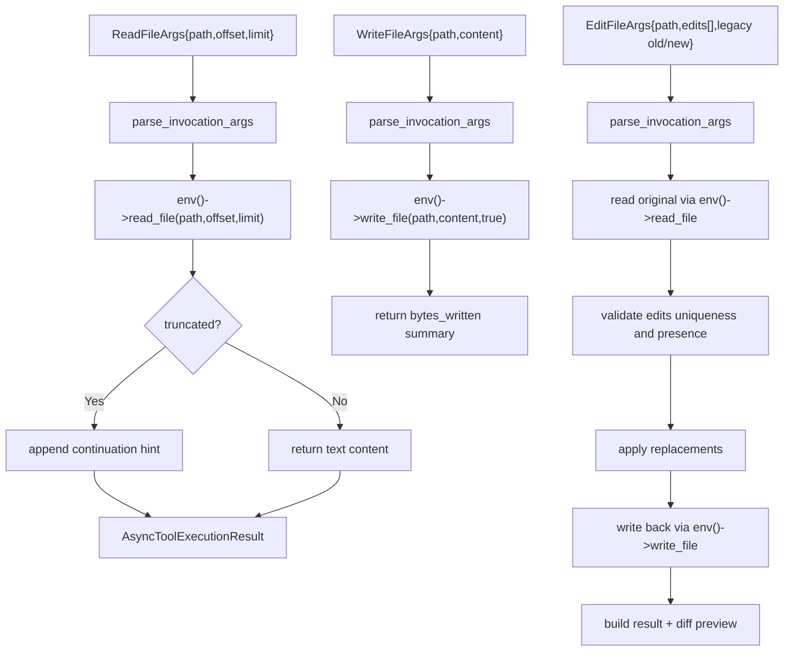
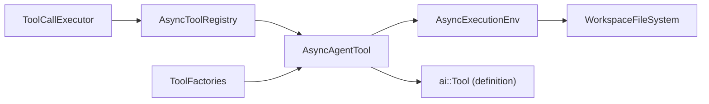

# Custom Tool Development

<cite>
**Referenced Files in This Document**
- [AgentTool.hpp](file://include/cch/agent/AgentTool.hpp)
- [Tool.hpp](file://include/cch/ai/Tool.hpp)
- [ToolFactories.hpp](file://include/cch/tools/ToolFactories.hpp)
- [AsyncToolFactories.cpp](file://src/tools/AsyncToolFactories.cpp)
- [ToolCallExecutor.hpp](file://src/agent/ToolCallExecutor.hpp)
- [ToolCallExecutor.cpp](file://src/agent/ToolCallExecutor.cpp)
- [ToolRegistry.hpp](file://include/cch/agent/ToolRegistry.hpp)
- [ExecutionEnv.hpp](file://include/cch/harness/ExecutionEnv.hpp)
- [WorkspaceFileSystem.hpp](file://src/harness/WorkspaceFileSystem.hpp)
- [AsyncToolsTest.cpp](file://tests/tools/AsyncToolsTest.cpp)
- [AsyncAgentLoopTest.cpp](file://tests/agent/AsyncAgentLoopTest.cpp)
- [ToolSchemaDtos.hpp](file://src/ai/glaze/ToolSchemaDtos.hpp)
- [2026-06-09-001-feat-cpp-coding-harness-plan.md](file://docs/plans/2026-06-09-001-feat-cpp-coding-harness-plan.md)
- [2026-06-10-003-refactor-coroutine-glaze-agent-stack-plan.md](file://docs/plans/2026-06-10-003-refactor-coroutine-glaze-agent-stack-plan.md)
- [2026-06-19-004-refactor-execution-env-capability-parity-plan.md](file://docs/plans/2026-06-19-004-refactor-execution-env-capability-parity-plan.md)
</cite>

## Table of Contents
1. [Introduction](#introduction)
2. [Project Structure](#project-structure)
3. [Core Components](#core-components)
4. [Architecture Overview](#architecture-overview)
5. [Detailed Component Analysis](#detailed-component-analysis)
6. [Dependency Analysis](#dependency-analysis)
7. [Performance Considerations](#performance-considerations)
8. [Security and Containment](#security-and-containment)
9. [Testing Strategies](#testing-strategies)
10. [Step-by-Step Examples](#step-by-step-examples)
11. [Troubleshooting Guide](#troubleshooting-guide)
12. [Conclusion](#conclusion)

## Introduction
This document explains how to develop custom tools for the agent harness. It covers the AsyncAgentTool interface, tool definition schema, parameter validation, execution contract, the tool factory pattern, execution hooks, security and containment, output sanitization, testing strategies, and practical examples ranging from simple file operations to external service integrations.

## Project Structure
The tool system centers around:
- Agent-side contracts and execution orchestration
- AI tool schema and JSON parameter validation
- Execution environment capabilities for workspace and process operations
- Built-in tools as reference implementations
- Registry and executor for tool lifecycle and batch execution

**Diagram sources**
- [AgentTool.hpp:64-76](file://include/cch/agent/AgentTool.hpp#L64-L76)
- [ToolRegistry.hpp:13-48](file://include/cch/agent/ToolRegistry.hpp#L13-L48)
- [ToolCallExecutor.hpp:31-62](file://src/agent/ToolCallExecutor.hpp#L31-L62)
- [Tool.hpp:97-101](file://include/cch/ai/Tool.hpp#L97-L101)
- [ExecutionEnv.hpp:198-334](file://include/cch/harness/ExecutionEnv.hpp#L198-L334)
- [WorkspaceFileSystem.hpp:31-819](file://src/harness/WorkspaceFileSystem.hpp#L31-L819)
- [ToolFactories.hpp:10-14](file://include/cch/tools/ToolFactories.hpp#L10-L14)
- [AsyncToolFactories.cpp:75-420](file://src/tools/AsyncToolFactories.cpp#L75-L420)

**Section sources**
- [AgentTool.hpp:64-76](file://include/cch/agent/AgentTool.hpp#L64-L76)
- [Tool.hpp:97-101](file://include/cch/ai/Tool.hpp#L97-L101)
- [ToolRegistry.hpp:13-48](file://include/cch/agent/ToolRegistry.hpp#L13-L48)
- [ToolCallExecutor.hpp:31-62](file://src/agent/ToolCallExecutor.hpp#L31-L62)
- [ExecutionEnv.hpp:198-334](file://include/cch/harness/ExecutionEnv.hpp#L198-L334)
- [WorkspaceFileSystem.hpp:31-819](file://src/harness/WorkspaceFileSystem.hpp#L31-L819)
- [ToolFactories.hpp:10-14](file://include/cch/tools/ToolFactories.hpp#L10-L14)
- [AsyncToolFactories.cpp:75-420](file://src/tools/AsyncToolFactories.cpp#L75-L420)

## Core Components
- AsyncAgentTool: Defines the tool contract with a definition() and an async execute() returning a structured result.
- ToolInvocation: Carries call_id, tool name, parsed arguments, and raw arguments.
- AsyncToolExecutionResult: Standardized tool result with content, optional details, and flags for error and termination.
- Tool schema (ai::Tool): Name, description, and JsonSchema parameters.
- Tool registry: Adds and finds tools by name; exposes definitions for provider emission.
- ToolCallExecutor: Executes tool batches sequentially or in parallel, honoring execution modes and applying before/after hooks.

**Section sources**
- [AgentTool.hpp:19-76](file://include/cch/agent/AgentTool.hpp#L19-L76)
- [Tool.hpp:97-101](file://include/cch/ai/Tool.hpp#L97-L101)
- [ToolRegistry.hpp:21-44](file://include/cch/agent/ToolRegistry.hpp#L21-L44)
- [ToolCallExecutor.hpp:19-62](file://src/agent/ToolCallExecutor.hpp#L19-L62)

## Architecture Overview
The tool lifecycle:
- Provider emits tool calls with arguments.
- ToolCallExecutor validates arguments, optionally invokes beforeToolCall hook, resolves tool via registry, executes tool, and optionally invokes afterToolCall hook.
- Results are emitted as tool-result messages with content and optional details.

**Diagram sources**
- [ToolCallExecutor.cpp:123-250](file://src/agent/ToolCallExecutor.cpp#L123-L250)
- [ToolCallExecutor.cpp:252-514](file://src/agent/ToolCallExecutor.cpp#L252-L514)
- [ToolRegistry.hpp:29-32](file://include/cch/agent/ToolRegistry.hpp#L29-L32)
- [AgentTool.hpp:68-70](file://include/cch/agent/AgentTool.hpp#L68-L70)
- [ExecutionEnv.hpp:207-221](file://include/cch/harness/ExecutionEnv.hpp#L207-L221)

## Detailed Component Analysis

### AsyncAgentTool Interface and Execution Contract
- definition(): Returns the ai::Tool describing name, description, and JSON schema for parameters.
- execute(ToolInvocation): Async function returning util::Expected<AsyncToolExecutionResult>.
- execution_mode(): Optional override to force sequential execution for a tool.

Key execution result fields:
- content: vector of ai::Content (e.g., text content).
- details: optional structured payload for diagnostics.
- is_error: indicates tool-reported failure.
- terminate: signals the agent to stop further processing.

**Diagram sources**
- [AgentTool.hpp:64-76](file://include/cch/agent/AgentTool.hpp#L64-L76)
- [AgentTool.hpp:26-31](file://include/cch/agent/AgentTool.hpp#L26-L31)
- [AgentTool.hpp:19-24](file://include/cch/agent/AgentTool.hpp#L19-L24)

**Section sources**
- [AgentTool.hpp:64-76](file://include/cch/agent/AgentTool.hpp#L64-L76)
- [AgentTool.hpp:26-31](file://include/cch/agent/AgentTool.hpp#L26-L31)
- [AgentTool.hpp:19-24](file://include/cch/agent/AgentTool.hpp#L19-L24)

### Tool Definition Schema and Parameter Validation
- ai::Tool holds name, description, and JsonSchema parameters.
- JsonSchema supports object, string, integer, number, boolean, array, and null with nested properties and arrays.
- Built-in tools demonstrate:
  - Object schema with required fields and descriptions.
  - Arrays of nested schemas (e.g., edit entries).
- ToolCallExecutor validates arguments and prefers structured JSON over raw provider text.

**Diagram sources**
- [Tool.hpp:97-101](file://include/cch/ai/Tool.hpp#L97-L101)
- [Tool.hpp:27-95](file://include/cch/ai/Tool.hpp#L27-L95)

**Section sources**
- [Tool.hpp:97-101](file://include/cch/ai/Tool.hpp#L97-L101)
- [Tool.hpp:27-95](file://include/cch/ai/Tool.hpp#L27-L95)
- [ToolCallExecutor.cpp:41-55](file://src/agent/ToolCallExecutor.cpp#L41-L55)
- [ToolSchemaDtos.hpp:14-30](file://src/ai/glaze/ToolSchemaDtos.hpp#L14-L30)

### Tool Factory Pattern and Programmatic Instance Creation
- Tool factories construct tool instances with a shared AsyncExecutionEnv.
- Factory functions:
  - make_async_read_file_tool
  - make_async_write_file_tool
  - make_async_edit_file_tool
  - make_async_bash_tool
- Built-in tools derive from AsyncToolBase, which stores the environment and validates it during execution.

**Diagram sources**
- [ToolFactories.hpp:10-14](file://include/cch/tools/ToolFactories.hpp#L10-L14)
- [AsyncToolFactories.cpp:404-420](file://src/tools/AsyncToolFactories.cpp#L404-L420)
- [AsyncToolFactories.cpp:60-73](file://src/tools/AsyncToolFactories.cpp#L60-L73)

**Section sources**
- [ToolFactories.hpp:10-14](file://include/cch/tools/ToolFactories.hpp#L10-L14)
- [AsyncToolFactories.cpp:404-420](file://src/tools/AsyncToolFactories.cpp#L404-L420)
- [AsyncToolFactories.cpp:60-73](file://src/tools/AsyncToolFactories.cpp#L60-L73)

### Tool Execution Hooks: beforeToolCall and afterToolCall
- BeforeToolCallHook: Receives BeforeToolCallContext; may block execution and supply a reason.
- AfterToolCallHook: Receives AfterToolCallContext; may override content, details, is_error, or set terminate.
- Hooks are invoked by ToolCallExecutor around tool.execute() and are protected against exceptions.

**Diagram sources**
- [ToolCallExecutor.cpp:64-90](file://src/agent/ToolCallExecutor.cpp#L64-L90)
- [ToolCallExecutor.cpp:173-225](file://src/agent/ToolCallExecutor.cpp#L173-L225)
- [ToolCallExecutor.cpp:288-437](file://src/agent/ToolCallExecutor.cpp#L288-L437)
- [AgentTool.hpp:61-62](file://include/cch/agent/AgentTool.hpp#L61-L62)
- [AgentTool.hpp:54-59](file://include/cch/agent/AgentTool.hpp#L54-L59)

**Section sources**
- [ToolCallExecutor.cpp:64-90](file://src/agent/ToolCallExecutor.cpp#L64-L90)
- [ToolCallExecutor.cpp:173-225](file://src/agent/ToolCallExecutor.cpp#L173-L225)
- [ToolCallExecutor.cpp:288-437](file://src/agent/ToolCallExecutor.cpp#L288-L437)
- [AgentTool.hpp:61-62](file://include/cch/agent/AgentTool.hpp#L61-L62)
- [AgentTool.hpp:54-59](file://include/cch/agent/AgentTool.hpp#L54-L59)

### Built-in Tools: Patterns and Behaviors
- AsyncReadFileTool: Reads workspace text with offset/limit, appends continuation hint when truncated.
- AsyncWriteFileTool: Creates or overwrites files; reports bytes written.
- AsyncEditFileTool: Validates exact, unique matches; supports legacy single-edit and modern edits[] arrays; generates a simple diff preview.
- AsyncBashTool: Requires explicit enablement; applies timeouts, strips ANSI, truncates output, and marks error on non-zero exit or timeout.

**Diagram sources**
- [AsyncToolFactories.cpp:51-58](file://src/tools/AsyncToolFactories.cpp#L51-L58)
- [AsyncToolFactories.cpp:94-115](file://src/tools/AsyncToolFactories.cpp#L94-L115)
- [AsyncToolFactories.cpp:136-151](file://src/tools/AsyncToolFactories.cpp#L136-L151)
- [AsyncToolFactories.cpp:187-273](file://src/tools/AsyncToolFactories.cpp#L187-L273)
- [AsyncToolFactories.cpp:308-381](file://src/tools/AsyncToolFactories.cpp#L308-L381)

**Section sources**
- [AsyncToolFactories.cpp:51-58](file://src/tools/AsyncToolFactories.cpp#L51-L58)
- [AsyncToolFactories.cpp:94-115](file://src/tools/AsyncToolFactories.cpp#L94-L115)
- [AsyncToolFactories.cpp:136-151](file://src/tools/AsyncToolFactories.cpp#L136-L151)
- [AsyncToolFactories.cpp:187-273](file://src/tools/AsyncToolFactories.cpp#L187-L273)
- [AsyncToolFactories.cpp:308-381](file://src/tools/AsyncToolFactories.cpp#L308-L381)

## Dependency Analysis
- ToolCallExecutor depends on AsyncToolRegistry and options for execution mode and hooks.
- Tools depend on AsyncExecutionEnv for workspace and shell operations.
- Built-in tools depend on WorkspaceFileSystem for containment and safety.
- Factories encapsulate tool construction and environment wiring.

**Diagram sources**
- [ToolCallExecutor.hpp:31-62](file://src/agent/ToolCallExecutor.hpp#L31-L62)
- [ToolRegistry.hpp:13-48](file://include/cch/agent/ToolRegistry.hpp#L13-L48)
- [AgentTool.hpp:64-76](file://include/cch/agent/AgentTool.hpp#L64-L76)
- [ExecutionEnv.hpp:198-334](file://include/cch/harness/ExecutionEnv.hpp#L198-L334)
- [WorkspaceFileSystem.hpp:31-819](file://src/harness/WorkspaceFileSystem.hpp#L31-L819)
- [ToolFactories.hpp:10-14](file://include/cch/tools/ToolFactories.hpp#L10-L14)

**Section sources**
- [ToolCallExecutor.hpp:31-62](file://src/agent/ToolCallExecutor.hpp#L31-L62)
- [ToolRegistry.hpp:13-48](file://include/cch/agent/ToolRegistry.hpp#L13-L48)
- [AgentTool.hpp:64-76](file://include/cch/agent/AgentTool.hpp#L64-L76)
- [ExecutionEnv.hpp:198-334](file://include/cch/harness/ExecutionEnv.hpp#L198-L334)
- [WorkspaceFileSystem.hpp:31-819](file://src/harness/WorkspaceFileSystem.hpp#L31-L819)
- [ToolFactories.hpp:10-14](file://include/cch/tools/ToolFactories.hpp#L10-L14)

## Performance Considerations
- Prefer sequential execution for tools that mutate shared state or rely on consistent ordering.
- Use parallel execution mode for independent tools when throughput matters and race conditions are avoided.
- Limit output sizes and apply truncation to reduce memory pressure and provider payload costs.
- Minimize synchronous blocking in favor of awaited operations to keep the agent loop responsive.

[No sources needed since this section provides general guidance]

## Security and Containment
- Workspace containment: All file operations are validated to stay within the workspace root, rejecting absolute paths, .. escapes, and symlink escapes.
- No-follow semantics: Listing and metadata use lstat-equivalent behavior to avoid traversing symlinks.
- Canonicalization: Resolved canonical paths must remain inside the workspace.
- Bash enablement: Disabled by default; explicit enablement required to run shell commands.
- Output sanitization: Built-in bash tool strips ANSI escape sequences and truncates output; consider similar measures for custom tools.

**Section sources**
- [WorkspaceFileSystem.hpp:47-68](file://src/harness/WorkspaceFileSystem.hpp#L47-L68)
- [WorkspaceFileSystem.hpp:134-182](file://src/harness/WorkspaceFileSystem.hpp#L134-L182)
- [WorkspaceFileSystem.hpp:434-450](file://src/harness/WorkspaceFileSystem.hpp#L434-L450)
- [2026-06-19-004-refactor-execution-env-capability-parity-plan.md:109-110](file://docs/plans/2026-06-19-004-refactor-execution-env-capability-parity-plan.md#L109-L110)
- [AsyncToolFactories.cpp:384-399](file://src/tools/AsyncToolFactories.cpp#L384-L399)

## Testing Strategies
- Mock environments: Implement AsyncExecutionEnv fakes capturing inputs and returning controlled outputs.
- Structured arguments: Prefer structured JSON over raw provider text to exercise typed parsing.
- Error scenarios: Validate containment violations, duplicate edit matches, missing edits, and disabled bash behavior.
- Integration patterns: Use the same executor options and hooks as production to ensure parity.

**Section sources**
- [AsyncToolsTest.cpp:22-63](file://tests/tools/AsyncToolsTest.cpp#L22-L63)
- [AsyncToolsTest.cpp:89-232](file://tests/tools/AsyncToolsTest.cpp#L89-L232)
- [AsyncAgentLoopTest.cpp:443-476](file://tests/agent/AsyncAgentLoopTest.cpp#L443-L476)

## Step-by-Step Examples

### Example 1: Simple File Read Tool
- Define ai::Tool with object schema for path, offset, limit.
- Parse arguments with parse_invocation_args.
- Validate inputs and use env()->read_file to fetch content.
- Return AsyncToolExecutionResult with text content and optional continuation hints.

**Section sources**
- [AsyncToolFactories.cpp:79-115](file://src/tools/AsyncToolFactories.cpp#L79-L115)
- [AsyncToolFactories.cpp:51-58](file://src/tools/AsyncToolFactories.cpp#L51-L58)

### Example 2: File Write Tool
- Define ai::Tool with path and content parameters.
- Parse arguments and call env()->write_file with create_parents flag.
- Report bytes written in result content.

**Section sources**
- [AsyncToolFactories.cpp:122-151](file://src/tools/AsyncToolFactories.cpp#L122-L151)

### Example 3: Edit File Tool (Single Replacement)
- Support legacy old_text/new_text and modern edits[].
- Validate uniqueness and presence of oldText.
- Compute a minimal diff preview and return result.

**Section sources**
- [AsyncToolFactories.cpp:158-273](file://src/tools/AsyncToolFactories.cpp#L158-L273)

### Example 4: External Service Integration (HTTP)
- Implement AsyncAgentTool with a definition() returning a function tool.
- Use an injected AsyncExecutionEnv or a service client to perform HTTP calls.
- Validate inputs via JsonSchema and parse with parse_invocation_args.
- Return structured content and details; mark is_error on failures.

[No sources needed since this section describes a conceptual extension]

## Troubleshooting Guide
Common issues and remedies:
- Invalid arguments: Ensure arguments conform to the tool’s JsonSchema; ToolCallExecutor prefers structured JSON.
- Workspace containment errors: Verify paths are relative and do not escape the workspace.
- Bash disabled: Enable bash in the environment or configure the tool to be allowed.
- Hook exceptions: beforeToolCall and afterToolCall are wrapped; inspect error messages for hook failures.
- Parallel execution pitfalls: For tools mutating shared state, prefer sequential execution mode.

**Section sources**
- [ToolCallExecutor.cpp:41-55](file://src/agent/ToolCallExecutor.cpp#L41-L55)
- [WorkspaceFileSystem.hpp:47-68](file://src/harness/WorkspaceFileSystem.hpp#L47-L68)
- [AsyncToolFactories.cpp:308-381](file://src/tools/AsyncToolFactories.cpp#L308-L381)
- [ToolCallExecutor.cpp:64-90](file://src/agent/ToolCallExecutor.cpp#L64-L90)

## Conclusion
The tool system provides a robust, secure, and extensible framework for integrating agent capabilities. By adhering to the AsyncAgentTool contract, defining precise JSON schemas, leveraging the execution environment for safe operations, and using hooks for behavior injection, you can implement reliable tools that integrate seamlessly with the agent loop.